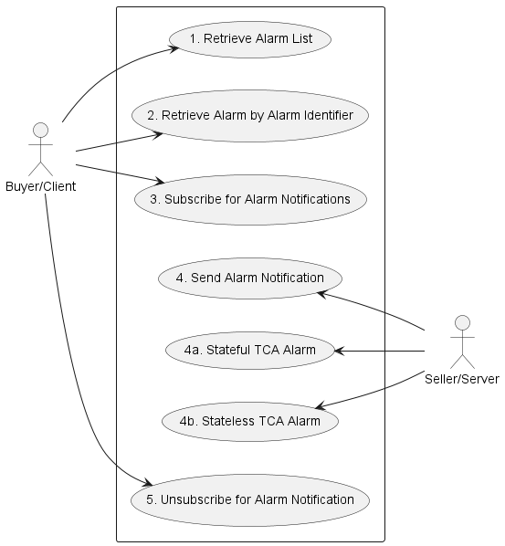
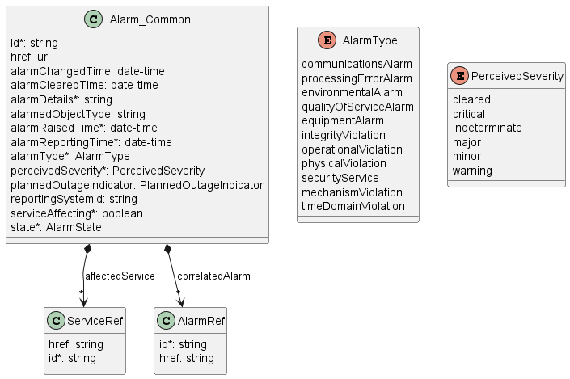
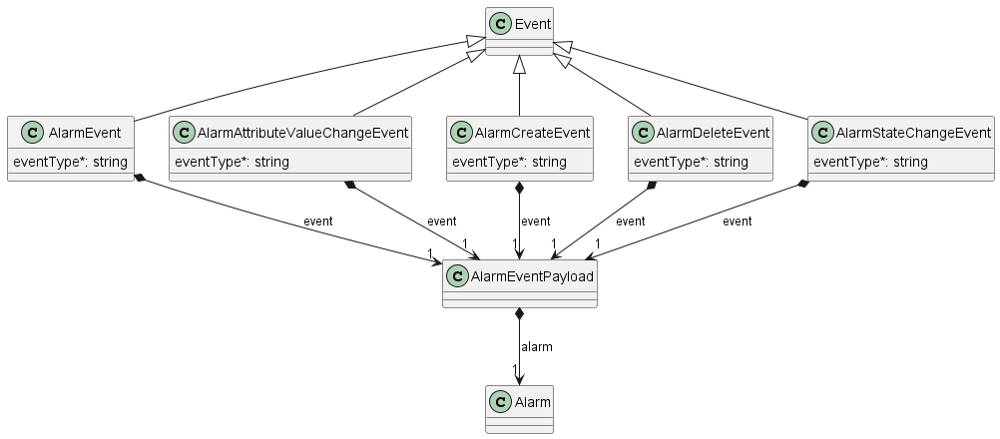
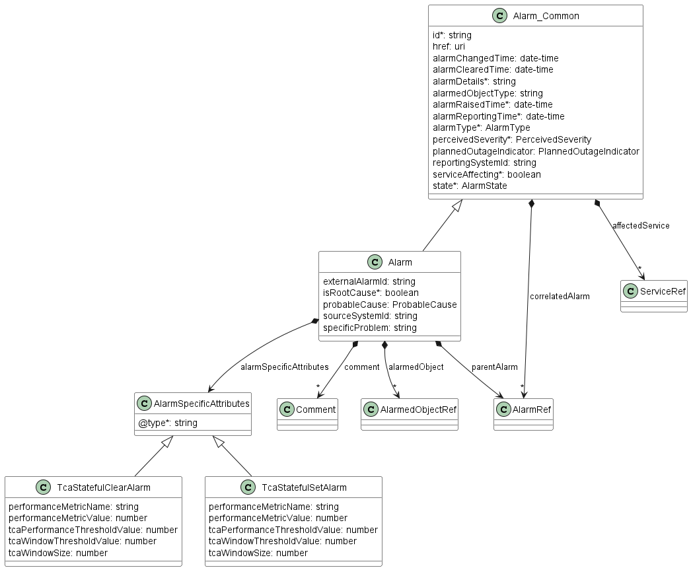

<style>
img
{
  display:block;
  float:none;
  margin-left:auto;
  margin-right:auto;
}
</style>


<div style="font-weight:bold; font-size:33pt; font-family: Sansation;  text-align:center">
Working Draft
</br>
MEF W146 v0.2
</br>
</br>
LSO Allegro, LSO Interlude and LSO Legato Alarms and Threshold Crossing Alerts (Alarms) API - Developer Guide
</br>
<p style="color:red;font-weight:bold; font-size:18pt">This draft represents MEF work in progress and is subject to change.</p>
</br>
June 2025
<p style="color:red;font-weight:bold; font-size:18pt">EXPORT CONTROL: This document contains technical data. The download, export, re-export or disclosure of the technical data contained in this document may be restricted by applicable U.S. or foreign export laws, regulations and rules and/or applicable U.S. or foreign sanctions ("Export Control Laws or Sanctions"). You agree that you are solely responsible for determining whether any Export Control Laws or Sanctions may apply to your download, export, reexport or disclosure of this document, and for obtaining (if available) any required U.S. or foreign export or reexport licenses and/or other required authorizations.</p>
</div>

<div class="page"/>

**Disclaimer**

© MEF Forum 2025. All Rights Reserved.

The information in this publication is freely available for reproduction and
use by any recipient and is believed to be accurate as of its publication date.
Such information is subject to change without notice and MEF Forum (MEF) is not
responsible for any errors. MEF does not assume responsibility to update or
correct any information in this publication. No representation or warranty,
expressed or implied, is made by MEF concerning the completeness, accuracy, or
applicability of any information contained herein and no liability of any kind
shall be assumed by MEF as a result of reliance upon such information.

The information contained herein is intended to be used without modification by
the recipient or user of this document. MEF is not responsible or liable for
any modifications to this document made by any other party.

The receipt or any use of this document or its contents does not in any way
create, by implication or otherwise:

- (a) any express or implied license or right to or under any patent,
  copyright, trademark or trade secret rights held or claimed by any MEF member
  which are or may be associated with the ideas, techniques, concepts or
  expressions contained herein; nor

- (b) any warranty or representation that any MEF member will announce any
  product(s) and/or service(s) related thereto, or if such announcements are
  made, that such announced product(s) and/or service(s) embody any or all of
  the ideas, technologies, or concepts contained herein; nor

- (c) any form of relationship between any MEF member and the recipient or user
  of this document.

Implementation or use of specific MEF standards, specifications or
recommendations will be voluntary, and no Member shall be obliged to implement
them by virtue of participation in MEF Forum. MEF is a non-profit international
organization to enable the development and worldwide adoption of agile, assured
and orchestrated network services. MEF does not, expressly or otherwise,
endorse or promote any specific products or services.

**Copyright**

© MEF Forum 2025. Any reproduction of this document, or any portion thereof,
shall contain the following statement: "Reproduced with permission of MEF
Forum." No user of this document is authorized to modify any of the information
contained herein.

<div class="page"/>

**Table of Contents**

<!-- code_chunk_output -->
- [List of Contributing Members](#list-of-contributing-members)
- [1. Abstract](#1-abstract)
- [2. Terminology and Abbreviations](#2-terminology-and-abbreviations)
- [3. Compliance Levels](#3-compliance-levels)
- [4. Introduction](#4-introduction)
  - [4.1. Description](#41-description)
  - [4.2. Conventions in the Document](#42-conventions-in-the-document)
  - [4.3. Relation to Other Documents](#43-relation-to-other-documents)
  - [4.4. Approach](#44-approach)
  - [4.5. High-Level Flow](#45-high-level-flow)
- [5. API Description](#5-api-description)
  - [5.1. High-level use cases](#51-high-level-use-cases)
  - [5.2. API Endpoint and Operation Description](#52-api-endpoint-and-operation-description)
    - [5.2.1. Seller/Server side API Endpoints](#521-sellerserver-side-api-endpoints)
    - [5.2.2. Buyer/Client side API Endpoints](#522-buyerclient-side-api-endpoints)
  - [5.3. Integration of Alarm Specification into Threshold Crossing Alerts (Alarms) API](#53-integration-of-alarm-specification-into-threshold-crossing-alerts-alarms-api)
  - [5.4. Model structure and validation](#54-model-structure-and-validation)
  - [5.5. Security Considerations](#55-security-considerations)
- [6. API Interactions and Flows](#6-api-interactions-and-flows)
  - [6.1. Use Case 1: Retrieve List of Alarms](#61-use-case-1-retrieve-list-of-alarms)
  - [6.2. Use Case 2: Retrieve Alarm by Alarm Identifier](#62-use-case-2-retrieve-alarm-by-alarm-identifier)
  - [6.3. Use Case 3: Subscribe to Alarms](#63-use-case-3-subscribe-to-alarms)
  - [6.4. Use Case 4: Send Alarm Notification](#64-use-case-4-send-alarm-notification)
    - [6.4.1 Use Case 4a: Stateful TCA Alarm](#641-use-case-4a-stateful-tca-alarm)
    - [6.4.2 Use Case 4b: Stateless TCA Alarm](#642-use-case-4b-stateless-tca-alarm)
  - [6.5. Use Case 5: Unregister for Alarm Notifications](#65-use-case-5-unregister-for-alarm-notifications)
- [7. API Details](#7-api-details)
  - [7.1. API patterns](#71-api-patterns)
    - [7.1.1. Indicating errors](#711-indicating-errors)
      - [7.1.1.1. Type Error](#7111-type-error)
      - [7.1.1.2. Type Error400](#7112-type-error400)
      - [7.1.1.3. `enum` Error400Code](#7113-enum-error400code)
      - [7.1.1.4. Type Error401](#7114-type-error401)
      - [7.1.1.5. `enum` Error401Code](#7115-enum-error401code)
      - [7.1.1.6. Type Error403](#7116-type-error403)
      - [7.1.1.7. `enum` Error403Code](#7117-enum-error403code)
      - [7.1.1.8. Type Error404](#7118-type-error404)
      - [7.1.1.9. Type Error409](#7119-type-error409)
      - [7.1.1.10. Type Error422](#71110-type-error422)
      - [7.1.1.11. `enum` Error422Code](#71111-enum-error422code)
      - [7.1.1.12. Type Error500](#71112-type-error500)
      - [7.1.1.13. Type Error501](#71113-type-error501)
  - [7.2. API Data model](#72-api-data-model)
    - [7.2.1 Alarm](#721-alarm)
      - [7.2.1.1 Type Alarm](#7211-type-alarm)
      - [7.2.1.2 Type AlarmedObjectRef](#7212-type-alarmedobjectref)
      - [7.2.1.3 Type AlarmRef](#7213-type-alarmref)
      - [7.2.1.4 Type AlarmSpecificAttributes](#7214-type-alarmspecificattributes)
      - [7.2.1.5 `enum` AlarmState](#7215-enum-alarmstate)
      - [7.2.1.6 `enum` AlarmType](#7216-enum-alarmtype)
      - [7.2.1.7 Type Alarm\_Common](#7217-type-alarm_common)
      - [7.2.1.8 Type Comment](#7218-type-comment)
      - [7.2.1.9 `enum` PerceivedSeverity](#7219-enum-perceivedseverity)
      - [7.2.1.10 `enum` PlannedOutageIndicator](#72110-enum-plannedoutageindicator)
      - [7.2.1.11 `enum` ProbableCause](#72111-enum-probablecause)
      - [7.2.1.12 Type ServiceRef](#72112-type-serviceref)
    - [7.2.2 TCA Alarm](#722-tca-alarm)
      - [7.2.2.1 Type TcaStatefulClearAlarm](#7221-type-tcastatefulclearalarm)
      - [7.2.2.2 Type TcaStatefulSetAlarm](#7222-type-tcastatefulsetalarm)
      - [7.2.2.3 Type TcaStatelessAlarm](#7223-type-tcastatelessalarm)
    - [7.2.3. Notification registration](#723-notification-registration)
      - [7.2.3.2. Type EventSubscription](#7232-type-eventsubscription)
      - [7.2.3.1. Type EventSubscriptionInput](#7231-type-eventsubscriptioninput)
  - [7.3. Notification API Data model](#73-notification-api-data-model)
    - [7.3.1. Type Event](#731-type-event)
    - [7.3.2. Type AlarmAttributeValueChangeEvent](#732-type-alarmattributevaluechangeevent)
    - [7.3.3. Type AlarmCreateEvent](#733-type-alarmcreateevent)
    - [7.3.4. Type AlarmDeleteEvent](#734-type-alarmdeleteevent)
    - [7.3.5. Type AlarmEvent](#735-type-alarmevent)
    - [7.3.6. Type AlarmEventPayload](#736-type-alarmeventpayload)
    - [7.3.7. Type AlarmStateChangeEvent](#737-type-alarmstatechangeevent)
- [8. References](#8-references)

<!-- /code_chunk_output -->

<div style="page-break-after: always;"></div>

# List of Contributing Members

The following members of the MEF participated in the development of this
document and have requested to be included in this list.

| Member |
| ------ |
|        |
|        |
|        |

**Table 1. Contributing Members**

# 1. Abstract

This standard is intended to assist the implementation of the Application
Programming Interfaces (APIs) for the Alarm ManagementAPI functionality of 
the Service Orchestration Function at the LSO Allegro, LSO Interlude and LSO 
Legato Interface Reference Points (IRPs), for which requirements and use cases
are defined in MEF W133.1 [[MEF W133.1](#8-references)]. The requirements and use 
cases are the same for all IRPs. This standard consists of this document and 
complementary API definitions for Alarms and Threshold Crossing Alerts.

This standard normatively incorporates the following files by reference as if
they were part of this document from the GitHub repository:

[MEF-LSO-Allegro-SDK](https://github.com/MEF-GIT/MEF-LSO-Allegro-SDK)

- `serviceApi/alarm/alarmManagement.api.yaml`
- `serviceApi/alarm/alarmNotification.api.yaml`

[MEF-LSO-Interlude-SDK](https://github.com/MEF-GIT/MEF-LSO-Interlude-SDK)

- `serviceApi/alarm/alarmManagement.api.yaml`
- `serviceApi/alarm/alarmNotification.api.yaml`

[MEF-LSO-Legato-SDK](https://github.com/MEF-GIT/MEF-LSO-Legato-SDK)

- `serviceApi/alarm/alarmManagement.api.yaml`
- `serviceApi/alarm/alarmNotification.api.yaml`

The Threshold Crossing Alerts (Alarms) API is defined using OpenAPI 3.0 
[[OAS-V3](#8-references)]

<div class="page"/>

# 2. Terminology and Abbreviations

This section aims to clarify the terminology used throughout this document. 
In many cases, the authoritative definitions of terms can be found in separate 
documents. To ensure accuracy and consistency, the third column of this document
serves to provide the appropriate references from MEF or external sources that 
govern these definitions.

In addition, terms defined in the standards referenced below are included in
this document by reference and are not repeated in the table below:

- MEF W133.1 _Allegro, Interlude and Legato Fault Management and Performance Monitoring BR&UC_ [[MEF W133.1](#8-references)]
- MEF 55.1 _Lifecycle Service Orchestration (LSO): Reference Architecture and
  Framework_ [[MEF 55.1](#8-references)]

| **Term**                            | **Definition**                                                                                                                                                                   																																								| **Source**                                                                         |
| ----------------------------------- | ----------------------------------------------------------------------------------------------------------------------------------------------------------------------------------------------------------------------------------------------------------------------------------------------------------------------------------------------- | ---------------------------------------------------------------------------------- |
| Alarm                               | A specific type of notification concerning detected faults or abnormal conditions.           																																								                                                                                    | MEF W133.1                                                                         |
| API Endpoint                        | The endpoint of a communication channel (the complete URL of an API Resource) to which the HTTP-REST requests are addressed to operate on the _API Resource_.           																																								        | [rapidapi.com](https://rapidapi.com/blog/api-glossary/endpoint/)<br>This document  |
| API Resource                        | A REST Resource. In REST, the primary data representation is called Resource. In this document, _API Resource_ is defined as an OAS _SchemaObject_ with specified _API Endpoints_.																																								| [restfulapi.net](https://restfulapi.net/resource-naming/)<br>This document         |
| Notification                        | In general, a mechanism used to inform the recipient about certain event in the system. In context of this document notification is a synchronous communication from the observed system towards recipient                                                                                                                                      | MEF W133.1                                                                         |
| OpenAPI                             | The OpenAPI 3.0 Specification, formerly known as the Swagger specification is an API description format for REST APIs.                                                           																																								| [spec.openapis.org](http://spec.openapis.org/oas/v3.0.3)                           |
| Operation                           | An interaction between the Server and Client, potentially involving multiple back-and-forth transactions.                                                                              																																							| This document                                                                      |
| REST API							  | Representational State Transfer. REST provides a set of architectural constraints that, when applied as a whole, emphasizes scalability of component interactions, generality of interfaces, independent deployment of components, and intermediary components to reduce interaction latency, enforce security, and encapsulate legacy systems.	| [REST API](http://www.ics.uci.edu/~fielding/pubs/dissertation/rest_arch_style.htm) |
| SchemaObject                        | The construct that allows the definition of input and output data types. These types can represent object classes, as well as primitives and array specifications.              																																								| [spec.openapis.org](http://spec.openapis.org/oas/v3.0.3#schema-object)             |
| Threshold Crossing Alert            | Mechanism used to monitor and notify when specific thresholds or performance limits are exceeded or crossed.    																																			                                                                                    | MEF W133.1                                                                         |

**Table 2. Terminology**

| **Term** | **Definition**                                                                               | **Source**                                               |
|----------|----------------------------------------------------------------------------------------------|----------------------------------------------------------|
| API      | Application Programming Interface. In this document, API is used synonymously with REST API. | This document                                            |
| Buyer/Client      | Business Applications                                                                        | MEF 55.1                                                 |
| CUS      | Customer Application Coordinator															  | MEF 55.1                                                 |
| IRP      | Interface Reference Point                                                                    | This document                                            |
| OAS      | OpenAPI Specification                                                                        | [openapis.org](https://www.openapis.org/faq/style-guide) |
| TCA	   | Threshold Crossing Alert																	  | MEF W133.1				                                 |
| Seller/Server      | Service Orchestration Functionality                                                | MEF 55.1                                                 |

**Table 3. Abbreviations**

# 3. Compliance Levels

The key words **"MUST"**, **"MUST NOT"**, **"REQUIRED"**, **"SHALL"**, **"SHALL
NOT"**, **"SHOULD"**, **"SHOULD NOT"**, **"RECOMMENDED"**, **"NOT
RECOMMENDED"**, **"MAY"**, and **"OPTIONAL"** in this document are to be
interpreted as described in BCP 14 (RFC 2119 [[RFC2119](#8-references)], RFC
8174 [[RFC8174](#8-references)]) when, and only when, they appear in all
capitals, as shown here. All key words must be in bold text.

Items that are **REQUIRED** (contain the words **MUST** or **MUST NOT**) are
labeled as **[Rx]** for required. Items that are **RECOMMENDED** (contain the
words **SHOULD** or **SHOULD NOT**) are labeled as **[Dx]** for desirable.
Items that are **OPTIONAL** (contain the words MAY or OPTIONAL) are labeled as
**[Ox]** for optional.

A paragraph preceded by **[CRa]<** specifies a conditional mandatory
requirement that **MUST** be followed if the condition(s) following the "<"
have been met. For example, **"[CR1]<[D38]"** indicates that Conditional
Mandatory Requirement 1 must be followed if Desirable Requirement 38 has been
met. A paragraph preceded by **[CDb]<** specifies a Conditional Desirable
Requirement that **SHOULD** be followed if the condition(s) following the "<"
have been met. A paragraph preceded by **[COc]<**specifies a Conditional
Optional Requirement that **MAY** be followed if the condition(s) following the
"<" have been met.

<div class="page"/>

# 4. Introduction


The Threshold Crossing Alerts (Alarms) API allows the Buyer to retrieve alarms as 
well as receive notifications.
An alarm is a signal or notification designed to alert listening client of condition 
or event that requires attention or intervention. The alarm can indicate that a 
Threshold Crossing Alert (TCA) has been crossed, which is independent of the state 
of the service.

This standard specification document describes the Application Programming
Interface (API) for Alarm Managment functionality of the LSO Allegro
Interface Reference Point (IRP), LSO Interlude Interface Reference Point (IRP)
and LSO Sonata IRP as defined in the _MEF 55.1 Lifecycle Service Orchestration
(LSO): Reference Architecture and Framework_ [[MEF55.1](#8-references)]. The 
LSO Reference Architecture is shown in Figure 1 with the three IRPs 
highlighted.


**Figure 1. The LSO Reference Architecture**

## 4.1. Description
The scope of this API and Developer Guide covers
- Alarm Managment
  - Includes retrieval of Alarms
- Alarm Notification
  - Includes Event Subscription/Hub and Listener notification functions

The business requirements and use cases for Threshold Crossing Alerts (Alarms) API are defined 
in MEF W133.1 Allegro, Interlude and Legato Fault Management and Performance
Monitoring BR&UC [MEFW133.1](#8-references).

This document supports interactions over the Legato interface within a single
operator as well as interaction with Partner Domain and Customer Domain
through Interlude and Allegro interfaces respectively.

Business Applications (Buyer/Client), Customer Application Coordinator (CUS) and
Service Orchestration Functionality systems use the information contained
within this document.

This standard is intended to support the design of API implementations that
enable interoperable Seller/Server operations (in the scope of this standard) across the
Allegro IRP, Interlude IRP, and Legato IRP.

## 4.2. Conventions in the Document

- Code samples are formatted using code blocks. When notation `<< some text >>`
  is used in the payload sample it indicates that a comment is provided instead
  of an example value, and it might not comply with the OpenAPI definition.
- Model definitions are formatted as in-line code (e.g. `Alarm`).
- In UML diagrams the default cardinality of associations is `0..1`. Other
  cardinality markers are compliant with the UML standard.
- In the API details tables and UML diagrams required attributes are marked
  with a `*` next to their names.
- In UML sequence diagrams `{{variable}}` notation is used to indicate a
  variable to be substituted with a correct value.

## 4.3. Relation to Other Documents

This API implements the Threshold Crossing Alerts (Alarms) related requirements and use
cases that are defined in MEF W133.1 [[MEFW133.1](#8-references)]. The API 
definition builds on TMF Open API (v5.0.0) for Alarm Management API
[TMF 642](#8-references).

## 4.4. Approach

As presented in Figure 2. the Allegro, Interlude, and Legato API frameworks
consist of three structural components:

- Generic API framework
- Service-independent information (Function-specific information and
  Function-specific operations)
- Service-specific information (MEF service specification data model)


**Figure 2. Allegro, Interlude and Legato API Structure**

The essential concept behind the framework is to decouple the common structure,
information, and operations from the specific alarm information content.
Firstly, the Generic API Framework defines a set of design rules and patterns
that are applied across all Allegro, Interlude, and Legato APIs.
Secondly, the alarm-independent information of the framework focuses on a
model of a particular Allegro, Interlude, or Legato functionality and is
agnostic to any of the alarm specifications. For example, this standard 
describes the Alarm Model and operations that enable the management of 
alarms aligned with either MEF or custom alarm specifications.


This Developer Guide does not define MEF alarm specifications, but it can be 
used in conjunction with any alarm specifications defined by or compliant 
with MEF.

Figure 3 presents the relationship between the Alarm Managemnt API 
entities and the alarm specification model.
The `alarmSpecificAttributes` serves as an extension point for 
configuring alarm-specific parameters.


**Figure 3. Alarm specification for Allegro, Interlude, Legato**

## 4.5. High-Level Flow

The Threshold Crossing Alerts (Alarms) API allows the Buyer to retrieve alarms and receive
notifications when an alarm is created, deleted, acknowledged, unacknowledged, commented or
cleared. This enables timely detection and resolution of faults related to alarms provided 
by the Seller.


**Figure 4. High-Level Flow**

The following steps describe the high-level flow:

- The Buyer/Client registers listeners for notifications related to alarms
via the Hub. <br>**_Note1_**: Alarm Notifications are optional 
and do not impact end-to-end flow
- When fault or abnormal codition is identified the SOF creates an `Alarm`
in the Server/Seller system
- (optional) The Seller/Server sends the `Alarm` notification to a buyer.
- The Buyer/Client system retrieves `Alarm` through _Alarm API_
<div class="page"/>

# 5. API Description

This section presents the API structure and design patterns. It starts with the
high-level use cases diagram. Then it describes the REST endpoints with use
case mapping. Next, it explains the design pattern that is used
to combine alarm-agnostic and alarm-specific parts of API payloads.
Finally, payload validation and API security aspects are discussed.

## 5.1. High-level use cases

Figure 5 presents a high-level use case diagram. It aims to help understand
the endpoint mapping. Use cases are described extensively in
[chapter 6](#6-api-interactions-and-flows).



**Figure 5. Use cases**

## 5.2. API Endpoint and Operation Description

### 5.2.1. Seller/Server side API Endpoints

**Base URL for Allegro**:

`https://{{serverBase}}:{{port}}{{?/sof_prefix}}/mefApi/allegro/alarmManagement/v2/`

**Base URL for Interlude**:

`https://{{serverBase}}:{{port}}{{?/sof_prefix}}/mefApi/interlude/alarmManagement/v2/`

**Base URL for Legato**:

`https://{{serverBase}}:{{port}}{{?/sof_prefix}}/mefApi/legato/alarmManagement/v2/`

The following API endpoints are implemented by the Seller/Server and
allow the Buyer/Client to retrieve `Alarm` instances. The endpoints and
corresponding data model are defined in `serviceApi/alarm/alarmManagement.api.yaml`.

| API Endpoint                        | Description                                                                                              | MEF W133.1 Use Case Mapping |
|-------------------------------------|----------------------------------------------------------------------------------------------------------|-----------------------------|
| `GET /alarm`                        | The Buyer/Client requests a list of Alarms based on a set of filter criteria.                            | UC 49: Retrieve Alarm List           |
| `GET /alarm/{{id}}`                 | The Buyer/Client requests detailed information about a single Alarm                                      | UC 50: Retrieve Alarm by Identifier  |

**Table 4. Seller/Server mandatory API endpoints**

**[R1]** Seller/Server **MUST** support all API endpoints listed in 
Table 4.

API endpoints listed in Table 5 are optional and may be exposed by the Seller/Server.

| API Endpoint           | Description                                                                                                                   | MEF W133.1 Use Case Mapping      |
| ---------------------- | ----------------------------------------------------------------------------------------------------------------------------- | -------------------------------- |
| `POST /hub`            | The Buyer/Client or Administrator requests to subscribe to the Alarm Notifications.                                           | UC 51: Subscribe to Alarms       |
| `GET /hub/{{id}}`      | The Buyer/Client or Administrator retrieves a specific `EventSubscription` from the Seller/Server, that matches the _`id`_ value provided as _`path`_ parameter.           |
| `DELETE /hub/{{id}}`   | The Buyer/Client or Administrator requests to unsubscribe from the Alarm Notifications.                                        | UC 52: Un-Subscribe from Alarms |

**Table 5. Seller/Server optional API endpoints**

**[R2]** Seller/Server MUST **MUST** support API endpoints listed in Table 5. 

### 5.2.2. Buyer/Client side API Endpoints

**Base URL for Allegro**:

`https://{{serverBase}}:{{port}}{{?/sof_prefix}}/mefApi/allegro/alarmNotification/v2/`

**Base URL for Interlude**:

`https://{{serverBase}}:{{port}}{{?/sof_prefix}}/mefApi/interlude/alarmNotification/v2/`

**Base URL for Legato**:

`https://{{serverBase}}:{{port}}{{?/sof_prefix}}/mefApi/legato/alarmNotification/v2/`

The following API Endpoints are used by Seller/Server to post notifications to registered
Buyer/Client listeners. The endpoints and corresponding data model are defined in
`serviceApi/alarm/alarmNotification.api.yal`

| API Endpoint                                       | Description                                                                                                  | MEF W133.1 Use Case Mapping       |
| ---------------------------------------------------| -------------------------------------------------------------------------------------------------------------| --------------------------------- |
| `POST /listener/alarmAttributeValueChangeEvent`    | A request initiated by the Seller/Server to notify Buyer/Client on `Alarm` instance attribute value change.  | UC 48: Send Alarm Notification    |
| `POST /listener/alarmCreateEvent`                  | A request initiated by the Seller/Server to notify Buyer/Client on `Alarm` instance create.                  | UC 48: Send Alarm Notification    |
| `POST /listener/alarmDeleteEvent`                  | A request initiated by the Seller/Server to notify Buyer/Client on `Alarm` instance delete.                  | UC 48: Send Alarm Notification    |
| `POST /listener/alarmStateChangeEvent`             | A request initiated by the Seller/Server to notify Buyer/Client on `Alarm` instance state change.            | UC 48: Send Alarm Notification    |

**Table 6. Buyer/Client API endpoints**

**[R3]** The Buyer/Client **MUST** support API endpoints listed in Table 6.

**[R4]** The Buyer/Client **MUST** register to receive Alarm Notifications.

**[R5]** The Seller/Server **MUST** support sending notifications to API 
endpoints listed in Table 6 to the registered Buyer/Client.

## 5.3. Integration of Alarm Specification into Threshold Crossing Alerts (Alarms) API

The Threshold Crossing Alerts (Alarms) API data model discussed in this document is a generic envelope
that enables the management of relevant alarm objects. The API data model itself does not provide explicit
definitions or prescribe the structure for different types of alarms. However, it offers flexible 
extensibility to accommodate the configuration of alarm-specific objectives, allowing for customization
and adaptation to various requirements. The Threshold Crossing Alerts (Alarms) API schema is defined 
using JSON Schema Draft 7 [JSON Schema draft 7](#8-references) and can be integrated into the `Alarm` 
using the TMF extension pattern.

The extension hosting type in the API data model is:

- `AlarmSpecificAttributes` - this type is extended with Alarm
   Specific attributes that define how a Test is performed for a given Test Specification.  
  
The `@type` attribute of those extension hosting types must be set to a value 
that uniquely identifies the service testing configuration. A unique 
identifier for MEF standard service schemas is in URN format and is assigned 
by MEF. This identifier is provided as root schema `$id`.
Use of non-MEF standard service testing configuration is allowed. In such 
a case the schema identifier must be agreed upon between the Buyer/Client and
the Seller/Server.

The example below shows a header of a schema, which describes the TCA Stateless 
Alarm Configuration configuration, where `urn:mef:lso:spec:legato:tca-stateless-alarm:v0.0.1:all` 
is the above-mentioned URN:

```yaml
"$schema": "http://json-schema.org/draft-07/schema#"
"$id": "urn:mef:lso:spec:legato:tca-stateless-alarm:v0.0.1:all"
title: TCA Stateless Alarm Configuration
```

Alarm specific configuration payload is introduced in Threshold Crossing Alerts (Alarms) API entities through
a `alarmSpecificAttributes` attribute of type 
`AlarmSpecificAttributes` which is used as an extension point for 
configuration attributes.

Implementations might choose to integrate selected Threshold Crossing Alerts (Alarms) API
specifications to data model during development e.g. TCA Alarm. In such a case 
an integrated data model is built, and alarm specifications are in an inheritance 
relationship with either `AlarmSpecificAttributes` as described in the OAS specification.
This pattern is called **Static Binding**. The snippets below present an 
example of a static binding of the envelope API with exemplary MEF TCA Alarm 
specifications.

```yaml
    AlarmSpecificAttributes:
      type: object
      description: AlarmSpecificAttributes is used as an extension for Alarm specific
        payload.  The @type attribute is used as a discriminator.
      discriminator:
        mapping:
          urn:mef:lso:spec:legato:tca-stateful-set-alarm:v0.0.1:all: '#/components/schemas/TcaStatefulSetAlarm'
          urn:mef:lso:spec:legato:tca-stateless-alarm:v0.0.1:all: '#/components/schemas/TcaStatelessAlarm'
          urn:mef:lso:spec:legato:tca-stateful-clear-alarm:v0.0.1:all: '#/components/schemas/TcaStatefulClearAlarm'
        propertyName: '@type'
      properties:
        '@type':
          type: string
          description: The named type must be a subclass of AlarmSpecificAttributes.
          enum:
          - urn:mef:lso:spec:legato:tca-stateful-set-alarm:v0.0.1:all
          - urn:mef:lso:spec:legato:tca-stateless-alarm:v0.0.1:all
          - urn:mef:lso:spec:legato:tca-stateful-clear-alarm:v0.0.1:all
      required:
      - '@type'
```

```yaml
    TcaStatelessAlarm:
      allOf:
      - $ref: '#/components/schemas/AlarmSpecificAttributes'
      - type: object
        description: Threshold Crossing Alert Alarm Schema.
```


Alternatively, implementations might choose not to build an integrated model
and choose a different mechanism allowing runtime validation of
alarm-specific fragments of the payload. The system can validate a given
monitoring configuration against a new schema without redeployment. This 
pattern is called **Dynamic Binding.**

Regardless of the chosen implementation pattern, the HTTP payload is the same. 
Both implementation approaches must conform to the requirements specified below.

**[R6]** `AlarmSpecificAttributes` type is
extension points that **MUST** be used to integrate alarm specific 
properties into a request/response payload.

**[R7]** The `@type` property of `AlarmSpecificAttributes` **MUST** 
be used to specify the type of the extending entity.

**[R8]** Attributes specified in the payload must conform to the alarm
definition specified in the `@type` property.


**Figure 6. The Extension Pattern with Sample Alarm-Specific Extension**

Figure 6 presents two MEF Threshold Crossing Alerts (Alarms) API schema that represent 
alarm configuration for TCA Stateles Alarm. When this schema is used, the `@type` of 
`AlarmSpecificAttributes` takes`"urn:mef:lso:spec:legato:tca-stateless-alarm:v0.0.1:all"` 
value to indicate which alarm specification should be used to interpret aset of 
alarm-specific attributes included in the payload.

## 5.4. Model structure and validation

The structure of the payloads exchanged via Allegro, Interlude, and Legato 
Threshold Crossing Alerts (Alarms) API endpoints is defined using:

- OpenAPI version 3.0 for the service-agnostic part of the payload
- JsonSchema (draft 7) for the alarm-specific part of the payload

**[R9]** Implementations **MUST** use payloads that conform to these
definitions. The Buyer and the Seller **MUST NOT** use any operation, 
entity or attribute that is not explicitly defined or allowed by this standard.

## 5.5. Security Considerations

Although the Legato IRP is internal to a Service Provider/Operator business
boundary, it is expected that some minimal security mechanisms are in place for
any communication over this IRP. There must also be authorization mechanisms in
place to control what a particular Buyer/Client or Seller/Server is allowed to do and 
what information may be obtained. For Allegro and Interlude IRPs, security 
should follow rules for external communication.
The definition of the exact security mechanism and configuration is outside
the scope of this document. The LSO Security mechanisms are defined by MEF 128.1
_LSO API Security Profiles_ [[MEF128.1](#8-references)].

<div class="page"/>

# 6. API Interactions and Flows

This section provides a detailed insight into the API functionality, use cases,
and flows. It starts with Table 7 presenting a list and short description of
all business use cases then present the variants of end-to-end interaction
flows, and in the following subchapters describe the API usage flow and
examples for each of the use cases.

| Use Case # | Use Case Name                                                  | Use Case Description                                                                                                                    | MEF 133.1 Use Case # |
| ---------- | -------------------------------------------------------------- | --------------------------------------------------------------------------------------------------------------------------------------- | ---------------------|
| 1          | Retrieve Alarm List                                             | The Buyer/Client requests a list of Alarms based on a set of filter criteria. The Seller/Server returns a summarized list of Alarms.   | 49                   |
| 2          | Retrieve Alarm by Alarm  Identifier                             | The Buyer/Client requests detailed information about a single Alarm based on the Alarm Identifier.                                     | 50                   |
| 3          | Subscribe to Alarm  Notifications                               | The Buyer/Client requests to subscribe to Alarm Notifictions.                                                                          | 51                   |
| 4          | Send Alarm Notification                                         | A Seller/Server sends an Alarm to the Buyer/Client based on an event that has occurred.                                                | 48                   |
| 4a         | Stateful TCA Alarm                                              | A Stateful TCA Alarm is initiated by the Seller/Server to a subscribed Client.                                                         | 53                   |
| 4b         | Stateless TCA Alarm                                             | A Stateless TCA lifecycle alarm is initiated by the Seller/Server to a subscribed Client.                                              | 54                   |
| 5          | Usubscribe for Alarm Notifications                              | The Buyer/Client requests to unsubscribe to Alarm and/or Test Job Notifications.                                                       | 52                   |


**Table 7. Use cases description**

## 6.1. Use Case 1: Retrieve List of Alarms

The Buyer/Client can retrieve a list of `Alarm_Find` using the 
`GET /alarm` operation with the desired filtering criteria.

**[R10]** The Buyer/Client Retrieve List of Alarms request **MUST**
 contain none or more of the following   attributes as filter criteria: [MEFW133.1 R138]

- `id`
- `alarmDetails`
- `alarmChangedTime.gt`
- `alarmChangedTime.lt`
- `alarmClearedTime.gt`
- `alarmClearedTime.lt`
- `alarmReportingTime.gt`
- `alarmReportingTime.lt`
- `alarmType`
- `alarmedObjectType`
- `perceivedSeverity`
- `plannedOutageIndicator`
- `reportingSystemId`
- `serviceAffecting`
- `state`
- `affectedServiceId`
- `correlatedAlarmId`


```
https://serverRoot/mefApi/legato/alarmManagement/v2/alarm?alarmChangedTime.gt="2024-08-12T23:20:50.52Z"&limit=10&offset=0
```

The example above shows a Buyer/Client's request to get all Alarms
objects created after `2024-08-12T23:20:50.52Z`. Additionally, the Buyer/Client asks 
only for a first (`offset=0`) pack of 10 results (`limit=10`) to be returned. 
The correct response (HTTP code `200`) in the response body contains a list of 
`Alarm_Find` objects matching the criteria. To get all the details, 
the Buyer/Client has to query a specific `Alarm` by its `id`. 
Details related to pagination are described in [section 7.1.2](#712-response-pagination)

If the quantity of the records requested to be returned exceeds a Seller/Server 
policy, the Seller/Server must choose to respond with either:
- An empty list and message that indicates the result set is too large or
- A response that indicates the result is too large and includes a subset of the
matching Alarms.

**[R11]** The Seller/Server MUST support the Retrieve Alarm List Use Case. [MEFW133.1 R139]

**[R12]** The Buyer/Client MUST support the Retrieve Alarm List Use Case. [MEFW133.1 R140]

**[R13]** The Seller/Server's response to the Buyer’s/Client’s Retrieve List of Alarms
**MUST** include all attributes that were provided as filter criteria. In addition, the 
following attributes **MUST** be also included in the response. [MEFW133.1 R141]
- `id`
- `alarmDetails`
- `alarmReportingTime`
- `alarmType`
- `perceivedSeverity`
- `state`

**[O1]** The Seller response MAY contain any of the remaining Alarm attributes [MEFW133.1 O25]

**[R14]** In case no items matching the criteria are found, the Seller/Server 
**MUST** return a valid response with an empty list. 

**[R15]** If the request is unsuccessful, the Seller/Server MUST return an error with explanation 
to the Buyer/Client. 



**Figure 7. Use Case 1: Retrieve Alarm List - Model**

## 6.2. Use Case 2: Retrieve Alarm by Alarm Identifier

The Buyer/Client can get detailed information about the Alarm 
from the Seller/Server by using a `GET /Alarm/{{id}}` operation. 
The payload returned in the response is a full representation of the Alarm. 

**[R16]** The Seller/Server MUST support the Retrieve Alarm by Identifier Use Case [MEFW133.1 R142]

**[R17]** The Buyer/Client MUST support the Retrieve Alarm by Identifier Use Case [MEFW133.1 R143]

**[R18]** The Buyer’s Retrieve Alarm by Alarm Identifier **MUST** 
include the Alarm Identifier. [MEFW133.1 R144]

**[R19]** The Buyer’s Retrieve Alarm by Alarm Identifier **MUST NOT** 
include other attributes. [MEFW133.1 R145]

**[R20]** If the request is successful, the Seller’s response to a Retrieve Alarm
by Alarm Identifier request MUST  include all attributes

**[R21]** If the request is unsuccessful, the Seller/Server MUST return an error with
explanation to the Buyer/Client.

**[R22]** In case `id` does not allow finding a `Alarm` in 
Seller/Server's system, an error response `Error404` **MUST** be returned. 


**Figure 8. Use Case 2: Retrieve Alarm by Alarm Identifier - Model**

## 6.3. Use Case 3: Subscribe to Alarms

The Buyer/Client can recive Alarms by subscribing to notifications. 
An exemplary use case for exchanging alarms is presented in Figure 9. 


**Figure 9. Alarm Notification Example**

The Seller/Server communicates with the Buyer/Client with Alarm Notifications provided 
that:

- Buyer/Client supports a notification mechanism
- Buyer/Client has registered to receive Alarms from the Seller/Server

To register for alarms the Buyer/Client uses the `registerListener` 
operation from the API: `POST /hub`. The request contains only two attributes:

- `callback` - mandatory, to provide the callback address the alarm notifications will be sent to,
- `query`- optional, to provide the required types of event.

Figure 10 shows all entities involved in the Notification use cases.



**Figure 10. Threshold Crossing Alerts (Alarms) API Notification Data Model**

By using a request in the following snippet, 

```json
{
  "callback": "https://client.mef.com/listenerEndpoint"
}
```
the Buyer/Client subscribes for alarms of all types of events. Those are:

- `alarmAttributeValueChangeEvent`
- `alarmCreateEvent`
- `alarmDeleteEvent`
- `alarmStateChangeEvent`


**[R23]** The Seller/Server **MUST** support subscription to Alarms Use Case.

**[R24]** The Seller/Server **MUST** support unsubscribing from Alarms Use Case.

**[R25]** The Buyer/Client’s Subscribe to Alarms request 
**MUST** include: [MEFW133.1 R146]
- Callback address

If the Buyer/Client wishes to receive only notifications of a certain type, a 
`query` parameter must be added to the request:

```json
{
  "callback": "https://client.mef.com/listenerEndpoint",
  "query": "alarmCreateEvent"
}
```
The Seller/Server responds to the subscription request by adding the `id` of the
subscription to the message that must be further used for unsubscribing.

```json
{
  "id": "00000000-0000-0000-0000-000000000678",
  "query": "eventType = alarmCreateEvent",
  "callback": "https://client.mef.com/listenerEndpoint"
}
```

Example of a final address that the Notifications will be sent to:

- `https://client.mef.com/listenerEndpoint/mefApi/legato/alarmNotification/v2/listener/alarmCreateEvent`

**[R26]** If successful, the Seller/Server response **MUST** indicate success and include the 
Register Notification Identifier and echo back all Buyer/Client provided attributes.

**[R27]** If successful, the Seller/Server **MUST** begin sending the alarms to the Buyer/Client.

**[R28]** The Seller/Server **MUST NOT** send alarms if the Buyer/Client has not registered for them.

**[R29]** If unsuccessful, the Seller/Server **MUST NOT** return a Register Notification Identifier.

**[R30]**	If the Seller/Server experiences any errors, they **MUST** return an error indication to the Buyer/Client.

If the Buyer/Client wishes to subscribe to more than one different types of events, there are two possible
syntax variants [TMF630]:

```json
eventType=alarmCreateEvent,alarmStateChangeEvent
```
or
```json
eventType=alarmCreateEvent&eventType=alarmStateChangeEvent
```


## 6.4. Use Case 4: Send Alarm Notification

Alarms are used to asynchronously inform the Buyer/Client about detected faults or 
abnormal conditions. The Seller/Server can send the following types of alarm notifications to 
the Buyer/Client:

- `alarmAttributeValueChangeEvent`
- `alarmCreateEvent`
- `alarmDeleteEvent`
- `alarmStateChangeEvent`

The Figure below shows all entities involved in the Send Alarm Notification use cases.


**Figure 11. Use Case 4: Alarm - Model**

The following snippets present an example of an `Alarm` object sent from the Seller/Server to
Buyer/Client that has subscribed for Alarms.

```json
{
    "id": "alarm-20250601-001",
    "href": "https://serverRoot/mefApi/legato/alarmManagement/v2/alarm/alarm-20250601-001",
    "affectedService": [
      {
        "href": "https://serverRoot/mefApi/legato/service/service-123",
        "id": "service-123"
      }
    ],
    "alarmChangedTime": "2025-06-01T14:52:57.382Z",
    "alarmClearedTime": "2025-06-01T14:52:57.382Z",
    "alarmDetails": "TCA clear: Latency has dropped below the defined threshold",
    "alarmedObjectType": "ServiceEndpoint",
    "alarmRaisedTime": "2025-06-01T14:50:00.000Z",
    "alarmReportingTime": "2025-06-01T14:52:57.382Z",
    "correlatedAlarm": [
      {
        "id": "alarm-20250601-000",
        "href": "https://serverRoot/mefApi/legato/alarmManagement/v2/alarm/alarm-20250601-000"
      }
    ],
    "alarmType": "qualityOfServiceAlarm",
    "perceivedSeverity": "cleared",
    "plannedOutageIndicator": "inPlannedMaintenance",
    "reportingSystemId": "monitoring-system-01",
    "serviceAffecting": false,
    "state": "acknowledged",
    "alarmedObject": [
      {
        "id": "endpoint-456",
        "href": "https://serverRoot/objects/endpoint-456",
        "@referredType": "ServiceEndpoint"
      }
    ],
    "comment": [
      {
        "description": "Cleared automatically by system upon recovery",
        "systemIdentifier": "auto-clear-daemon",
        "time": "2025-06-01T14:53:00.000Z",
        "userIdentifier": "system"
      }
    ],
    "externalAlarmId": "ext-789-clear",
    "isRootCause": true,
    "parentAlarm": {
      "id": "alarm-20250601-000",
      "href": "https://serverRoot/mefApi/legato/alarmManagement/v2/alarm/alarm-20250601-000"
    },
    "probableCause": "adapterError",
    "alarmSpecificAttributes": {
      "@type": "urn:mef:lso:spec:service:tca-stateful-clear-alarm:v0.0.1:all",
      "performanceMetricName": "oneWayFrameDelay",
      "performanceMetricValue": 7.2,
      "tcaPerformanceThresholdValue": 10.0,
      "tcaWindowThresholdValue": 9.0,
      "tcaWindowSize": 5
    },
    "sourceSystemId": "probe-east-01",
    "specificProblem": "Latency spike resolved below threshold"
  }
  
```

**[R31]** The Seller/Server **MUST** include the following Alarm attributes: [MEFW133.1 R137]
- `id`
- `alarmDetails`
- `alarmedObject`
- `alarmRaisedTime`
- `alarmReportingTime`
- `alarmType`
- `perceivedSeverity`
- `serviceAffecting`
- `state`
- `ìsRootCause`


**[R32]** The Seller/Server **MUST** send Alarms to the Buyer/Client that 
has registered for them.

**[R33]** The Seller/Server **MUST NOT** send Alarms to Buyer/Client 
that has not registered for them.

### 6.4.1 Use Case 4a: Stateful TCA Alarm

The Figure 12 shows all entities involved in Stateful TCA Alarm use case



*Figure 12. Use Case 4a: Stateful TCA Alarm - Model**

**[R34]** When sending an alarm for a TCA Reporting Type of Stateful, the Seller/Server **MUST** include `alarmType=qualityOfServiceAlarm` and the following mandatory attributes: [MEFW133.1 R147]

- `performanceMetricName`
- `performanceMetricValue`
- `tcaPerformanceThresholdValue`
- `tcaWindowThresholdValue`
- `tcaWindowSize`

### 6.4.2 Use Case 4b: Stateless TCA Alarm
The Figure 13 shows all entities involved in Stateless TCA Alarm use case


*Figure 13. Use Case 4b: Stateless TCA Alarm - Model**

**[R35]** When sending an alarm for a TCA Reporting Type of Stateless, the Seller/Server **MUST** include `alarmType=qualityOfServiceAlarm` and the following mandatory attributes: [MEFW133.1 R150]

- `performanceMetricName`
- `performanceMetricValue`
- `tcaPerformanceThresholdValue`
- `numberOfPmMetricCalculationIntervals`

**[R36]** If the Damping Factor is included in the TCA Profile, the TCA Alarm MUST include the `dampingFactor` attribute. [MEFW133.1 R151]


## 6.5. Use Case 5: Unregister for Alarm Notifications

To stop receiving alarms, the Buyer/Client has to use the `unregisterListener`
operation from the `DELETE /hub/{id}` endpoint. The `id` is the identifier
received from the Seller/Server during the listener registration.

**[R37]** If successful, the Seller/Server response **MUST** indicate success

**[R38]** If successful, the Seller/Server **MUST** stop sending the appropriate alarms 
to the Buyer/Client.

**[R39]**	If unsuccessful, the Seller/Server **MUST NOT** stop sending the appropriate
alarms to the Buyer/Client.

**[R40]**	If the Seller/Server experiences any errors, they **MUST** return an error indication
to the Buyer/Client.

<div class="page"/>

# 7. API Details

## 7.1. API patterns

### 7.1.1. Indicating errors

Erroneous situations are indicated by appropriate HTTP responses. An error
response is indicated by HTTP status 4xx (for client errors) or 5xx (for server
errors) and appropriate response payload. The Address Validation API uses the
error responses depicted and described below.

Implementations can use http error codes not specified in this standard in
compliance with rules defined in RFC 7231 [[RFC7231](#8-references)]. In such
case the error message body structure might be aligned with the `Error`.


**Figure 51. Data model types to represent an erroneous response**

#### 7.1.1.1. Type Error

**Description:** Standard Class used to describe API response error Not intended to be used directly. The `code` in the HTTP header is used as a discriminator for the type of error returned in runtime.

<table id="T_Error">
    <thead style="font-weight:bold;">
        <tr>
            <td>Name</td>
            <td>Type</td>
            <td>Description</td>
        </tr>
    </thead>
    <tbody>
        <tr>
            <td>message</td>
            <td>string</td>
            <td>Text that provides mode details and corrective actions related to the error. This can be shown to a client user.</td>
        </tr><tr>
            <td>reason*</td>
            <td>string<br/><span style="font-size:10px;font-style:italic">maxLength = 255</span></td>
            <td>Text that explains the reason for the error. This can be shown to a client user.</td>
        </tr><tr>
            <td>referenceError</td>
            <td>uri<br/><span style="font-size:10px;font-style:italic">format = uri</span></td>
            <td>URL pointing to documentation describing the error</td>
        </tr>
    </tbody>
</table>

#### 7.1.1.2. Type Error400

**Description:** Bad Request. (https://tools.ietf.org/html/rfc7231#section-6.5.1)

Inherits from:
- <a href="#T_Error">Error</a>

<table id="T_Error400">
    <thead style="font-weight:bold;">
        <tr>
            <td>Name</td>
            <td>Type</td>
            <td>Description</td>
        </tr>
    </thead>
    <tbody>
        <tr>
            <td>code*</td>
            <td><a href="#T_Error400Code">Error400Code</a></td>
            <td>One of the following error codes:
- missingQueryParameter: The URI is missing a required
query-string parameter
- missingQueryValue: The URI is missing a required query-string
parameter value
- invalidQuery: The query section of the URI is invalid.
- invalidBody: The request has an invalid body
</td>
        </tr>
    </tbody>
</table>

#### 7.1.1.3. `enum` Error400Code

**Description:** One of the following error codes:
- missingQueryParameter: The URI is missing a required query-string
parameter
- missingQueryValue: The URI is missing a required query-string
parameter value
- invalidQuery: The query section of the URI is invalid.
- invalidBody: The request has an invalid body


<table id="T_Error400Code">
    <thead style="font-weight:bold;">
        <tr>
            <td>Value</td>
            <td>MEF 133.1</td>
        </tr>
    </thead>
    <tbody>
        <tr>
            <td>missingQueryParameter</td>
            <td>MISSING_QUERY_PARAMETER</td>
        </tr><tr>
            <td>missingQueryValue</td>
            <td>MISSING_QUERY_VALUE</td>
        </tr><tr>
            <td>invalidQuery</td>
            <td>INVALID_QUERY</td>
        </tr><tr>
            <td>invalidBody</td>
            <td>INVALID_BODY</td>
        </tr>
    </tbody>
</table>

#### 7.1.1.4. Type Error401

**Description:** Unauthorized.  (https://tools.ietf.org/html/rfc7235#section-3.1)

Inherits from:
- <a href="#T_Error">Error</a>

<table id="T_Error401">
    <thead style="font-weight:bold;">
        <tr>
            <td>Name</td>
            <td>Type</td>
            <td>Description</td>
        </tr>
    </thead>
    <tbody>
        <tr>
            <td>code*</td>
            <td><a href="#T_Error401Code">Error401Code</a></td>
            <td>One of the following error codes:
- missingCredentials: No credentials provided.
- invalidCredentials: Provided credentials are invalid or
expired
</td>
        </tr>
    </tbody>
</table>

#### 7.1.1.5. `enum` Error401Code

**Description:** One of the following error codes:
- missingCredentials: No credentials provided.
- invalidCredentials: Provided credentials are invalid or expired


<table id="T_Error401Code">
    <thead style="font-weight:bold;">
        <tr>
            <td>Value</td>
            <td>MEF 133.1</td>
        </tr>
    </thead>
    <tbody>
        <tr>
            <td>missingCredentials</td>
            <td>MISSING_CREDENTIALS</td>
        </tr><tr>
            <td>invalidCredentials</td>
            <td>INVALID_CREDENTIALS</td>
        </tr>
    </tbody>
</table>

#### 7.1.1.6. Type Error403

**Description:** Forbidden. This code indicates that the server understood the request but refuses to authorize it. (https://tools.ietf.org/html/rfc7231#section-6.5.3)

Inherits from:
- <a href="#T_Error">Error</a>

<table id="T_Error403">
    <thead style="font-weight:bold;">
        <tr>
            <td>Name</td>
            <td>Type</td>
            <td>Description</td>
        </tr>
    </thead>
    <tbody>
        <tr>
            <td>code*</td>
            <td><a href="#T_Error403Code">Error403Code</a></td>
            <td>This code indicates that the server understood
the request but refuses to authorize it because
of one of the following error codes:
- accessDenied: Access denied
- forbiddenRequester: Forbidden requester
- tooManyUsers: Too many users</td>
        </tr>
    </tbody>
</table>

#### 7.1.1.7. `enum` Error403Code

**Description:** This code indicates that the server understood
the request but refuses to authorize it because
of one of the following error codes:
- accessDenied: Access denied
- forbiddenRequester: Forbidden requester
- tooManyUsers: Too many users


<table id="T_Error403Code">
    <thead style="font-weight:bold;">
        <tr>
            <td>Value</td>
            <td>MEF 133.1</td>
        </tr>
    </thead>
    <tbody>
        <tr>
            <td>accessDenied</td>
            <td>ACCESS_DENIED</td>
        </tr><tr>
            <td>forbiddenRequester</td>
            <td>FORBIDDEN_REQUESTER</td>
        </tr><tr>
            <td>tooManyUsers</td>
            <td>TOO_MANY_USERS</td>
        </tr>
    </tbody>
</table>

#### 7.1.1.8. Type Error404

**Description:** Resource for the requested path not found. (https://tools.ietf.org/html/rfc7231#section-6.5.4)

Inherits from:
- <a href="#T_Error">Error</a>

<table id="T_Error404">
    <thead style="font-weight:bold;">
        <tr>
            <td>Name</td>
            <td>Type</td>
            <td>Description</td>
        </tr>
    </thead>
    <tbody>
        <tr>
            <td>code*</td>
            <td>string</td>
            <td>The following error code:
- notFound: A current representation for the target resource
not found
</td>
        </tr>
    </tbody>
</table>

#### 7.1.1.9. Type Error409

**Description:** Conflict (https://datatracker.ietf.org/doc/html/rfc7231#section-6.5.8)

Inherits from:
- <a href="#T_Error">Error</a>

<table id="T_Error409">
    <thead style="font-weight:bold;">
        <tr>
            <td>Name</td>
            <td>Type</td>
            <td>Description</td>
        </tr>
    </thead>
    <tbody>
        <tr>
            <td>code*</td>
            <td>string</td>
            <td>The following error code:
- conflict: The client has provided a value whose semantics are
not appropriate for the property.
</td>
        </tr>
    </tbody>
</table>

#### 7.1.1.10. Type Error422

The response for HTTP status `422` is a list of elements that are structured
using the `Error422` data type. Each list item describes a business validation
problem. This type introduces the `propertyPath` attribute which points to the
erroneous property of the request, so that the Buyer may fix it easier. It is
highly recommended that this property should be used, yet remains optional
because it might be hard to implement.

**Description:** Unprocessable entity due to a business validation problem. (https://tools.ietf.org/html/rfc4918#section-11.2)

Inherits from:
- <a href="#T_Error">Error</a>

<table id="T_Error422">
    <thead style="font-weight:bold;">
        <tr>
            <td>Name</td>
            <td>Type</td>
            <td>Description</td>
        </tr>
    </thead>
    <tbody>
        <tr>
            <td>code*</td>
            <td><a href="#T_Error422Code">Error422Code</a></td>
            <td>One of the following error codes:
  - missingProperty: The property the Seller has expected is not present in the payload
  - invalidValue: The property has an incorrect value
  - invalidFormat: The property value does not comply with the expected value format
  - referenceNotFound: The object referenced by the property cannot be identified in the Seller system
  - unexpectedProperty: Additional property, not expected by the Seller has been provided
  - tooManyRecords: the number of records to be provided in the response exceeds the Seller&#x27;s threshold.
  - otherIssue: Other problem was identified (detailed information provided in a reason)
</td>
        </tr><tr>
            <td>propertyPath</td>
            <td>string</td>
            <td>A pointer to a particular property of the payload that caused the validation issue. It is highly recommended that this property should be used.
Defined using JavaScript Object Notation (JSON) Pointer (https://tools.ietf.org/html/rfc6901).
</td>
        </tr>
    </tbody>
</table>

#### 7.1.1.11. `enum` Error422Code

**Description:** One of the following error codes:
  - missingProperty: The property the Seller has expected is not present in the payload
  - invalidValue: The property has an incorrect value
  - invalidFormat: The property value does not comply with the expected value format
  - referenceNotFound: The object referenced by the property cannot be identified in the Seller system
  - unexpectedProperty: Additional property, not expected by the Seller has been provided
  - tooManyRecords: the number of records to be provided in the response exceeds the Seller's threshold.
  - otherIssue: Other problem was identified (detailed information provided in a reason)


<table id="T_Error422Code">
    <thead style="font-weight:bold;">
        <tr>
            <td>Value</td>
            <td>MEF 133.1</td>
        </tr>
    </thead>
    <tbody>
        <tr>
            <td>missingProperty</td>
            <td>MISSING_PROPERTY</td>
        </tr><tr>
            <td>invalidValue</td>
            <td>INVALID_VALUE</td>
        </tr><tr>
            <td>invalidFormat</td>
            <td>INVALID_FORMAT</td>
        </tr><tr>
            <td>referenceNotFound</td>
            <td>REFERENCE_NOT_FOUND</td>
        </tr><tr>
            <td>unexpectedProperty</td>
            <td>UNEXPECTED_PROPERTY</td>
        </tr><tr>
            <td>tooManyRecords</td>
            <td>TOO_MANY_RECORDS</td>
        </tr><tr>
            <td>otherIssue</td>
            <td>OTHER_ISSUE</td>
        </tr>
    </tbody>
</table>

#### 7.1.1.12. Type Error500

**Description:** Internal Server Error. (https://tools.ietf.org/html/rfc7231#section-6.6.1)

Inherits from:
- <a href="#T_Error">Error</a>

<table id="T_Error500">
    <thead style="font-weight:bold;">
        <tr>
            <td>Name</td>
            <td>Type</td>
            <td>Description</td>
        </tr>
    </thead>
    <tbody>
        <tr>
            <td>code*</td>
            <td>string</td>
            <td>The following error code:
- internalError: Internal server error - the server encountered
an unexpected condition that prevented it from fulfilling the
request.
</td>
        </tr>
    </tbody>
</table>

#### 7.1.1.13. Type Error501

**Description:** Not Implemented. Used in case Seller is not supporting an optional operation (https://tools.ietf.org/html/rfc7231#section-6.6.2)

Inherits from:
- <a href="#T_Error">Error</a>

<table id="T_Error501">
    <thead style="font-weight:bold;">
        <tr>
            <td>Name</td>
            <td>Type</td>
            <td>Description</td>
        </tr>
    </thead>
    <tbody>
        <tr>
            <td>code*</td>
            <td>string</td>
            <td>The following error code:
- notImplemented: Method not supported by the server</td>
        </tr>
    </tbody>
</table>

## 7.2. API Data model

Figure 52 presents the whole Alarm data model. The data types, requirements related 
to them, and mapping to MEF W133.1 specification are discussed later in this section.


**Figure 52. Alarm Data Model**


### 7.2.1 Alarm

#### 7.2.1.1 Type Alarm

**Description:** A definition of an Alarm.

Inherits from:
- <a href="#T_Alarm_Common">Alarm_Common</a>


<table id="T_Alarm" style="width:100%">
    <thead style="font-weight:bold">
        <tr>
            <td>Name</td>
            <td style="width:15%">Type</td>
            <td>M/O</td>
            <td>Description</td>
            <td>MEF 133.1</td>
        </tr>
    </thead>
    <tbody>
        <tr>
        <td>alarmedObject</td>
            <td><a href="#T_AlarmedObjectRef">AlarmedObjectRef</a>[]</td>
            <td>M</td>
            <td>Identifies the Managed Object instance associated with the alarm.</td>
            <td>Alarmed Object</td>
        </tr><tr>
        <td>comment</td>
            <td><a href="#T_Comment">Comment</a>[]</td>
            <td>O</td>
            <td></td>
            <td>Comment</td>
        </tr><tr>
        <td>externalAlarmId</td>
            <td>string</td>
            <td>O</td>
            <td>An identifier of the alarm in the source system.</td>
            <td>External Alarm Identifier</td>
        </tr><tr>
        <td>isRootCause</td>
            <td>boolean</td>
            <td>M</td>
            <td>Indicates whether the alarm is a root cause alarm.</td>
            <td>Is Root Cause</td>
        </tr><tr>
        <td>parentAlarm</td>
            <td><a href="#T_AlarmRef">AlarmRef</a></td>
            <td>O</td>
            <td></td>
            <td>Parent Alarm</td>
        </tr><tr>
        <td>probableCause</td>
            <td><a href="#T_ProbableCause">ProbableCause</a></td>
            <td>O</td>
            <td></td>
            <td>Probable Cause</td>
        </tr><tr>
        <td>alarmSpecificAttributes</td>
            <td><a href="#T_AlarmSpecificAttributes">AlarmSpecificAttributes</a></td>
            <td>O</td>
            <td></td>
            <td></td>
        </tr><tr>
        <td>sourceSystemId</td>
            <td>string</td>
            <td>O</td>
            <td>Source system identity.</td>
            <td>Source System Identifier</td>
        </tr><tr>
        <td>specificProblem</td>
            <td>string</td>
            <td>O</td>
            <td>Provides more specific information about the alarm.</td>
            <td>Specific Problem</td>
        </tr>
    </tbody>
</table>

#### 7.2.1.2 Type AlarmedObjectRef

**Description:** 

<table id="T_AlarmedObjectRef" style="width:100%">
    <thead style="font-weight:bold">
        <tr>
            <td>Name</td>
            <td style="width:15%">Type</td>
            <td>M/O</td>
            <td>Description</td>
            <td>MEF 133.1</td>
        </tr>
    </thead>
    <tbody>
        <tr>
        <td>id</td>
            <td>string</td>
            <td>M</td>
            <td>unique identifier of the Alarm</td>
            <td>Alarm Identifier</td>
        </tr><tr>
        <td>href</td>
            <td>string</td>
            <td>O</td>
            <td>hyperlink to the referenced Alarm</td>
            <td></td>
        </tr><tr>
        <td>@referredType</td>
            <td>string</td>
            <td>M</td>
            <td>The actual type of the target instance when needed for disambiguation.</td>
            <td></td>
        </tr>
    </tbody>
</table>

#### 7.2.1.3 Type AlarmRef

**Description:** 

<table id="T_AlarmRef" style="width:100%">
    <thead style="font-weight:bold">
        <tr>
            <td>Name</td>
            <td style="width:15%">Type</td>
            <td>M/O</td>
            <td>Description</td>
            <td>MEF 133.1</td>
        </tr>
    </thead>
    <tbody>
        <tr>
        <td>id</td>
            <td>string</td>
            <td>M</td>
            <td>unique identifier of the Alarm</td>
            <td>Alarm Identifier</td>
        </tr><tr>
        <td>href</td>
            <td>string</td>
            <td>O</td>
            <td>hyperlink to the referenced Alarm</td>
            <td></td>
        </tr>
    </tbody>
</table>

#### 7.2.1.4 Type AlarmSpecificAttributes

**Description:** AlarmSpecificAttributes is used as an extension for Alarm specific payload.  The @type attribute is used as a discriminator.

<table id="T_AlarmSpecificAttributes" style="width:100%">
    <thead style="font-weight:bold">
        <tr>
            <td>Name</td>
            <td style="width:15%">Type</td>
            <td>M/O</td>
            <td>Description</td>
            <td>MEF 133.1</td>
        </tr>
    </thead>
    <tbody>
        <tr>
        <td>@type</td>
            <td>string</td>
            <td>M</td>
            <td>The named type must be a subclass of AlarmSpecificAttributes.</td>
            <td></td>
        </tr>
    </tbody>
</table>

#### 7.2.1.5 `enum` AlarmState

**Description:** Defines the alarm state during its life cycle.


<table id="T_AlarmState">
    <thead style="font-weight:bold;">
        <tr>
            <td>Value</td>
            <td>MEF 133.1</td>
        </tr>
    </thead>
    <tbody>
        <tr>
            <td>acknowledged</td>
            <td>Acknowledged</td>
        </tr><tr>
            <td>cleared</td>
            <td>Cleared</td>
        </tr><tr>
            <td>unAcknowledged</td>
            <td>Unacknowledged</td>
        </tr>
    </tbody>
</table>

#### 7.2.1.6 `enum` AlarmType

**Description:** Categorize the alarm. Values as defined in X.733 8.1.1 or 3GPP TS 32.111.

| state                            | MEF 133 name             | Description                                                                                                                                                                                                                                                                                                                                                                                                                                                                               |
| -------------------------------- | -------------------------|--------------------------------------------------------------------------------------------------------------------------------------------------------------------------------------------------------------------------------------------------------------------------------------------------------------------------------------------------------------------------------------------------------------------------------------------------------------- |
| `communicationsAlarm`            | Communications Alarm     |  An alarm of this type is principally associated with the procedures and/or processes required to convey information from one point to another. |
| `processingErrorAlarm`           | Processing Error Alarm   |  An alarm of this type is principally associated with a software or processing fault. |
| `environmentalAlarm`             | Environmental Alarm      |  An alarm of this type is principally associated with a condition relating to an enclosure in which the equipment resides.|
| `qualityOfServiceAlarm`          | Quality of Service Alarm |  An alarm of this type is principally associated with a degradation in the quality of a service. |
| `equipmentAlarm`                 | Equipment Alarm          |  An alarm of this type is principally associated with an equipment fault. |
| `communicationsAlarm`            | Communications Alarm     |  An alarm of this type is principally associated with the procedures and/or processes required to convey information from one point to another. |
| `processingErrorAlarm`           | Processing Error Alarm   |  An alarm of this type is principally associated with a software or processing fault. |
| `environmentalAlarm`             | Environmental Alarm      |  An alarm of this type is principally associated with a condition relating to an enclosure in which the equipment resides.|
| `qualityOfServiceAlarm`          | Quality of Service Alarm |  An alarm of this type is principally associated with a degradation in the quality of a service. |
| `equipmentAlarm`                 | Equipment Alarm          |  An alarm of this type is principally associated with an equipment fault. |
| `integrityViolation`             | Integrity Violation      |  Information may have been illegally modified, inserted or deleted|
| `operationalViolation`           | Operational Violation    |  The unavailability, malfunction or incorrect invocation of a service.|
| `physicalViolation`              | Physical Violation       |  A physical resource has been violated in a way that suggests a security attack.|
| `securityService`                | Security Service         |  A security attack has been detected by a security service. |
| `mechanismViolation`             | Mechanism Violation      |  A security attack has been detected by a security mechanism.|
| `timeDomainViolation`            | Time Domain Violation    |  An event has occurred at an unexpected or prohibited time.|       


<table id="T_AlarmType">
    <thead style="font-weight:bold;">
        <tr>
            <td>Value</td>
            <td>MEF 133.1</td>
        </tr>
    </thead>
    <tbody>
        <tr>
            <td>communicationsAlarm</td>
            <td>COMMUNICATIONS_ALARM</td>
        </tr><tr>
            <td>processingErrorAlarm</td>
            <td>PROCESSING_ERROR_ALARM</td>
        </tr><tr>
            <td>environmentalAlarm</td>
            <td>ENVIRONMENTAL_ALARM</td>
        </tr><tr>
            <td>qualityOfServiceAlarm</td>
            <td>QUALITY_OF_SERVICE_ALARM</td>
        </tr><tr>
            <td>equipmentAlarm</td>
            <td>EQUIPMENT_ALARM</td>
        </tr><tr>
            <td>integrityViolation</td>
            <td>INTEGRITY_VIOLATION</td>
        </tr><tr>
            <td>operationalViolation</td>
            <td>OPERATIONAL_VIOLATION</td>
        </tr><tr>
            <td>physicalViolation</td>
            <td>PHYSICAL_VIOLATION</td>
        </tr><tr>
            <td>securityService</td>
            <td>SECURITY_SERVICE</td>
        </tr><tr>
            <td>mechanismViolation</td>
            <td>MECHANISM_VIOLATION</td>
        </tr><tr>
            <td>timeDomainViolation</td>
            <td>TIME_DOMAIN_VIOLATION</td>
        </tr>
    </tbody>
</table>

#### 7.2.1.7 Type Alarm_Common

**Description:** A definition of an Alarm.

<table id="T_Alarm_Common" style="width:100%">
    <thead style="font-weight:bold">
        <tr>
            <td>Name</td>
            <td style="width:15%">Type</td>
            <td>M/O</td>
            <td>Description</td>
            <td>MEF 133.1</td>
        </tr>
    </thead>
    <tbody>
        <tr>
        <td>id</td>
            <td>string</td>
            <td>M</td>
            <td>The identifier of the Alarm.</td>
            <td>Alarm Identifier</td>
        </tr><tr>
        <td>href</td>
            <td>uri<br/><span style="font-size:10px;font-style:italic">format = uri</span></td>
            <td>O</td>
            <td>Hyperlink reference</td>
            <td></td>
        </tr><tr>
        <td>affectedService</td>
            <td><a href="#T_ServiceRef">ServiceRef</a>[]</td>
            <td>O</td>
            <td>Affected services</td>
            <td>Affected Service</td>
        </tr><tr>
        <td>alarmChangedTime</td>
            <td>date-time<br/><span style="font-size:10px;font-style:italic">format = date-time</span></td>
            <td>O</td>
            <td>Indicates the last date and time when the alarm is changed on the alarm  owning system. Any change to the alarm whether coming from the alarmed  resource is changing this time.</td>
            <td></td>
        </tr>Alarm Changed Time<tr>
        <td>alarmClearedTime</td>
            <td>date-time<br/><span style="font-size:10px;font-style:italic">format = date-time</span></td>
            <td>O</td>
            <td>Indicates the time (as a date + time) at which the alarm is cleared at  the source.</td>
            <td>Alarm Cleared Time</td>
        </tr><tr>
        <td>alarmDetails</td>
            <td>string</td>
            <td>M</td>
            <td>Contains further information on the Alarm.</td>
            <td>Description</td>
        </tr><tr>
        <td>alarmedObjectType</td>
            <td>string</td>
            <td>O</td>
            <td>The type (class) of the Managed Object associated with the event e.g. port.</td>
            <td>Alarmed Object Type</td>
        </tr><tr>
        <td>alarmRaisedTime</td>
            <td>date-time<br/><span style="font-size:10px;font-style:italic">format = date-time</span></td>
            <td>M</td>
            <td>The time that an alarm was raised.  This time may differ from the Alarm  Reported Time</td>
            <td>Alarm Raised Time</td>
        </tr><tr>
        <td>alarmReportingTime</td>
            <td>date-time<br/><span style="font-size:10px;font-style:italic">format = date-time</span></td>
            <td>M</td>
            <td>Indicates the time (as a date + time) at which the alarm was reported by  the owning OSS. It might be different from the alarm-RaisedTime. For instance,  if the alarm list is maintained by an EMS, the alarmRaisedtime would be  the time the alarm was detected by the NE, while the alarmReportingTime  would be the time this alarm was stored in the alarm list of the EMS.</td>
            <td>Alarm Reporting Time</td>
        </tr><tr>
        <td>correlatedAlarm</td>
            <td><a href="#T_AlarmRef">AlarmRef</a>[]</td>
            <td>O</td>
            <td>Correlated Alarms</td>
            <td>Correlated Alarm</td>
        </tr><tr>
        <td>alarmType</td>
            <td><a href="#T_AlarmType">AlarmType</a></td>
            <td>M</td>
            <td></td>
            <td>Alarm Type</td>
        </tr><tr>
        <td>perceivedSeverity</td>
            <td><a href="#T_PerceivedSeverity">PerceivedSeverity</a></td>
            <td>M</td>
            <td></td>
            <td>Perceived Severity</td>
        </tr><tr>
        <td>plannedOutageIndicator</td>
            <td><a href="#T_PlannedOutageIndicator">PlannedOutageIndicator</a></td>
            <td>O</td>
            <td></td>
            <td>Planned Outage Indicator</td>
        </tr><tr>
        <td>reportingSystemId</td>
            <td>string</td>
            <td>O</td>
            <td>Reporting system identity.</td>
            <td>Reporting System Identifier</td>
        </tr><tr>
        <td>serviceAffecting</td>
            <td>boolean</td>
            <td>M</td>
            <td>Indicates whether the alarm affects service or not.</td>
            <td>Service Affecting</td>
        </tr><tr>
        <td>state</td>
            <td><a href="#T_AlarmState">AlarmState</a></td>
            <td>M</td>
            <td></td>
            <td>State</td>
        </tr>
    </tbody>
</table>

#### 7.2.1.8 Type Comment

**Description:** A comment entered on the alarm

<table id="T_Comment" style="width:100%">
    <thead style="font-weight:bold">
        <tr>
            <td>Name</td>
            <td style="width:15%">Type</td>
            <td>M/O</td>
            <td>Description</td>
            <td>MEF 133.1</td>
        </tr>
    </thead>
    <tbody>
        <tr>
        <td>description</td>
            <td>string</td>
            <td>O</td>
            <td>The text of the comment.</td>
            <td>Comment</td>
        </tr><tr>
        <td>systemIdentifier</td>
            <td>string</td>
            <td>O</td>
            <td>The system identifier of the system that set the comment.</td>
            <td>System Identifier</td>
        </tr><tr>
        <td>time</td>
            <td>date-time<br/><span style="font-size:10px;font-style:italic">format = date-time</span></td>
            <td>O</td>
            <td>The time commenting the alarm</td>
            <td>Time</td>
        </tr><tr>
        <td>userIdentifier</td>
            <td>string</td>
            <td>O</td>
            <td>The user commenting the alarm</td>
            <td>User Identifier</td>
        </tr>
    </tbody>
</table>

#### 7.2.1.9 `enum` PerceivedSeverity

**Description:** List of possible severities that can be allocated to an Alarm. 
The values are consistent with ITU - T Recommendation X.733. 
Once an alarm has been cleared, its perceived severity is set to 
'cleared' and can no longer be set


| state           | MEF 133 name    | Description                                                                                                                                                                                                                                                                                                                                                                                                                                                                               |
| --------------- | --------------- | ---------------------------------------------------------------------------------------------------------------------------------------------------------------------------------------------------------------- |
| `cleared`       | Cleared         |  The Cleared severity level indicates the clearing of one or more previously reported alarms. |
| `critical`      | Critical        |  The Critical severity level indicates that a service affecting condition has occurred and an immediate corrective action is required|
| `indeterminate` | Indeterminate   |  The Indeterminate severity level indicates that the severity level cannot be determined. |
| `major`         | Major           |  The Major severity level indicates that a service affecting condition has developed and an urgent corrective action is required|
| `minor`         | Minor           |  The Minor severity level indicates the existence of a non-service affecting fault condition and that corrective action should be taken in order to prevent a more serious (for example, service affecting) fault|
| `warning`       | Warning         |  The Warning severity level indicates the detection of a potential or impending service affecting fault, before any significant effects have been felt|


<table id="T_PerceivedSeverity">
    <thead style="font-weight:bold;">
        <tr>
            <td>Value</td>
            <td>MEF 133.1</td>
        </tr>
    </thead>
    <tbody>
        <tr>
            <td>cleared</td>
            <td>CLEARED</td>
        </tr><tr>
            <td>critical</td>
            <td>CRITICAL</td>
        </tr><tr>
            <td>indeterminate</td>
            <td>INDETERMINATE</td>
        </tr><tr>
            <td>major</td>
            <td>MAJOR</td>
        </tr><tr>
            <td>minor</td>
            <td>MINOR</td>
        </tr><tr>
            <td>warning</td>
            <td>WARNING</td>
        </tr>
    </tbody>
</table>

#### 7.2.1.10 `enum` PlannedOutageIndicator

**Description:** Indicates that the Managed Object (related to this alarm) is in in planned maintenance, or out of service.


<table id="T_PlannedOutageIndicator">
    <thead style="font-weight:bold;">
        <tr>
            <td>Value</td>
            <td>MEF 133.1</td>
        </tr>
    </thead>
    <tbody>
        <tr>
            <td>inPlannedMaintenance</td>
            <td>IN_PLANNED_MAINTENANCE</td>
        </tr><tr>
            <td>outOfService</td>
            <td>OUT_OF_SERVICE</td>
        </tr>
    </tbody>
</table>

#### 7.2.1.11 `enum` ProbableCause

**Description:** list of alarm probable cause as defined in ITU - T Recommendation X.733 or 3GPP TS 32.111 - 2 Annex B.


<table id="T_ProbableCause">
    <thead style="font-weight:bold;">
        <tr>
            <td>Value</td>
            <td>MEF 133.1</td>
        </tr>
    </thead>
    <tbody>
        <tr>
            <td>adapterError</td>
            <td>ADAPTER_ERROR</td>
        </tr><tr>
            <td>applicationSubsystemFailure</td>
            <td>APPLICATION_SUBSYSTEM_FAILURE</td>
        </tr><tr>
            <td>bandwidthReduced</td>
            <td>BANDWIDTH_REDUCED</td>
        </tr><tr>
            <td>callEstablishmentError</td>
            <td>CALL_ESTABLISHMENT_ERROR</td>
        </tr><tr>
            <td>communicationsProtocolError</td>
            <td>COMMUNICATIONS_PROTOCOL_ERROR</td>
        </tr><tr>
            <td>communicationsSubsystemFailure</td>
            <td>COMMUNICATIONS_SUBSYSTEM_FAILURE</td>
        </tr><tr>
            <td>configurationOrCustomizationError</td>
            <td>CONFIGURATION_OR_CUSTOMIZATION_ERROR</td>
        </tr><tr>
            <td>congestion</td>
            <td>CONGESTION</td>
        </tr><tr>
            <td>corruptData</td>
            <td>CORRUPT_DATA</td>
        </tr><tr>
            <td>cpuCyclesLimitExceeded</td>
            <td>CPU_CYCLES_LIMIT_EXCEEDED</td>
        </tr><tr>
            <td>datasetOrModemError</td>
            <td>DATASET_OR_MODEM_ERROR</td>
        </tr><tr>
            <td>degradedSignal</td>
            <td>DEGRADED_SIGNAL</td>
        </tr><tr>
            <td>dteDceInterfaceError</td>
            <td>DTE_DCE_INTERFACE_ERROR</td>
        </tr><tr>
            <td>enclosureDoorOpen</td>
            <td>ENCLOSURE_DOOR_OPEN</td>
        </tr><tr>
            <td>equipmentMalfunction</td>
            <td>EQUIPMENT_MALFUNCTION</td>
        </tr><tr>
            <td>excessiveVibration</td>
            <td>EXCESSIVE_VIBRATION</td>
        </tr><tr>
            <td>fileError</td>
            <td>FILE_ERROR</td>
        </tr><tr>
            <td>fireDetected</td>
            <td>FIRE_DETECTED</td>
        </tr><tr>
            <td>floodDetected</td>
            <td>FLOOD_DETECTED</td>
        </tr><tr>
            <td>framingError</td>
            <td>FRAMING_ERROR</td>
        </tr><tr>
            <td>heatingVentilationCoolingSystemProblem</td>
            <td>HEATING_VENTILATION_COOLING_SYSTEM_PROBLEM</td>
        </tr><tr>
            <td>humidityUnacceptable</td>
            <td>HUMIDITY_UNACCEPTABLE</td>
        </tr><tr>
            <td>ioDeviceError</td>
            <td>IO_DEVICE_ERROR</td>
        </tr><tr>
            <td>inputDeviceError</td>
            <td>INPUT_DEVICE_ERROR</td>
        </tr><tr>
            <td>lanError</td>
            <td>LAN_ERROR</td>
        </tr><tr>
            <td>leakDetected</td>
            <td>LEAK_DETECTED</td>
        </tr><tr>
            <td>localNodeTransmissionError</td>
            <td>LOCAL_NODE_TRANSMISSION_ERROR</td>
        </tr><tr>
            <td>lossOfFrame</td>
            <td>LOSS_OF_FRAME</td>
        </tr><tr>
            <td>lossOfSignal</td>
            <td>LOSS_OF_SIGNAL</td>
        </tr><tr>
            <td>materialSupplyExhausted</td>
            <td>MATERIAL_SUPPLY_EXHAUSTED</td>
        </tr><tr>
            <td>multiplexerProblem</td>
            <td>MULTIPLEXER_PROBLEM</td>
        </tr><tr>
            <td>outOfMemory</td>
            <td>OUT_OF_MEMORY</td>
        </tr><tr>
            <td>outputDeviceError</td>
            <td>OUTPUT_DEVICE_ERROR</td>
        </tr><tr>
            <td>performanceDegraded</td>
            <td>PERFORMANCE_DEGRADED</td>
        </tr><tr>
            <td>powerProblem</td>
            <td>POWER_PROBLEM</td>
        </tr><tr>
            <td>pressureUnacceptable</td>
            <td>PRESSURE_UNACCEPTABLE</td>
        </tr><tr>
            <td>processorProblem</td>
            <td>PROCESSOR_PROBLEM</td>
        </tr><tr>
            <td>pumpFailure</td>
            <td>PUMP_FAILURE</td>
        </tr><tr>
            <td>queueSizeExceeded</td>
            <td>QUEUE_SIZE_EXCEEDED</td>
        </tr><tr>
            <td>receiveFailure</td>
            <td>RECEIVE_FAILURE</td>
        </tr><tr>
            <td>receiverFailure</td>
            <td>RECEIVER_FAILURE</td>
        </tr><tr>
            <td>remoteNodeTransmissionError</td>
            <td>REMOTE_NODE_TRANSMISSION_ERROR</td>
        </tr><tr>
            <td>resourceNearingCapacity</td>
            <td>RESOURCE_NEARING_CAPACITY</td>
        </tr><tr>
            <td>responseTimeExcessive</td>
            <td>RESPONSE_TIME_EXCESSIVE</td>
        </tr><tr>
            <td>retransmissionRateExcessive</td>
            <td>RETRANSMISSION_RATE_EXCESSIVE</td>
        </tr><tr>
            <td>softwareError</td>
            <td>SOFTWARE_ERROR</td>
        </tr><tr>
            <td>softwareProgramTerminated</td>
            <td>SOFTWARE_PROGRAM_TERMINATED</td>
        </tr><tr>
            <td>softwareProgramError</td>
            <td>SOFTWARE_PROGRAM_ERROR</td>
        </tr><tr>
            <td>storageCapacityProblem</td>
            <td>STORAGE_CAPACITY_PROBLEM</td>
        </tr><tr>
            <td>temperatureUnacceptable</td>
            <td>TEMPERATURE_UNACCEPTABLE</td>
        </tr><tr>
            <td>thresholdCrossed</td>
            <td>THRESHOLD_CROSSED</td>
        </tr><tr>
            <td>timingProblem</td>
            <td>TIMING_PROBLEM</td>
        </tr><tr>
            <td>toxicLeakDetected</td>
            <td>TOXIC_LEAK_DETECTED</td>
        </tr><tr>
            <td>transmitFailure</td>
            <td>TRANSMIT_FAILURE</td>
        </tr><tr>
            <td>transmitterFailure</td>
            <td>TRANSMITTER_FAILURE</td>
        </tr><tr>
            <td>underlyingResourceUnavailable</td>
            <td>UNDERLYING_RESOURCE_UNAVAILABLE</td>
        </tr><tr>
            <td>versionMismatch</td>
            <td>VERSION_MISMATCH</td>
        </tr>
    </tbody>
</table>

#### 7.2.1.12 Type ServiceRef

**Description:** Reference to a Service instance.

<table id="T_ServiceRef" style="width:100%">
    <thead style="font-weight:bold">
        <tr>
            <td>Name</td>
            <td style="width:15%">Type</td>
            <td>M/O</td>
            <td>Description</td>
            <td>MEF 133.1</td>
        </tr>
    </thead>
    <tbody>
        <tr>
        <td>href</td>
            <td>string</td>
            <td>O</td>
            <td>Hyperlink reference to Service</td>
            <td></td>
        </tr><tr>
        <td>id</td>
            <td>string</td>
            <td>M</td>
            <td>unique identifier of Service</td>
            <td></td>
        </tr>
    </tbody>
</table>

### 7.2.2 TCA Alarm

#### 7.2.2.1 Type TcaStatefulClearAlarm

**Description:** Threshold Crossing Alert Alarm Schema.

Inherits from:
- <a href="#T_AlarmSpecificAttributes">AlarmSpecificAttributes</a>


<table id="T_TcaStatefulClearAlarm" style="width:100%">
    <thead style="font-weight:bold">
        <tr>
            <td>Name</td>
            <td style="width:15%">Type</td>
            <td>M/O</td>
            <td>Description</td>
            <td>MEF 133.1</td>
        </tr>
    </thead>
    <tbody>
        <tr>
        <td>performanceMetricName</td>
            <td>string</td>
            <td>O</td>
            <td>Human readable text for Performance Metric for which the TCA Function was configured..</td>
            <td>Performance Metric Name</td>
        </tr><tr>
        <td>performanceMetricValue</td>
            <td>number</td>
            <td>O</td>
            <td>The PM Metric Value for the PM Metric Calculation</td>
            <td>PM Metric Value</td>
        </tr><tr>
        <td>tcaPerformanceThresholdValue</td>
            <td>number</td>
            <td>O</td>
            <td>The configured TCA Performance Threshold Value for the Performance Metric</td>
            <td>TCA Performance Threshold Value</td>
        </tr><tr>
        <td>tcaWindowThresholdValue</td>
            <td>number</td>
            <td>O</td>
            <td>The configured TCA Performance Threshold Value for the Performance Metric</td>
            <td>SET - TCA Window Threshold Value</td>
        </tr><tr>
        <td>tcaWindowSize</td>
            <td>number</td>
            <td>O</td>
            <td>The number of PM Metric Calculation Intervals included in the sliding window</td>
            <td>TCA Window Size Value</td>
        </tr>
    </tbody>
</table>

#### 7.2.2.2 Type TcaStatefulSetAlarm

**Description:** Threshold Crossing Alert Alarm Schema.

Inherits from:
- <a href="#T_AlarmSpecificAttributes">AlarmSpecificAttributes</a>


<table id="T_TcaStatefulSetAlarm" style="width:100%">
    <thead style="font-weight:bold">
        <tr>
            <td>Name</td>
            <td style="width:15%">Type</td>
            <td>M/O</td>
            <td>Description</td>
            <td>MEF 133.1</td>
        </tr>
    </thead>
    <tbody>
        <tr>
        <td>performanceMetricName</td>
            <td>string</td>
            <td>M</td>
            <td>Human readable text for Performance Metric for which the TCA Function was configured..</td>
            <td>Performance Metric Name</td>
        </tr><tr>
        <td>performanceMetricValue</td>
            <td>number</td>
            <td>M</td>
            <td>The PM Metric Value for the PM Metric Calculation</td>
            <td>PM Metric Value</td>
        </tr><tr>
        <td>tcaPerformanceThresholdValue</td>
            <td>number</td>
            <td>M</td>
            <td>The configured TCA Performance Threshold Value for the Performance Metric</td>
            <td>TCA Performance Threshold Value</td>
        </tr><tr>
        <td>tcaWindowThresholdValue</td>
            <td>number</td>
            <td>M</td>
            <td>The configured TCA Performance Threshold Value for the Performance Metric</td>
            <td>CLEAR - TCA Window Threshold Value</td>
        </tr><tr>
        <td>tcaWindowSize</td>
            <td>number</td>
            <td>M</td>
            <td>The number of PM Metric Calculation Intervals included in the sliding window</td>
            <td>TCA Window Size Value</td>
        </tr>
    </tbody>
</table>

#### 7.2.2.3 Type TcaStatelessAlarm

**Description:** Threshold Crossing Alert Alarm Schema.

Inherits from:
- <a href="#T_AlarmSpecificAttributes">AlarmSpecificAttributes</a>


<table id="T_TcaStatelessAlarm" style="width:100%">
    <thead style="font-weight:bold">
        <tr>
            <td>Name</td>
            <td style="width:15%">Type</td>
            <td>M/O</td>
            <td>Description</td>
            <td>MEF 133.1</td>
        </tr>
    </thead>
    <tbody>
        <tr>
        <td>performanceMetricName</td>
            <td>string</td>
            <td>M</td>
            <td>Human readable text for Performance Metric for which the TCA Function was configured..</td>
            <td>Performance Metric Name</td>
        </tr><tr>
        <td>performanceMetricValue</td>
            <td>number</td>
            <td>M</td>
            <td>The PM Metric Value for the PM Metric Calculation</td>
            <td>Performance Metric Value</td>
        </tr><tr>
        <td>tcaPerformanceThresholdValue</td>
            <td>number</td>
            <td>M</td>
            <td>The configured TCA Performance Threshold Value for the Performance Metric</td>
            <td>TCA Performance Threshold Value</td>
        </tr><tr>
        <td>dampingFactor</td>
            <td>number</td>
            <td>O</td>
            <td>The value that identifies the number of PM Metric Calculation Intervals included in the Damping Factor process.</td>
            <td>Damping Factor</td>
        </tr><tr>
        <td>numberOfPmMetricCalculationIntervals</td>
            <td>number</td>
            <td>M</td>
            <td>The number of PM Metric Calculation Intervals in the hopping window in which the  PM Metric Value ? the TCA Performance Threshold Value</td>
            <td>Number of PM Metric Calculation Intervals</td>
        </tr>
    </tbody>
</table>


### 7.2.3. Notification registration

Notification registration and management are done through `/hub` API endpoint.
The below sections describe data models related to this endpoint.

#### 7.2.3.2. Type EventSubscription

**Description:** This resource is used to respond to notification subscriptions.

Inherits from:
- <a href="#T_EventSubscriptionInput">EventSubscriptionInput</a>


<table id="T_EventSubscription" style="width:100%">
    <thead style="font-weight:bold">
        <tr>
            <td>Name</td>
            <td style="width:15%">Type</td>
            <td>M/O</td>
            <td>Description</td>
            <td>MEF 133.1</td>
        </tr>
    </thead>
    <tbody>
        <tr>
        <td>id</td>
            <td>string</td>
            <td>O</td>
            <td>An identifier of this Event Subscription assigned when a resource is created.</td>
            <td></td>
        </tr>
    </tbody>
</table>

#### 7.2.3.1. Type EventSubscriptionInput

**Description:** This class is used to register for Notifications.

<table id="T_EventSubscriptionInput" style="width:100%">
    <thead style="font-weight:bold">
        <tr>
            <td>Name</td>
            <td style="width:15%">Type</td>
            <td>M/O</td>
            <td>Description</td>
            <td>MEF 133.1</td>
        </tr>
    </thead>
    <tbody>
        <tr>
        <td>callback</td>
            <td>string</td>
            <td>M</td>
            <td>This callback value must be set to *host* property from Alarm Notification API (alarmNotification.api.yaml). This property is appended with the base path and notification resource path specified in that API to construct an URL to which  notification is sent. E.g. for &#x27;callback&#x27;:  &quot;https://buyer.co/listenerEndpoint&quot;, the alarm event notification will be  sent to: &#x60;https://buyer.co/listenerEndpoint/mefApi/legato/alarmNotification/v2/listener/&#x60;</td>
            <td></td>
        </tr><tr>
        <td>query</td>
            <td>string</td>
            <td>O</td>
            <td>This attribute is used to define which type of events to register to. Example: &#x27;query&#x27;:&#x27;eventType &#x3D;  createAlarm&#x27;. To subscribe for more than one event type, put the values separated by a comma: &#x60;eventType&#x3D;alarmCreateEvent, alarmAttributeValueChangeEvent&#x60;. The possible values are enumerated by Event type enums in alarmNotification.api.yaml. An empty query is treated as specifying no filters - ending in subscription for all event types.</td>
            <td></td>
        </tr>
    </tbody>
</table>


## 7.3. Notification API Data model

Figure 53 presents the Alarm Notification data model.


**Figure 53. Alarm Notification Data Model**

This data model is used to construct requests and responses of the API
endpoints described in [5.2.2. Buyer/Client side API Endpoints](#522-buyerclient-side-api-endpoints).

### 7.3.1. Type Event

**Description:** Event class is used to describe information structure used for notification.

<table id="T_Event" style="width:100%">
    <thead style="font-weight:bold">
        <tr>
            <td>Name</td>
            <td style="width:15%">Type</td>
            <td>M/O</td>
            <td>Description</td>
            <td>MEF 133.1</td>
        </tr>
    </thead>
    <tbody>
        <tr>
        <td>eventId</td>
            <td>string</td>
            <td>M</td>
            <td>Id of the event</td>
            <td></td>
        </tr><tr>
        <td>eventTime</td>
            <td>date-time<br/><span style="font-size:10px;font-style:italic">format = date-time</span></td>
            <td>M</td>
            <td>Date-time when the event occurred</td>
            <td></td>
        </tr><tr>
        <td>eventType</td>
            <td>string</td>
            <td>M</td>
            <td>The type of the notification.</td>
            <td></td>
        </tr><tr>
        <td>event</td>
            <td>object</td>
            <td>M</td>
            <td>The event linked to the involved resource object</td>
            <td></td>
        </tr>
    </tbody>
</table>

### 7.3.2. Type AlarmAttributeValueChangeEvent

**Description:** 

Inherits from:
- <a href="#T_Event">Event</a>


<table id="T_AlarmAttributeValueChangeEvent" style="width:100%">
    <thead style="font-weight:bold">
        <tr>
            <td>Name</td>
            <td style="width:15%">Type</td>
            <td>M/O</td>
            <td>Description</td>
            <td>MEF 133.1</td>
        </tr>
    </thead>
    <tbody>
        <tr>
        <td>eventType</td>
            <td>string</td>
            <td>M</td>
            <td>Indicates the type of the event.
</td>
            <td></td>
        </tr><tr>
        <td>event</td>
            <td><a href="#T_AlarmEventPayload">AlarmEventPayload</a></td>
            <td>M</td>
            <td>A reference to the object that is source of the notification.
</td>
            <td></td>
        </tr>
    </tbody>
</table>

### 7.3.3. Type AlarmCreateEvent

**Description:** 

Inherits from:
- <a href="#T_Event">Event</a>


<table id="T_AlarmCreateEvent" style="width:100%">
    <thead style="font-weight:bold">
        <tr>
            <td>Name</td>
            <td style="width:15%">Type</td>
            <td>M/O</td>
            <td>Description</td>
            <td>MEF 133.1</td>
        </tr>
    </thead>
    <tbody>
        <tr>
        <td>eventType</td>
            <td>string</td>
            <td>M</td>
            <td>Indicates the type of the event.
</td>
            <td></td>
        </tr><tr>
        <td>event</td>
            <td><a href="#T_AlarmEventPayload">AlarmEventPayload</a></td>
            <td>M</td>
            <td>A reference to the object that is source of the notification.
</td>
            <td></td>
        </tr>
    </tbody>
</table>

### 7.3.4. Type AlarmDeleteEvent

**Description:** 

Inherits from:
- <a href="#T_Event">Event</a>


<table id="T_AlarmDeleteEvent" style="width:100%">
    <thead style="font-weight:bold">
        <tr>
            <td>Name</td>
            <td style="width:15%">Type</td>
            <td>M/O</td>
            <td>Description</td>
            <td>MEF 133.1</td>
        </tr>
    </thead>
    <tbody>
        <tr>
        <td>eventType</td>
            <td>string</td>
            <td>M</td>
            <td>Indicates the type of the event.
</td>
            <td></td>
        </tr><tr>
        <td>event</td>
            <td><a href="#T_AlarmEventPayload">AlarmEventPayload</a></td>
            <td>M</td>
            <td>A reference to the object that is source of the notification.
</td>
            <td></td>
        </tr>
    </tbody>
</table>

### 7.3.5. Type AlarmEvent

**Description:** 

Inherits from:
- <a href="#T_Event">Event</a>


<table id="T_AlarmEvent" style="width:100%">
    <thead style="font-weight:bold">
        <tr>
            <td>Name</td>
            <td style="width:15%">Type</td>
            <td>M/O</td>
            <td>Description</td>
            <td>MEF 133.1</td>
        </tr>
    </thead>
    <tbody>
        <tr>
        <td>eventType</td>
            <td>string</td>
            <td>M</td>
            <td>Indicates the type of the event.
</td>
            <td></td>
        </tr><tr>
        <td>event</td>
            <td><a href="#T_AlarmEventPayload">AlarmEventPayload</a></td>
            <td>M</td>
            <td>A reference to the object that is source of the notification.
</td>
            <td></td>
        </tr>
    </tbody>
</table>

### 7.3.6. Type AlarmEventPayload

**Description:** The identifier of the Test Job being subject of this event.

<table id="T_AlarmEventPayload" style="width:100%">
    <thead style="font-weight:bold">
        <tr>
            <td>Name</td>
            <td style="width:15%">Type</td>
            <td>M/O</td>
            <td>Description</td>
            <td>MEF 133.1</td>
        </tr>
    </thead>
    <tbody>
        <tr>
        <td>alarm</td>
            <td><a href="#T_Alarm">Alarm</a></td>
            <td>M</td>
            <td></td>
            <td></td>
        </tr>
    </tbody>
</table>

### 7.3.7. Type AlarmStateChangeEvent

**Description:** 

Inherits from:
- <a href="#T_Event">Event</a>


<table id="T_AlarmStateChangeEvent" style="width:100%">
    <thead style="font-weight:bold">
        <tr>
            <td>Name</td>
            <td style="width:15%">Type</td>
            <td>M/O</td>
            <td>Description</td>
            <td>MEF 133.1</td>
        </tr>
    </thead>
    <tbody>
        <tr>
        <td>eventType</td>
            <td>string</td>
            <td>M</td>
            <td>Indicates the type of the event.
</td>
            <td></td>
        </tr><tr>
        <td>event</td>
            <td><a href="#T_AlarmEventPayload">AlarmEventPayload</a></td>
            <td>M</td>
            <td>A reference to the object that is source of the notification.
</td>
            <td></td>
        </tr>
    </tbody>
</table>
<div class="page"/>

# 8. References
- [JSON Schema draft 7](https://json-schema.org/specification-links.html#draft-7),
  JSON Schema: A Media Type for Describing JSON Documents and associated
  documents, by Austin Wright and Henry Andrews, March 2018. Copyright © 2018
  IETF Trust and the persons identified as the document authors. All rights
  reserved.
- [MEF128.1] [MEF 128.1](https://www.mef.net/wp-content/uploads/MEF-128.1.pdf), LSO
  API Security Profile, April 2024
- [MEFW133.1](https://www.mef.net/wp-content/uploads/MEF-133.1.pdf)
  Allegro, Interlude and Legato Fault Management and Alarm API BR&UC, January 2025
- [OAS-v3] [Open API 3.0](http://spec.openapis.org/oas/v3.0.3.html), February
  2020
- [REST]
  [Chapter 5: Representational State Transfer (REST)](http://www.ics.uci.edu/~fielding/pubs/dissertation/rest_arch_style.htm)
  Fielding, Roy Thomas, Architectural Styles and the Design of Network-based
  Software Architectures (Ph.D.).
- [RFC2119] [RFC 2119](https://tools.ietf.org/html/rfc2119), Key words for use
  in RFCs to Indicate Requirement Levels, by S. Bradner, March 1997
- [RFC3986] [RFC 3986](https://tools.ietf.org/html/rfc3986#section-3) Uniform
  Resource Identifier (URI): Generic Syntax, January 2005
- [RFC8174] [RFC 8174](https://tools.ietf.org/html/rfc8174), Ambiguity of
  Uppercase vs Lowercase in RFC 2119 Key Words, by B. Leiba, May 2017,
  Copyright © 2017 IETF Trust and the persons identified as the document
  authors. All rights reserved.
- [TMF630]
  [TMF 630](https://www.tmforum.org/resources/specification/tmf630-rest-api-design-guidelines-4-2-0/)
  TMF630 REST API Design Guidelines 4.2.0
- [TMF642]
  [TMF 642](https://www.tmforum.org/oda/open-apis/directory/alarm-management-api-TMF642/v5.0),
 TMF642 Alarm User Guide v5.0.0, September 2023

