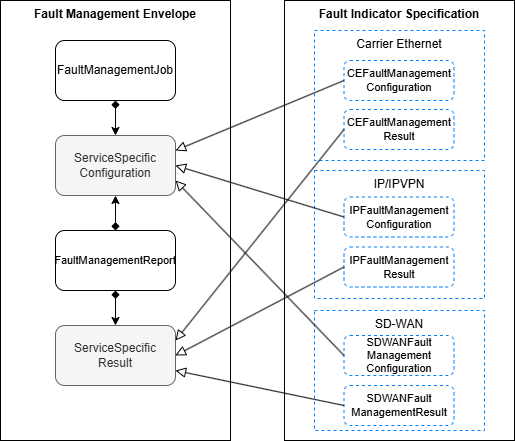
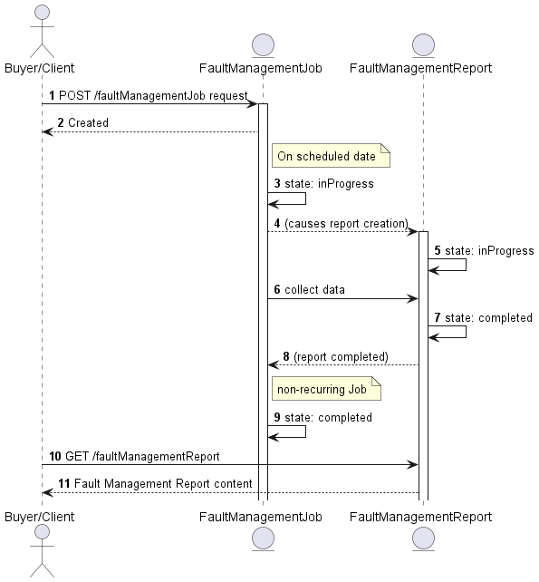
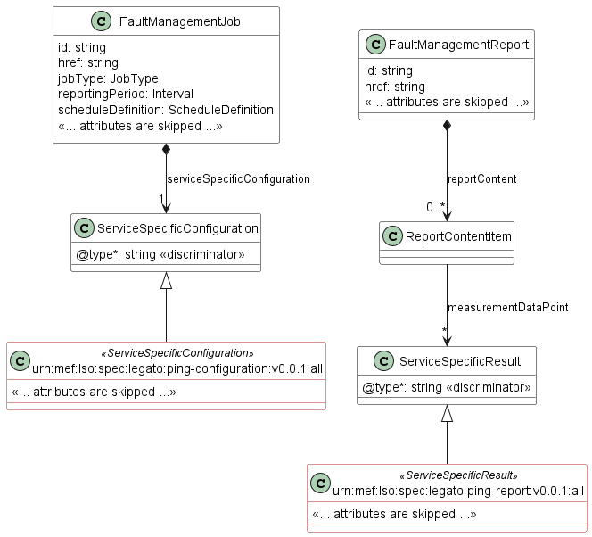
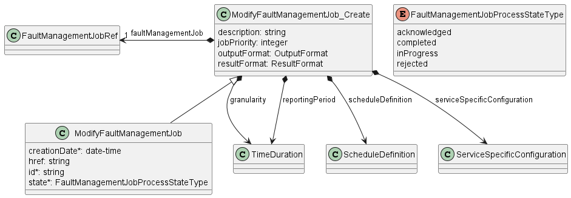
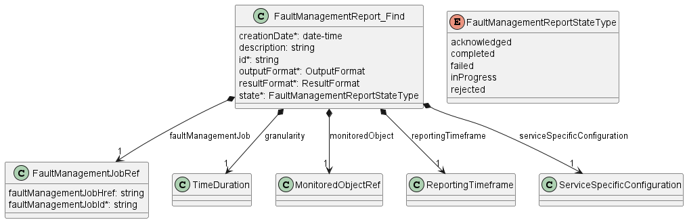
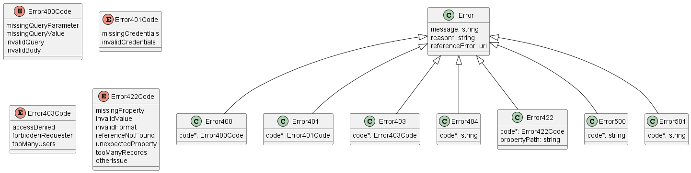
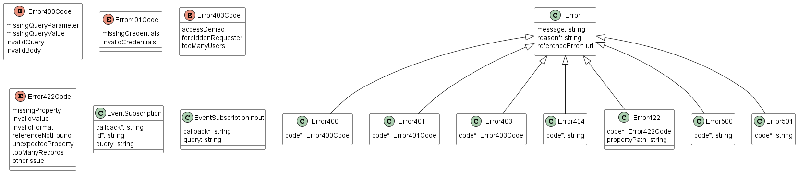

<style>
img
{
  display:block;
  float:none;
  margin-left:auto;
  margin-right:auto;
}
</style>


<div style="font-weight:bold; font-size:33pt; font-family: Sansation;  text-align:center">
Working Draft
</br>
MEF W148 v0.2
</br>
</br>
LSO Allegro, LSO Interlude and LSO Legato Fault Management API - Developer Guide
</br>
<p style="color:red;font-weight:bold; font-size:18pt">This draft represents MEF work in progress and is subject to change.</p>
</br>
June 2025
<p style="color:red;font-weight:bold; font-size:18pt">EXPORT CONTROL: This document contains technical data. The download, export, re-export or disclosure of the technical data contained in this document may be restricted by applicable U.S. or foreign export laws, regulations and rules and/or applicable U.S. or foreign sanctions ("Export Control Laws or Sanctions"). You agree that you are solely responsible for determining whether any Export Control Laws or Sanctions may apply to your download, export, reexport or disclosure of this document, and for obtaining (if available) any required U.S. or foreign export or reexport licenses and/or other required authorizations.</p>
</div>

<div class="page"/>

**Disclaimer**

© MEF Forum 2025. All Rights Reserved.

The information in this publication is freely available for reproduction and
use by any recipient and is believed to be accurate as of its publication date.
Such information is subject to change without notice and MEF Forum (MEF) is not
responsible for any errors. MEF does not assume responsibility to update or
correct any information in this publication. No representation or warranty,
expressed or implied, is made by MEF concerning the completeness, accuracy, or
applicability of any information contained herein and no liability of any kind
shall be assumed by MEF as a result of reliance upon such information.

The information contained herein is intended to be used without modification by
the recipient or user of this document. MEF is not responsible or liable for
any modifications to this document made by any other party.

The receipt or any use of this document or its contents does not in any way
create, by implication or otherwise:

- (a) any express or implied license or right to or under any patent,
  copyright, trademark or trade secret rights held or claimed by any MEF member
  which are or may be associated with the ideas, techniques, concepts or
  expressions contained herein; nor

- (b) any warranty or representation that any MEF member will announce any
  product(s) and/or service(s) related thereto, or if such announcements are
  made, that such announced product(s) and/or service(s) embody any or all of
  the ideas, technologies, or concepts contained herein; nor

- (c) any form of relationship between any MEF member and the recipient or user
  of this document.

Implementation or use of specific MEF standards, specifications or
recommendations will be voluntary, and no Member shall be obliged to implement
them by virtue of participation in MEF Forum. MEF is a non-profit international
organization to enable the development and worldwide adoption of agile, assured
and orchestrated network services. MEF does not, expressly or otherwise,
endorse or promote any specific products or services.

**Copyright**

© MEF Forum 2025. Any reproduction of this document, or any portion thereof,
shall contain the following statement: "Reproduced with permission of MEF
Forum." No user of this document is authorized to modify any of the information
contained herein.

<div class="page"/>

**Table of Contents**

<!-- code_chunk_output -->

- [List of Contributing Members](#list-of-contributing-members)
- [1. Abstract](#1-abstract)
- [2. Terminology and Abbreviations](#2-terminology-and-abbreviations)
- [3. Compliance Levels](#3-compliance-levels)
- [4. Introduction](#4-introduction)
  - [4.1. Description](#41-description)
  - [4.2. Conventions in the Document](#42-conventions-in-the-document)
  - [4.3. Relation to Other Documents](#43-relation-to-other-documents)
  - [4.4. Approach](#44-approach)
  - [4.5. High-Level Flow](#45-high-level-flow)
- [5. API Description](#5-api-description)
  - [5.1. High-level use cases](#51-high-level-use-cases)
  - [5.2. API Endpoint and Operation Description](#52-api-endpoint-and-operation-description)
    - [5.2.1. Seller/Server (SOF) side Fault Management API Endpoints](#521-sellerserver-sof-side-fault-management-api-endpoints)
    - [5.2.2. Buyer/Client (CUS, BUS, SOF) side Fault Management API Endpoints](#522-buyerclient-cus-bus-sof-side-fault-management-api-endpoints)
  - [5.3. Integration of Service Fault Management Specification into Fault Management API](#53-integration-of-service-fault-management-specification-into-fault-management-api)
  - [5.4. Model structure and validation](#54-model-structure-and-validation)
  - [5.5. Security Considerations](#55-security-considerations)
- [6. API Interactions and Flows](#6-api-interactions-and-flows)
  - [6.1. Use Case 1: Create a Fault Management Job](#61-use-case-1-create-a-fault-management-job)
    - [6.1.1. Interaction flow](#611-interaction-flow)
    - [6.1.2. Create Fault Management Job Request](#612-create-fault-management-job-request)
    - [6.1.3. Create Fault Management Job Response](#613-create-fault-management-job-response)
    - [6.1.4. Fault Management Job State Machine](#614-fault-management-job-state-machine)
  - [6.2. Use Case 2: Retrieve List of Fault Management Job](#62-use-case-2-retrieve-list-of-fault-management-job)
  - [6.3. Use Case 3: Retrieve Fault Management Job by Identifier](#63-use-case-3-retrieve-fault-management-job-by-identifier)
  - [6.4. Use Case 4: Modify Fault Management Job](#64-use-case-4-modify-fault-management-job)
    - [6.4.1. Interaction flow](#641-interaction-flow)
    - [6.4.2. Modify Fault Management Job Request](#642-modify-fault-management-job-request)
    - [6.4.3. Modify Fault Management Job Response](#643-modify-fault-management-job-response)
    - [6.4.4. Modify Fault Management Job State Machine](#644-modify-fault-management-job-state-machine)
  - [6.5. Use Case 5: Retrieve Modify Fault Management Job List](#65-use-case-5-retrieve-modify-fault-management-job-list)
  - [6.6. Use Case 6: Retrieve Modify Fault Management Job by Identifier](#66-use-case-6-retrieve-modify-fault-management-job-by-identifier)
  - [6.7. Use Case 7: Cancel Fault Management Job](#67-use-case-7-cancel-fault-management-job)
    - [6.7.1. Interaction flow](#671-interaction-flow)
    - [6.7.2. Cancel Fault Management Job Request](#672-cancel-fault-management-job-request)
    - [6.7.3. Cancel Fault Management Job Response](#673-cancel-fault-management-job-response)
    - [6.7.4. Cancel Fault Management Job State Machine](#674-cancel-fault-management-job-state-machine)
  - [6.8. Use Case 8: Retrieve Cancel Fault Management Job List](#68-use-case-8-retrieve-cancel-fault-management-job-list)
  - [6.9. Use Case 9: Retrieve Cancel Fault Management Job by Identifier](#69-use-case-9-retrieve-cancel-fault-management-job-by-identifier)
  - [6.10. Use Case 10: Suspend Fault Management Job](#610-use-case-10-suspend-fault-management-job)
  - [6.11. Use Case 11: Resume Fault Management Job](#611-use-case-11-resume-fault-management-job)
  - [6.12. Use Case 12: Fault Management Job Complex Query](#612-use-case-12-fault-management-job-complex-query)
    - [6.12.1. Fault Management Job Complex Query Request](#6121-fault-management-job-complex-query-request)
    - [6.12.2. Fault Management Job Complex Query Response](#6122-fault-management-job-complex-query-response)
  - [6.13. Use Case 13: Retrieve Fault Management Report List](#613-use-case-13-retrieve-fault-management-report-list)
    - [6.13.1. Fault Management Report State Machine](#6131-fault-management-report-state-machine)
  - [6.14. Use Case 14: Retrieve Fault Management Report by Identifier](#614-use-case-14-retrieve-fault-management-report-by-identifier)
  - [6.15. Use Case 15: Fault Management Report Complex Query](#615-use-case-15-fault-management-report-complex-query)
    - [6.15.1. Fault Management Report Complex Query Request](#6151-fault-management-report-complex-query-request)
    - [6.15.2. Fault Management Report Complex Query Response](#6152-fault-management-report-complex-query-response)
  - [6.16. Use Case 16: Retrieve Tracking Record List](#616-use-case-16-retrieve-tracking-record-list)
  - [6.17. Use Case 17: Retrieve Tracking Record by Identifier](#617-use-case-17-retrieve-tracking-record-by-identifier)
  - [6.18. Use Case 18: Register for notifications](#618-use-case-18-register-for-notifications)
  - [6.19. Use Case 19: Send notification](#619-use-case-19-send-notification)
- [7. API Details](#7-api-details)
  - [7.1. API patterns](#71-api-patterns)
    - [7.1.1. Indicating errors](#711-indicating-errors)
      - [7.1.1.1. Type Error](#7111-type-error)
      - [7.1.1.2. Type Error400](#7112-type-error400)
      - [7.1.1.3. `enum` Error400Code](#7113-enum-error400code)
      - [7.1.1.4. Type Error401](#7114-type-error401)
      - [7.1.1.5. `enum` Error401Code](#7115-enum-error401code)
      - [7.1.1.6. Type Error403](#7116-type-error403)
      - [7.1.1.7. `enum` Error403Code](#7117-enum-error403code)
      - [7.1.1.8. Type Error404](#7118-type-error404)
      - [7.1.1.9. Type Error422](#7119-type-error422)
      - [7.1.1.10. `enum` Error422Code](#71110-enum-error422code)
      - [7.1.1.11. Type Error500](#71111-type-error500)
      - [7.1.1.12. Type Error501](#71112-type-error501)
  - [7.2. Management API Data model](#72-management-api-data-model)
    - [7.2.1. FaultManagementJob](#721-faultmanagementjob)
      - [7.2.1.1. Type FaultManagementJob\_Create](#7211-type-faultmanagementjob_create)
      - [7.2.1.2. Type FaultManagementJob](#7212-type-faultmanagementjob)
      - [7.2.1.3. Type CancelFaultManagementJob\_Create](#7213-type-cancelfaultmanagementjob_create)
      - [7.2.1.4. Type CancelFaultManagementJob](#7214-type-cancelfaultmanagementjob)
      - [7.2.1.5. Type ModifyFaultManagementJob\_Create](#7215-type-modifyfaultmanagementjob_create)
      - [7.2.1.6. Type ModifyFaultManagementJob](#7216-type-modifyfaultmanagementjob)
      - [7.2.1.7. Type FaultManagementJobComplexQuery\_Create](#7217-type-faultmanagementjobcomplexquery_create)
      - [7.2.1.8. `enum` FaultManagementJobProcessStateType](#7218-enum-faultmanagementjobprocessstatetype)
      - [7.2.1.9. Type FaultManagementJobRef](#7219-type-faultmanagementjobref)
      - [7.2.1.10. `enum` FaultManagementJobStateType](#72110-enum-faultmanagementjobstatetype)
    - [7.2.2. FaultManagementReport](#722-faultmanagementreport)
      - [7.2.2.1. Type FaultManagementReport](#7221-type-faultmanagementreport)
      - [7.2.2.2. Type FaultManagementReport\_Find](#7222-type-faultmanagementreport_find)
      - [7.2.2.3. Type FaultManagementReportComplexQuery\_Create](#7223-type-faultmanagementreportcomplexquery_create)
      - [7.2.2.4. `enum` FaultManagementReportStateType](#7224-enum-faultmanagementreportstatetype)
    - [7.2.3. Common](#723-common)
      - [7.2.3.1. Type AttachmentURL](#7231-type-attachmenturl)
      - [7.2.3.2. Type EntityRef](#7232-type-entityref)
      - [7.2.3.3. Type HourRange](#7233-type-hourrange)
      - [7.2.3.4. `enum` JobType](#7234-enum-jobtype)
      - [7.2.3.5. Type MeasurementTime](#7235-type-measurementtime)
      - [7.2.3.6. Type MonitoredObjectRef](#7236-type-monitoredobjectref)
      - [7.2.3.7. `enum` OutputFormat](#7237-enum-outputformat)
      - [7.2.3.8. Type RecurringSchedule](#7238-type-recurringschedule)
      - [7.2.3.9. Type ReportContentItem](#7239-type-reportcontentitem)
      - [7.2.3.10. Type ReportingTimeframe](#72310-type-reportingtimeframe)
      - [7.2.3.11. `enum` ResultFormat](#72311-enum-resultformat)
      - [7.2.3.12. Type ScheduleDefinition](#72312-type-scheduledefinition)
      - [7.2.3.13. Type ServiceFromToRef](#72313-type-servicefromtoref)
      - [7.2.3.14. Type ServiceRef](#72314-type-serviceref)
      - [7.2.3.15. Type ServiceSpecificConfiguration](#72315-type-servicespecificconfiguration)
      - [7.2.3.16. Type ServiceSpecificResult](#72316-type-servicespecificresult)
      - [7.2.3.17. Type TimeDuration](#72317-type-timeduration)
      - [7.2.3.18. `enum` TimeDurationUnits](#72318-enum-timedurationunits)
      - [7.2.3.19. Type TrackingRecord](#72319-type-trackingrecord)
    - [7.2.4. Notification Registration](#724-notification-registration)
      - [7.2.4.1. Type EventSubscriptionInput](#7241-type-eventsubscriptioninput)
      - [7.2.4.2. Type EventSubscription](#7242-type-eventsubscription)
  - [7.3. Notification API Data model](#73-notification-api-data-model)
    - [7.3.1. Type Event](#731-type-event)
    - [7.3.2. Type FaultManagementJobCreateEvent](#732-type-faultmanagementjobcreateevent)
    - [7.3.3. Type FaultManagementJobEventPayload](#733-type-faultmanagementjobeventpayload)
    - [7.3.4. Type FaultManagementJobStateChangeEvent](#734-type-faultmanagementjobstatechangeevent)
    - [7.3.5. Type FaultManagementJobStateChangeEventPayload](#735-type-faultmanagementjobstatechangeeventpayload)
    - [7.3.6. Type FaultManagementJobAttributeValueChangeEvent](#736-type-faultmanagementjobattributevaluechangeevent)
    - [7.3.7. Type FaultManagementJobReportReadyEvent](#737-type-faultmanagementjobreportreadyevent)
    - [7.3.8. Type FaultManagementJobReportReadyEventPayload](#738-type-faultmanagementjobreportreadyeventpayload)
    - [7.3.9. Type FaultManagementJobReportPreparationErrorEvent](#739-type-faultmanagementjobreportpreparationerrorevent)
    - [7.3.10. Type FaultManagementJobReportPreparationErrorEventPayload](#7310-type-faultmanagementjobreportpreparationerroreventpayload)
    - [7.3.11. Type CancelFaultManagementJobStateChangeEvent](#7311-type-cancelfaultmanagementjobstatechangeevent)
    - [7.3.12. Type CancelFaultManagementJobStateChangeEventPayload](#7312-type-cancelfaultmanagementjobstatechangeeventpayload)
    - [7.3.13. Type ModifyFaultManagementJobStateChangeEvent](#7313-type-modifyfaultmanagementjobstatechangeevent)
    - [7.3.14. Type ModifyFaultManagementJobStateChangeEventPayload](#7314-type-modifyfaultmanagementjobstatechangeeventpayload)
    - [7.3.15. Type FaultManagementReportCreateEvent](#7315-type-faultmanagementreportcreateevent)
    - [7.3.16. Type FaultManagementReportEventPayload](#7316-type-faultmanagementreporteventpayload)
    - [7.3.17. Type FaultManagementReportStateChangeEvent](#7317-type-faultmanagementreportstatechangeevent)
    - [7.3.18. Type FaultManagementReportStateChangeEventPayload](#7318-type-faultmanagementreportstatechangeeventpayload)
- [8. References](#8-references)

<!-- /code_chunk_output -->

<div style="page-break-after: always;"></div>

# List of Contributing Members

The following members of the MEF participated in the development of this
document and have requested to be included in this list.

| Member |
| ------ |
|        |
|        |
|        |

**Table 1. Contributing Members**

# 1. Abstract

This standard is intended to assist the implementation of the Application
Programming Interfaces (APIs) for the Fault Management functionality of 
the Service Orchestration Function at the LSO Allegro, LSO Interlude and LSO 
Legato Interface Reference Points (IRPs), for which requirements and use cases
are defined in MEF W133.1 [[MEF W133.1](#8-references)]. The requirements and use 
cases are the same for all IRPs. This standard consists of this document and 
complementary API definitions for Fault Management and Fault Management 
Notification.

This standard normatively incorporates the following files by reference as if
they were part of this document from the GitHub repository:

[MEF-LSO-Allegro-SDK](https://github.com/MEF-GIT/MEF-LSO-Allegro-SDK)

- `serviceApi/fm/faultManagement.api.yaml`
- `serviceApi/fm/faultNotification.api.yaml`

[MEF-LSO-Interlude-SDK](https://github.com/MEF-GIT/MEF-LSO-Interlude-SDK)

- `serviceApi/fm/faultManagement.api.yaml`
- `serviceApi/fm/faultNotification.api.yaml`

[MEF-LSO-Legato-SDK](https://github.com/MEF-GIT/MEF-LSO-Legato-SDK)

- `serviceApi/fm/faultManagement.api.yaml`
- `serviceApi/fm/faultNotification.api.yaml`

The Fault Management API is defined using OpenAPI 3.0 
[[Open API 3.0](#8-references)]

<div class="page"/>

# 2. Terminology and Abbreviations

This section aims to clarify the terminology used throughout this document. 
In many cases, the authoritative definitions of terms can be found in separate 
documents. To ensure accuracy and consistency, the third column of this document
serves to provide the appropriate references from MEF or external sources that 
govern these definitions.

In addition, terms defined in the standards referenced below are included in
this document by reference and are not repeated in the table below:

- MEF W133.1 _Allegro, Interlude and Legato Fault Management and Performance
  Monitoring BR&UC_ July 2025 [[MEF W133.1](#8-references)]
- MEF 55.1, _Lifecycle Service Orchestration (LSO): Reference Architecture and
  Framework_ February 2021 [[MEF 55.1](#8-references)]

| **Term**                            | **Definition**                                                                                                                                                                   																																								| **Source**                                                                         |
| ----------------------------------- | ----------------------------------------------------------------------------------------------------------------------------------------------------------------------------------------------------------------------------------------------------------------------------------------------------------------------------------------------- | ---------------------------------------------------------------------------------- |
| API Endpoint                        | The endpoint of a communication channel (the complete URL of an API Resource) to which the HTTP-REST requests are addressed to operate on the _API Resource_.           																																								        | [rapidapi.com](https://rapidapi.com/blog/api-glossary/endpoint/)<br>This document  |
| API Resource                        | A REST Resource. In REST, the primary data representation is called Resource. In this document, _API Resource_ is defined as an OAS _SchemaObject_ with specified _API Endpoints_.																																								| [restfulapi.net](https://restfulapi.net/resource-naming/)<br>This document         |
| Notification                        | A notification is a representation of an event that is exchanged between interested parties. An event is a significant occurrence or change in system state that is important from the perspective of system administration.  																													| MEF W133.1 																		 |
| On-Demand							  | Fault Management Job actions that are initiated for a limited time to carry out the Fault Management measurements.																																																			                    | MEF W133.1 																		 |
| OpenAPI                             | The OpenAPI 3.0 Specification, formerly known as the Swagger specification is an API description format for REST APIs.                                                           																																								| [spec.openapis.org](http://spec.openapis.org/oas/v3.0.3)                           |
| Operation                           | An interaction between the Server and Client, potentially involving multiple back-and-forth transactions.                                                                              																																							| This document                                                                      |
| Passive							  | Fault Management Job action to support the collection and reporting of network. The statistics collections include but are not limited to telemetry associated with an interface, (Net/Application) Flow, VLAN, bridging/Ethernet, IP, TCP, UDP layers.   															                                                                                                                                                                                | MEF W133.1 																		                                                                                            |
| Proactive							  |	Fault Management Job actions that are carried on continuously to permit timely reporting of fault  status.																																																				                        | MEF W133.1 																		 |
| Representational State Transfer     | Representational State Transfer. REST provides a set of architectural constraints that, when applied as a whole, emphasizes scalability of component interactions, generality of interfaces, independent deployment of components, and intermediary components to reduce interaction latency, enforce security, and encapsulate legacy systems.	| [Chapter 5: Representational State Transfer (REST)](http://www.ics.uci.edu/~fielding/pubs/dissertation/rest_arch_style.htm) |
| SchemaObject                        | The construct that allows the definition of input and output data types. These types can represent object classes, as well as primitives and array specifications.              																																								| [spec.openapis.org](http://spec.openapis.org/oas/v3.0.3#schema-object)             |

**Table 2. Terminology**

| **Term** | **Definition**                                                                               | **Source**                                               |
| -------- | -------------------------------------------------------------------------------------------- | -------------------------------------------------------- |
| API      | Application Programming Interface. In this document, API is used synonymously with REST API. | This document                                            |
| BUS      | Business Applications                                                                        | MEF 55.1                                                 |
| CUS      | Customer Application Coordinator															  | MEF 55.1                                                 |
| FM	   | Fault Management   																		  | MEF W133.1												 |
| IRP      | Interface Reference Point                                                                    | MEF 55.1                                                 |
| OAS      | OpenAPI Specification                                                                        | [openapis.org](https://www.openapis.org/faq/style-guide) |
| REST     | Representational State Transfer															  | [REST](http://www.ics.uci.edu/~fielding/pubs/dissertation/rest_arch_style.htm)				 |
| SOF      | Service Orchestration Functionality                                                          | MEF 55.1                                                 |

**Table 3. Abbreviations**

# 3. Compliance Levels

The key words **"MUST"**, **"MUST NOT"**, **"REQUIRED"**, **"SHALL"**, **"SHALL
NOT"**, **"SHOULD"**, **"SHOULD NOT"**, **"RECOMMENDED"**, **"NOT
RECOMMENDED"**, **"MAY"**, and **"OPTIONAL"** in this document are to be
interpreted as described in BCP 14 (RFC 2119 [[RFC 2119](#8-references)], RFC
8174 [[RFC 8174](#8-references)]) when, and only when, they appear in all
capitals, as shown here. All key words must be in bold text.

Items that are **REQUIRED** (contain the words **MUST** or **MUST NOT**) are
labeled as **[Rx]** for required. Items that are **RECOMMENDED** (contain the
words **SHOULD** or **SHOULD NOT**) are labeled as **[Dx]** for desirable.
Items that are **OPTIONAL** (contain the words MAY or OPTIONAL) are labeled as
**[Ox]** for optional.

A paragraph preceded by **[CRa]<** specifies a conditional mandatory
requirement that **MUST** be followed if the condition(s) following the "<"
have been met. For example, **"[CR1]<[D38]"** indicates that Conditional
Mandatory Requirement 1 must be followed if Desirable Requirement 38 has been
met. A paragraph preceded by **[CDb]<** specifies a Conditional Desirable
Requirement that **SHOULD** be followed if the condition(s) following the "<"
have been met. A paragraph preceded by **[COc]<**specifies a Conditional
Optional Requirement that **MAY** be followed if the condition(s) following the
"<" have been met.

<div class="page"/>

# 4. Introduction

Fault Management API allows to manage Fault Management Jobs, collect 
Fault Management Reports, and receive notifications related to these
entities. This provides the ability for the Buyer/Client to request that 
the Seller/Server performs FM Job on a service, a service pair or an entity,
and to retrieve the results of that job. Examples of the Fault Management Job
are Link Trace or Loopback. 

This standard specification document describes the Application Programming
Interface (API) for Fault Management functionality of the LSO Allegro
Interface Reference Point (IRP), LSO Interlude Interface Reference Point (IRP)
and LSO Sonata IRP as defined in the _MEF 55.1 Lifecycle Service Orchestration
(LSO): Reference Architecture and Framework_ [[MEF 55.1](#8-references)]. The 
LSO Reference Architecture is shown in Figure 1 with the three IRPs 
highlighted.


**Figure 1. The LSO Reference Architecture**

**_Note_**: The use cases and business requirements in this document assume a
two-actor relationship based on the set of actors in the LSO architecture. The
names of the relationships are specific to the Interface Reference Point. For 
both Allegro and Interlude there is a Buyer and Seller. For Allegro the Buyer 
is the Customer and the Seller is the Service Provider. In Interlude the Buyer
is the Service Provider and the Seller is the Partner. In the case of the 
Legato IRP, given this is within a single Service Provider or Partner, the
relationship is between Client and Server, where the Business Application (BA) 
is the Client, and the Service Orchestration Functionality (SOF) is the Server.
Considering this duality, actors in the document are referred to as Buyer/Client 
and Seller/Server. 

## 4.1. Description

This standard is scoped to cover APIs for following Service Orchestration
Functionalities:
- Fault Management
  - Includes management of Fault Management Jobs and collecting Fault Reports
- Fault Management Notification
  - Includes Event Subscription/Hub and Listener notification functions

Business Applications (BUS), Customer Application Coordinator (CUS) and
Service Orchestration Functionality (SOF) systems use the information contained
within this document.

This standard is intended to support the design of API implementations that
enable interoperable SOF operations (in the scope of this standard) across the
Allegro IRP, Interlude IRP, and Legato IRP.

The Fault Management API allows the Buyer (CUS/SOF) or Client (BUS) to 
provision fault management job in the Server (intra-operator SOF) or in the 
Seller (inter-operator SOF) and collect fault reports from Server/Seller.

## 4.2. Conventions in the Document

- Code samples are formatted using code blocks. When notation `<< some text >>`
  is used in the payload sample it indicates that a comment is provided instead
  of an example value, and it might not comply with the OpenAPI definition.
- Model definitions are formatted as in-line code (e.g. `FaultManagementJob`).
- In UML diagrams the default cardinality of associations is `0..1`. Other
  cardinality markers are compliant with the UML standard.
- In the API details tables and UML diagrams required attributes are marked
  with a `*` next to their names.
- In UML sequence diagrams `{{variable}}` notation is used to indicate a
  variable to be substituted with a correct value.

## 4.3. Relation to Other Documents

This API implements the Fault Management related requirements and use
cases that are defined in MEF W133.1 [[MEF W133.1](#8-references)]. Fault 
Management Use Cases must support the use of MEF service fault indicators 
specifications as payload.

## 4.4. Approach

As presented in Figure 2. the Allegro, Interlude, and Legato API frameworks
consist of three structural components:

- Generic API framework
- Service-independent information (Function-specific information and
  Function-specific operations)
- Service-specific information (MEF service specification data model)


**Figure 2. Allegro, Interlude and Legato API Structure**

The essential concept behind the framework is to decouple the common structure,
information, and operations from the specific service information content.
Firstly, the Generic API Framework defines a set of design rules and patterns
that are applied across all Allegro, Interlude, and Legato APIs.
Secondly, the service-independent information of the framework focuses on a
model of a particular Allegro, Interlude, or Legato functionality and is
agnostic to any of the service specifications. For example, this standard is 
describing the Fault Management model and operations that allow provisioning of
the fault indicators for any types of service.
Finally, the service-specific information part of the framework focuses on
attributes related to fault management configuration and requirements for 
provisioning intra-provider or inter-provider FM objectives.

This Developer Guide does not define MEF service fault management 
specifications but can be used in combination with any specifications defined 
by or compliant with MEF. MEF service fault management schemas are defined by:

- MEF 152: Carrier Ethernet Payload Schema/Guide for SOAM 
- MEF 153: IP/IPVPN Schema/Guide for SOAM 
- MEF 154: SD-WAN Schema/Guide for SOAM 

Figure 3 presents the relationship between the Fault Management API 
entities and the fault management specification model. 
The `ServiceSpecificConfiguration` serves as an extension point for 
configuring service-specific fault parameters. On the other hand, the 
`ServiceSpecificResult` acts as an extension point for capturing and representing the 
fault management results.



**Figure 3. Fault Indicators specification for Allegro, Interlude, Legato**

## 4.5. High-Level Flow

The Fault Management API in essence allows the Buyer/Client to request SOF 
to provision intervals, schedules, and fault indicators for a service, 
an ordered pair, or entity. The Fault Management Notifications API provides
means to exchange information about significant changes in the system state
between interested parties. Figure 4 presents an exemplary high-level flow
of Fault Management Job provisioning.


**Figure 4. High-Level Flow of Fault Management Job Provisioning**

The following steps describe the high-level flow:

- (optional) The BUS system registers for notifications. <br>**_Note1_**: 
Fault Management Notifications are optional and do not impact end-to-end flow
- The BUS system triggers provisioning of Fault Management Job. 
  - The SOF provisions Fault Management by creating a `FaultManagementJob`
    which contains the configuration of fault indicators for monitored object.
  - `FaultManagementJob` also carries a configuration including granularity,
    reporting period, schedule definition, and output format.
  - The `FaultManagementJob` is processed by the SOF as per the state transition
    rules described in [6.1.4.](#614-fault-management-job-state-machine)
  - (optional) The SOF reports the `FaultManagementJob` state changes.
  - On a scheduled date according to schedule definition, a `FaultManagementReport` 
    entity is created and data generation is started.
  - Fault data is collected in the `FaultManagementReport`.
  - When the configured reporting period elapses, collection of results is 
    completed.
  - `FaultManagementReport` is processed as per the state transition rules 
    described in [6.13.1.](#6131-fault-management-report-state-machine)
  - (optional) The SOF reports the `FaultManagementReport` state change.
  - The BUS system can collect `FaultManagementReport` through _Fault Management API_ 

The same _Fault Management API_ is used by the BUS to create **new**
`FaultManagementJob` instances, as well as update **existing** ones or trigger 
state transitions (e.g. cancel **existing** `FaultManagementJob` instance)

Figure 5 presents relations between entities that are managed through 
_Fault Management API_. The diagram is simplified and does not contain 
all types of operations.



**Figure 5. The flow between API endpoints**

<div class="page"/>

# 5. API Description

This section presents the API structure and design patterns. It starts with the
high-level use cases diagram. Then it describes the REST endpoints with use
case mapping. Next, it explains the design pattern that is used
to combine service-agnostic and service-specific parts of API payloads.
Finally, payload validation and API security aspects are discussed.

## 5.1. High-level use cases

Figure 6 presents a high-level use case diagram. It aims to help understand
the endpoint mapping. Use cases are described extensively in
[chapter 6](#6-api-interactions-and-flows). The mandatory use cases are 
highlighted in bold.


**Figure 6. Use cases**

## 5.2. API Endpoint and Operation Description

### 5.2.1. Seller/Server (SOF) side Fault Management API Endpoints

**Base URL for Allegro**:

`https://{{serverBase}}:{{port}}{{?/sof_prefix}}/mefApi/allegro/faultManagement/v2/`

**Base URL for Interlude**:

`https://{{serverBase}}:{{port}}{{?/sof_prefix}}/mefApi/interlude/faultManagement/v2/`

**Base URL for Legato**:

`https://{{serverBase}}:{{port}}{{?/sof_prefix}}/mefApi/legato/faultManagement/v2/`

The following API endpoints are implemented by the Seller/Server (SOF) and
allow the Buyer/Client (SOF/CUS/BUS) to create, retrieve and modify
`FaultManagementJob` and `FaultManagementReport` instances. The 
endpoints and corresponding data model are defined in
`serviceApi/fm/faultManagement.api.yaml`.

| API Endpoint                            | Description                                                                                                                 | MEF W133.1 Use Case Mapping |
| --------------------------------------- | --------------------------------------------------------------------------------------------------------------------------- | --------------------------- |
| POST /faultManagementJob                | A request initiated by the Buyer/Client to create a Fault Management Job in the Seller/Server system.                       | 1                           |
| GET /faultManagementJob                 | The Buyer/Client requests a list of Fault Management Jobs based on a set of filter criteria.                                | 6                         |
| GET /faultManagementJob/{{id}}          | The Buyer/Client requests detailed information about a single Fault Management Job.                                         | 7                         |
| POST /modifyFaultManagementJob          | A request initiated by the Buyer/Client to modify a Fault Management Job in the Seller/Server system.                       | 2                           |
| GET /modifyFaultManagementJob           | The Buyer/Client requests a list of Modify Fault Management Job based on a set of filter criteria.                          | 2                           |
| GET /modifyFaultManagementJob/{{id}}    | The Buyer/Client requests detailed information about a single Modify Fault Management Job.                                  | 2                           |
| POST /cancelFaultManagementJob          | A request initiated by the Buyer/Client to cancel a Fault Management Job in the Seller/Server system.                       | 3                           |
| GET /cancelFaultManagementJob           | The Buyer/Client requests a list of Cancel Fault Management Job based on a set of filter criteria.                          | 3                           |
| GET /cancelFaultManagementJob/{{id}}    | The Buyer/Client requests detailed information about a single Cancel Fault Management Job.                                  | 3                           |
| POST /faultManagementJob/{{id}}/suspend | A request initiated by the Buyer/Client to suspend a Fault Management Job in the Seller/Server system.                  	| 4                           |
| POST /faultManagementJob/{{id}}/resume  | A request initiated by the Buyer/Client to resume a Fault Management Job in the Seller/Server system.                   	| 5                           |
| POST /faultManagementJobComplexQuery    | A request initiated by the Buyer/Client to execute a Fault Management Job Complex Query in the Seller/Server system.         | 6                         |
| GET /faultManagementReport              | The Buyer/Client requests a list of Fault Management Reports based on a set of filter criteria.                             | 11                           |
| GET /faultManagementReport/{{id}}       | The Buyer/Client requests detailed information about a single Fault Management Report, including the content of the report. | 12                          |
| POST /faultManagementReportComplexQuery | A request initiated by the Buyer/Client to execute a Fault Management Report Complex Query in the Seller/Server system.      | 11                           |
| GET /trackingRecord                     | The Buyer/Client requests a list of Tracking Records based on a set of filter criteria.                                     | N/A                         |
| GET /trackingRecord/{{id}}              | The Buyer/Client requests detailed information about a single Tracking Record.                                              | N/A                         |

**Table 4. Seller/Server (SOF) Fault Management mandatory API endpoints**

**[R1]** Seller/Server (SOF) **MUST** support all API endpoints listed in 
Table 4. 

API endpoints listed in Table 5 are optional and may be supported by the SOF.

| API Endpoint                      | Description                                                                                                                           | MEF W133.1 Use Case Mapping |
| --------------------------------- | ------------------------------------------------------------------------------------------------------------------------------------- | --------------------------- |
| POST /hub                         | The Buyer/Client requests to subscribe to the Fault Management Notifications.                          | 8                           |
| GET /hub/{{id}}                   | The Buyer/Client retrieves a specific `EventSubscription` from the SOF, that matches the _`id`_ value provided as _`path`_ parameter. | N/A                         |
| DELETE /hub/{{id}}                | The Buyer/Client requests to unsubscribe from the Fault Management Notifications.                      | 10                           |

**Table 5. Seller/Server (SOF) Fault Management optional API endpoints**

### 5.2.2. Buyer/Client (CUS, BUS, SOF) side Fault Management API Endpoints

**Base URL for Allegro**:

`https://{{serverBase}}:{{port}}{{?/bus_cus_sof_prefix}}/mefApi/allegro/faultNotification/v2/`

**Base URL for Interlude**:

`https://{{serverBase}}:{{port}}{{?/bus_cus_sof_prefix}}/mefApi/interlude/faultNotification/v2`

**Base URL for Legato**:

`https://{{serverBase}}:{{port}}{{?/bus_cus_sof_prefix}}/mefApi/legato/faultNotification/v2/`

The following API Endpoints are used by the SOF to post notifications to 
registered CUS, BUS, or SOF listeners. The endpoints and corresponding data model are defined in `serviceApi/fm/faultNotification.api.yaml`

| API Endpoint                                                  | Description                                                                                                                                                           | MEF W133.1 Use Case Mapping |
| ------------------------------------------------------------- | --------------------------------------------------------------------------------------------------------------------------------------------------------------------- | --------------------------- |
| POST /listener/faultManagementJobCreateEvent                  | A request initiated by the Seller/Server to notify Buyer/Client on `FaultManagementJob` instance creation.                                                            | 9                           |
| POST /listener/faultManagementJobStateChangeEvent             | A request initiated by the Seller/Server to notify Buyer/Client on the `FaultManagementJob` instance state change.                                                    | 9                           |
| POST /listener/faultManagementJobAttributeValueChangeEvent    | A request initiated by the Seller/Server to notify Buyer/Client on the `FaultManagementJob` instance attribute value change.                                          | 9                           |
| POST /listener/faultManagementJobReportReadyEvent             | A request initiated by the Seller/Server to notify Buyer/Client that `FaultManagementReport` was generated for the `FaultManagementJob` instance.                     | 9                           |
| POST /listener/faultManagementJobReportPreparationErrorEvent  | A request initiated by the Seller/Server to notify Buyer/Client that `FaultManagementReport` was not generated for the `FaultManagementJob` instance due to an error. | 9                           |
| POST /listener/cancelFaultManagementJobStateChangeEvent       | A request initiated by the Seller/Server to notify Buyer/Client on the `CancelFaultManagementJob` instance state change.                                              | 9                           |
| POST /listener/modifyFaultManagementJobStateChangeEvent       | A request initiated by the Seller/Server to notify Buyer/Client on the `ModifyFaultManagementJob` instance state change.                                              | 9                           |
| POST /listener/faultManagementReportCreateEvent               | A request initiated by the Seller/Server to notify Buyer/Client on `FaultManagementReport` instance creation.                                                         | 9                           |
| POST /listener/faultManagementReportStateChangeEvent          | A request initiated by the Seller/Server to notify Buyer/Client on the `FaultManagementReport` instance state change.                                                 | 9                           |

**Table 6. Buyer/Client (CUS, BUS, SOF) Fault Management API endpoints**

**[O1]** The Buyer/Client (CUS, BUS, SOF) **MAY** support API endpoints listed
in Table 6.

**[O2]** The Buyer/Client (CUS, BUS, SOF) **MAY** register to receive 
Fault Management Notifications.

**[CR1]<[O2]** The Seller/Server FM Notifications MUST be sent to Buyer/Clients who
have subscribed to FM Notifications. [MEF133.1 R36]

## 5.3. Integration of Service Fault Management Specification into Fault Management API

The Fault Management API is a generic envelope that allows for the lifecycle
management of relevant Fault Management objects. The API itself does not 
provide particular technology-specific definitions for configuring fault 
management or prescribing the structure of output data. However, it offers
flexible extensibility to accommodate the configuration of service-specific 
fault indicators and results. This allows for customization and adaptation to 
various fault management requirements and desired data formats. This fault 
configuration and result schemas are defined using JsonSchema (draft 7) format 
[JSON Schema draft 7](#8-references) and can be integrated into the 
`FaultManagementJob` and `FaultManagementReport` using the TMF extension pattern.

The extension hosting types in the API data model are:

- `ServiceSpecificConfiguration` - this type is extended with Fault 
Management configuration schema
- `ServiceSpecificResult` - this type is extended with Fault Management result schema
  
The `@type` attribute of those extension hosting types must be set to a value 
that uniquely identifies the fault management schmeas. A unique 
identifier for MEF standard service schemas is in URN format and is assigned 
by MEF. This identifier is provided as root schema `$id`.
Use of non-MEF standard fault management configuration is allowed. In such 
a case the schema identifier must be agreed upon between the Buyer/Client and
the Seller/Server.

The example below shows a header of a schema, which describes the configuration
of `ping` command to be executed by `FaultManagementJob`, where `"$id": 
urn:mef:lso:spec:legato:ping-configuration:v0.0.1:all` is 
the above-mentioned URN:

```yaml
'$schema': http://json-schema.org/draft-07/schema#
'$id': urn:mef:lso:spec:legato:ping-configuration:v0.0.1:all
title: MEF LSO - IP SOAM Ping Configuration
```

Fault configuration payload is introduced in multiple FM API entities through
a `serviceSpecificConfiguration` attribute of type 
`ServiceSpecificConfiguration` which is used as an extension point for 
configuration attributes.

In terms of fault results, the appropriate payload is introduced via 
`reportContent` property. This entity has a `measurementDataPoint` array 
of items of type `ServiceSpecificResult` which is used as an extension point 
for service-specific output content.

Implementations might choose to integrate selected Fault Management
specifications to data model during development. In such a case an integrated 
data model is built, and fault configurations are in an inheritance 
relationship accordingly with either `ServiceSpecificConfiguration` or 
`ServiceSpecificResult` as described in the OAS specification.
This pattern is called **Static Binding**. The snippets below present an 
example of a static binding of the envelope API with exemplary MEF fault 
management configuration, for both extension points.

```yaml
ServiceSpecificConfiguration:
  type: object
  description: ServiceSpecificConfiguration is used as an extension point
    for MEF-specific service fault management configuration. The `@type` 
    attribute is used as a discriminator.
  discriminator:
    mapping:
      urn:mef:lso:spec:legato:ping-configuration:v0.0.1:all: '#/components/schemas/PingConfiguration'
    propertyName: '@type'
  properties:
    '@type':
      type: string
      description:
        The name that uniquely identifies type of fault management job 
        configuration. In the case of MEF services, this is the URN provided in
        the fault management configuration specification. The named type must 
        be a subclass of ServiceSpecificConfiguration.
```

```yaml
PingConfiguration:
  allOf:
    - $ref: '#/components/schemas/ServiceSpecificConfiguration'
    - type: object
      description: Ping Configuration Schema.
```

```yaml
ServiceSpecificResult:
  type: object
  description:
    ServiceSpecificResult is used as an extension point for MEF-specific fault 
    management job results. The `@type` attribute is used as a discriminator.
  discriminator:
    mapping:
      urn:mef:lso:spec:legato:ping-report:v0.0.1:all: '#/components/schemas/PingReport'
    propertyName: '@type'
  properties:
    '@type':
      type: string
      description:
        The name that uniquely identifies the type of results that are
        returned by the Fault Management Report. In the case of MEF 
        services, this is the URN provided in the fault management results
        specification. The named type must be a subclass of ServiceSpecificResult.
```

```yaml
PingReport:
  allOf:
    - $ref: '#/components/schemas/ServiceSpecificResult'
    - type: object
      description: Ping Results Schema.
```

Alternatively, implementations might choose not to build an integrated model
and choose a different mechanism allowing runtime validation of
service-specific fragments of the payload. The system can validate a given
fault management job configuration against a new schema without redeployment. 
This pattern is called **Dynamic Binding.**

Regardless of the chosen implementation pattern, the HTTP payload is  
the same. Both implementation approaches must conform to the requirements 
specified below.

**[R2]** `ServiceSpecificConfiguration` and `ServiceSpecificResult` types are
extension points that **MUST** be used to integrate service fault management 
properties into a request/response payload.

**[R3]** The `@type` property of `ServiceSpecificConfiguration` and 
`ServiceSpecificResult` **MUST** be used to specify the type of the extending entity.

**[R4]** Attributes specified in the payload must conform to the fault 
management configuration specified in the `@type` property.



**Figure 7. The Extension Pattern with Sample Service-Specific Extension**

Figure 7 presents two MEF Fault Management schemas that represent 
configuration and result classes for IP services. When these schemas are used, 
the `@type` of `ServiceSpecificConfiguration` takes
`"urn:mef:lso:spec:legato:ping-configuration:v0.0.1:all"` 
value to indicate which fault management specification should be used to 
interpret a set of service-specific attributes included in the payload.
Similarly, for `ServiceSpecificResult`, the `@type` attribute takes
`"urn:mef:lso:spec:legato:ping-report:v0.0.1:all"` value 
which indicates how the resulting fault collection should be interpreted.

## 5.4. Model structure and validation

The structure of the payloads exchanged via Allegro, Interlude, and Legato 
Fault Management API endpoints is defined using:

- OpenAPI version 3.0 for the service-agnostic part of the payload
- JsonSchema (draft 7) for the service-specific part of the payload

**[R5]** Implementations **MUST** use payloads that conform to these
definitions.

**[R6]** The Buyer/Client and the Seller/Server **MUST NOT** use any operation,
entity or attribute that is not explicitly defined or allowed by this standard.

## 5.5. Security Considerations

Although the Legato IRP is internal to a Service Provider/Operator business
boundary, it is expected that some minimal security mechanisms are in place for
any communication over this IRP. There must also be authorization mechanisms in
place to control what a particular Buyer/Client or SOF is allowed to do and 
what information may be obtained. For Allegro and Interlude IRPs, security 
should follow rules for external communication.
The definition of the exact security mechanism and configuration is outside
the scope of this document. The LSO Security mechanisms are defined by MEF 128
_LSO API Security Profiles_ [[MEF 128.1](#8-references)].

<div class="page"/>

# 6. API Interactions and Flows

This section provides a detailed insight into the API functionality, use cases,
and flows. It starts with Table 7 presenting a list and short description of
all business use cases then present the variants of end-to-end interaction
flows, and in the following subchapters describe the API usage flow and
examples for each of the use cases.

| Use Case # | Use Case Name                                         | Use Case Description                                                                                                                                                 |
| ---------- | ----------------------------------------------------- | -------------------------------------------------------------------------------------------------------------------------------------------------------------------- |
| 1          | Create Fault Management Job                           | A request initiated by the Buyer/Client to create a Fault Management Job in the Seller/Server system to indicate Fault Management Job configuration.                 |
| 2          | Retrieve Fault Management Job List                    | The Buyer/Client requests a list of Fault Management Job based on a set of filter criteria. The Seller/Server returns a list of matched FM Jobs.                  |
| 3          | Retrieve Fault Management Job by Identifier       | The Buyer/Client requests detailed information about a single Fault Management Job based on the Fault Management Job Identifier.                                     |
| 4          | Modify Fault Management Job                           | A request initiated by the Buyer/Client to modify a Fault Management Job in the Seller/Server system.                                                                |
| 5          | Retrieve Modify Fault Management Job List             | The Buyer/Client requests a list of Modify Fault Management Job based on a set of filter criteria.                                                                   |
| 6          | Retrieve Modify Fault Management Job by Identifier    | The Buyer/Client requests detailed information about a single Modify Fault Management Job based on the Modify Fault Management Job Identifier.                       |
| 7          | Cancel Fault Management Job                           | A request initiated by the Buyer/Client to cancel a Fault Management Job in the Seller/Server system.                                                                |
| 8          | Retrieve Cancel Fault Management Job List             | The Buyer/Client requests a list of Cancel Fault Management Job based on a set of filter criteria.                                                                   |
| 9          | Retrieve Cancel Fault Management Job by Identifier    | The Buyer/Client requests detailed information about a single Cancel Fault Management Job based on the Cancel Fault Management Job Identifier.                       |
| 10         | Suspend Fault Management Job                          | A request initiated by the Buyer/Client to suspend a Fault Management Job in the Seller/Server system.                                                               |
| 11         | Resume Fault Management Job                           | A request initiated by the Buyer/Client to resume a Fault Management Job in the Seller/Server system.                                                                |
| 12         | Fault Management Job Complex Query             | A request initiated by the Buyer/Client to execute a Fault Management Job Complex Query in the Seller/Server system.                                                  |
| 13         | Retrieve Fault Management Report List                 | The Buyer/Client requests a list of Fault Management Reports based on a set of filter criteria. The Seller/Server returns a summarized list of FM Reports.           |
| 14         | Retrieve Fault Management Report by Identifier | The Buyer/Client requests detailed information, including generated content, about a single Fault Management Report based on the Fault Management Report Identifier. |
| 15         | Fault Management Report Complex Query          | A request initiated by the Buyer/Client to execute a Fault Management Report Complex Query in the Seller/Server system.                                               |
| 16         | Retrieve Tracking Record List                         | The Buyer/Client requests a list of Tracking Records based on a set of filter criteria.              |
| 17         | Retrieve Tracking Record List by Identifier           | The Buyer/Client requests detailed information about a single Tracking Record based on the Tracking Record Identifier.                                               |
| 18         | Register for Fault Management Notifications           | The Buyer/Client requests to subscribe to Fault Management Notifications.                                                             |
| 19         | Send Event Notification                               | A request initiated by the Seller/Server to notify the Buyer/Client.                                                                                                 |

**Table 7. Use cases description**

## 6.1. Use Case 1: Create a Fault Management Job

A Fault Management Job entity is used by the Buyer/Client to specify the fault 
management job configuration specific to a service instance. 
This provides the ability for the Buyer/Client to request that the 
Seller/Server performs FM activities on a service, and consequently to retrieve
the fault results. Examples of fault management job are Link Trace 
and Loopback. FM Job is typically run as part of a troubleshooting 
or diagnostic process of a service, a service pair, or an entity. Besides, 
Fault Management Job entity provides configuration, including measurement 
intervals and schedules of FM job execution. 

The Fault Management Jobs produce Fault Management Collections 
(Reports) that will provide the Buyer/Client with fault indicator results. 

There are three types of Fault Management Job:
- Proactive - carried on continuously to permit timely reporting of fault
  status. Typically, it runs indefinitely.
- On-Demand - initiated for a limited time, typically a single run or 
  non-continual run, to carry out the FM job and support troubleshooting
  during service assurance.
- Passive - supports the collection and reporting of network and service 
  faults.  

### 6.1.1. Interaction flow

The flow of this use case is shown in Figure 8.


**Figure 8. Use Case 1 - Fault Management Job create request flow**

The Buyer/Client sends a request with a `FaultManagementJob_Create` type in the 
body. The Seller/Server performs request validation, assigns an `id`, and 
returns the `FaultManagementJob` type in the response body, with a `state` set to 
`acknowledged`. From this point, the Fault Management Job is ready for further 
processing. The Buyer/Client can track the progress of the process either by 
subscribing for notifications or by periodically polling the 
`FaultManagementJob`. The two patterns are presented in the following diagrams.


**Figure 9. Fault Management Job progress tracking - Notifications**


**Figure 10. Fault Management Job progress tracking - Polling**

**_Note_**: The context of notifications is not a part of the considered use
case itself. It is presented to show the big picture of end-to-end flow. This
applies also to all further use case flow diagrams with notifications.

### 6.1.2. Create Fault Management Job Request

Figure 11 presents the most important part of the data model used during
the Create Fault Management Job request (`POST /faultManagementJob`) and 
response. The model of the request message - `FaultManagementJob_Create` is 
a subset of the `FaultManagementJob` model and contains only attributes that 
can (or must) be set by the Buyer/Client. The Seller/Server (SOF) then enriches
the entity in the response with additional information.

A `FaultManagementJob_Create` defines measurement intervals, schedules, and
service-specific configuration of FM job (in `serviceSpecificConfiguration`
section). 

Section `serviceSpecificConfiguration` of the Create Fault Management Job 
request allows for the introduction of service-specific properties as the API 
payload. The extension mechanism is described in detail in [Section 5.3](#53-integration-of-service-fault-management-specification-into-fault-management-api).

The full list of attributes is available in [Section 7](#7-api-details) and in
the API specification which is an integral part of this standard.


**Figure 11. Fault Management Job Key Entities**

To send a create Fault Management Job request the Buyer/Client uses the 
`createFaultManagementJob` operation from the API: `POST /faultManagementJob`, 
as in the snippet below. Some of the payload's attributes might be omitted
to improve examples' readability.

**`Fault Management Job` Create Request**

```json
{
  "description": "Exemplary Create Fault Management Job request",
  "granularity": {
    "timeDurationValue": 15,
    "timeDurationUnits": "MIN"
  },
  "jobPriority": 5,
  "jobType": "on-demand",
  "monitoredObject": {
    "@type": "ServiceRef",
    "serviceId": "905d9f87-6478-4153-a5de-fcc70257f03c",
  },
  "outputFormat": "json",
  "reportingPeriod": {
    "timeDurationValue": 1,
    "timeDurationUnits": "HOUR"
  },
  "resultFormat": "payload",
  "scheduleDefinition": {
    "scheduleDefinitionStartTime": "2025-01-01T00:00:00.000Z",
    "scheduleDefinitionEndTime": "2026-01-01T00:00:00.000Z",
    "recurringSchedule": {
      "second": "0",
      "minute": "0",
      "hour": "*/2",
      "dayOfMonth": "*",
      "month": "*",
      "dayOfWeek": "*"
    },
    "executionDuration": "1 hour"
  },
  "serviceSpecificConfiguration": {
    "@type": "urn:mef:lso:spec:legato:ping-configuration:v0.0.1:all",
    "sourceIpAddress": "192.0.2.1",
    "destinationIpAddress": "192.0.2.2",
    "transmissionInterval": {
      "amount": 1,
      "units": "seconds"
    },
    "count": 10,
    "packetSize": 128,
    "timeout": 5,
    "waitTime": 2
  }
}

```

**[R7]** The Buyer/Client’s Create Fault Management Job request **MUST** 
provide the following attributes: [MEF133.1 R1]
- `jobType`
- `granularity`'
- `monitoredObject`
- `reportingPeriod`
- `outputFormat`
- `resultFormat`
- `scheduleDefinition`
- `serviceSpecificConfiguration`

**[R8]** If the Buyer/Client requests to provision a Fault Management Job for
an ordered pair, they **MUST** provide reference to service endpoints by 
specifying the following:
- `serviceFromId`
- `serviceToId`

**[R9]** If the Buyer/Client requests to provision a Fault Management Job for 
a service, they **MUST** provide reference to a service by specifying 
`serviceId`

**[R10]** If the Buyer/Client requests to provision a Fault Management Job for 
an entity other than a service, they **MUST** provide `entityId`

**[O3]** The Buyer/Client’s Create FM Job request **MAY** provide the 
following attributes: [MEF W133.1 O1]
- `description`
- `jobPriority`

### 6.1.3. Create Fault Management Job Response

Entities used for providing a response to Create Fault Management Job requests 
are presented in Figure 11. The Seller/Server responds with a `FaultManagementJob` 
type, which adds some attributes (like `id` or `state`) to the 
`FaultManagementJob_Create` that was used in the Buyer/Client request.

**_Note_**: The term "Response Code" used in the Business Requirements
maps to HTTP response code, where `2xx` indicates _Success_ and `4xx` or `5xx`
indicate _Failure_.

The following snippet presents the Seller/Server response. It has the same 
structure as in the retrieve by identifier operation.

**`Fault Management Job` Create Response**

```json
{
  "description": "Exemplary Create Fault Management Job request",
  "granularity": {
    "timeDurationValue": 15,
    "timeDurationUnits": "MIN"
  },
  "jobPriority": 5,
  "jobType": "on-demand",
  "monitoredObject": {
    "@type": "ServiceRef",
    "serviceId": "905d9f87-6478-4153-a5de-fcc70257f03c",
  },
  "outputFormat": "json",
  "reportingPeriod": {
    "timeDurationValue": 1,
    "timeDurationUnits": "HOUR"
  },
  "resultFormat": "payload",
  "scheduleDefinition": {
    "scheduleDefinitionStartTime": "2025-01-01T00:00:00.000Z",
    "scheduleDefinitionEndTime": "2026-01-01T00:00:00.000Z",
    "recurringSchedule": {
      "second": "0",
      "minute": "0",
      "hour": "*/2",
      "dayOfMonth": "*",
      "month": "*",
      "dayOfWeek": "*"
    },
    "executionDuration": "1 hour"
  },
  "serviceSpecificConfiguration": {
    "@type": "urn:mef:lso:spec:legato:ping-configuration:v0.0.1:all",
    "sourceIpAddress": "192.0.2.1",
    "destinationIpAddress": "192.0.2.2",
    "transmissionInterval": {
      "amount": 1,
      "units": "seconds"
    },
    "count": 10,
    "packetSize": 128,
    "timeout": 5,
    "waitTime": 2
  },
  "creationDate": "2025-01-01T00:00:00.000Z", << added by SOF >>
  "href": "{{baseUrl}}/faultManagement/v2/755e55e2-72b0-4e3b-af00-693e3beac691", << added by SOF >>
  "id": "755e55e2-72b0-4e3b-af00-693e3beac691", << added by SOF >>
  "lastModifiedDate": "2025-01-01T00:00:00.000Z", << added by SOF >>
  "state": "acknowledged" << added by SOF >>
}
```

Attributes that are set by the Seller/Server in the response are marked with 
the `<< added by SOF >>` tag.

**[R11]** The Seller/Server sets the `creationDate` and `id` 
attribute. [MEF W133.1 R2]

**[R12]** The Seller’s/Server’s response **MUST** echo back all Buyer/Client 
provided attributes. [MEF W133.1 R3]

**[R13]** The FM Job Identifier supplied by the Seller/Server **MUST** be unique
within the Seller/Server’s system. [MEF W133.1 R4]

**[R14]** The Seller/Server **MUST** specify the following attributes in a 
response:
- `id`
- `state`
- `creationDate`

**[R15]** The `id` **MUST** remain the same value for the life of the 
Fault Management Job.

### 6.1.4. Fault Management Job State Machine

Figure 12 presents the Fault Management Job state machine:


**Figure 12. Fault Management Job State Machine**

After receiving the request, the Seller/Server (SOF) performs basic checks of 
the message. If any problem is found an Error response is provided. If the
validation passes a response is provided with `FaultManagementJob` in
`acknowledged` status. Next, the Seller/Server
performs all the remaining business and time-consuming validations. At this
point, an Error response cannot be provided anymore, so the job moves to a
`rejected` state if some issues are found. The
`FaultManagementJob.rejectionReason` acts as a placeholder to provide a
detailed description of what caused the problem. `FaultManagementJob` moves to 
either the `scheduled` or `inProgress` state depending on the assigned schedule. 
`FaultManagementJob` remains `scheduled` state until the scheduled start time 
is reached. `FaultManagementJob` that is starting needs appropriate resources
on Seller/Server side. If required resources cannot be assigned, `FaultManagementJob`
moves to `resourceUnavailable` state. After collecting fault data is finished, 
the Seller/Server verifies if `FaultManagementJob` is recurring. If yes, 
`FaultManagementJob` moves to either `scheduled` or `inProgress` state depending
on the schedule definition. Otherwise, it moves to a `completed` state. 
`FaultManagementJob` can be cancelled when in `scheduled`, `inProgress` or 
`suspended`. When cancellation is successful, `FaultManagementJob` moves to 
`cancelled` state. Cancellation includes an intermediary `pendingCancel` state. 
`FaultManagementJob` can be modified only in the `scheduled` or `suspended` 
state. Modification includes an intermediary `pending` step.

Table 8 presents the mapping between the API `status` names and the MEF W133.1
naming, together with the statuses' description. 

| state                  | MEF W133.1 name      | Description                                                                                                                                                                                                                                                                                                                                                                                                                                                                                                                                                                                                                                                                                                                                                |
| ---------------------- | -------------------- | ---------------------------------------------------------------------------------------------------------------------------------------------------------------------------------------------------------------------------------------------------------------------------------------------------------------------------------------------------------------------------------------------------------------------------------------------------------------------------------------------------------------------------------------------------------------------------------------------------------------------------------------------------------------------------------------------------------------------------------------------------------- |
| `acknowledged`         | Acknowledged         | A Create Fault Management Job request has been received by the Seller/Server and has passed basic validation. Fault Management Job Identifier is assigned in the `acknowledged` state. The request remains in the `acknowledged` state until all validations as applicable are completed. If the attributes are validated the Seller/Server determines if the start time is immediate or scheduled. If immediate, the Fault Management Job moves to the `inProgress` state. Otherwise, the Fault Management Job moves to the `scheduled` state. If not all attributes are validated, the request moves to the `rejected` state.                                                                                                                                     |
| `cancelled`            | Cancelled            | A Fault Management Job that was `inProgress`, `suspended`, or `scheduled` is cancelled.                                                                                                                                                                                                                                                                                                                                                                                                                                                                                                                                                                                                                                                                         |
| `completed`            | Completed            | A non-recurring Fault Management Job finished execution or recurring job finished its schedule.                                                                                                                                                                                                                                                                                                                                                                                                                                                                                                                                                                                                                                                                          |
| `inProgress`           | In-Progress          | A Fault Management Job is running. Upon completion of the Job, a determination if the Fault Management Job is a one-time Job or is recurring is performed. If the Fault Management Job is a one-time Job, the state of the Fault Management Job moves to the `completed` state. If the Fault Management Job is recurring, the Fault Management Job circles back to determine if it has an immediate start time or a scheduled start time. If the FM job has an immediate start time it moves back to `inProgress` state, otherwise it moves to `scheduled`. In case a Suspend Fault Management Job request is completed, the Job moves to the `suspended` state. If a Cancel Fault Management Job request is accepted, the Job moves to the `pendingCancel` state. |
| `pending`              | Pending              | A Modify Fault Management Job request has been accepted by the Seller/Server. The Fault Management Job remains in the `pending` state while updates to the Job are completed. Once updates are complete, the Job returns to the `scheduled` or `inProgress` status depending on the schedule definition.                                                                                                                                                                                                                                                                                                                                                                                                                                                        |
| `pendingCancel`        | Pending Cancel       | A Cancel Fault Management Job request has been accepted by the Seller/Server. The Fault Management Job remains `pendingCancel` while resources used by the Job are being released. Once updates are complete, the Job moves to the `cancelled` status.                                                                                                                                                                                                                                                                                                                                                                                                                                                                                                        |
| `rejected`             | Rejected             | A Create Fault Management Job request fails validation and is rejected with error indications by the Seller/Server.                                                                                                                                                                                                                                                                                                                                                                                                                                                                                                                                                                                                                                        |
| `resourcesUnavailable` | Resource Unavailable | A Fault Management Job cannot be allocated with necessary resources when moving to execution (`inProgress` state).                                                                                                                                                                                                                                                                                                                                                                                                                                                                                                                                                                                                                                          |
| `scheduled`            | Scheduled            | A Fault Management Job is created that does not have an immediate start time. The Fault Management Job stays in the `scheduled` state until the start time is reached. The Fault Management Job then moves to `inProgress`. If the Cancel Fault Management Job request is accepted, the Job moves to the `pendingCancel` state. If the Modify Fault Management Job request is accepted, the Job moves to the `pending` state.                                                                                                                                                                                                                                                                                                                                    |
| `suspended`            | Suspended            | A Suspend Fault Management Job request is completed by the Seller/Server. The Job remains in the `suspended` state until a Resume Fault Management Job request is completed by the Seller/Server at which time the Job returns to the `inProgress` state. If the Cancel Fault Management Job request is accepted, the Job moves to the `pendingCancel` state. If the Modify Fault Management Job request is accepted, the Job moves to the `pending` state.                                                                                                                                                                                                                                                                                                      |

**Table 8. Fault Management Job State Machine states**

**[R16]** The Seller/Server **MUST** support all Fault Management Job statuses 
and their associated transitions as described in Figure 12 and Table 8.

## 6.2. Use Case 2: Retrieve List of Fault Management Job

The Buyer/Client can retrieve a list of `FaultManagementJob` by using a 
`GET /faultManagementJob` operation with desired filtering criteria.

**[O4]** The Buyer/Client Retrieve List of Fault Management Jobs request 
**MUST** contain none or more of the following attributes as filter criteria [MEF133.1 R27]: 

- `serviceId`
- `serviceFromIf`
- `serviceToId`
- `entityId`
- `state`
- `creationDate.gt`
- `creationDate.lt`
- `jobType`
- `jobPriority`

If the quantity of the records requested to be returned exceeds a Seller/Server 
policy, the Seller/Server must choose to respond with either:
- An empty list and error message that indicates the result set is too large 
  (HTTP status 422 with `tooManyRecords` error code) or
- A response that indicates the result is too large and includes a subset of the
  matching FM jobs.

The Buyer may also ask for pagination of the response when the number of results
is too big. The following query attributes related to pagination can be
provided:

- `limit` - number of expected list items
- `offset` - offset of the first element in the result list

```
https://serverRoot/mefApi/legato/faultManagement/v2/faultManagementJob?state=suspended&limit=20&offset=0
```

The example above shows a Buyer's request to get the first twenty 
`FaultManagementJob` that are in `suspended` state. The correct response
(HTTP code `200`) contains a list of `FaultManagementJob` objects matching
the criteria in the response body.

The Seller/Server returns a list of elements that comply with the requested 
`limit`. If the requested `limit` is higher than the supported list size then 
the smaller list of results is returned. In that case, the size of the result
is returned in the header attribute `X-Result-Count`. The Seller can indicate
that there are additional results available using:

- `X-Total-Count` header attribute with the total number of available results
- `X-Pagination-Throttled` header set to `true`

**[D1]** The Seller **SHOULD** support the pagination mechanism.

**[CR1]<[D1]** Seller **MUST** use either `X-Total-Count` or
`X-Pagination-Throttled` to indicate that the page was truncated and additional
results are available.

**[R17]** The Seller/Server's response to the Buyer’s/Client’s Retrieve List of 
Fault Management Jobs **MUST** include the following attributes as applicable:

- `creationDate`
- `granularity`
- `id`
- `jobType`
- `monitoredObject`
- `outputFormat`
- `reportingPeriod`
- `resultFormat`
- `scheduleDefinition`
- `serviceSpecificConfiguration`
- `state`

**[R18]** The Seller/Server’s response **MUST** include a list of Fault 
Management Job Identifiers that match the filter criteria. [MEF133.1 R29]

**[R19]** In case no items matching the criteria are found, the Seller/Server 
**MUST** return a valid response with an empty list. [MEF133.1 R30]

Get List returns full representation of matched Fault Management Job which 
includes all attributes as shown in the Create Fault Management Job Response 
in [section 6.1.3](#613-create-fault-management-job-response).

## 6.3. Use Case 3: Retrieve Fault Management Job by Identifier

The Buyer/Client can get detailed information about the Fault Management Job 
from the Seller/Server by using a `GET /faultManagementJob/{{id}}` operation. 
The payload returned in the response is a full representation of the Fault 
Management Job and includes all attributes the Buyer/Client has provided while 
sending a Fault Management Job create request, together with additional 
attributes set by Seller/Server. 

**[R20]** The Seller/Server MUST return full representation 
of `FaultManagementJob`. [MEF133.1 R32]

**[R21]** In case `id` does not match a `FaultManagementJob` in 
Seller/Server's system, an error response `Error404` **MUST** be returned. 

## 6.4. Use Case 4: Modify Fault Management Job

Due to the need for provisioning and resource reservation on the SOF side, the 
modification operation associated with the Fault Management Job may exhibit 
a prolonged duration. Consequently, this operation is implemented through a 
separate lifecycle process.

### 6.4.1. Interaction flow

The flow of this use case is shown in Figure 13.


**Figure 13. Use Case 4 - Modify Fault Management Job create request flow**

The Buyer/Client sends a request with a `ModifyFaultManagementJob_Create` type in
the body. The Seller/Server performs request validation, assigns an `id`, and 
returns the `ModifyFaultManagementJob` type in the response body, with a `state` set to
`acknowledged`. Further processing is performed by Seller/Server which will in
case of success update the Fault Management Job. The Buyer/Client can track 
the progress of the process either by subscribing for notifications or by
periodically polling the `ModifyFaultManagementJob`. The two patterns are presented
in the following diagrams.


**Figure 14. Modify Fault Management Job progress tracking - Notifications**


**Figure 15. Modify Fault Management Job progress tracking - Polling**

### 6.4.2. Modify Fault Management Job Request

Figure 16 presents the most important part of the data model used during 
the Modify Fault Management Job request (`POST /modifyFaultManagementJob`) 
and response. The model of the request message - `ModifyFaultManagementJob_Create` 
is a subset of the `ModifyFaultManagementJob` model and contains only 
attributes that can (or must) be set by the Buyer/Client. The Seller/Server (SOF)
then enriches the entity in the response with additional information.

The `FaultManagementJobRef` section of `ModifyFaultManagementJob_Create` is 
used to specify which Fault Management Job object is a subject of 
the modification process (relationship by reference using `id` of the Job).

**_Note:_** Only those attributes of the Fault Management Job that should be 
modified, should be included in the Modify Fault Management Job Request. 

Section `serviceSpecificConfiguration` of the Modify Fault Management Job 
request allows for the introduction of service-specific properties of 
Fault Management Job as the API payload. The extension mechanism is described 
in detail in [Section 5.3](#53-integration-of-service-fault-management-specification-into-fault-management-api).

The full list of attributes is available in [Section 7](#7-api-details) and in
the API specification which is an integral part of this standard.



**Figure 16. Modify Fault Management Job Key Entities**

To send a Modify Fault Management Job request the Buyer/Client uses the 
`createModifyFaultManagementJob` operation from the API: `POST /modifyFaultManagementJob`. 
Some of the payload's attributes might be omitted to improve examples' 
readability.

The example below shows a request to create a modification process for 
`FaultManagementJob` that was created in section [6.1.2](#612-create-fault-management-job-request). 

The request below aims to:

- change `description` of the Fault Management Job
- modify `granularity`

```json
{
  "description": "Fault Management Job after modification",
  "granularity": {
    "timeDurationValue": 30,
    "timeDurationUnits": "MIN"
  },
  "faultManagementJob": {
    "faultManagementJobId": "755e55e2-72b0-4e3b-af00-693e3beac691"
  }
}
```

**[R22]** The Buyer’s/Client’s Modify FM Job request **MUST** include the 
Fault Management Job Identifier. [MEF133.1 R6]

**[R23]** The Buyer’s/Client’s Modify FM Job request **MUST** contain one 
or more of the following attributes: [MEF133.1 R7]
- `description`
- `granularity`
- `jobPriority`
- `outputFormat`
- `reportingPeriod`
- `resultFormat`
- `scheduleDefinition`
- `serviceSpecificConfiguration`

### 6.4.3. Modify Fault Management Job Response

Entities used for providing a response to Modify Fault Management Job requests
are presented in Figure 16. The Seller/Server responds with a 
`ModifyFaultManagementJob` type, which adds some attributes (like `id` or `state`) 
to the `ModifyFaultManagementJob_Create` that was used in the Buyer/Client request.

The following snippet presents the Seller/Server response. It has the same 
structure as in the retrieve by identifier operation.

```json
{
  "description": "Fault Management Job after modification",
  "granularity": {
    "timeDurationValue": 30,
    "timeDurationUnits": "MIN"
  },
  "faultManagementJob": {
    "faultManagementJobId": "755e55e2-72b0-4e3b-af00-693e3beac691"
  },
  "creationDate": "2025-01-02T00:00:00.000Z", << added by SOF >>
  "href": "{{baseUrl}}/faultManagement/v2/9c51d971-185d-403e-952f-2110f33a9628", << added by SOF >>
  "id": "9c51d971-185d-403e-952f-2110f33a9628", << added by SOF >>
  "state": "acknowledged" << added by SOF >>
}
```

Attributes that are set by the Seller/Server in the response are marked with 
the `<< added by SOF >>` tag. 

**[R24]** The Seller’s/Server’s response to the Buyer’s/Client’s Modify FM Job
request **MUST** echo back the attributes in the Client’s request. [MEF133.1 R8]

**[R25]** The Seller/Server **MUST** specify the following attributes in a 
response: 

- `id`
- `state`
- `creationDate`

**[R26]** The `id` **MUST** remain the same value for the life of the Modify 
Fault Management Job.

In case Seller/Server cannot successfully validate the request, Modify 
Fault Management Job process fails, which results in setting the state to 
`rejected`. This includes situation when:
- `id` does not match a `FaultManagementJob` that is to be updated in 
Seller/Server's system
- requested attributes cannot be modified
- Fault Management Job is in a state that does not allow for modification (any 
  state other than `suspended`).

### 6.4.4. Modify Fault Management Job State Machine

Figure 17 presents the Modify Fault Management Job state machine:


**Figure 17. Modify Fault Management Job State Machine**

After receiving the request, the Seller/Server (SOF) performs basic checks of 
the message. If any problem is found an Error response is provided. If the
validation passes, a response is provided with `ModifyFaultManagementJob` in
`acknowledged` status. Next, the Seller/Server performs all the remaining 
business and time-consuming validations. At this point, an Error response 
cannot be provided anymore, so the process moves to a `rejected` state if some
issues are found. 
If validation is successful, `ModifyFaultManagementJob` moves to the `inProgress` 
state. At this point, the related `FaultManagementJob` moves to a `pending` 
state, and the Seller/Server starts all necessary arrangements to provision 
modification request. `FaultManagementJob` remains in the `pending` state until
the Modify Fault Management Job process is finished and moved to the `completed`
state. This causes the `FaultManagementJob` state to change to `scheduled` 
or `inProgress` depending on the `ScheduleDefinition`.

Table 9 presents the mapping between the API `status` names and the MEF W133.1
naming, together with the statuses' description. The list of statuses is the same 
for all processes related to Fault Management Job (cancel/modify). 

| state          | MEF W 133.1 name | Description                                                                                                                                                                                                                                                                                                                                                                                                                                          |
| -------------- | ---------------- | ---------------------------------------------------------------------------------------------------------------------------------------------------------------------------------------------------------------------------------------------------------------------------------------------------------------------------------------------------------------------------------------------------------------------------------------------------- |
| `acknowledged` | Acknowledged     | The Cancel/Modify Fault Management Job request has been received by the Seller/Server and has passed basic validation. Fault Management Job Process Identifier is assigned in the `acknowledged` state. The request remains `acknowledged` until all validations as applicable are completed. If the attributes are validated, the request moves to the `inProgress` state. If not all attributes are validated, the request moves to the `rejected` state. |
| `completed`    | Completed        | The Cancel/Modify Fault Management Job request has been completed by the Seller/Server.                                                                                                                                                                                                                                                                                                                                                              |
| `inProgress`   | In-Progress      | The Cancel/Modify Fault Management Job request has been validated and accepted by the Seller/Server and is `inProgress`.                                                                                                                                                                                                                                                                                                                              |
| `rejected`     | Rejected         | The Cancel/Modify Fault Management Job request has failed validation and has been declined by the Seller/Server.                                                                                                                                                                                                                                                                                                                                     |

**Table 9. Fault Management Job Process State Machine states**

**[R27]** The Seller/Server **MUST** support all Modify Fault Management Job 
statuses and their associated transitions as described in Figure 17 and Table 9. 

## 6.5. Use Case 5: Retrieve Modify Fault Management Job List

The Buyer/Client can retrieve a list of Modify Fault Management Job objects by 
using a `GET /modifyFaultManagementJob` operation with desired filtering 
criteria.

**[O5]** The Buyer/Client Retrieve List of Modify Fault Management Jobs request 
**MAY** contain none or more of the following attributes:

- `faultManagementJobId`
- `state`
- `creationDate.gt`
- `creationDate.lt`

**[R28]** In case no items matching the criteria are found, the Seller/Server 
**MUST** return a valid response with an empty list. 

Get List returns full representation of matched `ModifyFaultManagementJob` 
objects which includes all attributes as shown in [section 6.4.3](#643-modify-fault-management-job-response).

## 6.6. Use Case 6: Retrieve Modify Fault Management Job by Identifier

The Buyer/Client can get detailed information about the Modify Fault Management
Job from the Seller/Server by using a `GET /modifyFaultManagementJob/{{id}}` 
operation. The payload returned in the response is a full representation of 
Modify Fault Management Job and includes all attributes the Buyer/Client has 
provided while sending a Modify Fault Management Job create request, together
with additional attributes set by Seller/Server. 

**[R29]** In case `id` does not match a `ModifyFaultManagementJob` in 
Seller/Server's system, an error response `Error404` **MUST** be returned. 

**[R30]** The Seller/Server **MUST** include following attributes in the
`ModifyFaultManagementJob` object in the response: 

- `creationDate`
- `id`
- `faultManagementJob`
- `state`

**[R31]** The Seller **MUST** provide all remaining optional attributes if they
were previously set by the Buyer or the Seller. 

## 6.7. Use Case 7: Cancel Fault Management Job

Due to the need for deprovisioning of the Fault Management Job on the SOF 
side, the cancel operation associated with the Fault Management Job may 
exhibit a prolonged duration. Consequently, this operation is implemented through 
a separate lifecycle process.

### 6.7.1. Interaction flow

The flow of this use case is shown in Figure 18.


**Figure 18. Use Case 7 - Cancel Fault Management Job create request flow**

The Buyer/Client sends a request with a `CancelFaultManagementJob_Create` type 
in the body. The Seller/Server performs request validation, assigns an `id`, 
and returns the `CancelFaultManagementJob` type in the response body, with 
a `state` set to `acknowledged`. Further processing is performed by 
Seller/Server which will in case of success update the Fault Management Job. 
The Buyer/Client can track the progress of the process either by subscribing
for notifications or by periodically polling the `CancelFaultManagementJob`. 
The two patterns are presented in the following diagrams.


**Figure 19. Cancel Fault Management Job progress tracking - Notifications**


**Figure 20. Cancel Fault Management Job progress tracking - Polling**

### 6.7.2. Cancel Fault Management Job Request

Figure 21 presents the most important part of the data model used during 
the Cancel Fault Management Job request (`POST /cancelFaultManagementJob`) 
and response. The model of the request message - `CancelFaultManagementJob_Create` 
is a subset of the `CancelFaultManagementJob` model and contains only attributes
that can (or must) be set by the Buyer/Client. The Seller/Server (SOF) then 
enriches the entity in the response with additional information.

The `FaultManagementJobRef` section of `CancelFaultManagementJob_Create` is 
used to specify which Fault Management Job object is a subject of the 
cancellation process (relationship by reference using `id` of the Job).

The full list of attributes is available in [Section 7](#7-api-details) and in
the API specification which is an integral part of this standard.


**Figure 21. Cancel Fault Management Job Key Entities** 

To send a Cancel Fault Management Job request the Buyer/Client uses the 
`createCancelFaultManagementJob` operation from the API: `POST /cancelFaultManagementJob`. 

The example below shows a request to create a cancellation process for
`FaultManagementJob` that was created in section [6.1.2](#612-create-fault-management-job-request). 

```json
{
  "faultManagementJob": {
    "faultManagementJobId": "755e55e2-72b0-4e3b-af00-693e3beac691"
  }
}
```

**[R32]** The Buyer’s/Client’s Cancel FM Job request **MUST** include 
the FM Job Identifier. [MEF133.1 R10]

### 6.7.3. Cancel Fault Management Job Response

Entities used for providing a response to Cancel Fault Management Job requests 
are presented in Figure 21. The Seller/Server responds with 
a `CancelFaultManagementJob` type, which adds some attributes 
(like `id` or `state`) to the `CancelFaultManagementJob_Create` that was used 
in the Buyer/Client request.

The following snippet presents the Seller/Server response. It has the same 
structure as in the retrieve by identifier operation.

```json
{
  "faultManagementJob": {
    "faultManagementJobId": "755e55e2-72b0-4e3b-af00-693e3beac691"
  },
  "creationDate": "2025-01-02T00:00:00.000Z", << added by SOF >>
  "href": "{{baseUrl}}/faultManagement/v2/aea2769a-23f3-4ddc-b095-542a63b12481", << added by SOF >>
  "id": "aea2769a-23f3-4ddc-b095-542a63b12481", << added by SOF >>
  "state": "acknowledged" << added by SOF >>
}
```

Attributes that are set by the Seller/Server in the response are marked with the
`<< added by SOF >>` tag. 

**[R33]** The Seller/Server's response **MUST** include all and unchanged 
attributes' values as provided by the Buyer/Client in the request.

**[R34]** The Seller/Server **MUST** specify the following attributes in a 
response: 
- `id`
- `state`
- `creationDate`

**[R35]** The `id` **MUST** remain the same value for the life of the Cancel 
Fault Management Job.

**[R36]** If the Seller/Server accepts the Buyer’s/Client’s Cancel FM Job 
request, the Job **MUST** stop. [MEF133.1 R12]

**[R37]** If the Seller/Server declines the Buyer’s/Client’s Cancel FM Job 
request, the Job **MUST NOT** stop. [MEF133.1 R13]

**[R38]** If the Seller/Server declines the Client’s Cancel FM Job request,
they **MUST** provide a reason the request was declined. [MEF W133.1 R14]

In case Seller/Server cannot successfully validate the request, Cancel 
Fault Management Job process fails, which results in setting the state 
to `rejected`. This includes situation when:
- `id` does not match a `FaultManagementJob` that is to be cancelled in 
Seller/Server's system
- Fault Management Job is in a state that does not allow for cancellation (any 
  state other than `inProgress`, `suspended`, or `scheduled`).

### 6.7.4. Cancel Fault Management Job State Machine

Figure 22 presents the Cancel Fault Management Job state machine:


**Figure 22. Cancel Fault Management Job State Machine**

After receiving the request, the Seller/Server (SOF) performs basic checks of 
the message. If any problem is found an Error response is provided. If the
validation passes a response is provided with `CancelFaultManagementJob` in
`acknowledged` status. Next, the Seller/Server performs all the remaining 
business and time-consuming validations. At this point, an Error response cannot
be provided anymore, so the process moves to a `rejected` state if some issues 
are found. If validation is successful, `CancelFaultManagementJob` moves to 
the `inProgress` state. At this point, the related `FaultManagementJob` moves 
to a `pendingCancel` state, and the Seller/Server starts all necessary 
arrangements to provision cancellation request. `FaultManagementJob` remains 
in the `pendingCancel` state until the Cancel Fault Management Job process is
finished and moved to the `completed` state. This causes the `FaultManagementJob`
state to change to `cancelled`.

Description and mapping of the Cancel Fault Management Job States are the same
as in table 9.

## 6.8. Use Case 8: Retrieve Cancel Fault Management Job List

The Buyer/Client can retrieve a list of Cancel Fault Management Job objects by 
using a `GET /cancelFaultManagementJob` operation with desired filtering 
criteria.

**[O6]** The Buyer/Client Retrieve List of Cancel Fault Management Jobs request 
**MAY** contain none or more of the following attributes: 

- `faultManagementJobId`
- `state`
- `creationDate.gt`
- `creationDate.lt`

**[R39]** In case no items matching the criteria are found, the Seller/Server 
**MUST** return a valid response with an empty list. 

Get List returns full representation of matched `CancelFaultManagementJob` 
objects which includes all attributes as shown in [section 6.7.3](#673-cancel-fault-management-job-response).

## 6.9. Use Case 9: Retrieve Cancel Fault Management Job by Identifier

The Buyer/Client can get detailed information about the Cancel Fault Management
Job from the Seller/Server by using a `GET /cancelFaultManagementJob/{{id}}` 
operation. The payload returned in the response is a full representation 
of the Cancel Fault Management Job and includes all attributes the Buyer/Client 
has provided while sending a Cancel Fault Management Job create request, 
together with additional attributes set by Seller/Server. 

**[R40]** In case `id` does not match a `CancelFaultManagementJob` in 
Seller/Server's system, an error response `Error404` **MUST** be returned. 

**[R41]** The Seller/Server **MUST** include following attributes in the
`CancelFaultManagementJob` object in the response: 

- `creationDate`
- `id`
- `faultManagementJob`
- `state`

**[R42]** The Seller **MUST** provide all remaining optional attributes if they
were previously set by the Buyer or the Seller. 

## 6.10. Use Case 10: Suspend Fault Management Job

The Buyer/Client may request to suspend a Fault Management Job by using
`POST /faultManagementJob/{{id}}/suspend` endpoint. This operation only requires
providing the `id` of the Fault Management Job in the path and has an empty 
`204` confirmation response.

The sequence diagram in Figure 23 presents this use case in detail.


**Figure 23. Use Case 10 - Suspend Fault Management Job Flow**

The Buyer/Client sends a request specifying `id` of the Fault Management
Job to be suspended. The Seller/Server performs request validation, then 
searches for Fault Management Job. If found, the status is verified 
(`inProgress`). If everything is verified correctly, the Seller/Server moves
the Fault Management Job to the `suspended` status, and sends a successful
response to a suspension request optionally followed by 
`faultManagementJobStateChangeEvent`.

When the Fault Management Job is suspended, it does not generate 
Fault Management Reports.

**[R43]** In case `id` does not match a `FaultManagementJob` that is to be
suspended, an error response `Error404` **MUST** be returned. 

**[R44]** The FM Job **MUST** be in the `inProgress` state to be suspended. [MEF133.1 R16]

**[R45]** If the Seller/Server accepts the Client’s Suspend FM Job request,
the job **MUST** be suspended. [MEF133.1 R18]

**[R46]** If the Seller/Server declines the Buyer/Client’s suspend FM Job 
request, the job **MUST NOT** be suspended. [MEF133.1 R19]

**[R47]** If the Seller/Server declines the Buyer/Client’s request to suspend 
a Performance Job, they **MUST** provide an Error with a meaningful explanation
in `reason` field. [MEF133.1 R20]

## 6.11. Use Case 11: Resume Fault Management Job

The Buyer/Client may request to resume a Fault Management Job by using
`POST /faultManagementJob/{{id}}/resume` endpoint. This operation only requires
providing the `id` of the Fault Management Job in the path and has an empty 
`204` confirmation response.

The sequence diagram in Figure 24 presents this use case in detail.


**Figure 24. Use Case 11 - Resume Fault Management Job Flow**

The Buyer/Client sends a request specifying `id` of the Fault Management Job 
to be resumed. The Seller/Server performs request validation, then searches for
Fault Management Job. If found, the status is verified (`suspended`). 
If everything is verified correctly, the Seller/Server moves the Fault Management
Job to `scheduled` or `inProgress` status depending on the schedule, and sends 
a successful response to a resumption request optionally followed by 
`faultManagementJobStateChangeEvent`.

**[R48]** In case `id` does not match a `FaultManagementJob` 
that is to be resumed, an error response `Error404` **MUST** be returned. 

**[R49]** The FM Job **MUST** be in the `suspended` state. [MEF133.1 R22]

**[R50]** If the Seller/Server accepts the Client’s Resume FM Job request, 
the job **MUST** be resumed and return to the `inProgress` or `scheduled` state. [MEF133.1 R24]

**[R51]** If the Seller/Server declines the Buyer/Client’s Resume FM Job 
request, the FM Job **MUST NOT** be resumed. [MEF133.1 R25]

**[R52]** If the Seller/Server declines the Buyer/Client’s request to resume
a Performance Job, they **MUST** provide an Error with a meaningful explanation
in `reason` field. [MEF133.1 R26]

## 6.12. Use Case 12: Fault Management Job Complex Query

The `FaultManagementJob` defines complex structures with multiple levels of 
nesting, such as `scheduleDefinition`. To facilitate filtering based on these 
structures, the API provides an additional endpoint `POST /faultManagementJobComplexQuery`. 
This endpoint allows filtering by values defined by the `FaultManagementJob` 
and returns a list of `FaultManagementJob` objects that match the specified 
filters.

### 6.12.1. Fault Management Job Complex Query Request

Figure 25 depicts the key components of the data model utilized in the 
Fault Management Job Complex Query request and its corresponding response. 
The request message model, `FaultManagementJobComplexQuery_Create`, includes
only attributes that can be specified by the Buyer/Client, representing 
filtering options. In response, the Seller/Server provides a list of 
`FaultManagementJob` entities that contain the matched FM Job objects.

The full list of attributes is available in [Section 7](#7-api-details) and in
the API specification which is an integral part of this standard.


**Figure 25. Fault Management Job Complex Query Key Entities**

To send a request the Buyer/Client uses the `faultManagementJobComplexQuery`
operation from the API. The snippet below presents an example of a Fault 
Management Job Complex Query request. It filters for `FaultManagementJob`
objects that:

- have granularity set to 30 minutes
- run on a schedule with the recurring frequency set to every full hour
- are in a `scheduled` state

**`Fault Management Job Complex Query` Request**

```json
{
  "granularity": {
    "timeDurationValue": 30,
    "timeDurationUnits": "MIN"
  },
  "scheduleDefinition": {
    "recurringSchedule": {
      "second": "0",
      "minute": "0",
      "hour": "*/1",
      "dayOfMonth": "*",
      "month": "*",
      "dayOfWeek": "*"
    }
  },
  "state": "scheduled"
}
```

### 6.12.2. Fault Management Job Complex Query Response

The Seller/Server responds with a list of `FaultManagementJob` objects, which
represent matched Fault Management Jobs. 

The following snippet presents the Seller/Server response. 

**`Fault Management Job Complex Query` Response**

```json
[
  {
    "description": "Exemplary Create Fault Management Job request",
    "granularity": {
      "timeDurationValue": 15,
      "timeDurationUnits": "MIN"
    },
    "jobPriority": 5,
    "jobType": "on-demand",
    "monitoredObject": {
      "@type": "ServiceRef",
      "serviceId": "905d9f87-6478-4153-a5de-fcc70257f03c",
    },
    "outputFormat": "json",
    "reportingPeriod": {
      "timeDurationValue": 1,
      "timeDurationUnits": "HOUR"
    },
    "resultFormat": "payload",
    "scheduleDefinition": {
      "scheduleDefinitionStartTime": "2025-01-01T00:00:00.000Z",
      "scheduleDefinitionEndTime": "2026-01-01T00:00:00.000Z",
      "recurringSchedule": {
        "second": "0",
        "minute": "0",
        "hour": "*/2",
        "dayOfMonth": "*",
        "month": "*",
        "dayOfWeek": "*"
      },
      "executionDuration": "1 hour"
    },
    "serviceSpecificConfiguration": {
      "@type": "urn:mef:lso:spec:legato:ping-configuration:v0.0.1:all",
      "sourceIpAddress": "192.0.2.1",
      "destinationIpAddress": "192.0.2.2",
      "transmissionInterval": {
        "amount": 1,
        "units": "seconds"
      },
      "count": 10,
      "packetSize": 128,
      "timeout": 5,
      "waitTime": 2
    },
    "creationDate": "2025-01-01T00:00:00.000Z", << added by SOF >>
    "href": "{{baseUrl}}/faultManagement/v2/755e55e2-72b0-4e3b-af00-693e3beac691", << added by SOF >>
    "id": "755e55e2-72b0-4e3b-af00-693e3beac691", << added by SOF >>
    "lastModifiedDate": "2025-01-01T00:00:00.000Z", << added by SOF >>
    "state": "acknowledged" << added by SOF >>
  }
]
```

## 6.13. Use Case 13: Retrieve Fault Management Report List

The Buyer/Client can retrieve a list of `FaultManagementReport` objects by using a 
`GET /faultManagementReport` operation with desired filtering criteria.

**[O7]** The Buyer’s/Client’s Retrieve List of Fault Management Reports request 
**MAY** contain none or more of the following attributes as filter criteria: 

- `faultManagementJobId`
- `serviceFromId`
- `serviceToId`
- `serviceId`
- `entityId`
- `state`
- `creationDate.gt`
- `creationDate.lt`
- `reportingTimeframe.startDate.gt`
- `reportingTimeframe.startDate.lt`
- `reportingTimeframe.endDate.gt`
- `reportingTimeframe.endDate.lt`
- `outputFormat`
- `resultFormat`

**[R53]** The Seller/Server's response to the Buyer’s/Client’s retrieve List 
of Fault Management Reports **MUST** include the following attributes as 
applicable: [MEF133.1 R41]

- `creationDate`
- `faultManagementJob`
- `granularity`
- `id`
- `monitoredObject`
- `outputFormat`
- `reportingTimeframe`
- `resultFormat`
- `serviceSpecificConfiguration`
- `state`

**[O8]** The Seller/Server’s response to the Buyer/Client’s retrieve List 
of Fault Management Reports **MAY** include `description`. [MEF133.1 O4]

**[R54]** In case no items matching the criteria are found, the Seller/Server 
**MUST** return a valid response with an empty list. [MEF133.1 R42]

Figure 26 presents entities related to the use case. 



**Figure 26. Use Case 13: Retrieve Fault Management Report List - Model**

### 6.13.1. Fault Management Report State Machine

Figure 27 presents the Fault Management Report state machine:


**Figure 27. Fault Management Report State Machine**

`FaultManagementReport` is created in `acknowledged` status. In case any issues
are found in report validation, `FaultManagementReport` moves to a `rejected` 
state. `FaultManagementReport` moves to `inProgress` state during which report
content is collected into the report. Depending on the outcome of the processing, 
`FaultManagementReport` moves to `completed` or `failed` state. 
The `FaultManagementReport.failureReason` acts as a placeholder to provide 
a detailed description of what caused the problem.

Table 10 presents the list of `status` names and their descriptions. 

| State        | Description                                                                                                                                                                                                                                                                                                                                                                                       |
| ------------ | ------------------------------------------------------------------------------------------------------------------------------------------------------------------------------------------------------------------------------------------------------------------------------------------------------------------------------------------------------------------------------------------------- |
| acknowledged | A Fault Management Report is created by the Seller/Server. Fault Management Report Identifier is assigned in the `acknowledged` state. The report remains `acknowledged` until all validations as applicable are completed. If the attributes are validated, the Fault Management Report moves to the `inProgress` state. If not all attributes are validated, the report moves to the `rejected` state. |
| completed    | A Fault Management Report is completed and results are available.                                                                                                                                                                                                                                                                                                                                 |
| failed       | A Fault Management Report processing has failed.                                                                                                                                                                                                                                                                                                                                                  |
| inProgress   | A Fault Management Report processing has started.                                                                                                                                                                                                                                                                                                                                                 |
| rejected     | This state indicates that the request failed to meet validation rules for `FaultManagementReport` delivery (processing).                                                                                                                                                                                                                                                                         |

**Table 10. Fault Management Report State Machine states**

**[R55]** The Seller/Server **MUST** support all Fault Management Report 
statuses and their associated transitions as described in Figure 27 and Table 10. 

## 6.14. Use Case 14: Retrieve Fault Management Report by Identifier

The Buyer/Client can get detailed information about a Fault Management Report
from the Seller/Server by using a `GET /faultManagementReport/{{id}}` operation.
The response payload provides a comprehensive representation of the Fault 
Management Report and encompass all attributes, including the results 
of fault indicators collection. Fault Management Report also contains  
a reference to the Fault Management Job that generated the report.

Get List and Get by Identifier operations return different representations
of Fault Management Report. Get List returns the `FaultManagementReport_Find` 
object which is a subset of `FaultManagementReport` returned by the 
Get by Identifier operation. Specifically, the object returned by the 
Get by Identifier operation contains a collection of fault indicators, either 
in the form of attached file or directly in the payload of returned 
`FaultManagementReport` object. FM Job results are not returned by the Get List
operation. 
A response to Get by Identifier request is presented in the following snippet.

```json 
{
  "creationDate": "2025-01-01T01:00:00.000Z",
  "description": "Report generated by FM Job",
  "faultManagementJob": {
    "faultManagementJobId": "755e55e2-72b0-4e3b-af00-693e3beac691"
  },
  "granularity": {
    "timeDurationValue": 30,
    "timeDurationUnits": "MIN"
  },
  "id": "c7ad584f-506a-4db1-bbeb-acbd6672f0a7",
  "lastModifiedDate": "2025-01-01T01:00:00.000Z",
  "monitoredObject": {
    "@type": "ServiceRef",
    "serviceId": "905d9f87-6478-4153-a5de-fcc70257f03c",
  },
  "outputFormat": "json",
  "reportContent": [
    {
      "measurementTime": {
        "measurementStartDate": "2025-01-01T00:00:00.000Z",
        "measurementEndDate": "2025-01-01T01:00:00.000Z"
      },
      "measurementDataPoint": [
        {
          "@type": "urn:mef:lso:spec:legato:ping-report:v0.0.1:all",
          "numberOfTxPackets": 10,
          "numberOfRxPackets": 9,
          "minimumRoundTripDelay": {
            "amount": 2,
            "units": "ms"
          },
          "averageRoundTripDelay": {
            "amount": 5,
            "units": "ms"
          },
          "maximumRoundTripDelay": {
            "amount": 8,
            "units": "ms"
          },
          "countOfLostPackets": 1,
          "percentageOfLostPackets": 10.0
        }
      ]
    }
  ],
  "reportingTimeframe": {
    "reportingStartDate": "2025-01-01T00:00:00.000Z",
    "reportingEndDate": "2025-01-01T01:00:00.000Z"
  },
  "resultFormat": "payload",
  "serviceSpecificConfiguration": {
    "@type": "urn:mef:lso:spec:legato:ping-configuration:v0.0.1:all",
    "sourceIpAddress": "192.0.2.1",
    "destinationIpAddress": "192.0.2.2",
    "transmissionInterval": {
      "amount": 1,
      "units": "seconds"
    },
    "count": 10,
    "packetSize": 128,
    "timeout": 5,
    "waitTime": 2
  },
  "state": "completed"
}

```

**[R56]** The Seller/Server **MUST** include following attributes in the
`FaultManagementReport` object in the response: 

  - `creationDate`
  - `faultManagementJob`
  - `granularity`
  - `id`
  - `monitoredObject`
  - `outputFormat`
  - `reportingTimeframe`
  - `resultFormat`
  - `serviceSpecificConfiguration`
  - `state`

**[R57]** The Seller/Server **MUST** provide all remaining optional attributes 
if they were previously set by the Buyer or the Seller. 

**[R58]** The results regardless of the format **MUST** contain the FM results
as specified with FM Job request. [MEF133.1 R43]

**[R59]** In case `id` does not match `FaultManagementReport` in 
Seller/Server's system, an error response `Error404` **MUST** be returned. 

## 6.15. Use Case 15: Fault Management Report Complex Query

The `FaultManagementReport` defines complex structures with multiple levels of 
nesting, such as `serviceSpecificConfiguration`. To facilitate filtering
based on these structures, the API provides an additional endpoint 
`POST /faultManagementReportComplexQuery`. 

### 6.15.1. Fault Management Report Complex Query Request

Figure 28 depicts the key components of the data model utilized in the 
Fault Management Report Complex Query request and its corresponding response.
The request message model, `FaultManagementReportComplexQuery_Create`, includes
only attributes that can specified by the Buyer/Client, representing filtering
options. In the response, the Seller/Server provides a list of
`FaultManagementReport_Find` entities that contain the matched Fault 
Management Report objects.

The full list of attributes is available in [Section 7](#7-api-details) and in
the API specification which is an integral part of this standard.


**Figure 28. Fault Management Report Complex Query Key Entities**

To send a request the Buyer/Client uses the `faultManagementReportComplexQuery`
operation from the API. The snippet below presents an example of a Fault
Management Report Complex Query request. It filters for Fault Management Report
objects that:
- were created between 2025-01-01 00:00:00 and 2025-01-02 00:00:00
- Output format is JSON
- relate to specific Service Id

**`Fault Management Report Complex Query` Request**

```json
{
  "creationDate.gt": "2025-01-01T00:00:00.000Z",
  "creationDate.lt": "2025-01-02T00:00:00.000Z",
  "outputFormat": "json",
  "serviceRef": {
    "serviceId": "905d9f87-6478-4153-a5de-fcc70257f03c"
  },
  "state": "completed"
}
```

### 6.15.2. Fault Management Report Complex Query Response

The Seller/Server responds with a list of `FaultManagementReport` objects, which
represent matched Fault Management Reports. 

The following snippet presents the Seller/Server response. 

**`Fault Management Report Complex Query` Response**

```json
[
  {
    "creationDate": "2025-01-01T01:00:00.000Z",
    "description": "Report generated by FM Job",
    "faultManagementJob": {
      "faultManagementJobId": "755e55e2-72b0-4e3b-af00-693e3beac691"
    },
    "granularity": {
      "timeDurationValue": 30,
      "timeDurationUnits": "MIN"
    },
    "id": "c7ad584f-506a-4db1-bbeb-acbd6672f0a7",
    "monitoredObject": {
      "@type": "ServiceRef",
      "serviceId": "905d9f87-6478-4153-a5de-fcc70257f03c",
    },
    "outputFormat": "json",
    "reportingTimeframe": {
      "reportingStartDate": "2025-01-01T00:00:00.000Z",
      "reportingEndDate": "2025-01-01T01:00:00.000Z"
    },
    "resultFormat": "payload",
    "serviceSpecificConfiguration": {
      "@type": "urn:mef:lso:spec:legato:ping-configuration:v0.0.1:all",
      "sourceIpAddress": "192.0.2.1",
      "destinationIpAddress": "192.0.2.2",
      "transmissionInterval": {
        "amount": 1,
        "units": "seconds"
      },
      "count": 10,
      "packetSize": 128,
      "timeout": 5,
      "waitTime": 2
    },
    "state": "completed"
  }
]

```

## 6.16. Use Case 16: Retrieve Tracking Record List

Tracking Records allow the tracking of actions performed on main entities 
described in this document:
- Fault Management Job
- Fault Management Report

Tracking Records store information regarding the timing and nature of actions 
performed on a specific object. The association with Fault Management 
entities can be established through the `relatedObjectId` attribute of the 
`TrackingRecord` type.

The Buyer/Client can retrieve a list of `TrackingRecord` by using a 
`GET /trackingRecord` operation with desired filtering criteria.

**[O9]** The Buyer/Client Retrieve List of Tracking Record request **MAY** 
contain none or more of the following attributes: 

- `relatedObjectId`
- `creationDate.gt`
- `creationDate.lt`
- `user`

**[R60]** The Seller/Server **MUST** include following attributes (if set) in 
the `TrackingRecord` object in the response: 

- `creationDate`
- `id`
- `relatedObjectId`

**[R61]** Optionally The Seller/Server **MAY** return : 
- `description`
- `request`
- `system`
- `user`

**[R62]** In case no items matching the criteria are found, the Seller/Server 
**MUST** return a valid response with an empty list. 

Figure 29 presents the main Tracking Record entities. 


**Figure 29. Tracking Record Model**

## 6.17. Use Case 17: Retrieve Tracking Record by Identifier

The Buyer/Client can get detailed information about the Tracking Record from the
Seller/Server by using a `GET /trackingRecord/{{id}}` operation. The payload 
returned in the response is a full representation of the Tracking Record. 

**[R63]** In case `id` does not match a `TrackingRecord` in 
Seller/Server's system, an error response `Error404` **MUST** be returned.

**[R64]** The Seller/Server **MUST** include following attributes in the
`TrackingRecord` object in the response: 

- `creationDate`
- `id`
- `relatedObjectId`

The full list of attributes of the Tracking Record is available in [Section 7](#7-api-details) and in
the API specification which is an integral part of this standard.

## 6.18. Use Case 18: Register for notifications

The Buyer/Client can track the lifecycle of the Fault Management objects by
subscribing to notifications. An exemplary use case for exchanging 
notifications is presented in Figure 30. 


**Figure 30. Fault Management Notification Example**

The Seller/Server communicates with the Buyer/Client with notifications 
provided that:

- Buyer/Client supports a notification mechanism
- Buyer/Client has registered to receive notifications from the Seller/Server

To register for notifications the Buyer/Client uses the `registerListener` 
operation from the API: `POST /hub`. The request contains only 2 attributes:

- `callback` - mandatory, to provide the callback address the events will be
  notified to,
- `query` - optional, to provide the required types of event.

Figure 31 shows all entities involved in the notification use cases.


**Figure 31. Fault Management Notification Data Model**

By using a request in the following snippet, the Buyer/Client subscribes for 
notification of all types of events. Those are:

- `faultManagementJobCreateEvent`
- `faultManagementJobStateChangeEvent`
- `faultManagementJobAttributeValueChangeEvent`
- `faultManagementJobReportReadyEvent`
- `faultManagementJobReportPreparationErrorEvent`
- `cancelFaultManagementJobStateChangeEvent`
- `modifyFaultManagementJobStateChangeEvent`
- `faultManagementReportCreateEvent`
- `faultManagementReportStateChangeEvent`

```json
{
  "callback": "https://bus.com/listenerEndpoint"
}
```

**[R65]** The Client request **MUST** contain the following: [MEF133.1 R33]
- `callback`

**[O10]** The Buyer/Client request **MAY** contain the `query` parameter. [MEF133.1 O3]

**[R66]** If the Seller/Server rejects the Client’s Register for FM 
Notifications request, the response **MUST** include a reason for the rejection. [MEF133.1 R35]

If the Buyer/Client wishes to receive only notifications of a certain type, 
a `query` must be added:

```json
{
  "callback": "https://bus.com/listenerEndpoint",
  "query": "eventType=faultManagementJobStateChangeEvent"
}
```

If the Buyer/Client wishes to subscribe to two different types of events, there 
are two possible syntax variants [[TMF 630](#8-references)]:

```
eventType=faultManagementJobStateChangeEvent,faultManagementJobReportReadyEvent
```

or

```
eventType=faultManagementJobStateChangeEvent&eventType=faultManagementJobReportReadyEvent
```

The `query` formatting complies with RFC3986 [RFC 3986](#8-references).
According to it, every attribute defined in the Event model (from notification
API) can be used in the `query`. However, this standard requires only
`eventType` attribute to be supported.

The Seller/Server responds to the subscription request by adding the `id` of the
subscription to the message that must be further used for unsubscribing.

```json
{
  "id": "ae34ccfd-14ad-43e4-9063-f99fe5bc8c4b",
  "callback": "https://bus.com/listenerEndpoint",
  "query": "eventType=faultManagementJobStateChangeEvent"
}
```

Example of a final address that the notifications will be sent to (for
`faultManagementJobStateChangeEvent`):

`https://bus.com/listenerEndpoint/mefApi/legato/faultNotification/v2/listener/faultManagementJobStateChangeEvent`

## 6.19. Use Case 19: Send notification

Notifications are used to asynchronously inform the Buyer/Client about the 
respective objects and attributes changes.

Figure 32 presents notifications produced by Seller/Server for the whole lifecycle
of `FaultManagementJob` assuming that Buyer/Client subscribed to all event types.


**Figure 32. Fault Management Job lifecycle with all notifications**

After a successful notification subscription, the Seller/Server sends a 
`FaultManagementJob` create request. The SOF responds with `FaultManagementJob` 
in an `acknowledged` state. Creation of `FaultManagementJob` is notified 
with a `faultManagementJobCreateEvent`. When the validation is successful 
and the Fault Management Job is not immediate, it moves to `scheduled` 
and a `faultManagementJobStateChangeEvent` is sent. 
When the scheduled start time is reached, `FaultManagementJob` moves to `inProgress`
status and the `faultManagementJobStateChangeEvent` is sent. 
Fault Management Job periodically produces a Fault Management Report. This is 
when the `faultManagementJobReportReadyEvent` is sent. Additional actions, like 
suspension or modification trigger `faultManagementJobStateChangeEvent`. 
In addition, in the case of `FaultManagementJob` modification, Seller/Server 
produces `faultManagementJobAttributeValueChangeEvent` notification. When 
report generation fails, `faultManagementJobReportPreparationErrorEvent` 
is generated. 

The following snippets present an example of `faultManagementJobCreateEvent` and 
`faultManagementJobReportReadyEvent`.

```json
{
  "eventId": "708b8a70-4246-4223-83b2-cddfa96ba3bc",
  "eventTime": "2025-01-01T00:00:00.000Z",
  "eventType": "faultManagementJobCreateEvent",
  "event": {
    "id": "755e55e2-72b0-4e3b-af00-693e3beac691"
  }
}
```

```json
{
  "eventId": "b8c35598-cc86-4902-99d2-36eef8e9786a",
  "eventTime": "2025-01-01T01:00:00.000Z",
  "eventType": "faultManagementJobReportReadyEvent",
  "event": {
    "id": "755e55e2-72b0-4e3b-af00-693e3beac691",
    "reportId": "c7ad584f-506a-4db1-bbeb-acbd6672f0a7"
  }
}
```

**_Note_**: The body of the event doesn't contain all details of the object. 
The Buyer/Client needs to query it later by `id` to get details. 

**_Note:_** The state change notification is sent only when the state
attribute changes its value. There are no status change notifications
sent upon Fault Management Job creation.

**[R67]** The Seller/Server FM Notifications **MUST** be sent to Buyer/Clients
who have subscribed to FM Notifications. [MEF133.1 R36]

**[R68]** The Seller/Server FM Notifications **MUST NOT** be sent 
to Buyer/Clients who have not subscribed to FM Notifications. [MEF133.1 R37]

**[R69]** The Seller/Server’s FM Notification **MUST** include the following
attributes: [MEF W133.1 R38]
- `eventType`
- `eventId`
- `eventTime`
- object that trigerred the notification

**[R70]** If the Buyer/Client registered for FM Notifications, the Seller/Server
**MUST** notify the Buyer/Client when FM Job results are available. [MEF133.1 R5]

To stop receiving events, the Buyer/Client has to use the `unregisterListener`
operation from the `DELETE /hub/{id}` endpoint. The `id` is the identifier
received from the Seller/Server during the listener registration.

<div class="page"/>

# 7. API Details

## 7.1. API patterns

### 7.1.1. Indicating errors

Erroneous situations are indicated by appropriate HTTP responses. An error
response is indicated by HTTP status 4xx (for client errors) or 5xx (for server
errors) and the appropriate response payload. The Fault Management API 
uses the error responses as depicted and described below.

Implementations can use HTTP error codes not specified in this standard in
compliance with rules defined in RFC 7231 [[RFC7231](#8-references)]. In such a
case, the error message body structure might be aligned with the `Error`.



**Figure 33. Data model types to represent an erroneous response**

#### 7.1.1.1. Type Error

**Description:** Standard Class used to describe API response error Not intended to be used directly. The `code` in the HTTP header is used as a discriminator for the type of error returned in runtime.
<table id="T_Error">
    <thead style="font-weight:bold;">
        <tr>
            <td>Name</td>
            <td>Type</td>
            <td>Description</td>
        </tr>
    </thead>
    <tbody>
        <tr>
            <td>message</td>
            <td>string</td>
            <td>Text that provides mode details and corrective actions related to the error. This can be shown to a client user.</td>
        </tr><tr>
            <td>reason*</td>
            <td>string</td>
            <td>Text that explains the reason for the error. This can be shown to a client user.</td>
        </tr><tr>
            <td>referenceError</td>
            <td>uri</td>
            <td>URL pointing to documentation describing the error.</td>
        </tr>
    </tbody>
</table>

#### 7.1.1.2. Type Error400

**Description:** 'Bad Request. (https://tools.ietf.org/html/rfc7231#section-6.5.1)'

Inherits from:
- <a href="#T_Error">Error</a>

<table id="T_Error400">
    <thead style="font-weight:bold;">
        <tr>
            <td>Name</td>
            <td>Type</td>
            <td>Description</td>
        </tr>
    </thead>
    <tbody>
        <tr>
            <td>code*</td>
            <td><a href="#T_Error400Code">Error400Code</a></td>
            <td>Error code</td>
        </tr>
    </tbody>
</table>

#### 7.1.1.3. `enum` Error400Code

**Description:** One of the following error codes:
- missingQueryParameter: The URI is missing a required query-string 
  parameter
- missingQueryValue: The URI is missing a required query-string 
  parameter value
- invalidQuery: The query section of the URI is invalid
- invalidBody: The request has an invalid body.

#### 7.1.1.4. Type Error401

**Description:** 'Unauthorized.  (https://tools.ietf.org/html/rfc7235#section-3.1)'

Inherits from:
- <a href="#T_Error">Error</a>

<table id="T_Error401">
    <thead style="font-weight:bold;">
        <tr>
            <td>Name</td>
            <td>Type</td>
            <td>Description</td>
        </tr>
    </thead>
    <tbody>
        <tr>
            <td>code*</td>
            <td><a href="#T_Error401Code">Error401Code</a></td>
            <td>Error code</td>
        </tr>
    </tbody>
</table>

#### 7.1.1.5. `enum` Error401Code

**Description:** One of the following error codes:
- missingCredentials: No credentials provided
- invalidCredentials: Provided credentials are invalid or expired.

#### 7.1.1.6. Type Error403

**Description:** Forbidden. This code indicates that the server understood the request but refused to authorize it. (https://tools.ietf.org/html/rfc7231#section-6.5.3)

Inherits from:
- <a href="#T_Error">Error</a>

<table id="T_Error403">
    <thead style="font-weight:bold;">
        <tr>
            <td>Name</td>
            <td>Type</td>
            <td>Description</td>
        </tr>
    </thead>
    <tbody>
        <tr>
            <td>code*</td>
            <td><a href="#T_Error403Code">Error403Code</a></td>
            <td>Error code</td>
        </tr>
    </tbody>
</table>

#### 7.1.1.7. `enum` Error403Code

**Description:** This code indicates that the server understood the request but refuses to authorize it because of one of the following error codes:
- accessDenied: Access denied
- forbiddenRequester: Forbidden requester
- tooManyUsers: Too many users.

#### 7.1.1.8. Type Error404

**Description:** Resource for the requested path not found. (https://tools.ietf.org/html/rfc7231#section-6.5.4)

Inherits from:
- <a href="#T_Error">Error</a>

<table id="T_Error404">
    <thead style="font-weight:bold;">
        <tr>
            <td>Name</td>
            <td>Type</td>
            <td>Description</td>
        </tr>
    </thead>
    <tbody>
        <tr>
            <td>code*</td>
            <td>string</td>
            <td>The following error code:
- notFound: A current representation of the target resource 
  not found.</td>
        </tr>
    </tbody>
</table>

#### 7.1.1.9. Type Error422

**Description:** Unprocessable entity due to a business validation problem. (https://datatracker.ietf.org/doc/html/rfc4918#section-11.2)

Inherits from:
- <a href="#T_Error">Error</a>

<table id="T_Error422">
    <thead style="font-weight:bold;">
        <tr>
            <td>Name</td>
            <td>Type</td>
            <td>Description</td>
        </tr>
    </thead>
    <tbody>
        <tr>
            <td>code*</td>
            <td><a href="#T_Error422Code">Error422Code</a></td>
            <td></td>
        </tr><tr>
            <td>propertyPath</td>
            <td>string</td>
            <td>A pointer to a particular property of the payload that caused the validation issue. It is highly recommended that this property should be used.
Defined using JavaScript Object Notation (JSON) Pointer (https://tools.ietf.org/html/rfc6901).</td>
        </tr>
    </tbody>
</table>

#### 7.1.1.10. `enum` Error422Code

**Description:** One of the following error codes:
- missingProperty: The property that was expected is not present in the
  payload
- invalidValue: The property has an incorrect value
- invalidFormat: The property value does not comply with the expected 
  value format
- referenceNotFound: The object referenced by the property cannot be 
  identified in the target system
- unexpectedProperty: Additional, not expected property has been 
  provided
- tooManyRecords: The number of records to be provided in the response
  exceeds the threshold
- otherIssue: Other problem was identified (detailed information
  provided in a reason).

#### 7.1.1.11. Type Error500

**Description:** Internal Server Error. (https://tools.ietf.org/html/rfc7231#section-6.6.1)

Inherits from:
- <a href="#T_Error">Error</a>

<table id="T_Error500">
    <thead style="font-weight:bold;">
        <tr>
            <td>Name</td>
            <td>Type</td>
            <td>Description</td>
        </tr>
    </thead>
    <tbody>
        <tr>
            <td>code*</td>
            <td>string</td>
            <td>The following error code:
- internalError: Internal server error - the server encountered an unexpected condition that prevented it from fulfilling the request.</td>
        </tr>
    </tbody>
</table>

#### 7.1.1.12. Type Error501

**Description:** Not Implemented. Used in case Seller is not supporting an optional operation (https://tools.ietf.org/html/rfc7231#section-6.6.2)

Inherits from:
- <a href="#T_Error">Error</a>

<table id="T_Error501">
    <thead style="font-weight:bold;">
        <tr>
            <td>Name</td>
            <td>Type</td>
            <td>Description</td>
        </tr>
    </thead>
    <tbody>
        <tr>
            <td>code*</td>
            <td>string</td>
            <td>The following error code:
- notImplemented: Method not supported by the server.</td>
        </tr>
    </tbody>
</table>

## 7.2. Management API Data model

Figure 34 presents the full Fault Management data model. The data types,
requirements related to them, and mapping to MEF W133.1 specification are
discussed later in this section.



**Figure 34. Fault Management Data Model**

### 7.2.1. FaultManagementJob

#### 7.2.1.1. Type FaultManagementJob_Create

**Description:** A Fault Management Job specifies the configuration of FM Job to be performed on a service, an ordered pair (e.g., two UNIs), or an entity (e.g., port) by the Seller/Server. 
<table id="T_FaultManagementJob_Create">
    <thead style="font-weight:bold;">
        <tr>
            <td>Name</td>
            <td>Type</td>
            <td>Description</td>
            <td>MEF 133.1</td>
        </tr>
    </thead>
    <tbody>
        <tr>
            <td>description</td>
            <td>string</td>
            <td>A free-text description of the Fault Management Job.</td>
            <td>Description</td>
        </tr><tr>
            <td>granularity*</td>
            <td><a href="#T_TimeDuration">TimeDuration</a></td>
            <td>Sampling rate of the collection or production of Fault Management Job results.</td>
            <td>Granularity</td>
        </tr><tr>
            <td>jobPriority</td>
            <td>integer</td>
            <td>The priority of the Fault Management Job. The way the management application will use the Job priority to schedule Job execution is application-specific and out the scope.</td>
            <td>FM Job Priority</td>
        </tr><tr>
            <td>jobType*</td>
            <td><a href="#T_JobType">JobType</a></td>
            <td>The type of FM Job.</td>
            <td>FM Job Type</td>
        </tr><tr>
            <td>monitoredObject*</td>
            <td><a href="#T_MonitoredObjectRef">MonitoredObjectRef</a></td>
            <td>Defines the reference to object which is a subject of fault management.</td>
            <td>Service ID/Service Pair/Entity Reference</td>
        </tr><tr>
            <td>outputFormat*</td>
            <td><a href="#T_OutputFormat">OutputFormat</a></td>
            <td>List of possible output formats for the Fault Management Report.</td>
            <td>Output Format</td>
        </tr><tr>
            <td>reportingPeriod*</td>
            <td><a href="#T_TimeDuration">TimeDuration</a></td>
            <td>Defines the interval for the report generation.</td>
            <td>Reporting Period</td>
        </tr><tr>
            <td>resultFormat*</td>
            <td><a href="#T_ResultFormat">ResultFormat</a></td>
            <td>List of possible result formats that define how Seller/Server will deliver Fault Management Report to the Buyer/Client.</td>
            <td>Result Format</td>
        </tr><tr>
            <td>scheduleDefinition*</td>
            <td><a href="#T_ScheduleDefinition">ScheduleDefinition</a></td>
            <td>The schedule definition for running jobs.</td>
            <td>Schedule Definition</td>
        </tr><tr>
            <td>serviceSpecificConfiguration*</td>
            <td><a href="#T_ServiceSpecificConfiguration">ServiceSpecificConfiguration</a></td>
            <td>ServiceSpecificConfiguration is used as an extension point for  MEF-specific service fault management configuration.</td>
            <td>Service Specific Configuration</td>
        </tr>
    </tbody>
</table>

#### 7.2.1.2. Type FaultManagementJob

**Description:** A Fault Management Job specifies the configuration of the job to be executed by Seller/Server as part of the troubleshooting or  diagnostic process of a service, an ordered pair (e.g., two UNIs),  or an entity (e.g., port).

Inherits from:
- <a href="#T_FaultManagementJob_Create">FaultManagementJob_Create</a>

<table id="T_FaultManagementJob">
    <thead style="font-weight:bold;">
        <tr>
            <td>Name</td>
            <td>Type</td>
            <td>Description</td>
            <td>MEF 133.1</td>
        </tr>
    </thead>
    <tbody>
        <tr>
            <td>creationDate*</td>
            <td>date-time</td>
            <td>Date when the Fault Management Job was created.</td>
            <td>Creation Time</td>
        </tr><tr>
            <td>href</td>
            <td>uri</td>
            <td>Hyperlink reference</td>
            <td>Not present</td>
        </tr><tr>
            <td>id*</td>
            <td>string</td>
            <td>Unique identifier</td>
            <td>FM Job Identifier</td>
        </tr><tr>
            <td>lastModifiedDate</td>
            <td>date-time</td>
            <td>Date when the job was last modified.</td>
            <td>Last Time Modified</td>
        </tr><tr>
            <td>rejectionReason</td>
            <td>string</td>
            <td>Reason in case creation request was rejected.</td>
            <td>Not present</td>
        </tr><tr>
            <td>state*</td>
            <td><a href="#T_FaultManagementJobStateType">FaultManagementJobStateType</a></td>
            <td>The state of the Fault Management Job.</td>
            <td>State</td>
        </tr>
    </tbody>
</table>

#### 7.2.1.3. Type CancelFaultManagementJob_Create

**Description:** Request for cancellation of an existing Fault Management Job.
<table id="T_CancelFaultManagementJob_Create">
    <thead style="font-weight:bold;">
        <tr>
            <td>Name</td>
            <td>Type</td>
            <td>Description</td>
            <td>MEF 133.1</td>
        </tr>
    </thead>
    <tbody>
        <tr>
            <td>faultManagementJob*</td>
            <td><a href="#T_FaultManagementJobRef">FaultManagementJobRef</a></td>
            <td>A reference to a Fault Management Job resource.</td>
            <td>FM Job Identifier</td>
        </tr>
    </tbody>
</table>

#### 7.2.1.4. Type CancelFaultManagementJob

**Description:** Request for cancellation of an existing Fault Management Job.

Inherits from:
- <a href="#T_CancelFaultManagementJob_Create">CancelFaultManagementJob_Create</a>

<table id="T_CancelFaultManagementJob">
    <thead style="font-weight:bold;">
        <tr>
            <td>Name</td>
            <td>Type</td>
            <td>Description</td>
            <td>MEF 133.1</td>
        </tr>
    </thead>
    <tbody>
        <tr>
            <td>creationDate*</td>
            <td>date-time</td>
            <td>Date when the Cancel Fault Management Job was created.</td>
            <td>Creation Time</td>
        </tr><tr>
            <td>href</td>
            <td>string</td>
            <td>Hyperlink to the Cancel Fault Management Job entity.</td>
            <td>Not present</td>
        </tr><tr>
            <td>id*</td>
            <td>string</td>
            <td>Unique identifier for the Cancel Fault Management Job that is generated by the Seller/Server when the Cancel Fault Management Job request  &#x60;state&#x60; is set to &#x60;acknowledged&#x60;.</td>
            <td>Not present</td>
        </tr><tr>
            <td>state*</td>
            <td><a href="#T_FaultManagementJobProcessStateType">FaultManagementJobProcessStateType</a></td>
            <td>The state of the process related to the Fault Management Job.</td>
            <td>State</td>
        </tr>
    </tbody>
</table>

#### 7.2.1.5. Type ModifyFaultManagementJob_Create

**Description:** Request for modification of an existing Fault Management Job.
<table id="T_ModifyFaultManagementJob_Create">
    <thead style="font-weight:bold;">
        <tr>
            <td>Name</td>
            <td>Type</td>
            <td>Description</td>
            <td>MEF 133.1</td>
        </tr>
    </thead>
    <tbody>
        <tr>
            <td>description</td>
            <td>string</td>
            <td>A free-text description of the Fault Management Job.</td>
            <td>Description</td>
        </tr><tr>
            <td>faultManagementJob*</td>
            <td><a href="#T_FaultManagementJobRef">FaultManagementJobRef</a></td>
            <td>A reference to a Fault Management Job resource.</td>
            <td>FM Job Identifier</td>
        </tr><tr>
            <td>granularity</td>
            <td><a href="#T_TimeDuration">TimeDuration</a></td>
            <td>Sampling rate of the collection or production of Fault Management Job results.</td>
            <td>Granularity</td>
        </tr><tr>
            <td>jobPriority</td>
            <td>integer</td>
            <td>The priority of the Fault Management Job. The way the management application will use the Job priority to schedule Job execution is application-specific and out the scope.</td>
            <td>FM Job Priority</td>
        </tr><tr>
            <td>outputFormat</td>
            <td><a href="#T_OutputFormat">OutputFormat</a></td>
            <td>List of possible output formats for the Fault Management Report.</td>
            <td>Output Format</td>
        </tr><tr>
            <td>reportingPeriod</td>
            <td><a href="#T_TimeDuration">TimeDuration</a></td>
            <td>Defines the interval for the report generation.</td>
            <td>Reporting Period</td>
        </tr><tr>
            <td>resultFormat</td>
            <td><a href="#T_ResultFormat">ResultFormat</a></td>
            <td>List of possible result formats that define how Seller/Server will deliver Fault Management Report to the Buyer/Client.</td>
            <td>Result Format</td>
        </tr><tr>
            <td>scheduleDefinition</td>
            <td><a href="#T_ScheduleDefinition">ScheduleDefinition</a></td>
            <td>The schedule definition for running jobs.</td>
            <td>Schedule Definition</td>
        </tr><tr>
            <td>serviceSpecificConfiguration</td>
            <td><a href="#T_ServiceSpecificConfiguration">ServiceSpecificConfiguration</a></td>
            <td>ServiceSpecificConfiguration is used as an extension point for  MEF-specific service fault management configuration. </td>
            <td>Service Specific Configuration</td>
        </tr>
    </tbody>
</table>

#### 7.2.1.6. Type ModifyFaultManagementJob

**Description:** Request for modification of an existing Fault Management Job.

Inherits from:
- <a href="#T_ModifyFaultManagementJob_Create">ModifyFaultManagementJob_Create</a>

<table id="T_ModifyFaultManagementJob">
    <thead style="font-weight:bold;">
        <tr>
            <td>Name</td>
            <td>Type</td>
            <td>Description</td>
            <td>MEF 133.1</td>
        </tr>
    </thead>
    <tbody>
        <tr>
            <td>creationDate*</td>
            <td>date-time</td>
            <td>Date when the Modify Fault Management Job was created.</td>
            <td>Creation Time</td>
        </tr><tr>
            <td>href</td>
            <td>string</td>
            <td>Hyperlink to the Modify Fault Management Job entity.</td>
            <td>Not present</td>
        </tr><tr>
            <td>id*</td>
            <td>string</td>
            <td>Unique identifier for the Modify Fault Management Job that is generated by the Seller/Server when the Modify Fault Management Job request  &#x60;state&#x60; is set to &#x60;acknowledged&#x60;.</td>
            <td>Not present</td>
        </tr><tr>
            <td>state*</td>
            <td><a href="#T_FaultManagementJobProcessStateType">FaultManagementJobProcessStateType</a></td>
            <td>The state of the process related to the Fault Management Job.</td>
            <td>State</td>
        </tr>
    </tbody>
</table>

#### 7.2.1.7. Type FaultManagementJobComplexQuery_Create

**Description:** Fault Management Job Complex Query entity is used to perform  searches on Fault Management Job entities, including clauses based on ScheduleDefinition and ServiceSpecificConfiguration.
<table id="T_FaultManagementJobComplexQuery_Create">
    <thead style="font-weight:bold;">
        <tr>
            <td>Name</td>
            <td>Type</td>
            <td>Description</td>
            <td>MEF 133.1</td>
        </tr>
    </thead>
    <tbody>
        <tr>
            <td>creationDate.gt</td>
            <td>date-time</td>
            <td>Date when the Fault Management Job was created - greater than.</td>
            <td>Creation Time</td>
        </tr><tr>
            <td>creationDate.lt</td>
            <td>date-time</td>
            <td>Date when the Fault Management Job was created - lower than.</td>
            <td>Creation Time</td>
        </tr><tr>
            <td>granularity</td>
            <td><a href="#T_TimeDuration">TimeDuration</a></td>
            <td>Sampling rate of the collection or production of Fault Management Job results.</td>
            <td>Granularity</td>
        </tr><tr>
            <td>jobPriority</td>
            <td>integer</td>
            <td>The priority of the Fault Management Job. The way the management application will use the Job priority to schedule Job execution is application-specific and out the scope.</td>
            <td>FM Job Priority</td>
        </tr><tr>
            <td>jobType</td>
            <td><a href="#T_JobType">JobType</a></td>
            <td>The type of FM Job.</td>
            <td>FM Job Type</td>
        </tr><tr>
            <td>lastModifiedDate.gt</td>
            <td>date-time</td>
            <td>Date when the Fault Management Job was last modified - greater than.</td>
            <td>Last Time Modified</td>
        </tr><tr>
            <td>lastModifiedDate.lt</td>
            <td>date-time</td>
            <td>Date when the Fault Management Job was last modified - lower than.</td>
            <td>Last Time Modified</td>
        </tr><tr>
            <td>monitoredObject</td>
            <td><a href="#T_MonitoredObjectRef">MonitoredObjectRef</a></td>
            <td>Defines the reference to object which is a subject of fault management.</td>
            <td>Service ID/Service Pair/Entity Reference</td>
        </tr><tr>
            <td>outputFormat</td>
            <td><a href="#T_OutputFormat">OutputFormat</a></td>
            <td>List of possible output formats for the Fault Management Report.</td>
            <td>Output Format</td>
        </tr><tr>
            <td>reportingPeriod</td>
            <td><a href="#T_TimeDuration">TimeDuration</a></td>
            <td>Defines the interval for the report generation.</td>
            <td>Reporting Period</td>
        </tr><tr>
            <td>resultFormat</td>
            <td><a href="#T_ResultFormat">ResultFormat</a></td>
            <td>List of possible result formats that define how Seller/Server will deliver Fault Management Report to the Buyer/Client.</td>
            <td>Result Format</td>
        </tr><tr>
            <td>scheduleDefinition</td>
            <td><a href="#T_ScheduleDefinition">ScheduleDefinition</a></td>
            <td>The schedule definition for running jobs.</td>
            <td>Schedule Definition</td>
        </tr><tr>
            <td>serviceSpecificConfiguration</td>
            <td><a href="#T_ServiceSpecificConfiguration">ServiceSpecificConfiguration</a></td>
            <td>ServiceSpecificConfiguration is used as an extension point for  MEF-specific service fault management configuration. </td>
            <td>Service Specific Configuration</td>
        </tr><tr>
            <td>state</td>
            <td><a href="#T_FaultManagementJobStateType">FaultManagementJobStateType</a></td>
            <td>The state of the Fault Management Job.</td>
            <td>State</td>
        </tr>
    </tbody>
</table>

#### 7.2.1.8. `enum` FaultManagementJobProcessStateType

**Description:** The state of the process related to the Fault Management Job

| state          | MEF 133.1 name | Description                                                                                                                                                                                                                                                                                                                                                                                                                                          |
| -------------- | -------------- | ---------------------------------------------------------------------------------------------------------------------------------------------------------------------------------------------------------------------------------------------------------------------------------------------------------------------------------------------------------------------------------------------------------------------------------------------------- |
| `acknowledged` | Acknowledged   | The Cancel/Modify Fault Management Job request has been received by the Seller/Server and has passed basic validation. Fault Management Job Process Identifier is assigned in the Acknowledged state. The request remains Acknowledged until all validations as applicable are completed. If the attributes are validated, the request moves to the In-Progress state. If not all attributes are validated, the request moves to the Rejected state. |
| `completed`    | Completed      | The Cancel/Modify Fault Management Job request has been completed by the Seller/Server.                                                                                                                                                                                                                                                                                                                                                              |
| `inProgress`   | In-Progress    | The Cancel/Modify Fault Management Job request has been validated and accepted by the Seller/Server and is in-progress.                                                                                                                                                                                                                                                                                                                              |
| `rejected`     | Rejected       | The Cancel/Modify Fault Management Job request has failed validation and has been declined by the Seller/Server.                                                                                                                                                                                                                                                                                                                                     |

#### 7.2.1.9. Type FaultManagementJobRef

**Description:** A reference to a Fault Management Job resource.
<table id="T_FaultManagementJobRef">
    <thead style="font-weight:bold;">
        <tr>
            <td>Name</td>
            <td>Type</td>
            <td>Description</td>
            <td>MEF 133.1</td>
        </tr>
    </thead>
    <tbody>
        <tr>
            <td>faultManagementJobHref</td>
            <td>string</td>
            <td>Hyperlink to the referenced Fault Management Job.</td>
            <td>Not present</td>
        </tr><tr>
            <td>faultManagementJobId*</td>
            <td>string</td>
            <td>Identifier of the referenced Fault Management Job.</td>
            <td>FM Job Identifier</td>
        </tr>
    </tbody>
</table>


#### 7.2.1.10. `enum` FaultManagementJobStateType

**Description:** The state of the Fault Management Job.

| state                   | MEF 133.1 name          | Description                                                                                                                                                                                                                                                                                                                                                                                                                                                                                                                                                                                                                                                                      |
| ----------------------- | ----------------------- | -------------------------------------------------------------------------------------------------------------------------------------------------------------------------------------------------------------------------------------------------------------------------------------------------------------------------------------------------------------------------------------------------------------------------------------------------------------------------------------------------------------------------------------------------------------------------------------------------------------------------------------------------------------------------------- |
| `acknowledged`          | Acknowledged            | A Create Fault Management Job request has been received by the Seller/Server and has passed basic validation. Fault Management Job Identifier is assigned in the Acknowledged state. The request remains Acknowledged until all validations as applicable are completed. If the attributes are validated the request determines if the start time is immediate or scheduled. If immediate, the Fault Management Job moves to the In-progress state. If scheduled, the Fault Management Job moves to the Scheduled state. If not all attributes are validated, the request moves to the Rejected state.                                                                           |
| `cancelled`             | Cancelled               | A Fault Management Job that is In-Progress, Suspended, or Scheduled is cancelled.                                                                                                                                                                                                                                                                                                                                                                                                                                                                                                                                                                                                |
| `completed`             | Completed               | A non-recurring Fault Management Job finished execution.                                                                                                                                                                                                                                                                                                                                                                                                                                                                                                                                                                                                                         |
| `inProgress`            | In-Progress             | A Fault Management Job is running. Upon completion of the Job, a determination if the Fault Management Job is a one-time Job or is recurring is performed. If the Fault Management Job is a one-time Job, the state of the Fault Management Job moves to the Completed state. If the Fault Management Job is recurring, the Fault Management Job circles back to determine if it has an immediate start time or a scheduled start time. If a Suspend Fault Management Job request is accepted, the Job moves to the Suspended state. If a Cancel Fault Management Job request is accepted, the Job moves to the Cancelled state.                                                 |
| `pending`               | Pending                 | A Modify Fault Management Job request has been accepted by the Seller/Server. The Fault Management Job remains Pending while updates to the Job are completed. Once updates are complete, the Job returns to the Scheduled or In-Progress status depending on the schedule definition.                                                                                                                                                                                                                                                                                                                                                                                           |
| `pendingCancel`         | Pending Cancel          | A Cancel Fault Management Job request has been accepted by the Seller/Server. The Fault Management Job remains Pending Cancel while resources used by the Job are being released. Once updates are complete, the Job moves to the Cancelled status.                                                                                                                                                                                                                                                                                                                                                                                                                              |
| `rejected`              | Rejected                | A Create Fault Management Job request fails validation and is rejected with error indications by the Seller/Server.                                                                                                                                                                                                                                                                                                                                                                                                                                                                                                                                                              |
| `resourcesUnavailable`  | Resources Unavailable   | A Fault Management Job cannot be allocated necessary resources when moving to execution (In-Progress state).                                                                                                                                                                                                                                                                                                                                                                                                                                                                                                                                                                     |
| `scheduled`             | Scheduled               | A Fault Management Job is created that does not have an immediate start time. The Fault Management Job stays Scheduled until the start time is reached. The Fault Management Job then moves to In-Progress. If the Cancel Fault Management Job request is accepted, the Job moves to the Cancelled state. If the Modify Fault Management Job request is accepted, the Job moves to the Pending state.                                                                                                                                                                                                                                                                            |
| `suspended`             | Suspended               | A Suspend Fault Management Job request is accepted by the Seller/Server. The Job remains Suspended until a Resume Fault Management Job request is accepted by the Seller/Server at which time the Job returns to the In-Progress state. If the Cancel Fault Management Job request is accepted, the Job moves to the Cancelled state. If the Modify Fault Management Job request is accepted, the Job moves to the Pending state.                                                                                                                                                                                                                                                |


### 7.2.2. FaultManagementReport

#### 7.2.2.1. Type FaultManagementReport

**Description:** The execution of Fault Management Job creates FM Reports that provide Buyer/Client with the results of the Job.
<table id="T_FaultManagementReport">
    <thead style="font-weight:bold;">
        <tr>
            <td>Name</td>
            <td>Type</td>
            <td>Description</td>
            <td>MEF 133.1</td>
        </tr>
    </thead>
    <tbody>
        <tr>
            <td>creationDate*</td>
            <td>date-time</td>
            <td>Date when the Fault Management Report was created.</td>
            <td>Creation Time</td>
        </tr><tr>
            <td>description</td>
            <td>string</td>
            <td>A free-text description of the Fault Management Report.</td>
            <td>Description</td>
        </tr><tr>
            <td>failureReason</td>
            <td>string</td>
            <td>Reason in case report generation failed.</td>
            <td>Not present</td>
        </tr><tr>
            <td>faultManagementJob*</td>
            <td><a href="#T_FaultManagementJobRef">FaultManagementJobRef</a></td>
            <td>A reference to a Fault Management Job resource.</td>
            <td>FM Job Identifier</td>
        </tr><tr>
            <td>granularity*</td>
            <td><a href="#T_TimeDuration">TimeDuration</a></td>
            <td>Sampling rate of the collection or production of Fault Management Job results.</td>
            <td>Granularity</td>
        </tr><tr>
            <td>href</td>
            <td>uri</td>
            <td>Hyperlink reference</td>
            <td>Not present</td>
        </tr><tr>
            <td>id*</td>
            <td>string</td>
            <td>Unique identifier</td>
            <td>FM Report Identifier</td>
        </tr><tr>
            <td>lastModifiedDate</td>
            <td>date-time</td>
            <td>Date when the report was last modified.</td>
            <td>Last Time Modified</td>
        </tr><tr>
            <td>monitoredObject*</td>
            <td><a href="#T_MonitoredObjectRef">MonitoredObjectRef</a></td>
            <td>Defines the reference to object which is a subject of fault management.</td>
            <td>Service ID/Service Pair/Entity Reference</td>
        </tr><tr>
            <td>outputFormat*</td>
            <td><a href="#T_OutputFormat">OutputFormat</a></td>
            <td>List of possible output formats for the Fault Report.</td>
            <td>Output Format</td>
        </tr><tr>
            <td>reportContent</td>
            <td><a href="#T_ReportContentItem">ReportContentItem</a>[]</td>
            <td></td>
            <td>Not present</td>
        </tr><tr>
            <td>reportingTimeframe*</td>
            <td><a href="#T_ReportingTimeframe">ReportingTimeframe</a></td>
            <td>Specifies the date range between which data points will be included in the report.</td>
            <td>Reporting Timeframe</td>
        </tr><tr>
            <td>reportUrl</td>
            <td><a href="#T_AttachmentURL">AttachmentURL</a></td>
            <td>The URL pointing to an Attachment for download.</td>
            <td>File Transfer Data</td>
        </tr><tr>
            <td>resultFormat*</td>
            <td><a href="#T_ResultFormat">ResultFormat</a></td>
            <td>List of possible result formats that define how Seller/Server will deliver Fault Report to the Buyer/Client.</td>
            <td>Result Format</td>
        </tr><tr>
            <td>serviceSpecificConfiguration*</td>
            <td><a href="#T_ServiceSpecificConfiguration">ServiceSpecificConfiguration</a></td>
            <td>ServiceSpecificConfiguration is used as an extension point for  MEF-specific fault management configuration. </td>
            <td>Service Specific Configuration</td>
        </tr><tr>
            <td>state*</td>
            <td><a href="#T_FaultManagementReportStateType">FaultManagementReportStateType</a></td>
            <td>Possible values for the state of a Fault Management Report.</td>
            <td>State</td>
        </tr>
    </tbody>
</table>

#### 7.2.2.2. Type FaultManagementReport_Find

**Description:** This class represents a single list item for the response of the `listFaultManagementReport` operation.
<table id="T_FaultManagementReport_Find">
    <thead style="font-weight:bold;">
        <tr>
            <td>Name</td>
            <td>Type</td>
            <td>Description</td>
            <td>MEF 133.1</td>
        </tr>
    </thead>
    <tbody>
        <tr>
            <td>creationDate*</td>
            <td>date-time</td>
            <td>Date when the report was created.</td>
            <td>Creation Time</td>
        </tr><tr>
            <td>description</td>
            <td>string</td>
            <td>A free-text description of the Fault Management Report.</td>
            <td>Description</td>
        </tr><tr>
            <td>faultManagementJob*</td>
            <td><a href="#T_FaultManagementJobRef">FaultManagementJobRef</a></td>
            <td>A reference to a Fault Management Job resource.</td>
            <td>FM Job Identifier</td>
        </tr><tr>
            <td>granularity*</td>
            <td><a href="#T_TimeDuration">TimeDuration</a></td>
            <td>Sampling rate of the collection or production of Fault Management Job results.</td>
            <td>Granularity</td>
        </tr><tr>
            <td>id*</td>
            <td>string</td>
            <td>Unique identifier</td>
            <td>FM Report Identifier</td>
        </tr><tr>
            <td>monitoredObject*</td>
            <td><a href="#T_MonitoredObjectRef">MonitoredObjectRef</a></td>
            <td>Defines the reference to object which is a subject of fault management.</td>
            <td>Service ID/Service Pair/Entity Reference</td>
        </tr><tr>
            <td>outputFormat*</td>
            <td><a href="#T_OutputFormat">OutputFormat</a></td>
            <td>List of possible output formats for the Fault Report.</td>
            <td>Output Format</td>
        </tr><tr>
            <td>reportingTimeframe*</td>
            <td><a href="#T_ReportingTimeframe">ReportingTimeframe</a></td>
            <td>Specifies the date range between which data points will be included in the report.</td>
            <td>Reporting Timeframe</td>
        </tr><tr>
            <td>resultFormat*</td>
            <td><a href="#T_ResultFormat">ResultFormat</a></td>
            <td>List of possible result formats that define how Seller/Server will deliver Fault Report to the Buyer/Client.</td>
            <td>Result Format</td>
        </tr><tr>
            <td>serviceSpecificConfiguration*</td>
            <td><a href="#T_ServiceSpecificConfiguration">ServiceSpecificConfiguration</a></td>
            <td>ServiceSpecificConfiguration is used as an extension point for  MEF-specific fault management configuration. </td>
            <td>Service Specific Configuration</td>
        </tr><tr>
            <td>state*</td>
            <td><a href="#T_FaultManagementReportStateType">FaultManagementReportStateType</a></td>
            <td>Possible values for the state of a Fault Management Report.</td>
            <td>State</td>
        </tr>
    </tbody>
</table>

#### 7.2.2.3. Type FaultManagementReportComplexQuery_Create

**Description:** Fault Management Report Complex Query entity is used to perform  searches on Fault Management Report entities, including clauses based on ServiceSpecificConfiguration.
<table id="T_FaultManagementReportComplexQuery_Create">
    <thead style="font-weight:bold;">
        <tr>
            <td>Name</td>
            <td>Type</td>
            <td>Description</td>
            <td>MEF 133.1</td>
        </tr>
    </thead>
    <tbody>
        <tr>
            <td>creationDate.gt</td>
            <td>date-time</td>
            <td>Date when the Fault Management Report was created - greater than.</td>
            <td>Creation Time</td>
        </tr><tr>
            <td>creationDate.lt</td>
            <td>date-time</td>
            <td>Date when the Fault Management Report was created - lower than.</td>
            <td>Creation Time</td>
        </tr><tr>
            <td>faultManagementJob</td>
            <td><a href="#T_FaultManagementJobRef">FaultManagementJobRef</a></td>
            <td>Defines the reference to Fault Management Job.</td>
            <td>FM Job Identifier</td>
        </tr><tr>
            <td>granularity</td>
            <td><a href="#T_TimeDuration">TimeDuration</a></td>
            <td>Sampling rate of the collection or production of Fault Management Job results.</td>
            <td>Granularity</td>
        </tr><tr>
            <td>monitoredObject</td>
            <td><a href="#T_MonitoredObjectRef">MonitoredObjectRef</a></td>
            <td>Defines the reference to object which is a subject of fault  management.</td>
            <td>Service ID/Service Pair/Entity Reference</td>
        </tr><tr>
            <td>outputFormat</td>
            <td><a href="#T_OutputFormat">OutputFormat</a></td>
            <td>List of possible output formats for the Fault Management Report.</td>
            <td>Output Format</td>
        </tr><tr>
            <td>reportingTimeframe.startDate.gt</td>
            <td>date-time</td>
            <td>Start date of reporting timeframe - greater than.</td>
            <td>Reporting Timeframe</td>
        </tr><tr>
            <td>reportingTimeframe.startDate.lt</td>
            <td>date-time</td>
            <td>Start date of reporting timeframe - lower than.</td>
            <td>Reporting Timeframe</td>
        </tr><tr>
            <td>reportingTimeframe.endDate.gt</td>
            <td>date-time</td>
            <td>End date of reporting timeframe - greater than.</td>
            <td>Reporting Timeframe</td>
        </tr><tr>
            <td>reportingTimeframe.endDate.lt</td>
            <td>date-time</td>
            <td>End date of reporting timeframe - lower than.</td>
            <td>Reporting Timeframe</td>
        </tr><tr>
            <td>resultFormat</td>
            <td><a href="#T_ResultFormat">ResultFormat</a></td>
            <td>List of possible result formats that define how Seller/Server will deliver Fault Management Report to the Buyer/Client.</td>
            <td>Result Format</td>
        </tr><tr>
            <td>serviceSpecificConfiguration</td>
            <td><a href="#T_ServiceSpecificConfiguration">ServiceSpecificConfiguration</a></td>
            <td>ServiceSpecificConfiguration is used as an extension point for  MEF-specific service fault management configuration.</td>
            <td>Service Specific Configuration</td>
        </tr><tr>
            <td>state</td>
            <td><a href="#T_FaultManagementReportStateType">FaultManagementReportStateType</a></td>
            <td>Possible values for the state of a Fault Management Report.</td>
            <td>State</td>
        </tr>
    </tbody>
</table>

#### 7.2.2.4. `enum` FaultManagementReportStateType

**Description:** Possible values for the state of a Fault Management Report.

| State          | MEF 133.1 name | Description                                                                                                                                                                                                                                                                                                                                                                                       |
| -------------- | -------------- | ------------------------------------------------------------------------------------------------------------------------------------------------------------------------------------------------------------------------------------------------------------------------------------------------------------------------------------------------------------------------------------------------- |
| `acknowledged` | Acknowledged   | A Fault Management Report is created by the Seller/Server. Fault Management Report Identifier is assigned in the Acknowledged state. The report remains Acknowledged until all validations as applicable are completed. If the attributes are validated, the Fault Management Report moves to the In-Progress state. If not all attributes are validated, the report moves to the Rejected state. |
| `completed`    | Completed      | A Fault Management Report is completed and results are available.                                                                                                                                                                                                                                                                                                                                 |
| `failed`       | Failed         | A Fault Management Report processing has failed.                                                                                                                                                                                                                                                                                                                                                  |
| `inProgress`   | In-Progress    | A Fault Management Report processing has started.                                                                                                                                                                                                                                                                                                                                                 |
| `rejected`     | Rejected       | This state indicates that the request failed to meet validation rules for `FaultManagementReport` delivery (processing).                                                                                                                                                                                                                                                                          |

### 7.2.3. Common

Types described in this subsection are shared among two or more LSO APIs.

#### 7.2.3.1. Type AttachmentURL

**Description:** The URL pointing to an Attachment for download.
<table id="T_AttachmentURL">
    <thead style="font-weight:bold;">
        <tr>
            <td>Name</td>
            <td>Type</td>
            <td>Description</td>
            <td>MEF 133.1</td>
        </tr>
    </thead>
    <tbody>
        <tr>
            <td>retentionPeriod</td>
            <td>date-time</td>
            <td>A date until which the file will be retained.</td>
            <td>Retention Period</td>
        </tr><tr>
            <td>url*</td>
            <td>uri</td>
            <td>The URL pointing to an Attachment for download.</td>
            <td>File Location</td>
        </tr>
    </tbody>
</table>

#### 7.2.3.2. Type EntityRef

**Description:** Reference to Entity.
<table id="T_EntityRef">
    <thead style="font-weight:bold;">
        <tr>
            <td>Name</td>
            <td>Type</td>
            <td>Description</td>
            <td>MEF 133.1</td>
        </tr>
    </thead>
    <tbody>
        <tr>
            <td>@referredType*</td>
            <td>string</td>
            <td>The type of the referred object. This is used to distinguish between different types of objects that can be referred to by the EntityId.</td>
            <td>Not present</td>
        </tr><tr>
            <td>entityHref</td>
            <td>string</td>
            <td>Hyperlink to the Entity resource. This is used to provide a link to the Entity resource in the Seller/Server system.</td>
            <td>Not present</td>
        </tr><tr>
            <td>entityId*</td>
            <td>string</td>
            <td>Identifier of an Entity.</td>
            <td>Entity Reference</td>
        </tr><tr>
            <td>@type*</td>
            <td>string</td>
            <td>Used to unambiguously designate the class type when using &#x60;oneOf&#x60;</td>
            <td>Not present</td>
        </tr>
    </tbody>
</table>

#### 7.2.3.3. Type HourRange

**Description:** Defines start and end time.
<table id="T_HourRange">
    <thead style="font-weight:bold;">
        <tr>
            <td>Name</td>
            <td>Type</td>
            <td>Description</td>
            <td>MEF 133.1</td>
        </tr>
    </thead>
    <tbody>
        <tr>
            <td>start*</td>
            <td>string</td>
            <td>Start time in format HH24:mm or HH24:mm:ss.</td>
            <td>HourRange</td>
        </tr><tr>
            <td>end*</td>
            <td>string</td>
            <td>End time in format HH:mm or HH:mm:ss.</td>
            <td>HourRange</td>
        </tr>
    </tbody>
</table>

#### 7.2.3.4. `enum` JobType

**Description:** The type of a Job. Proactive jobs are carried on continuously to permit timely reporting of fault or performance status. On-demand jobs are actions that are  initiated for a limited time to carry out the measurements. Passive  jobs support the collection and reporting of network and service statistics/faults.


<table id="T_JobType">
    <thead style="font-weight:bold;">
        <tr>
            <td>Value</td>
            <td>MEF W133.1</td>
        </tr>
    </thead>
    <tbody>
        <tr>
            <td>proactive</td>
            <td>Proactive</td>
        </tr><tr>
            <td>on-demand</td>
            <td>On-demand</td>
        </tr><tr>
            <td>passive</td>
            <td>Passive</td>
        </tr>
    </tbody>
</table>

#### 7.2.3.5. Type MeasurementTime

**Description:** Timeframe boundary for collected data. Provide measurementStartDate and measurementEndDate or measurementStartDate and measurementInterval.
<table id="T_MeasurementTime">
    <thead style="font-weight:bold;">
        <tr>
            <td>Name</td>
            <td>Type</td>
            <td>Description</td>
            <td>MEF 133.1</td>
        </tr>
    </thead>
    <tbody>
        <tr>
            <td>measurementStartDate*</td>
            <td>date-time</td>
            <td>Start date of the period to which collected data points belong.</td>
            <td>Not present</td>
        </tr><tr>
            <td>measurementEndDate</td>
            <td>date-time</td>
            <td>End date of the period to which collected data points belong.</td>
            <td>Not present</td>
        </tr><tr>
            <td>measurementInterval</td>
            <td><a href="#T_TimeDuration">TimeDuration</a></td>
            <td>Length of the measurement interval.</td>
            <td>Not present</td>
        </tr>
    </tbody>
</table>

#### 7.2.3.6. Type MonitoredObjectRef

**Description:** Defines the reference to object which is a subject of fault management.
<table id="T_MonitoredObjectRef">
    <thead style="font-weight:bold;">
        <tr>
            <td>Name</td>
            <td>Type</td>
            <td>Description</td>
            <td>MEF 133.1</td>
        </tr>
    </thead>
    <tbody>
        
    </tbody>
</table>

#### 7.2.3.7. `enum` OutputFormat

**Description:** List of possible output formats for the Report.


<table id="T_OutputFormat">
    <thead style="font-weight:bold;">
        <tr>
            <td>Value</td>
            <td>MEF 133.1</td>
        </tr>
    </thead>
    <tbody>
        <tr>
            <td>json</td>
            <td>JSON</td>
        </tr><tr>
            <td>xml</td>
            <td>XML</td>
        </tr><tr>
            <td>avro</td>
            <td>AVRO</td>
        </tr><tr>
            <td>csv</td>
            <td>CSV</td>
        </tr>
    </tbody>
</table>

#### 7.2.3.8. Type RecurringSchedule

**Description:** A definition of recurring schedule to run a job based on the Cron utility in Linux-like systems. It defines how the job should periodically run at specified times, dates, or intervals. 
<table id="T_RecurringFrequency">
    <thead style="font-weight:bold;">
        <tr>
            <td>Name</td>
            <td>Type</td>
            <td>Description</td>
            <td>MEF W133.1</td>
        </tr>
    </thead>
    <tbody>
        <tr>
            <td>second</td>
            <td>string</td>
            <td >A definition of time (seconds) to run a job. Allowed values: 0-59,  and special characters: (,-*/), where:
<pre>
  - &#x60;*&#x60; -&gt; any value
  - &#x60;,&#x60; -&gt; value list seprator
  - &#x60;-&#x60; -&gt; range of values
  - &#x27;/&#x27; -&gt; step values
For example:
  - */5 * * * * * -&gt; run a job at every 5th second. 
  - */30 */1 * * * * -&gt; run a job at every 30 seconds 
  past every minute.
  </pre></td>
            <td>Not present</td>
        </tr><tr>
            <td>minute</td>
            <td>string</td>
            <td>A definition of time (minutes) to run a job. Allowed values: 0-59,  and special characters: (,-*/), where:
<pre>
  - &#x60;*&#x60; -&gt; any value
  - &#x60;,&#x60; -&gt; value list seprator
  - &#x60;-&#x60; -&gt; range of values
  - &#x27;/&#x27; -&gt; step values
For example:
  - 0 */10 * * * * -&gt; run a job at every 10th minute. 
  - 0 */30 0 * * * -&gt; run a job at every 30th minute past midnight.
  - 0 */30 8 * * 1 -&gt; run a job at every 30th minute 
  past hour 8 on Monday.
  </pre></td>
            <td>Not present</td>
        </tr><tr>
            <td>hour</td>
            <td>string</td>
            <td>A definition of time (hours) to run a job. Allowed values: 0-23,  and special characters: (,-*/), where:
<pre>
  - &#x60;*&#x60; -&gt; any value
  - &#x60;,&#x60; -&gt; value list seprator
  - &#x60;-&#x60; -&gt; range of values
  - &#x27;/&#x27; -&gt; step values
For example:
  - 0 0 10 10 * * -&gt; run a job 10 am on 10th day of every month. 
  - 0 * 1,2 * * * -&gt; run a job at every minute past hour 1 and 2.
  - 0 0 */2 * * * -&gt; run a job at every 2nd hour.
  </pre></td>
            <td>Not present</td>
        </tr><tr>
            <td>dayOfMonth</td>
            <td>string</td>
            <td>A definition of time (day of month) to run a job.  Allowed values: 1-31, and special characters: (,-*/), where:
<pre>
  - &#x60;*&#x60; -&gt; any value
  - &#x60;,&#x60; -&gt; value list seprator
  - &#x60;-&#x60; -&gt; range of values
  - &#x27;/&#x27; -&gt; step values
For example:
  - 0 0 0 1,5,10,15 * * -&gt; run a job at midnight 
  on every 1st, 5th, 10th, 15th day of month. 
  - 0 0 */1 1-10 1-3 * -&gt; run a job at every full hour between 1st 
  and 10th day of month in January, February, and March.
  </pre></td>
            <td>Not present</td>
        </tr><tr>
            <td>month</td>
            <td>string</td>
            <td>A definition of time (month) to run a job. Allowed values: 1-12 or JAN-DEC, and special characters: (,-*/), where:
<pre>
  - &#x60;*&#x60; -&gt; any value
  - &#x60;,&#x60; -&gt; value list seprator
  - &#x60;-&#x60; -&gt; range of values
  - &#x27;/&#x27; -&gt; step values
For example:
  - 0 5 0 * 8 * -&gt; run a job at 00:05 on every day in August. 
  - 0 0 0,12 1 */2 * -&gt; run a job at midnight and noon 
  on every 1st day of every 2nd month.
  </pre></td>
            <td>Not present</td>
        </tr><tr>
            <td>dayOfWeek</td>
            <td>string</td>
            <td>A definition of time (day of week) to run a job. Allowed values: 0-6 or SUN-SAT, and special characters: (,-*/), where:
<pre>
  - &#x60;*&#x60; -&gt; any value
  - &#x60;,&#x60; -&gt; value list seprator
  - &#x60;-&#x60; -&gt; range of values
  - &#x27;/&#x27; -&gt; step values
For example:
  - 0 0 22 * * 1-5 -&gt; run a job at 22:00 on every day 
  between Monday and Friday. 
  - 0 5 4 * * sun -&gt; run a job at 04:05 on Sunday.
  </pre></td>
            <td>Not present</td>
        </tr><tr>
            <td>hourRange</td>
            <td><a href="#T_HourRange">HourRange</a>[]</td>
            <td>A list of time ranges within a specific day that the schedule will be active on, for example, 08:00-12:00, 16:00-19:00.</td>
            <td>Hour Range</td>
        </tr>
    </tbody>
</table>

#### 7.2.3.9. Type ReportContentItem

**Description:** Single item of the results in case result format was set to payload.  Each item contains the timeframe of the collected data and a list of  values captured in that timeframe.
<table id="T_ReportContentItem">
    <thead style="font-weight:bold;">
        <tr>
            <td>Name</td>
            <td>Type</td>
            <td>Description</td>
            <td>MEF 133.1</td>
        </tr>
    </thead>
    <tbody>
        <tr>
            <td>measurementTime*</td>
            <td><a href="#T_MeasurementTime">MeasurementTime</a></td>
            <td>Timeframe boundary for collected data.</td>
            <td>Not present</td>
        </tr><tr>
            <td>measurementDataPoint*</td>
            <td><a href="#T_ServiceSpecificResult">ServiceSpecificResult</a>[]</td>
            <td>List of values captured in the related timeframe.</td>
            <td>Not present</td>
        </tr>
    </tbody>
</table>

#### 7.2.3.10. Type ReportingTimeframe

**Description:** Specifies the date range between which data points will be included in the report.
<table id="T_ReportingTimeframe">
    <thead style="font-weight:bold;">
        <tr>
            <td>Name</td>
            <td>Type</td>
            <td>Description</td>
            <td>MEF 133.1</td>
        </tr>
    </thead>
    <tbody>
        <tr>
            <td>reportingStartDate</td>
            <td>date-time</td>
            <td>Start date of reporting timeframe.</td>
            <td>Reporting Timeframe</td>
        </tr><tr>
            <td>reportingEndDate</td>
            <td>date-time</td>
            <td>End date of reporting timeframe.</td>
            <td>Reporting Timeframe</td>
        </tr>
    </tbody>
</table>

#### 7.2.3.11. `enum` ResultFormat

**Description:** List of possible result formats that define how Seller/Server will deliver a Report to the Buyer/Client.


<table id="T_ResultFormat">
    <thead style="font-weight:bold;">
        <tr>
            <td>Value</td>
            <td>MEF 133.1</td>
        </tr>
    </thead>
    <tbody>
        <tr>
            <td>attachment</td>
            <td>ATTACHMENT</td>
        </tr><tr>
            <td>payload</td>
            <td>PAYLOAD</td>
        </tr>
    </tbody>
</table>

#### 7.2.3.12. Type ScheduleDefinition

**Description:** The schedule definition for running jobs.
<table id="T_ScheduleDefinition">
    <thead style="font-weight:bold;">
        <tr>
            <td>Name</td>
            <td>Type</td>
            <td>Description</td>
            <td>MEF 133.1</td>
        </tr>
    </thead>
    <tbody>
        <tr>
            <td>scheduleDefinitionStartTime</td>
            <td>date-time</td>
            <td>The start time of the Schedule Definition. If the attribute is  empty the Schedule starts immediately after provisioning of the Job.</td>
            <td>Schedule Definition Start Time</td>
        </tr><tr>
            <td>scheduleDefinitionEndTime</td>
            <td>date-time</td>
            <td>The end time of the Schedule Definition. If the attribute is empty the Schedule runs forever, not having a time constraint.</td>
            <td>Schedule Definition End Time</td>
        </tr><tr>
            <td>recurringSchedule</td>
            <td><a href="#T_RecurringSchedule">RecurringSchedule</a></td>
            <td>A recurring frequency to run a job within a timeframe defined  by schedule definition, for example, every 5 minutes, 15 minutes,  1 hour, 1 day. If the attribute is empty, job runs non-stop.</td>
            <td>Recurring Schedule</td>
        </tr><tr>
            <td>executionDuration</td>
            <td><a href="#T_TimeDuration">TimeDuration</a></td>
            <td>Total time for running one execution of a schedule. Depending  on the reportingPeriod attribute, one execution of a schedule might produce multiple reports (e.g., when reporting period is 15 minutes  and executionDuration is 1 hour, every execution of a schedule will produce 4 reports).</td>
            <td>Execution Duration</td>
        </tr>
    </tbody>
</table>

#### 7.2.3.13. Type ServiceFromToRef

**Description:** Reference to Service From and Service To endpoints.
<table id="T_ServiceFromToRef">
    <thead style="font-weight:bold;">
        <tr>
            <td>Name</td>
            <td>Type</td>
            <td>Description</td>
            <td>MEF 133.1</td>
        </tr>
    </thead>
    <tbody>
        <tr>
            <td>serviceFrom*</td>
            <td>object</td>
            <td>A reference to a Service From endpoint resource.</td>
            <td>Service From ID</td>
        </tr><tr>
            <td>serviceTo*</td>
            <td>object</td>
            <td>A reference to a Service To endpoint resource.</td>
            <td>Service From To</td>
        </tr><tr>
            <td>@type*</td>
            <td>string</td>
            <td>Used to unambiguously designate the class type when using &#x60;oneOf&#x60;</td>
            <td>Not present</td>
        </tr>
    </tbody>
</table>

#### 7.2.3.14. Type ServiceRef

**Description:** Reference to a Service.
<table id="T_ServiceRef">
    <thead style="font-weight:bold;">
        <tr>
            <td>Name</td>
            <td>Type</td>
            <td>Description</td>
            <td>MEF 133.1</td>
        </tr>
    </thead>
    <tbody>
        <tr>
            <td>serviceHref</td>
            <td>string</td>
            <td>Hyperlink to the Service resource. </td>
            <td>Not present</td>
        </tr><tr>
            <td>serviceId*</td>
            <td>string</td>
            <td>Identifier of the Service.</td>
            <td>Service Id</td>
        </tr><tr>
            <td>@type*</td>
            <td>string</td>
            <td>Used to unambiguously designate the class type when using &#x60;oneOf&#x60;</td>
            <td>Not present</td>
        </tr>
    </tbody>
</table>

#### 7.2.3.15. Type ServiceSpecificConfiguration

**Description:** ServiceSpecificConfiguration is used as an extension point for  MEF-specific service fault management configuration. The `@type`  attribute is used as a discriminator.
<table id="T_ServiceSpecificConfiguration">
    <thead style="font-weight:bold;">
        <tr>
            <td>Name</td>
            <td>Type</td>
            <td>Description</td>
            <td>MEF 133.1</td>
        </tr>
    </thead>
    <tbody>
        <tr>
            <td>@type*</td>
            <td>string</td>
            <td>Uniquely identifies the type of fault management job configuration. In the case of MEF services, this is the URN provided in the fault management configuration specification. The named type must be a  subclass of ServiceSpecificConfiguration.</td>
            <td>Not present</td>
        </tr>
    </tbody>
</table>

#### 7.2.3.16. Type ServiceSpecificResult

**Description:** ServiceSpecificResult is used as an extension point for MEF-specific fault  management job results. The `@type` attribute is used as a discriminator.
<table id="T_ServiceSpecificResult">
    <thead style="font-weight:bold;">
        <tr>
            <td>Name</td>
            <td>Type</td>
            <td>Description</td>
            <td>MEF 133.1</td>
        </tr>
    </thead>
    <tbody>
        <tr>
            <td>@type*</td>
            <td>string</td>
            <td>The name that uniquely identifies the type of results that are returned by the Fault Management Report. In the case of MEF  services, this is the URN provided in the fault management results specification. The named type must be a subclass of ServiceSpecificResult.</td>
            <td>Not present</td>
        </tr>
    </tbody>
</table>

#### 7.2.3.17. Type TimeDuration

**Description:** This class is used to describe durations expressed as a 2-tuple, (value, units). The units from nanoseconds to years.
<table id="T_TimeDuration">
    <thead style="font-weight:bold;">
        <tr>
            <td>Name</td>
            <td>Type</td>
            <td>Description</td>
            <td>MEF 133.1</td>
        </tr>
    </thead>
    <tbody>
        <tr>
            <td>timeDurationValue*</td>
            <td>integer</td>
            <td>The value of the duration. For example, if the duration is 20 ms, this element is 20.</td>
            <td>Duration Value</td>
        </tr><tr>
            <td>timeDurationUnits*</td>
            <td><a href="#T_TimeDurationUnits">TimeDurationUnits</a></td>
            <td>The unit of measure in the duration. For example, if an interval is 2ms, this element is MS.</td>
            <td>Duration Unit</td>
        </tr>
    </tbody>
</table>

#### 7.2.3.18. `enum` TimeDurationUnits

**Description:** The unit of measure in the duration. For example, if an interval is 2ms, this element is MS.


<table id="T_TimeDurationUnits">
    <thead style="font-weight:bold;">
        <tr>
            <td>Value</td>
            <td>MEF 133.1</td>
        </tr>
    </thead>
    <tbody>
        <tr>
            <td>NS</td>
            <td>NS</td>
        </tr><tr>
            <td>US</td>
            <td>US</td>
        </tr><tr>
            <td>MS</td>
            <td>MS</td>
        </tr><tr>
            <td>SEC</td>
            <td>SEC</td>
        </tr><tr>
            <td>MIN</td>
            <td>MIN</td>
        </tr><tr>
            <td>HOUR</td>
            <td>HOUR</td>
        </tr><tr>
            <td>DAY</td>
            <td>DAY</td>
        </tr><tr>
            <td>WEEK</td>
            <td>WEEK</td>
        </tr><tr>
            <td>MONTH</td>
            <td>MONTH</td>
        </tr><tr>
            <td>YEAR</td>
            <td>YEAR</td>
        </tr>
    </tbody>
</table>

#### 7.2.3.19. Type TrackingRecord

**Description:** Tracking Records allow the tracking of modifications of Fault Management Job or Report.
<table id="T_TrackingRecord">
    <thead style="font-weight:bold;">
        <tr>
            <td>Name</td>
            <td>Type</td>
            <td>Description</td>
            <td>MEF W133.1</td>
        </tr>
    </thead>
    <tbody>
        <tr>
            <td>creationDate*</td>
            <td>date-time</td>
            <td>Date when the record was created.</td>
            <td>Creation Date</td>
        </tr><tr>
            <td>description</td>
            <td>string</td>
            <td>Free-text field describing the action that created the Tracking Record and its details.</td>
            <td>Description</td>
        </tr><tr>
            <td>id*</td>
            <td>string</td>
            <td>Identifier of the Tracking Record.</td>
            <td>Identifier</td>
        </tr><tr>
            <td>relatedObjectId*</td>
            <td>string</td>
            <td>Identifier of Fault Management Job or Report.</td>
            <td>Related Object Identifier</td>
        </tr><tr>
            <td>request</td>
            <td>string</td>
            <td>Request that created the Tracking Record.</td>
            <td>Request</td>
        </tr><tr>
            <td>system</td>
            <td>string</td>
            <td>Describes the system from which the action was done.</td>
            <td>System</td>
        </tr><tr>
            <td>user</td>
            <td>string</td>
            <td>Describes the user doing the action.</td>
            <td>User</td>
        </tr>
    </tbody>
</table>

### 7.2.4. Notification Registration

Notification registration and management are done through the `/hub` API endpoint.
The below sections describe data models related to this endpoint.

#### 7.2.4.1. Type EventSubscriptionInput

**Description:** This class is used to register for Notifications.
<table id="T_EventSubscriptionInput">
    <thead style="font-weight:bold;">
        <tr>
            <td>Name</td>
            <td>Type</td>
            <td>Description</td>
            <td>MEF 133.1</td>
        </tr>
    </thead>
    <tbody>
        <tr>
            <td>callback*</td>
            <td>string</td>
            <td>This callback value must be set to the *host* property from Fault  Management Notification API (faultNotification.api.yaml). This property is appended with the base path and notification resource path specified in that API to construct a URL to which notification is sent. E.g. for &#x27;callback&#x27;:  &quot;https://buyer.mef.com/listenerEndpoint&quot;, the Fault Management Job state change event notification will be sent to &#x60;https://buyer.mef.com/listenerEndpoint/mefApi/legato/faultManagement/v2/listener/faultManagementJobStateChangeEvent&#x60;</td>
            <td>Notification Target Information</td>
        </tr><tr>
            <td>query</td>
            <td>string</td>
            <td>This attribute is used to define which type of events to register to. Example: &#x27;query&#x27;:&#x27;eventType &#x3D;  faultManagementReportStateChangeEvent&#x27;. To subscribe for more than one event type, put the values separated by a comma: &#x60;eventType&#x3D;faultManagementReportStateChangeEvent,faultManagementJobCreateEvent&#x60;. The possible values are enumerated by Event type enums in faultNotification.api.yaml. An empty query is treated as specifying no filters - ending in subscription for all event types.</td>
            <td>List of Notification Types</td>
        </tr>
    </tbody>
</table>

#### 7.2.4.2. Type EventSubscription

**Description:** This resource is used to respond to notification subscriptions.
<table id="T_EventSubscription">
    <thead style="font-weight:bold;">
        <tr>
            <td>Name</td>
            <td>Type</td>
            <td>Description</td>
            <td>MEF 133.1</td>
        </tr>
    </thead>
    <tbody>
        <tr>
            <td>callback*</td>
            <td>string</td>
            <td>The value provided by the &#x60;EventSubscriptionInput&#x60; during notification registration.</td>
            <td>Notification Target Information</td>
        </tr><tr>
            <td>id*</td>
            <td>string</td>
            <td>An identifier of this Event Subscription assigned when a resource is created.</td>
            <td>Not present</td>
        </tr><tr>
            <td>query</td>
            <td>string</td>
            <td>The value provided by the &#x60;EventSubscriptionInput&#x60; during notification registration.</td>
            <td>List of Notification Types</td>
        </tr>
    </tbody>
</table>

## 7.3. Notification API Data model

Figure 35 presents the Fault Management Notification data model.


**Figure 35. Fault Management Notification Data Model**

This data model is used to construct requests and responses of the API
endpoints described in [5.2.2. Buyer/Client (CUS, BUS, SOF) side Fault Management API Endpoints](#522-buyerclient-cus-bus-sof-side-fault-management-api-endpoints).

### 7.3.1. Type Event

**Description:** Event class is used to describe the information structure used for notification.
<table id="T_Event">
    <thead style="font-weight:bold;">
        <tr>
            <td>Name</td>
            <td>Type</td>
            <td>Description</td>
            <td>MEF 133.1</td>
        </tr>
    </thead>
    <tbody>
        <tr>
            <td>eventId*</td>
            <td>string</td>
            <td>Id of the event.</td>
            <td>Not present</td>
        </tr><tr>
            <td>eventTime*</td>
            <td>date-time</td>
            <td>Date-time when the event occurred.</td>
            <td>Not present</td>
        </tr>
    </tbody>
</table>

### 7.3.2. Type FaultManagementJobCreateEvent

**Description:** FaultManagementJobCreateEvent structure

Inherits from:
- <a href="#T_Event">Event</a>

<table id="T_FaultManagementJobCreateEvent">
    <thead style="font-weight:bold;">
        <tr>
            <td>Name</td>
            <td>Type</td>
            <td>Description</td>
            <td>MEF 133.1</td>
        </tr>
    </thead>
    <tbody>
        <tr>
            <td>eventType*</td>
            <td>string</td>
            <td>Indicates the type of Fault Management Job event.</td>
            <td>Not present</td>
        </tr><tr>
            <td>event*</td>
            <td><a href="#T_FaultManagementJobEventPayload">FaultManagementJobEventPayload</a></td>
            <td>A reference to the Fault Management Job that is source
of the notification.
</td>
            <td>Not present</td>
        </tr>
    </tbody>
</table>

### 7.3.3. Type FaultManagementJobEventPayload

**Description:** A reference to the Fault Management Job that is source of the notification.
<table id="T_FaultManagementJobEventPayload">
    <thead style="font-weight:bold;">
        <tr>
            <td>Name</td>
            <td>Type</td>
            <td>Description</td>
            <td>MEF 133.1</td>
        </tr>
    </thead>
    <tbody>
        <tr>
            <td>href</td>
            <td>string</td>
            <td>Hyperlink to access the Fault Management Job.</td>
            <td>Not present</td>
        </tr><tr>
            <td>id*</td>
            <td>string</td>
            <td>ID of the Fault Management Job.</td>
            <td>FM Job Identifier</td>
        </tr>
    </tbody>
</table>

### 7.3.4. Type FaultManagementJobStateChangeEvent

**Description:** FaultManagementJobStateChangeEvent structure

Inherits from:
- <a href="#T_Event">Event</a>

<table id="T_FaultManagementJobStateChangeEvent">
    <thead style="font-weight:bold;">
        <tr>
            <td>Name</td>
            <td>Type</td>
            <td>Description</td>
            <td>MEF 133.1</td>
        </tr>
    </thead>
    <tbody>
        <tr>
            <td>eventType*</td>
            <td>string</td>
            <td>Indicates the type of Fault Management Job event.</td>
            <td>Not present</td>
        </tr><tr>
            <td>event*</td>
            <td><a href="#T_FaultManagementJobStateChangeEventPayload">FaultManagementJobStateChangeEventPayload</a></td>
            <td>A reference to the Fault Management Job that is source
of the notification.
</td>
            <td>Not present</td>
        </tr>
    </tbody>
</table>

### 7.3.5. Type FaultManagementJobStateChangeEventPayload

**Description:** A reference to the Fault Management Job that is source of the notification.
<table id="T_FaultManagementJobStateChangeEventPayload">
    <thead style="font-weight:bold;">
        <tr>
            <td>Name</td>
            <td>Type</td>
            <td>Description</td>
            <td>MEF 133.1</td>
        </tr>
    </thead>
    <tbody>
        <tr>
            <td>href</td>
            <td>string</td>
            <td>Hyperlink to access the Fault Management Job.</td>
            <td>Not present</td>
        </tr><tr>
            <td>id*</td>
            <td>string</td>
            <td>ID of the Fault Management Job.</td>
            <td>FM Job Identifier</td>
        </tr><tr>
            <td>state*</td>
            <td><a href="#T_FaultManagementJobStateType">FaultManagementJobStateType</a></td>
            <td>The state of the Fault Management Job.</td>
            <td>State</td>
        </tr>
    </tbody>
</table>

### 7.3.6. Type FaultManagementJobAttributeValueChangeEvent

**Description:** FaultManagementJobAttributeValueChangeEvent structure

Inherits from:
- <a href="#T_Event">Event</a>

<table id="T_FaultManagementJobAttributeValueChangeEvent">
    <thead style="font-weight:bold;">
        <tr>
            <td>Name</td>
            <td>Type</td>
            <td>Description</td>
            <td>MEF 133.1</td>
        </tr>
    </thead>
    <tbody>
        <tr>
            <td>eventType*</td>
            <td>string</td>
            <td>Indicates the type of Fault Management Job event.</td>
            <td>Not present</td>
        </tr><tr>
            <td>event*</td>
            <td><a href="#T_FaultManagementJobEventPayload">FaultManagementJobEventPayload</a></td>
            <td>A reference to the Fault Management Job that is source
of the notification.
</td>
            <td>Not present</td>
        </tr>
    </tbody>
</table>

### 7.3.7. Type FaultManagementJobReportReadyEvent

**Description:** FaultManagementJobReportReadyEvent structure

Inherits from:
- <a href="#T_Event">Event</a>

<table id="T_FaultManagementJobReportReadyEvent">
    <thead style="font-weight:bold;">
        <tr>
            <td>Name</td>
            <td>Type</td>
            <td>Description</td>
            <td>MEF 133.1</td>
        </tr>
    </thead>
    <tbody>
        <tr>
            <td>eventType*</td>
            <td>string</td>
            <td>Indicates the type of Fault Management Job event.</td>
            <td>Not present</td>
        </tr><tr>
            <td>event*</td>
            <td><a href="#T_FaultManagementJobReportReadyEventPayload">FaultManagementJobReportReadyEventPayload</a></td>
            <td>A reference to the Fault Management Job that is source 
of the notification.
</td>
            <td>Not present</td>
        </tr>
    </tbody>
</table>

### 7.3.8. Type FaultManagementJobReportReadyEventPayload

**Description:** A reference to the Fault Management Job that is source of the notification.
<table id="T_FaultManagementJobReportReadyEventPayload">
    <thead style="font-weight:bold;">
        <tr>
            <td>Name</td>
            <td>Type</td>
            <td>Description</td>
            <td>MEF 133.1</td>
        </tr>
    </thead>
    <tbody>
        <tr>
            <td>href</td>
            <td>string</td>
            <td>Hyperlink to access the Fault Management Job.</td>
            <td>Not present</td>
        </tr><tr>
            <td>id*</td>
            <td>string</td>
            <td>ID of the Fault Management Job.</td>
            <td>FM Job Identifier</td>
        </tr><tr>
            <td>reportHref</td>
            <td>string</td>
            <td>Hyperlink to access the Fault Management Report.</td>
            <td>Not present</td>
        </tr><tr>
            <td>reportId*</td>
            <td>string</td>
            <td>ID of generated Fault Management Report.</td>
            <td>FM Report Identifier</td>
        </tr>
    </tbody>
</table>

### 7.3.9. Type FaultManagementJobReportPreparationErrorEvent

**Description:** FaultManagementJobReportPreparationErrorEvent structure

Inherits from:
- <a href="#T_Event">Event</a>

<table id="T_FaultManagementJobReportPreparationErrorEvent">
    <thead style="font-weight:bold;">
        <tr>
            <td>Name</td>
            <td>Type</td>
            <td>Description</td>
        </tr>
    </thead>
    <tbody>
        <tr>
            <td>eventType*</td>
            <td>string</td>
            <td>Indicates the type of Fault Management Job event.</td>
        </tr><tr>
            <td>event*</td>
            <td><a href="#T_FaultManagementJobReportPreparationErrorEventPayload">FaultManagementJobReportPreparationErrorEventPayload</a></td>
            <td>A reference to the Fault Management Job that is source 
of the notification.
</td>
        </tr>
    </tbody>
</table>

### 7.3.10. Type FaultManagementJobReportPreparationErrorEventPayload

**Description:** A reference to the Fault Management Job that is source of the notification.
<table id="T_FaultManagementJobReportPreparationErrorEventPayload">
    <thead style="font-weight:bold;">
        <tr>
            <td>Name</td>
            <td>Type</td>
            <td>Description</td>
        </tr>
    </thead>
    <tbody>
        <tr>
            <td>href</td>
            <td>string</td>
            <td>Hyperlink to access the Fault Management Job.</td>
        </tr><tr>
            <td>id*</td>
            <td>string</td>
            <td>ID of the Fault Management Job.</td>
        </tr><tr>
            <td>reportPreparationFailedReason</td>
            <td>string</td>
            <td>Reason for Report preparation failure.</td>
        </tr>
    </tbody>
</table>

### 7.3.11. Type CancelFaultManagementJobStateChangeEvent

**Description:** CancelFaultManagementJobStateChangeEvent structure

Inherits from:
- <a href="#T_Event">Event</a>

<table id="T_CancelFaultManagementJobStateChangeEvent">
    <thead style="font-weight:bold;">
        <tr>
            <td>Name</td>
            <td>Type</td>
            <td>Description</td>
            <td>MEF 133.1</td>
        </tr>
    </thead>
    <tbody>
        <tr>
            <td>eventType*</td>
            <td>string</td>
            <td>Indicates the type of Cancel Fault Management Job event.</td>
            <td>Not present</td>
        </tr><tr>
            <td>event*</td>
            <td><a href="#T_CancelFaultManagementJobStateChangeEventPayload">CancelFaultManagementJobStateChangeEventPayload</a></td>
            <td>A reference to the Cancel Fault Management Job that is source 
of the notification.
</td>
            <td>Not present</td>
        </tr>
    </tbody>
</table>

### 7.3.12. Type CancelFaultManagementJobStateChangeEventPayload

**Description:** A reference to the Cancel Fault Management Job that is source
of the notification.
<table id="T_CancelFaultManagementJobStateChangeEventPayload">
    <thead style="font-weight:bold;">
        <tr>
            <td>Name</td>
            <td>Type</td>
            <td>Description</td>
            <td>MEF 133.1</td>
        </tr>
    </thead>
    <tbody>
        <tr>
            <td>href</td>
            <td>string</td>
            <td>Hyperlink to access the Cancel Fault Management Job.</td>
            <td>Not present</td>
        </tr><tr>
            <td>id*</td>
            <td>string</td>
            <td>ID of the Cancel Fault Management Job.</td>
            <td>Not present</td>
        </tr><tr>
            <td>state*</td>
            <td><a href="#T_FaultManagementJobProcessStateType">FaultManagementJobProcessStateType</a></td>
            <td>The state of the Cancel Fault Management Job.</td>
            <td>State</td>
        </tr>
    </tbody>
</table>

### 7.3.13. Type ModifyFaultManagementJobStateChangeEvent

**Description:** ModifyFaultManagementJobStateChangeEvent structure

Inherits from:
- <a href="#T_Event">Event</a>

<table id="T_ModifyFaultManagementJobStateChangeEvent">
    <thead style="font-weight:bold;">
        <tr>
            <td>Name</td>
            <td>Type</td>
            <td>Description</td>
            <td>MEF 133.1</td>
        </tr>
    </thead>
    <tbody>
        <tr>
            <td>eventType*</td>
            <td>string</td>
            <td>Indicates the type of Modify Fault Management Job event.</td>
            <td>Not present</td>
        </tr><tr>
            <td>event*</td>
            <td><a href="#T_ModifyFaultManagementJobStateChangeEventPayload">ModifyFaultManagementJobStateChangeEventPayload</a></td>
            <td>A reference to the Modify Fault Management Job that is source 
of the notification.
</td>
            <td>Not present</td>
        </tr>
    </tbody>
</table>

### 7.3.14. Type ModifyFaultManagementJobStateChangeEventPayload

**Description:** A reference to the Modify Fault Management Job that is source
of the notification.
<table id="T_ModifyFaultManagementJobStateChangeEventPayload">
    <thead style="font-weight:bold;">
        <tr>
            <td>Name</td>
            <td>Type</td>
            <td>Description</td>
            <td>MEF 133.1</td>
        </tr>
    </thead>
    <tbody>
        <tr>
            <td>href</td>
            <td>string</td>
            <td>Hyperlink to access the Modify Fault Management Job.</td>
            <td>Not present</td>
        </tr><tr>
            <td>id*</td>
            <td>string</td>
            <td>ID of the Modify Fault Management Job.</td>
            <td>FM Job Identifier</td>
        </tr><tr>
            <td>state*</td>
            <td><a href="#T_FaultManagementJobProcessStateType">FaultManagementJobProcessStateType</a></td>
            <td>The state of the Modify Fault Management Job.</td>
            <td>State</td>
        </tr>
    </tbody>
</table>

### 7.3.15. Type FaultManagementReportCreateEvent

**Description:** FaultManagementReportCreateEvent structure

Inherits from:
- <a href="#T_Event">Event</a>

<table id="T_FaultManagementReportCreateEvent">
    <thead style="font-weight:bold;">
        <tr>
            <td>Name</td>
            <td>Type</td>
            <td>Description</td>
            <td>MEF 133.1</td>
        </tr>
    </thead>
    <tbody>
        <tr>
            <td>eventType*</td>
            <td>string</td>
            <td>Indicates the type of Fault Management Report event.</td>
            <td>Not present</td>
        </tr><tr>
            <td>event*</td>
            <td><a href="#T_FaultManagementReportEventPayload">FaultManagementReportEventPayload</a></td>
            <td>A reference to the Fault Management Report that is source 
of the notification.
</td>
            <td>Not present</td>
        </tr>
    </tbody>
</table>

### 7.3.16. Type FaultManagementReportEventPayload

**Description:** A reference to the Fault Management Report that is the  source of the notification.
<table id="T_FaultManagementReportEventPayload">
    <thead style="font-weight:bold;">
        <tr>
            <td>Name</td>
            <td>Type</td>
            <td>Description</td>
            <td>MEF 133.1</td>
        </tr>
    </thead>
    <tbody>
        <tr>
            <td>href</td>
            <td>string</td>
            <td>Hyperlink to access the Fault Management Report.</td>
            <td>Not present</td>
        </tr><tr>
            <td>id*</td>
            <td>string</td>
            <td>ID of the Fault Management Report.</td>
            <td>FM Report Identifier</td>
        </tr>
    </tbody>
</table>

### 7.3.17. Type FaultManagementReportStateChangeEvent

**Description:** FaultManagementReportStateChangeEvent structure

Inherits from:
- <a href="#T_Event">Event</a>

<table id="T_FaultManagementReportStateChangeEvent">
    <thead style="font-weight:bold;">
        <tr>
            <td>Name</td>
            <td>Type</td>
            <td>Description</td>
            <td>MEF 133.1</td>
        </tr>
    </thead>
    <tbody>
        <tr>
            <td>eventType*</td>
            <td>string</td>
            <td>Indicates the type of Fault Management Report event.</td>
            <td>Not present</td>
        </tr><tr>
            <td>event*</td>
            <td><a href="#T_FaultManagementReportStateChangeEventPayload">FaultManagementReportStateChangeEventPayload</a></td>
            <td>A reference to the Fault Management Report that is source 
of the notification.
</td>
            <td>Not present</td>
        </tr>
    </tbody>
</table>

### 7.3.18. Type FaultManagementReportStateChangeEventPayload

**Description:** A reference to the Fault Management Report that is the  source of the notification.
<table id="T_FaultManagementReportStateChangeEventPayload">
    <thead style="font-weight:bold;">
        <tr>
            <td>Name</td>
            <td>Type</td>
            <td>Description</td>
            <td>MEF 133.1</td>
        </tr>
    </thead>
    <tbody>
        <tr>
            <td>href</td>
            <td>string</td>
            <td>Hyperlink to access the Fault Management Report.</td>
            <td>Not present</td>
        </tr><tr>
            <td>id*</td>
            <td>string</td>
            <td>ID of the Fault Management Report.</td>
            <td>FM Report Identifier</td>
        </tr><tr>
            <td>state*</td>
            <td><a href="#T_FaultManagementReportStateType">FaultManagementReportStateType</a></td>
            <td>Possible values for the state of a Fault Management Report.</td>
            <td>State</td>
        </tr>
    </tbody>
</table>

<div class="page"/>

# 8. References
- [JSON Schema draft 7](https://json-schema.org/specification-links.html#draft-7),
  JSON Schema: A Media Type for Describing JSON Documents and associated
  documents, by Austin Wright and Henry Andrews, March 2018. Copyright © 2018
  IETF Trust and the persons identified as the document authors. All rights
  reserved.
- [MEF 55.1](https://www.mef.net/wp-content/uploads/2021/02/MEF-55.1.pdf),
  Lifecycle Service Orchestration (LSO): Reference Architecture and Framework,
  February 2021
- [MEF 128.1](https://www.mef.net/wp-content/uploads/MEF-128.pdf), LSO
  API Security Profile, April 2024
- [MEF W133.1](https://www.mef.net/wp-content/uploads/MEF-133.1.pdf)
  Allegro, Interlude and Legato Fault Management and Alarm API BR&UC 
  Working Draft 2, July 2025
- [Open API 3.0](http://spec.openapis.org/oas/v3.0.3.html), February 2020
- [Chapter 5: Representational State Transfer (REST)](http://www.ics.uci.edu/~fielding/pubs/dissertation/rest_arch_style.htm)
  Fielding, Roy Thomas, Architectural Styles and the Design of Network-based
  Software Architectures (Ph.D.).
- [RFC 2119](https://tools.ietf.org/html/rfc2119), Key words for use
  in RFCs to Indicate Requirement Levels, by S. Bradner, March 1997
- [RFC 3986](https://tools.ietf.org/html/rfc3986#section-3) Uniform
  Resource Identifier (URI): Generic Syntax, January 2005
- [RFC 8174](https://tools.ietf.org/html/rfc8174), Ambiguity of
  Uppercase vs Lowercase in RFC 2119 Key Words, by B. Leiba, May 2017,
  Copyright © 2017 IETF Trust and the persons identified as the document
  authors. All rights reserved.
- [TMF 630](https://www.tmforum.org/resources/specification/tmf630-rest-api-design-guidelines-4-2-0/)
  TMF630 API Design Guidelines 4.2.0

