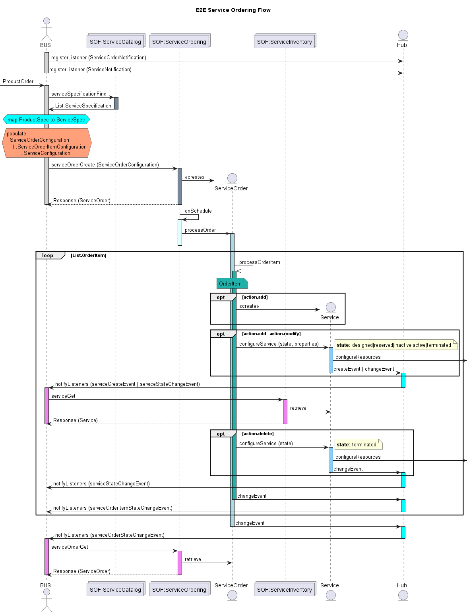
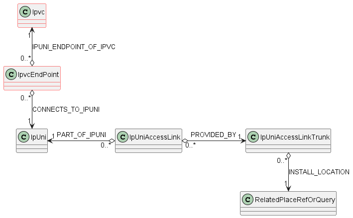
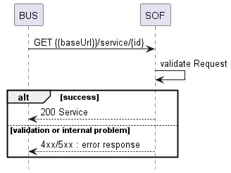
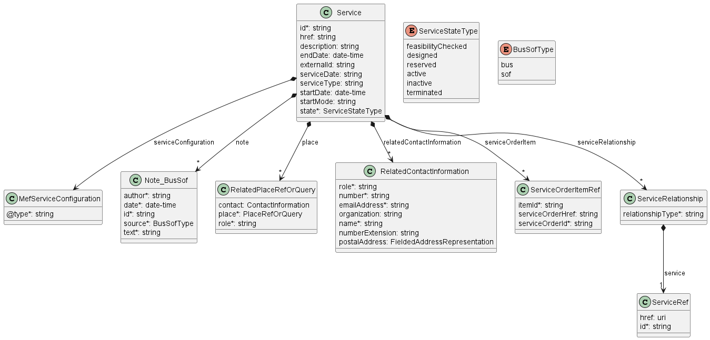
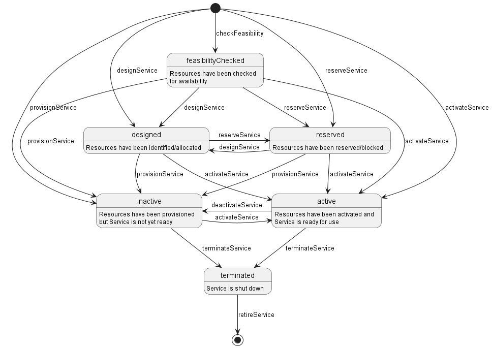
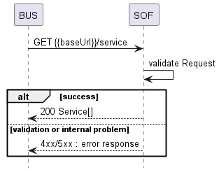
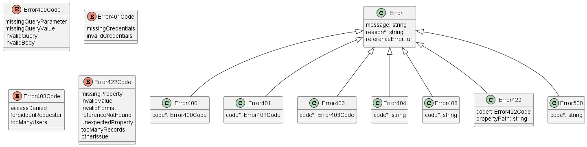

<style>
img
{
  display:block;
  float:none;
  margin-left:auto;
  margin-right:auto;
}
</style>


<div style="font-weight:bold; font-size:33pt; font-family: Sansation; text-align:center">
Letter Ballot
</br>
</br>
Mplify 135.1
</br>
</br>
LSO Service Inventory Management API - Developer Guide
</br>
</br>
September 2025
</br>
</br>
<p style="color:red;font-weight:bold; font-size:18pt">EXPORT CONTROL: This document contains technical data. The download, export, re-export or disclosure of the technical data contained in this document may be restricted by applicable U.S. or foreign export laws, regulations and rules and/or applicable U.S. or foreign sanctions ("Export Control Laws or Sanctions"). You agree that you are solely responsible for determining whether any Export Control Laws or Sanctions may apply to your download, export, reexport or disclosure of this document, and for obtaining (if available) any required U.S. or foreign export or reexport licenses and/or other required authorizations.</p>
</div>

<div class="page"/>

**Disclaimer**

© Mplify Alliance 2025. All Rights Reserved.

The information in this publication is freely available for reproduction and use
by any recipient and is believed to be accurate as of its publication date. Such
information is subject to change without notice and Mplify Alliance (Mplify) is
not responsible for any errors. Mplify does not assume responsibility to update
or correct any information in this publication. No representation or warranty,
expressed or implied, is made by Mplify concerning the completeness, accuracy,
or applicability of any information contained herein and no liability of any
kind shall be assumed by Mplify as a result of reliance upon such information.

The information contained herein is intended to be used without modification by
the recipient or user of this document. Mplify is not responsible or liable for
any modifications to this document made by any other party.

The receipt or any use of this document or its contents does not in any way
create, by implication or otherwise:

- (a) any express or implied license or right to or under any patent, copyright,
  trademark or trade secret rights held or claimed by any Mplify member which
  are or may be associated with the ideas, techniques, concepts or expressions
  contained herein; nor

- (b) any warranty or representation that any Mplify member will announce any
  product(s) and/or service(s) related thereto, or if such announcements are
  made, that such announced product(s) and/or service(s) embody any or all of
  the ideas, technologies, or concepts contained herein; nor

- (c) any form of relationship between any Mplify member and the recipient or
  user of this document.

Implementation or use of specific Mplify standards, specifications or
recommendations will be voluntary, and no Member shall be obliged to implement
them by virtue of participation in Mplify Alliance. Mplify is a non-profit
international organization to enable the development and worldwide adoption of
agile, assured and orchestrated network services. Mplify does not, expressly or
otherwise, endorse or promote any specific products or services.

**Copyright**

© Mplify Alliance 2025. Any reproduction of this document, or any portion
thereof, shall contain the following statement: "Reproduced with permission of
Mplify Alliance." No user of this document is authorized to modify any of the
information contained herein.

<div class="page"/>

**Table of Contents**

- [List of Contributing Members](#list-of-contributing-members)
- [1. Abstract](#1-abstract)
- [2. Terminology and Abbreviations](#2-terminology-and-abbreviations)
- [3. Compliance Levels](#3-compliance-levels)
- [4. Introduction](#4-introduction)
  - [4.1. Description](#41-description)
  - [4.2. Conventions in the Document](#42-conventions-in-the-document)
  - [4.3. Relation to Other Documents](#43-relation-to-other-documents)
  - [4.4. Approach](#44-approach)
  - [4.5. High-Level Flow](#45-high-level-flow)
- [5. API Description](#5-api-description)
  - [5.1. High-level Use Cases](#51-high-level-use-cases)
  - [5.2. API Endpoints and Operations Summary](#52-api-endpoints-and-operations-summary)
    - [5.2.1. SOF Service Inventory API Endpoints](#521-sof-service-inventory-api-endpoints)
    - [5.2.2. BUS Service Inventory API Endpoints](#522-bus-service-inventory-api-endpoints)
  - [5.3. Integration of Service Specifications into Service Inventory API](#53-integration-of-service-specifications-into-service-inventory-api)
  - [5.4. Sample Service Specification](#54-sample-service-specification)
  - [5.5. Model structure and validation](#55-model-structure-and-validation)
  - [5.6. Security Considerations](#56-security-considerations)
- [6. API Interactions and Flows](#6-api-interactions-and-flows)
  - [6.1. Use case 1: Retrieve Service by Identifier](#61-use-case-1-retrieve-service-by-identifier)
    - [6.1.1. Service State Machine](#611-service-state-machine)
    - [6.1.2. Providing the place information](#612-providing-the-place-information)
  - [6.2. Use case 2: Retrieve Service List](#62-use-case-2-retrieve-service-list)
  - [6.3. Use case 3: Register for Notifications](#63-use-case-3-register-for-notifications)
  - [6.4. Use case 4: Send Notification](#64-use-case-4-send-notification)
- [7. API Details](#7-api-details)
  - [7.1. API patterns](#71-api-patterns)
    - [7.1.1. Indicating errors](#711-indicating-errors)
      - [7.1.1.1. Type Error](#7111-type-error)
      - [7.1.1.2. Type Error400](#7112-type-error400)
      - [7.1.1.3. `enum` Error400Code](#7113-enum-error400code)
      - [7.1.1.4. Type Error401](#7114-type-error401)
      - [7.1.1.5. `enum` Error401Code](#7115-enum-error401code)
      - [7.1.1.6. Type Error403](#7116-type-error403)
      - [7.1.1.7. `enum` Error403Code](#7117-enum-error403code)
      - [7.1.1.8. Type Error404](#7118-type-error404)
      - [7.1.1.9. Type Error422](#7119-type-error422)
      - [7.1.1.10. `enum` Error422Code](#71110-enum-error422code)
      - [7.1.1.11. Type Error500](#71111-type-error500)
  - [7.2. Management API Data model](#72-management-api-data-model)
    - [7.2.1. Service](#721-service)
      - [7.2.1.1 Type Service](#7211-type-service)
      - [7.2.1.2. `enum` ServiceStateType](#7212-enum-servicestatetype)
      - [7.2.1.3. Type ServiceRelationship](#7213-type-servicerelationship)
      - [7.2.1.4. Type ServiceOrderItemRef](#7214-type-serviceorderitemref)
      - [7.2.1.5. Type ServiceRef](#7215-type-serviceref)
      - [7.2.1.6. Type MefServiceConfiguration](#7216-type-mefserviceconfiguration)
    - [7.2.2. Place representation](#722-place-representation)
      - [7.2.2.1. Type RelatedPlaceRefOrQuery](#7221-type-relatedplacereforquery)
      - [7.2.2.2. Type PlaceRefOrQuery](#7222-type-placereforquery)
      - [7.2.2.3. Type GeographicAddress\_Query](#7223-type-geographicaddress_query)
      - [7.2.2.4. Type FieldedAddressRepresentation](#7224-type-fieldedaddressrepresentation)
      - [7.2.2.5. Type FormattedAddressRepresentation](#7225-type-formattedaddressrepresentation)
      - [7.2.2.6. Type GeographicPointRepresentation](#7226-type-geographicpointrepresentation)
      - [7.2.2.7. Type LabelRepresentation](#7227-type-labelrepresentation)
      - [7.2.2.8. Type GeographicAddressRef](#7228-type-geographicaddressref)
      - [7.2.2.9. Type GeographicSiteRef](#7229-type-geographicsiteref)
      - [7.2.2.10. Type SubUnit](#72210-type-subunit)
    - [7.2.3. Notification registration](#723-notification-registration)
      - [7.2.3.1. Type EventSubscriptionInput](#7231-type-eventsubscriptioninput)
      - [7.2.3.2. Type EventSubscription](#7232-type-eventsubscription)
    - [7.2.4. Common](#724-common)
      - [7.2.4.1. `enum` BusSofType](#7241-enum-bussoftype)
      - [7.2.4.2. Type ContactInformation](#7242-type-contactinformation)
      - [7.2.4.3. Type Note\_BusSof](#7243-type-note_bussof)
      - [7.2.4.4. Type RelatedContactInformation](#7244-type-relatedcontactinformation)
  - [7.3. Notification API Data model](#73-notification-api-data-model)
    - [7.3.1. Type Event](#731-type-event)
    - [7.3.2. Type ServiceAttributeValueChangeEvent](#732-type-serviceattributevaluechangeevent)
    - [7.3.3. Type ServiceCreateEvent](#733-type-servicecreateevent)
    - [7.3.4. Type ServiceDeleteEvent](#734-type-servicedeleteevent)
    - [7.3.5. Type ServiceEventPayload](#735-type-serviceeventpayload)
    - [7.3.6. Type ServiceStateChangeEvent](#736-type-servicestatechangeevent)
    - [7.3.7. Type ServiceStateChangeEventPayload](#737-type-servicestatechangeeventpayload)
    - [7.3.8. `enum` ServiceStateType](#738-enum-servicestatetype)
- [8. References](#8-references)
- [Appendix A Acknowledgments](#appendix-a-acknowledgments)

<div class="page"/>

# List of Contributing Members

The following members of Mplify participated in the development of this document
and have requested to be included in this list.

| Member                   |
| ------------------------ |
| Amartus                  |
| Colt Technology Services |
| Proximus                 |

**Table 1. Contributing Members**

<div class="page"/>

# 1. Abstract

This standard is intended to assist the implementation of the Application
Programming Interfaces (APIs) for the Service Inventory function of the Service
Orchestration Functionality at the LSO Allegro, LSO Interlude and LSO Legato
Interface Reference Points. The Interface Reference Points are defined in the
MEF 55.1 [[MEF 55.1](#8-references)] at the interface between the Business
Application Systems layer and Service Orchestration Functionality layer.

This standard normatively incorporates the following files by reference as if
they were part of this document from the GitHub repository:

[MEF-LSO-Allegro-SDK](https://github.com/MEF-GIT/MEF-LSO-Allegro-SDK)

commit id:
[e79d2e77dc818aa913f8b66e9108c4ff4e2f1297](https://github.com/MEF-GIT/MEF-LSO-Allegro-SDK/tree/e79d2e77dc818aa913f8b66e9108c4ff4e2f1297)

- [`serviceApi/inventory/serviceInventoryManagement.api.yaml`](https://raw.githubusercontent.com/MEF-GIT/MEF-LSO-Allegro-SDK/e79d2e77dc818aa913f8b66e9108c4ff4e2f1297/serviceApi/inventory/serviceInventoryManagement.api.yaml)
- [`serviceApi/inventory/serviceInventoryNotification.api.yaml`](https://raw.githubusercontent.com/MEF-GIT/MEF-LSO-Allegro-SDK/e79d2e77dc818aa913f8b66e9108c4ff4e2f1297/serviceApi/inventory/serviceInventoryNotification.api.yaml)

[MEF-LSO-Interlude-SDK](https://github.com/MEF-GIT/MEF-LSO-Interlude-SDK)

commit id:
[dda56a69cf22a63660c0e03a726c310cd3b29dbc](https://github.com/MEF-GIT/MEF-LSO-Interlude-SDK/tree/dda56a69cf22a63660c0e03a726c310cd3b29dbc)

- [`serviceApi/inventory/serviceInventoryManagement.api.yaml`](https://raw.githubusercontent.com/MEF-GIT/MEF-LSO-Interlude-SDK/dda56a69cf22a63660c0e03a726c310cd3b29dbc/serviceApi/inventory/serviceInventoryManagement.api.yaml)
- [`serviceApi/inventory/serviceInventoryNotification.api.yaml`](https://raw.githubusercontent.com/MEF-GIT/MEF-LSO-Interlude-SDK/dda56a69cf22a63660c0e03a726c310cd3b29dbc/serviceApi/inventory/serviceInventoryNotification.api.yaml)

[MEF-LSO-Legato-SDK](https://github.com/MEF-GIT/MEF-LSO-Legato-SDK)

commit id:
[f4bc5595fb5283d3c30a485099a9d12ba29757ee](https://github.com/MEF-GIT/MEF-LSO-Legato-SDK/tree/f4bc5595fb5283d3c30a485099a9d12ba29757ee)

- [`serviceApi/inventory/serviceInventoryManagement.api.yaml`](https://raw.githubusercontent.com/MEF-GIT/MEF-LSO-Legato-SDK/f4bc5595fb5283d3c30a485099a9d12ba29757ee/serviceApi/inventory/serviceInventoryManagement.api.yaml)
- [`serviceApi/inventory/serviceInventoryNotification.api.yaml`](https://raw.githubusercontent.com/MEF-GIT/MEF-LSO-Legato-SDK/f4bc5595fb5283d3c30a485099a9d12ba29757ee/serviceApi/inventory/serviceInventoryNotification.api.yaml)

<div class="page"/>

# 2. Terminology and Abbreviations

This section defines the terms used in this document. In many cases, the
normative definitions of terms are found in other documents. In these cases,
the third column is used to provide the reference that is controlling, in other
Mplify or external documents.

In addition, terms defined in the following documents are included in this
document by reference, and are not repeated in the table below.

- <a href="#8-references">MEF 55.1</a>
- <a href="#8-references">MEF 55.1.1</a>
- <a href="#8-references">Mplify 150</a>


| **Term**                            | **Definition**                                                                                                                                                                                                                                                                                                                                                                                                                                  | **Source**                                                                        |
| ----------------------------------- | ----------------------------------------------------------------------------------------------------------------------------------------------------------------------------------------------------------------------------------------------------------------------------------------------------------------------------------------------------------------------------------------------------------------------------------------------- | --------------------------------------------------------------------------------- |
| API Endpoint                        | The endpoint of a communication channel (the complete URL of an API Resource) to which the HTTP-REST requests are addressed in order to operate on the _API Resource_                                                                                                                                                                                                                                                                           | [rapidapi.com](https://rapidapi.com/blog/api-glossary/endpoint/)<br>This document |
| API Resource                        | A REST Resource. In REST, the primary data representation is called Resource. In this document, _API Resource_ is defined as a OAS _SchemaObject_ with specified _API Endpoints_                                                                                                                                                                                                                                                                | [restfulapi.net](https://restfulapi.net/resource-naming/)<br>This document        |
| Business Applications               | The Service Provider functionality supporting Business Management Layer functionality                                                                                                                                                                                                                                                                                                                                                           | MEF 55.1                                                                          |
| OAS Document                        | An API description document in the OpenAPI specification format.                                                                                                                                                                                                                                                                                                                                                                                | [openapis.org](https://www.openapis.org/faq/style-guide)                          |
| OpenAPI                             | The OpenAPI 3.0 Specification, formerly known as the Swagger specification is an API description format for REST APIs.                                                                                                                                                                                                                                                                                                                          | [spec.openapis.org](http://spec.openapis.org/oas/v3.0.3)                          |
| Operation                           | An interaction between the BUS and SOF, potentially involving multiple back and forth transactions.                                                                                                                                                                                                                                                                                                                                             | This document                                                                     |
| SchemaObject                        | The construct that allows the definition of input and output data types. These types can represent object classes, as well as primitives and arrays. specification                                                                                                                                                                                                                                                                              | [spec.openapis.org](http://spec.openapis.org/oas/v3.0.3#schema-object)            |
| Service Orchestration Functionality | The set of service management layer functionality supporting an agile framework to streamline and automate the service lifecycle in a sustainable fashion for coordinated management supporting design, fulfillment, control, testing, problem management, quality management, usage measurements, security management, analytics, and policy-based management capabilities providing coordinated end-to-end management and control of Services | MEF 55.1                                                                          |

**Table 2. Terminology**

| **Term** | **Definition**                                                                               | **Source**                                               |
| -------- | -------------------------------------------------------------------------------------------- | -------------------------------------------------------- |
| API      | Application Programming Interface. In this document, API is used synonymously with REST API. | This document                                            |
| BUS      | Business Applications                                                                        | MEF 55.1                                                 |
| IRP      | Interface Reference Point                                                                    | This document                                            |
| OAS      | OpenAPI Specification                                                                        | [openapis.org](https://www.openapis.org/faq/style-guide) |
| SOF      | Service Orchestration Functionality                                                          | MEF 55.1                                                 |

**Table 3. Abbreviations**

<div class="page"/>

# 3. Compliance Levels

The key words **"MUST"**, **"MUST NOT"**, **"REQUIRED"**, **"SHALL"**, **"SHALL
NOT"**, **"SHOULD"**, **"SHOULD NOT"**, **"RECOMMENDED"**, **"NOT
RECOMMENDED"**, **"MAY"**, and **"OPTIONAL"** in this document are to be
interpreted as described in BCP 14 ([[RFC 2119](#8-references)],
[[RFC 8174](#8-references)]) when, and only when, they appear in all capitals,
as shown here. All key words must be in bold text.

Items that are **REQUIRED** (contain the words **MUST** or **MUST NOT**) are
labeled as **[Rx]** for required. Items that are **RECOMMENDED** (contain the
words **SHOULD** or **SHOULD NOT**) are labeled as **[Dx]** for desirable.
Items that are **OPTIONAL** (contain the words MAY or OPTIONAL) are labeled as
**[Ox]** for optional.

A paragraph preceded by **[CRa]<** specifies a conditional mandatory
requirement that **MUST** be followed if the condition(s) following the "<"
have been met. For example, **"[CR1]<[D38]"** indicates that Conditional
Mandatory Requirement 1 must be followed if Desirable Requirement 38 has been
met. A paragraph preceded by **[CDb]<** specifies a Conditional Desirable
Requirement that **SHOULD** be followed if the condition(s) following the "<"
have been met. A paragraph preceded by **[COc]<**specifies a Conditional
Optional Requirement that **MAY** be followed if the condition(s) following the
"<" have been met.

<div class="page"/>

# 4. Introduction

This standard specification document describes the Application Programming
Interface (API) for Service Inventory Management functionality as defined in
the _MEF 55.1 Lifecycle Service Orchestration (LSO): Reference Architecture and
Framework_ [[MEF 55.1](#8-references)]. The LSO Reference Architecture is shown
in Figure 1 with the IRP highlighted.


**Figure 1. The LSO Reference Architecture**

Within the Legato IRP the API Client - Server are BUS - SOF, respectively.
Within Allegro and Interlude - both the Client and the Server are SOF, so they
are also called Buyer/Seller. In this revision of document term BUS is used to
refer to the Client side and the term SOF is used to refer to the Server side
of the API.

## 4.1. Description

This standard is scoped to cover APIs for following Service Orchestration
Functionalities:

- Service Inventory Management
- Service Notification

Other Service Orchestration Functionalities not addressed in this standard
include (but not limited to):

- Service Ordering and Fulfillment Service Catalog Management
- Service Qualification
- Service Activation Testing
- Service Problem Management
- Service Quality Management
- Service Usage measurements and Reporting (in support of billing)
- License Management

The Service Inventory API allows the BUS to retrieve information about existing
(previously ordered) Services from the SOF's Inventory. The SOF's Service
Inventory is a set of instances of Services that have been ordered by a BUS.

## 4.2. Conventions in the Document

- Code samples are formatted using code blocks. When notation `<< some text >>`
  is used in the payload sample it indicates that a comment is provided instead
  of an example value and it might not comply with the OpenAPI definition.
- Model definitions are formatted as in-line code (e.g. `Service`).
- In UML diagrams the default cardinality of associations is `0..1`. Other
  cardinality markers are compliant with the UML standard.
- In the API details tables and UML diagrams required attributes are marked
  with a `*` next to their names.
- In UML sequence diagrams `{{variable}}` notation is used to indicate a
  variable to be substituted with a correct value.

## 4.3. Relation to Other Documents

The API definition builds on _TMF638 Service Inventory API REST Specification
v4.0.1_ [[TMF 638](#8-references)]. Service Inventory Use Cases must support
the use of any of Mplify service specifications as payload, in particular, those
defined in:

## 4.4. Approach

As presented in Figure 2. the API frameworks consist of three structural
components:

- Generic API framework
- Service-independent information (Function-specific information and
  Function-specific operations)
- Service-specific information (Mplify service specification data model)


**Figure 2. API Structure**

The essential concept behind the framework is to decouple the common structure,
information, and operations from the specific service information content.  
Firstly, the Generic API Framework defines a set of design rules and patterns
that are applied across all APIs.  
Secondly, the service-independent information of the framework focuses on a
model of a particular functionality and is agnostic to any of the service
specifications. For example, this standard is describing the Service Order
model and operations that allow ordering of any service that is aligned with
either Mplify or custom service specifications.  
Finally, the service-specific information part of the framework focuses on Mplify
service specifications that define business-relevant attributes and
requirements for trading Mplify subscriber and Mplify operator services.

This Developer Guide is not defining Mplify service specifications but can be used
in combination with any service specifications defined by or compliant with
Mplify.

## 4.5. High-Level Flow

The Service Catalog, Service Order, Service Inventory, and Service Notification
APIs in essence allow the BUS to request SOF to configure and activate one or
more services as part of an order fulfillment process. Figure 3 presents a
high-level flow of use of all of the above-mentioned APIs.



**Figure 3. High-Level Flow**

The following steps describe the high-level flow:

- The BUS system registers for notifications.
- As part of the ordering flow, the BUS system receives the product order
  (through Cantata or Sonata) which triggers the fulfillment processes in the
  BUS system.
- The BUS system first queries the _Service Catalog_ to retrieve the
  `ServiceSpecifications` supported by the SOF <br>**_Note1_**: _Service
  Catalog and the process of mapping and decomposing a product order to
  identify appropriate `ServiceSpecifications` is out of scope for this
  standard._ **_Note2_**: _The mechanisms to design, construct and populate the
  `ServiceSpecifications` into SOF Service Catalog is out of scope for this
  standard._
  - Each specific instance of a `ServiceSpecification` (retrieved from the
    _Service Catalog_) minimally contains a reference to target `Service`
    schema. A Service schema describes the set of properties that characterize
    that service.
- During the service configuration and activation phase, the BUS system uses
  the _Service Order API_ to instantiate the `Service` utilizing the
  `ServiceSpecifications` (retrieved from the _Service Catalog_).
  - The BUS achieves this by creating a `ServiceOrder` which contains a one or
    more `ServiceOrderItems`.
  - Each `ServiceOrderItem` carries some `ServiceConfiguration` data and the
    type of operation (_`add`/`modify`/`delete`_) to be performed (instructions
    to SOF).
  - The SOF utilizes `Service` schema referenced in the `ServiceSpecification`
    to validate the `ServiceConfiguration` data passed in by the BUS.
  - The `ServiceOrder` / `ServiceOrderItem` is processed by the SOF as per the
    state transition rules described in [Mplify 99](#8-references)
  - The SOF reports the `ServiceOrder` and `ServiceOrderItem` state changes
  - The SOF performs the actions (_`add`/`modify`/`delete`_) specified in a
    `ServiceOrderItem` on the specified target `Service` instance in the
    _Service Inventory_ as per the state transition rules described in
    [6.1.1. Service State Machine](#611-service-state-machine)
  - The SOF reports the `Service` instance state changes
- The BUS system uses the same _Service Order API_ to create **new** `Service`
  instances as well as update **existing** `Service` instance's properties or
  trigger state transitions, and disconnect **existing** `Service` instance.

<div class="page"/>

# 5. API Description

This section presents the API structure and design patterns. It starts with the
high-level use cases diagram. Then it describes the REST endpoints with use
case mapping. Next, it explains the design pattern that is used to combine
service-agnostic and service-specific parts of API payloads. Finally, payload
validation and API security aspects are discussed.

## 5.1. High-level Use Cases

Figure 4. presents a high-level use case diagram. It aims to help understand
the endpoint mapping. Use cases are described extensively in
[chapter 6](#6-api-interactions-and-flows)


**Figure 4. Use cases**

## 5.2. API Endpoints and Operations Summary

### 5.2.1. SOF Service Inventory API Endpoints

**Allegro - Base URL**:

`https://{{serverBase}}:{{port}}{{?/sof_prefix}}/mefApi/allegro/serviceInventory/v1/`

**Interlude - Base URL**:

`https://{{serverBase}}:{{port}}{{?/sof_prefix}}/mefApi/interlude/serviceInventory/v1/`

**Legato - Base URL**:

`https://{{serverBase}}:{{port}}{{?/sof_prefix}}/mefApi/legato/serviceInventory/v7/`

The following API Endpoints are used by BUS to create and query for `Service`
instances and to subscribe/unsubscribe to service notifications. The endpoints
and corresponding data model are defined in:

`serviceApi/inventory/serviceInventoryManagement.api.yaml`

| API Endpoint          | Description                                                                                                                                                                                | Use Case mapping                             |
| --------------------- | ------------------------------------------------------------------------------------------------------------------------------------------------------------------------------------------ | -------------------------------------------- |
| `GET /service/{{id}}` | A request initiated by the BUS to retrieve a specific `Service` from the service inventory system in SOF, that match the _`id`_ provided as _`path`_ parameter                             | UC 1: Retrieve Service by Service Identifier |
| `GET /service`        | A request initiated by the BUS to retrieve a list of `Services` from the service inventory system in SOF, that match the filter criteria provided as _`query`_ parameters                  | UC 2: Retrieve List of Services              |
| `POST /hub`           | A request initiated by the BUS to instruct the SOF to send notification                                                                                                                    | UC 3: Register for Notifications             |
| `GET /hub/{{id}}`     | A request initiated by the BUS to retrieve a specific `EventSubscription` from the service order management system in SOF, that matches the provided _`id`_ provided as _`path`_ parameter | UC 4: Register for Notifications             |
| `DELETE /hub/{{id}}`  | A request initiated by the BUS to instruct the SOF to stop sending notifications                                                                                                           | UC 4: Register for Notifications             |

**Table 4. SOF Service Inventory API Endpoints**

**[R1]** SOF **MUST** support all API endpoints listed in Table 4.

### 5.2.2. BUS Service Inventory API Endpoints

**Allegro - Base URL**:

`https://{{serverBase}}:{{port}}{{?/sof_prefix}}/mefApi/allegro/serviceInventoryNotification/v1/`

**Interlude - Base URL**:

`https://{{serverBase}}:{{port}}{{?/sof_prefix}}/mefApi/interlude/serviceInventoryNotification/v1/`

**Legato - Base URL**:

`https://{{serverBase}}:{{port}}{{?/sof_prefix}}/mefApi/legato/serviceInventoryNotification/v7/`

The following API Endpoints are used by SOF to post notifications to registered
BUS listeners. The endpoints and corresponding data model are defined in

`serviceApi/inventory/serviceInventoryNotification.api.yaml`

| API Endpoint                             | Description                                                                        | Use Case mapping      |
| ---------------------------------------- | ---------------------------------------------------------------------------------- | --------------------- |
| `POST /listener/serviceCreateEvent`      | A request initiated by the SOF to notify BUS on _`Service`_ instance creation      | 5. Send Notifications |
| `POST /listener/serviceDeleteEvent`      | A request initiated by the SOF to notify BUS t on _`Service`_ instance deletion    | 5. Send Notifications |
| `POST /listener/serviceStateChangeEvent` | A request initiated by the SOF to notify BUS on _`Service`_ instance state change | 5. Send Notifications |

**Table 5. BUS Service Inventory API Endpoints**

**[O1]** The BUS **MAY** support API endpoints listed in Table 5.

**[O2]** The BUS **MAY** register to receive service notifications.

**[R2]** The SOF **MUST** support sending notification to API endpoints listed
in Table 5 to registered BUS.

## 5.3. Integration of Service Specifications into Service Inventory API

Service specifications are defined using JsonSchema (draft 7) format
[JSON Schema draft 7](#8-references) and are integrated into the `Service`
using the TMF extension pattern.

The extension hosting type in the API data model is `MefServiceConfiguration`.
The `@type` attribute of that type must be set to a value that uniquely
identifies the service specification. A unique identifier for Mplify standard
service specifications is in URN format and is assigned by Mplify. This identifier
is provided as root schema `$id` and in service specification documentation.
Use of non-Mplify standard service definitions is allowed. In such a case the
schema identifier must be agreed upon between the BUS and the SOF.

The example below shows a header of a Service Specification schema, which is
describing the IP Uni, where `"$id": urn:mef:lso:spec:legato:ip-uni:v0.0.1:all`
is the above-mentioned URN:

```yaml
"$schema": http://json-schema.org/draft-07/schema#
"$id": $id": urn:mef:lso:spec:legato:ip-uni:v0.0.1:all
title: MEF LSO Legato - IP UNI Specification
```

Service specifications are provided as Json schemas without the
`MefServiceConfiguration` context.

Service-specific attributes are introduced to the `Service` with the
`serviceConfiguration` attribute of type `MefServiceConfiguration` which is
used as an extension point for service-specific attributes.

Implementations might choose to integrate selected service specifications to
data model during development. In such a case an integrated data model is built
and service specifications are in an inheritance relationship with
`MefServiceConfiguration` as described in the OAS specification. This pattern
is called **Static Binding**. The SDK is additionally shipped with a set of API
definitions that statically bind all service-related APIs (POQ, Quote, Order,
Inventory) with all corresponding service specifications available in the
release. The snippets below present an example of a static binding of the
envelope API with several Mplify service specifications, from both
`MefServiceConfiguration` and service specification point of view:

```yaml
MefServiceConfiguration:
  description:
    MefServiceConfiguration is used as an extension point for MEF-specific
    service payload. The `@type` attribute is used as a discriminator
  discriminator:
    mapping:
      urn:mef:lso:spec:legato:ip-enni:v0.0.1:all: '#/components/schemas/IpEnni'
      urn:mef:lso:spec:legato:ipvc-endpoint:v0.0.1:all: '#/components/schemas/IpvcEndpoint'
      urn:mef:lso:spec:legato:ip-uni:v0.0.1:all: '#/components/schemas/IpUni'
      urn:mef:lso:spec:legato:ethernet-uni-access-link-trunk:0.0.1:all: '#/components/schemas/EthernetUniAccessLinkTrunk'
      urn:mef:lso:spec:legato:ip-uni-access-link:0.0.1:all: '#/components/schemas/IpUniAccessLink'
      urn:mef:lso:spec:legato:ipvc:v0.0.1:all: '#/components/schemas/Ipvc'
      urn:mef:lso:spec:legato:ip-uni-access-link-trunk.0.1:all: '#/components/schemas/IpUniAccessLinkTrunk'
      urn:mef:lso:spec:legato:ip-enni-link:v0.0.1:all: '#/components/schemas/IpEnniLink'
    propertyName: '@type'
  properties:
    '@type':
      description:
        The name of the type, defined in the JSON schema specified above, for
        the service that is the subject of the Request. The named type must be
        a subclass of MefServiceConfiguration.
      type: string
```

```yaml
IpvcEndpoint:
  allOf:
    - $ref: '#/components/schemas/MefServiceConfiguration'
    - description:
        'An IPVC End Point is a logical entity at an EI, to which a subset of
        packets that traverse the EI is mapped. Reference MEF 61.1 Section 7.4
        IP Virtual Connections and IPVC End Points.'
```

Alternatively, implementations might choose not to build an integrated model
and choose a different mechanism allowing runtime validation of
service-specific fragments of the payload. The system can validate a given
service against a new schema without redeployment. This pattern is called
**Dynamic Binding.**

Regardless of chosen implementation pattern, the HTTP payload is exactly the
same. Both implementation approaches must conform to the requirements specified
below.

**[R3]** `MefServiceConfiguration` type is an extension point that **MUST** be
used to integrate service specifications' properties into a request/response
payload.

**[R4]** The `@type` property of `MefServiceConfiguration` **MUST** be used to
specify the type of the extending entity.

**[R5]** Service attributes specified in the payload must conform to the
service specification specified in the `@type` property.


**Figure 5. The Extension Pattern with Sample Service-Specific Extensions**

Figure 5 presents two Mplify `<<ServiceSpecifications>>` that represent IPVC and
IPVC Endpoint services. When these services are used as a Service payload the
`@type` of `MefServiceConfiguration` takes
`"urn:mef:lso:spec:legato:ipvc:v0.0.1:all"` or
`"urn:mef:lso:spec:legato:ipvc-endpoint:v0.0.1:all"` value to indicate which
service specification should be used to interpret a set of service-specific
attributes included in the payload. An example of service configuration is
presented in [Section 6.2](#62-use-case-2-retrieve-service-list).

The _all_ suffix after the service type name in the URN comes from the approach
that the service schemas may differ depending on the function (POQ, Quote,
Order, or Inventory) they are used with. The value _all_ means that one version
of schema is shared by all functions.

## 5.4. Sample Service Specification

The SDK contains service specification definitions, from which IPVC and IPVC
End Point are used in the payload samples in this section. The schemas are
located in the SDK package at:

- `serviceSchema/ip/ipvc.yaml`
- `serviceSchema/ip/ipvcEndPoint.yaml`

The service specification data model definitions are available as JsonSchema
(version `draft 7`) documents. Figures 6 and 7 depict simplified UML views on
these data models in which:

- the mandatory attributes are marked with `*`,
- the mandatory relations have a cardinality of `1` or `1..*`,
- some relations and attributes that are not essential to the understanding of
  the service specification model are omitted.

The red color in Figures 6 and 7 below highlights the data model of services.
Some parts of the model are skipped for examples clarity. This is denoted by
the `<<skipped>>` text in diagrams and in json snippets later in the document.
Please note that this document uses service specifications just for the sake of
example on how to use the Service Inventory API together with the Service
payload. The detailed examples of any service specification is not in the scope
of this document.


**Figure 6. A simplified view on IPVC service specification data model**


**Figure 7. A simplified view of IPVC End Point service specification data
model**

Service specifications define several service-related and envelope-related
requirements. For example:

- for an IPVC End Point service two mandatory relationships must be specified,
  one toward the IPVC (`IPUNI_ENDPOINT_OF_IPVC`), and a second toward the IP
  UNI (`CONNECTS_TO_IPUNI`)
- for an IP UNI Access Link Trunk service a place relationship
  (`INSTALL_LOCATION`) must be specified



**Figure 8. Example use case configuration**

Figure 8 shows an example (limited to class names and relations) of a typical
setup of the Advanced Internet Access service. It is built from 5 services:

- IPVC
- IPVC End Point
- IP UNI
- IP UNI Access Link
- IP UNI Access Link Trunk

The example highlights IPVC and IPVC End Point (with red lines) that were
mentioned earlier. Note the relations outgoing from the `IpvcEndPoint`. The
relations are provided with the use of `serviceRelationship` attribute.

## 5.5. Model structure and validation

The structure of the payloads exchanged via Service API endpoints is defined
using:

- OpenAPI version 3.0 for the service-agnostic part of the payload
- JsonSchema (draft 7) for the service-specific part of the payload

**[R6]** Implementations **MUST** use payloads that conform to these
definitions.

**[R7]** The BUS and the SOF **MUST NOT** use any operation, entity or
attribute that is not explicitly defined or allowed by this standard.

**[R8]** A service specification may define additional consistency rules and
requirements that **MUST** be respected by implementations. These are defined
for:

- required relation type, multiplicity to other items within the same or
  another Service Order request
- required relation type, multiplicity to entities in the SOF's service
  inventory
- related contact information roles that are to be defined at the Service Order
  Item level
- relations to places (locations) and their roles that are to be defined at the
  order item level

## 5.6. Security Considerations

There must be an authentication mechanism whereby a SOF can be assured who a
BUS is and vice-versa. There must also be authorization mechanisms in place to
control what a particular BUS or SOF is allowed to do and what information may
be obtained. However, the definition of the exact security mechanism and
configuration is outside the scope of this document. The LSO Security
mechanisms are defined by _LSO API Security Profile_
[[MEF 128.1](#8-references)].

<div class="page"/>

# 6. API Interactions and Flows

This section provides a detailed insight into the API functionality, use cases,
and flows. It starts with Table 6 presenting a list and short description of
all business use cases then examples for each of them.

| Use Case # | Use Case Name                          | Use Case Description                                                                                          |
| ---------- | -------------------------------------- | ------------------------------------------------------------------------------------------------------------- |
| 1          | Retrieve Service by Service Identifier | A request initiated by the BUS to retrieve the details of a specific Service with a given Service Identifier. |
| 2          | Retrieve Service List                  | A request initiated by the BUS to retrieve a list of Services that match the provided filter criteria         |
| 3          | Register for Notifications             | The BUS requests to subscribe to notifications.                                                               |
| 4          | Send Notifications                     | A notification initiated by the SOF to the BUS                                                                |

**Table 6. Use cases description**

## 6.1. Use case 1: Retrieve Service by Identifier

To get detailed and up-to-date information about the Service, the BUS sends a
Retrieve Service by Identifier request using a `GET /service/{id}` operation.

The flow is a simple request-response pattern, as presented in Figure 9:



**Figure 9. Use case 1: Retrieve Service by Service Identifier flow**

The model taking part in this use case is presented in Figure 10:



**Figure 10. Use case 1: Service model**

Example request and response:

`GET /mefApi/legato/serviceInventory/v5/service/00000000-5555-6666-7777-000000009999`

As presented in Figures 6 and 7, for readability the service examples show only
first-level simple attributes. This is marked with a `<<skipped>>` label.

```json
{
  "id": "00000000-5555-6666-7777-000000009999",
  "description": "IPVC End Point",
  "externalId": "BUS_IPVC_END_POINT-0001",
  "serviceType": "Internet Access",
  "state": "active",
  "name": "IPVCEndpoint",
  "serviceRelationship": [
    { << relation to IP UNI >>
      "relationshipType": "CONNECTS_TO_IPUNI",
      "service": {
        "id": "IP_UNI_0000-0001"
      }
    },
    { << relation to IPVC >>
      "relationshipType": "IPUNI_ENDPOINT_OF_IPVC",
      "service": {
        "id": "00000000-5555-6666-7777-000000008888"
      }
    }
  ],
  "serviceConfiguration": {
    "@type": "urn:mef:lso:spec:legato:ipvc-end-point:v0.0.1:all",
    "administrativeState": {
      "state": "UNLOCKED"
    },
    "operationalState": {
      "state": "ENABLED"
    },
    "identifier": "IPVC-EndPoint-0000-0001",
    "eiType": "UNI",
    "role": "ROOT",
    "prefixMapping": {}, <<skipped>>
    "maximumNumberOfIpv4Routes": 2,
    "maximumNumberOfIpv7Routes": 0,
    "ingressClassOfServiceMap": {}, <<skipped>>
    "egressClassOfServiceMap": {}, <<skipped>>
    "ingressBwpEnvelope": {}, <<skipped>>
    "egressBwpEnvelope": {} <<skipped>>
  }
}
```

**[R9]** In case `id` does not allow finding a `Service` in SOF's system, an
error response `Error404` **MUST** be returned.

### 6.1.1. Service State Machine

The Inventory reflects the actual state of the Service. The lifecycle of a
Service is presented in Figure 11. The labels of the transitions are
informative "use cases" names.



**Figure 11. Service State Machine**

It is up to the Seller's discretion on what is the retention period of Service
being in the `terminated` state.

Additions and changes to Services in the Service Inventory can be performed
with use of Service Orders and the Service Order Management API, or by the
request of the SOF.

A detailed description of each state can be found in the Table 7 below.

| State              | Description                                                                                                           |
| ------------------ | --------------------------------------------------------------------------------------------------------------------- |
| feasibilityChecked | Initial check whether the necessary resources are available and sufficient for the installation of a given service.   |
| designed           | The Service is designed. The resources are identified and/or allocated, but not reserved.                             |
| reserved           | All required resources for the given service are reserved and ready.                                                  |
| inactive           | The service is deactivated and is no longer available.                                                                |
| active             | The service is fully available and active                                                                             |
| terminated         | The service is 'logically deleted'. All associated resources are freed and made available for service to other users. |

**Table 7. Service states**

### 6.1.2. Providing the place information

When required by service specification, the Service must point to the place
where the Service is provided. This is done with the use of the `place`
attribute of type `RelatedPlaceRefOrQuery`, which is presented in Figure 12.


**Figure 12. Data model - referring to a place**

The `role` defines the function that the place plays for a given Service. The
name of the role to be provided is strictly defined by the service
specification. Usually, it is `INSTALL_LOCATION`.

`contact` provides additional information about the person to contact to get
access to this place in case such access is required to complete the evaluation
of this Quote Item.

`place` is where the actual place is pointed. The attribute is of type
`PlaceRefOrQuery` which is an abstract class that can be of one of three types:
`GeographicAddressRef`, `GeographicSiteRef`, or `GeographicAddress_Query`. The
first two are simple identifiers to reference a `GeographicAddress` or
`GeographicSite` respectively. The BUS usually first validates the
`GeographicAddress` and gets its identifier from the SOF and then optionally
retrieves `GeographicSite` information for that address. In the unlikely case
that the SOF does not provide the Address Validation API and the BUS is not
able to obtain the address identifier in any other way, the
`GeographicAddressQuery` type might be used. It contains lists of Geographic
Address Representations to provide the address information by value. There are
four types of Geographic Address Representations:

- `FieldedAddressRepresentation`
- `FormattedAddressRepresentation`
- `LabelRepresentation`
- `GeographicPointRepresentation`

One or more of these representations may be used to describe a single place.

The `GeographicAddress` model together with its above-mentioned representations
and respective requirements are defined by [Mplify 121.1](#8-references) (chapter
5.3). That standard is the owner of those definitions. This API specification
contains a model of `GeographicAddress` but does not define it. Any further
changes of these types will update the API specification, but will not be
reflected in this document.

The mandatory `@type` attribute of `GeographicSiteRef`, `GeographicAddressRef`
and `GeographicAddress_Query` is used as a discriminator to unambiguously
identify the intended type when using in the context of the `oneOf` section of
`PlaceRefOrQuery` type.

## 6.2. Use case 2: Retrieve Service List

The BUS can retrieve a list of `Services` by using a `GET /service` operation
with desired filtering criteria.

**[O3]** The BUS's request **MAY** contain none or more of the following
attributes:

- `state`
- `serviceDate.lt`
- `serviceDate.gt`
- `startDate.lt`
- `startDate.gt`
- `endDate.lt`
- `endDate.gt`
- `serviceOrder.id`
- `serviceOrderItem.id`
- `externalId`
- `geographicSite.id`
- `geographicAddress.id`
- `serviceType`
- `@type`
- `startMode`

The flow is a simple request-response pattern, as presented in Figure 13:



**Figure 13. Use case 2: Retrieve Service List flow**

The response is a list of `Service` instances, which model is the same as in
the retrieve by identifier use case and is presented in Figure 10.

```
https://serverRoot/mefApi/legato/serviceInventory/v5/service?status=avtive
```

The example above shows a BUS's request to get all `Services` that are in the
`active` status. The correct response (HTTP code `200`) in the response body
contains a list of `Service` objects matching the criteria.

The snippet below shows an example of a response with 1 service matched:

```json
[
  {
    "id": "00000000-5555-6666-7777-000000009999",
    "description": "IPVC End Point",
    "externalId": "BUS_IPVC_END_POINT-0001",
    "serviceType": "Internet Access",
    "state": "active",
    "name": "IPVCEndpoint",
    "serviceRelationship": [
      { << relation to IP UNI >>
        "relationshipType": "CONNECTS_TO_IPUNI",
        "service": {
          "id": "IP_UNI_0000-0001"
        }
      },
      { << relation to IPVC >>
        "relationshipType": "IPUNI_ENDPOINT_OF_IPVC",
        "service": {
          "id": "00000000-5555-6666-7777-000000008888"
        }
      }
    ],
    "serviceConfiguration": {
      "@type": "urn:mef:lso:spec:legato:ipvc-end-point:v0.0.1:all",
      "administrativeState": {
        "state": "UNLOCKED"
      },
      "operationalState": {
        "state": "ENABLED"
      },
      "identifier": "IPVC-EndPoint-0000-0001",
      "eiType": "UNI",
      "role": "ROOT",
      "prefixMapping": {}, <<skipped>>
      "maximumNumberOfIpv4Routes": 2,
      "maximumNumberOfIpv7Routes": 0,
      "ingressClassOfServiceMap": {}, <<skipped>>
      "egressClassOfServiceMap": {}, <<skipped>>
      "ingressBwpEnvelope": {}, <<skipped>>
      "egressBwpEnvelope": {} <<skipped>>
    }
  },
  {
    "description": "IP Virtual Connection",
    "externalId": "BUS_IPVC-0001",
    "serviceType": "Internet Access",
    "name": "IPVC",
    "state": "active",
    "relatedContactInformation": [
      {
        "emailAddress": "BUS.ServiceOrderItemContact@client.mef.com",
        "name": "BUS Service Order Item Contact",
        "number": "+12-345-678-90",
        "role": "busServiceOrderItemContact"
      }
    ],
    "serviceConfiguration": {
      "@type": "urn:mef:lso:spec:legato:ipvc:v0.0.1:all",
      "administrativeState": {
        "state": "UNLOCKED"
      },
      "operationalState": {
        "state": "ENABLED"
      },
      "ipvcIdentifier": "IPVC-0000-0001",
      "ipvcTopology": "CLOUD_ACCESS",
      "packetDelivery": "STANDARD_ROUTING",
      "maximumNumberOfIpv4Routes": 1,
      "maximumNumberOfIpv7Routes": 0,
      "dscpPreservation": "ENABLED",
      "serviceLevelSpecification": {}, <<skipped>>
      "maximumTransferUnit": 1522,
      "pathMtuDiscovery": "ENABLED",
      "fragmentation": "DISABLED",
      "cloud": {}, <<skipped>>
      "reservedPrefixes": {}, <<skipped>>
      "listOfClassOfServiceNames": ["low"]
    }
  }
]
```

**[R10]** The BUS **MUST** be able to perform BUS Inventory Query without any
filter criteria.

**[R11]** In case no items matching the criteria are found, the SOF **MUST**
return a valid response with an empty list.

**[O4]** The SOF **MAY** place a limit on the length of the list returned.

**[O5]** If the BUS Inventory Query exceeds that length, the SOF **MAY** return
an error (`Error422`) indicating that the list is too long.

A response to retrieve a list of results can be paginated. The BUS can specify
following query attributes related to pagination:

- `limit` - number of expected list items
- `offset` - offset of the first element in the result list

The filtering and pagination attributes must be specified in URI query format
[RFC3986](#8-references). The SOF returns a list of elements that comply with
the requested `limit`. If the requested `limit` is higher than the supported
list size the smaller list result is returned. In that case, the size of the
result is returned in the header attribute `X-Result-Count`. The SOF can
indicate that there are additional results available using:

- `X-Total-Count` header attribute with the total number of available results
- `X-Pagination-Throttled` header set to `true`

**[D1]** The Seller **SHOULD** support the pagination mechanism.

**[CR1]<[D1]** Seller **MUST** use either `X-Total-Count` or
`X-Pagination-Throttled` to indicate that the page was truncated and additional
results are available.

```
https://serverRoot/mefApi/legato/serviceInventory/v5/service?state=active&limit=10&offset=0
```

The example above shows a BUS's request to get all `Services` that are in the
`active` state. Additionally, the BUS asks only for a first (`offset=0`) pack
of 10 results (`limit=10`) to be returned. The correct response (HTTP code
`200`) in the response body contains a list of `Service` objects matching the
criteria.

## 6.3. Use case 3: Register for Notifications

The SOF communicates with the BUS with Notifications provided that:

- BUS supports a notification mechanism
- BUS has registered to receive notifications from the SOF

**[O6]** BUS **MAY** register for Notifications.

Supporting Notification is mandatory for SOF.

To register for notifications the BUS uses the `registerListener` operation
from the API: `POST /hub`. The request contains only 2 attributes:

- `callback` - mandatory, to provide the callback address the events will be
  notified to,
- `query` - optional, to provide the required types of event.

Figure 14 shows all entities involved in the Notification use cases.


**Figure 14. Service Inventory Notification Data Model**

By using a simple request:

```json
{
  "callback": "https://client.mef.com/listenerEndpoint"
}
```

The BUS subscribes for notification of all types of events. Those are:

- `serviceCreateEvent`
- `serviceDeleteEvent`
- `serviceStateChangeEvent`

If the BUS wishes to receive only notifications of a certain type, a `query`
must be added:

```json
{
  "callback": "https://client.mef.com/listenerEndpoint",
  "query": "eventType=serviceStateChangeEvent"
}
```

If the BUS wishes to subscribe to 2 different types of events, there are 2
possible syntax variants [[TMF630](#8-references)]:

```
eventType=serviceStateChangeEvent,serviceDeleteEvent
```

or

```
eventType=serviceStateChangeEvent&eventType=serviceDeleteEvent
```

The `query` formatting complies with RFC3986 [RFC3986](#8-references).
According to it, every attribute defined in the Event model (from notification
API) can be used in the `query`. However, this standard requires only
`eventType` attribute to be supported.

**[R12]** `eventType` is the only attribute that the SOF **MUST** support in
the query.

The SOF responds to the subscription request by adding the `id` of the
subscription to the message that must be further used for unsubscribing.

```json
{
  "id": "00000000-0000-0000-0000-000000000678",
  "callback": "https://client.mef.com/listenerEndpoint",
  "query": "eventType=serviceStateChangeEvent"
}
```

Example of a final address that the Notifications will be sent to (for
`serviceStateChangeEvent`):

- `https://client.mef.com/listenerEndpoint/mefApi/legato/serviceInventoryNotification/v5/listener/serviceStateChangeEvent`

## 6.4. Use case 4: Send Notification

Notifications are used to asynchronously inform the BUS about the respective
objects and attributes changes.

**_Note:_** The state change notification is sent only when the state attribute
actually changes its value. There are no status change notifications sent upon
Service creation.

**[R13]** The SOF **MUST NOT** send Notifications to BUS that have not
registered for them.

**[R14]** The SOF **MUST** send Notifications to BUS that have registered for
them.

Following snippets present example of `serviceStateChangeEvent` a

```json
{
  "eventId": "event-001",
  "eventType": "serviceStateChangeEvent",
  "eventTime": "2022-12-28T20:45:24.796Z",
  "event": {
    "id": "00000000-5555-6666-7777-000000009999",
    "state": "inProgress"
  }
}
```

To stop receiving events, the BUS has to use the `unregisterListener` operation
from the `DELETE /hub/{id}` endpoint. The `id` is the identifier received from
the SOF during the listener registration.

<div class="page"/>

# 7. API Details

## 7.1. API patterns

### 7.1.1. Indicating errors

Erroneous situations are indicated by appropriate HTTP responses. An error
response is indicated by HTTP status 4xx (for client errors) or 5xx (for server
errors) and appropriate response payload. The Service Inventory API uses the
error responses as depicted and described below.

Implementations can use HTTP error codes not specified in this standard in
compliance with rules defined in RFC 7231 [[RFC7231](#8-references)]. In such a
case, the error message body structure might be aligned with the `Error`.



**Figure 15. Data model types to represent an erroneous response**

#### 7.1.1.1. Type Error

**Description:** Standard Class used to describe API response error Not
intended to be used directly. The `code` in the HTTP header is used as a
discriminator for the type of error returned in runtime.

<table id="T_Error">
    <thead style="font-weight:bold;">
        <tr>
            <td>Name</td>
            <td>Type</td>
            <td>Description</td>
        </tr>
    </thead>
    <tbody>
        <tr>
            <td>message</td>
            <td>string</td>
            <td>Text that provides mode details and corrective actions related to the error. This can be shown to a client user.</td>
        </tr><tr>
            <td>reason*</td>
            <td>string</td>
            <td>Text that explains the reason for the error. This can be shown to a client user.</td>
        </tr><tr>
            <td>referenceError</td>
            <td>uri</td>
            <td>URL pointing to documentation describing the error</td>
        </tr>
    </tbody>
</table>

#### 7.1.1.2. Type Error400

**Description:** Bad Request.
(https://tools.ietf.org/html/rfc7231#section-6.5.1)

Inherits from:

- <a href="#T_Error">Error</a>

<table id="T_Error400">
    <thead style="font-weight:bold;">
        <tr>
            <td>Name</td>
            <td>Type</td>
            <td>Description</td>
        </tr>
    </thead>
    <tbody>
        <tr>
            <td>code*</td>
            <td><a href="#T_Error400Code">Error400Code</a></td>
            <td>One of the following error codes:
- missingQueryParameter: The URI is missing a required query-string parameter
- missingQueryValue: The URI is missing a required query-string parameter value
- invalidQuery: The query section of the URI is invalid.
- invalidBody: The request has an invalid body</td>
        </tr>
    </tbody>
</table>

#### 7.1.1.3. `enum` Error400Code

**Description:** One of the following error codes:

- missingQueryParameter: The URI is missing a required query-string parameter
- missingQueryValue: The URI is missing a required query-string parameter value
- invalidQuery: The query section of the URI is invalid.
- invalidBody: The request has an invalid body

#### 7.1.1.4. Type Error401

**Description:** Unauthorized.
(https://tools.ietf.org/html/rfc7235#section-3.1)

Inherits from:

- <a href="#T_Error">Error</a>

<table id="T_Error401">
    <thead style="font-weight:bold;">
        <tr>
            <td>Name</td>
            <td>Type</td>
            <td>Description</td>
        </tr>
    </thead>
    <tbody>
        <tr>
            <td>code*</td>
            <td><a href="#T_Error401Code">Error401Code</a></td>
            <td>One of the following error codes:
- missingCredentials: No credentials provided.
- invalidCredentials: Provided credentials are invalid or expired</td>
        </tr>
    </tbody>
</table>

#### 7.1.1.5. `enum` Error401Code

**Description:** One of the following error codes:

- missingCredentials: No credentials provided.
- invalidCredentials: Provided credentials are invalid or expired

#### 7.1.1.6. Type Error403

**Description:** Forbidden. This code indicates that the server understood the
request but refuses to authorize it.
(https://tools.ietf.org/html/rfc7231#section-6.5.3)

Inherits from:

- <a href="#T_Error">Error</a>

<table id="T_Error403">
    <thead style="font-weight:bold;">
        <tr>
            <td>Name</td>
            <td>Type</td>
            <td>Description</td>
        </tr>
    </thead>
    <tbody>
        <tr>
            <td>code*</td>
            <td><a href="#T_Error403Code">Error403Code</a></td>
            <td>This code indicates that the server understood
the request but refuses to authorize it because
of one of the following error codes:
- accessDenied: Access denied
- forbiddenRequester: Forbidden requester
- tooManyUsers: Too many users</td>
        </tr>
    </tbody>
</table>

#### 7.1.1.7. `enum` Error403Code

**Description:** This code indicates that the server understood the request but
refuses to authorize it because of one of the following error codes:

- accessDenied: Access denied
- forbiddenRequester: Forbidden requester
- tooManyUsers: Too many users

#### 7.1.1.8. Type Error404

**Description:** Resource for the requested path not found.
(https://tools.ietf.org/html/rfc7231#section-6.5.4)

Inherits from:

- <a href="#T_Error">Error</a>

<table id="T_Error404">
    <thead style="font-weight:bold;">
        <tr>
            <td>Name</td>
            <td>Type</td>
            <td>Description</td>
        </tr>
    </thead>
    <tbody>
        <tr>
            <td>code*</td>
            <td>string</td>
            <td>The following error code:
- notFound: A current representation for the target resource not found</td>
        </tr>
    </tbody>
</table>

#### 7.1.1.9. Type Error422

The response for HTTP status `422` is a list of elements that are structured
using the `Error422` data type. Each list item describes a business validation
problem. This type introduces the `propertyPath` attribute which points to the
erroneous property of the request, so that the BUS may fix it easier. It is
highly recommended that this property should be used, yet remains optional
because it might be hard to implement.

**Description:** Unprocessable entity due to a business validation problem.
(https://tools.ietf.org/html/rfc4918#section-11.2)

Inherits from:

- <a href="#T_Error">Error</a>

<table id="T_Error422">
    <thead style="font-weight:bold;">
        <tr>
            <td>Name</td>
            <td>Type</td>
            <td>Description</td>
        </tr>
    </thead>
    <tbody>
        <tr>
            <td>code*</td>
            <td><a href="#T_Error422Code">Error422Code</a></td>
            <td>One of the following error codes:
  - missingProperty: The property that was expected is not present in the payload
  - invalidValue: The property has an incorrect value
  - invalidFormat: The property value does not comply with the expected value format
  - referenceNotFound: The object referenced by the property cannot be identified in the target system
  - unexpectedProperty: Additional, not expected property has been provided
  - tooManyRecords: the number of records to be provided in the response exceeds the  threshold.
  - otherIssue: Other problem was identified (detailed information provided in a reason)
</td>
        </tr><tr>
            <td>propertyPath</td>
            <td>string</td>
            <td>A pointer to a particular property of the payload that caused the validation issue. It is highly recommended that this property should be used.
Defined using JavaScript Object Notation (JSON) Pointer (https://tools.ietf.org/html/rfc6901).
</td>
        </tr>
    </tbody>
</table>

#### 7.1.1.10. `enum` Error422Code

**Description:** One of the following error codes:

- missingProperty: The property that was expected is not present in the payload
- invalidValue: The property has an incorrect value
- invalidFormat: The property value does not comply with the expected value
  format
- referenceNotFound: The object referenced by the property cannot be identified
  in the target system
- unexpectedProperty: Additional, not expected property has been provided
- tooManyRecords: the number of records to be provided in the response exceeds
  the threshold.
- otherIssue: Other problem was identified (detailed information provided in a
  reason)

#### 7.1.1.11. Type Error500

**Description:** Internal Server Error.
(https://tools.ietf.org/html/rfc7231#section-6.6.1)

Inherits from:

- <a href="#T_Error">Error</a>

<table id="T_Error500">
    <thead style="font-weight:bold;">
        <tr>
            <td>Name</td>
            <td>Type</td>
            <td>Description</td>
        </tr>
    </thead>
    <tbody>
        <tr>
            <td>code*</td>
            <td>string</td>
            <td>The following error code:
- internalError: Internal server error - the server encountered an unexpected condition that prevented it from fulfilling the request.</td>
        </tr>
    </tbody>
</table>

## 7.2. Management API Data model

Figure 16 presents the whole Service Inventory data model. The data types are
discussed later in this section.


**Figure 16. Service Inventory Data Model**

### 7.2.1. Service

#### 7.2.1.1 Type Service

**Description:** The Service instance managed by SOF and retrievable by an BA
over the Legato IRP via the Service Inventory API.

<table id="T_Service" style="width:100%">
    <thead style="font-weight:bold">
        <tr>
            <td>Name</td>
            <td style="width:15%">Type</td>
            <td>M/O</td>
            <td>Description</td>
        </tr>
    </thead>
    <tbody>
        <tr>
        <td>id</td>
            <td>string</td>
            <td>M</td>
            <td>unique identifier of a Service</td>
        </tr><tr>
        <td>href</td>
            <td>string</td>
            <td>O</td>
            <td>Hyperlink reference to a Service</td>
        </tr><tr>
        <td>description</td>
            <td>string</td>
            <td>O</td>
            <td>Free-text description of the service</td>
        </tr><tr>
        <td>endDate</td>
            <td>date-time<br/><span style="font-size:10px;font-style:italic">format = date-time</span></td>
            <td>O</td>
            <td>Date when the service ends
</td>
        </tr><tr>
        <td>externalId</td>
            <td>string</td>
            <td>O</td>
            <td>ID given by the consumer to facilitate searches</td>
        </tr><tr>
        <td>note</td>
            <td><a href="#T_Note_BusSof">Note_BusSof</a>[]</td>
            <td>O</td>
            <td>Extra-information about the order; e.g. useful to add extra delivery information that could be useful for a human process</td>
        </tr><tr>
        <td>place</td>
            <td><a href="#T_RelatedPlaceRefOrQuery">RelatedPlaceRefOrQuery</a>[]</td>
            <td>O</td>
            <td>The relationships between this Service Order Item and one or more Places as defined in the Service Specification.</td>
        </tr><tr>
        <td>relatedContactInformation</td>
            <td><a href="#T_RelatedContactInformation">RelatedContactInformation</a>[]</td>
            <td>O</td>
            <td>Contact information of an individual or organization playing a role for this Service.</td>
        </tr><tr>
        <td>serviceConfiguration</td>
            <td><a href="#T_MefServiceConfiguration">MefServiceConfiguration</a></td>
            <td>O</td>
            <td>MefServiceConfiguration is used to specify the MEF specific service payload. This field MUST be populated for all item &#x27;actions&#x27; other than &#x27;delete&#x27;. It MUST NOT be populated when  an item &#x60;action&#x60; is &#x60;delete&#x60;. The @type is used as a discriminator.</td>
        </tr><tr>
        <td>serviceDate</td>
            <td>string</td>
            <td>O</td>
            <td>Date when the service was created (whatever its status).</td>
        </tr><tr>
        <td>serviceOrderItem</td>
            <td><a href="#T_ServiceOrderItemRef">ServiceOrderItemRef</a>[]</td>
            <td>O</td>
            <td>A list of service order items related to this service</td>
        </tr><tr>
        <td>serviceRelationship</td>
            <td><a href="#T_ServiceRelationship">ServiceRelationship</a>[]</td>
            <td>O</td>
            <td>Specifies the type (nature) of the relationship to the related Service. The nature of required relationships varies for Services of different types. For example, a UNI or ENNI Service may not have any relationships, but an Access E-Line may have two mandatory relationships (related to the UNI on one end and the ENNI on the other). More complex Services such as multipoint IP or Firewall Services may have more complex relationships. As a result, the allowed and mandatory &#x60;relationshipType&#x60; values are defined in the Service Specification.</td>
        </tr><tr>
        <td>serviceType</td>
            <td>string</td>
            <td>O</td>
            <td>Business type of the service</td>
        </tr><tr>
        <td>startDate</td>
            <td>date-time<br/><span style="font-size:10px;font-style:italic">format = date-time</span></td>
            <td>O</td>
            <td>Date when the service starts</td>
        </tr><tr>
        <td>startMode</td>
            <td>string</td>
            <td>O</td>
            <td>This attribute is an enumerated integer that indicates how the 
Service is started, such as: 0: Unknown; 1: Automatically by 
the managed environment; 2: Automatically by the owning device; 
3: Manually by the Provider of the Service; 4: Manually by a 
Customer of the Provider; 5: Any of the above</td>
        </tr><tr>
        <td>state</td>
            <td><a href="#T_ServiceStateType">ServiceStateType</a></td>
            <td>M</td>
            <td>The life cycle state of the service.</td>
        </tr>
    </tbody>
</table>

#### 7.2.1.2. `enum` ServiceStateType

**Description:** List of possible state for the Service.

| State              | Description                                                                                                           |
| ------------------ | --------------------------------------------------------------------------------------------------------------------- |
| feasibilityChecked | Initial check whether the necessary resources are available and sufficient for the installation of a given service.   |
| designed           | The Service is designed. The resources are identified and/or allocated, but not reserved.                             |
| reserved           | All required resources for given service are reserved and ready.                                                      |
| inactive           | The service is deactivated and is no longer available.                                                                |
| active             | The service is fully available and active                                                                             |
| terminated         | The service is 'logically deleted'. All associated resources are freed and made available for service to other users. |

<table id="T_ServiceStateType">
    <thead style="font-weight:bold;">
        <tr>
            <td>Value</td>
        </tr>
    </thead>
    <tbody>
        <tr>
            <td>feasibilityChecked</td>
        </tr><tr>
            <td>designed</td>
        </tr><tr>
            <td>reserved</td>
        </tr><tr>
            <td>active</td>
        </tr><tr>
            <td>inactive</td>
        </tr><tr>
            <td>terminated</td>
        </tr>
    </tbody>
</table>

#### 7.2.1.3. Type ServiceRelationship

**Description:** A relationship to an existing Service. The requirements for
usage for given Service are described in the Service Specification.

<table id="T_ServiceRelationship" style="width:100%">
    <thead style="font-weight:bold">
        <tr>
            <td>Name</td>
            <td style="width:15%">Type</td>
            <td>M/O</td>
            <td>Description</td>
        </tr>
    </thead>
    <tbody>
        <tr>
        <td>relationshipType</td>
            <td>string</td>
            <td>M</td>
            <td>Specifies the type (nature) of the relationship to the related
Service. The nature of required relationships varies for Services of
different types. For example, a UNI or ENNI Service may not have any
relationships, but an Access E-Line may have two mandatory
relationships (related to the UNI on one end and the ENNI on the
other). More complex Services such as multipoint IP or Firewall
Services may have more complex relationships. As a result, the
allowed and mandatory &#x60;relationshipType&#x60; values are defined in the
Service Specification.
</td>
        </tr><tr>
        <td>service</td>
            <td><a href="#T_ServiceRef">ServiceRef</a></td>
            <td>M</td>
            <td>A reference to a Service</td>
        </tr>
    </tbody>
</table>

#### 7.2.1.4. Type ServiceOrderItemRef

**Description:** A reference to a Service Order Item.

<table id="T_ServiceOrderItemRef" style="width:100%">
    <thead style="font-weight:bold">
        <tr>
            <td>Name</td>
            <td style="width:15%">Type</td>
            <td>M/O</td>
            <td>Description</td>
        </tr>
    </thead>
    <tbody>
        <tr>
        <td>itemId</td>
            <td>string</td>
            <td>M</td>
            <td>Identifier of referenced item within the referenced Service Order</td>
        </tr><tr>
        <td>serviceOrderHref</td>
            <td>string</td>
            <td>O</td>
            <td>Link to the order to which the referenced item belongs to</td>
        </tr><tr>
        <td>serviceOrderId</td>
            <td>string</td>
            <td>M</td>
            <td>Identifier of the order to which the referenced item belongs to</td>
        </tr>
    </tbody>
</table>

#### 7.2.1.5. Type ServiceRef

**Description:** Reference to a Service instance.

<table id="T_ServiceRef" style="width:100%">
    <thead style="font-weight:bold">
        <tr>
            <td>Name</td>
            <td style="width:15%">Type</td>
            <td>M/O</td>
            <td>Description</td>
        </tr>
    </thead>
    <tbody>
        <tr>
        <td>href</td>
            <td>uri</td>
            <td>O</td>
            <td>Hyperlink reference to Service</td>
        </tr><tr>
        <td>id</td>
            <td>string</td>
            <td>M</td>
            <td>unique identifier of Service</td>
        </tr>
    </tbody>
</table>

#### 7.2.1.6. Type MefServiceConfiguration

**Description:** MefServiceConfiguration is used as an extension point for MEF
specific service payload. The `@type` attribute is used as a discriminator

<table id="T_MefServiceConfiguration" style="width:100%">
    <thead style="font-weight:bold">
        <tr>
            <td>Name</td>
            <td style="width:15%">Type</td>
            <td>M/O</td>
            <td>Description</td>
        </tr>
    </thead>
    <tbody>
        <tr>
        <td>@type</td>
            <td>string</td>
            <td>M</td>
            <td>The value of the &quot;$id&quot; as defined in the JSON schema of the service.</td>
        </tr>
    </tbody>
</table>

### 7.2.2. Place representation

#### 7.2.2.1. Type RelatedPlaceRefOrQuery

**Description:** Allows pointing to a place by referring to a
GeographicAddress, GeographicSite, or providing GeographicAddress by value. It
also provides additional information like the `role` the place plays for given
Product and `contact` needed access to this place.

<table id="T_RelatedPlaceRefOrQuery" style="width:100%">
    <thead style="font-weight:bold">
        <tr>
            <td>Name</td>
            <td style="width:15%">Type</td>
            <td>M/O</td>
            <td>Description</td>
        </tr>
    </thead>
    <tbody>
        <tr>
        <td>place</td>
            <td><a href="#T_PlaceRefOrQuery">PlaceRefOrQuery</a></td>
            <td>M</td>
            <td></td>
        </tr><tr>
        <td>role</td>
            <td>string</td>
            <td>M</td>
            <td>Role of this place. The values that can be specified here are described by Product Specification (e.g. &quot;INSTALL_LOCATION&quot;).</td>
        </tr><tr>
        <td>contact</td>
            <td><a href="#T_ContactInformation">ContactInformation</a>[]</td>
            <td>O</td>
            <td>The person to call to get access to this place in case such access is required to complete the evaluation of this POQ Item.</td>
        </tr>
    </tbody>
</table>

#### 7.2.2.2. Type PlaceRefOrQuery

**Description:** A place described by reference to a Geographic Address,
Geographic Site or by Geographic Address Representations.

#### 7.2.2.3. Type GeographicAddress_Query

**Description:** A list of representations being a subset of Geographic Address
entity. This is to be used when providing a list of representations to validate
a Geographic Address

<table id="T_GeographicAddress_Query" style="width:100%">
    <thead style="font-weight:bold">
        <tr>
            <td>Name</td>
            <td style="width:15%">Type</td>
            <td>M/O</td>
            <td>Description</td>
        </tr>
    </thead>
    <tbody>
        <tr>
        <td>fieldedAddressRepresentation</td>
            <td><a href="#T_FieldedAddressRepresentation">FieldedAddressRepresentation</a>[]</td>
            <td>O</td>
            <td>A list of Fielded Address representations</td>
        </tr><tr>
        <td>formattedAddressRepresentation</td>
            <td><a href="#T_FormattedAddressRepresentation">FormattedAddressRepresentation</a>[]</td>
            <td>O</td>
            <td>A list of Formatted Address representations</td>
        </tr><tr>
        <td>geographicPointRepresentation</td>
            <td><a href="#T_GeographicPointRepresentation">GeographicPointRepresentation</a>[]</td>
            <td>O</td>
            <td>A list of Geographic Point Address representations</td>
        </tr><tr>
        <td>labelRepresentation</td>
            <td><a href="#T_LabelRepresentation">LabelRepresentation</a>[]</td>
            <td>O</td>
            <td>A list of Label Address representations</td>
        </tr><tr>
        <td>@type</td>
            <td>string</td>
            <td>M</td>
            <td>Used to unambiguously designate the class type when using &#x60;oneOf&#x60;</td>
        </tr>
    </tbody>
</table>

#### 7.2.2.4. Type FieldedAddressRepresentation

**Description:** A type of Address that has a discrete field and value for each
type of boundary or identifier down to the lowest level of detail. For example
"street number" is one field, "street name" is another field, etc.

<table id="T_FieldedAddressRepresentation" style="width:100%">
    <thead style="font-weight:bold">
        <tr>
            <td>Name</td>
            <td style="width:15%">Type</td>
            <td>M/O</td>
            <td>Description</td>
        </tr>
    </thead>
    <tbody>
        <tr>
        <td>streetNr</td>
            <td>string</td>
            <td>O</td>
            <td>Number identifying a specific property on a public street. It may be combined with streetNrLast for ranged addresses.</td>
        </tr><tr>
        <td>streetNrSuffix</td>
            <td>string</td>
            <td>O</td>
            <td>The first street number suffix (in a street number range) or the suffix for the street number if there is no range</td>
        </tr><tr>
        <td>streetNrLast</td>
            <td>string</td>
            <td>O</td>
            <td>Last number in a range of street numbers allocated to an Address</td>
        </tr><tr>
        <td>streetNrLastSuffix</td>
            <td>string</td>
            <td>O</td>
            <td>Last street number suffix for a ranged Address</td>
        </tr><tr>
        <td>streetPreDirection</td>
            <td>string</td>
            <td>O</td>
            <td>The direction of the street that appears before the Street Name</td>
        </tr><tr>
        <td>streetName</td>
            <td>string</td>
            <td>O</td>
            <td>Name of the street or other street type</td>
        </tr><tr>
        <td>streetType</td>
            <td>string</td>
            <td>O</td>
            <td>The type of street (e.g., alley, avenue, boulevard, brae, crescent, drive, highway, lane, terrace, parade, place, tarn, way, wharf)</td>
        </tr><tr>
        <td>streetPostDirection</td>
            <td>string</td>
            <td>O</td>
            <td>A modifier denoting a relative direction that appears after the Street Name.</td>
        </tr><tr>
        <td>poBox</td>
            <td>string</td>
            <td>O</td>
            <td>Number identifying a specific location in a post office.</td>
        </tr><tr>
        <td>locality</td>
            <td>string</td>
            <td>O</td>
            <td>An area of defined or undefined boundaries within a local authority or other legislatively defined area.</td>
        </tr><tr>
        <td>city</td>
            <td>string</td>
            <td>O</td>
            <td>City in which the Address is located.</td>
        </tr><tr>
        <td>postcode</td>
            <td>string</td>
            <td>O</td>
            <td>A descriptor for a postal delivery area used to speed and simplify the delivery of mail (also known as zip code)</td>
        </tr><tr>
        <td>postcodeExtension</td>
            <td>string</td>
            <td>O</td>
            <td>The extension used on a postal code. Note: there are different use codes for this attribute depending upon the country.</td>
        </tr><tr>
        <td>stateOrProvince</td>
            <td>string</td>
            <td>O</td>
            <td>The State or Province in which the Address is located.</td>
        </tr><tr>
        <td>countryCode</td>
            <td>string<br/><span style="font-size:10px;font-style:italic">minLength = 2<br/>maxLength = 2</span></td>
            <td>O</td>
            <td>Country in which the Address is located, defined using two characters as defined in ISO 3166</td>
        </tr><tr>
        <td>subUnit</td>
            <td><a href="#T_SubUnit">SubUnit</a>[]</td>
            <td>O</td>
            <td>The Sub Unit represented as a list. This is a list to allow complex sub-unit information such as SUITE 42 ROOM A</td>
        </tr><tr>
        <td>buildingName</td>
            <td>string</td>
            <td>O</td>
            <td>The well-known name of a building that is located at this Address (e.g., where there is one Address for a campus).
</td>
        </tr><tr>
        <td>privateStreetNumber</td>
            <td>string</td>
            <td>O</td>
            <td>Street number on a private street within the Address.</td>
        </tr><tr>
        <td>privateStreetName</td>
            <td>string</td>
            <td>O</td>
            <td>Private streets internal to a property (e.g., a university) may have internal names that are not recorded by the land title office.</td>
        </tr><tr>
        <td>language</td>
            <td>string<br/><span style="font-size:10px;font-style:italic">minLength = 2<br/>maxLength = 2</span></td>
            <td>O</td>
            <td>The language in which the address is expressed. It MUST use the ISO 639:2023 two letter code 639:2023</td>
        </tr>
    </tbody>
</table>

#### 7.2.2.5. Type FormattedAddressRepresentation

**Description:** A freeform text representation agreed to by the BUS and SOF.

<table id="T_FormattedAddressRepresentation" style="width:100%">
    <thead style="font-weight:bold">
        <tr>
            <td>Name</td>
            <td style="width:15%">Type</td>
            <td>M/O</td>
            <td>Description</td>
        </tr>
    </thead>
    <tbody>
        <tr>
        <td>formattedAddress</td>
            <td>string</td>
            <td>M</td>
            <td>A formatted Address Representation that contains a non-fielded address.</td>
        </tr><tr>
        <td>language</td>
            <td>string<br/><span style="font-size:10px;font-style:italic">minLength = 2<br/>maxLength = 2</span></td>
            <td>O</td>
            <td>The language in which the address is expressed. Based on ISO 639:2023</td>
        </tr>
    </tbody>
</table>

#### 7.2.2.6. Type GeographicPointRepresentation

**Description:** A GeographicPointRepresentation defines a geographic point
through coordinates.

<table id="T_GeographicPointRepresentation" style="width:100%">
    <thead style="font-weight:bold">
        <tr>
            <td>Name</td>
            <td style="width:15%">Type</td>
            <td>M/O</td>
            <td>Description</td>
        </tr>
    </thead>
    <tbody>
        <tr>
        <td>spatialRef</td>
            <td>string</td>
            <td>M</td>
            <td>The spatial reference system used to determine the coordinates. The system used and the value of this field are to be agreed during the onboarding process.</td>
        </tr><tr>
        <td>latitude</td>
            <td>string</td>
            <td>M</td>
            <td>The latitude expressed in the format specified by the &#x60;spacialRef&#x60;</td>
        </tr><tr>
        <td>longitude</td>
            <td>string</td>
            <td>M</td>
            <td>The longitude expressed in the format specified by the &#x60;spacialRef&#x60;</td>
        </tr><tr>
        <td>elevation</td>
            <td>string</td>
            <td>O</td>
            <td>The elevation expressed in the format specified by the &#x60;spacialRef&#x60;</td>
        </tr>
    </tbody>
</table>

#### 7.2.2.7. Type LabelRepresentation

**Description:** A unique identifier controlled by a generally accepted
independent administrative authority that specifies a fixed geographical
location.

<table id="T_LabelRepresentation" style="width:100%">
    <thead style="font-weight:bold">
        <tr>
            <td>Name</td>
            <td style="width:15%">Type</td>
            <td>M/O</td>
            <td>Description</td>
        </tr>
    </thead>
    <tbody>
        <tr>
        <td>label</td>
            <td>string</td>
            <td>M</td>
            <td>The unique reference to a Geographic Address assigned by the Administrative Authority.</td>
        </tr><tr>
        <td>administrativeAuthority</td>
            <td>string</td>
            <td>M</td>
            <td>The organization or standard from the organization that administers this Geographic Address Label ensuring it is unique within the Administrative Authority.</td>
        </tr><tr>
        <td>language</td>
            <td>string<br/><span style="font-size:10px;font-style:italic">minLength = 2<br/>maxLength = 2</span></td>
            <td>O</td>
            <td>The language in which the label is expressed. Based on ISO 639:2023</td>
        </tr>
    </tbody>
</table>

#### 7.2.2.8. Type GeographicAddressRef

**Description:** A reference to a Geographic Address resource available through
Address Validation API.

<table id="T_GeographicAddressRef" style="width:100%">
    <thead style="font-weight:bold">
        <tr>
            <td>Name</td>
            <td style="width:15%">Type</td>
            <td>M/O</td>
            <td>Description</td>
        </tr>
    </thead>
    <tbody>
        <tr>
        <td>href</td>
            <td>string</td>
            <td>O</td>
            <td>Hyperlink to the referenced Address. Hyperlink MAY be used by the SOF in responses. Hyperlink MUST be ignored by the SOF in case it is provided by the BUS in a request.
</td>
        </tr><tr>
        <td>id</td>
            <td>string</td>
            <td>M</td>
            <td>Identifier of the referenced Geographic Address. This identifier is assigned during a successful address validation request (Geographic Address Management API)</td>
        </tr><tr>
        <td>@type</td>
            <td>string</td>
            <td>M</td>
            <td>Used to unambiguously designate the class type when using &#x60;oneOf&#x60;</td>
        </tr>
    </tbody>
</table>

#### 7.2.2.9. Type GeographicSiteRef

**Description:** A reference to a Geographic Site resource available through
Service Site API

<table id="T_GeographicSiteRef" style="width:100%">
    <thead style="font-weight:bold">
        <tr>
            <td>Name</td>
            <td style="width:15%">Type</td>
            <td>M/O</td>
            <td>Description</td>
        </tr>
    </thead>
    <tbody>
        <tr>
        <td>href</td>
            <td>string</td>
            <td>O</td>
            <td>Hyperlink to the referenced Site. Hyperlink MAY be used by the SOF in responses. Hyperlink MUST be ignored by the SOF in case it is provided by the BUS in a request.
</td>
        </tr><tr>
        <td>id</td>
            <td>string</td>
            <td>M</td>
            <td>Identifier of the referenced Geographic Site.</td>
        </tr><tr>
        <td>@type</td>
            <td>string</td>
            <td>M</td>
            <td>Used to unambiguously designate the class type when using &#x60;oneOf&#x60;</td>
        </tr>
    </tbody>
</table>

#### 7.2.2.10. Type SubUnit

**Description:** Allows for sub unit identification

<table id="T_SubUnit" style="width:100%">
    <thead style="font-weight:bold">
        <tr>
            <td>Name</td>
            <td style="width:15%">Type</td>
            <td>M/O</td>
            <td>Description</td>
        </tr>
    </thead>
    <tbody>
        <tr>
        <td>subUnitNumber</td>
            <td>string</td>
            <td>M</td>
            <td>The discriminator used for the subunit, often just a simple number but may also be a range.</td>
        </tr><tr>
        <td>subUnitType</td>
            <td>string</td>
            <td>M</td>
            <td>The type of subunit e.g. BERTH, FLAT, PIER, SUITE, SHOP, TOWER, UNIT, WHARF.</td>
        </tr>
    </tbody>
</table>

### 7.2.3. Notification registration

Notification registration and management are done through `/hub` API endpoint.
The below sections describe data models related to this endpoint.

#### 7.2.3.1. Type EventSubscriptionInput

**Description:** This class is used to register for Notifications.

<table id="T_EventSubscriptionInput" style="width:100%">
    <thead style="font-weight:bold">
        <tr>
            <td>Name</td>
            <td style="width:15%">Type</td>
            <td>M/O</td>
            <td>Description</td>
        </tr>
    </thead>
    <tbody>
        <tr>
        <td>callback</td>
            <td>string</td>
            <td>M</td>
            <td>This callback value must be set to *host* property from BUS Service Inventory Notification API (serviceInventoryNotification.api.yaml). This property is appended with the base path and notification resource path specified in that API to construct an URL to which notification is sent. E.g. for &quot;callback&quot;: &quot;https://client.mef.com/listenerEndpoint&quot;, the service state change event notification will be sent to: &#x60;https://client.mef.com/listenerEndpoint/mefApi/legato/serviceInventoryNotification/v7/listener/serviceStateChangeEvent&#x60;</td>
        </tr><tr>
        <td>query</td>
            <td>string</td>
            <td>O</td>
            <td>This attribute is used to define to which type of events to register to. Example: &quot;query&quot;:&quot;eventType &#x3D; serviceStateChangeEvent&quot;. To subscribe for more than one event type, put the values separated by comma: &#x60;eventType&#x3D;serviceCreateEvent,serviceStateChangeEvent&#x60;. The possible values are enumerated by &#x27;ServiceEventType&#x27; in serviceInventoryNotification.api.yaml. An empty query is treated as specifying no filters - ending in subscription for all event types.</td>
        </tr>
    </tbody>
</table>

#### 7.2.3.2. Type EventSubscription

**Description:** This resource is used to respond to notification
subscriptions.

<table id="T_EventSubscription" style="width:100%">
    <thead style="font-weight:bold">
        <tr>
            <td>Name</td>
            <td style="width:15%">Type</td>
            <td>M/O</td>
            <td>Description</td>
        </tr>
    </thead>
    <tbody>
        <tr>
        <td>callback</td>
            <td>string</td>
            <td>M</td>
            <td>The value provided by the BUS in &#x60;EventSubscriptionInput&#x60; during notification registration</td>
        </tr><tr>
        <td>id</td>
            <td>string</td>
            <td>M</td>
            <td>An identifier of this Event Subscription assigned by the SOF when a resource is created.</td>
        </tr><tr>
        <td>query</td>
            <td>string</td>
            <td>O</td>
            <td>The value provided by the BUS in &#x60;EventSubscriptionInput&#x60; during notification registration</td>
        </tr>
    </tbody>
</table>

### 7.2.4. Common

Types described in this subsection are shared among two or more LSO APIs.

#### 7.2.4.1. `enum` BusSofType

**Description:** An enumeration with BUS and SOF values.

<table id="T_BusSofType">
    <thead style="font-weight:bold;">
        <tr>
            <td>Value</td>
        </tr>
    </thead>
    <tbody>
        <tr>
            <td>bus</td>
        </tr><tr>
            <td>sof</td>
        </tr>
    </tbody>
</table>

#### 7.2.4.2. Type ContactInformation

**Description:** Contact data for a person or organization that is involved in
the product offering qualification. In a given context it is always specified
by the SOF (e.g. SOF Contact Information) or by the BUS.

<table id="T_ContactInformation" style="width:100%">
    <thead style="font-weight:bold">
        <tr>
            <td>Name</td>
            <td style="width:15%">Type</td>
            <td>M/O</td>
            <td>Description</td>
        </tr>
    </thead>
    <tbody>
        <tr>
        <td>number</td>
            <td>string</td>
            <td>M</td>
            <td>Phone number</td>
        </tr><tr>
        <td>emailAddress</td>
            <td>string</td>
            <td>M</td>
            <td>Email address</td>
        </tr><tr>
        <td>postalAddress</td>
            <td><a href="#T_FieldedAddressRepresentation">FieldedAddressRepresentation</a></td>
            <td>O</td>
            <td>Identifies the postal address of the person or office to be contacted.</td>
        </tr><tr>
        <td>organization</td>
            <td>string</td>
            <td>O</td>
            <td>The organization or company that the contact belongs to</td>
        </tr><tr>
        <td>name</td>
            <td>string</td>
            <td>M</td>
            <td>Name of the contact</td>
        </tr><tr>
        <td>numberExtension</td>
            <td>string</td>
            <td>O</td>
            <td>Phone number extension</td>
        </tr>
    </tbody>
</table>

#### 7.2.4.3. Type Note_BusSof

**Description:** Extra information about a given entity. Only useful in
processes involving human interaction. Not applicable for an automated process.

<table id="T_Note_BusSof" style="width:100%">
    <thead style="font-weight:bold">
        <tr>
            <td>Name</td>
            <td style="width:15%">Type</td>
            <td>M/O</td>
            <td>Description</td>
        </tr>
    </thead>
    <tbody>
        <tr>
        <td>author</td>
            <td>string</td>
            <td>M</td>
            <td>Author of the note</td>
        </tr><tr>
        <td>date</td>
            <td>date-time<br/><span style="font-size:10px;font-style:italic">format = date-time</span></td>
            <td>M</td>
            <td>Date of the note</td>
        </tr><tr>
        <td>id</td>
            <td>string</td>
            <td>M</td>
            <td>Identifier of the note within its containing entity (may or may not be globally unique, depending on provider implementation)</td>
        </tr><tr>
        <td>source</td>
            <td><a href="#T_BusSofType">BusSofType</a></td>
            <td>M</td>
            <td>Indicates if this Note was added by BUS or SOF.</td>
        </tr><tr>
        <td>text</td>
            <td>string</td>
            <td>M</td>
            <td>Text of the note</td>
        </tr>
    </tbody>
</table>

#### 7.2.4.4. Type RelatedContactInformation

**Description:** Contact information of an individual or organization playing a
role for this Order Item. The rule for mapping a represented attribute value to
a `role` is to use the _lowerCamelCase_ pattern. In a given context it is
always specified by the SOF (e.g. SOF Contact Information) or by the BUS.

<table id="T_RelatedContactInformation" style="width:100%">
    <thead style="font-weight:bold">
        <tr>
            <td>Name</td>
            <td style="width:15%">Type</td>
            <td>M/O</td>
            <td>Description</td>
        </tr>
    </thead>
    <tbody>
        <tr>
        <td>role</td>
            <td>string</td>
            <td>M</td>
            <td>The role of the particular contact in the request</td>
        </tr><tr>
        <td>number</td>
            <td>string</td>
            <td>M</td>
            <td>Phone number</td>
        </tr><tr>
        <td>emailAddress</td>
            <td>string</td>
            <td>M</td>
            <td>Email address</td>
        </tr><tr>
        <td>postalAddress</td>
            <td><a href="#T_FieldedAddressRepresentation">FieldedAddressRepresentation</a></td>
            <td>O</td>
            <td>Identifies the postal address of the person or office to be contacted.</td>
        </tr><tr>
        <td>organization</td>
            <td>string</td>
            <td>O</td>
            <td>The organization or company that the contact belongs to</td>
        </tr><tr>
        <td>name</td>
            <td>string</td>
            <td>M</td>
            <td>Name of the contact</td>
        </tr><tr>
        <td>numberExtension</td>
            <td>string</td>
            <td>O</td>
            <td>Phone number extension</td>
        </tr>
    </tbody>
</table>

The `role` attribute is used to provide a reason the particular party
information is used. It can result from business requirements (e.g. SOF Contact
Information) or from the Service Specification requirements.

The rule for mapping a represented attribute value to a `role` is to use the
_lowerCamelCase_ pattern e.g.

- BUS Contact: `role` equal to `busContact`
- SOF Contact: `role` equal to `sellerContact`

## 7.3. Notification API Data model

Figure 17 presents the Service Inventory Notification data model.


**Figure 17. Service Inventory Management Notification Data Model**

This data model is used to construct requests and responses of the API
endpoints described in
[Section 5.2.2.](#522-bus-service-inventory-api-endpoints)

### 7.3.1. Type Event

**Description:** Event class is used to describe information structure used for
notification.

<table id="T_Event" style="width:100%">
    <thead style="font-weight:bold">
        <tr>
            <td>Name</td>
            <td style="width:15%">Type</td>
            <td>M/O</td>
            <td>Description</td>
        </tr>
    </thead>
    <tbody>
        <tr>
        <td>eventId</td>
            <td>string</td>
            <td>M</td>
            <td>Id of the event</td>
        </tr><tr>
        <td>eventTime</td>
            <td>date-time<br/><span style="font-size:10px;font-style:italic">format = date-time</span></td>
            <td>M</td>
            <td>Date-time when the event occurred</td>
        </tr><tr>
        <td>eventType</td>
            <td>string</td>
            <td>M</td>
            <td>The type of the notification.</td>
        </tr><tr>
        <td>event</td>
            <td>object</td>
            <td>M</td>
            <td>The event linked to the involved resource object</td>
        </tr>
    </tbody>
</table>

### 7.3.2. Type ServiceAttributeValueChangeEvent

**Description:**

Inherits from:

- <a href="#T_Event">Event</a>

<table id="T_ServiceAttributeValueChangeEvent" style="width:100%">
    <thead style="font-weight:bold">
        <tr>
            <td>Name</td>
            <td style="width:15%">Type</td>
            <td>M/O</td>
            <td>Description</td>
        </tr>
    </thead>
    <tbody>
        <tr>
        <td>eventType</td>
            <td>string</td>
            <td>M</td>
            <td>Indicates the type of the event.
</td>
        </tr><tr>
        <td>event</td>
            <td><a href="#T_ServiceEventPayload">ServiceEventPayload</a></td>
            <td>M</td>
            <td>A reference to the object that is source of the notification.
</td>
        </tr>
    </tbody>
</table>

### 7.3.3. Type ServiceCreateEvent

**Description:**

Inherits from:

- <a href="#T_Event">Event</a>

<table id="T_ServiceCreateEvent" style="width:100%">
    <thead style="font-weight:bold">
        <tr>
            <td>Name</td>
            <td style="width:15%">Type</td>
            <td>M/O</td>
            <td>Description</td>
        </tr>
    </thead>
    <tbody>
        <tr>
        <td>eventType</td>
            <td>string</td>
            <td>M</td>
            <td>Indicates the type of the event.
</td>
        </tr><tr>
        <td>event</td>
            <td><a href="#T_ServiceEventPayload">ServiceEventPayload</a></td>
            <td>M</td>
            <td>A reference to the object that is source of the notification.
</td>
        </tr>
    </tbody>
</table>

### 7.3.4. Type ServiceDeleteEvent

**Description:**

Inherits from:

- <a href="#T_Event">Event</a>

<table id="T_ServiceDeleteEvent" style="width:100%">
    <thead style="font-weight:bold">
        <tr>
            <td>Name</td>
            <td style="width:15%">Type</td>
            <td>M/O</td>
            <td>Description</td>
        </tr>
    </thead>
    <tbody>
        <tr>
        <td>eventType</td>
            <td>string</td>
            <td>M</td>
            <td>Indicates the type of the event.
</td>
        </tr><tr>
        <td>event</td>
            <td><a href="#T_ServiceEventPayload">ServiceEventPayload</a></td>
            <td>M</td>
            <td>A reference to the object that is source of the notification.
</td>
        </tr>
    </tbody>
</table>

### 7.3.5. Type ServiceEventPayload

**Description:** The identifier of the Service being subject of this event.

<table id="T_ServiceEventPayload" style="width:100%">
    <thead style="font-weight:bold">
        <tr>
            <td>Name</td>
            <td style="width:15%">Type</td>
            <td>M/O</td>
            <td>Description</td>
        </tr>
    </thead>
    <tbody>
        <tr>
        <td>id</td>
            <td>string</td>
            <td>M</td>
            <td>ID of the Service</td>
        </tr><tr>
        <td>href</td>
            <td>string</td>
            <td>O</td>
            <td>Hyperlink to access the Service</td>
        </tr>
    </tbody>
</table>

### 7.3.6. Type ServiceStateChangeEvent

**Description:**

Inherits from:

- <a href="#T_Event">Event</a>

<table id="T_ServiceStateChangeEvent" style="width:100%">
    <thead style="font-weight:bold">
        <tr>
            <td>Name</td>
            <td style="width:15%">Type</td>
            <td>M/O</td>
            <td>Description</td>
        </tr>
    </thead>
    <tbody>
        <tr>
        <td>eventType</td>
            <td>string</td>
            <td>M</td>
            <td>Indicates the type of the event.
</td>
        </tr><tr>
        <td>event</td>
            <td><a href="#T_ServiceStateChangeEventPayload">ServiceStateChangeEventPayload</a></td>
            <td>M</td>
            <td>A reference to the object that is source of the notification.
</td>
        </tr>
    </tbody>
</table>

### 7.3.7. Type ServiceStateChangeEventPayload

**Description:** The identifier of the Service being subject of this event.

<table id="T_ServiceStateChangeEventPayload" style="width:100%">
    <thead style="font-weight:bold">
        <tr>
            <td>Name</td>
            <td style="width:15%">Type</td>
            <td>M/O</td>
            <td>Description</td>
        </tr>
    </thead>
    <tbody>
        <tr>
        <td>id</td>
            <td>string</td>
            <td>M</td>
            <td>ID of the Service</td>
        </tr><tr>
        <td>href</td>
            <td>string</td>
            <td>O</td>
            <td>Hyperlink to access the Service</td>
        </tr><tr>
        <td>state</td>
            <td><a href="#T_ServiceStateType">ServiceStateType</a></td>
            <td>M</td>
            <td>The life cycle state of the service.</td>
        </tr>
    </tbody>
</table>

### 7.3.8. `enum` ServiceStateType

**Description:** List of possible state for the Service.

| State              | Description                                                                                                           |
| ------------------ | --------------------------------------------------------------------------------------------------------------------- |
| feasibilityChecked | Initial check whether the necessary resources are available and sufficient for the installation of a given service.   |
| designed           | The Service is designed. The resources are identified and/or allocated, but not reserved.                             |
| reserved           | All required resources for given service are reserved and ready.                                                      |
| inactive           | The service is deactivated and is no longer available.                                                                |
| active             | The service is fully available and active                                                                             |
| terminated         | The service is 'logically deleted'. All associated resources are freed and made available for service to other users. |

<div class="page"/>

# 8. References

- [JSON Schema draft 7](https://json-schema.org/specification-links.html#draft-7),
  JSON Schema: A Media Type for Describing JSON Documents and associated
  documents, by Austin Wright and Henry Andrews, March 2018. Copyright © 2018
  IETF Trust and the persons identified as the document authors. All rights
  reserved.
- [MEF 55.1](https://www.mef.net/wp-content/uploads/2021/02/MEF-55.1.pdf)
  Lifecycle Service Orchestration (LSO): Reference Architecture and Framework,
  February 2021
- [MEF 55.1.1](https://www.mef.net/wp-content/uploads/MEF-55.1.1.pdf),
  Amendment to MEF 55.1: Reference Architecture and Framework - Terminology,
  June 2023
- [Mplify 121.1](https://www.mplify.net/wp-content/uploads/Mplify-121.1.pdf),
  LSO Cantata and LSO Sonata Address Management API - Developer Guide, July 2025
- [MEF 128.1](https://www.mef.net/wp-content/uploads/MEF-128.1.pdf), LSO API
  Security Profile, April 2024
- [Mplify 150](https://www.mplify.net/wp-content/uploads/Mplify-150.pdf),
  Installation Place and Service Site Management Business Requirements and Use
  Cases, June 2025
- [RFC 2119](https://tools.ietf.org/html/rfc2119), Key words for use in RFCs to
  Indicate Requirement Levels, by S. Bradner, March 1997
- [RFC 3986](https://tools.ietf.org/html/rfc3986#section-3) Uniform Resource
  Identifier (URI): Generic Syntax, January 2005
- [RFC 7231](https://tools.ietf.org/html/rfc7231), Hypertext Transfer Protocol
  (HTTP/1.1): Semantics and Content, June 2014
  https://tools.ietf.org/html/rfc7231
- [RFC 8174](https://tools.ietf.org/html/rfc8174), Ambiguity of Uppercase vs
  Lowercase in RFC 2119 Key Words, by B. Leiba, May 2017, Copyright (c) 2017
  IETF Trust and the persons identified as the document authors. All rights
  reserved.
- [TMF630](https://www.tmforum.org/resources/specification/tmf630-rest-api-design-guidelines-4-2-0/)
  TMF630 API Design Guidelines 4.2.0
- [TMF638](https://www.tmforum.org/resources/specification/tmf638-service-inventory-api-user-guide-v4-0-0/)
  TMF638 Service Inventory API User Guide, May 2020

<div class="page"/>

# Appendix A Acknowledgments

Mike **BENCHECK**

Tomasz **CHMAL**

Pankaj **BODADE**

Michał **ŁĄCZYŃSKI**

Jack **PUGACZEWSKI**

Patrick **ROOSEN**

Fahim **SABIR**