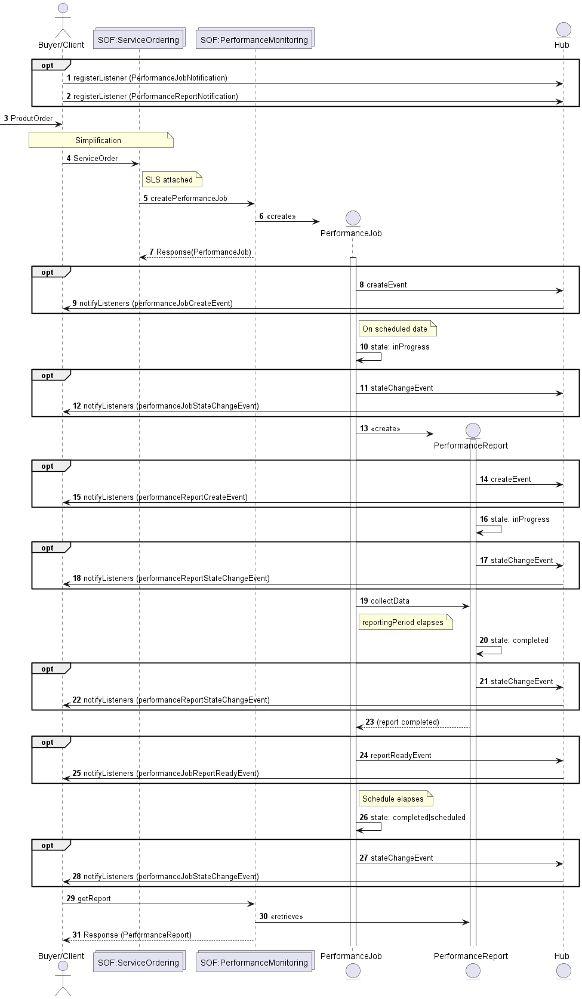
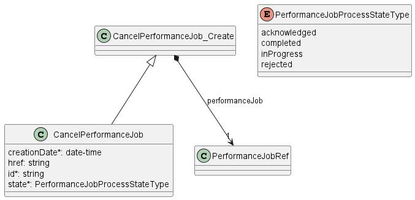
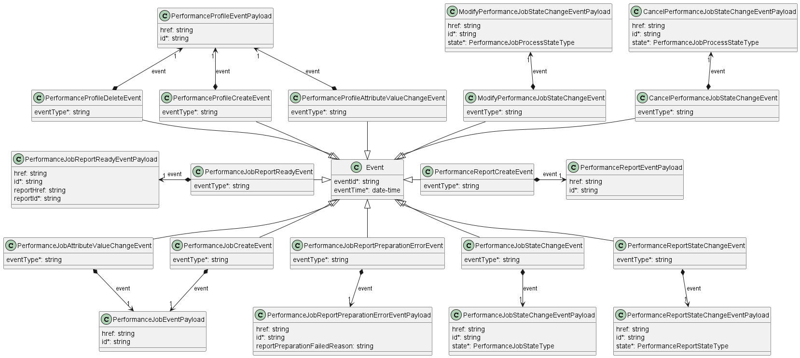
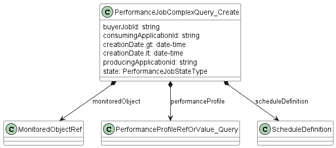
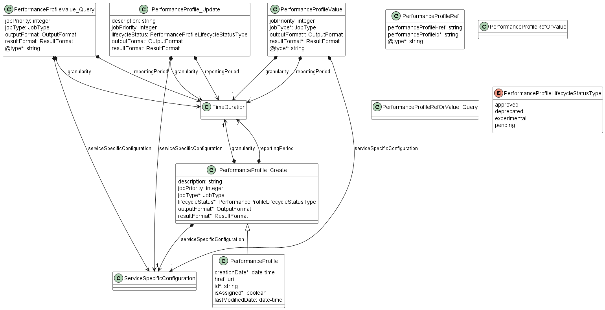
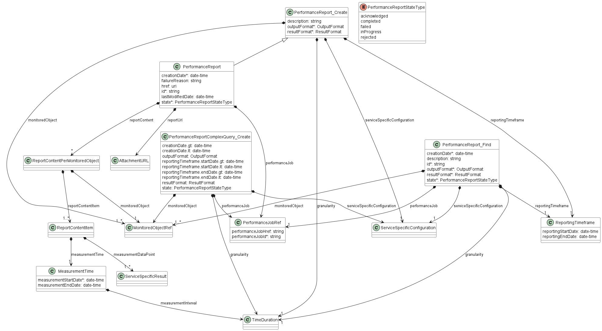

<style>
img
{
  display:block;
  float:none;
  margin-left:auto;
  margin-right:auto;
}
</style>


<div style="font-weight:bold; font-size:33pt; font-family: Sansation;  text-align:center">
Working Draft
</br>
MEF W143 v0.3
</br>
</br>
LSO Allegro, LSO Interlude and LSO Legato Performance Monitoring API - Developer Guide
</br>
<p style="color:red;font-weight:bold; font-size:18pt">This draft represents MEF work in progress and is subject to change.</p>
</br>
December 2024
<p style="color:red;font-weight:bold; font-size:18pt">EXPORT CONTROL: This document contains technical data. The download, export, re-export or disclosure of the technical data contained in this document may be restricted by applicable U.S. or foreign export laws, regulations and rules and/or applicable U.S. or foreign sanctions ("Export Control Laws or Sanctions"). You agree that you are solely responsible for determining whether any Export Control Laws or Sanctions may apply to your download, export, reexport or disclosure of this document, and for obtaining (if available) any required U.S. or foreign export or reexport licenses and/or other required authorizations.</p>
</div>

<div class="page"/>

**Disclaimer**

© MEF Forum 2024. All Rights Reserved.

The information in this publication is freely available for reproduction and
use by any recipient and is believed to be accurate as of its publication date.
Such information is subject to change without notice and MEF Forum (MEF) is not
responsible for any errors. MEF does not assume responsibility to update or
correct any information in this publication. No representation or warranty,
expressed or implied, is made by MEF concerning the completeness, accuracy, or
applicability of any information contained herein and no liability of any kind
shall be assumed by MEF as a result of reliance upon such information.

The information contained herein is intended to be used without modification by
the recipient or user of this document. MEF is not responsible or liable for
any modifications to this document made by any other party.

The receipt or any use of this document or its contents does not in any way
create, by implication or otherwise:

- (a) any express or implied license or right to or under any patent,
  copyright, trademark or trade secret rights held or claimed by any MEF member
  which are or may be associated with the ideas, techniques, concepts or
  expressions contained herein; nor

- (b) any warranty or representation that any MEF member will announce any
  product(s) and/or service(s) related thereto, or if such announcements are
  made, that such announced product(s) and/or service(s) embody any or all of
  the ideas, technologies, or concepts contained herein; nor

- (c) any form of relationship between any MEF member and the recipient or user
  of this document.

Implementation or use of specific MEF standards, specifications or
recommendations will be voluntary, and no Member shall be obliged to implement
them by virtue of participation in MEF Forum. MEF is a non-profit international
organization to enable the development and worldwide adoption of agile, assured
and orchestrated network services. MEF does not, expressly or otherwise,
endorse or promote any specific products or services.

**Copyright**

© MEF Forum 2024. Any reproduction of this document, or any portion thereof,
shall contain the following statement: "Reproduced with permission of MEF
Forum." No user of this document is authorized to modify any of the information
contained herein.

<div class="page"/>

**Table of Contents**

<!-- code_chunk_output -->

- [List of Contributing Members](#list-of-contributing-members)
- [1. Abstract](#1-abstract)
- [2. Terminology and Abbreviations](#2-terminology-and-abbreviations)
- [3. Compliance Levels](#3-compliance-levels)
- [4. Introduction](#4-introduction)
  - [4.1. Description](#41-description)
  - [4.2. Conventions in the Document](#42-conventions-in-the-document)
  - [4.3. Relation to Other Documents](#43-relation-to-other-documents)
  - [4.4. Approach](#44-approach)
  - [4.5. High-Level Flow](#45-high-level-flow)
- [5. API Description](#5-api-description)
  - [5.1. High-level use cases](#51-high-level-use-cases)
  - [5.2. API Endpoint and Operation Description](#52-api-endpoint-and-operation-description)
    - [5.2.1. Seller/Server (SOF) side Performance Monitoring API Endpoints](#521-sellerserver-sof-side-performance-monitoring-api-endpoints)
    - [5.2.2. Buyer/Client (CUS, BUS, SOF) side Performance Monitoring API Endpoints](#522-buyerclient-cus-bus-sof-side-performance-monitoring-api-endpoints)
  - [5.3. Integration of Service Monitoring Specification into Performance Monitoring API](#53-integration-of-service-monitoring-specification-into-performance-monitoring-api)
  - [5.4. Model structure and validation](#54-model-structure-and-validation)
  - [5.5. Security Considerations](#55-security-considerations)
- [6. API Interactions and Flows](#6-api-interactions-and-flows)
  - [6.1. Use case 1: Create a Performance Monitoring Profile](#61-use-case-1-create-a-performance-monitoring-profile)
    - [6.1.1. Interaction flow](#611-interaction-flow)
    - [6.1.2. Create Performance Monitoring Profile Request](#612-create-performance-monitoring-profile-request)
    - [6.1.3. Create Performance Monitoring Profile Response](#613-create-performance-monitoring-profile-response)
    - [6.1.4. Performance Monitoring Profile State Machine](#614-performance-monitoring-profile-state-machine)
  - [6.2. Use Case 2: Retrieve List of Performance Profile](#62-use-case-2-retrieve-list-of-performance-profile)
  - [6.3. Use Case 3: Retrieve Performance Monitoring Profile by Profile Identifier](#63-use-case-3-retrieve-performance-monitoring-profile-by-profile-identifier)
  - [6.4. Use Case 4: Modify Performance Monitoring Profile](#64-use-case-4-modify-performance-monitoring-profile)
  - [6.5. Use Case 5: Delete Performance Monitoring Profile](#65-use-case-5-delete-performance-monitoring-profile)
  - [6.6. Use Case 6: Create a Performance Monitoring Job](#66-use-case-6-create-a-performance-monitoring-job)
    - [6.6.1. Interaction flow](#661-interaction-flow)
    - [6.6.2. Create Performance Monitoring Job Request](#662-create-performance-monitoring-job-request)
    - [6.6.3. Create Performance Monitoring Job Response](#663-create-performance-monitoring-job-response)
    - [6.6.4. Performance Monitoring Job State Machine](#664-performance-monitoring-job-state-machine)
    - [6.6.5. Relationship to Performance Monitoring Profile](#665-relationship-to-performance-monitoring-profile)
  - [6.7. Use Case 7: Retrieve List of Performance Monitoring Job](#67-use-case-7-retrieve-list-of-performance-monitoring-job)
  - [6.8. Use Case 8: Retrieve Performance Monitoring Job by Job Identifier](#68-use-case-8-retrieve-performance-monitoring-job-by-job-identifier)
  - [6.9. Use Case 9: Modify Performance Monitoring Job](#69-use-case-9-modify-performance-monitoring-job)
    - [6.9.1. Interaction flow](#691-interaction-flow)
    - [6.9.2. Modify Performance Monitoring Job Request](#692-modify-performance-monitoring-job-request)
    - [6.9.3. Modify Performance Monitoring Job Response](#693-modify-performance-monitoring-job-response)
    - [6.9.4. Modify Performance Monitoring Job State Machine](#694-modify-performance-monitoring-job-state-machine)
  - [6.10. Use Case 10: Retrieve Modify Performance Monitoring Job List](#610-use-case-10-retrieve-modify-performance-monitoring-job-list)
  - [6.11. Use Case 11: Retrieve Modify Performance Monitoring Job by Identifier](#611-use-case-11-retrieve-modify-performance-monitoring-job-by-identifier)
  - [6.12. Use Case 12: Cancel Performance Monitoring Job](#612-use-case-12-cancel-performance-monitoring-job)
    - [6.12.1. Interaction flow](#6121-interaction-flow)
    - [6.12.2. Cancel Performance Monitoring Job Request](#6122-cancel-performance-monitoring-job-request)
    - [6.12.3. Cancel Performance Monitoring Job Response](#6123-cancel-performance-monitoring-job-response)
    - [6.12.4. Cancel Performance Monitoring Job State Machine](#6124-cancel-performance-monitoring-job-state-machine)
  - [6.13. Use Case 13: Retrieve Cancel Performance Monitoring Job List](#613-use-case-13-retrieve-cancel-performance-monitoring-job-list)
  - [6.14. Use Case 14: Retrieve Cancel Performance Monitoring Job by Identifier](#614-use-case-14-retrieve-cancel-performance-monitoring-job-by-identifier)
  - [6.15. Use Case 15: Suspend Performance Monitoring Job](#615-use-case-15-suspend-performance-monitoring-job)
  - [6.16. Use Case 16: Resume Performance Monitoring Job](#616-use-case-16-resume-performance-monitoring-job)
  - [6.17. Use Case 17: Create Performance Monitoring Job Complex Query](#617-use-case-17-create-performance-monitoring-job-complex-query)
    - [6.17.1. Create Performance Monitoring Job Complex Query Request](#6171-create-performance-monitoring-job-complex-query-request)
    - [6.17.2. Create Performance Monitoring Job Complex Query Response](#6172-create-performance-monitoring-job-complex-query-response)
  - [6.18. Use Case 18: Create a Performance Monitoring Report](#618-use-case-18-create-a-performance-monitoring-report)
    - [6.18.1. Interaction flow](#6181-interaction-flow)
    - [6.18.2. Create Performance Monitoring Report Request](#6182-create-performance-monitoring-report-request)
    - [6.18.3. Create Performance Monitoring Report Response](#6183-create-performance-monitoring-report-response)
    - [6.18.4. Performance Monitoring Report State Machine](#6184-performance-monitoring-report-state-machine)
    - [6.18.5. Relationship to Performance Monitoring Job](#6185-relationship-to-performance-monitoring-job)
  - [6.19. Use Case 19: Retrieve Performance Monitoring Report List](#619-use-case-19-retrieve-performance-monitoring-report-list)
  - [6.20. Use Case 20: Retrieve Performance Monitoring Report by Report Identifier](#620-use-case-20-retrieve-performance-monitoring-report-by-report-identifier)
  - [6.21. Use Case 21: Create Performance Monitoring Report Complex Query](#621-use-case-21-create-performance-monitoring-report-complex-query)
    - [6.21.1. Create Performance Monitoring Report Complex Query Request](#6211-create-performance-monitoring-report-complex-query-request)
    - [6.21.2. Create Performance Monitoring Report Complex Query Response](#6212-create-performance-monitoring-report-complex-query-response)
  - [6.22. Use Case 22: Retrieve Tracking Record List](#622-use-case-22-retrieve-tracking-record-list)
  - [6.23. Use Case 23: Retrieve Tracking Record by Identifier](#623-use-case-23-retrieve-tracking-record-by-identifier)
  - [6.24. Use Case 24: Register for Notifications](#624-use-case-24-register-for-notifications)
  - [6.25. Use Case 25: Send Notification](#625-use-case-25-send-notification)
- [7. API Details](#7-api-details)
  - [7.1. API patterns](#71-api-patterns)
    - [7.1.1. Indicating errors](#711-indicating-errors)
      - [7.1.1.1. Type Error](#7111-type-error)
      - [7.1.1.2. Type Error400](#7112-type-error400)
      - [7.1.1.3. `enum` Error400Code](#7113-enum-error400code)
      - [7.1.1.4. Type Error401](#7114-type-error401)
      - [7.1.1.5. `enum` Error401Code](#7115-enum-error401code)
      - [7.1.1.6. Type Error403](#7116-type-error403)
      - [7.1.1.7. `enum` Error403Code](#7117-enum-error403code)
      - [7.1.1.8. Type Error404](#7118-type-error404)
      - [7.1.1.9. Type Error408](#7119-type-error408)
      - [7.1.1.10. Type Error409](#71110-type-error409)
      - [7.1.1.11. Type Error422](#71111-type-error422)
      - [7.1.1.12. `enum` Error422Code](#71112-enum-error422code)
      - [7.1.1.13. Type Error500](#71113-type-error500)
      - [7.1.1.14. Type Error501](#71114-type-error501)
    - [7.1.2. Response pagination](#712-response-pagination)
  - [7.2. Management API Data model](#72-management-api-data-model)
    - [7.2.1. PerformanceProfile](#721-performanceprofile)
      - [7.2.1.1. Type PerformanceProfile\_Common](#7211-type-performanceprofile_common)
      - [7.2.1.2. Type PerformanceProfile\_Create](#7212-type-performanceprofile_create)
      - [7.2.1.3. Type PerformanceProfile](#7213-type-performanceprofile)
      - [7.2.1.4. Type PerformanceProfile\_Find](#7214-type-performanceprofile_find)
      - [7.2.1.5. Type PerformanceProfile\_Update](#7215-type-performanceprofile_update)
      - [7.2.1.6. Type PerformanceProfileRef](#7216-type-performanceprofileref)
      - [7.2.1.7. Type PerformanceProfileRefOrValue](#7217-type-performanceprofilereforvalue)
      - [7.2.1.8. `enum` PerformanceProfileStateType](#7218-enum-performanceprofilestatetype)
      - [7.2.1.9. Type PerformanceProfileValue](#7219-type-performanceprofilevalue)
    - [7.2.2. PerformanceJob](#722-performancejob)
      - [7.2.2.1. Type PerformanceJob\_Common](#7221-type-performancejob_common)
      - [7.2.2.2. Type PerformanceJob\_Create](#7222-type-performancejob_create)
      - [7.2.2.3. Type PerformanceJob](#7223-type-performancejob)
      - [7.2.2.4. Type PerformanceJob\_Find](#7224-type-performancejob_find)
      - [7.2.2.5. Type CancelPerformanceJob\_Common](#7225-type-cancelperformancejob_common)
      - [7.2.2.6. Type CancelPerformanceJob\_Create](#7226-type-cancelperformancejob_create)
      - [7.2.2.7. Type CancelPerformanceJob](#7227-type-cancelperformancejob)
      - [7.2.2.8. Type CancelPerformanceJob\_Find](#7228-type-cancelperformancejob_find)
      - [7.2.2.9. Type ModifyPerformanceJob\_Common](#7229-type-modifyperformancejob_common)
      - [7.2.2.10. Type ModifyPerformanceJob\_Create](#72210-type-modifyperformancejob_create)
      - [7.2.2.11. Type ModifyPerformanceJob](#72211-type-modifyperformancejob)
      - [7.2.2.12. Type ModifyPerformanceJob\_Find](#72212-type-modifyperformancejob_find)
      - [7.2.2.13. Type ModifyPerformanceJob\_PerformanceProfileValue](#72213-type-modifyperformancejob_performanceprofilevalue)
      - [7.2.2.14. Type PerformanceJobComplexQuery\_Create](#72214-type-performancejobcomplexquery_create)
      - [7.2.2.15. Type PerformanceJobComplexQuery](#72215-type-performancejobcomplexquery)
      - [7.2.2.16. `enum` PerformanceJobProcessStateType](#72216-enum-performancejobprocessstatetype)
      - [7.2.2.17. Type PerformanceJobRef](#72217-type-performancejobref)
      - [7.2.2.18. Type PerformanceJobRefOrValue](#72218-type-performancejobreforvalue)
      - [7.2.2.19. `enum` PerformanceJobStateType](#72219-enum-performancejobstatetype)
      - [7.2.2.20. Type PerformanceJobValue](#72220-type-performancejobvalue)
    - [7.2.3. PerformanceReport](#723-performancereport)
      - [7.2.3.1. Type PerformanceReport\_Common](#7231-type-performancereport_common)
      - [7.2.3.2. Type PerformanceReport\_Create](#7232-type-performancereport_create)
      - [7.2.3.3. Type PerformanceReport](#7233-type-performancereport)
      - [7.2.3.4. Type PerformanceReport\_Find](#7234-type-performancereport_find)
      - [7.2.3.5. Type PerformanceReportComplexQuery\_Create](#7235-type-performancereportcomplexquery_create)
      - [7.2.3.6. Type PerformanceReportComplexQuery](#7236-type-performancereportcomplexquery)
      - [7.2.3.7. Type PerformanceReportRef](#7237-type-performancereportref)
      - [7.2.3.8. `enum` PerformanceReportStateType](#7238-enum-performancereportstatetype)
    - [7.2.4. Common](#724-common)
      - [7.2.4.1. Type AttachmentURL](#7241-type-attachmenturl)
      - [7.2.4.2. Type EntityId](#7242-type-entityid)
      - [7.2.4.3. Type HourRange](#7243-type-hourrange)
      - [7.2.4.4. `enum` Interval](#7244-enum-interval)
      - [7.2.4.5. `enum` JobType](#7245-enum-jobtype)
      - [7.2.4.6. Type MeasurementTime](#7246-type-measurementtime)
      - [7.2.4.7. Type MonitoredObjectId](#7247-type-monitoredobjectid)
      - [7.2.4.8. `enum` OutputFormat](#7248-enum-outputformat)
      - [7.2.4.9. Type RecurringSchedule](#7249-type-recurringschedule)
      - [7.2.4.10. Type ReportContentItem](#72410-type-reportcontentitem)
      - [7.2.4.11. Type ReportingTimeframe](#72411-type-reportingtimeframe)
      - [7.2.4.12. `enum` ResultFormat](#72412-enum-resultformat)
      - [7.2.4.13. Type ResultPayload](#72413-type-resultpayload)
      - [7.2.4.14. Type ScheduleDefinition](#72414-type-scheduledefinition)
      - [7.2.4.15. Type ServiceId](#72415-type-serviceid)
      - [7.2.4.16. Type ServicePayloadSpecificAttributes](#72416-type-servicepayloadspecificattributes)
      - [7.2.4.17. Type TrackingRecord](#72417-type-trackingrecord)
      - [7.2.4.18. Type TrackingRecord\_Find](#72418-type-trackingrecord_find)
    - [7.2.5. Notification Registration](#725-notification-registration)
      - [7.2.5.1. Type EventSubscriptionInput](#7251-type-eventsubscriptioninput)
      - [7.2.5.2. Type EventSubscription](#7252-type-eventsubscription)
  - [7.3. Notification API Data model](#73-notification-api-data-model)
    - [7.3.1. Type Event](#731-type-event)
    - [7.3.2. Type PerformanceProfileEvent](#732-type-performanceprofileevent)
    - [7.3.3. `enum` PerformanceProfileEventType](#733-enum-performanceprofileeventtype)
    - [7.3.4. Type PerformanceProfileEventPayload](#734-type-performanceprofileeventpayload)
    - [7.3.5. Type PerformanceJobEvent](#735-type-performancejobevent)
    - [7.3.6. `enum` PerformanceJobEventType](#736-enum-performancejobeventtype)
    - [7.3.7. Type PerformanceJobEventPayload](#737-type-performancejobeventpayload)
    - [7.3.8. Type PerformanceJobProcessEvent](#738-type-performancejobprocessevent)
    - [7.3.9. `enum` PerformanceJobProcessEventType](#739-enum-performancejobprocesseventtype)
    - [7.3.10. Type PerformanceJobProcessEventPayload](#7310-type-performancejobprocesseventpayload)
    - [7.3.11. Type PerformanceJobReportPreparationErrorEvent](#7311-type-performancejobreportpreparationerrorevent)
    - [7.3.12. `enum` PerformanceJobReportPreparationErrorEventType](#7312-enum-performancejobreportpreparationerroreventtype)
    - [7.3.13. Type PerformanceJobReportPreparationErrorEventPayload](#7313-type-performancejobreportpreparationerroreventpayload)
    - [7.3.14. Type PerformanceJobReportReadyEvent](#7314-type-performancejobreportreadyevent)
    - [7.3.15. `enum` PerformanceJobReportReadyEventType](#7315-enum-performancejobreportreadyeventtype)
    - [7.3.16. Type PerformanceJobReportReadyEventPayload](#7316-type-performancejobreportreadyeventpayload)
    - [7.3.17. Type PerformanceReportEvent](#7317-type-performancereportevent)
    - [7.3.18. `enum` PerformanceReportEventType](#7318-enum-performancereporteventtype)
    - [7.3.19. Type PerformanceReportEventPayload](#7319-type-performancereporteventpayload)
- [8. References](#8-references)

<!-- /code_chunk_output -->

<div style="page-break-after: always;"></div>

# List of Contributing Members

The following members of the MEF participated in the development of this
document and have requested to be included in this list.

| Member |
| ------ |
|        |
|        |
|        |

**Table 1. Contributing Members**

# 1. Abstract

This standard is intended to assist the implementation of the Application
Programming Interfaces (APIs) for the Performance Monitoring functionality of 
the Service Orchestration Function at the LSO Allegro, LSO Interlude and LSO 
Legato Interface Reference Points (IRPs), for which requirements and use cases
are defined in MEF W133.1 [[MEF133.1](#8-references)]. The requirements and use 
cases are the same for all IRPs. This standard consists of this document and 
complementary API definitions for Performance Monitoring and Performance 
Notification.

This standard normatively incorporates the following files by reference as if
they were part of this document from the GitHub repository:

[MEF-LSO-Allegro-SDK](https://github.com/MEF-GIT/MEF-LSO-Allegro-SDK)

- `serviceApi/pm/performanceMonitoring.api.yaml`
- `serviceApi/pm/performanceNotification.api.yaml`

[MEF-LSO-Interlude-SDK](https://github.com/MEF-GIT/MEF-LSO-Interlude-SDK)

- `serviceApi/pm/performanceMonitoring.api.yaml`
- `serviceApi/pm/performanceNotification.api.yaml`

[MEF-LSO-Legato-SDK](https://github.com/MEF-GIT/MEF-LSO-Legato-SDK)

- `serviceApi/pm/performanceMonitoring.api.yaml`
- `serviceApi/pm/performanceNotification.api.yaml`

The Performance Monitoring API is defined using OpenAPI 3.0 
[[OAS-V3](#8-references)]

<div class="page"/>

# 2. Terminology and Abbreviations

This section aims to clarify the terminology used throughout this document. 
In many cases, the authoritative definitions of terms can be found in separate 
documents. To ensure accuracy and consistency, the third column of this document
serves to provide the appropriate references from MEF or external sources that 
govern these definitions.

In addition, terms defined in the standards referenced below are included in
this document by reference and are not repeated in the table below:

- MEF W133.1 _Allegro, Interlude and Legato Fault Management and Performance
  Monitoring BR&UC_ February 2023 [[MEF 133.1](#8-references)]
- MEF 55.1, _Lifecycle Service Orchestration (LSO): Reference Architecture and
  Framework_ February 2021 [[MEF 55.1](#8-references)]

| **Term**                            | **Definition**                                                                                                                                                                   																																								| **Source**                                                                         |
| ----------------------------------- | ----------------------------------------------------------------------------------------------------------------------------------------------------------------------------------------------------------------------------------------------------------------------------------------------------------------------------------------------- | ---------------------------------------------------------------------------------- |
| API Endpoint                        | The endpoint of a communication channel (the complete URL of an API Resource) to which the HTTP-REST requests are addressed to operate on the _API Resource_.           																																								        | [rapidapi.com](https://rapidapi.com/blog/api-glossary/endpoint/)<br>This document  |
| API Resource                        | A REST Resource. In REST, the primary data representation is called Resource. In this document, _API Resource_ is defined as an OAS _SchemaObject_ with specified _API Endpoints_.																																								| [restfulapi.net](https://restfulapi.net/resource-naming/)<br>This document         |
| Notification                        | A notification is a representation of an event that is exchanged between interested parties. An event is a significant occurrence or change in system state that is important from the perspective of system administration.  																													| MEF W133.1 																		 |
| On-Demand							  | Performance Monitoring Job actions that are initiated for a limited time to carry out the Performance Monitoring Job or measurements.																																																			| MEF W133.1 																		 |
| OpenAPI                             | The OpenAPI 3.0 Specification, formerly known as the Swagger specification is an API description format for REST APIs.                                                           																																								| [spec.openapis.org](http://spec.openapis.org/oas/v3.0.3)                           |
| Operation                           | An interaction between the Server and Client, potentially involving multiple back-and-forth transactions.                                                                              																																							| This document                                                                      |
| Passive							  | Performance Monitoring Job action to support the collection and reporting of network and service statistics. The statistics collections include but are not limited to telemetry associated with an interface, (Net/Application) Flow, VLAN, bridging/Ethernet, IP, TCP, and UDP layers.  														| MEF W133.1 																		 |
| PM Metric							  | A metric that is measured or calculated as a part of Performance Monitoring.																																																																	| MEF W105																			 |
| Proactive							  |	Performance Monitoring Job actions that are carried on continuously to permit timely reporting of fault and/or performance status.																																																				| MEF W133.1 																		 |
| REST API							  | Representational State Transfer. REST provides a set of architectural constraints that, when applied as a whole, emphasizes scalability of component interactions, generality of interfaces, independent deployment of components, and intermediary components to reduce interaction latency, enforce security, and encapsulate legacy systems.	| [REST API](http://www.ics.uci.edu/~fielding/pubs/dissertation/rest_arch_style.htm) |
| SchemaObject                        | The construct that allows the definition of input and output data types. These types can represent object classes, as well as primitives and array specifications.              																																								| [spec.openapis.org](http://spec.openapis.org/oas/v3.0.3#schema-object)             |

**Table 2. Terminology**

| **Term** | **Definition**                                                                               | **Source**                                               |
| -------- | -------------------------------------------------------------------------------------------- | -------------------------------------------------------- |
| API      | Application Programming Interface. In this document, API is used synonymously with REST API. | This document                                            |
| BUS      | Business Applications                                                                        | MEF 55.1                                                 |
| CUS      | Customer Application Coordinator															  | MEF 55.1                                                 |
| IRP      | Interface Reference Point                                                                    | MEF 55.1                                                 |
| OAS      | OpenAPI Specification                                                                        | [openapis.org](https://www.openapis.org/faq/style-guide) |
| PM	   | Performance Monitoring																		  | MEF W133.1												 |
| SOF      | Service Orchestration Functionality                                                          | MEF 55.1                                                 |

**Table 3. Abbreviations**

# 3. Compliance Levels

The key words **"MUST"**, **"MUST NOT"**, **"REQUIRED"**, **"SHALL"**, **"SHALL
NOT"**, **"SHOULD"**, **"SHOULD NOT"**, **"RECOMMENDED"**, **"NOT
RECOMMENDED"**, **"MAY"**, and **"OPTIONAL"** in this document are to be
interpreted as described in BCP 14 (RFC 2119 [[RFC2119](#8-references)], RFC
8174 [[RFC8174](#8-references)]) when, and only when, they appear in all
capitals, as shown here. All key words must be in bold text.

Items that are **REQUIRED** (contain the words **MUST** or **MUST NOT**) are
labeled as **[Rx]** for required. Items that are **RECOMMENDED** (contain the
words **SHOULD** or **SHOULD NOT**) are labeled as **[Dx]** for desirable.
Items that are **OPTIONAL** (contain the words MAY or OPTIONAL) are labeled as
**[Ox]** for optional.

A paragraph preceded by **[CRa]<** specifies a conditional mandatory
requirement that **MUST** be followed if the condition(s) following the "<"
have been met. For example, **"[CR1]<[D38]"** indicates that Conditional
Mandatory Requirement 1 must be followed if Desirable Requirement 38 has been
met. A paragraph preceded by **[CDb]<** specifies a Conditional Desirable
Requirement that **SHOULD** be followed if the condition(s) following the "<"
have been met. A paragraph preceded by **[COc]<**specifies a Conditional
Optional Requirement that **MAY** be followed if the condition(s) following the
"<" have been met.

<div class="page"/>

# 4. Introduction

The Service Level Specification describes the performance objectives for the
performance of conforming traffic (i.e., frames, packets) that flow over a VC
(i.e., EVC, IPVC, etc.). For example, objectives in the SLS might be specified
for frame or packet delay (latency). The performance objectives specified in
the SLS often form part of a Service Level Agreement (SLA), which can also 
specify penalties for the SP or Operator providing the service if the
objectives are not met. The Performance Monitoring API allows managing
Performance Profiles, Performance Jobs, and collecting Performance Reports, as 
well as receiving notifications related to these entities. This allows managing
the performance objectives that are typically associated with an SLS.

This standard specification document describes the Application Programming
Interface (API) for Performance Monitoring functionality of the LSO Allegro
Interface Reference Point (IRP), LSO Interlude Interface Reference Point (IRP)
and LSO Sonata IRP as defined in the _MEF 55.1 Lifecycle Service Orchestration
(LSO): Reference Architecture and Framework_ [[MEF55.1](#8-references)]. The 
LSO Reference Architecture is shown in Figure 1 with the three IRPs 
highlighted.


**Figure 1. The LSO Reference Architecture**

**_Note_**: The use cases and business requirements in this document assume a
two-actor relationship based on the set of actors in the LSO architecture. The
names of the relationships are specific to the Interface Reference Point. For 
both Allegro and Interlude there is a Buyer and Seller. For Allegro the Buyer 
is the Customer and the Seller is the Service Provider. In Interlude the Buyer
is the Service Provider and the Seller is the Partner. In the case of the 
Legato IRP, given this is within a single Service Provider or Partner, the
relationship is between Client and Server, where the Business Application (BA) 
is the Client, and the Service Orchestration Functionality (SOF) is the Server.
Considering this duality, actors in the document are referred to as Buyer/Client 
and Seller/Server. 

## 4.1. Description

This standard is scoped to cover APIs for following Service Orchestration
Functionalities:
- Performance Monitoring
  - Includes management of Performance Profiles, Performance Jobs and
    collecting Performance Reports
- Performance Notification
  - Includes Event Subscription/Hub and Listener notification functions

This document supports interactions over the Legato interface within a single
operator as well as interaction with Partner Domain and Customer Domain
through Interlude and Allegro interfaces respectively.

Business Applications (BUS), Customer Application Coordinator (CUS) and
Service Orchestration Functionality (SOF) systems use the information contained
within this document.

This standard is intended to support the design of API implementations that
enable interoperable SOF operations (in the scope of this standard) across the
Allegro IRP, Interlude IRP, and Legato IRP.

This standard is based on TMF Open API (v5.0) for Performance Management
[TMF 628](#8-references).

The Performance Monitoring API allows the Buyer (CUS/SOF) or Client (BUS) to 
provision performance objectives in the Server (intra-operator SOF) or in the 
Seller (inter-operator SOF) and collect performance data from Server/Seller.

## 4.2. Conventions in the Document

- Code samples are formatted using code blocks. When notation `<< some text >>`
  is used in the payload sample it indicates that a comment is provided instead
  of an example value, and it might not comply with the OpenAPI definition.
- Model definitions are formatted as in-line code (e.g. `PerformanceJob`).
- In UML diagrams the default cardinality of associations is `0..1`. Other
  cardinality markers are compliant with the UML standard.
- In the API details tables and UML diagrams required attributes are marked
  with a `*` next to their names.
- In UML sequence diagrams `{{variable}}` notation is used to indicate a
  variable to be substituted with a correct value.

## 4.3. Relation to Other Documents

This API implements the Performance Monitoring related requirements and use
cases that are defined in MEF W133.1 [[MEF133.1](#8-references)]. The API 
definition builds on _TMF 628 Performance Management API REST Specification 
v5.0_ [[TMF628](#8-references)]. Performance Monitoring Use Cases must support
the use of MEF service performance specifications as payload.

## 4.4. Approach

As presented in Figure 2. the Allegro, Interlude, and Legato API frameworks
consist of three structural components:

- Generic API framework
- Service-independent information (Function-specific information and
  Function-specific operations)
- Service-specific information (MEF service specification data model)


**Figure 2. Allegro, Interlude and Legato API Structure**

The essential concept behind the framework is to decouple the common structure,
information, and operations from the specific service information content.
Firstly, the Generic API Framework defines a set of design rules and patterns
that are applied across all Allegro, Interlude, and Legato APIs.
Secondly, the service-independent information of the framework focuses on a
model of a particular Allegro, Interlude, or Legato functionality and is
agnostic to any of the service specifications. For example, this standard is 
describing the Performance Monitoring model and operations that allow 
provisioning of the performance objectives of any service.
Finally, the service-specific information part of the framework focuses on
performance-related attributes and requirements for provisioning intra-provider 
or inter-provider performance objectives.

This Developer Guide does not define MEF service performance specifications
but can be used in combination with any performance specifications defined by
or compliant with MEF. MEF Service Performance schemas are defined by:

- MEF 152: Carrier Ethernet Payload Schema/Guide for SOAM [[MEF152](#8-references)]
- MEF 153: IP/IPVPN Schema/Guide for SOAM [[MEF153](#8-references)]
- MEF 154: SD-WAN Schema/Guide for SOAM [[MEF154](#8-references)]

Figure 3 presents the relationship between the Performance Monitoring API 
entities and the service performance specification model. 
The `ServiceSpecificPayloadAttribute` serves as an extension point for 
configuring service-specific performance parameters. On the other hand, the 
`ResultPayload` acts as an extension point for capturing and representing the 
outcome of performance monitoring.


**Figure 3. Performance specification for Allegro, Interlude, Legato**

## 4.5. High-Level Flow

The Performance Monitoring API in essence allows the Buyer/Client to request SOF 
to provision measurement intervals, schedules, and performance objectives 
between one or more ordered pairs. An ordered pair is an association between two
endpoints. Performance objectives are typically associated with an SLS but can 
be used for on-demand measurements in case the SLS is not attached to a service
order. The Performance Notification API provides a means to exchange information 
about significant changes in the system state between interested parties. 
Figure 4 presents an exemplary high-level flow of performance monitoring 
provisioning for SLS cases.



**Figure 4. High-Level Flow for SLS case**

The following steps describe the high-level flow:

- (optional) The BUS system registers for notifications. <br>**_Note1_**: 
Performance Notifications are optional and do not impact end-to-end flow
- As part of the ordering flow, the BUS system receives the product order
  (through Cantata or Sonata) which triggers the fulfillment processes in the
  BUS system.
- Service ordering flow in the diagram is simplified and is only supposed to
  show that in case of SLS attached to the service, a corresponding 
  `PerformanceJob` is provisioned internally.
- During provisioning of performance monitoring, the SOF internally 
  instantiates the 'PerformanceJob' <br>**_Note2_**: Process of identification
  of applicable service performance specification schema is out of scope for 
  this standard. **_Note3_**: `PerformanceJob` can be provisioned using 
  `PerformanceProfile`, but this is not depicted in the sequence diagram.
  - The SOF provisions performance monitoring by creating a `PerformanceJob`
    which contains the configuration of performance objectives and related
    subject (service).
  - `PerformanceJob` also carries a configuration including granularity,
    reporting period, schedule definition, and output format.
  - The `PerformanceJob` is processed by the SOF as per the state transition
    rules described in [6.6.4.](#664-performance-monitoring-job-state-machine)
  - (optional) The SOF reports the `PerformanceJob` state changes.
  - On a scheduled date according to schedule definition, performance data 
    generation is started.
  - When the configured reporting period elapses, a `PerformanceReport` entity
     is created to collect the performance data.
  - `PerformanceReport` is processed as per the state transition rules 
    described in [6.18.4.](#6184-performance-monitoring-report-state-machine)
  - (optional) The SOF reports the `PerformanceJob` state change.
  - The BUS system can collect `PerformanceReport` through _Performance 
    Monitoring API_

The same _Performance Monitoring API_ is used by the BUS to create **new**
`PerformanceJob` instances, as well as update **existing** ones or trigger 
state transitions (e.g. cancel **existing** `PerformanceJob` instance)

Figure 5 presents a high-level exemplary flow of performance monitoring 
provisioning for non-SLS use cases.


**Figure 5. High-Level Flow for non-SLS case**

The difference from the previous flow is because in this case 
service does not define the attached SLS. This requires the BUS to provision 
`PerformanceJob` in a step separate from service ordering.

- The BUS can provision performance monitoring by selecting a 
  `PerformanceProfile`which is a template containing common configuration 
  shared by multiple `PerformanceJob` entities.
- When querying `PerformanceProfile` instances the BUS system uses the 
  _Performance Monitoring API_.
- The rest of the flow is the same as described previously.

Figure 6 presents relations between entities that are managed through 
_Performance Monitoring API_. The diagram is simplified and does not contain 
all types of objects.


**Figure 6. The flow between API endpoints**

<div class="page"/>

# 5. API Description

This section presents the API structure and design patterns. It starts with the
high-level use cases diagram. Then it describes the REST endpoints with use
case mapping. Next, it explains the design pattern that is used
to combine service-agnostic and service-specific parts of API payloads.
Finally, payload validation and API security aspects are discussed.

## 5.1. High-level use cases

Figure 7 presents a high-level use case diagram. It aims to help understand
the endpoint mapping. Use cases are described extensively in
[chapter 6](#6-api-interactions-and-flows).


**Figure 7. Use cases**

## 5.2. API Endpoint and Operation Description

### 5.2.1. Seller/Server (SOF) side Performance Monitoring API Endpoints

**Base URL for Allegro**:
`https://{{serverBase}}:{{port}}{{?/sof_prefix}}/mefApi/allegro/performanceMonitoring/v3/`

**Base URL for Interlude**:
`https://{{serverBase}}:{{port}}{{?/sof_prefix}}/mefApi/interlude/performanceMonitoring/v3/`

**Base URL for Legato**:
`https://{{serverBase}}:{{port}}{{?/sof_prefix}}/mefApi/legato/performanceMonitoring/v3/`

The following API endpoints are implemented by the Seller/Server (SOF) and
allow the Buyer/Client (SOF/CUS/BUS) to create, retrieve and modify
`PerformanceJob`, `PerformanceProfile` and `PerformanceReport` instances. The 
endpoints and corresponding data model are defined in
`serviceApi/pm/performanceMonitoring.api.yaml`.

| API Endpoint                        | Description                                                                                                                   												| MEF W133.1 Use Case Mapping |
| ----------------------------------- | --------------------------------------------------------------------------------------------------------------------------------------------------------------------------- | --------------------------- |
| POST /performanceProfile            | A request initiated by the Buyer/Client to create a Performance Monitoring Profile in the Seller/Server system.              												| 11                          |
| GET /performanceProfile             | The Buyer/Client requests a list of Performance Monitoring Profiles based on a set of filter criteria.       																| 12                          |
| GET /performanceProfile/{{id}}      | The Buyer/Client requests detailed information about a single Performance Monitoring Profile.                																| 13                          |
| POST /performanceJob                | A request initiated by the Buyer/Client to create a Performance Monitoring Job in the Seller/Server system.                   												| 19,36                       |
| GET /performanceJob                 | The Buyer/Client requests a list of Performance Monitoring Jobs based on a set of filter criteria.                            												| 24                          |
| GET /performanceJob/{{id}}          | The Buyer/Client requests detailed information about a single Performance Monitoring Job.                                     												| 25                          |
| POST /modifyPerformanceJob          | A request initiated by the Buyer/Client to modify a Performance Monitoring Job in the Seller/Server system.                   												| 20,37                       |
| GET /modifyPerformanceJob           | The Buyer/Client requests a list of Modify Performance Monitoring Job based on a set of filter criteria.                     												| 20,37                       |
| GET /modifyPerformanceJob/{{id}}    | The Buyer/Client requests detailed information about a single Modify Performance Monitoring Job.                              												| 20,37                       |
| POST /cancelPerformanceJob          | A request initiated by the Buyer/Client to cancel a Performance Monitoring Job in the Seller/Server system.                   												| 21,38                       |
| GET /cancelPerformanceJob           | The Buyer/Client requests a list of Cancel Performance Monitoring Job based on a set of filter criteria.                     												| 21,38                       |
| GET /cancelPerformanceJob/{{id}}    | The Buyer/Client requests detailed information about a single Cancel Performance Monitoring Job.                              												| 21,38                       |
| POST /performanceJob/{{id}}/suspend | A request initiated by the Buyer/Client to suspend a Performance Monitoring Job in the Seller/Server system.                  												| 22                          |
| POST /performanceJob/{{id}}/resume  | A request initiated by the Buyer/Client to resume a Performance Monitoring Job in the Seller/Server system.                   												| 23                          |
| POST /performanceJobComplexQuery    | A request initiated by the Buyer/Client to create a Performance Monitoring Job Complex Query in the Seller/Server system.                                                   | 24                          |
| POST /performanceReport             | A request initiated by the Buyer/Client to collect data points existing in the Seller/Server system in the form of an ad-hoc Performance Monitoring Report.                 | 30,40                       |
| GET /performanceReport              | The Buyer/Client requests a list of Performance Monitoring Reports based on a set of filter criteria.                                                                       | 29,39                       |
| GET /performanceReport/{{id}}       | The Buyer/Client requests detailed information about a single Performance Monitoring Report, including the content of the report.                                           | 30,40                       |
| POST /performanceReportComplexQuery | A request initiated by the Buyer/Client to create a Performance Monitoring Report Complex Query in the Seller/Server system.                                                | 29,39                       |
| GET /trackingRecord                 | The Buyer/Client requests a list of Tracking Records based on a set of filter criteria.                                                                                     |                             |
| GET /trackingRecord/{{id}}          | The Buyer/Client requests detailed information about a single Tracking Record.                                                                                              |                             |

**Table 4. Seller/Server (SOF) Performance Monitoring mandatory API endpoints**

**[R1]** Seller/Server (SOF) **MUST** support all API endpoints listed in 
Table 4. [MEF133.1 R38, R42, R52, R73, R106, R108]

**[R2]** The Buyer/Client **MUST** support the retrieval of a PM Profile List
Use Case. [MEF133.1 R39]

**[R3]** The Buyer/Client **MUST** support the retrieval of a PM Profile 
Use Case. [MEF133.1 R43]

API endpoints listed in Table 5 are optional and may be exposed by the SOF.

| API Endpoint                      | Description                                                                                                                                                           | MEF W133.1 Use Case Mapping |
| --------------------------------- | --------------------------------------------------------------------------------------------------------------------------------------------------------------------- | --------------------------- |
| PATCH /performanceProfile/{{id}}  | A request initiated by the Buyer/Client to modify a Performance Monitoring Profile in the Seller/Server system based on a Performance Monitoring Profile Identifier.  | 14                          |
| DELETE /performanceProfile/{{id}} | The Buyer/Client requests deletion of Performance Monitoring Profile by specifying Performance Monitoring Profile Identifier.                                         | 15                          |
| POST /hub                         | The Buyer/Client requests to subscribe to the Performance Monitoring Profile, Performance Monitoring Job, and/or Performance Monitoring Report Notifications.         | 16,26                       |
| GET /hub/{{id}}                   | The Buyer/Client retrieves a specific `EventSubscription` from the SOF, that matches the _`id`_ value provided as _`path`_ parameter.                                 | 16,26                       |
| DELETE /hub/{{id}}                | The Buyer/Client requests to unsubscribe from the Performance Monitoring Profile, Performance Monitoring Job, and/or Performance Monitoring Report Notifications.     | 18,27                       |

**Table 5. Seller/Server (SOF) Performance Monitoring optional API endpoints**

**[O1]** The implementation **MAY** support API endpoints listed in Table 5. 
[W133 O5, O6, O7, O8, O9, O10, O13, O14]

### 5.2.2. Buyer/Client (CUS, BUS, SOF) side Performance Monitoring API Endpoints

**Base URL for Allegro**:
`https://{{serverBase}}:{{port}}{{?/sof_prefix}}/mefApi/allegro/performanceNotification/v3/`

**Base URL for Interlude**:
`https://{{serverBase}}:{{port}}{{?/sof_prefix}}/mefApi/interlude/performanceNotification/v3/`

**Base URL for Legato**:
`https://{{serverBase}}:{{port}}{{?/sof_prefix}}/mefApi/legato/performanceNotification/v3/`

The following API Endpoints are used by SOF to post notifications to registered
CUS, BUS, or SOF listeners. The endpoints and corresponding data model are 
defined in `serviceApi/pm/performanceNotification.api.yaml`

| API Endpoint                                               | Description                                                                                                                                                   | MEF W133.1 Use Case Mapping |
| ---------------------------------------------------------- | ------------------------------------------------------------------------------------------------------------------------------------------------------------- | --------------------------- |
| POST /listener/performanceJobCreateEvent                   | A request initiated by the Seller/Server to notify Buyer/Client on `PerformanceJob` instance creation.                                                        | 28                          |
| POST /listener/performanceJobStateChangeEvent              | A request initiated by the Seller/Server to notify Buyer/Client on the `PerformanceJob` instance state change.                                                | 28                          |
| POST /listener/performanceJobAttributeValueChangeEvent     | A request initiated by the Seller/Server to notify Buyer/Client on the `PerformanceJob` instance attribute value change.                                      | 28                          |
| POST /listener/performanceJobReportReadyEvent              | A request initiated by the Seller/Server to notify Buyer/Client that `PerformanceReport` was generated for the `PerformanceJob` instance.                     | 28                          |
| POST /listener/performanceJobReportPreparationErrorEvent   | A request initiated by the Seller/Server to notify Buyer/Client that `PerformanceReport` was not generated for the `PerformanceJob` instance due to an error. | 28                          |
| POST /listener/cancelPerformanceJobStateChangeEvent        | A request initiated by the Seller/Server to notify Buyer/Client on the `CancelPerformanceJob` instance state change.                                          | 28                          |
| POST /listener/modifyPerformanceJobStateChangeEvent        | A request initiated by the Seller/Server to notify Buyer/Client on the `ModifyPerformanceJob` instance state change.                                          | 28                          |
| POST /listener/performanceProfileCreateEvent               | A request initiated by the Seller/Server to notify Buyer/Client on `PerformanceProfile` instance creation.                                                    | 17                          |
| POST /listener/performanceProfileAttributeValueChangeEvent | A request initiated by the Seller/Server to notify Buyer/Client on the `PerformanceProfile` instance attribute value change.                                  | 17                          |
| POST /listener/performanceProfileDeleteEvent               | A request initiated by the Seller/Server to notify Buyer/Client on `PerformanceProfile` instance deletion.                                                    | 17                          |
| POST /listener/performanceReportCreateEvent                | A request initiated by the Seller/Server to notify Buyer/Client on `PerformanceReport` instance creation.                                                     | 28                          |
| POST /listener/performanceReportStateChangeEvent           | A request initiated by the Seller/Server to notify Buyer/Client on the `PerformanceReport` instance state change.                                             | 28                          |

**Table 6. Buyer/Client (CUS, BUS, SOF) Performance Monitoring API endpoints**

**[O2]** The Buyer/Client (CUS, BUS, SOF) **MAY** support API endpoints listed
in Table 6. [MEF133.1 O10]

**[O3]** The Buyer/Client (CUS, BUS, SOF) **MAY** register to receive 
performance monitoring notifications. [MEF133.1 O9]

**[R4]** The Seller/Server **MUST** support sending notifications to API 
endpoints listed in Table 6 to the registered Buyer/Client. [MEF133.1 R70]

## 5.3. Integration of Service Monitoring Specification into Performance Monitoring API

Performance Monitoring API discussed in this document is a generic envelope that 
allows for the lifecycle management of relevant performance monitoring objects.
The API itself does not provide explicit definitions for configuring performance 
monitoring or prescribing the structure of output data. However, it offers 
flexible extensibility to accommodate the configuration of service-specific 
performance objectives and results. This allows for customization and adaptation
to various monitoring requirements and desired data formats. This monitoring 
configuration and result schemas are defined using JsonSchema (draft 7) format 
[JSON Schema draft 7](#8-references) and can be integrated into the 
`PerformanceJob` and `PerformanceReport` using the TMF extension pattern.

The extension hosting types in the API data model are:

- `ServicePayloadSpecificAttributes` - this type is extended with Service
  monitoring configuration schema
- `ResultPayload` - this type is extended with Service monitoring result schema
  
The `@type` attribute of those extension hosting types must be set to a value 
that uniquely identifies the service monitoring configuration. A unique 
identifier for MEF standard service schemas is in URN format and is assigned 
by MEF. This identifier is provided as root schema `$id`.
Use of non-MEF standard service monitoring configuration is allowed. In such 
a case the schema identifier must be agreed upon between the Buyer/Client and
the Seller/Server.

The example below shows a header of a schema, which describes the IP service
performance monitoring configuration, where `"$id": 
urn:mef:lso:spec:legato:ip-performance-monitoring-configuration:v0.0.1:all` is 
the above-mentioned URN:

```yaml
'$schema': http://json-schema.org/draft-07/schema#
'$id': urn:mef:lso:spec:legato:ip-performance-monitoring-configuration:v0.0.1:all
title: MEF LSO Legato - IP Performance Monitoring Configuration
```

Payload for configuring service performance monitoring is used in multiple 
PM API entities through a `servicePayloadSpecificAttributes` attribute of type
`ServicePayloadSpecificAttributes`. It is an extension point for configuration
attributes.

In terms of monitoring results, the appropriate payload is introduced via 
`ReportContent`. This entity has a `measurementDataPoints` array of items of 
type `ResultPayload` which is used as an extension point for service-specific
output content.

Implementations might choose to integrate selected performance monitoring
specifications into the data model during development. In such a case an 
integrated data model contains monitoring specifications which are in an 
inheritance relationship accordingly with either `ServicePayloadSpecificAttributes`
or `ResultPayload` as described in the OAS specification.
This pattern is called **Static Binding**. The snippets below present an 
example of a static binding of the envelope API with exemplary MEF monitoring 
specifications, for both extension points.

```yaml
ServicePayloadSpecificAttributes:
  type: object
  description: ServicePayloadSpecificAttributes is used as an extension point
    for MEF-specific service performance monitoring configuration. 
    The `@type` attribute is used as a discriminator
  discriminator:
    mapping:
      urn:mef:lso:spec:legato:ip-performance-monitoring-configuration:v0.0.1:all: '#/components/schemas/IpPerformanceMonitoringConfiguration'
    propertyName: '@type'
  properties:
    '@type':
      type: string
      description:
        Uniquely identifies the type of performance monitoring
        configuration that specifies PM objectives. In the case of MEF services,
        this is the URN provided in the performance monitoring configuration
        specification. The named type must be a subclass of
        ServicePayloadSpecificAttributes.
```

```yaml
IpPerformanceMonitoringConfiguration:
  allOf:
    - $ref: '#/components/schemas/ServicePayloadSpecificAttributes'
    - type: object
      description: IP Performance Monitoring Configuration Schema.
```

```yaml
ResultPayload:
  type: object
  description:
    ResultPayload is used as an extension point for MEF specific service
    performance monitoring results. The `@type` attribute is used as a discriminator
  discriminator:
    mapping:
      urn:mef:lso:spec:legato:ip-performance-monitoring-results:v0.0.1:all: '#/components/schemas/IpPerformanceMonitoringResults'
    propertyName: '@type'
  properties:
    '@type':
      type: string
      description:
        The name that uniquely identifies type of performance monitoring
        results that are returned by the Performance Report. In case of MEF services this
        is the URN provided in performance monitoring results specification.
        The named type must be a subclass of ResultPayload.
```

```yaml
IpPerformanceMonitoringResults:
  allOf:
    - $ref: '#/components/schemas/ResultPayload'
    - type: object
      description: IP Performance Monitoring Results Schema.
```

Alternatively, implementations might choose not to build an integrated model
and choose a different mechanism allowing runtime validation of
service-specific fragments of the payload. In this case systems can validate 
a given monitoring configuration against a new schema without redeployment. 
This pattern is called **Dynamic Binding.**

Regardless of the chosen implementation pattern, the HTTP payload is  
the same. Both implementation approaches must conform to the requirements 
specified below.

**[R5]** `ServicePayloadSpecificAttributes` and `ResultPayload` types are
extension points that **MUST** be used to integrate service performance 
properties into a request/response payload.

**[R6]** The `@type` property of `ServicePayloadSpecificAttributes` and 
`ResultPayload` **MUST** be used to specify the type of the extending entity.

**[R7]** Attributes specified in the payload must conform to the performance
definition specified in the `@type` property.


**Figure 8. The Extension Pattern with Sample Service-Specific Extension**

Figure 8 presents two MEF performance monitoring schemas that represent 
configuration and result for IP services. When these schemas are used, 
the `@type` of `ServicePayloadSpecificAttributes` takes value of
`"urn:mef:lso:spec:legato:ip-performance-monitoring-configuration:v0.0.1:all"` 
to indicate which performance specification should be used to interpret a
set of service-specific attributes included in the payload.
Similarly, for `ResultPayload`, the `@type` attribute takes
`"urn:mef:lso:spec:legato:ip-performance-monitoring-results:v0.0.1:all"` value 
which indicates how the output performance collection should be interpreted.

## 5.4. Model structure and validation

The structure of the payloads exchanged via Allegro, Interlude, and Legato 
Performance Monitoring API endpoints is defined using:

- OpenAPI version 3.0 for the service-agnostic part of the payload
- JsonSchema (draft 7) for the service-specific part of the payload

**[R8]** Implementations **MUST** use payloads that conform to these
definitions.

**[R9]** The Buyer/Client and the Seller/Server **MUST NOT** use any operation,
entity or attribute that is not explicitly defined or allowed by this standard.

## 5.5. Security Considerations

Although the Legato IRP is internal to a Service Provider/Operator business
boundary, it is expected that some minimal security mechanisms are in place for
any communication over this IRP. There must also be authorization mechanisms in
place to control what a particular Buyer/Client or SOF is allowed to do and 
what information may be obtained. For Allegro and Interlude IRPs, security 
should follow rules for external communication.
The definition of the exact security mechanism and configuration is outside
the scope of this document. The LSO Security mechanisms are defined by MEF 128
_LSO API Security Profiles_ [[MEF128](#8-references)].

<div class="page"/>

# 6. API Interactions and Flows

This section provides a detailed insight into the API functionality, use cases,
and flows. It starts with Table 7 showing a list and short description of
all business use cases, then presents the variants of end-to-end interaction
flows, and in the subchapters describes the API usage flows and examples for
each of the use cases.

| Use Case # | Use Case Name                                                 | Use Case Description                                                                                                                                                             |
| ---------- | ------------------------------------------------------------- | -------------------------------------------------------------------------------------------------------------------------------------------------------------------------------- |
| 1          | Create Performance Monitoring Profile                         | A request initiated by the Buyer/Client to create a Performance Monitoring Profile in the Seller/Server system.                                                                  |
| 2          | Retrieve Performance Monitoring Profile List                  | The Buyer/Client requests a list of Performance Monitoring Profiles based on a set of filter criteria. The Seller/Server returns a summarized list of PM Profiles.				|
| 3          | Retrieve Performance Monitoring Profile by Profile Identifier | The Buyer/Client requests detailed information about a single Performance Monitoring Profile based on the Performance Monitoring Profile Identifier.               				|
| 4          | Modify Performance Monitoring Profile                         | A request initiated by the Buyer/Client to modify a Performance Monitoring Profile in the Seller/Server system based on a Performance Monitoring Profile Identifier.             |
| 5          | Delete Performance Monitoring Profile                         | The Buyer/Client requests deletion of the Performance Monitoring Profile by specifying the Performance Monitoring Profile Identifier.                                            |
| 6          | Create Performance Monitoring Job                             | A request initiated by the Buyer/Client to create a Performance Monitoring Job in the Seller/Server system to indicate performance monitoring objectives.                        |
| 7          | Retrieve Performance Monitoring Job List                      | The Buyer/Client requests a list of Performance Monitoring Job based on a set of filter criteria. The Seller/Server returns a summarized list of PM Jobs.                        |
| 8          | Retrieve Performance Monitoring Job by Job Identifier         | The Buyer/Client requests detailed information about a single Performance Monitoring Job based on the Performance Monitoring Job Identifier.                                     |
| 9          | Modify Performance Monitoring Job                             | A request initiated by the Buyer/Client to modify a Performance Monitoring Job in the Seller/Server system.                                                                      |
| 10         | Retrieve Modify Performance Monitoring Job List               | The Buyer/Client requests a list of Modify Performance Monitoring Job based on a set of filter criteria.                                                                         |
| 11         | Retrieve Modify Performance Monitoring Job by Identifier      | The Buyer/Client requests detailed information about a single Modify Performance Monitoring Job based on the Modify Performance Monitoring Job Identifier.                       |
| 12         | Cancel Performance Monitoring Job                             | A request initiated by the Buyer/Client to cancel a Performance Monitoring Job in the Seller/Server system.                                                                      |
| 13         | Retrieve Cancel Performance Monitoring Job List               | The Buyer/Client requests a list of Cancel Performance Monitoring Job based on a set of filter criteria.                                                                         |
| 14         | Retrieve Cancel Performance Monitoring Job by Identifier      | The Buyer/Client requests detailed information about a single Cancel Performance Monitoring Job based on the Cancel Performance Monitoring Job Identifier.                       |
| 15         | Suspend Performance Monitoring Job                            | A request initiated by the Buyer/Client to suspend a Performance Monitoring Job in the Seller/Server system.                                                                     |
| 16         | Resume Performance Monitoring Job                             | A request initiated by the Buyer/Client to resume a Performance Monitoring Job in the Seller/Server system.                                                                      |
| 17         | Create Performance Monitoring Job Complex Query               | A request initiated by the Buyer/Client to create a Performance Monitoring Job Complex Query in the Seller/Server system.                                                        |
| 18         | Create Performance Monitoring Report                          | A request initiated by the Buyer/Client to collect data points existing in the Seller/Server system in the form of an ad-hoc Performance Monitoring Report.                      |
| 19         | Retrieve Performance Monitoring Report List                   | The Buyer/Client requests a list of Performance Monitoring Reports based on a set of filter criteria. The Seller/Server returns a summarized list of PM Reports .                |
| 20         | Retrieve Performance Monitoring Report by Report Identifier   | The Buyer/Client requests detailed information, including generated content, about a single Performance Monitoring Report based on the Performance Monitoring Report Identifier. |
| 21         | Create Performance Monitoring Report Complex Query            | A request initiated by the Buyer/Client to create a Performance Monitoring Report Complex Query in the Seller/Server system.                                                     |
| 22         | Retrieve Tracking Record List                                 | The Buyer/Client requests a list of Tracking Records based on a set of filter criteria. The Seller/Server returns a summarized list of Tracking Records.                         |
| 23         | Retrieve Tracking Record by Identifier                        | The Buyer/Client requests detailed information about a single Tracking Record based on the Tracking Record Identifier.                                                           |
| 24         | Register for Event Notifications                              | The Buyer/Client requests to subscribe to Performance Monitoring Profile, Performance Monitoring Job, and/or Performance Monitoring Report Notifications.         				|
| 25         | Send Event Notification                                       | A request initiated by the Seller/Server to notify the Buyer/Client.                                                                                                      		|

**Table 7. Use cases description**

## 6.1. Use case 1: Create a Performance Monitoring Profile

Performance Monitoring Profile is a template that is used to simplify the 
Performance Monitoring Job provisioning. Common attributes can be defined in 
the Performance Monitoring Profile which can be centralized and leveraged 
across multiple Performance Jobs.

### 6.1.1. Interaction flow

The flow of this use case is described in Figure 9.


**Figure 9. Use Case 1 - Performance Monitoring Profile create request flow**

The Buyer/Client sends a request with a `PerformanceProfile_Create` type in
the body. The SOF performs request validation, assigns an `id`, and returns
`PerformanceProfile` type in the response body, with a `state` set to
`active`. 

### 6.1.2. Create Performance Monitoring Profile Request

Figure 10 presents the most important part of the data model used during the
Create Performance Profile request (`POST /performanceProfile`) and response.
The model of the request message - `PerformanceProfile_Create` is a subset of
the `PerformanceProfile` model and contains only attributes that can (or must)
be set by the requestor. The Seller/Server then enriches the entity in the
response with additional information.

**_Note:_** `PerformanceProfile_Create` is an entity used by the Buyer/Client
to make a request. `PerformanceProfile` is an entity used by the Seller/Server
to provide a response. The request entity has a subset of attributes of the
response entity. Thus for the visibility of these shared attributes
`PerformanceProfile_Common` has been introduced. However, this class is not to
be used directly in the exchange.

A `PerformanceProfile_Create` defines configuration details of the  
`PerformanceJob` that will use the profile as a template. This allows to setup
parameters that can be shared by multiple Performance Monitoring Jobs.

The full list of attributes is available in [Section 7](#7-api-details) and in
the API specification which is an integral part of this standard.


**Figure 10. Performance Profile Key Entities**

To send a request the Buyer/Client uses the `createPerformanceProfile` 
operation from the API. The snippet below presents an example of a Create 
Performance Profile request:

**`Performance Profile` Create Request**

```json
{
  "description": "Exemplary Create Performance Profile request",
  "granularity": "10 seconds",
  "jobPriority": 5,
  "jobType": "proactive",
  "outputFormat": "json",
  "reportingPeriod": "1 hour",
  "resultFormat": "payload"
}
```

**[R10]** The Buyer/Client's Create Performance Profile **MUST** support the  
following attributes: [MEF133.1 R37]
- PM Job Type
- Granularity
- Reporting Period
- Output Format
- Result Format

**[O4]** The Buyer/Client's Create Performance Profile **MAY** contain the  
following attributes: [MEF133.1 O2]
- Description
- PM Job Priority

**[R11]** The Buyer/Client's Create Performance Profile request **MUST** include
the following attributes:
- `outputFormat`
- `resultFormat`

**[R12]** Performance Profile is unique on the envelope level within the 
Seller/Server's network.

### 6.1.3. Create Performance Monitoring Profile Response

Entities used for providing a response to the Create Performance Profile request 
are presented in Figure 10. The Seller/Server responds with a 
`PerformanceProfile` type, which adds some attributes to the 
`PerformanceProfile_Create` that was used in the Buyer/Client request.

**_Note_**: The term "Response Code" used in the Business Requirements
maps to HTTP response code, where `2xx` indicates _Success_ and `4xx` or `5xx`
indicate _Failure_.

The following snippet presents the Seller/Server response. It has the same 
structure as in the retrieve by identifier operation.

**`Performance Profile` Create Response**

```json
{
  "description": "Exemplary Create Performance Profile request",
  "granularity": "10 seconds",
  "jobPriority": 5,
  "jobType": "proactive",
  "outputFormat": "json",
  "reportingPeriod": "1 hour",
  "resultFormat": "payload",
  "creationDate": "2023-06-12T17:47:50.399Z", << added by SOF >>
  "href": "{{baseUrl}}/performanceMonitoring/v3/8df0981a-0949-11ee-be56-0242ac120002", << added by SOF >>
  "id": "8df0981a-0949-11ee-be56-0242ac120002", << added by SOF >>
  "lastModifiedDate": "2023-06-12T17:47:50.399Z", << added by SOF >>
  "state": "active" << added by SOF >>
}
```

Attributes that are set by the Seller/Server in the response are marked with 
the `<< added by SOF >>` tag.

**[R13]** The Seller/Server's response **MUST** include all and unchanged 
attributes' values as provided by the Buyer/Client in the request.

**[R14]** The Seller/Server **MUST** specify the following attributes in a 
response: 

- `creationDate`
- `id`
- `state`

**[R15]** The `id` **MUST** remain the same value for the life of the 
Performance Profile.

### 6.1.4. Performance Monitoring Profile State Machine

Figure 11 presents the Performance Profile state machine:


**Figure 11. Performance Profile State Machine**

After receiving the request, the Seller/Server (SOF) performs basic checks of 
the message. If any problem is found an Error response is provided. If the
validation passes a response is provided with `PerformanceProfile` in
`active` status. 

Table 8 presents the mapping between the API `status` names and the MEF W133.1
naming, together with the statuses' description.

| state          | MEF W133.1 name | Description                                                                                                                                                                                                                                                                                                                                                                                                                                                                    |
| -------------- | -------------- | ------------------------------------------------------------------------------------------------------------------------------------------------------------------------------------------------------------------------------------------------------------------------------------------------------------------------------------------------------------------------------------------------------------------------------------------------------------------------------ |
| `active`       | Active         | A Performance Monitoring Profile is active and can be used as a template for Performance Monitoring Job creation.                                                                                                                                                                                                                                                                                                                                                              |
| `deleted`      | Deleted        | A Performance Monitoring Profile that does not have any Performance Monitoring Jobs attached is deleted.                                                                                                                                                                                                                                                                                                                                                                       |

**Table 8. Performance Profile states**

**[R16]** The Seller/Server **MUST** support all Performance Profile statuses 
and their associated transitions as described in Figure 11 and Table 8. 

## 6.2. Use Case 2: Retrieve List of Performance Profile

The Buyer/Client can retrieve a list of `PerformanceProfile_Find` by using a 
`GET /performanceProfile`
operation with desired filtering criteria.

**[O5]** The Buyer/Client Retrieve List of Performance Profiles request **MAY**
 contain none or more of the following attributes as filter criteria: 

- `state`
- `creationDate.gt`
- `creationDate.lt`
- `jobType`
- `granularity`
- `reportingPeriod`
- `jobPriority`


```
https://serverRoot/mefApi/allegro/performanceMonitoring/v3/performanceProfile?state=active&limit=10&offset=0
```

The example above shows a Buyer/Client's request to get all Performance Profile
objects that are in the `active` state. Additionally, the Buyer/Client asks 
only for a first (`offset=0`) pack of 10 results (`limit=10`) to be returned. 
The correct response (HTTP code `200`) in the response body contains a list of 
`PerformanceProfile_Find` objects matching the criteria. To get all the details, 
the Buyer/Client has to query a specific `PerformanceProfile` by its `id`. 
Details related to pagination are described in [section 7.1.2](#712-response-pagination)

If the quantity of the records requested to be returned exceeds a Seller/Server 
policy, the Seller/Server must choose to respond with either:
- An empty list and message that indicates the result set is too large or
- A response that indicates the result is too large and includes a subset of the
matching PM Profiles.

**[R17]** The Seller/Server **MUST** support the retrieval of a Performance 
Profile List Use Case. [MEF133.1 R38]

**[R18]** The Buyer/Client **MUST** support the retrieval of a 
Performance Profile List Use Case. [MEF133.1 R39]

**[R19]** The Seller/Server’s response to the Buyer’s/Client’s retrieve List
of PM Profiles **MUST** include the following attribute as applicable:  [MEF133.1 R40]
•	PM Profile ID

**[R20]** In case no items matching the criteria are found, the Seller/Server 
**MUST** return a valid response with an empty list. [MEF133.1 R41]


**Figure 12. Use Case 2: Retrieve Performance Profile List - Model**

## 6.3. Use Case 3: Retrieve Performance Monitoring Profile by Profile Identifier

The Buyer/Client can get detailed information about the Performance Profile 
from the Seller/Server by using a `GET /performanceProfile/{{id}}` operation. 
The payload returned in the response is a full representation of the Performance 
Profile and includes all attributes the Buyer/Client has provided while sending
a Performance Profile create request, together with additional attributes set 
by Seller/Server. 

Get List and Get by Identifier operations return different representations of 
Performance Profile. Get List returns `PerformanceProfile_Find` object which is
a subset of `PerformanceProfile` returned by the Get by Identifier operation. A 
response to a Get by Identifier for a `PerformanceProfile` with
`id=8df0981a-0949-11ee-be56-0242ac120002` would return the same response as
presented in [section 6.1.3](#613-create-performance-monitoring-profile-response).

**[R21]** The Seller/Server **MUST** support the retrieval of a Performance 
Profile by Identifier Use Case. [MEF133.1 R42]

**[R22]** The Buyer/Client **MUST** support the retrieval of a 
Performance Profile by Identifier Use Case. [MEF133.1 R43]

**[R23]** In case `id` does not allow finding a `PerformanceProfile` in 
Seller/Server's system, an error response `Error404` **MUST** be returned. 

**[R24]** The Seller/Server **MUST** include all attributes of Performance 
Monitoring Profile. 

## 6.4. Use Case 4: Modify Performance Monitoring Profile

The update operation is realized with the use of the REST PATCH operation 
(`PATCH /performanceProfile/{{id}}`). For that purpose, a specialized type 
`PerformanceProfile_Update` is provided. It consists of attributes limited to a
subset that includes only the updateable attributes. The Performance Profile 
cannot be in use by a Performance Job, otherwise Performance Profile will not 
be modified. 

The PATCH usage recommendation follows RFC 7386 json/merge
(https://tools.ietf.org/html/rfc7386).

Figure 13 presents the model used in the PATCH request. The Seller/Server
responds with a `PerformanceProfile` type which is a full representation of 
Performance Profile instance.


**Figure 13. Patch request Model**

**[O6]** The Seller/Server **MAY** support the modification of a Performance 
Profile Use Case. [MEF133.1 O4]

**[O7]** The Buyer/Client **MAY** modify all Buyer/Client settable 
attributes. [MEF133.1 O3]

**[R25]** In case `id` does not allow to find a `PerformanceProfile` that is to
be updated in Seller/Server's system, an error response `Error404` **MUST** be 
returned. 

The example below shows a request to patch a `PerformanceProfile` that was 
created in section [6.1.2](#612-create-performance-monitoring-profile-request). 

The request below aims to:

- update `description`
- modify the `granularity` of the performance measurements collection
- change `reportingPeriod` which is the frequency of report generation 

```json
{
  "description": "updated description",
  "granularity": "5 minutes",
  "reportingPeriod": "1 hour",
}
```

Modification of Performance Profile is allowed only for profiles created by the
Buyer.

## 6.5. Use Case 5: Delete Performance Monitoring Profile

The Buyer/Client may request to delete a Performance Profile by using
`DELETE /performanceProfile/{{id}}` endpoint. This operation only requires
providing the `id` in the path and has an empty `204` confirmation response.

The sequence diagram below presents this use case in detail.


**Figure 14. Delete Performance Profile Flow**

The Seller/Server verifies the request, then searches for a Performance Profile
to be deleted by the given `id`. If found, the status is verified (`active`). The 
Seller/Server checks also if there are any active Performance Job objects that 
refer to the Performance Profile (active means state of `PerformanceJob` 
is different from `rejected`, `completed`, `cancelled`, or 
`resourcesUnavailable`). If everything is verified correctly, the Seller moves 
the Performance Profile to the `deleted` status, sends a successful response to
a request followed by `performanceProfileDeleteEvent` in case the Buyer/Client 
subscribed for relevant notifications.

**[O8]** The Seller/Server **MAY** support the deletion of a Performance 
Profile Use Case. [MEF133.1 O5]

**[O9]** The Buyer/Client **MAY** support the deletion of a Performance 
Profile Use Case. [MEF133.1 O6]

**[R26]** The Seller/Server **MUST** return an error (`Error422`) if the 
Performance Profile is referenced by an active `PerformanceJob` (active 
means a state of `PerformanceJob` is different from `rejected`, `completed`, 
`cancelled`, or `resourcesUnavailable`) 

**[R27]** In case there is no `PerformanceProfile` with provided `id`, an error 
response `Error404` **MUST** be returned.

Deletion of Performance Profile is allowed only for profiles created by the
Buyer.

## 6.6. Use Case 6: Create a Performance Monitoring Job

A Performance Monitoring Job is used by the client to specify the performance 
monitoring objectives specific to each measurement point which could be an 
ordered pair (an association between two endpoints, e.g. UNIs) or an entity 
(defined as an object other than a service that can be monitored and has 
associated telemetry, e.g. port). Examples of performance objectives encompass 
various metrics such as frame/packet delay, frame/packet loss ratio, 
inter-frame/packet delay variation, and more. These objectives serve as 
measurable criteria for assessing the performance characteristics of a service. 
Performance Jobs are responsible for provisioning these measurement points, 
and performance objectives, together with measurement intervals and schedules. 
Performance objectives are typically associated with an SLS but can be used for 
an On-Demand Job for taking measurements as part of a troubleshooting procedure. 

The Performance Monitoring Job also provides the capability to provision and 
collect passive statistics. These statistics encompass various telemetry data 
associated with interfaces, (Net/Application) Flows, VLANs, bridging/Ethernet, 
IP, TCP, and UDP layers. It is important to note that these measured statistics 
fall outside the scope of measuring and responding to performance objectives. 
Nevertheless, the same set of APIs is employed to manage both types of data. 

The Performance Monitoring Jobs should result in Performance Monitoring
Collections (Reports) that will provide the Buyer/Client with performance 
results. 

There are three types of Performance Job:
- Proactive - carried on continuously to permit timely reporting of performance
  status and to support SLS measurement. Typically, it runs indefinitely.
- On-Demand - initiated for a limited time, typically a single run or 
  non-continual run, to carry out the performance measurement tests and support
  troubleshooting during service assurance.
- Passive - supports the collection and reporting of network and service 
  statistics. The statistics collections include but are not limited to 
  telemetry associated with an interface, (Net/Application) Flow, VLAN, 
  bridging/Ethernet, IP, TCP, and UDP layers. 

In case of services with SLS attached, Proactive Performance Job is created by
the service provisioning process. This should use the same operation as 
described in [6.6. Use Case 6: Create a Performance Monitoring Job](#66-use-case-6-create-a-performance-monitoring-job).

Proactive, On-Demand, and Passive Performance Jobs can use Performance 
Monitoring Profiles as templates for the provisioning. In case Performance
Monitoring Job is created without relationship to Performance Profile, all
necessary attributes have to be provided in Performance Job creation request.
Create Performance Job request can refer to attributes of the Performance 
Profile by:
- reference - direct reference to existing Performance Profile by its id, or
- value - assigning characteristics typically associated with the Performance 
Profile model directly at the Performance Job level.

**[O10]** Performance Job **MAY** use Performance Monitoring Profile as a 
template.


### 6.6.1. Interaction flow

The flow of this use case is shown in Figure 15.


**Figure 15. Use Case 6 - Performance Monitoring Job create request flow**

The Buyer/Client sends a request with a `PerformanceJob_Create` type in the 
body. The Seller/Server performs request validation, assigns an `id`, and 
returns the `PerformanceJob` type in the response body, with a `state` set to 
`acknowledged`. From this point, the Performance Job is ready for further 
processing. The Buyer/Client can track the progress of the process either by 
subscribing for notifications or by periodically polling the `PerformanceJob`.
The two patterns are presented in the following diagrams.


**Figure 16. Performance Job progress tracking - Notifications**


**Figure 17. Performance Job progress tracking - Polling**

**_Note_**: The context of notifications is not a part of the considered use
case itself. It is presented to show the big picture of end-to-end flow. This
applies also to all further use case flow diagrams with notifications.

### 6.6.2. Create Performance Monitoring Job Request

Figure 18 presents the most important part of the data model used during
the Create Performance Job request (`POST /performanceJob`) and response. The 
model of the request message - `PerformanceJob_Create` is a subset of the 
`PerformanceJob` model and contains only attributes that can (or must) be set 
by the Buyer/Client. The Seller/Server (SOF) then enriches the entity in the
response with additional information.

**_Note:_** `PerformanceJob_Create` is an entity
used by the Buyer/Client to make a request. `PerformanceJob` is an entity
used by the Seller/Server to provide a response. The request entity has a
subset of attributes of the response entity. Thus for visibility of these
shared attributes `PerformanceJob_Common` has been
introduced (this class is not supposed to be used directly in the exchange).

A `PerformanceJob_Create` defines subject, measurement intervals, schedules, 
and objectives of performance monitoring (in `servicePayloadSpecificAttributes`
section). It also refers to the existing `PerformanceProfile` by its `id` or 
directly provides values of attributes defined by the `PerformanceProfile` 
type. See chapter [section 6.6.5](#665-relationship-to-performance-monitoring-profile) for more details.

Section `servicePayloadSpecificAttributes` of the Create Performance Job 
request allows for the introduction of service-specific properties of 
performance monitoring as the API payload. The extension mechanism is described
in detail in [Section 5.3](#53-integration-of-service-monitoring-specification-into-performance-monitoring-api).

The full list of attributes is available in [Section 7](#7-api-details) and in
the API specification which is an integral part of this standard.


**Figure 18. Performance Job Key Entities**

To send a create Performance Job request the Buyer/Client uses the 
`createPerformanceJob` operation from the API: `POST /performanceJob`. For
clarity, some of the create Performance Job payload's attributes might be 
omitted to improve examples' readability.

**`Performance Job` Create Request**

```json
{
  "buyerJobId": "TestJob12345",
  "consumingApplicationId": "CUS",
  "description": "Exemplary Create Performance Job request",
  "monitoredObjectId": {
    "@type": "Service",
    "serviceIdFrom": "d6c998f0-c723-4754-81fe-ad3ef7c15683", 
    "serviceIdTo": "e02ee8c7-b6ec-4ab7-8307-b1c4cdba2891"
  },
  "performanceProfile": {
    "@type": "PerformanceProfileRef",
    "performanceProfileId": "8df0981a-0949-11ee-be56-0242ac120002"
  },
  "producingApplicationId": "SOF",
  "scheduleDefinition": {
    "scheduleDefinitionStartTime": "2024-12-01T08:02:01.370Z"
  },
  "servicePayloadSpecificAttributes": {
    "@type": "urn:mef:lso:spec:legato:ip-performance-monitoring-configuration:v0.0.1:all"
  }
}

```

**[R28]** The Buyer’s/Client’s Create Performance Job **MUST** support the 
following attributes: [MEF133.1 R44, R100]
- PM Job Type (only present when no PM Profile ID is referenced)
- Reporting Period (only present when no PM Profile ID is referenced)
- Granularity (only present when no PM Profile ID is referenced)
- PM Profile ID (if used)
- Output Format
- Result Format
- Schedule Definition
- Service ID
- Service Specific Attributes (Payload)

**[R29]** If the Buyer/Client request includes a Service, it **MUST** contain the
following: [MEF133.1 R45]
- Service ID From (Envelope)
- Service ID To (Envelope)   

**[R30]** If the Buyer/Client request includes an Entity, it **MUST** contain 
an Entity Identifier [MEF133.1 R46]

**[O11]** The Buyer’s/Client’s Create Performance Job **MAY** contain the 
following attributes: [MEF133.1 O13, O18]
- Description
- PM Job Priority

**[O12]** A Performance Job **MAY** be scheduled as reoccurring. [MEF133.1 O14, O15]

### 6.6.3. Create Performance Monitoring Job Response

Entities used for providing a response to Create Performance Job requests are
presented in Figure 18. The Seller/Server responds with a `PerformanceJob` 
type, which adds some attributes (like `id` or `state`) to the 
`PerformanceJob_Create` that was used in the Buyer/Client request.

**_Note_**: The term "Response Code" used in the Business Requirements
maps to HTTP response code, where `2xx` indicates _Success_ and `4xx` or `5xx`
indicate _Failure_.

The following snippet presents the Seller/Server response. It has the same 
structure as in the retrieve by identifier operation.

**`Performance Job` Create Response**

```json
{
  "buyerJobId": "TestJob12345",
  "consumingApplicationId": "CUS",
  "description": "Exemplary Create Performance Job request",
  "monitoredObjectId": {
    "@type": "Service",
    "serviceIdFrom": "d6c998f0-c723-4754-81fe-ad3ef7c15683", 
    "serviceIdTo": "e02ee8c7-b6ec-4ab7-8307-b1c4cdba2891"
  },
  "performanceProfile": {
    "@type": "PerformanceProfileRef",
    "performanceProfileId": "8df0981a-0949-11ee-be56-0242ac120002"
  },
  "producingApplicationId": "SOF",
  "scheduleDefinition": {
    "scheduleDefinitionStartTime": "2024-12-01T08:02:01.370Z"
  },
  "servicePayloadSpecificAttributes": {
    "@type": "urn:mef:lso:spec:legato:ip-performance-monitoring-configuration:v0.0.1:all"
  },
  "creationDate": "2024-12-01T00:00:00.000Z", << added by SOF >>
  "href": "{{baseUrl}}/performanceMonitoring/v3/755e55e2-72b0-4e3b-af00-693e3beac691", << added by SOF >>
  "id": "755e55e2-72b0-4e3b-af00-693e3beac691", << added by SOF >>
  "lastModifiedDate": "2024-12-01T00:00:00.000Z", << added by SOF >>
  "state": "acknowledged" << added by SOF >>
}

```

Attributes that are set by the Seller/Server in the response are marked with 
the `<< added by SOF >>` tag.

**[R31]** The Seller/Server **MUST** assign a Job Identifier to the Performance 
Job that is unique within the network. [MEF133.1 R47, R101]

**[R32]** The Performance Job Identifier supplied by the Seller/Server **MUST** 
be unique within the Seller/Server's network. [MEF133.1 R48, R102]

**[R33]** The Performance Job **MUST** use the attributes included in the 
Buyer’s/Client’s Create Performance Job request. [MEF133.1 R49, R103]

**[R34]** The Seller/Server's response **MUST** include all and unchanged 
attributes' values as provided by the Buyer/Client in the request.

**[R35]** The Seller/Server **MUST** specify the following attributes in a 
response:
- `id`
- `state`
- `creationDate`

**[R36]** The `id` **MUST** remain the same value for the life of the 
Performance Job.

### 6.6.4. Performance Monitoring Job State Machine

Figure 19 presents the Performance Job state machine:


**Figure 19. Performance Job State Machine**

After receiving the request, the Seller/Server (SOF) performs basic checks of 
the message. If any problem is found an Error response is provided. If the
validation passes a response is provided with `PerformanceJob` in
`acknowledged` status. Next, the Seller/Server
performs all the remaining business and time-consuming validations. At this
point, an Error response cannot be provided anymore, so the profile moves to a
`rejected` state if some issues are found. The
`performanceJob.rejectionReason` acts as a placeholder to provide a
detailed description of what caused the problem. `PerformanceJob` moves to 
either the `scheduled` or `inProgress` state depending on the assigned schedule. 
`PerformanceJob` remains `scheduled` state until the scheduled start time is 
reached. `PerformanceJob` that is starting needs appropriate resources on 
Seller/Server side. If required resources cannot be assigned, `PerformanceJob` 
moves to `resourcesUnavailable` state. After completion, the Seller/Server 
verifies if `PerformanceJob` is recurring. If yes, `PerformanceJob` moves to 
either `scheduled` or `inProgress` state depending on the schedule definition. 
Otherwise, it moves to a `completed` state. `PerformanceJob` can be cancelled 
when in `scheduled`, `inProgress` or `suspended`. When cancellation is 
successful, `PerformanceJob` moves to `cancelled` state. Cancellation includes
an intermediary `pendingCancel` state. `PerformanceJob` can be modified 
only in the `scheduled` or `suspended` state. Modification includes an 
intermediary `pending` step. 

Table 9 presents the mapping between the API `status` names and the MEF W133.1
naming, together with the statuses' description. 

| state                  | MEF W133.1 name      | Description                                                                                                                                                                                                                                                                                                                                                                                                                                                                                                                                                                                                                                                                                                                                                                                          |
| ---------------------- | -------------------- | ---------------------------------------------------------------------------------------------------------------------------------------------------------------------------------------------------------------------------------------------------------------------------------------------------------------------------------------------------------------------------------------------------------------------------------------------------------------------------------------------------------------------------------------------------------------------------------------------------------------------------------------------------------------------------------------------------------------------------------------------------------------------------------------------------- |
| `acknowledged`         | Acknowledged         | A Create Performance Monitoring Job request has been received by the Seller/Server and has passed basic validation. Performance Monitoring Job Identifier is assigned in the Acknowledged state. The request remains in the Acknowledged state until all validations as applicable are completed. If the attributes are validated the Seller/Server determines if the start time is immediate or scheduled. If immediate, the Performance Monitoring Job moves to the In-progress state. Otherwise, the Performance Monitoring Job moves to the Scheduled state. If not all attributes are validated, the request moves to the Rejected state.                                                                                                                                                       |
| `cancelled`            | Cancelled            | A Performance Monitoring Job that was In-Progress, Suspended, or Scheduled is cancelled.                                                                                                                                                                                                                                                                                                                                                                                                                                                                                                                                                                                                                                                                                                             |
| `completed`            | Completed            | A non-recurring Performance Monitoring Job finished execution.                                                                                                                                                                                                                                                                                                                                                                                                                                                                                                                                                                                                                                                                                                                                       |
| `inProgress`           | In-Progress          | A Performance Monitoring Job is running. Upon completion of the Job, a determination if the Performance Monitoring Job is a one-time Job or is recurring is performed. If the Performance Monitoring Job is a one-time Job, the state of the Performance Monitoring Job moves to the Completed state. If the Performance Monitoring Job is recurring, the Performance Monitoring Job circles back to determine if it has an immediate start time or a scheduled start time. If the PM job has an immediate start time it moves back to In-Progress state, otherwise it moves to Scheduled. In case a Suspend Performance Monitoring Job request is accepted, the Job moves to the Suspended state. If a Cancel Performance Monitoring Job request is accepted, the Job moves to the Cancelled state. |
| `pending`              | Pending              | A Modify Performance Monitoring Job request has been accepted by the Seller/Server. The Performance Monitoring Job remains in the Pending state while updates to the Job are completed. Once updates are complete, the Job returns to the Scheduled or In-Progress status depending on the schedule definition.                                                                                                                                                                                                                                                                                                                                                                                                                                                                                      |
| `pendingCancel`        | Pending Cancel       | A Cancel Performance Monitoring Job request has been accepted by the Seller/Server. The Performance Monitoring Job remains Pending Cancel while resources used by the Job are being released. Once updates are complete, the Job moves to the Cancelled status.                                                                                                                                                                                                                                                                                                                                                                                                                                                                                                                                      |
| `rejected`             | Rejected             | A Create Performance Monitoring Job request fails validation and is rejected with error indications by the Seller/Server.                                                                                                                                                                                                                                                                                                                                                                                                                                                                                                                                                                                                                                                                            |
| `resourcesUnavailable` | Resource Unavailable | A Performance Monitoring Job cannot be allocated with necessary resources when moving to execution (In-Progress state).                                                                                                                                                                                                                                                                                                                                                                                                                                                                                                                                                                                                                                                                              |
| `scheduled`            | Scheduled            | A Performance Monitoring Job is created that does not have an immediate start time. The Performance Monitoring Job stays in the Scheduled state until the start time is reached. The Performance Monitoring Job then moves to In-Progress. If the Cancel Performance Monitoring Job request is accepted, the Job moves to the Cancelled state. If the Modify Performance Monitoring Job request is accepted, the Job moves to the Pending state.                                                                                                                                                                                                                                                                                                                                                     |
| `suspended`            | Suspended            | A Suspend Performance Monitoring Job request is accepted by the Seller/Server. The Job remains in the Suspended state until a Resume Performance Monitoring Job request is accepted by the Seller/Server at which time the Job returns to the In-Progress state. If the Cancel Performance Monitoring Job request is accepted, the Job moves to the Cancelled state. If the Modify Performance Monitoring Job request is accepted, the Job moves to the Pending state.                                                                                                                                                                                                                                                                                                                               |

**Table 9. Performance Job State Machine states**

**[R37]** The Seller/Server **MUST** support all Performance Job statuses and 
their associated transitions as described in Figure 19 and Table 9.

### 6.6.5. Relationship to Performance Monitoring Profile

Performance Profile is a template defining common attributes for multiple 
Performance Jobs. There are two options for the creation of a Performance Job:
- specify the relationship to existing `PerformanceProfile` by its `id`
- provide required attributes that are typically defined by `PerformanceProfile`
model directly in the create Performance Job request.

`PerformanceJob_Create` class used as a payload for `createPerformanceJob` 
operation supports both options in the `performanceProfile` attribute which is 
of type `PerformanceProfileRefOrValue`. 
Depending on the value of the `@type` attribute (discriminator) it is possible to 
refer to the existing `PerformanceProfile` object (`@type=PerformanceProfileRef`)
or specify attributes that describe `PerformanceProfile` 
(`@type=PerformanceProfileValue`).
**_Note_**: Defining attributes related to `PerformanceProfile` in create 
Performance Job request does not create a new `PerformanceProfile` object. 

Figure 20 presents `PerformanceJob_Create` and related entities that 
allow for referencing to Performance Profile or specifying corresponding
attributes. 


**Figure 20. Relationship to Performance Profile**

## 6.7. Use Case 7: Retrieve List of Performance Monitoring Job

The Buyer/Client can retrieve a list of `PerformanceJob` by using a 
`GET /performanceJob` operation with desired filtering criteria.

**[O13]** The Buyer/Client Retrieve List of Performance Jobs request **MAY** 
contain zero or more of the following attributes as filter attributes: 

- `buyerJobId`
- `serviceIdFrom`
- `serviceIdTo`
- `entityId`
- `performanceProfileId`
- `state`
- `creationDate.gt`
- `creationDate.lt`
- `jobType`
- `granularity`
- `reportingPeriod`
- `consumingApplicationId`
- `producingApplicationId`
- `jobPriority`

```
https://serverRoot/mefApi/allegro/performanceMonitoring/v3/performanceJob?state=suspended&limit=10&offset=0
```

The example above shows a Buyer/Client's request to get all Performance Job 
objects that are in the `suspended` state. Additionally, the Buyer/Client asks 
only for a first (`offset=0`) pack of 10 results (`limit=10`) to be returned. 
The correct response (HTTP code `200`) in the response body contains a list of 
`PerformanceJob_Find` objects matching the criteria. To get all the details, the 
Buyer/Client has to query a specific `PerformanceJob` by its `id`. Details 
related to pagination are described in [section 7.1.2](#712-response-pagination)

If the quantity of the records requested to be returned exceeds a Seller/Server 
policy, the Seller/Server must choose to respond with either:
- An empty list and message that indicates the result set is too large or
- A response that indicates the result is too large and includes a subset of the
matching PM Jobs.


**[R38]** The Seller/Server's response to the Buyer’s/Client’s Retrieve List of 
Performance Jobs **MUST** include the following attributes as applicable:

- `buyerJobId`
- `consumingApplicationId`
- `creationDate`
- `description`
- `id`
- `monitoredObjectId`
- `performanceProfile`
- `producingApplicationId`
- `scheduleDefinition`
- `state`

**[R39]** If the Seller/Server validates the Buyer’s/Client’s request but finds 
no matching Performance Jobs, the Seller/Server **MUST** return an empty list.

Figure 21 presents entities related to the use case. 


**Figure 21. Use Case 7: Retrieve Performance Job List - Model**

## 6.8. Use Case 8: Retrieve Performance Monitoring Job by Job Identifier

The Buyer/Client can get detailed information about the Performance Job from 
the Seller/Server by using a `GET /performanceJob/{{id}}` operation. The 
payload returned in the response is a full representation of the Performance Job 
and includes all attributes the Buyer/Client has provided while sending a 
Performance Job create request, together with additional attributes set by 
Seller/Server. 

Get List and Get by Identifier operations return different representations
of Performance Job. Get List returns the `PerformanceJob_Find` object which is a 
subset of `PerformanceJob` returned by Get by Identifier operation. A response 
to a Get by ID for a `PerformanceJob` with 
`id=755e55e2-72b0-4e3b-af00-693e3beac691` would return exactly the same response as
presented in [section 6.6.3](#663-create-performance-monitoring-job-response).

**[R40]** The Buyer/Client’s Retrieve Performance Job by Job Identifier request 
**MUST** contain the Performance Job Identifier. [MEF133.1 R67]

**[R41]** In case `id` does not allow finding a `PerformanceJob` in 
Seller/Server's system, an error response `Error404` **MUST** be returned. 

**[R42]** The Seller/Server’s response **MUST** contain all the PM Job 
attributes. [MEF133.1 R68]


## 6.9. Use Case 9: Modify Performance Monitoring Job

Due to the need for provisioning and resource reservation on the SOF side, the 
modification operation associated with the Performance Monitoring Job may 
involve a prolonged duration. Consequently, this operation is implemented 
through a separate lifecycle process.

### 6.9.1. Interaction flow

The flow of this use case is shown in Figure 22.


**Figure 22. Use Case 9 - Modify Performance Monitoring Job create request flow**

The Buyer/Client sends a request with a `ModifyPerformanceJob_Create` type in
the body. The Seller/Server performs request validation, assigns an `id`, and 
returns the `ModifyPerformanceJob` type in the response body, with a `state` set to
`acknowledged`. Further processing is performed by Seller/Server which will in
case of success update the Performance Monitoring Job. The Buyer/Client can track 
the progress of the process either by subscribing for notifications or by
periodically polling the `ModifyPerformanceJob`. The two patterns are presented
in the following diagrams.


**Figure 23. Modify Performance Job progress tracking - Notifications**


**Figure 24. Modify Performance Job progress tracking - Polling**

**_Note_**: The Modify Performance Job process is altering the state of the PM 
job itself. It is important to note that notifications resulting from changes 
in the state of the Performance Job are not represented in Figures 23 and 24. 

**_Note_**: The context of notifications is not a part of the considered use
case itself. It is presented to show the big picture of end-to-end flow. This
applies also to all further use case flow diagrams with notifications.

**[R43]** The Seller/Server **MUST** support Performance Job modifications. 
[MEF133.1 R52]

**[R44]** The Seller/Server **MUST** support Statistics Collection Job 
modifications. [MEF133.1 R106]

### 6.9.2. Modify Performance Monitoring Job Request

Figure 25 presents the most important part of the data model used during 
the Modify Performance Job request (`POST /modifyPerformanceJob`) and response. 
The model of the request message - `ModifyPerformanceJob_Create` is a subset of
the `ModifyPerformanceJob` model and contains only attributes that can (or must)
be set by the Buyer/Client. The Seller/Server (SOF) then enriches the entity in
the response with additional information.

**_Note:_** `ModifyPerformanceJob_Create` is an entity
used by the Buyer/Client to make a request. `ModifyPerformanceJob` is an entity
used by the Seller/Server to provide a response. The request entity has a
subset of attributes of the response entity. Thus for visibility of these
shared attributes `ModifyPerformanceJob_Common` has been
introduced (this class is not supposed to be used directly in the exchange).

A `ModifyPerformanceJob_Create` is a subset that
includes only the updateable attributes. It is important to note that updating
the reference to the Performance Profile must not be possible. To change this
assignment, the existing Performance Job must be cancelled and replaced by 
a new Job that relates to the relevant Profile. 
Modification of Performance Job allows for changing attributes defined directly
by the `PerformanceJob` type and attributes from Performance Profile model that
are defined directly by value in Performance Job. These attributes are 
contained in the `performanceProfile` group. 

The `performanceJobId` attribute of `ModifyPerformanceJob_Create` is used to 
specify which Performance Job object is a subject of the modification process.

**_Note:_** Only attributes of the Performance Job that are supposed to be 
modified, should be included in the Modify Performance Job Request. 

Section `servicePayloadSpecificAttributes` of the Modify Performance Job 
request allows for the introduction of service-specific properties of 
performance monitoring as the API payload. The extension mechanism is described 
in detail in [Section 5.3](#53-integration-of-service-monitoring-specification-into-performance-monitoring-api).

The full list of attributes is available in [Section 7](#7-api-details) and in
the API specification which is an integral part of this standard.


**Figure 25. Modify Performance Job Key Entities**

To send a Modify Performance Job request the Buyer/Client uses the 
`modifyPerformanceJob` operation from the API: `POST /modifyPerformanceJob`. 
Some of the payload's attributes might be omitted to improve examples' 
readability.

The example below shows a request to create a modification process for 
`PerformanceJob` that was created in section [6.6.2](#662-create-performance-monitoring-job-request). 

The request below aims to:

- update `buyerJobId`
- change `description` of the Performance Job

```json
{
  "buyerJobId": "TestJob54321",
  "description": "Performance Job after modification",
  "modificationReason": "Modify Performance Job sample",
  "performanceJobId": "755e55e2-72b0-4e3b-af00-693e3beac691"
}
```

**[R45]** The Buyer’s/Client’s Modify PM Job request **MUST** include the PM 
Job Identifier. [MEF133.1 R51, R105]

**[O14]** The Buyer/Client **MAY** include one or more of the following 
attributes of `ModifyPerformanceJob_Create` in the request: [MEF133.1 O16, O19]
- `buyerJobId`
- `consumingApplicationId`
- `description`
- `granularity`
- `jobPriority`
- `modificationReason`
- `outputFormat`
- `producingApplicationId`
- `reportingPeriod`
- `resultFormat`
- `scheduleDefinition`
- `servicePayloadSpecificAttributes`

### 6.9.3. Modify Performance Monitoring Job Response

Entities used for providing a response to Modify Performance Job requests are
presented in Figure 25. The Seller/Server responds with a 
`ModifyPerformanceJob` type, which adds some attributes (like `id` or `state`) 
to the `ModifyPerformanceJob_Create` that was used in the Buyer/Client request.

**_Note_**: The term "Response Code" used in the Business Requirements
maps to HTTP response code, where `2xx` indicates _Success_ and `4xx` or `5xx`
indicate _Failure_.

The following snippet presents the Seller/Server response. It has the same 
structure as in the retrieve by identifier operation.

```json
{
  "buyerJobId": "TestJob54321",
  "description": "Performance Job after modification",
  "modificationReason": "Modify Performance Job sample",
  "performanceJob": {
    "@type": "PerformanceJobRef",
    "href": "{{baseUrl}}/performanceMonitoring/v3/755e55e2-72b0-4e3b-af00-693e3beac691",
    "id": "755e55e2-72b0-4e3b-af00-693e3beac691"
  },
  "creationDate": "2023-06-19T12:58:17.088Z", << added by SOF >>
  "href": "{{baseUrl}}/performanceMonitoring/v3/9c51d971-185d-403e-952f-2110f33a9628", << added by SOF >>
  "id": "9c51d971-185d-403e-952f-2110f33a9628", << added by SOF >>
  "state": "acknowledged" << added by SOF >>
}

```

Attributes that are set by the Seller/Server in the response are marked with 
the `<< added by SOF >>` tag. 

**[R46]** The Seller/Server's response **MUST** include all and unchanged 
attributes' values as provided by the Buyer/Client in the request.

**[R47]** The Seller/Server **MUST** specify the following attributes in a 
response: 

- `id`
- `state`
- `creationDate`

**[R48]** The `id` **MUST** remain the same value for the life of the Modify 
Performance Job.

In case Seller/Server cannot successfully validate the request, Modify 
Performance Job process fails, which results in setting the state to `declined` 
with a proper explanation in `modificationDeniedReason`. This includes 
situation when:
- `id` does not allow to find a `PerformanceJob` that is to be updated in 
Seller/Server's system
- requested attributes cannot be modified
- Performance Job is in a state that does not allow for modification.

### 6.9.4. Modify Performance Monitoring Job State Machine

Figure 26 presents the Modify Performance Monitoring Job state machine:


**Figure 26. Modify Performance Job State Machine**

After receiving the request, the Seller/Server (SOF) performs basic checks of 
the message. If any problem is found an Error response is provided. If the
validation passes a response is provided with `ModifyPerformanceJob` in
`acknowledged` status. Next, the Seller/Server
performs all the remaining business and time-consuming validations. At this
point, an Error response cannot be provided anymore, so the process moves to a
`rejected` state if some issues are found. The
`modifyPerformanceJob.modificationDeniedReason` acts as a placeholder to 
provide a detailed description of what caused the problem. If validation is 
successful, `ModifyPerformanceJob` moves to the `inProgress` state. At this point, 
the related `PerformanceJob` moves to a pending state, and the Seller/Server starts all 
necessary arrangements to provision modification request. `PerformanceJob` 
remains in the `pending` state until the Modify Performance Job process is finished and 
moved to the `completed` state. This causes the `PerformanceJob` state to change to 
`scheduled` or `inProgress` depending on the `ScheduleDefinition`.

Table 10 presents the mapping between the API `status` names and the MEF W133.1
naming, together with the statuses' description. The list of statuses is the same 
for all processes related to Performance Job (cancel/modify). 

| state          | MEF W 133.1 name | Description                                                                                                                                                                                                                                                                                                                                                                                                                                                      |
| -------------- | ---------------- | ---------------------------------------------------------------------------------------------------------------------------------------------------------------------------------------------------------------------------------------------------------------------------------------------------------------------------------------------------------------------------------------------------------------------------------------------------------------- |
| `acknowledged` | Acknowledged     | The Cancel/Modify Performance Monitoring Job request has been received by the Seller/Server and has passed basic validation. Performance Monitoring Job Process Identifier is assigned in the Acknowledged state. The request remains Acknowledged until all validations as applicable are completed. If the attributes are validated, the request moves to the In-Progress state. If not all attributes are validated, the request moves to the Rejected state. |
| `completed`    | Completed        | The Cancel/Modify Performance Monitoring Job request has been completed by the Seller/Server.                                                                                                                                                                                                                                                                                                                                                                    |
| `inProgress`   | In-Progress      | The Cancel/Modify Performance Monitoring Job request has been validated and accepted by the Seller/Server and is in-progress.                                                                                                                                                                                                                                                                                                                                    |
| `rejected`     | Rejected         | The Cancel/Modify Performance Monitoring Job request has failed validation and has been declined by the Seller/Server.                                                                                                                                                                                                                                                                                                                                           |

**Table 10. Performance Job Process State Machine states**

**[R49]** The Seller/Server **MUST** support all Modify Performance Job statuses 
and their associated transitions as described in Figure 26 and Table 10. 

## 6.10. Use Case 10: Retrieve Modify Performance Monitoring Job List

The Buyer/Client can retrieve a list of Modify Performance Job objects by using 
a `GET /modifyPerformanceJob` operation with desired filtering criteria.

**[O15]** The Buyer/Client Retrieve List of Modify Performance Jobs request 
**MAY** contain none or more of the following attributes:

- `performanceJobId`
- `state`
- `creationDate.gt`
- `creationDate.lt`

```
https://serverRoot/mefApi/allegro/performanceMonitoring/v3/modifyPerformanceJob?state=acknowledged&limit=10&offset=0
```

The example above shows a Buyer's/Client's request to get all Modify Performance 
Job objects that are in the `acknowledged` state. Additionally, the Buyer/Client 
asks only for a first (`offset=0`) pack of 10 results (`limit=10`) to be 
returned. The correct response (HTTP code `200`) in the response body contains a
list of `ModifyPerformanceJob_Find` objects matching the criteria. Details 
related to pagination are described in [section 7.1.2](#712-response-pagination).

**[R50]** The Seller **MUST** include following attributes (if set) in the
`ModifyPerformanceJob_Find` object in the response: 

- `creationDate`
- `id`
- `performanceJobId`
- `state`

**[R51]** In case no items matching the criteria are found, the Seller/Server 
**MUST** return a valid response with an empty list. 

Figure 27 presents entities related to the use case. 


**Figure 27. Use Case 10: Retrieve Modify Performance Job List - Model**

## 6.11. Use Case 11: Retrieve Modify Performance Monitoring Job by Identifier

The Buyer/Client can get detailed information about the Modify Performance Job 
from the Seller/Server by using a `GET /modifyPerformanceJob/{{id}}` operation. 
The payload returned in the response is a full representation of Modify 
Performance Job and includes all attributes the Buyer/Client has provided while 
sending a Modify Performance Job create request, together with additional 
attributes set by Seller/Server. 

Get List and Get by Identifier operations return different representations
of Modify Performance Job. Get List returns the `ModifyPerformanceJob_Find` object 
which is a subset of the `ModifyPerformanceJob` returned by the Get by Identifier 
operation. A response to a Get by Identifier for a `ModifyPerformanceJob` with
`id=9c51d971-185d-403e-952f-2110f33a9628` would return exactly the same response as
presented in [section 6.9.3](#693-modify-performance-monitoring-job-response).

**[R52]** In case `id` does not allow finding a `ModifyPerformanceJob` in 
Seller/Server's system, an error response `Error404` **MUST** be returned. 

**[R53]** The Seller/Server **MUST** include following attributes in the
`ModifyPerformanceJob` object in the response: 

- `creationDate`
- `id`
- `performanceJob`
- `state`

**[R54]** The Seller **MUST** provide all remaining optional attributes if they
were previously set by the Buyer or the Seller. 

## 6.12. Use Case 12: Cancel Performance Monitoring Job

Due to the need for deprovisioning of the Performance Monitoring Job on the SOF 
side, the cancel operation associated with the Performance Monitoring Job may 
involve a prolonged duration. Consequently, this operation is implemented through 
a separate lifecycle process.

**[R55]** If the PM Job is In–Progress, Suspended, or Scheduled the 
Seller/Server **MUST** allow the Client to cancel the PM Job. [MEF133.1 R54]

### 6.12.1. Interaction flow

The flow of this use case is shown in Figure 28.


**Figure 28. Use Case 12 - Cancel Performance Monitoring Job create request flow**

The Buyer/Client sends a request with a `CancelPerformanceJob_Create` type in 
the body. The Seller/Server performs request validation, assigns an `id`, and 
returns the `CancelPerformanceJob` type in the response body, with a `state` set to 
`acknowledged`. Further processing is performed by Seller/Server which will in 
case of success cancel the Performance Monitoring Job. The Buyer/Client can track 
the progress of the process either by subscribing for notifications or by
periodically polling the `CancelPerformanceJob`. The two patterns are presented 
in the following diagrams.


**Figure 29. Cancel Performance Job progress tracking - Notifications**


**Figure 30. Cancel Performance Job progress tracking - Polling**

**_Note_**: The Cancel Performance Job process is altering the state of the job 
itself. It is important to note that notifications resulting from changes in the 
state of the Performance Job are not represented in Figures 29 and 30. 

**_Note_**: The context of notifications is not a part of the considered use
case itself. It is presented to show the big picture of end-to-end flow. This
applies also to all further use case flow diagrams with notifications.


### 6.12.2. Cancel Performance Monitoring Job Request

Figure 31 presents the most important part of the data model used during 
the Cancel Performance Job request (`POST /cancelPerformanceJob`) and response. 
The model of the request message - `CancelPerformanceJob_Create` is a subset of 
the `CancelPerformanceJob` model and contains only attributes that can (or must) 
be set by the Buyer/Client. The Seller/Server (SOF) then enriches the entity in 
the response with additional information.

**_Note:_** `CancelPerformanceJob_Create` is an entity
used by the Buyer/Client to make a request. `CancelPerformanceJob` is an entity
used by the Seller/Server to provide a response. The request entity has a
subset of attributes of the response entity. Thus for visibility of these
shared attributes `CancelPerformanceJob_Common` has been
introduced (this class is not supposed to be used directly in the exchange).

The `performanceJobId` attribute of `CancelPerformanceJob_Create` is used to 
specify which Performance Job object is a subject of the cancellation process.

The full list of attributes is available in [Section 7](#7-api-details) and in
the API specification which is an integral part of this standard.



**Figure 31. Cancel Performance Job Key Entities** 

To send a Cancel Performance Job request the Buyer/Client uses the 
`cancelPerformanceJob` operation from the API: `POST /cancelPerformanceJob`. 

The example below shows a request to create a cancellation process for
`PerformanceJob` that was created in section [6.6.2](#662-create-performance-monitoring-job-request). 

```json
{
  "cancellationReason": "Cancel Performance Job sample",
  "performanceJobId": "755e55e2-72b0-4e3b-af00-693e3beac691"
}
```

**[R56]** The Buyer’s/Client’s Cancel PM Job request **MUST** include the PM
Job Identifier. [MEF133.1 R53]

**[R57]** The Buyer’s/Client’s Cancel Statistics Collection Job request **MUST** 
include the following attributes: [MEF133.1 R107]
- `performanceJob`

**_Note_**: If action arrives when Performance Job is running, it is 
recommended to run until the end and only afterward action should be applied.
[MEF133.1 O26]

### 6.12.3. Cancel Performance Monitoring Job Response

Entities used for providing a response to Cancel Performance Job requests are
presented in Figure 31. The Seller/Server responds with a `CancelPerformanceJob` 
type, which adds some attributes (like `id` or `state`) to the 
`CancelPerformanceJob_Create` that was used in the Buyer/Client request.

**_Note_**: The term "Response Code" used in the Business Requirements
maps to HTTP response code, where `2xx` indicates _Success_ and `4xx` or `5xx`
indicate _Failure_.

The following snippet presents the Seller/Server response. It has the same 
structure as in the retrieve by identifier operation.

```json
{
  "cancellationReason": "Cancel Performance Job sample",
  "performanceJob": {
    "@type": "PerformanceJobRef",
    "href": "{{baseUrl}}/performanceMonitoring/v3/755e55e2-72b0-4e3b-af00-693e3beac691",
    "id": "755e55e2-72b0-4e3b-af00-693e3beac691"
  },
  "creationDate": "2023-06-19T12:58:17.088Z", << added by SOF >>
  "href": "{{baseUrl}}/performanceMonitoring/v3/aea2769a-23f3-4ddc-b095-542a63b12481", << added by SOF >>
  "id": "aea2769a-23f3-4ddc-b095-542a63b12481", << added by SOF >>
  "state": "acknowledged" << added by SOF >>
}
```

Attributes that are set by the Seller/Server in the response are marked with the
`<< added by SOF >>` tag. 

**[R58]** The Seller/Server's response **MUST** include all and unchanged 
attributes' values as provided by the Buyer/Client in the request.

**[R59]** The Seller/Server **MUST** specify the following attributes in a 
response: 
- `id`
- `state`
- `creationDate`

**[R60]** The `id` **MUST** remain the same value for the life of the Cancel 
Performance Job.

In case Seller/Server cannot successfully validate the request, Cancel 
Performance Job process fails, which results in setting the state to `rejected` with
a proper explanation in `cancellationDeniedReason`. This includes situation 
when:
- `id` does not allow to find a `PerformanceJob` that is to be cancelled in 
Seller/Server's system
- Performance Job is in a state that does not allow for cancellation.

### 6.12.4. Cancel Performance Monitoring Job State Machine

Figure 32 presents the Cancel Performance Monitoring Job state machine:


**Figure 32. Cancel Performance Job State Machine**

After receiving the request, the Seller/Server (SOF) performs basic checks of 
the message. If any problem is found an Error response is provided. If the
validation passes a response is provided with `CancelPerformanceJob` in
`acknowledged` status. Next, the Seller/Server performs all the remaining 
business and time-consuming validations. At this point, an Error response cannot
be provided anymore, so the profile moves to a `rejected` state if some issues 
are found. The `cancelPerformanceJob.cancellationDeniedReason` acts as a 
placeholder to provide a detailed description of what caused the problem. If 
validation is successful, `CancelPerformanceJob` moves to the `inProgress` state. 
At this point, the related `PerformanceJob` moves to a `pendingCancel` state, 
and the Seller/Server starts all necessary arrangements to deprovision resources.
`PerformanceJob` remains in the `pendingCancel` state until the Cancel 
Performance Job process is finished and moved to the `completed` state. 
This causes the `PerformanceJob` state to change to `cancelled`.

Description and mapping of the Cancel Performance Job States are the same as in 
table 10.

## 6.13. Use Case 13: Retrieve Cancel Performance Monitoring Job List

The Buyer/Client can retrieve a list of Cancel Performance Job objects by using 
a `GET /cancelPerformanceJob` operation with desired filtering criteria.

**[O16]** The Buyer/Client Retrieve List of Cancel Performance Jobs request 
**MAY** contain none or more of the following attributes: 

- `performanceJobId`
- `state`
- `creationDate.gt`
- `creationDate.lt`

```
https://serverRoot/mefApi/allegro/performanceMonitoring/v3/cancelPerformanceJob?state=acknowledged&limit=10&offset=0
```

The example above shows a Buyer/Client's request to get all Cancel Performance 
Job objects that are in the `acknowledged` state. Additionally, the Buyer/Client
asks only for a first (`offset=0`) pack of 10 results (`limit=10`) to be 
returned. The correct response (HTTP code `200`) in the response body contains a
list of `CancelPerformanceJob_Find` objects matching the criteria. Details 
related to pagination are described in [section 7.1.2](#712-response-pagination).

**[R61]** The Seller **MUST** include following attributes in the
`CancelPerformanceJob_Find` object in the response: 

- `creationDate`
- `id`
- `performanceJobId`
- `state`

**[R62]** In case no items matching the criteria are found, the Seller/Server 
**MUST** return a valid response with an empty list. 

Figure 33 presents entities related to the use case. 


**Figure 33. Use Case 13: Retrieve Cancel Performance Job List - Model**

## 6.14. Use Case 14: Retrieve Cancel Performance Monitoring Job by Identifier

The Buyer/Client can get detailed information about the Cancel Performance Job 
from the Seller/Server by using a `GET /cancelPerformanceJob/{{id}}` operation. 
The payload returned in the response is a full representation of the Cancel 
Performance Job and includes all attributes the Buyer/Client has provided while 
sending a Cancel Performance Job create request, together with additional 
attributes set by Seller/Server. 

Get List and Get by Identifier operations return different representations of 
Cancel Performance Job. Get List returns the `CancelPerformanceJob_Find` object 
which is a subset of the `CancelPerformanceJob` returned by the Get by Identifier 
operation. A response to a Get by Id for a `CancelPerformanceJob` with
`id=aea2769a-23f3-4ddc-b095-542a63b12481` would return exactly the same response as
presented in [section 6.12.3](#6123-cancel-performance-monitoring-job-response).

**[R63]** In case `id` does not allow finding a `CancelPerformanceJob` in 
Seller/Server's system, an error response `Error404` **MUST** be returned. 

**[R64]** The Seller/Server **MUST** include following attributes in the
`CancelPerformanceJob` object in the response: 

- `creationDate`
- `id`
- `performanceJob`
- `state`

**[R65]** The Seller **MUST** provide all remaining optional attributes if they
were previously set by the Buyer or the Seller. 

## 6.15. Use Case 15: Suspend Performance Monitoring Job

The Buyer/Client may request to suspend a Performance Monitoring Job by using
`POST /performanceJob/{{id}}/suspend` endpoint. This operation only requires
providing the `id` of the Performance Job in the path and has an empty `204` 
confirmation response.

**[R66]** The Buyer/Client’s Suspend PM Job request **MUST** include the PM Job
Identifier. [MEF133.1 R55]

The sequence diagram in Figure 34 presents this use case in detail.


**Figure 34. Use Case 15 - Suspend Performance Monitoring Job Flow**

The Buyer/Client sends a request specifying `id` of the Performance Monitoring
Job to be suspended. The Seller/Server performs request validation, then 
searches for Performance Monitoring Job. If found, the status is verified 
(`inProgress`). If everything is verified correctly, the Seller/Server moves
the Performance Monitoring Job to the `suspended` status, and sends a successful
response to a suspension request followed by `performanceJobStateChangeEvent`.

When the Performance Job is suspended, it does not generate Performance Reports.

**_Note_**: The term "Response Code" used in the Business Requirements
maps to HTTP response code, where `2xx` indicates _Success_ and `4xx` or `5xx`
indicate _Failure_.

**[R67]** In case `id` does not allow to find a `PerformanceJob` that is to be
suspended, an error response `Error404` **MUST** be returned. 

**[R68]** The Performance Job **MUST** be in the In-Progress state to be 
suspended. [MEF133.1 R56]

**[R69]** The Seller/Server's response to the Buyer/Client’s suspend Performance
Job request **MUST** indicate if the request is Accepted or Declined. 
[MEF133.1 R57]

**[R70]** In case of a successful validation of the suspend request, the Seller
**MUST** move the Performance Job to `suspended` status. [MEF133.1 R58]

**[R71]** If the Seller/Server declines the Buyer/Client’s suspend Performance 
Job request, the Performance Job **MUST NOT** be suspended. [MEF133.1 R59]

**[R72]** If the Seller/Server declines the Buyer/Client’s suspend Performance 
Job request, they **MUST** provide a reason why the request was declined. 
[MEF133.1 R60]

**[O17]** In case the Performance Job is running e.g., once a day for a short period
of time, it may be difficult to change its state. If action arrives when 
Performance Job is running, it is recommended to run until the end and only 
afterwards action should be applied. [MEF133.1 O26]

## 6.16. Use Case 16: Resume Performance Monitoring Job

The Buyer/Client may request to resume a Performance Monitoring Job by using
`POST /performanceJob/{{id}}/resume` endpoint. This operation only requires
providing the `id` of the Performance Job in the path and has an empty `204` 
confirmation response.

The sequence diagram in Figure 35 presents this use case in detail.


**Figure 35. Use Case 16 - Resume Performance Monitoring Job Flow**

The Buyer/Client sends a request specifying `id` of the Performance Monitoring
Job to be resumed. The Seller/Server performs request validation, then 
searches for Performance Monitoring Job. If found, the status is verified 
(`suspended`). If everything is verified correctly, the Seller/Server moves
the Performance Monitoring Job to `scheduled` or `inProgress` status depending
on the schedule, and sends a successful response to a resumption request 
followed by `performanceJobStateChangeEvent`.

**_Note_**: The term "Response Code" used in the Business Requirements
maps to HTTP response code, where `2xx` indicates _Success_ and `4xx` or `5xx`
indicate _Failure_.

**[R73]** The Buyer/Client Resume Performance Job request **MUST** include the 
performanceJobId. [MEF133.1 R61]

**[R74]** In case `id` does not allow to find a `PerformanceJob` that is to be
resumed, an error response `Error404` **MUST** be returned. 

**[R75]** The Performance Job **MUST** be in the Suspended state in order to be 
resumed. [MEF133.1 R62]

**[R76]** The Seller/Server's response to the Buyer/Client’s resume Performance 
Job request **MUST** indicate if the request is Accepted or Declined. 
[MEF133.1 R63]

**[R77]** In case of a successful validation of the resume request, the Seller
**MUST** move the Performance Job to `inProgress` or `scheduled` status 
depending on the schedule. [MEF133.1 R64]

**[R78]** If the Seller/Server declines the Buyer/Client’s Resume Performance Job
request, the Performance Job **MUST NOT** be resumed. [MEF133.1 R65]

**[R79]** If the Seller/Server declines the Buyer/Client’s Resume Performance Job
request, they **MUST** provide a reason why the request was declined. 
[MEF133.1 R66]

## 6.17. Use Case 17: Create Performance Monitoring Job Complex Query

The `PerformanceJob` defines complex structures with multiple levels of nesting,
such as `scheduleDefinition`. To facilitate filtering based on these structures,
the API provides an additional endpoint `POST /performanceJobComplexQuery`. 
This endpoint allows filtering by values defined by the `PerformanceJob` and
`PerformanceProfile` types and returns a list of `PerformanceJob` objects that
match the specified filters.

### 6.17.1. Create Performance Monitoring Job Complex Query Request

Figure 36 depicts the key components of the data model utilized in the Create
Performance Job Complex Query request (`POST /performanceJobComplexQuery`) and
its corresponding response. The request message model,
`PerformanceJobComplexQuery_Create`, is a subset of the 
`PerformanceJobComplexQuery` model and includes only attributes that can be 
specified by the Buyer/Client, representing filtering options. In
response, the Seller/Server provides a list of `PerformanceJobComplexQuery`
entities that contain the matched PM Job objects.

The full list of attributes is available in [Section 7](#7-api-details) and in
the API specification which is an integral part of this standard.


**Figure 36. Performance Job Complex Query Key Entities**

To send a request the Buyer/Client uses `createPerformanceJobComplexQuery`
operation from the API and provides `PerformanceJobComplexQuery_Create` as 
payload. The snippet below presents an example of a Create Performance Job
Complex Query request. It lists `PerformanceJob` objects that:
- have `consumingApplicationId` set to `CUS`
- are based on the `performanceProfile` with 
  `id=8df0981a-0949-11ee-be56-0242ac120002`
- run on a schedule with the recurring frequency set to 1 hour
- are in a `scheduled` state

**`Performance Job Complex Query` Create Request**

```json
{
  "consumingApplicationId": "CUS",
  "performanceProfileId": "8df0981a-0949-11ee-be56-0242ac120002"
  "scheduleDefinition": {
    "recurringSchedule": {
      "second": "0",
      "minute": "0",
      "hour": "*/1",
      "dayOfMonth": "*",
      "month": "*",
      "dayOfWeek": "*"
    },
  },
  "state": "scheduled"
}
```

### 6.17.2. Create Performance Monitoring Job Complex Query Response

Entities used for providing a response to Create Performance Job Complex Query
request are presented in Figure 36. The Seller/Server responds with a list of 
`PerformanceJobComplexQuery` objects, which represent matched Performance Jobs. 

**_Note_**: The term "Response Code" used in the Business Requirements
maps to HTTP response code, where `2xx` indicates _Success_ and `4xx` or `5xx`
indicate _Failure_.

The following snippet presents the Seller/Server response. 

**`Performance Job Complex Query` Create Response**

```json
[
  {
    "buyerJobId": "TestJob12345",
    "consumingApplicationId": "CUS",
    "creationDate": "2023-06-01T08:02:01.370Z",
    "description": "Exemplary Create Performance Job request",
    "lastModifiedDate": "2023-06-01T08:02:01.370Z",
    "monitoredObjectId": {
        "@type": "Service",
        "serviceIdFrom": "d6c998f0-c723-4754-81fe-ad3ef7c15683", 
        "serviceIdTo": "e02ee8c7-b6ec-4ab7-8307-b1c4cdba2891"
    },
    "performanceJob": {
      "@type": "PerformanceJobRef",
      "performanceJobId": "755e55e2-72b0-4e3b-af00-693e3beac691"
    },
    "performanceProfile": {
      "@type": "PerformanceProfileRef",
      "id": "8df0981a-0949-11ee-be56-0242ac120002"
    },
    "producingApplicationId": "SOF",
    "scheduleDefinition": {
      "scheduleDefinitionStartTime": "2023-06-01T08:02:01.370Z"
    },
    "servicePayloadSpecificAttributes": {
      "@type": "urn:mef:lso:spec:legato:ip-performance-monitoring-configuration:v0.0.1:all"
    },
    "state": "scheduled"
  }
]
```

## 6.18. Use Case 18: Create a Performance Monitoring Report

The execution of all types of Performance Monitoring Jobs results in the
generation of Performance Monitoring Reports, which deliver comprehensive
performance or statistics collections to the Buyer/Client. In certain 
scenarios, performance data can be collected by creating an ad-hoc Performance
Report. This functionality can be useful for retrieving PM data from a dataset 
that is already available on the Server (e.g., historical statistics).

### 6.18.1. Interaction flow

The flow of this use case is illustrated in Figure 37. A Performance Report
can be generated either by SOF as an outcome of processing a Performance Job or
by executing a Create Performance Report request. The latter option is
particularly useful for generating ad-hoc reports based on existing data. Both
of these options are depicted in the figure.


**Figure 37. Use Case 18 - Create Performance Monitoring Report flow**

In order to create a report, the Buyer/Client sends a request with a
`PerformanceReport_Create` type in the body. The Seller/Server
performs request validation, assigns an `id`, and returns `PerformanceReport` 
type in the response body, with a `state` set to `acknowledged`. From this 
point, the Performance Report is ready for further processing. The Buyer/Client 
can track the progress of the process either by subscribing for notifications or
by periodically polling the `PerformanceReport`. The two patterns are presented 
in the following diagrams.


**Figure 38. Performance Job progress tracking - Notifications**


**Figure 39. Performance Job progress tracking - Polling**

**_Note_**: To provide clarity, the figures illustrate only successful 
scenarios, omitting any error or failure conditions.

**_Note_**: In the case of a Performance Report created by a Performance Job,
the Buyer/Client can obtain the `id` of the `PerformanceReport` object either
through a notification or by utilizing the Retrieve List operation with the
`performanceJobId` filter. 

**_Note_**: The context of notifications is not a part of the considered use
case itself. It is presented to show the big picture of end-to-end flow. This
applies also to all further use case flow diagrams with notifications.

### 6.18.2. Create Performance Monitoring Report Request

Figure 40 presents the most important part of the data model used for the 
Create Performance Report request (`POST /performanceReport`) and response. 
The model of the request message - `PerformanceReport_Create` is a subset of the 
`PerformanceReport` model and contains only attributes that can (or must) be set 
by the Buyer/Client. The Seller/Server (SOF) then enriches the entity in the 
response with additional information including collected measurements (link to
the generated file or content of the report). 

**_Note:_** `PerformanceReport_Create` is an entity used by the Buyer/Client to
make a request. `PerformanceReport` is an entity used by the Seller/Server to
provide a response. The request entity has a subset of attributes of the 
response entity. Thus for visibility of these shared attributes `PerformanceReport_Common`
has been introduced (this class is not supposed to be used directly in the 
exchange).

Creation of Performance Report involves providing reporting timeframe, 
output format, subject of reporting (Service or Entity), type of statistics to 
be taken, and other attributes. 
Part of the `PerformanceReport` model is defined through the `PerformanceJob`
type and is described in details in [section 6.18.5](#6185-relationship-to-performance-monitoring-job). 

The full list of attributes is available in [Section 7](#7-api-details) and in
the API specification which is an integral part of this standard.


**Figure 40. Performance Report Key Entities**

To send a Create Performance Report request the Buyer/Client uses the 
`createPerformanceReport` operation from the API: `POST /performancReport`. For
clarity, some of create Performance Report request attributes might be omitted
to improve readability.

**`Performance Monitoring Report` Create Request**

```json
{
  "description": "Exemplary Create Performance Report request",
  "performanceJob": {
    "@type": "PerformanceJobValue",
    "consumingApplicationId": "CUS",
    "granularity": "1 hour",
    "monitoredObjectId": {
      "@type": "Service",
      "serviceIdFrom": "d6c998f0-c723-4754-81fe-ad3ef7c15683", 
      "serviceIdTo": "e02ee8c7-b6ec-4ab7-8307-b1c4cdba2891"
    },
    "outputFormat": "json",
    "producingApplicationId": "SOF",
    "resultFormat": "payload",
    "servicePayloadSpecificAttributes": {
      "@type": "urn:mef:lso:spec:legato:ip-performance-monitoring-configuration:v0.0.1:all",
    }
  },
  "reportingTimeframe": {
    "reportingStartDate": "2023-06-01T00:00:00.00",
    "reportingEndDate": "2023-06-02T00:00:00.00"
  }
}

```

**[R80]** The Buyer/Client Create Performance Report request **MUST** include the
following attributes:
- `performanceJob.@type`
- `performanceJob.id`
- `performanceJob.granularity` (if referenced `PerformanceJob` id not provided)
- `performanceJob.monitoredObjectId` (if referenced `PerformanceJob` id not provided)
- `performanceJob.outputFormat` (if referenced `PerformanceJob` id not provided)
- `performanceJob.resultFormat` (if referenced `PerformanceJob` id not provided)
- `performanceJob.servicePayloadSpecificAttributes` 
  (if referenced `PerformanceJob` id not provided)
- `reportingTimeframe`

**[R81]** If the Buyer/Client desires to retrieve PM data for a service they
**MUST** include the Service Identifier in the Retrieve PM Data from a PM
Database request. [MEF133.1 R152]

**[R82]** If the Buyer/Client desires to retrieve PM data for an entity they 
**MUST** include the Entity Identifier in the Retrieve PM Data from a PM 
Database request. [MEF133.1 R153]

**[R83]** In addition to the Service or Entity Identifier, a Retrieve PM Data
from a PM Database request **MUST** contain the following: [MEF133.1 R154]
- Service Specific Payload Attributes
- Start Time
- End Time

### 6.18.3. Create Performance Monitoring Report Response

Figure 40 showcases the entities involved in delivering a response to the
Create Performance Report request. The Seller/Server provides a response of the
`PerformanceReport` type, which introduces additional attributes to the original
`PerformanceReport_Create` object used in the Buyer/Client request.
Additional attributes in the response include: `id`, `state`, `reportUrl` for
accessing the file with generated report, or `reportContent` for including 
measurement data in the response payload.

**_Note_**: The term "Response Code" used in the Business Requirements
maps to HTTP response code, where `2xx` indicates _Success_ and `4xx` or `5xx`
indicate _Failure_.

Depending on the `resultFormat` attribute, Seller/Server will provide a link to
the generated report (`resultFormat=attachment`), or include captured values 
inside the response body (`resultFormat=payload`). This applies to reports that
were successfully processed by the Seller/Server (state is `completed`).

Section `reportContent` of the Performance Report response
allows for the introduction of service-specific results of performance 
monitoring as the API payload. The extension mechanism is described in detail 
in [Section 5.3](#53-integration-of-service-monitoring-specification-into-performance-monitoring-api).

The following snippet presents the Seller/Server response. It has the same 
structure as in the get by identifier operation.

**Create `PerformanceReport` Response**

```json
{
  "description": "Exemplary Create Performance Report request",
  "performanceJob": {
    "@type": "PerformanceJobValue",
    "consumingApplicationId": "CUS",
    "granularity": "1 hour",
    "monitoredObjectId": {
      "@type": "Service",
      "serviceIdFrom": "d6c998f0-c723-4754-81fe-ad3ef7c15683", 
      "serviceIdTo": "e02ee8c7-b6ec-4ab7-8307-b1c4cdba2891"
    },
    "outputFormat": "json",
    "producingApplicationId": "SOF",
    "resultFormat": "payload",
    "servicePayloadSpecificAttributes": {
      "@type": "urn:mef:lso:spec:legato:ip-performance-monitoring-configuration:v0.0.1:all",
    }
  },
  "reportingTimeframe": {
    "reportingStartDate": "2023-06-01T00:00:00.00",
    "reportingEndDate": "2023-06-01T01:00:00.00"
  },
  "reportContent": [
    {
      "measurementTime": {
        "measurementStartDate": "2023-06-01T00:00:00.00",
        "measurementEndDate": "2023-06-01T01:00:00.00"
      },
      "measurementDataPoints": [
        {
          "@type": "urn:mef:lso:spec:legato:ip-performance-monitoring-results:v0.0.1:all",
        }
      ]
    }
  ], << added by SOF >>
  "creationDate": "2023-06-01T08:02:01.370Z", << added by SOF >>
  "href": "{{baseUrl}}/performanceMonitoring/v3/8ae5f9f3-554f-4d93-8314-1630f171da54", << added by SOF >>
  "id": "8ae5f9f3-554f-4d93-8314-1630f171da54", << added by SOF >>
  "lastModifiedDate": "2023-06-01T08:02:01.370Z", << added by SOF >>
  "state": "completed" << added by SOF >>
}
```

Attributes that are set by the Seller/Server in the response are marked with the
`<< added by SOF >>` tag.

**[R84]** The Seller/Server's response **MUST** include all and unchanged 
attributes' values as provided by the Buyer/Client in the request.

**[R85]** The Seller/Server **MUST** specify the following attributes in a 
response: 
- `creationDate`
- `id`
- `state`

**[R86]** The `id` **MUST** remain the same value for the life of the 
Performance Report.

### 6.18.4. Performance Monitoring Report State Machine

Figure 41 presents the Performance Report state machine:


**Figure 41. Performance Report State Machine**

After receiving the request, the Seller/Server (SOF) performs basic checks of 
the message. If any problem is found an Error response is provided. If the
validation passes a response is provided with `PerformanceReport` in
`acknowledged` status. Next, the Seller/Server performs all the remaining 
business and time-consuming validations. At this point, an Error response 
cannot be provided anymore, so the profile moves to a `rejected` state if some
issues are found. The `performanceReport.failureReason` acts as a placeholder
to provide a detailed description of what caused the problem. `PerformanceReport`
moves to `inProgress` state during which report content is collected 
into the report. Depending on the outcome of the processing, `PerformanceReport`
 moves to `completed` or `failed` state. 

Table 11 presents the list of `status` names and their descriptions. 

| State        | Description                                                                                                                                                                                                                                                                                                                                                                                                                               |
| ------------ | ----------------------------------------------------------------------------------------------------------------------------------------------------------------------------------------------------------------------------------------------------------------------------------------------------------------------------------------------------------------------------------------------------------------------------------------- |
| acknowledged | A Create Performance Report request has been received by the Seller/Server and has passed basic validations. Performance Report Identifier is assigned in the Acknowledged state. The report remains Acknowledged until all validations as applicable are completed. If the attributes are validated, the Performance Report moves to the In-Progress state. If not all attributes are validated, the report moves to the Rejected state. |
| completed    | A Performance Report is completed and results are available.                                                                                                                                                                                                                                                                                                                                                                              |
| failed       | A Performance Report processing has failed.                                                                                                                                                                                                                                                                                                                                                                                               |
| inProgress   | A Performance Report has successfully passed the validations checks and the report processing has started.                                                                                                                                                                                                                                                                                                                                |
| rejected     | This state indicates that: <br>- Invalid information is provided through the `PerformanceReport` request <br>- The request fails to meet validation rules for `PerformanceReport` delivery (processing).                                                                                                                                                                                                                                  |

**Table 11. Performance Report State Machine states**

**[R87]** The Seller/Server **MUST** support all Performance Report statuses and
their associated transitions as described in Figure 41 and Table 11. 

### 6.18.5. Relationship to Performance Monitoring Job

`PerformanceReport_Create` class used as a payload for `createPerformanceReport`
operation can use attributes defined in the `PerformanceJob` type either by 
refering to id of existing Performance Job, or directly assigning values for
attributes defined by `PerformanceJob` model. 

First option allows to reuse configuration of existing Performance Job, 
including the following attributes: 
- `consumingApplicationId`
- `granularity`
- `monitoredObjectId`
- `outputFormat`
- `producingApplicationId`
- `resultFormat`
- `servicePayloadSpecificAttributes`

Second option allows for assigning values of abovementioned attributes in the 
Create Performance Report request. 

In both cases, `performanceJob` section is used to provide required data. 
Assignment "by reference" should use `@type` discriminator set to `PerformanceJobRef`.
In case of "by value" assignment, the `@type` discriminator has to be set to 
`PerformanceJobValue`.

**_Note_**: Defining attributes related to `PerformanceJob` in Create 
Performance Report request does not create a new `PerformanceJob` object. 

**_Note2_**: Performance Job for a given Service/Entity and performance 
indicators still needs to exist, even if `PerformanceReport` is created 
using `PerformanceJobValue` relationship. 

Figure 42 presents details of  `PerformanceReport` model that allow for 
referencing to Performance Job or providing corresponding attributes.

Section `servicePayloadSpecificAttributes` allows for the introduction of 
service-specific properties of performance monitoring as the API payload. 
The extension mechanism is described in detail in [Section 5.3](#53-integration-of-service-monitoring-specification-into-performance-monitoring-api).


**Figure 42. Relationship to Performance Job**

## 6.19. Use Case 19: Retrieve Performance Monitoring Report List

The Buyer/Client can retrieve a list of `PerformanceReport` objects by using a 
`GET /performanceReport` operation with desired filtering criteria.

**[O18]** The Buyer’s/Client’s Retrieve List of Performance Reports request 
**MAY** contain none or more of the following attributes as filter criteria: 
[MEF133.1 O19]

- `performanceJobId`
- `serviceIdFrom`
- `serviceIdTo`
- `entityId`
- `state`
- `creationDate.gt`
- `creationDate.lt`
- `reportingTimeframe.startDate.gt`
- `reportingTimeframe.startDate.lt`
- `reportingTimeframe.endDate.gt`
- `reportingTimeframe.endDate.lt`
- `granularity`
- `jobType`
- `outputFormat`
- `resultFormat`

```
https://serverRoot/mefApi/allegro/performanceMonitoring/v3/performanceReport?state=completed&limit=10&offset=0
```

The example above shows a Buyer/Client's request to get all Performance Report 
objects that are in the `completed` state. Additionally, the Buyer/Client asks 
only for a first (`offset=0`) pack of 10 results (`limit=10`) to be returned. 
Details related to pagination are described in [section 7.1.2](#712-response-pagination)
The correct response (HTTP code `200`) in the response body contains a list of 
`PerformanceReport_Find` objects matching the criteria. `PerformanceReport_Find` 
object is a subset of all Performance Report attributes. 
In particular, it does not contain the collected measurements. To get all 
details, the Buyer/Client has to query a specific `PerformanceReport` by its 
`id`. 

**[R88]** The Seller/Server **MUST** support the retrieval of a List of 
Performance Monitoring Reports Use Case. [MEF133.1 R73, R108]

**[R89]** The Buyer/Client **MUST** support the retrieval of a List of 
Performance Monitoring Reports Use Case. [MEF133.1 R74, R109]

**[R90]** The Seller/Server's response to the Buyer’s/Client’s retrieve List of 
Performance Monitoring Reports **MUST** include the following attributes as 
applicable: [MEF133.1 R75, R110]

- `description`
- `id`

**[R91]** In case no items matching the criteria are found, the Seller/Server 
**MUST** return a valid response with an empty list. [MEF133.1 R111] 

Figure 43 presents entities related to the use case. 


**Figure 43. Use Case 19: Retrieve Performance Report List - Model**

## 6.20. Use Case 20: Retrieve Performance Monitoring Report by Report Identifier

The Buyer/Client can get detailed information about a Performance Report from
the Seller/Server by using a `GET /performanceReport/{{id}}` operation. The 
response payload provides a comprehensive representation of the Performance
Report and encompass all attributes that the Buyer/Client has provided when
submitting a Create Performance Report request (or attributes of the 
Performance Job that generated the report), together with any attributes
added by the Seller/Server, including the results of performance measurements 
collection. In case the Performance Report was created by Performance Job, it 
contains a reference to the Performance Job.

Get List and Get by Identifier operations return different representations
of Performance Report. Get List returns the `PerformanceReport_Find` object which is 
a subset of `PerformanceReport` returned by the Get by Identifier operation. A 
response to a Get by Identifier for a `PerformanceReport` with
`id=8ae5f9f3-554f-4d93-8314-1630f171da54` would return exactly the same response as
presented in [section 6.18.3](#6183-create-performance-monitoring-report-response).
Specifically, the object returned by the Get by Identifier operation contains a 
collection of measurement results, either in the form of reference to a file,
or directly within the returned `PerformanceReport` object. Measurement results
are not returned by the Get List operation.

**[R92]** The Seller/Server **MUST** support at least one of the two methods of 
retrieving results:[MEF133.1 R77, R112]:
- attachment
- payload

**[O19]** The Seller/Server **MAY** support multiple methods of retrieving 
results. [MEF133.1 O20]

**[R93]** The Buyer Retrieve Performance Monitoring Report by Report Identifier
request **MUST** include the following: [MEF133.1 R76]
- Performance Report ID

**[R94]** The Retrieve Results in Service Payload request **MUST** include 
the following attributes in Performance Job Create: [MEF133.1 R78, R113]
- Report Format = Payload (always JSON format)  

**[R95]** The Retrieve Results in Attachment request **MUST** include 
the following attributes in Performance Job Create: [MEF133.1 R79, R114]
- Report Format = Attachment
- Output Format = JSON/AVRO/CSV/XML

**[R96]** The Seller/Server **MUST** include following attributes in the
`PerformanceReport` object in the response: 

- `creationDate`
- `id`
- `state`

**[R97]** The Seller/Server **MUST** provide all remaining attributes if they
were previously set by the Buyer or the Seller. 

**[R98]** The results regardless of the format **MUST** contain the PM Metric 
results as specified with PM Job request using the Output Format attribute. 
[MEF133.1 R80]

**[R99]** In case `id` does not allow finding a `PerformanceReport` in 
Seller/Server's system, an error response `Error404` **MUST** be returned. 

**[R100]** The Seller/Server **MUST** provide the specified result in the API 
payload. [MEF133.1 R115]

**[R101]** The Seller/Server **MUST** provide the specified results as an 
attachment. [MEF133.1 R116]

## 6.21. Use Case 21: Create Performance Monitoring Report Complex Query

The `PerformanceReport` defines complex structures with multiple levels of 
nesting, such as `servicePayloadSpecificAttributes`. To facilitate filtering
based on these structures, the API provides an additional endpoint 
`POST /performanceReportComplexQuery`. This endpoint allows filtering by values
defined by the `PerformanceReport` and `PerformanceJob` types and returns 
a list of Performance Report objects that match the specified filters.

### 6.21.1. Create Performance Monitoring Report Complex Query Request

Figure 44 depicts the key components of the data model utilized in the Create
Performance Report Complex Query request (`POST /performanceReportComplexQuery`) 
and its corresponding response. The request message model,
`PerformanceReportComplexQuery_Create`, is a subset of the 
`PerformanceReportComplexQuery` model and includes only attributes that can be
specified by the Buyer/Client, representing filtering options. In response, the
Seller/Server provides a list of `PerformanceReportComplexQuery` entities that
contain the matched Performance Report objects.

The full list of attributes is available in [Section 7](#7-api-details) and in
the API specification which is an integral part of this standard.


**Figure 44. Performance Report Complex Query Key Entities**

To send a request the Buyer/Client uses the `createPerformanceReportComplexQuery`
operation from the API. The snippet below presents an example of a Create 
Performance Report Complex Query request. It searches for Performance Report
objects that:
- have `consumingApplicationId` set to `CUS`
- were created between 2023-06-01 08:00:00 and 2023-06-01 09:00:00
- `outputFormat` is JSON
- relate to specific Service id
- are in `completed` state

**`Performance Report Complex Query` Create Request**

```json
{
  "consumingApplicationId": "CUS",
  "creationDate.gt": "2023-06-01T08:00:00.000Z",
  "creationDate.lt": "2023-06-01T09:00:00.000Z",
  "outputFormat": "json",
  "monitoredObjectId": {
    "@type": "Service",
    "serviceIdFrom": "d6c998f0-c723-4754-81fe-ad3ef7c15683", 
    "serviceIdTo": "e02ee8c7-b6ec-4ab7-8307-b1c4cdba2891"
  },
  "state": "completed"
}
```

### 6.21.2. Create Performance Monitoring Report Complex Query Response

Entities used for providing a response to Create Performance Report Complex 
Query requests are presented in Figure 44. The Seller/Server responds with a list 
of `PerformanceReportComplexQuery` objects, which represent matched Performance
Reports. 

**_Note_**: The term "Response Code" used in the Business Requirements
maps to HTTP response code, where `2xx` indicates _Success_ and `4xx` or `5xx`
indicate _Failure_.

The following snippet presents the Seller/Server response. 

**`Performance Report Complex Query` Create Response**

```json
[
  {
    "creationDate": "2023-06-01T08:02:01.370Z",
    "description": "Exemplary Create Performance Report request",
    "lastModifiedDate": "2023-06-01T08:02:01.370Z",
    "performanceJob": {
      "@type": "PerformanceJobValue",
      "consumingApplicationId": "CUS",
      "granularity": "1 hour",
      "monitoredObjectId": {
        "@type": "Service",
        "serviceIdFrom": "d6c998f0-c723-4754-81fe-ad3ef7c15683", 
        "serviceIdTo": "e02ee8c7-b6ec-4ab7-8307-b1c4cdba2891"
      },
      "outputFormat": "json",
      "producingApplicationId": "SOF",
      "resultFormat": "payload",
      "servicePayloadSpecificAttributes": {
        "@type": "urn:mef:lso:spec:legato:ip-performance-monitoring-configuration:v0.0.1:all",
      }
    },
    "performanceReport": {
      "performanceReportId": "8ae5f9f3-554f-4d93-8314-1630f171da54"
    },
    "reportingTimeframe": {
      "reportingStartDate": "2023-06-01T00:00:00.00",
      "reportingEndDate": "2023-06-01T01:00:00.00"
    },
    "state": "completed"
  }
]
```

## 6.22. Use Case 22: Retrieve Tracking Record List

Tracking Records provide history of actions performed on main entities 
described in this document:
- Performance Monitoring Profile
- Performance Monitoring Job
- Performance Monitoring Report

Tracking Records store information regarding the timing and nature of actions 
performed on a specific object. The association with Performance Monitoring 
entities can be established through the `relatedObjectId` attribute of the 
`TrackingRecord` type.

The Buyer/Client can retrieve a list of `TrackingRecord` by using a 
`GET /trackingRecord` operation with desired filtering criteria.

**[O20]** The Buyer/Client Retrieve List of Tracking Record request **MAY** 
contain none or more of the following attributes: 
- `relatedObjectId`
- `creationDate.gt`
- `creationDate.lt`
- `user`

```
https://serverRoot/mefApi/allegro/performanceMonitoring/v3/trackingRecord?relatedObjectId=755e55e2-72b0-4e3b-af00-693e3beac691&limit=10&offset=0
```

The example above shows a Buyer/Client's request to get all Tracking Record 
objects that are related to the object with 
`id=755e55e2-72b0-4e3b-af00-693e3beac691`. Additionally, the Buyer/Client asks 
only for a first (`offset=0`) pack of 10 results (`limit=10`) to be returned. 
The correct response (HTTP code `200`) in the response body contains a list of 
`TrackingRecord_Find` objects matching the criteria. To get all the details, the 
Buyer/Client has to query a specific `TrackingRecord` by its `id`. Details 
related to pagination are described in [section 7.1.2](#712-response-pagination)

**[R102]** The Seller/Server **MUST** include following attributes (if set) in 
the `TrackingRecord_Find` object in the response: 

- `creationDate`
- `id`
- `relatedObjectId`

**[R103]** Optionally The Seller/Server **MAY** return : 
- `description`
- `user`

**[R104]** In case no items matching the criteria are found, the Seller/Server 
**MUST** return a valid response with an empty list. 

Figure 45 presents the main Tracking Record entities. 


**Figure 45. Tracking Record Model**

## 6.23. Use Case 23: Retrieve Tracking Record by Identifier

The Buyer/Client can get detailed information about the Tracking Record from the
Seller/Server by using a `retrieveTrackingRecord` operation 
(`GET /trackingRecord/{{id}}`). The payload returned in the response is a full 
representation of the Tracking Record. 

Get List and Get by Identifier operations return different representations
of the Tracking Record. Get List returns the `TrackingRecord_Find` object which
is a subset of `TrackingRecord` returned by the Get by Identifier operation.

**[R105]** In case `id` does not allow finding a `TrackingRecord` in 
Seller/Server's system, an error response `Error404` **MUST** be returned.

**[R106]** The Seller/Server **MUST** include following attributes in the
`TrackingRecord` object in the response: 

- `creationDate`
- `id`
- `relatedObjectId`

The full list of attributes of the Tracking Record is available in [Section 7](#7-api-details) and in
the API specification which is an integral part of this standard.

## 6.24. Use Case 24: Register for Notifications

The Buyer/Client can track the lifecycle of the PM API entities by subscribing
to notifications. An exemplary use case for exchanging notifications is 
presented in Figure 46. 


**Figure 46. Performance Monitoring Notification Example**

The Seller/Server communicates with the Buyer/Client with Notifications provided 
that:

- Buyer/Client supports a notification mechanism
- Buyer/Client has registered to receive notifications from the Seller/Server

To register for notifications the Buyer/Client uses the `registerListener` 
operation from the API: `POST /hub`. The request contains only two attributes:

- `callback` - mandatory, to provide the callback address the events will be
  sent to,
- `query` - optional, to provide the required types of event.

Figure 47 shows all entities involved in the Notification use cases.



**Figure 47. Performance Monitoring Notification Data Model**

By using a request in the following snippet, the Buyer/Client subscribes for 
notification of all types of events. Those are:

- `performanceJobCreateEvent`
- `performanceJobStateChangeEvent`
- `performanceJobAttributeValueChangeEvent`
- `performanceJobReportReadyEvent`
- `performanceJobReportPreparationErrorEvent`
- `cancelPerformanceJobStateChangeEvent`
- `modifyPerformanceJobStateChangeEvent`
- `performanceProfileCreateEvent`
- `performanceProfileAttributeValueChangeEvent`
- `performanceProfileDeleteEvent`
- `performanceReportCreateEvent`
- `performanceReportStateChangeEvent`

```json
{
  "callback": "https://bus.com/listenerEndpoint"
}
```

**[O21]** The Seller/Server **MAY** support subscription to Performance Profile 
Notifications Use Case. [MEF133.1 O7]

**[O22]** The Buyer/Client **MAY** support subscription to Performance Profile 
Notifications Use Case. [MEF133.1 O8]

**[O23]** The Seller/Server **MAY** support unsubscribing from Performance 
Profile Notifications Use Case. [MEF133.1 O11]

**[O24]** The Buyer/Client **MAY** support unsubscribing from Performance Profile
Notifications Use Case. [MEF133.1 O12]

If the Buyer/Client wishes to receive only notifications of a certain type, a 
`query` parameter must be added to the request:

```json
{
  "callback": "https://bus.com/listenerEndpoint",
  "query": "eventType=performanceJobStateChangeEvent"
}
```

**[R107]** The Buyer/Client’s Subscribe to Performance Job Notifications request 
**MUST** include: [MEF133.1 R69]
- Notification target information
- List of notification types

If the Buyer/Client wishes to subscribe to two different types of events, there 
are to possible syntax variants [[TMF630](#8-references)]:

```
eventType=performanceJobStateChangeEvent,performanceJobReportReadyEvent
```

or

```
eventType=performanceJobStateChangeEvent&eventType=performanceJobReportReadyEvent
```

The `query` formatting complies with RFC3986 [RFC3986](#8-references).
According to it, every attribute defined in the Event model (from notification
API) can be used in the `query`. However, this standard requires only
`eventType` attribute to be supported.

The Seller/Server responds to the subscription request by adding the `id` of the
subscription to the message that must be further used for unsubscribing.

```json
{
  "id": "00000000-0000-0000-0000-000000000678",
  "callback": "https://bus.com/listenerEndpoint",
  "query": "eventType=performanceJobStateChangeEvent"
}
```

Example of a final address that the Notifications to which the Buyer/Client 
subcribed with request in previous snippets will be sent to (for
`performanceJobStateChangeEvent`):

- `https://bus.com/listenerEndpoint/mefApi/allegro/performanceNotification/v3/listener/performanceJobStateChangeEvent`

## 6.25. Use Case 25: Send Notification

Notifications are used to asynchronously inform the Buyer/Client about the 
respective objects and attributes changes.

Figure 48 presents notifications produced by Seller/Server during the lifecycle
of `PerformanceJob` assuming that Buyer/Client subscribed to all event types.


**Figure 48. Performance Job lifecycle with all Notifications**

After a successful Notification subscription, the Seller/Server sends a 
`PerformanceJob` create request. The SOF responds with `PerformanceJob` in 
an `acknowledged` state. Creation of `PerformanceJob` is notified with a
`performanceJobCreateEvent`. When the validation is successful and the 
Performance Job is not immediate, it moves to `scheduled` and a 
`performanceJobStateChangeEvent` with state=`scheduled` is sent. When the 
scheduled start time is reached, `PerformanceJob` moves to `inProgress` status
and the `performanceJobStateChangeEvent` with state=`inProgress` is sent. 
Performance Job periodically produces a Performance Report. This is when the 
`performanceJobReportReadyEvent` including id of generated report is sent. 
Further actions, like suspension or modification trigger `performanceJobStateChangeEvent`. 
In addition, in the case of `PerformanceJob` modification, Seller/Server 
produces `performanceJobAttributeValueChangeEvent` notification. When report
generation fails, `performanceJobReportPreparationErrorEvent` is generated
providing failure reason. 

The following snippets present an example of `performanceJobCreateEvent` and 
`performanceJobReportReadyEvent`.

```json
{
  "eventId": "event-001",
  "eventTime": "2021-06-03T15:56:08.559Z",
  "eventType": "performanceJobCreateEvent",
  "event": {
    "id": "e1c4565f-8678-47d3-80a5-496597a8abe4"
  }
}
```

```json
{
  "eventId": "event-002",
  "eventType": "performanceJobReportReadyEvent",
  "eventTime": "2023-01-15T20:45:24.796Z",
  "event": {
    "id": "e1c4565f-8678-47d3-80a5-496597a8abe4",
    "reportId": "b54e7020-0bca-11ee-be56-0242ac120002"
  }
}
```

**_Note_**: the body of the event carries only the source object's `id`. The
Buyer/Client needs to query it later by `id` to get details. 

**_Note:_** The state change notification is sent only when the state
attribute changes its value. There are no status change notifications
sent upon Performance Job creation.

**[O25]** The Seller/Server **MAY** support Performance Profile Notifications Use
Case. [MEF133.1 O9]

**[O26]** The Buyer/Client **MAY** support Performance Profile Notifications Use 
Case. [MEF133.1 O10]

**[R108]** If the Buyer/Client registered for Performance Notifications, the 
Seller/Server **MUST** notify the Buyer/Client when Performance Job results are 
available. [MEF133.1 R50, R104]

**[R109]** The Seller/Server **MUST NOT** send Notifications to Buyer/Client 
that have not registered for them. [MEF133.1 R71]

**[R110]** The Seller/Server **MUST** send Notifications to the Buyer/Client that 
have registered for them. [MEF133.1 R70]

**[R111]** An event triggered by the Performance Report creation
(`performanceJobReportReadyEvent`) **MUST** additionally contain the identifier
of the Report. [MEF133.1 R72]

**[R112]** The Seller/Server **MUST** include the following attributes in the 
Performance Job State Change Notification: [MEF133.1 R72]
- Job Identifier
- Performance Job State

To stop receiving events, the Buyer/Client has to use the `unregisterListener`
operation from the `DELETE /hub/{id}` endpoint. The `id` is the identifier
received from the Seller/Server during the listener registration.

<div class="page"/>

# 7. API Details

## 7.1. API patterns

### 7.1.1. Indicating errors

Erroneous situations are indicated by appropriate HTTP responses. An error
response is indicated by HTTP status 4xx (for client errors) or 5xx (for server
errors) and the appropriate response payload. The Performance Monitoring API 
uses the error responses as depicted and described below.

Implementations can use HTTP error codes not specified in this standard in
compliance with rules defined in RFC 7231 [[RFC7231](#8-references)]. In such a
case, the error message body structure might be aligned with the `Error`.


**Figure 49. Data model types to represent an erroneous response**

#### 7.1.1.1. Type Error

**Description:** Standard Class used to describe API response error Not intended to be used directly. The `code` in the HTTP header is used as a discriminator for the type of error returned in runtime.
<table id="T_Error">
    <thead style="font-weight:bold;">
        <tr>
            <td>Name</td>
            <td>Type</td>
            <td>Description</td>
        </tr>
    </thead>
    <tbody>
        <tr>
            <td>message</td>
            <td>string</td>
            <td>Text that provides mode details and corrective actions related to the error. This can be shown to a client user.</td>
        </tr><tr>
            <td>reason*</td>
            <td>string</td>
            <td>Text that explains the reason for the error. This can be shown to a client user.</td>
        </tr><tr>
            <td>referenceError</td>
            <td>uri</td>
            <td>URL pointing to documentation describing the error.</td>
        </tr>
    </tbody>
</table>

#### 7.1.1.2. Type Error400

**Description:** 'Bad Request. (https://tools.ietf.org/html/rfc7231#section-6.5.1)'

Inherits from:
- <a href="#T_Error">Error</a>

<table id="T_Error400">
    <thead style="font-weight:bold;">
        <tr>
            <td>Name</td>
            <td>Type</td>
            <td>Description</td>
        </tr>
    </thead>
    <tbody>
        <tr>
            <td>code*</td>
            <td><a href="#T_Error400Code">Error400Code</a></td>
            <td></td>
        </tr>
    </tbody>
</table>

#### 7.1.1.3. `enum` Error400Code

**Description:** One of the following error codes:
- missingQueryParameter: The URI is missing a required query-string 
  parameter
- missingQueryValue: The URI is missing a required query-string 
  parameter value
- invalidQuery: The query section of the URI is invalid
- invalidBody: The request has an invalid body.


#### 7.1.1.4. Type Error401

**Description:** 'Unauthorized.  (https://tools.ietf.org/html/rfc7235#section-3.1)'

Inherits from:
- <a href="#T_Error">Error</a>

<table id="T_Error401">
    <thead style="font-weight:bold;">
        <tr>
            <td>Name</td>
            <td>Type</td>
            <td>Description</td>
        </tr>
    </thead>
    <tbody>
        <tr>
            <td>code*</td>
            <td><a href="#T_Error401Code">Error401Code</a></td>
            <td></td>
        </tr>
    </tbody>
</table>

#### 7.1.1.5. `enum` Error401Code

**Description:** One of the following error codes:
- missingCredentials: No credentials provided
- invalidCredentials: Provided credentials are invalid or expired.


#### 7.1.1.6. Type Error403

**Description:** Forbidden. This code indicates that the server understood the request but refused to authorize it. (https://tools.ietf.org/html/rfc7231#section-6.5.3)

Inherits from:
- <a href="#T_Error">Error</a>

<table id="T_Error403">
    <thead style="font-weight:bold;">
        <tr>
            <td>Name</td>
            <td>Type</td>
            <td>Description</td>
        </tr>
    </thead>
    <tbody>
        <tr>
            <td>code*</td>
            <td><a href="#T_Error403Code">Error403Code</a></td>
            <td></td>
        </tr>
    </tbody>
</table>

#### 7.1.1.7. `enum` Error403Code

**Description:** This code indicates that the server understood the request but refuses to authorize it because of one of the following error codes:
- accessDenied: Access denied
- forbiddenRequester: Forbidden requester
- tooManyUsers: Too many users.


#### 7.1.1.8. Type Error404

**Description:** Resource for the requested path not found. (https://tools.ietf.org/html/rfc7231#section-6.5.4)

Inherits from:
- <a href="#T_Error">Error</a>

<table id="T_Error404">
    <thead style="font-weight:bold;">
        <tr>
            <td>Name</td>
            <td>Type</td>
            <td>Description</td>
        </tr>
    </thead>
    <tbody>
        <tr>
            <td>code*</td>
            <td>string</td>
            <td>The following error code:
- notFound: A current representation of the target resource 
  not found.</td>
        </tr>
    </tbody>
</table>

#### 7.1.1.9. Type Error408

**Description:** Request Time-out (https://tools.ietf.org/html/rfc7231#section-6.5.7)

Inherits from:
- <a href="#T_Error">Error</a>

<table id="T_Error408">
    <thead style="font-weight:bold;">
        <tr>
            <td>Name</td>
            <td>Type</td>
            <td>Description</td>
        </tr>
    </thead>
    <tbody>
        <tr>
            <td>code*</td>
            <td>string</td>
            <td>List of supported error codes:
- timeOut: Request Time-out - indicates that the server did not receive a complete request message within the time that it was prepared to wait.</td>
        </tr>
    </tbody>
</table>

#### 7.1.1.10. Type Error409

**Description:** Conflict (https://datatracker.ietf.org/doc/html/rfc7231#section-6.5.8)

Inherits from:
- <a href="#T_Error">Error</a>

<table id="T_Error409">
    <thead style="font-weight:bold;">
        <tr>
            <td>Name</td>
            <td>Type</td>
            <td>Description</td>
        </tr>
    </thead>
    <tbody>
        <tr>
            <td>code*</td>
            <td>string</td>
            <td>The following error code:
- conflict: The client has provided a value whose semantics are not appropriate for the property.</td>
        </tr>
    </tbody>
</table>

#### 7.1.1.11. Type Error422

**Description:** Unprocessable entity due to a business validation problem. (https://datatracker.ietf.org/doc/html/rfc4918#section-11.2)

Inherits from:
- <a href="#T_Error">Error</a>

<table id="T_Error422">
    <thead style="font-weight:bold;">
        <tr>
            <td>Name</td>
            <td>Type</td>
            <td>Description</td>
        </tr>
    </thead>
    <tbody>
        <tr>
            <td>code*</td>
            <td><a href="#T_Error422Code">Error422Code</a></td>
            <td></td>
        </tr><tr>
            <td>propertyPath</td>
            <td>string</td>
            <td>A pointer to a particular property of the payload that caused the validation issue. It is highly recommended that this property should be used.
Defined using JavaScript Object Notation (JSON) Pointer (https://tools.ietf.org/html/rfc6901).</td>
        </tr>
    </tbody>
</table>

#### 7.1.1.12. `enum` Error422Code

**Description:** One of the following error codes:
- missingProperty: The property that was expected is not present in the
  payload
- invalidValue: The property has an incorrect value
- invalidFormat: The property value does not comply with the expected 
  value format
- referenceNotFound: The object referenced by the property cannot be 
  identified in the target system
- unexpectedProperty: Additional, not expected property has been 
  provided
- tooLargeDataset: The requested entity will produce too much data
- tooManyRecords: The number of records to be provided in the response
  exceeds the threshold
- tooManyRequests: The number of simultaneous requests from one API 
  client exceeds the threshold
- performanceProfileInUse: Requested Performance Profile is being used
  by a Performance Job
- otherIssue: Other problem was identified (detailed information
  provided in a reason).


#### 7.1.1.13. Type Error500

**Description:** Internal Server Error. (https://tools.ietf.org/html/rfc7231#section-6.6.1)

Inherits from:
- <a href="#T_Error">Error</a>

<table id="T_Error500">
    <thead style="font-weight:bold;">
        <tr>
            <td>Name</td>
            <td>Type</td>
            <td>Description</td>
        </tr>
    </thead>
    <tbody>
        <tr>
            <td>code*</td>
            <td>string</td>
            <td>The following error code:
- internalError: Internal server error - the server encountered an unexpected condition that prevented it from fulfilling the request.</td>
        </tr>
    </tbody>
</table>

#### 7.1.1.14. Type Error501

**Description:** Not Implemented. Used in case Seller is not supporting an optional operation (https://tools.ietf.org/html/rfc7231#section-6.6.2)

Inherits from:
- <a href="#T_Error">Error</a>

<table id="T_Error501">
    <thead style="font-weight:bold;">
        <tr>
            <td>Name</td>
            <td>Type</td>
            <td>Description</td>
        </tr>
    </thead>
    <tbody>
        <tr>
            <td>code*</td>
            <td>string</td>
            <td>The following error code:
- notImplemented: Method not supported by the server.</td>
        </tr>
    </tbody>
</table>

### 7.1.2. Response pagination

A response to retrieve a list of results (e.g. `GET /performanceJob`) can
be paginated. The Buyer/Client can specify the following query attributes
related to pagination:

- `limit` - number of expected list items
- `offset` - offset of the first element in the result list

The filtering and pagination attributes must be specified in URI query format
[RFC3986](#8-references).The Seller/Server returns a list of elements that 
comply with the requested `limit`. If the requested `limit` is higher than the 
supported list size the smaller list result is returned. In that case, the size 
of the result is returned in the header attribute `X-Result-Count`. The Seller 
can indicate that there are additional results available using:

- `X-Total-Count` header attribute with the total number of available results
- `X-Pagination-Throttled` header set to `true`

**[R113]** Seller **MUST** use either `X-Total-Count` or
`X-Pagination-Throttled` to indicate that the page was truncated and additional
results are available.

## 7.2. Management API Data model

Figure 50 presents the full Performance Monitoring data model. The data types,
requirements related to them, and mapping to MEF W133.1 specification are
discussed later in this section.








**Figure 50. Performance Monitoring Data Model**

### 7.2.1. PerformanceProfile

#### 7.2.1.1. Type PerformanceProfile_Common

**Description:** A Performance Monitoring Profile specifies the common performance configuration that can be reused by multiple Performance Jobs.
<table id="T_PerformanceProfile_Common">
    <thead style="font-weight:bold;">
        <tr>
            <td>Name</td>
            <td>Type</td>
            <td>Description</td>
            <td>MEF W133.1</td>
        </tr>
    </thead>
    <tbody>
        <tr>
            <td>description</td>
            <td>string</td>
            <td>A free-text description of the Performance Profile.</td>
            <td>Description</td>
        </tr><tr>
            <td>granularity*</td>
            <td><a href="#T_Interval">Interval</a></td>
            <td>Sampling rate of the collection or production of performance indicators.</td>
            <td>Granularity</td>
        </tr><tr>
            <td>jobPriority</td>
            <td>integer</td>
            <td>The priority of the Performance Job. The way the management application will use the Job priority to schedule Job execution is application-specific and out the scope.</td>
            <td>PM Job Priority</td>
        </tr><tr>
            <td>jobType*</td>
            <td><a href="#T_JobType">JobType</a></td>
            <td>The type of PM Job.</td>
            <td>PM Job Type</td>
        </tr><tr>
            <td>outputFormat*</td>
            <td><a href="#T_OutputFormat">OutputFormat</a></td>
            <td>List of possible output formats for the Performance Report.</td>
            <td>Output Format</td>
        </tr><tr>
            <td>reportingPeriod*</td>
            <td><a href="#T_Interval">Interval</a></td>
            <td>Defines the interval for the report generation.</td>
            <td>Reporting Period</td>
        </tr><tr>
            <td>resultFormat*</td>
            <td><a href="#T_ResultFormat">ResultFormat</a></td>
            <td>List of possible result formats that define how Seller/Server will deliver Performance Report to the Buyer/Client.</td>
            <td>Result Format</td>
        </tr>
    </tbody>
</table>

#### 7.2.1.2. Type PerformanceProfile_Create

**Description:** A Performance Monitoring Profile specifies the common performance configuration that can be reused by multiple Performance Jobs.

Inherits from:
- <a href="#T_PerformanceProfile_Common">PerformanceProfile_Common</a>

#### 7.2.1.3. Type PerformanceProfile

**Description:** A Performance Monitoring Profile specifies the common performance configuration that can be reused by multiple Performance Jobs.

Inherits from:
- <a href="#T_PerformanceProfile_Common">PerformanceProfile_Common</a>

<table id="T_PerformanceProfile">
    <thead style="font-weight:bold;">
        <tr>
            <td>Name</td>
            <td>Type</td>
            <td>Description</td>
            <td>MEF W133.1</td>
        </tr>
    </thead>
    <tbody>
        <tr>
            <td>creationDate*</td>
            <td>date-time</td>
            <td>Date when Performance Profile was created.</td>
            <td>Not present</td>
        </tr><tr>
            <td>href</td>
            <td>uri</td>
            <td>Hyperlink reference</td>
            <td>Not present</td>
        </tr><tr>
            <td>id*</td>
            <td>string</td>
            <td>Unique identifier</td>
            <td>PM Profile ID </td>
        </tr><tr>
            <td>lastModifiedDate</td>
            <td>date-time</td>
            <td>Date when the profile was last modified.</td>
            <td>Last Time Modified </td>
        </tr><tr>
            <td>state*</td>
            <td><a href="#T_PerformanceProfileStateType">PerformanceProfileStateType</a></td>
            <td>The state of the Performance Monitoring Profile.</td>
            <td>State</td>
        </tr>
    </tbody>
</table>

#### 7.2.1.4. Type PerformanceProfile_Find

**Description:** This class represents a single list item for the response of the `listPerformanceProfile` operation.
<table id="T_PerformanceProfile_Find">
    <thead style="font-weight:bold;">
        <tr>
            <td>Name</td>
            <td>Type</td>
            <td>Description</td>
            <td>MEF W133.1</td>
        </tr>
    </thead>
    <tbody>
        <tr>
            <td>creationDate*</td>
            <td>date-time</td>
            <td>Date when the profile was created.</td>
            <td>Not present</td>
        </tr><tr>
            <td>description</td>
            <td>string</td>
            <td>A free-text description of the Performance Profile</td>
            <td>Description</td>
        </tr><tr>
            <td>granularity*</td>
            <td><a href="#T_Interval">Interval</a></td>
            <td>Sampling rate of the collection or production of performance indicators</td>
            <td>Granularity</td>
        </tr><tr>
            <td>id*</td>
            <td>string</td>
            <td>Unique identifier</td>
            <td>PM Profile ID</td>
        </tr><tr>
            <td>jobPriority</td>
            <td>integer</td>
            <td>The priority of the Performance Job. The way the management application will use the Job priority to schedule Job execution is application-specific and out the scope.</td>
            <td>PM Job Priority</td>
        </tr><tr>
            <td>jobType*</td>
            <td><a href="#T_JobType">JobType</a></td>
            <td>The type of PM Job.</td>
            <td>PM Job Type</td>
        </tr><tr>
            <td>reportingPeriod*</td>
            <td><a href="#T_Interval">Interval</a></td>
            <td>Defines the interval for the report generation.</td>
            <td>Reporting Period</td>
        </tr><tr>
            <td>state*</td>
            <td><a href="#T_PerformanceJobStateType">PerformanceJobStateType</a></td>
            <td>The state of the Performance Monitoring Profile.</td>
            <td>State</td>
        </tr>
    </tbody>
</table>

#### 7.2.1.5. Type PerformanceProfile_Update

**Description:** A Performance Monitoring Profile specifies the common performance configuration that can be reused by multiple Performance Jobs.
<table id="T_PerformanceProfile_Update">
    <thead style="font-weight:bold;">
        <tr>
            <td>Name</td>
            <td>Type</td>
            <td>Description</td>
            <td>MEF W133.1</td>
        </tr>
    </thead>
    <tbody>
        <tr>
            <td>description</td>
            <td>string</td>
            <td>A free-text description of the Performance Profile</td>
            <td>Description</td>
        </tr><tr>
            <td>granularity</td>
            <td><a href="#T_Interval">Interval</a></td>
            <td>Sampling rate of the collection or production of performance indicators</td>
            <td>Granularity</td>
        </tr><tr>
            <td>jobPriority</td>
            <td>integer</td>
            <td>The priority of the Performance Job. The way the management application will use the Job priority to schedule Job execution is application-specific and out the scope.</td>
            <td>PM Job Priority</td>
        </tr><tr>
            <td>outputFormat</td>
            <td><a href="#T_OutputFormat">OutputFormat</a></td>
            <td>List of possible output formats for the Performance Report.</td>
            <td>Output Format</td>
        </tr><tr>
            <td>reportingPeriod</td>
            <td><a href="#T_Interval">Interval</a></td>
            <td>Defines the interval for the report generation.</td>
            <td>Reporting Period</td>
        </tr><tr>
            <td>resultFormat</td>
            <td><a href="#T_ResultFormat">ResultFormat</a></td>
            <td>List of possible result formats that define how Seller/Server will deliver Performance Report to the Buyer/Client.</td>
            <td>Not present</td>
        </tr>
    </tbody>
</table>

#### 7.2.1.6. Type PerformanceProfileRef

**Description:** A reference to a Performance Profile resource

Inherits from:
- <a href="#T_PerformanceProfileRefOrValue">PerformanceProfileRefOrValue</a>

<table id="T_PerformanceProfileRef">
    <thead style="font-weight:bold;">
        <tr>
            <td>Name</td>
            <td>Type</td>
            <td>Description</td>
            <td>MEF W133.1</td>
        </tr>
    </thead>
    <tbody>
        <tr>
            <td>performanceProfileHref</td>
            <td>string</td>
            <td>Hyperlink to the referenced Performance Profile</td>
            <td>Not present</td>
        </tr><tr>
            <td>performanceProfileId*</td>
            <td>string</td>
            <td>Identifier of the referenced Performance Profile</td>
            <td>PM Profile ID</td>
        </tr>
    </tbody>
</table>

#### 7.2.1.7. Type PerformanceProfileRefOrValue

**Description:** Defines the reference to Performance Monitoring Profile or defines values from PerformanceProfile type.
<table id="T_PerformanceProfileRefOrValue">
    <thead style="font-weight:bold;">
        <tr>
            <td>Name</td>
            <td>Type</td>
            <td>Description</td>
            <td>MEF W133.1</td>
        </tr>
    </thead>
    <tbody>
        <tr>
            <td>@type*</td>
            <td>string</td>
            <td>This field is used as a discriminator to differentiate if an object relates directly to the Performance Profile entity or defines values from the PerformanceProfile type.</td>
            <td>Not present</td>
        </tr>
    </tbody>
</table>

#### 7.2.1.8. `enum` PerformanceProfileStateType

**Description:** The state of the Performance Monitoring Profile.

| state          | MEF 133.1 name | Description                                                                                                                                                                                                                                                                                                                                                                                                                                                                    |
| -------------- | -------------- | ----------------------------------------------------------------------------------------------------------------------------------------------------------------------------------------------------------- |
| `active`       | Active         | A Create Performance Monitoring Profile request has been received by the Server and has passed basic validation. Performance Monitoring Profile has been created by the Seller and allocated a unique `id`. |
| `deleted`      | Deleted        | A Performance Monitoring Profile that does not have any Performance Monitoring Jobs attached is deleted.                                                                                                    |

#### 7.2.1.9. Type PerformanceProfileValue

**Description:** Direct assignment of values defined by PerformanceProfile type to PerformanceJob object. Necessary when PerformanceJob is created without reference to PerformanceProfile.

Inherits from:
- <a href="#T_PerformanceProfileRefOrValue">PerformanceProfileRefOrValue</a>

<table id="T_PerformanceProfileValue">
    <thead style="font-weight:bold;">
        <tr>
            <td>Name</td>
            <td>Type</td>
            <td>Description</td>
            <td>MEF W133.1</td>
        </tr>
    </thead>
    <tbody>
        <tr>
            <td>granularity*</td>
            <td><a href="#T_Interval">Interval</a></td>
            <td>Sampling rate of the collection or production of performance indicators</td>
            <td>Granularity</td>
        </tr><tr>
            <td>jobPriority</td>
            <td>integer</td>
            <td>The priority of the Performance Job. The way the management application will use the Job priority to schedule Job execution is application-specific and out the scope.</td>
            <td>PM Job Priority</td>
        </tr><tr>
            <td>jobType*</td>
            <td><a href="#T_JobType">JobType</a></td>
            <td>The type of PM Job.</td>
            <td>PM Job Type</td>
        </tr><tr>
            <td>outputFormat*</td>
            <td><a href="#T_OutputFormat">OutputFormat</a></td>
            <td>List of possible output formats for the Performance Report.</td>
            <td>Output Format</td>
        </tr><tr>
            <td>reportingPeriod*</td>
            <td><a href="#T_Interval">Interval</a></td>
            <td>Defines the interval for the report generation.</td>
            <td>Reporting Period</td>
        </tr><tr>
            <td>resultFormat*</td>
            <td><a href="#T_ResultFormat">ResultFormat</a></td>
            <td>List of possible result formats that define how Seller/Server will deliver Performance Report to the Buyer/Client.</td>
            <td>Not present</td>
        </tr>
    </tbody>
</table>

### 7.2.2. PerformanceJob

#### 7.2.2.1. Type PerformanceJob_Common

**Description:** A Performance Monitoring Job specifies the performance monitoring objectives specific to each subject of monitoring which could be an ordered pair (i.e., two UNIs) or an entity (i.e., port).
<table id="T_PerformanceJob_Common">
    <thead style="font-weight:bold;">
        <tr>
            <td>Name</td>
            <td>Type</td>
            <td>Description</td>
            <td>MEF W133.1</td>
        </tr>
    </thead>
    <tbody>
        <tr>
            <td>buyerJobId</td>
            <td>string</td>
            <td>Identifier of the job understood and assigned by the Buyer/Client.</td>
            <td>Buyer Job ID</td>
        </tr><tr>
            <td>consumingApplicationId</td>
            <td>string</td>
            <td>Identifier of consuming application</td>
            <td>Consuming Application Indicator</td>
        </tr><tr>
            <td>description</td>
            <td>string</td>
            <td>A free-text description of the Performance Job</td>
            <td>Description</td>
        </tr><tr>
            <td>monitoredObjectId*</td>
            <td><a href="#T_MonitoredObjectId">MonitoredObjectId</a></td>
            <td>Defines the reference to object which is a subject of performance monitoring.</td>
            <td>Service ID/Enity ID</td>
        </tr><tr>
            <td>performanceProfile*</td>
            <td><a href="#T_PerformanceProfileRefOrValue">PerformanceProfileRefOrValue</a></td>
            <td>Defines the reference to Performance Monitoring Profile or defines values from PerformanceProfile type.</td>
            <td>PM Profile ID</td>
        </tr><tr>
            <td>producingApplicationId</td>
            <td>string</td>
            <td>Identifier of producing application</td>
            <td>Producing Application Identifier</td>
        </tr><tr>
            <td>scheduleDefinition*</td>
            <td><a href="#T_ScheduleDefinition">ScheduleDefinition</a></td>
            <td>The schedule definition for running jobs.</td>
            <td>Schedule Definition</td>
        </tr><tr>
            <td>servicePayloadSpecificAttributes*</td>
            <td><a href="#T_ServicePayloadSpecificAttributes">ServicePayloadSpecificAttributes</a></td>
            <td>ServicePayloadSpecificAttributes is used as an extension point for MEF-specific service performance monitoring configuration.</td>
            <td>Service Payload Specific Attributes</td>
        </tr>
    </tbody>
</table>

#### 7.2.2.2. Type PerformanceJob_Create

**Description:** A Performance Monitoring Job specifies the performance monitoring objectives specific to each subject of monitoring which could be an ordered pair (i.e., two UNIs) or an entity (i.e., port).

Inherits from:
- <a href="#T_PerformanceJob_Common">PerformanceJob_Common</a>

#### 7.2.2.3. Type PerformanceJob

**Description:** A Performance Monitoring Job specifies the performance monitoring objectives specific to each subject of monitoring which could be an ordered pair (i.e., two UNIs) or an entity (i.e., port).

Inherits from:
- <a href="#T_PerformanceJob_Common">PerformanceJob_Common</a>

<table id="T_PerformanceJob">
    <thead style="font-weight:bold;">
        <tr>
            <td>Name</td>
            <td>Type</td>
            <td>Description</td>
            <td>MEF W133.1</td>
        </tr>
    </thead>
    <tbody>
        <tr>
            <td>creationDate*</td>
            <td>date-time</td>
            <td>Date when Performance Job was created.</td>
            <td>Creation Date</td>
        </tr><tr>
            <td>href</td>
            <td>uri</td>
            <td>Hyperlink reference</td>
            <td>Href</td>
        </tr><tr>
            <td>id*</td>
            <td>string</td>
            <td>Unique identifier</td>
            <td>PM Job Identifier</td>
        </tr><tr>
            <td>lastModifiedDate</td>
            <td>date-time</td>
            <td>Date when the job was last modified.</td>
            <td>Last Modified Date</td>
        </tr><tr>
            <td>rejectionReason</td>
            <td>string</td>
            <td>Reason in case creation request was rejected.</td>
            <td>Not present</td>
        </tr><tr>
            <td>state*</td>
            <td><a href="#T_PerformanceJobStateType">PerformanceJobStateType</a></td>
            <td>The state of the Performance Monitoring Job.</td>
            <td>State</td>
        </tr>
    </tbody>
</table>

#### 7.2.2.4. Type PerformanceJob_Find

**Description:** This class represents a single list item for the response of the `listPerformanceJob` operation.
<table id="T_PerformanceJob_Find">
    <thead style="font-weight:bold;">
        <tr>
            <td>Name</td>
            <td>Type</td>
            <td>Description</td>
            <td>MEF W133.1</td>
        </tr>
    </thead>
    <tbody>
        <tr>
            <td>buyerJobId</td>
            <td>string</td>
            <td>Identifier of the job understood and assigned by the Buyer/Client.</td>
            <td>Buyer Job ID</td>
        </tr><tr>
            <td>consumingApplicationId</td>
            <td>string</td>
            <td>Identifier of consuming application</td>
            <td>Consuming Application Indicator</td>
        </tr><tr>
            <td>creationDate*</td>
            <td>date-time</td>
            <td>Date when the job was created.</td>
            <td>Creation Date</td>
        </tr><tr>
            <td>description</td>
            <td>string</td>
            <td>A free-text description of the Performance Job</td>
            <td>Description</td>
        </tr><tr>
            <td>id*</td>
            <td>string</td>
            <td>Unique identifier</td>
            <td>PM Job Identifier</td>
        </tr><tr>
            <td>monitoredObjectId*</td>
            <td><a href="#T_MonitoredObjectId">MonitoredObjectId</a></td>
            <td>Defines the reference to object which is a subject of performance monitoring.</td>
            <td></td>
        </tr><tr>
            <td>performanceProfile*</td>
            <td><a href="#T_PerformanceProfileRefOrValue">PerformanceProfileRefOrValue</a></td>
            <td>Defines the reference to Performance Monitoring Profile or defines values from PerformanceProfile type.</td>
            <td>PM Profile ID</td>
        </tr><tr>
            <td>producingApplicationId</td>
            <td>string</td>
            <td>Identifier of producing application</td>
            <td>Producing Application Identifier</td>
        </tr><tr>
            <td>scheduleDefinition*</td>
            <td><a href="#T_ScheduleDefinition">ScheduleDefinition</a></td>
            <td>The schedule definition for running jobs.</td>
            <td>Schedule Definition</td>
        </tr><tr>
            <td>state*</td>
            <td><a href="#T_PerformanceJobStateType">PerformanceJobStateType</a></td>
            <td>The state of the Performance Monitoring Job.</td>
            <td>State</td>
        </tr>
    </tbody>
</table>

#### 7.2.2.5. Type CancelPerformanceJob_Common

**Description:** Request for cancellation of an existing Performance Job
<table id="T_CancelPerformanceJob_Common">
    <thead style="font-weight:bold;">
        <tr>
            <td>Name</td>
            <td>Type</td>
            <td>Description</td>
            <td>MEF W133.1</td>
        </tr>
    </thead>
    <tbody>
        <tr>
            <td>cancellationReason</td>
            <td>string</td>
            <td>An optional attribute that allows the Buyer/Client to provide additional detail to the Seller/Server on the reason for cancelling Performance Job.</td>
            <td>Not present</td>
        </tr>
    </tbody>
</table>

#### 7.2.2.6. Type CancelPerformanceJob_Create

**Description:** Request for cancellation of an existing Performance Job

Inherits from:
- <a href="#T_CancelPerformanceJob_Common">CancelPerformanceJob_Common</a>

<table id="T_CancelPerformanceJob_Create">
    <thead style="font-weight:bold;">
        <tr>
            <td>Name</td>
            <td>Type</td>
            <td>Description</td>
            <td>MEF 133.1</td>
        </tr>
    </thead>
    <tbody>
        <tr>
            <td>performanceJobId*</td>
            <td>string</td>
            <td>Identifer of Performance Monitoring Job that is a subject of CancelPerformanceJob.</td>
            <td>PM Job Identifier</td>
        </tr>
    </tbody>
</table>

#### 7.2.2.7. Type CancelPerformanceJob

**Description:** Request for cancellation of an existing Performance Job

Inherits from:
- <a href="#T_CancelPerformanceJob_Common">CancelPerformanceJob_Common</a>

<table id="T_CancelPerformanceJob">
    <thead style="font-weight:bold;">
        <tr>
            <td>Name</td>
            <td>Type</td>
            <td>Description</td>
            <td>MEF W133.1</td>
        </tr>
    </thead>
    <tbody>
        <tr>
            <td>cancellationDeniedReason</td>
            <td>string</td>
            <td>If the Cancel Performance Job request is denied by the  Seller/Server, the Seller/Server provides a reason to the Buyer/Client using this attribute.</td>
            <td>Not present</td>
        </tr><tr>
            <td>creationDate*</td>
            <td>date-time</td>
            <td>Date when Cancel Performance Job was created.</td>
            <td>Not present</td>
        </tr><tr>
            <td>href</td>
            <td>string</td>
            <td>Hyperlink to the Cancel Performance Job entity</td>
            <td>Not present</td>
        </tr><tr>
            <td>id*</td>
            <td>string</td>
            <td>Unique identifier for the Cancel Performance Job that is generated by the Seller/Server when the Cancel Performance Job request  &#x60;state&#x60; is set to &#x60;acknowledged&#x60;.</td>
            <td>Not present</td>
        </tr><tr>
            <td>performanceJob*</td>
            <td><a href="#T_PerformanceJobRef">PerformanceJobRef</a></td>
            <td>A reference to a Performance Job resource.</td>
            <td>PM Job Identifier</td>
        </tr><tr>
            <td>state*</td>
            <td><a href="#T_PerformanceJobProcessStateType">PerformanceJobProcessStateType</a></td>
            <td>The state of the process related to the Performance Job.</td>
            <td>State</td>
        </tr>
    </tbody>
</table>

#### 7.2.2.8. Type CancelPerformanceJob_Find

**Description:** This class represents a single list item for the response of `listCancelPerformanceJob`
<table id="T_CancelPerformanceJob_Find">
    <thead style="font-weight:bold;">
        <tr>
            <td>Name</td>
            <td>Type</td>
            <td>Description</td>
            <td>MEF W133.1</td>
        </tr>
    </thead>
    <tbody>
        <tr>
            <td>creationDate*</td>
            <td>date-time</td>
            <td>Date when Cancel Performance Job was created.</td>
            <td>Not present</td>
        </tr><tr>
            <td>id*</td>
            <td>string</td>
            <td>Unique identifier for the Cancel Performance Job that is generated by the Seller/Server when the Cancel Performance Job request &#x60;state&#x60; is set to &#x60;acknowledged&#x60;.</td>
            <td>Not present</td>
        </tr><tr>
            <td>performanceJob*</td>
            <td><a href="#T_PerformanceJobRef">PerformanceJobRef</a></td>
            <td>A reference to a Performance Job resource.</td>
            <td>PM Job Identifier</td>
        </tr><tr>
            <td>state*</td>
            <td><a href="#T_PerformanceJobProcessStateType">PerformanceJobProcessStateType</a></td>
            <td>The state of the process related to the Performance Job.</td>
            <td>State</td>
        </tr>
    </tbody>
</table>

#### 7.2.2.9. Type ModifyPerformanceJob_Common

**Description:** Request for modification of an existing Performance Job
<table id="T_ModifyPerformanceJob_Common">
    <thead style="font-weight:bold;">
        <tr>
            <td>Name</td>
            <td>Type</td>
            <td>Description</td>
            <td>MEF W133.1</td>
        </tr>
    </thead>
    <tbody>
        <tr>
            <td>buyerJobId</td>
            <td>string</td>
            <td>Identifier of the job understood and assigned by the Buyer/Client.</td>
            <td>Buyer Job ID</td>
        </tr><tr>
            <td>consumingApplicationId</td>
            <td>string</td>
            <td>Identifier of consuming application</td>
            <td>Consuming Application Indicator</td>
        </tr><tr>
            <td>description</td>
            <td>string</td>
            <td>A free-text description of the Performance Job</td>
            <td>Description</td>
        </tr><tr>
            <td>modificationReason</td>
            <td>string</td>
            <td>An optional attribute that allows the Buyer/Client to provide additional detail to the Seller/Server on the reason for modifying Performance Job.</td>
            <td>Not present</td>
        </tr><tr>
            <td>performanceProfile</td>
            <td><a href="#T_ModifyPerformanceJob_PerformanceProfileValue">ModifyPerformanceJob_PerformanceProfileValue</a></td>
            <td>Direct assignment of values defined by PerformanceProfile type to 
            PerformanceJob object. This class is used for Performance Job 
            modification to update attributes defined by PerformanceProfile.</td>
            <td>PM Profile ID</td>
        </tr><tr>
            <td>producingApplicationId</td>
            <td>string</td>
            <td>Identifier of producing application</td>
            <td>Producing Application Identifier</td>
        </tr><tr>
            <td>scheduleDefinition</td>
            <td><a href="#T_ScheduleDefinition">ScheduleDefinition</a></td>
            <td>The schedule definition for running jobs.</td>
            <td>Schedule Definition</td>
        </tr><tr>
            <td>servicePayloadSpecificAttributes</td>
            <td><a href="#T_ServicePayloadSpecificAttributes">ServicePayloadSpecificAttributes</a></td>
            <td>ServicePayloadSpecificAttributes is used as an extension point for MEF-specific service performance monitoring configuration.</td>
            <td>Service Payload Specific Attributes</td>
        </tr>
    </tbody>
</table>

#### 7.2.2.10. Type ModifyPerformanceJob_Create

**Description:** Request for modification of an existing Performance Job

Inherits from:
- <a href="#T_ModifyPerformanceJob_Common">ModifyPerformanceJob_Common</a>

<table id="T_ModifyPerformanceJob_Create">
    <thead style="font-weight:bold;">
        <tr>
            <td>Name</td>
            <td>Type</td>
            <td>Description</td>
            <td>MEF 133.1</td>
        </tr>
    </thead>
    <tbody>
        <tr>
            <td>performanceJobId</td>
            <td>string</td>
            <td>Identifer of Performance Monitoring Job that is a subject of ModifyPerformanceJob.</td>
            <td>PM Job Identifier</td>
        </tr>
    </tbody>
</table>

#### 7.2.2.11. Type ModifyPerformanceJob

**Description:** Request for modification of an existing Performance Job

Inherits from:
- <a href="#T_ModifyPerformanceJob_Common">ModifyPerformanceJob_Common</a>

<table id="T_ModifyPerformanceJob">
    <thead style="font-weight:bold;">
        <tr>
            <td>Name</td>
            <td>Type</td>
            <td>Description</td>
            <td>MEF W133.1</td>
        </tr>
    </thead>
    <tbody>
        <tr>
            <td>creationDate*</td>
            <td>date-time</td>
            <td>Date when Modify Performance Job was created.</td>
            <td>Not present</td>
        </tr><tr>
            <td>href</td>
            <td>string</td>
            <td>Hyperlink to the Modify Performance Job entity</td>
            <td>Not present</td>
        </tr><tr>
            <td>id*</td>
            <td>string</td>
            <td>Unique identifier for the Modify Performance Job that is generated by the Seller/Server when the Modify Performance Job request  &#x60;state&#x60; is set to &#x60;acknowledged&#x60;</td>
            <td>Not present</td>
        </tr><tr>
            <td>modificationDeniedReason</td>
            <td>string</td>
            <td>If the Modify Performance Job request is denied by the  Seller/Server, the Seller/Server provides a reason to the Buyer/Client using this attribute.</td>
            <td>Not present</td>
        </tr><tr>
            <td>performanceJob*</td>
            <td><a href="#T_PerformanceJobRef">PerformanceJobRef</a></td>
            <td>A reference to a Performance Job resource.</td>
            <td>PM Job Identifier</td>
        </tr><tr>
            <td>state*</td>
            <td><a href="#T_PerformanceJobProcessStateType">PerformanceJobProcessStateType</a></td>
            <td>The state of the process related to the Performance Job.</td>
            <td>State</td>
        </tr>
    </tbody>
</table>

#### 7.2.2.12. Type ModifyPerformanceJob_Find

**Description:** This class represents a single list item for the response of `listModifyPerformanceJob`
<table id="T_ModifyPerformanceJob_Find">
    <thead style="font-weight:bold;">
        <tr>
            <td>Name</td>
            <td>Type</td>
            <td>Description</td>
            <td>MEF W133.1</td>
        </tr>
    </thead>
    <tbody>
        <tr>
            <td>creationDate*</td>
            <td>date-time</td>
            <td>Date when Modify Performance Job was created.</td>
            <td>Not present</td>
        </tr><tr>
            <td>id*</td>
            <td>string</td>
            <td>Unique identifier for the Modify Performance Job that is generated by the Seller/Server when the Modify Performance Job request &#x60;state&#x60; is set to &#x60;acknowledged&#x60;.</td>
            <td>Not present</td>
        </tr><tr>
            <td>performanceJob*</td>
            <td><a href="#T_PerformanceJobRef">PerformanceJobRef</a></td>
            <td>A reference to a Performance Job resource.</td>
            <td>PM Job Identifier</td>
        </tr><tr>
            <td>state*</td>
            <td><a href="#T_PerformanceJobProcessStateType">PerformanceJobProcessStateType</a></td>
            <td>The state of the process related to the Performance Job.</td>
            <td>State</td>
        </tr>
    </tbody>
</table>

#### 7.2.2.13. Type ModifyPerformanceJob_PerformanceProfileValue

**Description:** Direct assignment of values defined by PerformanceProfile type to PerformanceJob object. This class is used for Performance Job modification to update attributes defined by PerformanceProfile.
<table id="T_ModifyPerformanceJob_PerformanceProfileValue">
    <thead style="font-weight:bold;">
        <tr>
            <td>Name</td>
            <td>Type</td>
            <td>Description</td>
            <td>MEF W133.1</td>
        </tr>
    </thead>
    <tbody>
        <tr>
            <td>granularity</td>
            <td><a href="#T_Interval">Interval</a></td>
            <td>Sampling rate of the collection or production of performance indicators</td>
            <td>Granularity</td>
        </tr><tr>
            <td>jobPriority</td>
            <td>integer</td>
            <td>The priority of the Performance Job. The way the management application will use the Job priority to schedule Job execution is application-specific and out the scope.</td>
            <td>PM Job Priority</td>
        </tr><tr>
            <td>outputFormat</td>
            <td><a href="#T_OutputFormat">OutputFormat</a></td>
            <td>List of possible output formats for the Performance Report.</td>
            <td>Output Format</td>
        </tr><tr>
            <td>reportingPeriod</td>
            <td><a href="#T_Interval">Interval</a></td>
            <td>Defines the interval for the report generation</td>
            <td>Reporting Period</td>
        </tr><tr>
            <td>resultFormat</td>
            <td><a href="#T_ResultFormat">ResultFormat</a></td>
            <td>List of possible result formats that define how Seller/Server will deliver Performance Report to the Buyer/Client.</td>
            <td>Result Format</td>
        </tr>
    </tbody>
</table>

#### 7.2.2.14. Type PerformanceJobComplexQuery_Create

**Description:** Performance Job Complex Query entity is used to perform searches on Performance Job entities, including clauses based on ScheduleDefinition and ServicePayloadSpecificAttributes.
<table id="T_PerformanceJobComplexQuery_Create">
    <thead style="font-weight:bold;">
        <tr>
            <td>Name</td>
            <td>Type</td>
            <td>Description</td>
            <td>MEF W133.1</td>
        </tr>
    </thead>
    <tbody>
        <tr>
            <td>buyerJobId</td>
            <td>string</td>
            <td>Identifier of the job understood and assigned by the Buyer/Client.</td>
            <td>Buyer Job ID</td>
        </tr><tr>
            <td>consumingApplicationId</td>
            <td>string</td>
            <td>Identifier of consuming application</td>
            <td>Consuming Application Indicator</td>
        </tr><tr>
            <td>creationDate.gt</td>
            <td>date-time</td>
            <td>Date when Performance Job was created - greater than.</td>
            <td>Creation Date</td>
        </tr><tr>
            <td>creationDate.lt</td>
            <td>date-time</td>
            <td>Date when Performance Job was created - lower than.</td>
            <td>Creation Date</td>
        </tr><tr>
            <td>granularity</td>
            <td><a href="#T_Interval">Interval</a></td>
            <td>Sampling rate of the collection or production of performance indicators</td>
            <td>Granularity</td>
        </tr><tr>
            <td>jobPriority</td>
            <td>integer</td>
            <td>The priority of the Performance Job. The way the management application will use the Job priority to schedule Job execution is application-specific and out the scope.</td>
            <td>PM Job Priority</td>
        </tr><tr>
            <td>jobType</td>
            <td><a href="#T_JobType">JobType</a></td>
            <td>The type of PM Job.</td>
            <td>PM Job Type</td>
        </tr><tr>
            <td>lastModifiedDate.gt</td>
            <td>date-time</td>
            <td>Date when the report was last modified - greater than.</td>
            <td>Last Time Modified</td>
        </tr><tr>
            <td>lastModifiedDate.lt</td>
            <td>date-time</td>
            <td>Date when the report was last modified - lower than.</td>
            <td>Last Time Modified</td>
        </tr><tr>
            <td>monitoredObjectId</td>
            <td><a href="#T_MonitoredObjectId">MonitoredObjectId</a></td>
            <td>Defines the reference to object which is a subject of performance monitoring.</td>
            <td>Service ID/Entity ID</td>
        </tr><tr>
            <td>outputFormat</td>
            <td><a href="#T_OutputFormat">OutputFormat</a></td>
            <td>List of possible output formats for the Performance Report.</td>
            <td>Output Format</td>
        </tr><tr>
            <td>performanceProfileId</td>
            <td>string</td>
            <td>Identifier of the referenced Performance Profile.</td>
            <td>PM Profile ID</td>
        </tr><tr>
            <td>producingApplicationId</td>
            <td>string</td>
            <td>Identifier of producing application</td>
            <td>Producing Application Identifier</td>
        </tr><tr>
            <td>reportingPeriod</td>
            <td><a href="#T_Interval">Interval</a></td>
            <td>Defines the interval for the report generation.</td>
            <td>Reporting Period</td>
        </tr><tr>
            <td>resultFormat</td>
            <td><a href="#T_ResultFormat">ResultFormat</a></td>
            <td>List of possible result formats that define how Seller/Server will deliver Performance Report to the Buyer/Client.</td>
            <td>Result Format</td>
        </tr><tr>
            <td>scheduleDefinition</td>
            <td><a href="#T_ScheduleDefinition">ScheduleDefinition</a></td>
            <td>The schedule definition for running jobs.</td>
            <td>Schedule Definition</td>
        </tr><tr>
            <td>servicePayloadSpecificAttributes</td>
            <td><a href="#T_ServicePayloadSpecificAttributes">ServicePayloadSpecificAttributes</a></td>
            <td>ServicePayloadSpecificAttributes is used as an extension point for MEF-specific service performance monitoring configuration.</td>
            <td>Service Payload Specific Attributes</td>
        </tr><tr>
            <td>state</td>
            <td><a href="#T_PerformanceJobStateType">PerformanceJobStateType</a></td>
            <td>The state of the Performance Monitoring Job.</td>
            <td>State</td>
        </tr>
    </tbody>
</table>

#### 7.2.2.15. Type PerformanceJobComplexQuery

**Description:** Performance Job Complex Query entity is used to perform searches on Performance Job entities, including clauses based on ScheduleDefinition and ServicePayloadSpecificAttributes.
<table id="T_PerformanceJobComplexQuery">
    <thead style="font-weight:bold;">
        <tr>
            <td>Name</td>
            <td>Type</td>
            <td>Description</td>
            <td>MEF W133.1</td>
        </tr>
    </thead>
    <tbody>
        <tr>
            <td>buyerJobId</td>
            <td>string</td>
            <td>Identifier of the job understood and assigned by the Buyer/Client.</td>
            <td>Buyer Job ID</td>
        </tr><tr>
            <td>consumingApplicationId</td>
            <td>string</td>
            <td>Identifier of consuming application</td>
            <td>Consuming Application Indicator</td>
        </tr><tr>
            <td>creationDate*</td>
            <td>date-time</td>
            <td>Date when Performance Job was created.</td>
            <td>Creation Date</td>
        </tr><tr>
            <td>description</td>
            <td>string</td>
            <td>A free-text description of the Performance Job</td>
            <td>Description</td>
        </tr><tr>
            <td>lastModifiedDate</td>
            <td>date-time</td>
            <td>Date when the report was last modified.</td>
            <td>Last Time Modi-fied</td>
        </tr><tr>
            <td>monitoredObjectId*</td>
            <td><a href="#T_MonitoredObjectId">MonitoredObjectId</a></td>
            <td>Defines the reference to object which is a subject of performance monitoring.</td>
            <td>Service ID/Entity ID</td>
        </tr><tr>
            <td>performanceJob*</td>
            <td><a href="#T_PerformanceJobRef">PerformanceJobRef</a></td>
            <td>A reference to a Performance Job resource.</td>
            <td>PM Job Identifier</td>
        </tr><tr>
            <td>performanceProfile*</td>
            <td><a href="#T_PerformanceProfileRefOrValue">PerformanceProfileRefOrValue</a></td>
            <td>Defines the reference to Performance Monitoring Profile or defines values from PerformanceProfile type.</td>
            <td>PM Profile</td>
        </tr><tr>
            <td>producingApplicationId</td>
            <td>string</td>
            <td>Identifier of producing application</td>
            <td>Producing Application Identifier</td>
        </tr><tr>
            <td>scheduleDefinition*</td>
            <td><a href="#T_ScheduleDefinition">ScheduleDefinition</a></td>
            <td>The schedule definition for running jobs.</td>
            <td>Schedule Definition</td>
        </tr><tr>
            <td>servicePayloadSpecificAttributes*</td>
            <td><a href="#T_ServicePayloadSpecificAttributes">ServicePayloadSpecificAttributes</a></td>
            <td>ServicePayloadSpecificAttributes is used as an extension point for MEF-specific service performance monitoring configuration.</td>
            <td>Service Payload Specific Attributes</td>
        </tr><tr>
            <td>state*</td>
            <td><a href="#T_PerformanceJobStateType">PerformanceJobStateType</a></td>
            <td>The state of the Performance Monitoring Job.</td>
            <td>State</td>
        </tr>
    </tbody>
</table>

#### 7.2.2.16. `enum` PerformanceJobProcessStateType

**Description:** The state of the process related to the Performance Job.

| state          | MEF 133 name | Description                                                                                                                                                                                                                                                                                                                                                                                                                                                      |
| -------------- | ------------ | ---------------------------------------------------------------------------------------------------------------------------------------------------------------------------------------------------------------------------------------------------------------------------------------------------------------------------------------------------------------------------------------------------------------------------------------------------------------- |
| `acknowledged` | Acknowledged | The Cancel/Modify Performance Monitoring Job request has been received by the Seller/Server and has passed basic validation. Performance Monitoring Job Process Identifier is assigned in the Acknowledged state. The request remains Acknowledged until all validations as applicable are completed. If the attributes are validated, the request moves to the In-Progress state. If not all attributes are validated, the request moves to the Rejected state. |
| `completed`    | Completed    | The Cancel/Modify Performance Monitoring Job request has been completed by the Seller/Server.                                                                                                                                                                                                                                                                                                                                                                    |
| `inProgress`   | In-Progress  | The Cancel/Modify Performance Monitoring Job request has been validated and accepted by the Seller/Server and is in-progress.                                                                                                                                                                                                                                                                                                                                    |
| `rejected`     | Rejected     | The Cancel/Modify Performance Monitoring Job request has failed validation and has been declined by the Seller/Server.                                                                                                                                                                                                                                                                                                                                           |

#### 7.2.2.17. Type PerformanceJobRef

**Description:** A reference to a Performance Job resource.

Inherits from:
- <a href="#T_PerformanceJobRefOrValue">PerformanceJobRefOrValue</a>

<table id="T_PerformanceJobRef">
    <thead style="font-weight:bold;">
        <tr>
            <td>Name</td>
            <td>Type</td>
            <td>Description</td>
            <td>MEF W133.1</td>
        </tr>
    </thead>
    <tbody>
        <tr>
            <td>performanceJobHref</td>
            <td>string</td>
            <td>Hyperlink to the referenced Performance Job</td>
            <td>Href</td>
        </tr><tr>
            <td>performanceJobId*</td>
            <td>string</td>
            <td>Identifier of the referenced Performance Job</td>
            <td>PM Job Identifier</td>
        </tr>
    </tbody>
</table>

#### 7.2.2.18. Type PerformanceJobRefOrValue

**Description:** Defines the reference to Performance Monitoring Job or defines values from PerformanceJob type.
<table id="T_PerformanceJobRefOrValue">
    <thead style="font-weight:bold;">
        <tr>
            <td>Name</td>
            <td>Type</td>
            <td>Description</td>
            <td>MEF W133.1</td>
        </tr>
    </thead>
    <tbody>
        <tr>
            <td>@type*</td>
            <td>string</td>
            <td>This field is used as a discriminator to differentiate if an object relates directly to the Performance Job entity or defines values from the PerformanceJob type.</td>
            <td>Not present</td>
        </tr>
    </tbody>
</table>

#### 7.2.2.19. `enum` PerformanceJobStateType

**Description:** The state of the Performance Monitoring Job.

| state                  | MEF 133 name          | Description                                                                                                                                                                                                                                                                                                                                                                                                                                                                                                                                                                                                                                                                      |
| ---------------------- | --------------------- | -------------------------------------------------------------------------------------------------------------------------------------------------------------------------------------------------------------------------------------------------------------------------------------------------------------------------------------------------------------------------------------------------------------------------------------------------------------------------------------------------------------------------------------------------------------------------------------------------------------------------------------------------------------------------------- |
| `acknowledged`         | Acknowledged          | A Create Performance Monitoring Job request has been received by the Seller/Server and has passed basic validation. Performance Monitoring Job Identifier is assigned in the Acknowledged state. The request remains Acknowledged until all validations as applicable are completed. If the attributes are validated the request determines if the start time is immediate or scheduled. If immediate, the Performance Monitoring Job moves to the In-progress state. If scheduled, the Performance Monitoring Job moves to the Scheduled state. If not all attributes are validated, the request moves to the Rejected state.                                                   |
| `cancelled`            | Cancelled             | A Performance Monitoring Job that was In-Progress, Suspended, or Scheduled is cancelled.                                                                                                                                                                                                                                                                                                                                                                                                                                                                                                                                                                                         |
| `completed`            | Completed             | A non-recurring Performance Monitoring Job finished execution.                                                                                                                                                                                                                                                                                                                                                                                                                                                                                                                                                                                                                   |
| `inProgress`           | In-Progress           | A Performance Monitoring Job is running. Upon completion of the Job, a determination if the Performance Monitoring Job is a one-time Job or is recurring is performed. If the Performance Monitoring Job is a one-time Job, the state of the Performance Monitoring Job moves to the Completed state. If the Performance Monitoring Job is recurring, the Performance Monitoring Job circles back to determine if it has an immediate start time or a scheduled start time. If a Suspend Performance Monitoring Job request is accepted, the Job moves to the Suspended state. If a Cancel Performance Monitoring Job request is accepted, the Job moves to the Cancelled state. |
| `pending`              | Pending               | A Modify Performance Monitoring Job request has been accepted by the Seller/Server. The Performance Monitoring Job remains Pending while updates to the Job are completed. Once updates are complete, the Job returns to the Scheduled or In-Progress status depending on the schedule definition.                                                                                                                                                                                                                                                                                                                                                                               |
| `pendingCancel`        | Pending Cancel       | A Cancel Performance Monitoring Job request has been accepted by the Seller/Server. The Performance Monitoring Job remains Pending Cancel while resources used by the Job are being released. Once updates are complete, the Job moves to the Cancelled status.                                                                                                                                                                                                                                                                                                                                                                                                                   |
| `rejected`             | Rejected              | A create Performance Monitoring Job request fails validation and is rejected with error indications by the Seller/Server.                                                                                                                                                                                                                                                                                                                                                                                                                                                                                                                                                        |
| `resourcesUnavailable` | Resources Unavailable | A Performance Monitoring Job cannot be allocated necessary resources when moving to execution (In-Progress state).                                                                                                                                                                                                                                                                                                                                                                                                                                                                                                                                                               |
| `scheduled`            | Scheduled             | A Performance Monitoring Job is created that does not have an immediate start time. The Performance Monitoring Job stays Scheduled until the start time is reached. The Performance Monitoring Job then moves to In-Progress. If the Cancel Performance Monitoring Job request is accepted, the Job moves to the Cancelled state. If the Modify Performance Monitoring Job request is accepted, the Job moves to the Pending state.                                                                                                                                                                                                                                              |
| `suspended`            | Suspended             | A Suspend Performance Monitoring Job request is accepted by the Seller/Server. The Job remains Suspended until a Resume Performance Monitoring Job request is accepted by the Seller/Server at which time the Job returns to the In-Progress state. If the Cancel Performance Monitoring Job request is accepted, the Job moves to the Cancelled state. If the Modify Performance Monitoring Job request is accepted, the Job moves to the Pending state.                                                                                                                                                                                                                        |

#### 7.2.2.20. Type PerformanceJobValue

**Description:** Direct assignment of values defined by PerformanceJob type to PerformanceReport object. Necessary when PerformanceReport is not created by PerformanceJob.

Inherits from:
- <a href="#T_PerformanceJobRefOrValue">PerformanceJobRefOrValue</a>

<table id="T_PerformanceJobValue">
    <thead style="font-weight:bold;">
        <tr>
            <td>Name</td>
            <td>Type</td>
            <td>Description</td>
            <td>MEF W133.1</td>
        </tr>
    </thead>
    <tbody>
        <tr>
            <td>consumingApplicationId</td>
            <td>string</td>
            <td>Identifier of consuming application</td>
            <td>Consuming Application Indicator</td>
        </tr><tr>
            <td>granularity*</td>
            <td><a href="#T_Interval">Interval</a></td>
            <td>Sampling rate of the collection or production of performance indicators</td>
            <td>Granularity</td>
        </tr><tr>
            <td>monitoredObjectId*</td>
            <td><a href="#T_MonitoredObjectId">MonitoredObjectId</a></td>
            <td>Defines the reference to object which is a subject of performance monitoring.</td>
            <td>Service ID/Entity ID</td>
        </tr><tr>
            <td>outputFormat*</td>
            <td><a href="#T_OutputFormat">OutputFormat</a></td>
            <td>List of possible output formats for the Performance Report.</td>
            <td>Output Format</td>
        </tr><tr>
            <td>producingApplicationId</td>
            <td>string</td>
            <td>Identifier of producing application</td>
            <td>Producing Application Identifier</td>
        </tr><tr>
            <td>resultFormat*</td>
            <td><a href="#T_ResultFormat">ResultFormat</a></td>
            <td>List of possible result formats that define how Seller/Server will deliver Performance Report to the Buyer/Client.</td>
            <td>Result Format</td>
        </tr><tr>
            <td>servicePayloadSpecificAttributes*</td>
            <td><a href="#T_ServicePayloadSpecificAttributes">ServicePayloadSpecificAttributes</a></td>
            <td>ServicePayloadSpecificAttributes is used as an extension point for MEF-specific service performance monitoring configuration.</td>
            <td>Service Payload Specific Attributes</td>
        </tr>
    </tbody>
</table>

### 7.2.3. PerformanceReport

#### 7.2.3.1. Type PerformanceReport_Common

**Description:** The execution of PM Job results in Performance Measurement collections that provide Buyer/Client with performance objectives results.
<table id="T_PerformanceReport_Common">
    <thead style="font-weight:bold;">
        <tr>
            <td>Name</td>
            <td>Type</td>
            <td>Description</td>
            <td>MEF W133.1</td>
        </tr>
    </thead>
    <tbody>
        <tr>
            <td>description</td>
            <td>string</td>
            <td>A free-text description of the performance report</td>
            <td>Not present</td>
        </tr><tr>
            <td>performanceJob*</td>
            <td><a href="#T_PerformanceJobRefOrValue">PerformanceJobRefOrValue</a></td>
            <td>Defines the reference to Performance Monitoring Job or defines values from PerformanceJob type.</td>
            <td>PM Job</td>
        </tr><tr>
            <td>reportingTimeframe*</td>
            <td><a href="#T_ReportingTimeframe">ReportingTimeframe</a></td>
            <td>Specifies the date range between which data points will be included in the report.</td>
            <td>Not present</td>
        </tr>
    </tbody>
</table>

#### 7.2.3.2. Type PerformanceReport_Create

**Description:** In some cases, performance statistics exist in the system. These statistics can be collected with an ad-hoc Performance Report creation.

Inherits from:
- <a href="#T_PerformanceReport_Common">PerformanceReport_Common</a>

#### 7.2.3.3. Type PerformanceReport

**Description:** The execution of PM Job results in Performance Measurement collections that provide Buyer/Client with performance objective results.

Inherits from:
- <a href="#T_PerformanceReport_Common">PerformanceReport_Common</a>

<table id="T_PerformanceReport">
    <thead style="font-weight:bold;">
        <tr>
            <td>Name</td>
            <td>Type</td>
            <td>Description</td>
            <td>MEF W133.1</td>
        </tr>
    </thead>
    <tbody>
        <tr>
            <td>creationDate*</td>
            <td>date-time</td>
            <td>Date when Performance Report was created.</td>
            <td>Not present</td>
        </tr><tr>
            <td>failureReason</td>
            <td>string</td>
            <td>Reason in case report generation failed.</td>
            <td>Not present</td>
        </tr><tr>
            <td>href</td>
            <td>uri</td>
            <td>Hyperlink reference</td>
            <td>Not present</td>
        </tr><tr>
            <td>id*</td>
            <td>string</td>
            <td>Unique identifier</td>
            <td>Report Identifier</td>
        </tr><tr>
            <td>lastModifiedDate</td>
            <td>date-time</td>
            <td>Date when the report was last modified.</td>
            <td>Not present</td>
        </tr><tr>
            <td>reportContent</td>
            <td><a href="#T_ReportContentItem">ReportContentItem</a>[]</td>
            <td></td>
            <td>Not present</td>
        </tr><tr>
            <td>reportUrl</td>
            <td><a href="#T_AttachmentURL">AttachmentURL</a></td>
            <td>The URL pointing to an Attachment for download.</td>
            <td>File Transfer Data</td>
        </tr><tr>
            <td>state*</td>
            <td><a href="#T_PerformanceReportStateType">PerformanceReportStateType</a></td>
            <td>Possible values for the state of a Performance Report.</td>
            <td>State</td>
        </tr>
    </tbody>
</table>

#### 7.2.3.4. Type PerformanceReport_Find

**Description:** This class represents a single list item for the response of the `listPerformanceReport` operation.
<table id="T_PerformanceReport_Find">
    <thead style="font-weight:bold;">
        <tr>
            <td>Name</td>
            <td>Type</td>
            <td>Description</td>
            <td>MEF W133.1</td>
        </tr>
    </thead>
    <tbody>
        <tr>
            <td>creationDate*</td>
            <td>date-time</td>
            <td>Date when the report was created.</td>
            <td>Not present</td>
        </tr><tr>
            <td>description</td>
            <td>string</td>
            <td>A free-text description of the Performance Report</td>
            <td>Not present</td>
        </tr><tr>
            <td>id*</td>
            <td>string</td>
            <td>Unique identifier</td>
            <td>Report Identifier</td>
        </tr><tr>
            <td>performanceJob*</td>
            <td><a href="#T_PerformanceJobRefOrValue">PerformanceJobRefOrValue</a></td>
            <td>Defines the reference to Performance Monitoring Job or defines values from PerformanceJob type.</td>
            <td>PM Job Identifier</td>
        </tr><tr>
            <td>reportingTimeframe*</td>
            <td><a href="#T_ReportingTimeframe">ReportingTimeframe</a></td>
            <td>Specifies the date range between which data points will be included in the report.</td>
            <td>Not present</td>
        </tr><tr>
            <td>state*</td>
            <td><a href="#T_PerformanceReportStateType">PerformanceReportStateType</a></td>
            <td>Possible values for the state of a Performance Report.</td>
            <td>State</td>
        </tr>
    </tbody>
</table>

#### 7.2.3.5. Type PerformanceReportComplexQuery_Create

**Description:** Performance Report Complex Query entity is used to perform searches on Performance Report entities, including clauses based on ServicePayloadSpecificAttributes.
<table id="T_PerformanceReportComplexQuery_Create">
    <thead style="font-weight:bold;">
        <tr>
            <td>Name</td>
            <td>Type</td>
            <td>Description</td>
            <td>MEF W133.1</td>
        </tr>
    </thead>
    <tbody>
        <tr>
            <td>creationDate.gt</td>
            <td>date-time</td>
            <td>Date when Performance Report was created - greater than.</td>
            <td>Not present</td>
        </tr><tr>
            <td>creationDate.lt</td>
            <td>date-time</td>
            <td>Date when Performance Report was created - lower than.</td>
            <td>Not present</td>
        </tr><tr>
            <td>granularity</td>
            <td><a href="#T_Interval">Interval</a></td>
            <td>Sampling rate of the collection or production of performance indicators</td>
            <td>Granularity</td>
        </tr><tr>
            <td>lastModifiedDate.gt</td>
            <td>date-time</td>
            <td>Date when the report was last modified - greater than.</td>
            <td>Last Time Modified</td>
        </tr><tr>
            <td>lastModifiedDate.lt</td>
            <td>date-time</td>
            <td>Date when the report was last modified - lower than.</td>
            <td>Last Time Modified</td>
        </tr><tr>
            <td>monitoredObjectId</td>
            <td><a href="#T_MonitoredObjectId">MonitoredObjectId</a></td>
            <td>Defines the reference to object which is a subject of performance monitoring.</td>
            <td>Service ID/Entity ID</td>
        </tr><tr>
            <td>outputFormat</td>
            <td><a href="#T_OutputFormat">OutputFormat</a></td>
            <td>List of possible output formats for the Performance Report.</td>
            <td>Output Format</td>
        </tr><tr>
            <td>performanceJobId</td>
            <td>string</td>
            <td>Identifier of the referenced Performance Job.</td>
            <td>PM Job Identifier</td>
        </tr><tr>
            <td>reportingTimeframe.startDate.gt</td>
            <td>date-time</td>
            <td>Start date of reporting timeframe - greater than.</td>
            <td>Not present</td>
        </tr><tr>
            <td>reportingTimeframe.startDate.lt</td>
            <td>date-time</td>
            <td>Start date of reporting timeframe - lower than.</td>
            <td>Not present</td>
        </tr><tr>
            <td>reportingTimeframe.endDate.gt</td>
            <td>date-time</td>
            <td>End date of reporting timeframe - greater than.</td>
            <td>Not present</td>
        </tr><tr>
            <td>reportingTimeframe.endDate.lt</td>
            <td>date-time</td>
            <td>End date of reporting timeframe - lower than.</td>
            <td>Not present</td>
        </tr><tr>
            <td>resultFormat</td>
            <td><a href="#T_ResultFormat">ResultFormat</a></td>
            <td>List of possible result formats that define how Seller/Server will deliver Performance Report to the Buyer/Client.</td>
            <td>Result Format</td>
        </tr><tr>
            <td>servicePayloadSpecificAttributes</td>
            <td><a href="#T_ServicePayloadSpecificAttributes">ServicePayloadSpecificAttributes</a></td>
            <td>ServicePayloadSpecificAttributes is used as an extension point for MEF-specific service performance monitoring configuration.</td>
            <td>Service Payload Specific Attributes</td>
        </tr><tr>
            <td>state</td>
            <td><a href="#T_PerformanceReportStateType">PerformanceReportStateType</a></td>
            <td>Possible values for the state of a Performance Report.</td>
            <td>State</td>
        </tr>
    </tbody>
</table>

#### 7.2.3.6. Type PerformanceReportComplexQuery

**Description:** Performance Report Complex Query entity is used to perform searches on Performance Report entities, including clauses based on ServicePayloadSpecificAttributes.
<table id="T_PerformanceReportComplexQuery">
    <thead style="font-weight:bold;">
        <tr>
            <td>Name</td>
            <td>Type</td>
            <td>Description</td>
            <td>MEF W133.1</td>
        </tr>
    </thead>
    <tbody>
        <tr>
            <td>creationDate*</td>
            <td>date-time</td>
            <td>Date when Performance Report was created.</td>
            <td>Not present</td>
        </tr><tr>
            <td>description</td>
            <td>string</td>
            <td>A free-text description of the performance report</td>
            <td>Not present</td>
        </tr><tr>
            <td>lastModifiedDate</td>
            <td>date-time</td>
            <td>Date when the report was last modified.</td>
            <td>Last Time Modified</td>
        </tr><tr>
            <td>performanceJob*</td>
            <td><a href="#T_PerformanceJobRefOrValue">PerformanceJobRefOrValue</a></td>
            <td>Defines the reference to Performance Monitoring Job or defines values from PerformanceJob type.</td>
            <td>PM Job</td>
        </tr><tr>
            <td>performanceReport*</td>
            <td><a href="#T_PerformanceReportRef">PerformanceReportRef</a></td>
            <td>A reference to a Performance Report resource.</td>
            <td>Report Identifier</td>
        </tr><tr>
            <td>reportingTimeframe*</td>
            <td><a href="#T_ReportingTimeframe">ReportingTimeframe</a></td>
            <td>Specifies the date range between which data points will be included in the report.</td>
            <td>Not present</td>
        </tr><tr>
            <td>state*</td>
            <td><a href="#T_PerformanceReportStateType">PerformanceReportStateType</a></td>
            <td></td>
            <td>State</td>
        </tr>
    </tbody>
</table>

#### 7.2.3.7. Type PerformanceReportRef

**Description:** A reference to a Performance Report resource
<table id="T_PerformanceReportRef">
    <thead style="font-weight:bold;">
        <tr>
            <td>Name</td>
            <td>Type</td>
            <td>Description</td>
            <td>MEF W133.1</td>
        </tr>
    </thead>
    <tbody>
        <tr>
            <td>performanceReportHref</td>
            <td>string</td>
            <td>Hyperlink to the referenced Performance Report.</td>
            <td>Not present</td>
        </tr><tr>
            <td>performanceReportId*</td>
            <td>string</td>
            <td>Identifier of the referenced Performance Report.</td>
            <td>Report Identifier</td>
        </tr>
    </tbody>
</table>

#### 7.2.3.8. `enum` PerformanceReportStateType

**Description:** Possible values for the state of a Performance Report.

| State        | Description                                                                                                                                                                                                                                                                                                                                                                                                                    |
| ------------ | ------------------------------------------------------------------------------------------------------------------------------------------------------------------------------------------------------------------------------------------------------------------------------------------------------------------------------------------------------------------------------------------------------------------------------ |
| acknowledged | A Performance Report request has been received by Seller/Server and has passed basic validations. Performance Report Identifier is assigned in the Acknowledged state. The report remains Acknowledged until all validations as applicable are completed. If the attributes are validated, the Performance Report moves to the In-Progress state. If not all attributes are validated, the report moves to the Rejected state. |
| completed    | A Performance Report is completed and results are available.                                                                                                                                                                                                                                                                                                                                                                   |
| failed       | A Performance Report processing has failed.                                                                                                                                                                                                                                                                                                                                                                                    |
| inProgress   | A Performance Report has successfully passed the validations checks and the report processing has started.                                                                                                                                                                                                                                                                                                                     |
| rejected     | This state indicates that: <br>- Invalid information is provided in Create Performance Report request <br>- The request fails to meet validation rules for Performance Report delivery (processing).                                                                                                                                                                                                                           |

### 7.2.4. Common

Types described in this subsection are shared among two or more LSO APIs.

#### 7.2.4.1. Type AttachmentURL

**Description:** The URL pointing to an Attachment for download. 
<table id="AttachmentURL">
    <thead style="font-weight:bold;">
        <tr>
            <td>Name</td>
            <td>Type</td>
            <td>Description</td>
            <td>MEF 133.1</td>
        </tr>
    </thead>
    <tbody>
        <tr>
            <td>retentionPeriod</td>
            <td>date-time</td>
            <td>A date until which the file will be retained. </td>
            <td>Retention Period</td>
        </tr><tr>
            <td>url</td>
            <td>uri</td>
            <td>The URL pointing to an Attachment for download.</td>
            <td>File Location</td>
        </tr>
    </tbody>
</table>

#### 7.2.4.2. Type EntityId

**Description:** Identifier of an Entity.

Inherits from:
- <a href="#T_MonitoredObjectId">MonitoredObjectId</a>

<table id="T_EntityId">
    <thead style="font-weight:bold;">
        <tr>
            <td>Name</td>
            <td>Type</td>
            <td>Description</td>
            <td>MEF 133.1</td>
        </tr>
    </thead>
    <tbody>
        <tr>
            <td>entityId</td>
            <td>string</td>
            <td>Identifier of an Entity.</td>
            <td>Entity ID</td>
        </tr>
    </tbody>
</table>

#### 7.2.4.3. Type HourRange

**Description:** Defines start and end date,
<table id="T_HourRange">
    <thead style="font-weight:bold;">
        <tr>
            <td>Name</td>
            <td>Type</td>
            <td>Description</td>
            <td>MEF W133.1</td>
        </tr>
    </thead>
    <tbody>
        <tr>
            <td>start</td>
            <td>date-time</td>
            <td>Start date</td>
            <td>Hour Range</td>
        </tr><tr>
            <td>end</td>
            <td>date-time</td>
            <td>End date</td>
            <td>Hour Range</td>
        </tr>
    </tbody>
</table>

#### 7.2.4.4. `enum` Interval

**Description:** Enumeration of applicable time intervals.


<table id="T_Interval">
    <thead style="font-weight:bold;">
        <tr>
            <td>Value</td>
            <td>MEF 133.1</td>
        </tr>
    </thead>
    <tbody>
        <tr>
            <td>10 milliseconds</td>
            <td>10 milliseconds</td>
        </tr><tr>
            <td>100 milliseconds</td>
            <td>100 milliseconds</td>
        </tr><tr>
            <td>1 second</td>
            <td>1 second</td>
        </tr><tr>
            <td>10 seconds</td>
            <td>10 seconds</td>
        </tr><tr>
            <td>1 minute</td>
            <td>1 minute</td>
        </tr><tr>
            <td>5 minutes</td>
            <td>5 MINUTES</td>
        </tr><tr>
            <td>15 minutes</td>
            <td>15 minutes</td>
        </tr><tr>
            <td>30 minutes</td>
            <td>30 minutes</td>
        </tr><tr>
            <td>1 hour</td>
            <td>1 hour</td>
        </tr><tr>
            <td>24 hours</td>
            <td>24 hours</td>
        </tr><tr>
            <td>1 month</td>
            <td>1 month</td>
        </tr><tr>
            <td>1 year</td>
            <td>1 year</td>
        </tr>
    </tbody>
</table>

#### 7.2.4.5. `enum` JobType

**Description:** The type of PM Job.


<table id="T_JobType">
    <thead style="font-weight:bold;">
        <tr>
            <td>Value</td>
            <td>MEF W133.1</td>
        </tr>
    </thead>
    <tbody>
        <tr>
            <td>proactive</td>
            <td>PROACTIVE</td>
        </tr><tr>
            <td>on-demand</td>
            <td>ON-DEMAND</td>
        </tr><tr>
            <td>passive</td>
            <td>PASSIVE</td>
        </tr>
    </tbody>
</table>

#### 7.2.4.6. Type MeasurementTime

**Description:** Timeframe boundary for collected data. Provide measurementStartDate and measurementEndDate or measurementStartDate and measurementInterval.
<table id="T_MeasurementTime">
    <thead style="font-weight:bold;">
        <tr>
            <td>Name</td>
            <td>Type</td>
            <td>Description</td>
            <td>MEF W133.1</td>
        </tr>
    </thead>
    <tbody>
        <tr>
            <td>measurementStartDate</td>
            <td>date-time</td>
            <td>Start date of the period to which collected data points belong.</td>
            <td>Not present</td>
        </tr><tr>
            <td>measurementEndDate</td>
            <td>date-time</td>
            <td>End date of the period to which collected data points belong.</td>
            <td>Not present</td>
        </tr><tr>
            <td>measurementInterval</td>
            <td><a href="#T_Interval">Interval</a></td>
            <td>Length of the measurement interval.</td>
            <td>Not present</td>
        </tr>
    </tbody>
</table>

#### 7.2.4.7. Type MonitoredObjectId

**Description:** Defines the reference to object which is a subject of performance monitoring.
<table id="T_MonitoredObjectId">
    <thead style="font-weight:bold;">
        <tr>
            <td>Name</td>
            <td>Type</td>
            <td>Description</td>
            <td>MEF 133.1</td>
        </tr>
    </thead>
    <tbody>
        <tr>
            <td>@type*</td>
            <td>string</td>
            <td>This field is used as a discriminator to differentiate if monitored object is an Entity or a Service.</td>
            <td>Not present</td>
        </tr>
    </tbody>
</table>

#### 7.2.4.8. `enum` OutputFormat

**Description:** List of possible output formats for the Performance Report


<table id="T_OutputFormat">
    <thead style="font-weight:bold;">
        <tr>
            <td>Value</td>
            <td>MEF W133.1</td>
        </tr>
    </thead>
    <tbody>
        <tr>
            <td>json</td>
            <td>JSON</td>
        </tr><tr>
            <td>xml</td>
            <td>XML</td>
        </tr><tr>
            <td>avro</td>
            <td>AVRO</td>
        </tr><tr>
            <td>csv</td>
            <td>CSV</td>
        </tr>
    </tbody>
</table>

#### 7.2.4.9. Type RecurringSchedule

**Description:** A definition of recurring schedule to run a job based on the Cron utility in Linux-like systems. It defines how the job should periodically run at specified times, dates, or intervals. 
<table id="T_RecurringFrequency">
    <thead style="font-weight:bold;">
        <tr>
            <td>Name</td>
            <td>Type</td>
            <td>Description</td>
            <td>MEF W133.1</td>
        </tr>
    </thead>
    <tbody>
        <tr>
            <td>second</td>
            <td>string</td>
            <td >A definition of time (seconds) to run a job. Allowed values: 0-59,  and special characters: (,-*/), where:
<pre>
  - &#x60;*&#x60; -&gt; any value
  - &#x60;,&#x60; -&gt; value list seprator
  - &#x60;-&#x60; -&gt; range of values
  - &#x27;/&#x27; -&gt; step values
For example:
  - */5 * * * * * -&gt; run a job at every 5th second. 
  - */30 */1 * * * * -&gt; run a job at every 30 seconds 
  past every minute.
  </pre></td>
            <td>Not present</td>
        </tr><tr>
            <td>minute</td>
            <td>string</td>
            <td>A definition of time (minutes) to run a job. Allowed values: 0-59,  and special characters: (,-*/), where:
<pre>
  - &#x60;*&#x60; -&gt; any value
  - &#x60;,&#x60; -&gt; value list seprator
  - &#x60;-&#x60; -&gt; range of values
  - &#x27;/&#x27; -&gt; step values
For example:
  - 0 */10 * * * * -&gt; run a job at every 10th minute. 
  - 0 */30 0 * * * -&gt; run a job at every 30th minute past midnight.
  - 0 */30 8 * * 1 -&gt; run a job at every 30th minute 
  past hour 8 on Monday.
  </pre></td>
            <td>Not present</td>
        </tr><tr>
            <td>hour</td>
            <td>string</td>
            <td>A definition of time (hours) to run a job. Allowed values: 0-23,  and special characters: (,-*/), where:
<pre>
  - &#x60;*&#x60; -&gt; any value
  - &#x60;,&#x60; -&gt; value list seprator
  - &#x60;-&#x60; -&gt; range of values
  - &#x27;/&#x27; -&gt; step values
For example:
  - 0 0 10 10 * * -&gt; run a job 10 am on 10th day of every month. 
  - 0 * 1,2 * * * -&gt; run a job at every minute past hour 1 and 2.
  - 0 0 */2 * * * -&gt; run a job at every 2nd hour.
  </pre></td>
            <td>Not present</td>
        </tr><tr>
            <td>dayOfMonth</td>
            <td>string</td>
            <td>A definition of time (day of month) to run a job.  Allowed values: 1-31, and special characters: (,-*/), where:
<pre>
  - &#x60;*&#x60; -&gt; any value
  - &#x60;,&#x60; -&gt; value list seprator
  - &#x60;-&#x60; -&gt; range of values
  - &#x27;/&#x27; -&gt; step values
For example:
  - 0 0 0 1,5,10,15 * * -&gt; run a job at midnight 
  on every 1st, 5th, 10th, 15th day of month. 
  - 0 0 */1 1-10 1-3 * -&gt; run a job at every full hour between 1st 
  and 10th day of month in January, February, and March.
  </pre></td>
            <td>Not present</td>
        </tr><tr>
            <td>month</td>
            <td>string</td>
            <td>A definition of time (month) to run a job. Allowed values: 1-12 or JAN-DEC, and special characters: (,-*/), where:
<pre>
  - &#x60;*&#x60; -&gt; any value
  - &#x60;,&#x60; -&gt; value list seprator
  - &#x60;-&#x60; -&gt; range of values
  - &#x27;/&#x27; -&gt; step values
For example:
  - 0 5 0 * 8 * -&gt; run a job at 00:05 on every day in August. 
  - 0 0 0,12 1 */2 * -&gt; run a job at midnight and noon 
  on every 1st day of every 2nd month.
  </pre></td>
            <td>Not present</td>
        </tr><tr>
            <td>dayOfWeek</td>
            <td>string</td>
            <td>A definition of time (day of week) to run a job. Allowed values: 0-6 or SUN-SAT, and special characters: (,-*/), where:
<pre>
  - &#x60;*&#x60; -&gt; any value
  - &#x60;,&#x60; -&gt; value list seprator
  - &#x60;-&#x60; -&gt; range of values
  - &#x27;/&#x27; -&gt; step values
For example:
  - 0 0 22 * * 1-5 -&gt; run a job at 22:00 on every day 
  between Monday and Friday. 
  - 0 5 4 * * sun -&gt; run a job at 04:05 on Sunday.
  </pre></td>
            <td>Not present</td>
        </tr><tr>
            <td>hourRange</td>
            <td><a href="#T_HourRange">HourRange</a>[]</td>
            <td>A list of time ranges within a specific day that the schedule will be active on, for example, 08:00-12:00, 16:00-19:00.</td>
            <td>Hour Range</td>
        </tr>
    </tbody>
</table>

#### 7.2.4.10. Type ReportContentItem

**Description:** Single item of the performance monitoring results in case result format was set to payload. Each item contains the timeframe of the collected data and a list of values measured in that timeframe.
<table id="T_ReportContentItem">
    <thead style="font-weight:bold;">
        <tr>
            <td>Name</td>
            <td>Type</td>
            <td>Description</td>
            <td>MEF W133.1</td>
        </tr>
    </thead>
    <tbody>
        <tr>
            <td>measurementTime*</td>
            <td><a href="#T_MeasurementTime">MeasurementTime</a></td>
            <td>Timeframe boundary for collected data.</td>
            <td>Not present</td>
        </tr><tr>
            <td>measurementDataPoints</td>
            <td><a href="#T_ResultPayload">ResultPayload</a>[]</td>
            <td>List of performance monitoring values measured in the related timeframe.</td>
            <td>Not present</td>
        </tr>
    </tbody>
</table>

#### 7.2.4.11. Type ReportingTimeframe

**Description:** Specifies the date range between which data points will be included in the report.
<table id="T_ReportingTimeframe">
    <thead style="font-weight:bold;">
        <tr>
            <td>Name</td>
            <td>Type</td>
            <td>Description</td>
            <td>MEF W133.1</td>
        </tr>
    </thead>
    <tbody>
        <tr>
            <td>reportingStartDate</td>
            <td>date-time</td>
            <td>Start date of reporting timeframe.</td>
            <td>Not present</td>
        </tr><tr>
            <td>reportingEndDate</td>
            <td>date-time</td>
            <td>End date of reporting timeframe.</td>
            <td>Not present</td>
        </tr>
    </tbody>
</table>

#### 7.2.4.12. `enum` ResultFormat

**Description:** List of possible result formats that define how Seller/Server will deliver Performance Report to the Buyer/Client.


<table id="T_ResultFormat">
    <thead style="font-weight:bold;">
        <tr>
            <td>Value</td>
            <td>MEF W133.1</td>
        </tr>
    </thead>
    <tbody>
        <tr>
            <td>attachment</td>
            <td>attachment</td>
        </tr><tr>
            <td>payload</td>
            <td>payload</td>
        </tr>
    </tbody>
</table>

#### 7.2.4.13. Type ResultPayload

**Description:** ResultPayload is used as an extension point for MEF-specific service performance monitoring results. The `@type` attribute is used as a discriminator.
<table id="T_ResultPayload">
    <thead style="font-weight:bold;">
        <tr>
            <td>Name</td>
            <td>Type</td>
            <td>Description</td>
            <td>MEF W133.1</td>
        </tr>
    </thead>
    <tbody>
        <tr>
            <td>@type*</td>
            <td>string</td>
            <td>The name that uniquely identifies the type of performance monitoring results that are returned by the Performance Report. In the case of MEF services, this is the URN provided in the performance monitoring results specification. The named type must be a subclass of ResultPayload.</td>
            <td>Not present</td>
        </tr>
    </tbody>
</table>

#### 7.2.4.14. Type ScheduleDefinition

**Description:** The schedule definition for running jobs.
<table id="T_ScheduleDefinition">
    <thead style="font-weight:bold;">
        <tr>
            <td>Name</td>
            <td>Type</td>
            <td>Description</td>
            <td>MEF W133.1</td>
        </tr>
    </thead>
    <tbody>
        <tr>
            <td>scheduleDefinitionStartTime</td>
            <td>date-time</td>
            <td>The start time of the Schedule Definition. If the attribute is empty the Schedule starts immediately after provisioning of the Job. </td>
            <td>Start Time</td>
        </tr><tr>
            <td>scheduleDefinitionEndTime</td>
            <td>date-time</td>
            <td>The end time of the Schedule Definition. If the attribute is empty the Schedule runs forever, not having a time constraint.</td>
            <td>End Time</td>
        </tr><tr>
            <td>recurringSchedule</td>
            <td><a href="#T_RecurringSchedule">RecurringSchedule</a></td>
            <td>A recurring frequency to run a job within a timeframe defined by schedule definition, for example, every 5 minutes, 15 minutes, 1 hour, 1 day. If the attribute is empty, job runs non-stop.</td>
            <td>Recurring Frequency</td>
        </tr><tr>
            <td>executionDuration</td>
            <td><a href="#T_Interval">Interval</a></td>
            <td>Total time for running one execution of a schedule. Depending on the reportingPeriod attribute, one execution of a schedule might produce multiple reports (e.g., when reporting period is 15 minutes and executionDuration is 1 hour, every execution of a schedule will produce 4 reports).</td>
            <td>Not present</td>
        </tr>
    </tbody>
</table>

#### 7.2.4.15. Type ServiceId

**Description:** Identifier of a Service.

Inherits from:
- <a href="#T_MonitoredObjectId">MonitoredObjectId</a>

<table id="T_ServiceId">
    <thead style="font-weight:bold;">
        <tr>
            <td>Name</td>
            <td>Type</td>
            <td>Description</td>
            <td>MEF 133.1</td>
        </tr>
    </thead>
    <tbody>
        <tr>
            <td>serviceIdFrom*</td>
            <td>string</td>
            <td>Identifier of a Service Endpoint.</td>
            <td>Service ID From</td>
        </tr><tr>
            <td>serviceIdTo*</td>
            <td>string</td>
            <td>Identifier of a Service Endpoint.</td>
            <td>Service ID To</td>
        </tr>
    </tbody>
</table>

#### 7.2.4.16. Type ServicePayloadSpecificAttributes

**Description:** ServicePayloadSpecificAttributes is used as an extension point for MEF-specific service performance monitoring configuration. The `@type` attribute is used as a discriminator.
<table id="T_ServicePayloadSpecificAttributes">
    <thead style="font-weight:bold;">
        <tr>
            <td>Name</td>
            <td>Type</td>
            <td>Description</td>
            <td>MEF W133.1</td>
        </tr>
    </thead>
    <tbody>
        <tr>
            <td>@type*</td>
            <td>string</td>
            <td>Uniquely identifies the type of performance monitoring configuration that specifies PM objectives. In the case of MEF services, this is the URN provided in the performance monitoring configuration specification. The named type must be a subclass of ServicePayloadSpecificAttributes.</td>
            <td>Not present</td>
        </tr>
    </tbody>
</table>

#### 7.2.4.17. Type TrackingRecord

**Description:** Tracking Records allow the tracking of modifications of Performance Job, Profile, or Report.
<table id="T_TrackingRecord">
    <thead style="font-weight:bold;">
        <tr>
            <td>Name</td>
            <td>Type</td>
            <td>Description</td>
            <td>MEF W133.1</td>
        </tr>
    </thead>
    <tbody>
        <tr>
            <td>creationDate*</td>
            <td>date-time</td>
            <td>Date when the record was created.</td>
            <td>Creation Date</td>
        </tr><tr>
            <td>description</td>
            <td>string</td>
            <td>Free-text field describing the action that created the Tracking Record and its details.</td>
            <td>Description</td>
        </tr><tr>
            <td>id*</td>
            <td>string</td>
            <td>Identifier of the Tracking Record</td>
            <td>Identifier</td>
        </tr><tr>
            <td>relatedObjectId*</td>
            <td>string</td>
            <td>Identifier of Performance Job, Profile or Report</td>
            <td>Related Object Identifier</td>
        </tr><tr>
            <td>request</td>
            <td>string</td>
            <td>Request that created the Tracking Record.</td>
            <td>Request</td>
        </tr><tr>
            <td>system</td>
            <td>string</td>
            <td>Describes the system from which the action was done.</td>
            <td>System</td>
        </tr><tr>
            <td>user</td>
            <td>string</td>
            <td>Describes the user doing the action.</td>
            <td>User</td>
        </tr>
    </tbody>
</table>

#### 7.2.4.18. Type TrackingRecord_Find

**Description:** This class represents a single list item for the response of the `listTrackingRecord` operation.
<table id="T_TrackingRecord_Find">
    <thead style="font-weight:bold;">
        <tr>
            <td>Name</td>
            <td>Type</td>
            <td>Description</td>
            <td>MEF W133.1</td>
        </tr>
    </thead>
    <tbody>
        <tr>
            <td>creationDate*</td>
            <td>date-time</td>
            <td>Date when record was created.</td>
            <td>Creation Date</td>
        </tr><tr>
            <td>description</td>
            <td>string</td>
            <td>Describes the action that created the Tracking Record, such as: create, update.</td>
            <td>Description</td>
        </tr><tr>
            <td>id*</td>
            <td>string</td>
            <td>Identifier of the Tracking Record.</td>
            <td>Identifier</td>
        </tr><tr>
            <td>relatedObjectId*</td>
            <td>string</td>
            <td>Identifier of Performance Job, Profile or Report.</td>
            <td>Related Object Identifier</td>
        </tr><tr>
            <td>user</td>
            <td>string</td>
            <td>User that executed the action which created a Tracking Record.</td>
            <td>User</td>
        </tr>
    </tbody>
</table>

### 7.2.5. Notification Registration

Notification registration and management are done through the `/hub` API endpoint.
The below sections describe data models related to this endpoint.

#### 7.2.5.1. Type EventSubscriptionInput

**Description:** This class is used to register for Notifications.
<table id="T_EventSubscriptionInput">
    <thead style="font-weight:bold;">
        <tr>
            <td>Name</td>
            <td>Type</td>
            <td>Description</td>
            <td>MEF W133.1</td>
        </tr>
    </thead>
    <tbody>
        <tr>
            <td>callback*</td>
            <td>string</td>
            <td>This callback value must be set to the *host* property from Performance Notification API (performanceNotification.api.yaml). This property is appended with the base path and notification resource path specified in that API to construct a URL to which notification is sent. E.g. for &#x27;callback&#x27;:  &quot;https://buyer.co/listenerEndpoint&quot;, the performance job state change event notification will be sent to &#x60;https://buyer.co/listenerEndpoint/mefApi/allegro/performanceMonitoring/v3/listener/performanceJobStateChangeEvent&#x60;</td>
            <td>Notification Target Information</td>
        </tr><tr>
            <td>query</td>
            <td>string</td>
            <td>This attribute is used to define which type of events to register to. Example: &#x27;query&#x27;:&#x27;eventType &#x3D;  performanceReportStateChangeEvent&#x27;. To subscribe for more than one event type, put the values separated by a comma: &#x60;eventType&#x3D;performanceReportStateChangeEvent,performanceJobCreateEvent&#x60;. The possible values are enumerated by Event type enums in performanceNotification.api.yaml. An empty query is treated as specifying no filters - ending in subscription for all event types.</td>
            <td>List of Notification Types</td>
        </tr>
    </tbody>
</table>

#### 7.2.5.2. Type EventSubscription

**Description:** This resource is used to respond to notification subscriptions.
<table id="T_EventSubscription">
    <thead style="font-weight:bold;">
        <tr>
            <td>Name</td>
            <td>Type</td>
            <td>Description</td>
            <td>MEF W133.1</td>
        </tr>
    </thead>
    <tbody>
        <tr>
            <td>callback*</td>
            <td>string</td>
            <td>The value provided by the &#x60;EventSubscriptionInput&#x60; during notification registration.</td>
            <td>Notification Target Information</td>
        </tr><tr>
            <td>id*</td>
            <td>string</td>
            <td>An identifier of this Event Subscription assigned when a resource is created.</td>
            <td>Not present</td>
        </tr><tr>
            <td>query</td>
            <td>string</td>
            <td>The value provided by the &#x60;EventSubscriptionInput&#x60; during notification registration.</td>
            <td>List of Notification Types</td>
        </tr>
    </tbody>
</table>

<div class="page"/>

## 7.3. Notification API Data model

Figure 51 presents the Performance Monitoring Notification data model.


**Figure 51. Performance Monitoring Notification Data Model**

This data model is used to construct requests and responses of the API
endpoints described in [5.2.2. Buyer/Client (CUS, BUS, SOF) side Performance Monitoring API Endpoints](#522-buyerclient-cus-bus-sof-side-performance-monitoring-api-endpoints).

### 7.3.1. Type Event

**Description:** Event class is used to describe the information structure used for notification.
<table id="T_Event">
    <thead style="font-weight:bold;">
        <tr>
            <td>Name</td>
            <td>Type</td>
            <td>Description</td>
            <td>MEF W133.1</td>
        </tr>
    </thead>
    <tbody>
        <tr>
            <td>eventId*</td>
            <td>string</td>
            <td>Id of the event</td>
            <td>Not present</td>
        </tr><tr>
            <td>eventTime*</td>
            <td>date-time</td>
            <td>Date-time when the event occurred</td>
            <td>Not present</td>
        </tr>
    </tbody>
</table>

### 7.3.2. Type PerformanceProfileEvent

**Description:** 

Inherits from:
- <a href="#T_Event">Event</a>

<table id="T_PerformanceProfileEvent">
    <thead style="font-weight:bold;">
        <tr>
            <td>Name</td>
            <td>Type</td>
            <td>Description</td>
            <td>MEF W133.1</td>
        </tr>
    </thead>
    <tbody>
        <tr>
            <td>eventType*</td>
            <td><a href="#T_PerformanceProfileEventType">PerformanceProfileEventType</a></td>
            <td></td>
            <td>Not present</td>
        </tr><tr>
            <td>event*</td>
            <td><a href="#T_PerformanceProfileEventPayload">PerformanceProfileEventPayload</a></td>
            <td></td>
            <td>Not present</td>
        </tr>
    </tbody>
</table>

### 7.3.3. `enum` PerformanceProfileEventType

**Description:** Indicates the type of Performance Profile event.


<table id="T_PerformanceProfileEventType">
    <thead style="font-weight:bold;">
        <tr>
            <td>Value</td>
            <td>MEF W133.1</td>
        </tr>
    </thead>
    <tbody>
        <tr>
            <td>performanceProfileAttributeValueChangeEvent</td>
            <td>PM Profile Modified</td>
        </tr><tr>
            <td>performanceProfileCreateEvent</td>
            <td>PM Profile Created</td>
        </tr><tr>
            <td>performanceProfileDeleteEvent</td>
            <td>PM Profile Deleted</td>
        </tr>
    </tbody>
</table>

### 7.3.4. Type PerformanceProfileEventPayload

**Description:** The identifier of the Performance Profile being the subject of this event.
<table id="T_PerformanceProfileEventPayload">
    <thead style="font-weight:bold;">
        <tr>
            <td>Name</td>
            <td>Type</td>
            <td>Description</td>
            <td>MEF W133.1</td>
        </tr>
    </thead>
    <tbody>
        <tr>
            <td>href</td>
            <td>string</td>
            <td>Hyperlink to access the Performance Profile</td>
            <td>Not present</td>
        </tr><tr>
            <td>id*</td>
            <td>string</td>
            <td>ID of the Performance Profile</td>
            <td>PM Profile ID</td>
        </tr>
    </tbody>
</table>

### 7.3.5. Type PerformanceJobEvent

**Description:** 

Inherits from:
- <a href="#T_Event">Event</a>

<table id="T_PerformanceJobEvent">
    <thead style="font-weight:bold;">
        <tr>
            <td>Name</td>
            <td>Type</td>
            <td>Description</td>
            <td>MEF W133.1</td>
        </tr>
    </thead>
    <tbody>
        <tr>
            <td>eventType*</td>
            <td><a href="#T_PerformanceJobEventType">PerformanceJobEventType</a></td>
            <td></td>
            <td>Not present</td>
        </tr><tr>
            <td>event*</td>
            <td><a href="#T_PerformanceJobEventPayload">PerformanceJobEventPayload</a></td>
            <td></td>
            <td>Not present</td>
        </tr>
    </tbody>
</table>

### 7.3.6. `enum` PerformanceJobEventType

**Description:** Indicates the type of Performance Job event.


<table id="T_PerformanceJobEventType">
    <thead style="font-weight:bold;">
        <tr>
            <td>Value</td>
            <td>MEF W133.1</td>
        </tr>
    </thead>
    <tbody>
        <tr>
            <td>performanceJobCreateEvent</td>
            <td>PM Job Created</td>
        </tr><tr>
            <td>performanceJobStateChangeEvent</td>
            <td>PM Job State Change</td>
        </tr><tr>
            <td>performanceJobAttributeValueChangeEvent</td>
            <td>PM Job Attributes Modified</td>
        </tr>
    </tbody>
</table>

### 7.3.7. Type PerformanceJobEventPayload

**Description:** The identifier of the Performance Job being subject to this 
event and its state.
<table id="T_PerformanceJobEventPayload">
    <thead style="font-weight:bold;">
        <tr>
            <td>Name</td>
            <td>Type</td>
            <td>Description</td>
            <td>MEF 133.1</td>
        </tr>
    </thead>
    <tbody>
        <tr>
            <td>href</td>
            <td>string</td>
            <td>Hyperlink to access the Performance Job</td>
            <td>Href</td>
        </tr><tr>
            <td>id*</td>
            <td>string</td>
            <td>ID of the Performance Job</td>
            <td>PM Job Identifier</td>
        </tr><tr>
            <td>state</td>
            <td>string</td>
            <td>State of the Performance Job</td>
            <td>State</td>
        </tr>
    </tbody>
</table>

### 7.3.8. Type PerformanceJobProcessEvent

**Description:** 

Inherits from:
- <a href="#T_Event">Event</a>

<table id="T_PerformanceJobProcessEvent">
    <thead style="font-weight:bold;">
        <tr>
            <td>Name</td>
            <td>Type</td>
            <td>Description</td>
            <td>MEF W133.1</td>
        </tr>
    </thead>
    <tbody>
        <tr>
            <td>eventType*</td>
            <td><a href="#T_PerformanceJobProcessEventType">PerformanceJobProcessEventType</a></td>
            <td></td>
            <td>Not present</td>
        </tr><tr>
            <td>event*</td>
            <td><a href="#T_PerformanceJobProcessEventPayload">PerformanceJobProcessEventPayload</a></td>
            <td></td>
            <td>Not present</td>
        </tr>
    </tbody>
</table>

### 7.3.9. `enum` PerformanceJobProcessEventType

**Description:** Indicates the type of Performance Job Process event.


<table id="T_PerformanceJobProcessEventType">
    <thead style="font-weight:bold;">
        <tr>
            <td>Value</td>
            <td>MEF W133.1</td>
        </tr>
    </thead>
    <tbody>
        <tr>
            <td>cancelPerformanceJobStateChangeEvent</td>
            <td>Not present</td>
        </tr><tr>
            <td>modifyPerformanceJobStateChangeEvent</td>
            <td>Not present</td>
        </tr>
    </tbody>
</table>

### 7.3.10. Type PerformanceJobProcessEventPayload

**Description:** The identifier of the Performance Job Process, including: 
  - Modify Performance Monitoring Job
  - Cancel Performance Monitoring Job
being the subject of this event.
<table id="T_PerformanceJobProcessEventPayload">
    <thead style="font-weight:bold;">
        <tr>
            <td>Name</td>
            <td>Type</td>
            <td>Description</td>
            <td>MEF W133.1</td>
        </tr>
    </thead>
    <tbody>
        <tr>
            <td>href</td>
            <td>string</td>
            <td>Hyperlink to access the Performance Job Process</td>
            <td>Not present</td>
        </tr><tr>
            <td>id*</td>
            <td>string</td>
            <td>ID of the Performance Job Process</td>
            <td>Not present</td>
        </tr>
    </tbody>
</table>

### 7.3.11. Type PerformanceJobReportPreparationErrorEvent

**Description:** 

Inherits from:
- <a href="#T_Event">Event</a>

<table id="T_PerformanceJobReportPreparationErrorEvent">
    <thead style="font-weight:bold;">
        <tr>
            <td>Name</td>
            <td>Type</td>
            <td>Description</td>
        </tr>
    </thead>
    <tbody>
        <tr>
            <td>eventType*</td>
            <td><a href="#T_PerformanceJobReportPreparationErrorEventType">PerformanceJobReportPreparationErrorEventType</a></td>
            <td></td>
        </tr><tr>
            <td>event*</td>
            <td><a href="#T_PerformanceJobReportPreparationErrorEventPayload">PerformanceJobReportPreparationErrorEventPayload</a></td>
            <td></td>
        </tr>
    </tbody>
</table>

### 7.3.12. `enum` PerformanceJobReportPreparationErrorEventType

**Description:** Indicates the type of Performance Job event.


<table id="T_PerformanceJobReportPreparationErrorEventType">
    <thead style="font-weight:bold;">
        <tr>
            <td>Value</td>
            <td>MEF W133.1</td>
        </tr>
    </thead>
    <tbody>
        <tr>
            <td>performanceJobReportPreparationErrorEvent</td>
            <td>PM Report Preparation Failed</td>
        </tr>
    </tbody>
</table>

### 7.3.13. Type PerformanceJobReportPreparationErrorEventPayload

**Description:** The identifier of the Performance Job being the subject of this event and reason for report preparation failure.
<table id="T_PerformanceJobReportPreparationErrorEventPayload">
    <thead style="font-weight:bold;">
        <tr>
            <td>Name</td>
            <td>Type</td>
            <td>Description</td>
        </tr>
    </thead>
    <tbody>
        <tr>
            <td>href</td>
            <td>string</td>
            <td>Hyperlink to access the Performance Job</td>
        </tr><tr>
            <td>id*</td>
            <td>string</td>
            <td>ID of the Performance Job</td>
        </tr><tr>
            <td>reportPreparationFailedReason</td>
            <td>string</td>
            <td>Reason for Report preparation failure</td>
        </tr>
    </tbody>
</table>

### 7.3.14. Type PerformanceJobReportReadyEvent

**Description:** 

Inherits from:
- <a href="#T_Event">Event</a>

<table id="T_PerformanceJobReportReadyEvent">
    <thead style="font-weight:bold;">
        <tr>
            <td>Name</td>
            <td>Type</td>
            <td>Description</td>
            <td>MEF W.133.1</td>
        </tr>
    </thead>
    <tbody>
        <tr>
            <td>eventType*</td>
            <td><a href="#T_PerformanceJobReportReadyEventType">PerformanceJobReportReadyEventType</a></td>
            <td></td>
            <td>Not present</td>
        </tr><tr>
            <td>event*</td>
            <td><a href="#T_PerformanceJobReportReadyEventPayload">PerformanceJobReportReadyEventPayload</a></td>
            <td></td>
            <td>Not present</td>
        </tr>
    </tbody>
</table>

### 7.3.15. `enum` PerformanceJobReportReadyEventType

**Description:** Indicates the type of Performance Job event.


<table id="T_PerformanceJobReportReadyEventType">
    <thead style="font-weight:bold;">
        <tr>
            <td>Value</td>
            <td>MEF W133.1</td>
        </tr>
    </thead>
    <tbody>
        <tr>
            <td>performanceJobReportReadyEvent</td>
            <td>PM Job Results Available</td>
        </tr>
    </tbody>
</table>

### 7.3.16. Type PerformanceJobReportReadyEventPayload

**Description:** The identifier of the Performance Job and Report ID being 
the subjects of this event.
<table id="T_PerformanceJobReportReadyEventPayload">
    <thead style="font-weight:bold;">
        <tr>
            <td>Name</td>
            <td>Type</td>
            <td>Description</td>
            <td>MEF W133.1</td>
        </tr>
    </thead>
    <tbody>
        <tr>
            <td>href</td>
            <td>string</td>
            <td>Hyperlink to access the Performance Job</td>
            <td>Href</td>
        </tr><tr>
            <td>id*</td>
            <td>string</td>
            <td>ID of the Performance Job</td>
            <td>PM Job Identifier</td>
        </tr><tr>
            <td>reportHref</td>
            <td>string</td>
            <td>Hyperlink to access the Performance Report</td>
            <td>Not present</td>
        </tr><tr>
            <td>reportId*</td>
            <td>string</td>
            <td>ID of generated Performance Report</td>
            <td>Report Identifier</td>
        </tr>
    </tbody>
</table>

### 7.3.17. Type PerformanceReportEvent

**Description:** 

Inherits from:
- <a href="#T_Event">Event</a>

<table id="T_PerformanceReportEvent">
    <thead style="font-weight:bold;">
        <tr>
            <td>Name</td>
            <td>Type</td>
            <td>Description</td>
            <td>MEF W133.1</td>
        </tr>
    </thead>
    <tbody>
        <tr>
            <td>eventType*</td>
            <td><a href="#T_PerformanceReportEventType">PerformanceReportEventType</a></td>
            <td></td>
            <td>Not present</td>
        </tr><tr>
            <td>event*</td>
            <td><a href="#T_PerformanceReportEventPayload">PerformanceReportEventPayload</a></td>
            <td></td>
            <td>Not present</td>
        </tr>
    </tbody>
</table>

### 7.3.18. `enum` PerformanceReportEventType

**Description:** Indicates the type of Performance Report event.


<table id="T_PerformanceReportEventType">
    <thead style="font-weight:bold;">
        <tr>
            <td>Value</td>
            <td>MEF W133.1</td>
        </tr>
    </thead>
    <tbody>
        <tr>
            <td>performanceReportCreateEvent</td>
            <td>Not present</td>
        </tr><tr>
            <td>performanceReportStateChangeEvent</td>
            <td>Not present</td>
        </tr>
    </tbody>
</table>

### 7.3.19. Type PerformanceReportEventPayload

**Description:** The identifier of the Performance Report being the subject of this event.
<table id="T_PerformanceReportEventPayload">
    <thead style="font-weight:bold;">
        <tr>
            <td>Name</td>
            <td>Type</td>
            <td>Description</td>
            <td>MEF W133.1</td>
        </tr>
    </thead>
    <tbody>
        <tr>
            <td>href</td>
            <td>string</td>
            <td>Hyperlink to access the Performance Report</td>
            <td>Not present</td>
        </tr><tr>
            <td>id*</td>
            <td>string</td>
            <td>ID of the Performance Report</td>
            <td>Report Identifier</td>
        </tr>
    </tbody>
</table>

<div class="page"/>

# 8. References
- [JSON Schema draft 7](https://json-schema.org/specification-links.html#draft-7),
  JSON Schema: A Media Type for Describing JSON Documents and associated
  documents, by Austin Wright and Henry Andrews, March 2018. Copyright © 2018
  IETF Trust and the persons identified as the document authors. All rights
  reserved.
- [MEF55.1]
  [MEF 55.1](https://www.mef.net/wp-content/uploads/2021/02/MEF-55.1.pdf),
  Lifecycle Service Orchestration (LSO): Reference Architecture and Framework,
  February 2021
- [MEF128] [MEF 128](https://www.mef.net/wp-content/uploads/MEF-128.pdf), LSO
  API Security Profile, July 2022
- [MEF133.1] [MEF 133.1]
  Allegro, Interlude and Legato Fault Management and Performance Monitoring BR&UC, June 2023
- [MEF152] [MEF 152]
  Carrier Ethernet Payload Schema/Guide for SOAM
- [MEF153] [MEF 153]
  IP/IPVPN Schema/Guide for SOAM
- [MEF154] [MEF 154]
  SD-WAN Schema/Guide for SOAM
- [OAS-v3] [Open API 3.0](http://spec.openapis.org/oas/v3.0.3.html), February
  2020
- [REST]
  [Chapter 5: Representational State Transfer (REST)](http://www.ics.uci.edu/~fielding/pubs/dissertation/rest_arch_style.htm)
  Fielding, Roy Thomas, Architectural Styles and the Design of Network-based
  Software Architectures (Ph.D.).
- [RFC2119] [RFC 2119](https://tools.ietf.org/html/rfc2119), Key words for use
  in RFCs to Indicate Requirement Levels, by S. Bradner, March 1997
- [RFC3986] [RFC 3986](https://tools.ietf.org/html/rfc3986#section-3) Uniform
  Resource Identifier (URI): Generic Syntax, January 2005
- [RFC8174] [RFC 8174](https://tools.ietf.org/html/rfc8174), Ambiguity of
  Uppercase vs Lowercase in RFC 2119 Key Words, by B. Leiba, May 2017,
  Copyright © 2017 IETF Trust and the persons identified as the document
  authors. All rights reserved.
- [TMF628]
  [TMF 628](https://www.tmforum.org/oda/open-apis/directory/performance-management-api-TMF628/v5.0),
  Performance Management API REST Specification v5.0, June 2024
- [TMF630]
  [TMF 630](https://www.tmforum.org/resources/specification/tmf630-rest-api-design-guidelines-4-2-0/)
  TMF630 API Design Guidelines 4.2.0

