<style>
img
{
  display:block;
  float:none;
  margin-left:auto;
  margin-right:auto;
}
</style>


<div style="font-weight:bold; font-size:33pt; font-family: Sansation; text-align:center">
Letter Ballot
</br>
</br>
Mplify W149 v0.2
</br>
</br>
LSO Allegro, LSO Interlude and LSO Legato Service Function Testing API - Developer Guide
</br>
<p style="color:red;font-weight:bold; font-size:18pt">This draft represents Mplify work in progress and is subject to change.</p>
</br>
June 2025
<p style="color:red;font-weight:bold; font-size:18pt">EXPORT CONTROL: This document contains technical data. The download, export, re-export or disclosure of the technical data contained in this document may be restricted by applicable U.S. or foreign export laws, regulations and rules and/or applicable U.S. or foreign sanctions ("Export Control Laws or Sanctions"). You agree that you are solely responsible for determining whether any Export Control Laws or Sanctions may apply to your download, export, reexport or disclosure of this document, and for obtaining (if available) any required U.S. or foreign export or reexport licenses and/or other required authorizations.</p>
</div>

<div class="page"/>

**Disclaimer**

© Mplify Alliance 2025. All Rights Reserved.

The information in this publication is freely available for reproduction and
use by any recipient and is believed to be accurate as of its publication date.
Such information is subject to change without notice and Mplify Alliance
(Mplify) is not responsible for any errors. Mplify does not assume
responsibility to update or correct any information in this publication. No
representation or warranty, expressed or implied, is made by Mplify concerning
the completeness, accuracy, or applicability of any information contained
herein and no liability of any kind shall be assumed by Mplift as a result of
reliance upon such information.

The information contained herein is intended to be used without modification by
the recipient or user of this document. Mplify is not responsible or liable for
any modifications to this document made by any other party.

The receipt or any use of this document or its contents does not in any way
create, by implication or otherwise:

- (a) any express or implied license or right to or under any patent,
  copyright, trademark or trade secret rights held or claimed by any Mplify
  member which are or may be associated with the ideas, techniques, concepts or
  expressions contained herein; nor

- (b) any warranty or representation that any Mplify member will announce any
  product(s) and/or service(s) related thereto, or if such announcements are
  made, that such announced product(s) and/or service(s) embody any or all of
  the ideas, technologies, or concepts contained herein; nor

- (c) any form of relationship between any Mplify member and the recipient or
  user of this document.

Implementation or use of specific Mplify standards, specifications or
recommendations will be voluntary, and no Member shall be obliged to implement
them by virtue of participation in Mplify Alliance. Mplify is a non-profit
international organization to enable the development and worldwide adoption of
agile, assured and orchestrated network services. Mplify does not, expressly or
otherwise, endorse or promote any specific products or services.

**Copyright**

© Mplify Alliance 2025. Any reproduction of this document, or any portion
thereof, shall contain the following statement: "Reproduced with permission of
Mplify Alliance." No user of this document is authorized to modify any of the
information contained herein.

<div class="page"/>

**Table of Contents**

<!-- code_chunk_output -->

- [List of Contributing Members](#list-of-contributing-members)
- [1. Abstract](#1-abstract)
- [2. Terminology and Abbreviations](#2-terminology-and-abbreviations)
- [3. Compliance Levels](#3-compliance-levels)
- [4. Introduction](#4-introduction)
  - [4.1. Description](#41-description)
  - [4.2. Conventions in the Document](#42-conventions-in-the-document)
  - [4.3. Relation to Other Documents](#43-relation-to-other-documents)
  - [4.4. Approach](#44-approach)
  - [4.5. High-Level Flow](#45-high-level-flow)
- [5. API Description](#5-api-description)
  - [5.1. High-level use cases](#51-high-level-use-cases)
  - [5.2. API Endpoint and Operation Description](#52-api-endpoint-and-operation-description)
    - [5.2.1. Seller/Server (SOF) side Service Function Testing API Endpoints](#521-sellerserver-sof-side-service-function-testing-api-endpoints)
    - [5.2.2. Buyer/Client (CUS, BUS, SOF) side Service Function Testing API Endpoints](#522-buyerclient-cus-bus-sof-side-service-function-testing-api-endpoints)
  - [5.3. Integration of Service Testing Specification into Service Function Testing API](#53-integration-of-service-testing-specification-into-service-function-testing-api)
  - [5.4. Model structure and validation](#54-model-structure-and-validation)
  - [5.5. Security Considerations](#55-security-considerations)
- [6. API Interactions and Flows](#6-api-interactions-and-flows)
  - [6.1. Use Case 1: Create a Test Profile](#61-use-case-1-create-a-test-profile)
    - [6.1.1. Interaction flow](#611-interaction-flow)
    - [6.1.2. Create Test Profile Request](#612-create-test-profile-request)
    - [6.1.3. Create Test Profile Response](#613-create-test-profile-response)
    - [6.1.4. Test Profile Lifecycle Flow](#614-test-profile-lifecycle-flow)
  - [6.2. Use Case 2: Retrieve List of Test Profiles](#62-use-case-2-retrieve-list-of-test-profiles)
    - [6.2.1. Response pagination](#621-response-pagination)
  - [6.3. Use Case 3: Retrieve Test Profile by Profile Identifier](#63-use-case-3-retrieve-test-profile-by-profile-identifier)
  - [6.4. Use Case 4: Modify Test Profile](#64-use-case-4-modify-test-profile)
  - [6.5. Use Case 5: Delete Test Profile](#65-use-case-5-delete-test-profile)
  - [6.6. Use Case 6: Create a Test Job](#66-use-case-6-create-a-test-job)
    - [6.6.1. Interaction flow](#661-interaction-flow)
    - [6.6.2. Create Test Job Request with Test Profile](#662-create-test-job-request-with-test-profile)
    - [6.6.3. Create Test Job with Test Profile Response](#663-create-test-job-with-test-profile-response)
    - [6.6.4. Create Test Job without Test Profile Request](#664-create-test-job-without-test-profile-request)
    - [6.6.5. Create Test Job without Test Profile Response](#665-create-test-job-without-test-profile-response)
    - [6.6.6. Test Job State Machine](#666-test-job-state-machine)
  - [6.8. Use Case 7: Retrieve List of Test Jobs](#68-use-case-7-retrieve-list-of-test-jobs)
  - [6.9. Use Case 8: Retrieve Test Job by Job Identifier](#69-use-case-8-retrieve-test-job-by-job-identifier)
  - [6.10. Use Case 9: Modify Test Job](#610-use-case-9-modify-test-job)
    - [6.9.1. Interaction flow](#691-interaction-flow)
    - [6.9.2. Modify Test Job Request](#692-modify-test-job-request)
    - [6.9.3. Modify Test Job Response](#693-modify-test-job-response)
    - [6.9.4. Modify Test Job State Machine](#694-modify-test-job-state-machine)
  - [6.11. Use Case 10: Retrieve Modify Test Job List](#611-use-case-10-retrieve-modify-test-job-list)
  - [6.12. Use Case 11: Retrieve Modify Test Job by Identifier](#612-use-case-11-retrieve-modify-test-job-by-identifier)
  - [6.13. Use Case 12: Cancel Test Job](#613-use-case-12-cancel-test-job)
    - [6.13.1. Interaction flow](#6131-interaction-flow)
    - [6.13.2. Cancel Test Job Request](#6132-cancel-test-job-request)
    - [6.13.3. Cancel Test Job Response](#6133-cancel-test-job-response)
    - [6.13.4. Cancel Test Job State Machine](#6134-cancel-test-job-state-machine)
  - [6.14. Use Case 13: Retrieve Cancel Test Job List](#614-use-case-13-retrieve-cancel-test-job-list)
  - [6.15. Use Case 14: Retrieve Cancel Test Job by Identifier](#615-use-case-14-retrieve-cancel-test-job-by-identifier)
  - [6.16. Use Case 15: Suspend Test Job](#616-use-case-15-suspend-test-job)
    - [6.16.1. Interaction flow](#6161-interaction-flow)
    - [6.16.2. Suspend Test Job Request](#6162-suspend-test-job-request)
    - [6.16.3. Suspend Test Job Response](#6163-suspend-test-job-response)
    - [6.16.4. Suspend Test Job State Machine](#6164-suspend-test-job-state-machine)
  - [6.17. Use Case 16: Retrieve Suspend Test Job List](#617-use-case-16-retrieve-suspend-test-job-list)
  - [6.18. Use Case 17: Retrieve Suspend Test Job by Identifier](#618-use-case-17-retrieve-suspend-test-job-by-identifier)
  - [6.19. Use Case 18: Resume Test Job](#619-use-case-18-resume-test-job)
    - [6.19.1. Interaction flow](#6191-interaction-flow)
    - [6.19.2. Resume Test Job Request](#6192-resume-test-job-request)
    - [6.19.3. Resume Test Job Response](#6193-resume-test-job-response)
    - [6.19.4. Resume Test Job State Machine](#6194-resume-test-job-state-machine)
  - [6.20. Use Case 19: Retrieve Resume Test Job List](#620-use-case-19-retrieve-resume-test-job-list)
  - [6.21. Use Case 20: Retrieve Resume Test Job by Identifier](#621-use-case-20-retrieve-resume-test-job-by-identifier)
  - [6.22. Use Case 21: Retrieve Test Result List](#622-use-case-21-retrieve-test-result-list)
  - [6.23. Use Case 22: Retrieve Test Result by Test Result Identifier](#623-use-case-22-retrieve-test-result-by-test-result-identifier)
  - [6.24. Use Case 23: Register for Notifications](#624-use-case-23-register-for-notifications)
  - [6.25. Use Case 24: Send Notification](#625-use-case-24-send-notification)
  - [6.26. Use Case 25: Unregister for Notifications](#626-use-case-25-unregister-for-notifications)
- [7. API Details](#7-api-details)
  - [7.1. API patterns](#71-api-patterns)
    - [7.2. Indicating errors](#72-indicating-errors)
      - [7.2.1. Type Error](#721-type-error)
      - [7.2.2. Type Error400](#722-type-error400)
      - [7.2.3. `enum` Error400Code](#723-enum-error400code)
      - [7.2.4. Type Error401](#724-type-error401)
      - [7.2.5. `enum` Error401Code](#725-enum-error401code)
      - [7.2.6. Type Error403](#726-type-error403)
      - [7.2.7. `enum` Error403Code](#727-enum-error403code)
      - [7.2.8. Type Error404](#728-type-error404)
      - [7.2.9. Type Error409](#729-type-error409)
      - [7.2.10. Type Error422](#7210-type-error422)
      - [7.2.11. `enum` Error422Code](#7211-enum-error422code)
      - [7.2.12. Type Error500](#7212-type-error500)
      - [7.2.13. Type Error501](#7213-type-error501)
      - [7.2.14. Type TerminationError](#7214-type-terminationerror)
  - [7.3. API Data model](#73-api-data-model)
    - [7.3.1 Test Job](#731-test-job)
      - [7.3.1.1 Type TestJob](#7311-type-testjob)
      - [7.3.1.2 Type TestJob\_Common](#7312-type-testjob_common)
      - [7.3.1.3 Type TestJob\_Find](#7313-type-testjob_find)
      - [7.3.1.4 Type TestJobRef](#7314-type-testjobref)
      - [7.3.1.5 `enum` TestJobStateType](#7315-enum-testjobstatetype)
      - [7.3.1.6 Type ServiceSpecificTestJobConfiguration](#7316-type-servicespecifictestjobconfiguration)
      - [7.3.1.7 Type RelatedContact](#7317-type-relatedcontact)
      - [7.3.1.8 Type ServiceRef](#7318-type-serviceref)
      - [7.3.1.9 Type ServiceSpecificationRef](#7319-type-servicespecificationref)
      - [7.3.1.10 Type Duration](#73110-type-duration)
      - [7.3.1.11 `enum` TimeUnit](#73111-enum-timeunit)
    - [7.3.2 Test Job Process](#732-test-job-process)
      - [7.3.2.1 `enum` TestJobProcessStateType](#7321-enum-testjobprocessstatetype)
      - [7.3.2.2 Type CancelTestJob](#7322-type-canceltestjob)
      - [7.3.2.3 Type CancelTestJob\_Common](#7323-type-canceltestjob_common)
      - [7.3.2.4 Type ModifyTestJob](#7324-type-modifytestjob)
      - [7.3.2.5 Type ModifyTestJob\_Common](#7325-type-modifytestjob_common)
      - [7.3.2.6 Type ResumeTestJob](#7326-type-resumetestjob)
      - [7.3.2.7 Type ResumeTestJob\_Common](#7327-type-resumetestjob_common)
      - [7.3.2.8 Type SuspendTestJob](#7328-type-suspendtestjob)
      - [7.3.2.9 Type SuspendTestJob\_Common](#7329-type-suspendtestjob_common)
    - [7.3.3 Test Profile](#733-test-profile)
      - [7.3.3.1 Type TestProfile](#7331-type-testprofile)
      - [7.3.3.2 Type TestProfile\_Common](#7332-type-testprofile_common)
      - [7.3.3.3 Type TestProfile\_Create](#7333-type-testprofile_create)
      - [7.3.3.4 Type TestProfile\_Modify](#7334-type-testprofile_modify)
      - [7.3.3.5 `enum` TestProfileLifecycleStatusType](#7335-enum-testprofilelifecyclestatustype)
      - [7.3.3.6 Type TestProfileRef](#7336-type-testprofileref)
      - [7.3.3.7 Type TestProfileRefOrValue](#7337-type-testprofilereforvalue)
      - [7.3.3.8 `enum` TestProfileRelationshipRole](#7338-enum-testprofilerelationshiprole)
      - [7.3.3.9 Type TestProfileRelationship](#7339-type-testprofilerelationship)
      - [7.3.3.10 `enum` TestProfileLifecycleStateType](#73310-enum-testprofilelifecyclestatetype)
      - [7.3.3.11 Type TestProfileValue](#73311-type-testprofilevalue)
      - [7.3.3.12 Type ServiceSpecificTestProfileConfiguration](#73312-type-servicespecifictestprofileconfiguration)
    - [7.3.4 Test Result](#734-test-result)
      - [7.3.4.1 Type TestResult](#7341-type-testresult)
      - [7.3.4.2 Type TestResult\_Common](#7342-type-testresult_common)
      - [7.3.4.3 Type ServiceSpecificTestResultConfguration](#7343-type-servicespecifictestresultconfguration)
    - [7.3.5. Notification registration](#735-notification-registration)
      - [7.3.5.1. Type EventSubscriptionInput](#7351-type-eventsubscriptioninput)
      - [7.3.5.2. Type EventSubscription](#7352-type-eventsubscription)
  - [7.4 Notification API Data model](#74-notification-api-data-model)
  - [7.4.1 Test Job Notification API Data model](#741-test-job-notification-api-data-model)
    - [7.4.1.1 Type Event](#7411-type-event)
    - [7.4.1.2 Type CancelTestJobProcessStateChangeEvent](#7412-type-canceltestjobprocessstatechangeevent)
    - [7.4.1.3 Type ModifyTestJobProcessStateChangeEvent](#7413-type-modifytestjobprocessstatechangeevent)
    - [7.4.1.. Type ResumeTestJobProcessStateChangeEvent](#741-type-resumetestjobprocessstatechangeevent)
    - [7.4.1.. Type SuspendTestJobProcessStateChangeEvent](#741-type-suspendtestjobprocessstatechangeevent)
    - [7.4.1.6 Type TestJobAttributeValueChangeEvent](#7416-type-testjobattributevaluechangeevent)
    - [7.4.1.7 Type TestJobCreateEvent](#7417-type-testjobcreateevent)
    - [7.4.1.8 Type TestJobEventPayload](#7418-type-testjobeventpayload)
    - [7.4.1.9 `enum` TestJobProcessStateType](#7419-enum-testjobprocessstatetype)
    - [7.4.1.10 Type TestJobStateChangeEvent](#74110-type-testjobstatechangeevent)
    - [7.4.1.11 Type TestJobStateChangeEventPayload](#74111-type-testjobstatechangeeventpayload)
    - [7.4.1.12 Type TestJobProcessEventPayload](#74112-type-testjobprocesseventpayload)
  - [7.4.2 Test Profile Notification API Data model](#742-test-profile-notification-api-data-model)
    - [7.4.2.1 Type TestProfileAttributeValueChangeEvent](#7421-type-testprofileattributevaluechangeevent)
    - [7.4.2.2 Type TestProfileCreateEvent](#7422-type-testprofilecreateevent)
    - [7.4.2.3 Type TestProfileDeleteEvent](#7423-type-testprofiledeleteevent)
    - [7.4.2.4 Type TestProfileEventPayload](#7424-type-testprofileeventpayload)
    - [7.4.2.5 Type TestProfileLifecycleStateChangeEvent](#7425-type-testprofilelifecyclestatechangeevent)
    - [7.4.2.6 Type TestProfileLifecycleStateChangeEventPayload](#7426-type-testprofilelifecyclestatechangeeventpayload)
  - [7.4.3 Test Result Notification API Data model](#743-test-result-notification-api-data-model)
    - [7.4.3.1 Type TestResultCreateEvent](#7431-type-testresultcreateevent)
    - [7.4.3.2 Type TestResultEventPayload](#7432-type-testresulteventpayload)
- [8. References](#8-references)

<!-- /code_chunk_output -->

<div style="page-break-after: always;"></div>

# List of Contributing Members

The following members of the Mplify participated in the development of this
document and have requested to be included in this list.

| Member |
| ------ |
|        |
|        |
|        |

**Table 1. Contributing Members**

# 1. Abstract

This standard is intended to assist the implementation of the Application
Programming Interfaces (APIs) for the Service Function Testing functionality of
the Service Orchestration Function at the LSO Allegro, LSO Interlude and LSO
Legato Interface Reference Points (IRPs), for which requirements and use cases
are defined in Mplify W136.1 [[Mplify 136.1](#8-references)]. The requirements and
use cases are the same for all IRPs. This standard consists of this document
and complementary API definitions for Service Function Testing Management and
Service Function Testing Notifications.

This standard normatively incorporates the following files by reference as if
they were part of this document from the GitHub repository:

[MEF-LSO-Allegro-SDK](https://github.com/MEF-GIT/MEF-LSO-Allegro-SDK)

- `serviceApi/sft/serviceFunctionTest.api.yaml`
- `serviceApi/sft/serviceFunctionTestNotification.api.yaml`

[MEF-LSO-Interlude-SDK](https://github.com/MEF-GIT/MEF-LSO-Interlude-SDK)

- `serviceApi/sft/serviceFunctionTest.api.yaml`
- `serviceApi/sft/serviceFunctionTestNotification.api.yaml`

[MEF-LSO-Legato-SDK](https://github.com/MEF-GIT/MEF-LSO-Legato-SDK)

- `serviceApi/sft/serviceFunctionTest.api.yaml`
- `serviceApi/sft/serviceFunctionTestNotification.api.yaml`

The Service Function Testing API is defined using OpenAPI 3.0
[[OAS-V3](#8-references)]

<div class="page"/>

# 2. Terminology and Abbreviations

This section aims to clarify the terminology used throughout this document. In
many cases, the authoritative definitions of terms can be found in separate
documents. To ensure accuracy and consistency, the third column of this
document serves to provide the appropriate references from MEF or external
sources that govern these definitions.

In addition, terms defined in the standards referenced below are included in
this document by reference and are not repeated in the table below:

- Mplify 136.1 _Allegro, Interlude and Legato Service Function Testing BR&UC_
  [[Mplify 136.1](#8-references)]
- MEF 55.1 _Lifecycle Service Orchestration (LSO): Reference Architecture and
  Framework_ [[MEF 55.1](#8-references)]

| **Term**                 | **Definition**                                                                                                                                                                                                                                                                                                                                  | **Source**                                                                         |
| ------------------------ | ----------------------------------------------------------------------------------------------------------------------------------------------------------------------------------------------------------------------------------------------------------------------------------------------------------------------------------------------- | ---------------------------------------------------------------------------------- |
| API Endpoint             | The endpoint of a communication channel (the complete URL of an API Resource) to which the HTTP-REST requests are addressed to operate on the _API Resource_.                                                                                                                                                                                   | [rapidapi.com](https://rapidapi.com/blog/api-glossary/endpoint/)<br>This document  |
| API Resource             | A REST Resource. In REST, the primary data representation is called Resource. In this document, _API Resource_ is defined as an OAS _SchemaObject_ with specified _API Endpoints_.                                                                                                                                                              | [restfulapi.net](https://restfulapi.net/resource-naming/)<br>This document         |
| Bundled                  | Two or more Test Profiles are related together in a bundle and are given an order in which they are run.                                                                                                                                                                                                                                        | Mplify 136.1                                                                         |
| Dependency               | The related Test Profile is dependent on the success or failure of another Test Profile. As an example if test 1 passes, then test 2 is performed. If test 1 fails, then test 2 is not performed.                                                                                                                                               | Mplify 136.1                                                                         |
| Notification             | A notification is a representation of an event that is exchanged between interested parties. An event is a significant occurrence or change in system state that is important from the perspective of system administration.                                                                                                                    | Mplify 136.1                                                                         |
| OpenAPI                  | The OpenAPI 3.0 Specification, formerly known as the Swagger specification is an API description format for REST APIs.                                                                                                                                                                                                                          | [spec.openapis.org](http://spec.openapis.org/oas/v3.0.3)                           |
| Operation                | An interaction between the Server and Client, potentially involving multiple back-and-forth transactions.                                                                                                                                                                                                                                       | This document                                                                      |
| REST API                 | Representational State Transfer. REST provides a set of architectural constraints that, when applied as a whole, emphasizes scalability of component interactions, generality of interfaces, independent deployment of components, and intermediary components to reduce interaction latency, enforce security, and encapsulate legacy systems. | [REST API](http://www.ics.uci.edu/~fielding/pubs/dissertation/rest_arch_style.htm) |
| SchemaObject             | The construct that allows the definition of input and output data types. These types can represent object classes, as well as primitives and array specifications.                                                                                                                                                                              | [spec.openapis.org](http://spec.openapis.org/oas/v3.0.3#schema-object)             |
| Service Function Testing | The verification of the operation or definition of the Service Under Test. Includes Service Activation and testing performed on in-service Services for maintenance purposes.                                                                                                                                                                   | Mplify 136.1                                                                         |
| Service Identifier       | The unique identifier for a specific Service.                                                                                                                                                                                                                                                                                                   | Mplify 136.1                                                                         |
| Service Specification    | The specification of a set of attributes that define a Service type.                                                                                                                                                                                                                                                                            | Mplify 136.1                                                                         |
| Test Job                 | A definition of SFT for a specific Service Identifier.                                                                                                                                                                                                                                                                                          | Mplify 136.1                                                                         |
| Test Profile             | Detailed specification that includes the Test Job attributes and Service Specifications that are specified to be tested by this Test Profile.                                                                                                                                                                                                   | Mplify 136.1                                                                         |

**Table 2. Terminology**

| **Term** | **Definition**                                                                               | **Source**                                               |
| -------- | -------------------------------------------------------------------------------------------- | -------------------------------------------------------- |
| API      | Application Programming Interface. In this document, API is used synonymously with REST API. | This document                                            |
| BUS      | Business Applications                                                                        | MEF 55.1                                                 |
| CUS      | Customer Application Coordinator                                                             | MEF 55.1                                                 |
| IRP      | Interface Reference Point                                                                    | This document                                            |
| OAS      | OpenAPI Specification                                                                        | [openapis.org](https://www.openapis.org/faq/style-guide) |
| SFT      | Service Function Testing                                                                     | MEF W136.                                                |
| SOF      | Service Orchestration Functionality                                                          | MEF 55.1                                                 |

**Table 3. Abbreviations**

# 3. Compliance Levels

The key words **"MUST"**, **"MUST NOT"**, **"REQUIRED"**, **"SHALL"**, **"SHALL
NOT"**, **"SHOULD"**, **"SHOULD NOT"**, **"RECOMMENDED"**, **"NOT
RECOMMENDED"**, **"MAY"**, and **"OPTIONAL"** in this document are to be
interpreted as described in BCP 14 (RFC 2119 [[RFC2119](#8-references)], RFC
8174 [[RFC8174](#8-references)]) when, and only when, they appear in all
capitals, as shown here. All key words must be in bold text.

Items that are **REQUIRED** (contain the words **MUST** or **MUST NOT**) are
labeled as **[Rx]** for required. Items that are **RECOMMENDED** (contain the
words **SHOULD** or **SHOULD NOT**) are labeled as **[Dx]** for desirable.
Items that are **OPTIONAL** (contain the words MAY or OPTIONAL) are labeled as
**[Ox]** for optional.

A paragraph preceded by **[CRa]<** specifies a conditional mandatory
requirement that **MUST** be followed if the condition(s) following the "<"
have been met. For example, **"[CR1]<[D38]"** indicates that Conditional
Mandatory Requirement 1 must be followed if Desirable Requirement 38 has been
met. A paragraph preceded by **[CDb]<** specifies a Conditional Desirable
Requirement that **SHOULD** be followed if the condition(s) following the "<"
have been met. A paragraph preceded by **[COc]<**specifies a Conditional
Optional Requirement that **MAY** be followed if the condition(s) following the
"<" have been met.

<div class="page"/>

# 4. Introduction

The Service Function Testing (SFT) API allows Buyers to create, retrieve, and
update Test Profiles and Test Jobs, as well as receive notifications containing
updates or changes to the state of Test Profiles and Test Jobs. This
functionality enables the execution of tests during service verification,
activation, or maintenance.

This standard specification document describes the Application Programming
Interface (API) for Service Function Testing functionality of the LSO Allegro
Interface Reference Point (IRP), LSO Interlude Interface Reference Point (IRP)
and LSO Sonata IRP as defined in the _MEF 55.1 Lifecycle Service Orchestration
(LSO): Reference Architecture and Framework_ [[MEF 55.1](#8-references)]. The
LSO Reference Architecture is shown in Figure 1 with the three IRPs
highlighted.


**Figure 1. The LSO Reference Architecture**

## 4.1. Description

The scope of this API and Developer Guide covers

- Service Function Testing
  - Includes management of Test Profiles and Test Jobs
- Service Function Testing Notification
  - Includes Event Subscription/Hub and Listener notification functions

The business requirements and use cases for Service Function Testing are
defined in Mplify 136.1 Service Function Testing Business Requirements and Use
Cases [Mplify 136.1](#8-references).

This document supports interactions over the Legato interface within a single
operator as well as interaction with Partner Domain and Customer Domain through
Interlude and Allegro interfaces respectively.

Business Applications (BUS), Customer Application Coordinator (CUS) and Service
Orchestration Functionality (SOF) systems use the information contained within
this document.

This standard is intended to support the design of API implementations that
enable interoperable SOF operations (in the scope of this standard) across the
Allegro IRP, Interlude IRP, and Legato IRP.

This standard is based on TMF Open API (v4.1.0) for Service Test Management
[TMF 653](#8-references).

## 4.2. Conventions in the Document

- Code samples are formatted using code blocks. When notation `<< some text >>`
  is used in the payload sample it indicates that a comment is provided instead
  of an example value, and it might not comply with the OpenAPI definition.
- Model definitions are formatted as in-line code (e.g. `TestJob`).
- In UML diagrams the default cardinality of associations is `0..1`. Other
  cardinality markers are compliant with the UML standard.
- In the API details tables and UML diagrams required attributes are marked
  with a `*` next to their names.
- In UML sequence diagrams `{{variable}}` notation is used to indicate a
  variable to be substituted with a correct value.

## 4.3. Relation to Other Documents

This API implements the Service Function Testing related requirements and use
cases that are defined in Mplify 136.1 [[Mplify 136.1](#8-references)]. The API
definition builds on TMF Open API (v4.1.0) for Service Test Management
[TMF 653](#8-references). Service Function Testing Use Cases must support the
use of Mplify Service Specifications as payload.

## 4.4. Approach

As presented in Figure 2. the Allegro, Interlude, and Legato API frameworks
consist of three structural components:

- Generic API framework
- Service-independent information (Function-specific information and
  Function-specific operations)
- Service-specific information (Mplify service specification data model)


**Figure 2. Allegro, Interlude and Legato API Structure**

The essential concept behind the framework is to decouple the common structure,
information, and operations from the specific service information content.
Firstly, the Generic API Framework defines a set of design rules and patterns
that are applied across all Allegro, Interlude, and Legato APIs. Secondly, the
service-independent information of the framework focuses on a model of a
particular Allegro, Interlude, or Legato functionality and is agnostic to any
of the service specifications. For example, this standard is describing the
Service Function Testing model and operations that allow creation of the
service test for any service.

This Developer Guide does not define Mplify SFT Specifications but can be used in
combination with any SFT Specifications defined by or compliant with Mplify.

Figure 3 presents the relationship between the Service Function Testing API
entities and the SFT Specification model. The
`serviceSpecificTestProfileConfiguration` serves as an extension point for
configuring service-specific parameters. On the other hand, the
`serviceSpecificTestJobConfiguration` acts as an extension point for
configuring Test Measures. Finally, `serviceSpecificTestJobResultConfiguration`
provides an extension point for capturing and representing the outcome of
Service Function Testing.

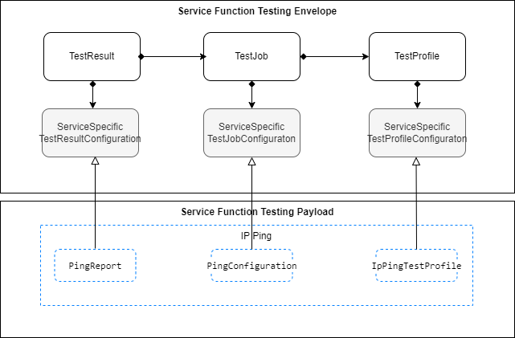

**Figure 3. Service specification for Allegro, Interlude, Legato**

## 4.5. High-Level Flow

The Service Function Testing API in essence allows the BUS to request SOF to
manage Test Profiles and Test Jobs. Typically, Test Profiles are associated
with one or more Test Jobs, but a Test Job can be created without an associated
Test Profile. In such cases, parameters normally provided by the Test Profile
are included directly in the Test Job itself. The SFT Notification API
facilitates the exchange of information about significant changes in the system
state between interested parties Figure 4. presents an example of a high-level
flow of Service Function Testing provisioning.


**Figure 4. High-Level Flow**

The following steps describe the high-level flow:

- The BUS system registers listeners for notifications related to `TestJob` and
  `TestProfile` events via the Hub. <br>**_Note1_**: SFT Notifications are
  optional and do not impact end-to-end flow
- The BUS system retrieves a list of `TestProfiles` by sending a request to the
  SOF system.
- When querying `TestProfile` instances the BUS system uses the _Service
  Function Testing API_.
- The BUS system initiates new Test Job by sending a request containing
  `TestJob` entity to the SOF system.
- The BUS system can start Test Job with or without `TestProfile` which is a
  template containing common configuration shared by multiple `TestJob`
  entities.
- During creation of new Test Job, the BUS uses the _Service Function Testing
  API_ to instantiate the `TestJob`
  - The SOF starts Test Job by creating a `TestJob` entity which may or may not
    contain a reference to the `TestProfile`.
  - The `TestJob` is processed by the SOF as per the state transition rules
    described in [6.6.4.](#664-test-job-state-machine)
  - (optional) The SOF reports the `TestJob` state changes.
  - On a scheduled date according to schedule definition, Test Job is started.
  - (optional) The SOF reports the `TestJob` state change.
  - The BUS system retrieves `TestJob` containing
    `ServiceSpecificTestJobConfiguration` through _Service Function Testing
    API_

The same _Service Function Testing API_ is used by the BUS to create **new**
`TestJob` instances, as well as update **existing** ones or trigger state
transitions.

Figure 5 presents relations between entities that are managed through _Service
Function Testing API_. The diagram is simplified and does not contain all types
of objects.


**Figure 5. The flow between API endpoints**

<div class="page"/>

# 5. API Description

This section presents the API structure and design patterns. It starts with the
high-level use cases diagram. Then it describes the REST endpoints with use
case mapping. Next, it explains the design pattern that is used to combine
service-agnostic and service-specific parts of API payloads. Finally, payload
validation and API security aspects are discussed.

## 5.1. High-level use cases

Figure 6 presents a high-level use case diagram. It aims to help understand the
endpoint mapping. Use cases are described extensively in
[chapter 6](#6-api-interactions-and-flows).


**Figure 6. Use cases**

## 5.2. API Endpoint and Operation Description

### 5.2.1. Seller/Server (SOF) side Service Function Testing API Endpoints

**Base URL for Allegro**:

`https://{{serverBase}}:{{port}}{{?/sof_prefix}}/mefApi/allegro/serviceFunctionTesting/v2/`

**Base URL for Interlude**:

`https://{{serverBase}}:{{port}}{{?/sof_prefix}}/mefApi/interlude/serviceFunctionTesting/v2/`

**Base URL for Legato**:

`https://{{serverBase}}:{{port}}{{?/sof_prefix}}/mefApi/legato/serviceFunctionTesting/v2/`

The following API endpoints are implemented by the Seller/Server (SOF) and
allow the Buyer/Client (SOF/CUS/BUS) to create, retrieve and modify `TestJob`
and `TestProfile` instances. The endpoints and corresponding data model are
defined in `serviceApi/sft/serviceFunctionTest.api.yaml`.

| API Endpoint               | Description                                                                                             | Mplify 136.1 Use Case Mapping |
| -------------------------- | ------------------------------------------------------------------------------------------------------- | --------------------------- |
| POST /testProfile          | A request initiated by the Buyer/Client to create a Test Profile in the Seller/Server system.           | 1                           |
| PATCH /testProfile/{{id}}  | A request initiated by the Buyer/Client to partially modify a Test Profile in the Seller/Server system. | 2                           |
| DELETE /testProfile/{{id}} | A request initiated by the Buyer/Client to delte a Test Profile in the Seller/Server system.            | 3                           |
| GET /testProfile           | The Buyer/Client requests a list of Test Profiles based on a set of filter criteria.                    | 4                           |
| GET /testProfile/{{id}}    | The Buyer/Client requests detailed information about a single Test Profile.                             | 5                           |
| POST /testJob              | A request initiated by the Buyer/Client to create a Test Job in the Seller/Server system.               | 6,7                         |
| GET /testResult            | The Buyer/Client requests a list of Test Results based on a set of filter criteria.                     | 8                           |
| GET /testResult/{{id}}     | The Buyer/Client requests detailed information about a single Test Result.                              | 9                           |
| POST /suspendTestJob       | A request initiated by the Buyer/Client to create a Suspend Test Job in the Seller/Server system.       | 10                          |
| POST /resumeTestJob        | A request initiated by the Buyer/Client to create a Resume Test Job in the Seller/Server system.        | 11                          |
| POST /cancelTestJob        | A request initiated by the Buyer/Client to create a Cancel Test Job in the Seller/Server system.        | 12                          |
| POST /modifyTestJob        | A request initiated by the Buyer/Client to Modify a Test Job in the Seller/Server system.               | 13,14                       |
| GET /testJob               | The Buyer/Client requests a list of Test Jobs based on a set of filter criteria.                        | 15                          |
| GET /testJob/{{id}}        | The Buyer/Client requests detailed information about a single Test Job.                                 | 16                          |
| GET /suspendTestJob        | The Buyer/Client requests a list of Suspend Test Jobs based on a set of filter criteria.                | 20                          |
| GET /suspendTestJob/{{id}} | The Buyer/Client requests detailed information about a single Suspend Test Job.                         | 21                          |
| GET /resumeTestJob         | The Buyer/Client requests a list of Resume Test Jobs based on a set of filter criteria.                 | 22                          |
| GET /resumeTestJob/{{id}}  | The Buyer/Client requests detailed information about a single Resume Test Job.                          | 23                          |
| GET /cancelTestJob         | The Buyer/Client requests a list of Cancel Test Jobs based on a set of filter criteria.                 | 24                          |
| GET /cancelTestJob/{{id}}  | The Buyer/Client requests detailed information about a single Cancel Test Job.                          | 25                          |
| GET /modifyTestJob         | The Buyer/Client requests a list of Modify Test Jobs based on a set of filter criteria.                 | 26                          |
| GET /modifyTestJob/{{id}}  | The Buyer/Client requests detailed information about a single Modify Test Job.                          | 27                          |

**Table 4. Seller/Server (SOF) Service Function Testing mandatory API
endpoints**

**[R1]** Seller/Server (SOF) **MUST** support all API endpoints listed in
Table 4.

API endpoints listed in Table 5 are optional and may be exposed by the SOF.

| API Endpoint       | Description                                                                                                                           | Mplify 136.1 Use Case Mapping |
| ------------------ | ------------------------------------------------------------------------------------------------------------------------------------- | --------------------------- |
| POST /hub          | The Buyer/Client requests to subscribe to the Test Job and/or Test Profile Notifications.                                             | 17                          |
| GET /hub/{{id}}    | The Buyer/Client retrieves a specific `EventSubscription` from the SOF, that matches the _`id`_ value provided as _`path`_ parameter. |                             |
| DELETE /hub/{{id}} | The Buyer/Client requests to unsubscribe from the Test Job and/or Test Profile Notifications.                                         | 19                          |

**Table 5. Seller/Server (SOF) Service Function Testing optional API
endpoints**

**[O1]** The implementation **MAY** support API endpoints listed in Table 5.

### 5.2.2. Buyer/Client (CUS, BUS, SOF) side Service Function Testing API Endpoints

**Base URL for Allegro**:

`https://{{serverBase}}:{{port}}{{?/sof_prefix}}/mefApi/allegro/serviceFunctionTestingNotification/v2/`

**Base URL for Interlude**:

`https://{{serverBase}}:{{port}}{{?/sof_prefix}}/mefApi/interlude/serviceFunctionTestingNotification/v2/`

**Base URL for Legato**:

`https://{{serverBase}}:{{port}}{{?/sof_prefix}}/mefApi/legato/serviceFunctionTestingNotification/v2/`

The following API Endpoints are used by SOF to post notifications to registered
CUS, BUS, or SOF listeners. The endpoints and corresponding data model are
defined in `serviceApi/sft/serviceFunctionTestNotification.api.yaml`

| API Endpoint                                        | Description                                                                                                           | Mplify 136.1 Use Case Mapping |
| --------------------------------------------------- | --------------------------------------------------------------------------------------------------------------------- | --------------------------- |
| POST /listener/testJobCreateEvent                   | A request initiated by the Seller/Server to notify Buyer/Client on `TestJob` instance creation.                       | 18                          |
| POST /listener/testJobAttributeValueChangeEvent     | A request initiated by the Seller/Server to notify Buyer/Client on the `TestJob` instance attribute value change.     | 18                          |
| POST /listener/testJobStateChangeEvent              | A request initiated by the Seller/Server to notify Buyer/Client on the `TestJob` instance state change.               | 18                          |
| POST /listener/cancelTestJobStateChangeEvent        | A request initiated by the Seller/Server to notify Buyer/Client on the `CancelTestJob` instance state change.         | 18                          |
| POST /listener/modifyTestJobStateChangeEvent        | A request initiated by the Seller/Server to notify Buyer/Client on the `ModifyTestJob` instance state change.         | 18                          |
| POST /listener/suspendTestJobStateChangeEvent       | A request initiated by the Seller/Server to notify Buyer/Client on the `SuspendTestJob` instance state change.        | 18                          |
| POST /listener/resumeTestJobStateChangeEvent        | A request initiated by the Seller/Server to notify Buyer/Client on the `ResumeTestJob` instance state change.         | 18                          |
| POST /listener/testProfileCreateEvent               | A request initiated by the Seller/Server to notify Buyer/Client on `TestProfile` instance creation.                   | 18                          |
| POST /listener/testProfileAttributeValueChangeEvent | A request initiated by the Seller/Server to notify Buyer/Client on the `TestProfile` instance attribute value change. | 18                          |
| POST /listener/testProfileLifecycleStateChangeEvent | A request initiated by the Seller/Server to notify Buyer/Client on the `TestProfile` instance state change.           | 18                          |
| POST /listener/testProfileDeleteEvent               | A request initiated by the Seller/Server to notify Buyer/Client on `TestProfile` instance deletion.                   | 18                          |
| POST /listener/testResultCreateEvent                | A request initiated by the Seller/Server to notify Buyer/Client on the `TestResult` instance creation.                | 18                          |

**Table 6. Buyer/Client (CUS, BUS, SOF) Service Function Testing API
endpoints**

**[O2]** The Buyer/Client (CUS, BUS, SOF) **MAY** support API endpoints listed
in Table 6.

**[O3]** The Buyer/Client (CUS, BUS, SOF) **MAY** register to receive Service
Function Testing notifications.

**[R2]** The Seller/Server **MUST** support sending notifications to API
endpoints listed in Table 6 to the registered Buyer/Client.

## 5.3. Integration of Service Testing Specification into Service Function Testing API

Service Function Testing API discussed in this document is a generic envelope
that allows for the lifecycle management of relevant Service Function Testing
objects. The API itself does not provide explicit definitions for configuring
service testing or prescribing the structure of output data. However, it offers
flexible extensibility to accommodate the configuration of service-specific
testing objectives and results. This allows for customization and adaptation to
various testing requirements and desired data formats. This testing
configuration and result schemas are defined using JsonSchema (draft 7) format
[JSON Schema draft 7](#8-references) and can be integrated into the `TestJob`,
`TestProfile` and `TestResult` using the TMF extension pattern.

The extension hosting types in the API data model are:

- `ServiceSpecificTestProfileConfiguration` - this type is extended with
  Service Specific Test Profile attributes that define how a test is performed
  for a given Test Specification.
- `ServiceSpecificTestJobConfiguration` - this type is extended with Test
  Measure attributes schema
- `ServiceSpecificTestResultConfguration` - this type is extended with Test
  Result attributes schema

The `@type` attribute of those extension hosting types must be set to a value
that uniquely identifies the service testing configuration. A unique identifier
for Mplify standard service schemas is in URN format and is assigned by Mplify. This
identifier is provided as root schema `$id`. Use of Non-Mplify standard service
testing configuration is allowed. In such a case the schema identifier must be
agreed upon between the Buyer/Client and the Seller/Server.

The example below shows a header of a schema, which describes IP Service
Function Testing Ping Configuration Schema, where
`"$id": urn:mef:lso:spec:legato:ping-configuration:v0.0.1:all` is the
above-mentioned URN:

```yaml
$schema: http://json-schema.org/draft-07/schema#
$id: urn:mef:lso:spec:legato:ping-configuration:v0.0.1:all
x-mef-target: ServiceSpecificTestJobConfiguration
description: IP Service Function Testing Ping Configuration Schema
```

Service Testing configuration payload is introduced in SFT API entities through
a `serviceSpecificTestProfileConfiguration` attribute of type
`ServiceSpecificTestProfileConfiguration`, which is used as an extension point
for configuration attributes.

In terms of test measures and test results, the appropriate payloas are
introduced via `ServiceSpecificTestJobConfiguration` and
`ServiceSpecificTestResultConfguration` respectivly.

Implementations might choose to integrate selected Service Function Testing
specifications to data model during development. In such a case an integrated
data model is built, and specifications are placed in an inheritance
relationship with either `ServiceSpecificTestProfileConfiguration`,
`ServiceSpecificTestJobConfiguration` or
`ServiceSpecificTestResultConfguration` as described in the OAS specification.
This pattern is reffered to as **Static Binding**. The snippets below present
an example of a static binding of the envelope API with exemplary Mplify SFT
specifications, for each extension point.

```yaml
ServiceSpecificTestProfileConfiguration:
  description:
    ServiceSpecificTestProfileConfiguration is used as an extension point
    for  for schema that define how a test is performed for a given Test
    Specification. The `@type` attribute is used as a discriminator.
  discriminator:
    mapping:
      urn:mef:lso:spec:legato:ip-ping-test-profile:v0.0.1:all: '#/components/schemas/IpPingTestProfile'
    propertyName: '@type'
  properties:
    '@type':
      description:
        The named type must be a subclass of
        ServiceSpecificTestProfileConfiguration.
      enum:
        - urn:mef:lso:spec:legato:ip-ping-test-profile:v0.0.1:all
      type: string
  required:
    - '@type'
  type: object
```

```yaml
IpPingTestProfile:
  allOf:
    - $ref: '#/components/schemas/ServiceSpecificTestProfileConfiguration'
    - description: IP Ping Test Profile Schema
```

```yaml
ServiceSpecificTestJobConfiguration:
  description:
    ServiceSpecificTestJobConfiguration is used as an extension point for
    schema to be used that defines the Test Measure attributes. The `@type`
    attribute is used as a discriminator.
  discriminator:
    mapping:
      urn:mef:lso:spec:legato:ping-configuration:v0.0.1:all: '#/components/schemas/PingConfiguration'
      urn:mef:lso:spec:service:bfd-configuration:v0.0.1:all: '#/components/schemas/BfdConfiguration'
      urn:mef:lso:spec:service:twamp-configuration:v0.0.1:all: '#/components/schemas/TwampConfiguration'
    propertyName: '@type'
  properties:
    '@type':
      description:
        The named type must be a subclass of
        ServiceSpecificTestJobConfiguration.
      enum:
        - urn:mef:lso:spec:legato:ping-configuration:v0.0.1:all
        - urn:mef:lso:spec:service:bfd-configuration:v0.0.1:all
        - urn:mef:lso:spec:service:twamp-configuration:v0.0.1:all
      type: string
  required:
    - '@type'
  type: object
```

```yaml
PingConfiguration:
  allOf:
    - $ref: '#/components/schemas/ServiceSpecificTestJobConfiguration'
    - description: IP Service Function Testing Ping Configuration Schema
BfdConfiguration:
  allOf:
    - $ref: '#/components/schemas/ServiceSpecificTestJobConfiguration'
    - description: IP Service Function Testing BFD Configuration Schema.
TwampConfiguration:
  allOf:
    - $ref: '#/components/schemas/ServiceSpecificTestJobConfiguration'
    - description: IP Service Function Testing TWAMP Configuration Schema
```

```yaml
ServiceSpecificTestResultConfguration:
  description:
    ServiceSpecificTestResultConfguration is used as an extension point for
    schema to be used that defines the Test Result attributes. The `@type`
    attribute is used as a discriminator.
  discriminator:
    mapping:
      urn:mef:lso:spec:legato:ping-report:v0.0.1:all: '#/components/schemas/PingReport'
      urn:mef:lso:spec:legato:bfd-report:v0.0.1:all: '#/components/schemas/BfdReport'
      urn:mef:lso:spec:service:twamp-report:v0.0.1:all: '#/components/schemas/TwampReport'
    propertyName: '@type'
  properties:
    '@type':
      description:
        The named type must be a subclass of ServiceSpecificTestJobResult.
      enum:
        - urn:mef:lso:spec:legato:ping-report:v0.0.1:all
        - urn:mef:lso:spec:legato:bfd-report:v0.0.1:all
        - urn:mef:lso:spec:service:twamp-report:v0.0.1:all
      type: string
  required:
    - '@type'
  type: object
```

```yaml
PingReport:
  allOf:
    - $ref: '#/components/schemas/ServiceSpecificTestResultConfguration'
    - description: IP Service Function Testing Ping Results Schema.
BfdReport:
  allOf:
    - $ref: '#/components/schemas/ServiceSpecificTestResultConfguration'
    - description: IP Service Function Testing BFD Report Schema.
TwampReport:
  allOf:
    - $ref: '#/components/schemas/ServiceSpecificTestResultConfguration'
    - description: IP Service Function Testing TWAMP Results Schema
```

Alternatively, implementations might choose not to build an integrated model
and choose a different mechanism allowing runtime validation of
service-specific fragments of the payload. The system can validate a given
configuration against a new schema without redeployment. This pattern is called
**Dynamic Binding.**

Regardless of the chosen implementation pattern, the HTTP payload is the same.
Both implementation approaches must conform to the requirements specified
below.

**[R3]** `ServiceSpecificTestProfileConfiguration`,
`ServiceSpecificTestJobConfiguration` and
`ServiceSpecificTestResultConfguration` types are extension points that
**MUST** be used to integrate service specific test profile, job and result
properties into a request/response payload.

**[R4]** The `@type` property of `ServiceSpecificTestProfileConfiguration`,
`ServiceSpecificTestJobConfiguration` and
`ServiceSpecificTestResultConfguration` **MUST** be used to specify the type of
the extending entity.

**[R5]** Attributes specified in the payload must conform to the test
definition specified in the `@type` property.

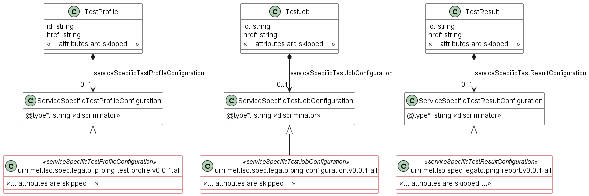

**Figure 7. The Extension Pattern with Sample Service-Specific Extension**

Figure 7 presents Mplify Service Function Testing schemas that represent test
profile, job and result classes for IP services. When these schemas are used,
the `@type` of `ServiceSpecificTestProfileConfiguration` takes
`"urn:mef:lso:spec:legato:ping-configuration:v0.0.1:all"` value to indicate
which service specific attributes that define how a test is performed for a
given test specification should be included in the payload. Similarly, for
`ServiceSpecificTestJobConfiguration`, the `@type` attribute takes
`"urn:mef:lso:spec:legato:ping-configuration:v0.0.1:all"` value. Finaly, for
`ServiceSpecificTestResultConfguration`, the `@type` attribute takes
`"urn:mef:lso:spec:legato:ping-report:v0.0.1:all"` value which indicates how
the test result collection should be interpreted.

## 5.4. Model structure and validation

The structure of the payloads exchanged via Allegro, Interlude, and Legato
Service Function Testing API endpoints is defined using:

- OpenAPI version 3.0 for the service-agnostic part of the payload
- JsonSchema (draft 7) for the service-specific part of the payload

**[R6]** Implementations **MUST** use payloads that conform to these
definitions.

## 5.5. Security Considerations

Although the Legato IRP is internal to a Service Provider/Operator business
boundary, it is expected that some minimal security mechanisms are in place for
any communication over this IRP. There must also be authorization mechanisms in
place to control what a particular Buyer/Client or SOF is allowed to do and
what information may be obtained. For Allegro and Interlude IRPs, security
should follow rules for external communication. The definition of the exact
security mechanism and configuration is outside the scope of this document. The
LSO Security mechanisms are defined by MEF 128.1 _LSO API Security Profiles_
[[MEF 128.1](#8-references)].

<div class="page"/>

# 6. API Interactions and Flows

This section provides a detailed insight into the API functionality, use cases,
and flows. It starts with Table 7 presenting a list and short description of
all business use cases then present the variants of end-to-end interaction
flows, and in the following subchapters describe the API usage flow and
examples for each of the use cases.

| Use Case # | Use Case Name                               | Use Case Description                                                                                                                                      | Mplify 136.1 Use Case Mapping |
| ---------- | ------------------------------------------- | --------------------------------------------------------------------------------------------------------------------------------------------------------- | --------------------------- |
| 1          | Create Test Profile                         | A request initiated by the Buyer/Client to create a Test Profile in the Seller/Server system.                                                             | 1                           |
| 2          | Retrieve List of Test Profiles              | The Buyer/Client requests a list of Test Profiles based on a set of filter criteria. The Seller/Server returns a summarized list of Test Profiles.        | 4                           |
| 3          | Retrieve Test Profile by Profile Identifier | The Buyer/Client requests detailed information about a single Test Profile based on the Test Profile Identifier.                                          | 5                           |
| 4          | Modify Test Profile                         | A request initiated by the Buyer/Client to modify a Test Profile in the Seller/Server system based on a Test Profile Identifier.                          | 2                           |
| 5          | Delete Test Profile                         | The Buyer/Client requests deletion of the Test Profile by specifying the Test Profile Identifier.                                                         | 3                           |
| 6          | Create Test Job                             | A request initiated by the Buyer/Client to create a Test Job in the Seller/Server system                                                                  | 6,7                         |
| 7          | Retrieve List of Test Jobs                  | The Buyer/Client requests a list of Test Jobs based on a set of filter criteria. The Seller/Server returns a summarized list of Test Jobs.                | 15                          |
| 8          | Retrieve Test Job by Job Identifier         | The Buyer/Client requests detailed information about a single Test Job based on the Test Job Identifier.                                                  | 16                          |
| 9          | Modify Test Job                             | A request initiated by the Buyer/Client to Modify a Test Job in the Seller/Server system.                                                                 | 13                          |
| 10         | Retrieve List of Modify Test Jobs           | The Buyer/Client requests a list of Modify Test Job based on a set of filter criteria. The Seller/Server returns a summarized list of Modify Test Jobs.   | 26                          |
| 11         | Retrieve Modify Test Job by Job Identifier  | The Buyer/Client requests detailed information about a single Modify Test Job based on the Modify Test Job Identifier.                                    | 27                          |
| 12         | Cancel Test Job                             | A request initiated by the Buyer/Client to Cancel a Test Job in the Seller/Server system.                                                                 | 12                          |
| 13         | Retrieve List of Cancel Test Jobs           | The Buyer/Client requests a list of Cancel Test Job based on a set of filter criteria. The Seller/Server returns a summarized list of Cancel Test Jobs.   | 24                          |
| 14         | Retrieve Cancel Test Job by Job Identifier  | The Buyer/Client requests detailed information about a single Cancel Test Job based on the Cancel Test Job Identifier.                                    | 25                          |
| 15         | Suspend Test Job                            | A request initiated by the Buyer/Client to Suspend a Test Job in the Seller/Server system.                                                                | 10                          |
| 16         | Retrieve List of Suspend Test Jobs          | The Buyer/Client requests a list of Suspend Test Job based on a set of filter criteria. The Seller/Server returns a summarized list of Suspend Test Jobs. | 20                          |
| 17         | Retrieve Suspend Test Job by Job Identifier | The Buyer/Client requests detailed information about a single Suspend Test Job based on the Suspend Test Job Identifier.                                  | 21                          |
| 18         | Resume Test Job                             | A request initiated by the Buyer/Client to Resume a Test Job in the Seller/Server system.                                                                 | 11                          |
| 19         | Retrieve List of Resume Test Jobs           | The Buyer/Client requests a list of Resume Test Job based on a set of filter criteria. The Seller/Server returns a summarized list of Resume Test Jobs.   | 22                          |
| 20         | Retrieve Resume Test Job by Job Identifier  | The Buyer/Client requests detailed information about a single Resume Test Job based on the Resume Test Job Identifier.                                    | 23                          |
| 21         | Retrieve List of Test Results               | The Buyer/Client requests a list of Test Jobs based on a set of filter criteria. The Seller/Server returns a summarized list of Test Jobs.                | 8                           |
| 22         | Retrieve Test Result by Result Identifier   | The Buyer/Client requests detailed information about a single Test Job based on the Test Job Identifier.                                                  | 9                           |
| 23         | Register for Event Notifications            | The Buyer/Client requests to subscribe to Test Profile and/or Test Job Notifictions.                                                                      | 17                          |
| 24         | Send Event Notification                     | A request initiated by the Seller/Server to notify the Buyer/Client.                                                                                      | 19                          |
| 25         | Unregister for Event Notifications          | The Buyer/Client requests to unsubscribe to Test Profile and/or Test Job Notifications.                                                                   | 18                          |

**Table 7. Use cases description**

## 6.1. Use Case 1: Create a Test Profile

Test Profile is a template that is used to simplify the Test Job provisioning.
Common attributes can be defined in the Test Profile which can be centralized
and leveraged across multiple Test Jobs.

### 6.1.1. Interaction flow

The flow of this use case is described in Figure 8.


**Figure 8. Use Case 1 - Test Profile create request flow**

The Buyer/Client sends a request with a `TestProfile_Create` type in the body.
The SOF performs request validation, assigns an `id`, and returns `TestProfile`
type in the response body, with a `state` set to `acknowledged`. From this
point, the Test Profile will undergo further validations before it is ready to
be used, and its state is set to `completed`. The Buyer/Client can track the
progress of the process either by subscribing for notifications or by
periodically polling the `TestProfile`. The two patterns are presented in the
following diagrams.


**Figure 9. Test Profile progress tracking - Notifications**

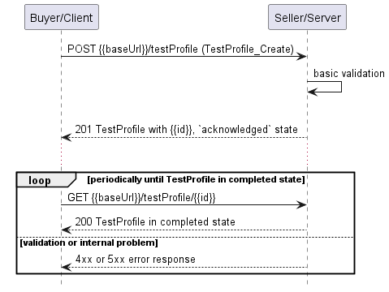

**Figure 10. Test Profile progress tracking - Polling**

**_Note_**: The context of notifications is not a part of the considered use
case itself. It is presented to show the big picture of end-to-end flow. This
applies also to all further use case flow diagrams with notifications.

### 6.1.2. Create Test Profile Request

Figure 11 presents the most important part of the data model used during the
Create Test Profile request (`POST /testProfile`) and response. The model of
the request message - `TestProfile_Create` is a subset of the
`TestProfile_Common` model and contains only attributes that can (or must) be
set by the requestor. The Seller/Server then enriches the entity in the
response with additional information.

**_Note:_** `TestProfile_Create` is an entity used by the Buyer/Client to make
a request. `TestProfile` is an entity used by the Seller/Server to provide a
response. The request entity has a subset of attributes of the response entity.
Thus for the visibility of these shared attributes `TestProfile_Common` has
been introduced. However, this class is not to be used directly in the
exchange.

A `TestProfile_Create` defines details of the execution of the `TestJob` that
will use the profile as a template. This includes parameters that can be shared
by multiple Test Jobs.

The full list of attributes is available in [Section 7](#7-api-details) and in
the API specification which is an integral part of this standard.


**Figure 11. Test Profile Key Entities**

To send a request the Buyer/Client uses the `createTestProfile` operation from
the API. The snippet below presents an example of a Create Test Profile
request:

**Test Profile Create Request**

```json
{
  "name": "Basic IP Ping Test Profile",
  "description": "Test profile to perform IP ping operations on a cloud-connected endpoint.",
  "isBundled": false,
  "lifecycleStatus": "approved",
  "validFor": "2025-12-31T23:59:59Z",
  "relatedServiceSpecification": {
    "id": "svc-spec-001",
    "href": "https://example.com/services/svc-spec-001"
  },
  "relatedContact": [
    {
      "name": "John Doe",
      "organization": "NetworkOps Inc.",
      "emailAddress": "john.doe@example.com",
      "phoneNumber": "+1-555-123456",
      "postalAddress": "1234 Test Lane, Test City, TC 12345"
    }
  ],
  "serviceSpecificTestProfileConfiguration": {
    "@type": "urn:mef:lso:spec:legato:ip-ping-test-profile:v0.0.1:all",
    "interface": {
      "name": "Cloud Location A",
      "description": "Primary test location",
      "cloudService": true,
      "ipvcEndpoint": ["endpoint-1"]
    },
    "vlan": 200,
    "sourceIpAddress": {
      "ipv4": ["192.168.1.1"]
    },
    "destinationIpAddress": {
      "ipv4": ["192.168.1.100"]
    },
    "transmissionInterval": {
      "amount": 5,
      "units": "seconds"
    },
    "protocol": "IPV4",
    "count": 50,
    "sweepmaxsize": 1500,
    "sweepminsize": 100,
    "sweepincrement": 100,
    "wait": 1,
    "preload": 5,
    "mask": "255.255.255.0",
    "timeToLive": 64,
    "pattern": "0xAA",
    "packetSize": 512,
    "timeout": 2,
    "waitTime": 3,
    "typeOfService": 0
  }
}
```

**[R7]** The Buyer/Client Create Test Profile request **MUST** provide the
following attributes: [Mplify 136.1 R1]

- `name`
- `lifecycleStatus`
- `validFor`

**[O4]** The Buyer/Client Create Test Profile request **MAY** contain any other
attributes.

### 6.1.3. Create Test Profile Response

Entities used for providing a response to the Create Test Profile request are
presented in Figure 11. The Seller/Server responds with a `TestProfile` type,
which adds some attributes to the `TestProfile_Create` that was used in the
Buyer/Client request.

**_Note_**: The term "Response Code" used in the Business Requirements maps to
HTTP response code, where `2xx` indicates _Success_ and `4xx` or `5xx` indicate
_Failure_. This applies also to all further use cases with response.

The following snippet presents the Seller/Server response. It has the same
structure as in the retrieve by identifier operation.

**Test Profile Create Response**

```json
{
  "id": "tp-001",
  "href": "https://example.com/testProfiles/tp-001",
  "name": "Basic IP Ping Test Profile",
  "description": "Test profile to perform IP ping operations on a cloud-connected endpoint.",
  "isBundled": false,
  "lifecycleStatus": "approved",
  "lifecycleState": "available",
  "creationDate": "2025-06-10T10:00:00Z",
  "lastUpdate": "2025-06-12T14:30:00Z",
  "validFor": "2025-12-31T23:59:59Z",
  "relatedServiceSpecification": {
    "id": "svc-spec-001",
    "href": "https://example.com/services/svc-spec-001"
  },
  "relatedContact": [
    {
      "name": "John Doe",
      "organization": "NetworkOps Inc.",
      "emailAddress": "john.doe@example.com",
      "phoneNumber": "+1-555-123456",
      "postalAddress": "1234 Test Lane, Test City, TC 12345"
    }
  ],
  "serviceSpecificTestProfileConfiguration": {
    "@type": "urn:mef:lso:spec:legato:ip-ping-test-profile:v0.0.1:all",
    "interface": {
      "name": "Cloud Location A",
      "description": "Primary test location",
      "cloudService": true,
      "ipvcEndpoint": ["endpoint-1"]
    },
    "vlan": 200,
    "sourceIpAddress": {
      "ipv4": ["192.168.1.1"]
    },
    "destinationIpAddress": {
      "ipv4": ["192.168.1.100"]
    },
    "transmissionInterval": {
      "amount": 5,
      "units": "seconds"
    },
    "protocol": "IPV4",
    "count": 50,
    "sweepmaxsize": 1500,
    "sweepminsize": 100,
    "sweepincrement": 100,
    "wait": 1,
    "preload": 5,
    "mask": "255.255.255.0",
    "timeToLive": 64,
    "pattern": "0xAA",
    "packetSize": 512,
    "timeout": 2,
    "waitTime": 3,
    "typeOfService": 0
  }
}
```

Attributes that are set by the Seller/Server in the response are marked with
the `<< added by SOF >>` tag.

**[R8]** The Seller/Server's response **MUST** include all and unchanged
attributes' values as provided by the Buyer/Client in the request.

**[R9]** The Seller/Server **MUST** specify the following attributes in a
response:

- `creationDate`
- `id`

**[R10]** The `id` **MUST** remain the same value for the life of the Test
Profile.

### 6.1.4. Test Profile Lifecycle Flow

Figure 12 presents the Test Profile Lifecycle Flow

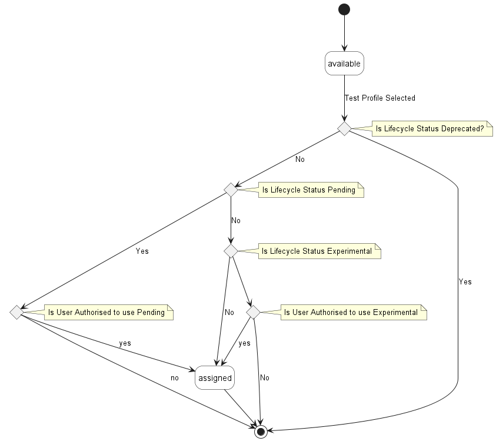

**Figure 12. Test Profile Lifecycle Status Flow**

A Test Profile begins in the `available` state once it has been created or
modified and is ready to be referenced in a Test Job. When the profile is
selected for use in a Test Job, its lifecycle state transitions to `assigned`.
While in the `assigned` state, the Test Profile is considered active and can no
longer be modifed.

Table 9 presents the mapping between the `TestProfile` API `lifecycleState`
names and the Mplify 136.1 naming, together with the state description.

| State       | Mplify 136.1 name | Description                                                                                    |
| ----------- | --------------- | ---------------------------------------------------------------------------------------------- |
| `assigned`  | ASSIGNED        | The Test Profile has been assigned to a Test Job.                                              |
| `available` | AVAILABLE       | The Test Profile has been created or modified and is ready for users to specify in a Test Job. |

**Table 9. Test Profile Lifecycle states**

Test Profiles include a Lifecycle Status attribute that indicates the stage of
the profile within the development and approval process. The status can range
from `experimental`, where usage may be limited to a small group of users, to
`deprecated`, indicating the profile has been replaced and is no longer
intended for use. Other possible statuses include `pending`, meaning the
profile is awaiting approval, and `approved`, where the profile has been
reviewed and is available for general use. The Lifecycle Status also helps
determine which types of users are permitted to use the Test Profile.

Table 9 presents the mapping between the API `lifecycleStatus` names and the
Mplify 136.1 naming, together with the states description.

| Status         | Mplify 136.1 name | Description                                                 |
| -------------- | --------------- | ----------------------------------------------------------- |
| `experimental` | EXPERIMENTAL    | Test Profile use may be limited to a small number of users. |
| `pending`      | PENDING         | Test Profile is waiting to be Approved.                     |
| `approved`     | APPROVED        | Test Profile has been Approved for general use.             |
| `deprecated`   | DEPRECATED      | Test Profile has been replaced by another Test Profile.     |

**Table 9. Test Profile Lifecycle statuses**

## 6.2. Use Case 2: Retrieve List of Test Profiles

The Buyer/Client can retrieve a list of `TestProfile` by using a
`GET /testProfile` operation with desired filtering criteria.

**[O5]** The Buyer/Client Retrieve List of Test Profiles request **MAY**
contain none or more of the following attributes as filter criteria:

- `description`
- `creationDate.gt`
- `creationDate.lt`
- `lastUpdate.gt`
- `lastUpdate.lt`
- `relatedServiceSpecificationId`

```
https://serverRoot/mefApi/legato/serviceFunctionTesting/v2/testProfile?creationDate.gt="2024-08-12T23:20:50.52Z"&limit=10&offset=0
```

The example above shows a Buyer/Client's request to get all Test Profile
objects created after `2024-08-12T23:20:50.52Z`. Additionally, the Buyer/Client
asks only for a first (`offset=0`) pack of 10 results (`limit=10`) to be
returned. The correct response (HTTP code `200`) in the response body contains
a list of `TestProfile` objects matching the criteria. To get all the details,
the Buyer/Client has to query a specific `TestProfile` by its `id`. Details
related to pagination are described in
[section 6.2.1](#621-response-pagination)

**[R11]** If the request is successful, the Seller/Server MUST reply with list
of `TestProfile` objects that match filter criteria to the Buyer/Client.
[Mplify 136.1 R16]

**[R12]** If the request is successful but the Seller/Server finds no entries
that match the filter criteria, they **MUST** return an empty list. [Mplify 136.1
R17]

**[R13]** If the request is unsuccessful, the Seller/Server **MUST** return an
error with explanation to the Buyer/Client. [Mplify 136.1 R19]

### 6.2.1. Response pagination

A response to retrieve a list of results (e.g. `GET /testJob`) can be
paginated. The Buyer/Client can specify the following query attributes related
to pagination:

- `limit` - number of expected list items
- `offset` - offset of the first element in the result list

The filtering and pagination attributes must be specified in URI query format
[RFC3986](#8-references).The Seller/Server returns a list of elements that
comply with the requested `limit`. If the requested `limit` is higher than the
supported list size the smaller list result is returned. In that case, the size
of the result is returned in the header attribute `X-Result-Count`. The Seller
can indicate that there are additional results available using:

- `X-Total-Count` header attribute with the total number of available results
- `X-Pagination-Throttled` header set to `true`

**[R14]** Seller **MUST** use either `X-Total-Count` or
`X-Pagination-Throttled` to indicate that the page was truncated and additional
results are available.

## 6.3. Use Case 3: Retrieve Test Profile by Profile Identifier

The Buyer/Client can retrieve single `TestProfile` instance from the
Seller/Server by using a `GET /testProfile/{{id}}` operation. The payload
returned in the response is a full representation of the Test Profile and
includes all attributes the Buyer/Client has provided while sending a Test
Profile create request, together with additional attributes set by
Seller/Server. A response to a Get by Id for a `TestProfile` with
`id=8df0981a-0949-11ee-be56-0242ac120002` would return exactly the same
response as presented in [section 6.1.3](#613-create-test-profile-response).

**[R15]** If the request is successful, the Seller/Server response to a
"Retrieve Test Profile by Test Profile Identifier" request **MUST** include a
`TestProfile`. [Mplify 136.1 R24]

**[R16]** If the request is unsuccessful, the Seller/Server **MUST** return an
error with explanation to the Buyer/Client. [Mplify 136.1 R25]

**[R17]** In case `id` does not allow finding a `TestProfile` in
Seller/Server's system, an error response `Error404` **MUST** be returned.


**Figure 13. Use Case 3: Retrieve Test Profile by Profile Identifier - Model**

## 6.4. Use Case 4: Modify Test Profile

The update operation is performed using the REST PATCH method at the endpoint
`PATCH /testProfile/{{id}}`. A specialized type, `TestProfile_Modify`, is
provided for this purpose. It includes only the attributes that are updateable
and can be set by the Buyer/Client. A Test Profile cannot be modified if it is
used by a Test Job in which case its `lifecycleState` is set to `assigned`.

The PATCH usage recommendation follows RFC 7386 json/merge
(https://tools.ietf.org/html/rfc7386).

Figure 15 presents the model used in the PATCH request. The Seller/Server
responds with a `TestProfile` type which is a full representation of Test
Profile instance.


**Figure 14. Patch request Model**

**[R18]** The Buyer’s Modify Test Profile request **MUST** include Test Profile
Identifier and at least one other attribute from `TestProfile_Modify` object.
[Mplify 136.1 R8]

- `description`
- `isBundled`
- `lifecycleStatus`
- `name`
- `testProfileRelationship`
- `serviceSpecificTestProfileConfiguration`
- `relatedServiceSpecification`
- `relatedContact`

**[O6]** The Buyer’s Modify Test Profile request **MAY** include any other
attributes from `TestProfile_Modify` object. [Mplify 136.1 O2]

**[R19]** If the request is successful, the Seller/Server response to a
"Retrieve Test Profile by Test Profile Identifier" request **MUST** include a
`TestProfile` with requested attriutes updated. [Mplify 136.1 R9]

**[R20]** The Seller/Server **MUST** set `lastUpdate` to current date and time.
[Mplify 136.1 R11]

**[R21]** If the Seller/Server encounters errors, they **MUST** return an error
with explanation to the Buyer/Client. [Mplify 136.1 R12]

**[R22]** In case `id` does not allow to find a `TestProfile` that is to be
updated in Seller/Server's system, an error response `Error404` **MUST** be
returned.

**[R23]** The Seller/Server **MUST** return an **Error422** if the Test Profile
`TestProfileLifecycleState` is set to `assigned`

The example below shows a request to patch a `TestProfile` that was created in
section [6.1.2](#612-create-test-profile-request).

The request below aims to:

- update Test Profile `description`
- set last date that the Test Profile is valid by modifying the `validFor`
- change Test Profile `lifecycleStatus` to `approved`

```json
{
  "description": "Approved Basic IP Ping Test Profile",
  "validFor": "2026-01-31T23:59:59Z",
  "lifecycleStatus": "approved"
}
```

## 6.5. Use Case 5: Delete Test Profile

The Buyer/Client may request to delete a Test Profile by using
`DELETE /testProfile/{{id}}` endpoint. This operation only requires providing
the `id` in the path and has an empty `204` confirmation response.

**[R24]** If the Seller/Server encounters errors, they **MUST** return an error
with explanation to the Buyer/Client. [Mplify 136.1 R15]

**[R25]** In case `id` does not allow to find a `TestProfile` that is to be
deleted in Seller/Server's system, an error response `Error404` **MUST** be
returned.

**[R26]** The Seller/Server **MUST** return an error response `Error422` if the
`TestProfile`, `lifecycleState` attribute is `assigned`.

The sequence diagram below presents this use case in detail.


**Figure 15. Delete Test Profile Flow**

The Seller/Server verifies the request, then searches for a Test Profile to be
deleted by the given `id`. If found, the Seller/Server checks also if there are
any Test Job objects that refer to the Test Profile (meaning `lifecycleState`
is `assigned`). If everything is verified correctly, the Seller deletes the
Test Profile , sends a successful response to a request followed by
`testProfileDeleteEvent` in case the Buyer/Client subscribed for relevant
notifications.

## 6.6. Use Case 6: Create a Test Job

A Test Job is a service-specific entity that defines both the service under
test and the test profile to be used. It is responsible for performing the
actual test and making the results available. As the Test Job runs, it follows
the instructions in the referenced test profile to execute the specified test.
Each Test Job is expected to produce a Test Result, which provides the
Buyer/Client with the outcome of the test.

For example, a Test Job can be created to execute a test on an IP service. The
Test Profile such as one defining how to perform an ICMP ping test is
referenced within the Test Job. When the Test Job runs, it follows the steps
defined in the Test Profile to test the service. Once the test is complete, the
results are made available and can be retrieved by the user.

Test Jobs may also be created without referencing a Test Profile; these are
known as Test Jobs without a Test Profile. This approach is typically used for
ad hoc or one-off testing rather than for repeatable, standardized scenarios.
In such cases, the Test Job itself defines the configuration and execution
steps that would otherwise be specified in the Test Profile.

**[O7]** Test Job **MAY** use Test Profile as a template.

### 6.6.1. Interaction flow

The flow of this use case is shown in Figure 17.

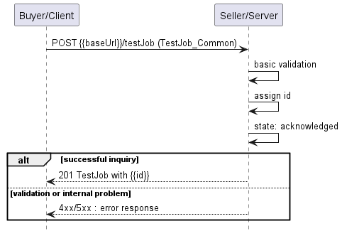

**Figure 16. Use Case 6 - Test Job create request flow**

The Buyer/Client sends a request with a `TestJob_Common` type in the body. The
Seller/Server performs request validation, assigns an `id`, and returns the
`TestJob` type in the response body, with a `state` set to `acknowledged`. From
this point, the Test Job is ready for further processing. The Buyer/Client can
track the progress of the process either by subscribing for notifications or by
periodically polling the `TestJob`. The two patterns are presented in the
following diagrams.


**Figure 17. Test Job progress tracking - Notifications**


**Figure 18. Test Job progress tracking - Polling**

### 6.6.2. Create Test Job Request with Test Profile

Figure 20 presents the most important part of the data model used during the
Create Test Job request (`POST /testJob`) and response. The model of the
request message - `TestJob_Common` contains only attributes that can (or must)
be set by the Buyer/Client. The Seller/Server (SOF) then enriches the entity in
the response with additional information.

A `TestJob_Common` defines service test configuration parameters that are to be
applied at execution time. It also refers to the existing `TestProfile` by its
`id` or directly provides values of attributes defined by the `TestProfile`
type. See chapter [section 6.6.5](#665-relationship-to-test-profile) for more
details.

The full list of attributes is available in [Section 7](#7-api-details) and in
the API specification which is an integral part of this standard.


**Figure 19. Test Job with Test Profile Key Entities**

To send a create Test Job request the Buyer/Client uses the `createTestJob`
operation from the API: `POST /testJob`. For clarity, some of the create Test
Job payload's attributes might be omitted to improve examples' readability.

**Test Job Create Request**

```json
{
  "name": "PingTestJob-001",
  "description": "Ping test from ServiceA to ServiceB",
  "relatedServiceFrom": {
    "id": "svc-001"
  },
  "relatedServiceTo": {
    "id": "svc-002"
  },
  "testProfile": {
    "@type": "TestProfileRef",
    "id": "tp-001"
  },
  "validFor": "2025-07-01T00:00:00Z",
  "endDateTime": "2025-06-30T23:59:59Z",
  "serviceSpecificTestJobConfiguration": {
    "@type": "urn:mef:lso:spec:legato:ping-configuration:v0.0.1:all",
    "interface": {
      "name": "location-1",
      "description": "Primary test location",
      "ipvcEndpoint": ["ep-01"]
    },
    "vlan": 100,
    "sourceIpAddress": {
      "ipv4": ["192.0.2.1"]
    },
    "destinationIpAddress": {
      "ipv4": ["192.0.2.2"]
    },
    "transmissionInterval": {
      "amount": 1,
      "units": "seconds"
    },
    "protocol": "ICMP",
    "count": 5,
    "packetSize": 64,
    "timeout": 3
  }
}
```

**[R27]** The Buyer’s/Client’s Create Test Job **MUST** provide the following
attributes: [Mplify 136.1 R26]

- `name`
- `startDateTime`
- `endDateTime`
- `validFor`
- `testProfile`
- `relatedServiceFrom`
- `relatedServiceTo`
- `serviceSpecificTestJobConfiguration`

**[R28]** If the Test Job’s `validFor` date/time is reached while it is in the
`inProgress`, `suspended`, or `assessingModification` state, the Seller/Server
**MUST** complete the currently running Test Job. [Mplify 136.1 R25]

**[R29]** If the Test Job’s `validFor` date/time is reached while a Test Job is
scheduled, the Seller/Server **MUST** cancel the Test Job. [Mplify 136.1 R26]

### 6.6.3. Create Test Job with Test Profile Response

Entities used for providing a response to Create Test Job requests are
presented in Figure 20. The Seller/Server responds with a `TestJob` type, which
adds some attributes (like `id` or `state`) to the `TestJob_Common` that was
used in the Buyer/Client request.

The following snippet presents the Seller/Server response. It has the same
structure as in the retrieve by identifier operation.

**Test Job Create Response**

```json
{
  "id": "job-12345",
  "href": "/testJobs/job-12345",
  "name": "PingTestJob-001",
  "description": "Ping test from ServiceA to ServiceB",
  "relatedServiceFrom": {
    "id": "svc-001"
  },
  "relatedServiceTo": {
    "id": "svc-002"
  },
  "testProfile": {
    "@type": "TestProfileRef",
    "id": "tp-001"
  },
  "validFor": "2025-07-01T00:00:00Z",
  "endDateTime": "2025-06-30T23:59:59Z",
  "serviceSpecificTestJobConfiguration": {
    "@type": "urn:mef:lso:spec:legato:ping-configuration:v0.0.1:all",
    "interface": {
      "name": "location-1",
      "description": "Primary test location",
      "ipvcEndpoint": ["ep-01"]
    },
    "vlan": 100,
    "sourceIpAddress": {
      "ipv4": ["192.0.2.1"]
    },
    "destinationIpAddress": {
      "ipv4": ["192.0.2.2"]
    },
    "transmissionInterval": {
      "amount": 1,
      "units": "seconds"
    },
    "protocol": "ICMP",
    "count": 5,
    "packetSize": 64,
    "timeout": 3
  },
  "creationDate": "2025-06-13T10:00:00Z",
  "lastModifiedDate": "2025-06-13T10:00:00Z",
  "state": "acknowledged"
}
```

Attributes that are set by the Seller/Server in the response are marked with
the `<< added by SOF >>` tag.

**[R30]** If the request is successful, the Seller’s response to a Create Test
Job request **MUST** echo back all Buyer/Client provided attributes. [Mplify 136.1
R29]

**[R31]** If the request is successful, the Seller MUST return the following
attributes:

- `id`
- `state` [Mplify 136.1 R30]

**[R32]** If the request is unsuccessful, the Seller/Server **MUST** return an
error with explanation to the Buyer/Client.. [Mplify 136.1 R31, R32]

**[R33]** If the Seller/Server encounters errors, they **MUST** return an error
with explanation to the Buyer/Client. [Mplify 136.1 R33]

### 6.6.4. Create Test Job without Test Profile Request

A Test Job can be created without referencing an existing Test Profile in the
request by directly providing the required attributes typically defined by the
`TestProfile`.

The `TestJob_Common` class, used as a payload for the `createTestJob` operation
includes the `testProfile` attribute, which is of type `TestProfileRefOrValue`.
By specifying the value of the `@type` attribute (discriminator) to
`@type=TestProfileValue` it is possible to directly provide TestProfile
attributes within the Test Job request.

Figure 20 illustrates the key part of the data model that can be used during
the creation of a Test Job to directly provide the required attributes
typically defined by the `TestProfile` type in the request (`POST /testJob`).


**Figure 20. Test Job without Test Profile Key Entities**

To send a create Test Job without Test Profile request the Buyer/Client uses
the `createTestJob` operation from the API: `POST /testJob`. For clarity, some
of the create Test Job payload's attributes might be omitted to improve
examples' readability.

**Test Job Create Request**

```json
{
  "id": "job-6789",
  "href": "https://serverRoot/mefApi/legato/serviceFunctionTesting/v2/testJob/job-6789",
  "testProfile": {
    "@type": "TestProfileValue",
    "relatedServiceSpecification": {
      "id": "svc-spec-001",
      "href": "https://serverRoot/mefApi/legato/serviceSpecifications/svc-spec-001"
    },
    "relatedContact": [
      {
        "name": "Alice Johnson",
        "organization": "ExampleCorp",
        "emailAddress": "alice.j@example.com",
        "phoneNumber": "+1-555-0100",
        "postalAddress": "123 Network Lane, NetCity, NC 12345"
      }
    ],
    "serviceSpecificTestProfileConfiguration": {
      "@type": "urn:mef:lso:spec:legato:ping-report:v0.0.1:all",
      "vlan": 100,
      "protocol": "IPV4",
      "interface": {
        "name": "Site-A",
        "description": "Test endpoint at Site-A",
        "cloudService": false,
        "ipvcEndpoint": ["ep-001"]
      }
    }
  },
  "relatedServiceFrom": {
    "id": "service-from-001",
    "href": "https://serverRoot/mefApi/legato/services/service-from-001"
  },
  "relatedServiceTo": {
    "id": "service-to-002",
    "href": "https://serverRoot/mefApi/legato/services/service-to-002"
  },
  "scheduleTime": "2025-06-12T07:55:00Z"
}
```

**[R34]** The Buyer’s/Client’s Create Test Job request **MUST** support the
following attributes:

- `name`
- `startDateTime`
- `endDateTime`
- `validFor`
- `relatedServiceIdentifierFrom`
- `relatedServiceIdentifierTo`
- `serviceSpecificTestJobConfiguration`
- `serviceSpecificTestProfileConfiguration`
- `relatedServiceSpecification`
- `relatedContact`

where `serviceSpecificTestProfileConfiguration`, `relatedServiceSpecification`
and `relatedContact` are Test Profile related attributes. [Mplify 136.1 R34]

### 6.6.5. Create Test Job without Test Profile Response

Entities used for providing a response to Create Test Job requests are
presented in Figure 20. The Seller/Server responds with a `TestJob` type, which
adds some attributes (like `id` or `state`) to the `TestJob_Common` that was
used in the Buyer/Client request.

The following snippet presents the Seller/Server response. It has the same
structure as in the retrieve by identifier operation.

**Test Job Create Response**

```json
{
  "id": "job-6789",
  "href": "https://serverRoot/mefApi/legato/serviceFunctionTesting/v2/testJob/job-6789",
  "testProfile": {
    "@type": "TestProfileValue",
    "relatedServiceSpecification": {
      "id": "svc-spec-001",
      "href": "https://serverRoot/mefApi/legato/serviceSpecifications/svc-spec-001"
    },
    "relatedContact": [
      {
        "name": "Alice Johnson",
        "organization": "ExampleCorp",
        "emailAddress": "alice.j@example.com",
        "phoneNumber": "+1-555-0100",
        "postalAddress": "123 Network Lane, NetCity, NC 12345"
      }
    ],
    "serviceSpecificTestProfileConfiguration": {
      "@type": "urn:mef:lso:spec:legato:ping-report:v0.0.1:all",
      "vlan": 100,
      "protocol": "IPV4",
      "interface": {
        "name": "Site-A",
        "description": "Test endpoint at Site-A",
        "cloudService": false,
        "ipvcEndpoint": ["ep-001"]
      }
    }
  },
  "relatedServiceFrom": {
    "id": "service-from-001",
    "href": "https://serverRoot/mefApi/legato/services/service-from-001"
  },
  "relatedServiceTo": {
    "id": "service-to-002",
    "href": "https://serverRoot/mefApi/legato/services/service-to-002"
  },
  "scheduleTime": "2025-06-12T07:55:00Z",
  "status": "scheduled"
}
```

Attributes that are set by the Seller/Server in the response are marked with
the `<< added by SOF >>` tag.

**[R35]** If the request is successful, the Seller’s response to a Create Test
Job request **MUST** echo back all Buyer/Client provided attributes. [Mplify 136.1
R33]

**[R36]** If the request is successful, the Seller MUST return the following
attributes:

- `id`
- `state` [Mplify 136.1 R34]

**[R37]** If the Seller/Server encounters errors, they **MUST** return an error
with explanation to the Buyer/Client. [Mplify 136.1 R37]

### 6.6.6. Test Job State Machine

Figure 23 presents the Test Job state machine:


**Figure 23. Test Job State Machine**

After receiving the request, the Seller/Server (SOF) performs basic checks of
the message. If any problem is found an Error response is provided. If the
validation passes a response is provided with `TestJob` in `acknowledged`
state. Next, the Seller/Server performs all the remaining business and
time-consuming validations. At this point, an Error response cannot be provided
anymore, so the profile moves to a `rejected` state if some issues are found.
`TestJob` moves to either the `scheduled` or `inProgress` state depending on
the assigned schedule. `TestJob` remains `scheduled` state until the scheduled
start time is reached. After completion, the Seller/Server verifies if
`TestJob` is recurring. If yes, `TestJob` moves to either `scheduled` or
`inProgress` state depending on the schedule definition. Otherwise, it moves to
a `completed` state. `TestJob` can be cancelled when in `scheduled`,
`suspended` or `inProgress`. When cancellation is successful, `TestJob` moves
to `cancelled` state. `TestJob` can be modified only in the `scheduled` or
`suspended` state.

Table 10 presents the mapping between the API `state` names and the Mplify 136.1
naming, together with the states' description.

| state                   | Mplify 136.1 name        | Description                                                                                                                                                                                                                                                                                                                                                                                                                                                                                                                                                                                                                                                                                                |
| ----------------------- | ---------------------- | ---------------------------------------------------------------------------------------------------------------------------------------------------------------------------------------------------------------------------------------------------------------------------------------------------------------------------------------------------------------------------------------------------------------------------------------------------------------------------------------------------------------------------------------------------------------------------------------------------------------------------------------------------------------------------------------------------------- |
| `acknowledged`          | ACKNOWLEDGED           | The Create Test Job request has been received from the Buyer/Client and the Seller/Server has assigned a Test Job Identifier to it. If the request attributes fail validation, the Create Test Job moves to the `rejected` state. If the attributes pass validation, it is then determined if the Create Test Job Start Date Time is immediate or if the Create Test Job Start Date Time indicates that the Test Job is to be scheduled for a later date time. If the Test Job is to be scheduled the Test Job moves to the `scheduled` state and awaits the scheduled date and time. If the Test Job is to be performed immediately, the Test Job moves to the `inProgress` state and Test Results begin. |
| `assessingCancelation`  | ASSESSING_CANCELLATION | A Cancel Test Job request is received while the Test Job is in the `inProgress`, `suspend` or `scheduled` state. If the Cancel Test Job request is approved, the Test Job moves to the `cancelled` state. If not, the Test Job returns to the `inProgress`, `suspend` or `scheduled` state.                                                                                                                                                                                                                                                                                                                                                                                                                |
| `assesing_modification` | ASSESSING_MODIFICATION | A Modify Test Job request while the Test Job is in the `suspend` or `scheduled` state. If the Modify Test Job is accepted, the Test Job is updated. If the Modify Test Job is declined, the Test Job is not updated and returns to the `suspend` or `scheduled` state.                                                                                                                                                                                                                                                                                                                                                                                                                                     |
| `cancelled`             | CANCELLED              | A Cancel Test Job request is received from the Buyer/Client. If the request is accepted, the Test Job moves to the `cancelled` state. The Test Job must be in the `inProgress`, `scheduled`, or `suspend`, state.                                                                                                                                                                                                                                                                                                                                                                                                                                                                                          |
| `completed`             | COMPLETED              | The Test Job has reached the End Date Time or has completed all Test Measurements and provided Test Results.                                                                                                                                                                                                                                                                                                                                                                                                                                                                                                                                                                                               |
| `inProgress`            | IN_PROGRESS            | Whether an immediate request or a scheduled request, the Test Job moves to the `inProgress` state when it begins performing Test Results. If a Cancel Test Job request is received and accepted, the Test Job moves to the `cancelled` state. If the Cancel Test Job request is declined, the Test Job returns to the `inProgress` state and continues Test Results until they are completed. If a Suspend Test Job request is received, the Test Job moves to the `suspend` state.                                                                                                                                                                                                                        |
| `rejected`              | REJECTED               | The Create Test Job request fails validation and is rejected.                                                                                                                                                                                                                                                                                                                                                                                                                                                                                                                                                                                                                                              |
| `scheduled`             | SCHEDULED              | The Test Job is scheduled to start at a later time. The Test Job stays in the `scheduled` state until the Start Date and Time is reached. The Test Job moves to `inProgress` when the Start Date and Time is reached. A Test Job with the state `scheduled` can be moved to the `suspend` or `cancelled` state.                                                                                                                                                                                                                                                                                                                                                                                            |
| `suspend`               | SUSPEND                | A Test Job in the `inProgress` or `scheduled` state receives a Suspend Test Job request. The Test Job moves to the `suspend` state.                                                                                                                                                                                                                                                                                                                                                                                                                                                                                                                                                                        |

**Table 10. Test Job State Machine states**

**[R38]** The Seller/Server **MUST** support all Test Job states and their
associated transitions as described in Figure 20 and Table 10.

## 6.8. Use Case 7: Retrieve List of Test Jobs

The Buyer/Client can retrieve a list of `TestJob_Find` by using a
`GET /testJob` operation with desired filtering criteria.

**[R39]** The Buyer/Client’s Retrieve Test Job List request **MUST** contain
none or more of the following filter criteria:

- `relatedServiceIdFrom`
- `relatedServiceIdTo`
- `testProfileId`
- `name`
- `startDateTime.gt`
- `startDateTime.lt`
- `endDateTime.gt`
- `endDateTime.lt`

[Mplify 136.1 R738]

```
https://serverRoot/mefApi/legato/serviceFunctionTesting/v2/testJob?relatedServiceIdFrom=service-from-001&limit=10&offset=0
```

The example above shows a Buyer/Client's request to get all Test Job objects
that have `relatedServiceIdFrom` equal `service-from-001`. The correct response
(HTTP code `200`) in the response body contains a list of `TestJob_Find`
objects matching the criteria. To get all the details, the Buyer/Client has to
query a specific `TestJob` by its `id`. Details related to pagination are
described in [section 6.2.1](#621-response-pagination)

**[R40]** If successful, the Seller/Server **MUST** return a list
`TestJob_Find` objects that match the selected filter criteria. [Mplify 136.1 R79]

**[R41]** If successful but no matches to the filter criteria are found, the
Seller/Server **MUST** return an empty list [Mplify 136.1 R80]

**[R42]** If errors are encountered, the Seller/Server **MUST** return an error
with explanation to the Buyer/Client. [Mplify 136.1 R81, R82]

Figure 24 presents entities related to the use case.


**Figure 24. Use Case 7: Retrieve Test Job List - Model**

## 6.9. Use Case 8: Retrieve Test Job by Job Identifier

The Buyer/Client can get detailed information about the Test Job from the
Seller/Server by using a `GET /testJob/{{id}}` operation. The payload returned
in the response is a full representation of the Test Job and includes all
attributes the Buyer/Client has provided while sending a Test Job create
request, together with additional attributes set by Seller/Server.

Get List and Get by Identifier operations return different representations of
Test Job. Get List returns the `TestJob_Find` object. A response to a Get by ID
for a `TestJob` with `id=7cf0981a-0949-11ee-be56-0242ac121234` would return
exactly the same response as presented in
[section 6.6.3](#663-create-test-job-response).

**[R43]** The Buyer/Client’s Retrieve Test Job by Identifier request **MUST**
include the Test Job Identifier and only the Test Job Identifier. [Mplify 136.1
R83]

**[R44]** If successful, the Seller/Server **MUST** include all `TestJob`
attributes in their response. [Mplify 136.1 R84]

**[R45]** If errors are encountered, the Seller/Server **MUST** return an error
with explanation to the Buyer/Client. [Mplify 136.1 R85, R86]

**[R46]** In case `id` does not allow finding a `TestJob` in Seller/Server's
system, an error response `Error404` **MUST** be returned.

## 6.10. Use Case 9: Modify Test Job

Due to the need for provisioning and resource reservation on the Seller/Server
side, the modification operation associated with Test Job may exhibit prolonged
duration. Consequently, this operation is implemented through a separate
lifecycle process.

### 6.9.1. Interaction flow

The flow of this use case is shown in Figure 25.


**Figure 25. Use Case 9 - Modify Test Job create request flow**

The Buyer/Client sends a request with a `ModifyTestJob_Common` type in the
body. The Seller/Server performs request validation, assigns an `id`, and
returns `ModifyTestJob` type in the response body, with a `state` set to
`acknowledged`. Further processing is performed by Seller/Server which will in
case of success update Test Job. The Buyer/Client can track the progress of the
process either by subscribing for notifications or by periodically polling the
`ModifyTestJob`. The two patterns are presented in the following diagrams.


**Figure 26. Modify Test Job progress tracking - Notifications**

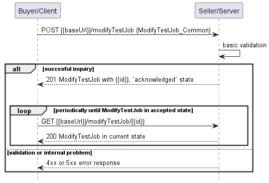

**Figure 27. Modify Test Job progress tracking - Polling**

### 6.9.2. Modify Test Job Request

Figure 28 presents the most important part of the data model used during the
Modify Test Job request `POST /modifyTestJob` and response. The model of the
request message `ModifyTestJob_Common` contains only attributes that can (or
must) be set by the Buyer/Client. The Seller/Server then enriches the entity in
the response with additional information.

Buyer/Client is only allowed to modify Test Jobs that are in `suspended` or
`scheduled` state. The `testJob` section of `ModifyTestJob_Common` is used to
specify which Test Job object is a subject of the modification process
(relationship by reference using `id` of the Job).

The full list of attributes is available in [Section 7](#7-api-details) and in
the API specification which is an integral part of this standard.


**Figure 28. Modify Test Job Key Entities**

To send a Modify Test Job request the Buyer/Client uses the `modifyTestJob`
operation from the API: `POST /modifyTestJob`. Some of the payload's attributes
might be omitted to improve examples' readability.

The example below shows a request to create a modification process for
`TestJob` that was created in section
[6.6.2](#662-create-test-job-request-with-test-profile).

The request below aims to:

- change `testProfile`
- change `endDateTime`
- modify `description` of the Test Job

```json
{
  "testJob": {
    "id": "job-12345",
    "href": "https://serverRoot/mefApi/legato/serviceFunctionTesting/v2/testJob/job-12345"
  },
  "modificationReason": "Change test start time and update test profile.",
  "name": "Updated Ping Test Job",
  "description": "Updated schedule and profile for site-to-site ping test",
  "startDateTime": "2025-06-14T09:00:00Z",
  "endDateTime": "2025-06-14T10:00:00Z",
  "testProfile": {
    "@type": "TestProfileRef",
    "id": "tp-002"
  },
  "relatedServiceFrom": {
    "id": "service-from-001",
    "href": "https://serverRoot/mefApi/legato/services/service-from-001"
  },
  "relatedServiceTo": {
    "id": "service-to-002",
    "href": "https://serverRoot/mefApi/legato/services/service-to-002"
  }
}
```

**[R47]** The Buyer’s Modify Test Job request **MUST** include the Test Job
Identifier. [Mplify 136.1 R58]

**[R48]** The Buyer's Modify Test Job request **MUST** at least one of the
following attributes: [Mplify 136.1 R59]

- `description`
- `endDateTime`
- `name`
- `startDateTime`
- `relatedServiceFrom`
- `relatedServiceTo`
- `testProfile`
- `serviceSpecificTestJobConfiguration`

**[R49]** The Test Job **MUST** be in the `suspended` or `scheduled` state for
a Buyer/Client to modify it. [Mplify 136.1 R60]

### 6.9.3. Modify Test Job Response

Entities used for providing a response to Modify Test Job request are presented
in Figure 27. The Seller/Server responds with a `ModifyTestJob` type, which
adds some attributes (like `id` or `state`) to the `ModifyTestJob_Common` that
was used in the Buyer/Client request.

The following snippet presents the Seller/Server response. It has the same
structure as in the retrieve by identifier operation.

```json
{

{
  "id": "mod-job-12345",
  "href": "https://example.com/api/modifyTestJobs/mod-job-12345",
  "state": "acknowledged",
  "creationDate": "2025-06-13T12:30:00Z",
  "modificationReason": "Change test start time and update test profile.",
  "testJob": {
    "id": "job-12345",
    "href": "https://example.com/api/testJobs/job-12345"
  },
  "name": "Updated Ping Test Job",
  "description": "Updated schedule and profile for site-to-site ping test",
  "startDateTime": "2025-06-14T09:00:00Z",
  "endDateTime": "2025-06-14T10:00:00Z",
  "testProfile": {
    "@type": "TestProfileRef",
    "id": "tp-002"
  },
  "relatedServiceFrom": {
    "id": "service-from-001",
    "href": "https://example.com/api/services/service-from-001"
  },
  "relatedServiceTo": {
    "id": "service-to-002",
    "href": "https://example.com/api/services/service-to-002"
  }
}

```

Attributes that are set by the Seller/Server in the response are marked with
the `<< added by SOF >>` tag.

**[R50]** The Seller/Server's response **MUST** include all and unchanged
attributes' values as provided by Buyer/Client in the request. [Mplify 136.1 R61]

**[R51]** If the request is unsuccessful, the Seller/Server **MUST** return an
error with explanation to the Buyer/Client. [Mplify 136.1 R62]

**[R52]** The Seller/Server **MUST** specify the following attributes in a
response:

- `creationDate`
- `id`
- `href`
- `state`

**[R53]** The `id` **MUST** remain the same value for the life of the Modify
Test Job.

**[R54]** If the Seller/Server encounters errors, they **MUST** return an error
with explanation to the Buyer/Client. [Mplify 136.1 R64]

In case Seller/Server cannot successfully validate the request, Modify Test Job
process fails, which results in setting state to `rejected` with a proper
explanation in `modificationDeniedReason`. This includes situation when:

- `id` does not allow to find a `TestJob` that is to be updated in
  Seller/Server's system
- requested attributes cannot be modified
- Test Job is in the state that does not allow for modification.

### 6.9.4. Modify Test Job State Machine

Figure 29 presents the Modify Test Job state machine:


**Figure 29. Modify Test Job State Machine**

After receiving the request, the Seller/Server (SOF) performs basic checks of
the message. If any problem is found an Error response is provided. If the
validation passes a response is provided with `ModifyTestJob` in `acknowledged`
state and related `TestJob` moves to `assessingModification` state. Next, the
Seller/Server performs all the remaining business and time-consuming
validations. At this point, an Error response cannot be provided anymore, so
`ModifyTestJob` moves to a `rejected` state if some issues are found. The
`modifyTestJob.modificationDeniedReason` acts as a placeholder to provide a
detailed description of what caused the problem. If Modify Test Job request has
been validated and accepted by the Seller/Server, `ModifyTestJob` moves to
`accepted` state and `TestJob` gets updated. After `TestJob` is updated its
state to changes back to `scheduled` or `inProgress`.

Table 11 presents the mapping between the API `state` names and the Mplify 136.1
naming, together with states description. The list of states is the same for
all processes related to Test Job (cancel/modify/resume/suspend).

| state          | Mplify 136.1 name | Description                                                                                                                                                                                                                                                                                                                                                                                                                                           |
| -------------- | --------------- | ----------------------------------------------------------------------------------------------------------------------------------------------------------------------------------------------------------------------------------------------------------------------------------------------------------------------------------------------------------------------------------------------------------------------------------------------------- |
| `accepted`     | ACCEPTED        | The Cancel/Modify/Resume/Suspend Test Job request has been validated and accepted by the Seller/Server.                                                                                                                                                                                                                                                                                                                                               |
| `acknowledged` | ACKNOWLEDGED    | The Cancel/Modify/Resume/Suspend Test Job request has been received by the Seller/Server and has passed basic validation. Test Job Process Identifier is assigned in the Acknowledged state. The request remains in the Acknowledged state until all validations as applicable are completed. If the attributes are validated, the request moves to the Accepted state. If not all attributes are validated, the request moves to the Declined state. |
| `rejected`     | REJECTED        | The Cancel/Modify/Resume/Suspend Test Job request has been rejected by the Seller/Server.                                                                                                                                                                                                                                                                                                                                                             |

**Table 11. Test Job Process State Machine states**

**[R55]** The Seller/Server **MUST** support all Modify Test Job states and
their associated transitions as described in Figure 29 and Table 11.

## 6.11. Use Case 10: Retrieve Modify Test Job List

The Buyer/Client can retrieve a list of Modify Test Job objects by using a
`GET /modifyTestJob` operation with the desired filtering criteria.

**[O8]** The Buyer/Client Retrieve List of Modify Test Jobs request **MAY**
contain none or more of the following attributes:

- `testJobId`
- `state`
- `creationDate.gt`
- `creationDate.lt`

```
https://serverRoot/mefApi/legato/serviceFunctionTesting/v2/modifyTestJob?state=acknowledged&limit=10&offset=0
```

The correct response (HTTP code `200`) in the response body contains a list of
`ModifyTestJob` objects matching the criteria. Details related to pagination
are described in [section 6.2.1](#621-response-pagination).

**[R56]** The Seller **MUST** include the following attributes in the
`ModifyTestJob` object in the response:

- `creationDate`
- `id`
- `href`
- `testJob`
- `state`

**[R57]** In case no items matching the criteria are found, the Seller/Server
**MUST** return a valid response with an empty list.

Figure 30 presents entities related to the use case.


**Figure 30. Use Case 10: Retrieve Modify Test Job List - Model**

## 6.12. Use Case 11: Retrieve Modify Test Job by Identifier

The Buyer/Client can get detailed information about the Modify Test Job from
the Seller/Server by using a `GET /modifyTestJob/{{id}}` operation. The payload
returned in the response is a full representation of the Modify Test Job and
includes all attributes the Buyer/Client has provided while sending a Modify
Test Job create request, together with additional attributes set by
Seller/Server.

Get List and Get by Identifier operations returns the `ModifyTestJob` object. A
response to a Get by Id for a `ModifyTestJob` with `id=mod-job-12345` would
return exactly the same response as presented in
[section 6.9.3](#693-modify-test-job-response).

**[R58]** In case `id` does not allow finding a `ModifyTestJob` in
Seller/Server's system, an error response `Error404` **MUST** be returned.

**[R59]** The Seller/Server **MUST** include following attributes in the
`ModifyTestJob` object in the response:

- `creationDate`
- `id`
- `href`
- `testJob`
- `state`

**[R60]** The Seller **MUST** provide all remaining optional attributes if they
were previously set by the Buyer or the Seller.

## 6.13. Use Case 12: Cancel Test Job

Due to the need for deprovisioning of the Test Job on the SOF side, the cancel
operation associated with the Test Job may exhibit a prolonged duration.
Consequently, this operation is implemented through a separate lifecycle
process.

### 6.13.1. Interaction flow

The flow of this use case is shown in Figure 31.

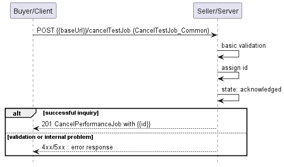

**Figure 31. Use Case 12 - Cancel Test Job create request flow**

The Buyer/Client sends a request with a `CancelTestJob_Common` type in the
body. The Seller/Server performs request validation, assigns an `id`, and
returns the `CancelTestJob` type in the response body, with a `state` set to
`acknowledged`. Further processing is performed by Seller/Server which will in
case of success cancel the Test Job. The Buyer/Client can track the progress of
the process either by subscribing for notifications or by periodically polling
the `CancelTestJob`. The two patterns are presented in the following diagrams.


**Figure 32. Cancel Test Job progress tracking - Notifications**


**Figure 33. Cancel Test Job progress tracking - Polling**

### 6.13.2. Cancel Test Job Request

Figure 34 presents the most important part of the data model used during the
Cancel Test Job request `POST /cancelTestJob` and response. The model of the
request message - `CancelTestJob_Common` contains only attributes that can (or
must) be set by the Buyer/Client. The Seller/Server (SOF) then enriches the
entity in the response with additional information.

The `testJob` section of `CancelTestJob_Common` is used to specify which Test
Job object is a subject of the cancellation process (relationship by reference
using `id` of the Job).

The full list of attributes is available in [Section 7](#7-api-details) and in
the API specification which is an integral part of this standard.

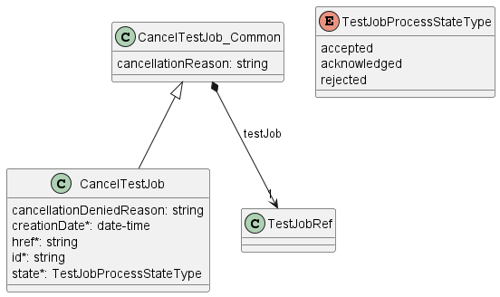

**Figure 34. Cancel Test Job Key Entities**

To send a Cancel Test Job request the Buyer/Client uses the `cancelTestJob`
operation from the API: `POST /cancelTestJob`.

The example below shows a request to create a cancellation process for
`TestJob` that was created in section
[6.6.2](#662-create-test-job-request-with-test-profile).

```json
{
  "cancellationReason": "Cancel Test Job sample",
  "testJob": {
    "href": "https://serverRoot/mefApi/legato/serviceFunctionTesting/v2/testJob/job-12345",
    "id": "job-12345"
  }
}
```

**[R61]** The Buyer’s/Client’s Cancel Test Job request **MUST** include the
following attributes: [Mplify133.1 R57]

- `testJob`

**_Note_** If action arrives when Test Job is running, it is recommended to run
until the end and only afterward action should be applied. [Mplify133.1 O16, O26]

### 6.13.3. Cancel Test Job Response

Entities used for providing a response to Cancel Test Job requests are
presented in Figure 34. The Seller/Server responds with a `CancelTestJob` type,
which adds some attributes (like `id` or `state`) to the `CancelTestJob_Common`
that was used in the Buyer/Client request.

The following snippet presents the Seller/Server response. It has the same
structure as in the retrieve by identifier operation.

```json
{
  "cancellationReason": "Cancel Test Job sample",
  "testJob": {
    "href": "https://serverRoot/mefApi/legato/serviceFunctionTesting/v2/testJob/job-12345",
    "id": "job-12345"
  },
  "creationDate": "204-06-19T12:58:17.088Z", << added by SOF >>
  "href": "https://serverRoot/mefApi/legato/serviceFunctionTesting/v2/CancelTestJob/cancel-job-12345", << added by SOF >>
  "id": "cancel-job-12345", << added by SOF >>
  "state": "acknowledged" << added by SOF >>
}
```

Attributes that are set by the Seller/Server in the response are marked with
the `<< added by SOF >>` tag.

**[R62]** The Seller/Server's response **MUST** include all and unchanged
attributes' values as provided by the Buyer/Client in the request.

**[R63]** The Seller/Server **MUST** specify the following attributes in a
response:

- `creationDate`
- `id`
- `href`
- `state`
- `testJob`

**[R64]** The `id` **MUST** remain the same value for the life of the Cancel
Test Job.

In case Seller/Server cannot successfully validate the request, Cancel Test Job
process fails, which results in setting the state to `rejected` with a proper
explanation in `cancellationDeniedReason`. This includes situation when:

- `id` does not allow to find a `TestJob` that is to be cancelled in
  Seller/Server's system
- Test Job is in a state that does not allow for cancellation.

### 6.13.4. Cancel Test Job State Machine

Figure 35 presents the Cancel Test Job state machine:


**Figure 35. Cancel Test Job State Machine**

After receiving the request, the Seller/Server (SOF) performs basic checks of
the message. If any problem is found an Error response is provided. If the
validation passes a response is provided with `CancelTestJob` in `acknowledged`
state and related `TestJob` moves to `assessingCancelation` state. Next, the
Seller/Server performs all the remaining business and time-consuming
validations. At this point, an Error response cannot be provided anymore, so
the Cancel Test Job moves to a `rejected` state if some issues are found. The
`cancelTestJob.cancelationDeniedReason` acts as a placeholder to provide a
detailed description of what caused the problem. If the Cancel Test Job request
has been validated and accepted by the Seller/Server, `CancelTestJob` moves to
`accepted` state and `TestJob` state is `cancelled`.

Description and mapping of the Cancel Test Job States are the same as in
table 10.

## 6.14. Use Case 13: Retrieve Cancel Test Job List

The Buyer/Client can retrieve a list of Cancel Test Job objects by using a
`GET /cancelTestJob` operation with desired filtering criteria.

**[O9]** The Buyer/Client Retrieve List of Cancel Test Jobs request **MAY**
contain none or more of the following attributes:

- `testJobId`
- `state`
- `creationDate.gt`
- `creationDate.lt`

```
https://serverRoot/mefApi/legato/serviceFunctionTesting/v2/cancelTestJob?state=acknowledged&limit=10&offset=0
```

The example above shows a Buyer/Client's request to get all Cancel Test Job
objects that are in the `acknowledged` state.The correct response (HTTP code
`200`) in the response body contains a list of `CancelTestJob` objects matching
the criteria. Details related to pagination are described in
[section 6.2.1](#621-response-pagination).

**[R65]** The Seller **MUST** include following attributes in the
`CancelTestJob` object in the response:

- `creationDate`
- `id`
- `href`
- `testJob`
- `state`

**[R66]** In case no items matching the criteria are found, the Seller/Server
**MUST** return a valid response with an empty list.

Figure 36 presents entities related to the use case.


**Figure 36. Use Case 13: Retrieve Cancel Test Job List - Model**

## 6.15. Use Case 14: Retrieve Cancel Test Job by Identifier

The Buyer/Client can get detailed information about the Cancel Test Job from
the Seller/Server by using a `GET /cancelTestJob/{{id}}` operation. The payload
returned in the response is a full representation of the Cancel Test Job and
includes all attributes the Buyer/Client has provided while sending a Cancel
Test Job create request, together with additional attributes set by
Seller/Server.

Get List and Get by Identifier operations returns the `CancelTestJob` object. A
response to a Get by Id for a `CancelTestJob` with `id=cancel-job-12345` would
return exactly the same response as presented in
[section 6.13.3](#6133-cancel-test-job-response).

**[R67]** In case `id` does not allow finding a `CancelTestJob` in
Seller/Server's system, an error response `Error404` **MUST** be returned.

**[R68]** The Seller/Server **MUST** include following attributes in the
`CancelTestJob` object in the response:

- `creationDate`
- `id`
- `href`
- `testJob`
- `state`

**[R69]** The Seller **MUST** provide all remaining optional attributes if they
were previously set by the Buyer or the Seller.

## 6.16. Use Case 15: Suspend Test Job

Due to the need to release resources on the SOF side, the suspend operation
associated with the Test Job may exhibit a prolonged duration. Consequently,
this operation is implemented through a separate lifecycle process.

When the Test Job is suspended, it does not perform any tests nor collects test
results.

### 6.16.1. Interaction flow

The flow of this use case is shown in Figure 37.


**Figure 37. Use Case 15 - Suspend Test Job create request flow**

The Buyer/Client sends a request with a `SuspendTestJob_Common` type in the
body. The Seller/Server performs request validation, assigns an `id`, and
returns the `SuspendTestJob` type in the response body, with a `state` set to
`acknowledged`. Further processing is performed by Seller/Server which will in
case of success suspends the Test Job. The Buyer/Client can track the progress
of the process either by subscribing for notifications or by periodically
polling the `SuspendTestJob`. The two patterns are presented in the following
diagrams.


**Figure 38. Suspend Test Job progress tracking - Notifications**


**Figure 39. Suspend Test Job progress tracking - Polling**

**_Note_**: The Suspend Test Job process is altering the state of the job
itself. It is important to note that notifications resulting from changes in
the state of the Test Job are not represented in Figures 37 and 38.

### 6.16.2. Suspend Test Job Request

Figure 40 presents the most important part of the data model used during the
Suspend Test Job request (`POST /suspendTestJob`) and response. The model of
the request message - `SuspendTestJob_Common` contains only attributes that can
(or must) be set by the Buyer/Client. The Seller/Server (SOF) then enriches the
entity in the response with additional information.

The `testJob` section of `SuspendTestJob_Common` is used to specify which Test
Job object is a subject of the suspension process (relationship by reference
using `id` of the Job).

The full list of attributes is available in [Section 7](#7-api-details) and in
the API specification which is an integral part of this standard.

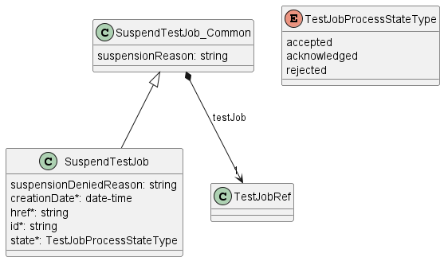

**Figure 40. Suspend Test Job Key Entities**

To send a Suspend Test Job request the Buyer/Client uses the `suspendTestJob`
operation from the API: `POST /suspendTestJob`.

The example below shows a request to create a suspension process for `TestJob`
that was created in section
[6.6.2](#662-create-test-job-request-with-test-profile).

```json
{
  "testJob": {
    "href": "https://serverRoot/mefApi/legato/serviceFunctionTesting/v2/testJob/job-12345",
    "id": "job-12345"
  },
  "suspensionReason": "Suspend Test Job sample"
}
```

**[R70]** The Buyer/Client Suspend Test Job request **MUST** include the
following attributes: [Mplify 136.1 R40]

- `testJob`

**[R71]** The Test Job **MUST** be in the `inProgress` state to be suspended.
[Mplify 136.1 R41]

**[O10]** In case the Test Job is running e.g., once a day for a short period
of time, it may be difficult to change its state. If action arrives when Test
Job is running, it is recommended to run until the end and only afterwards
action should be applied.

### 6.16.3. Suspend Test Job Response

Entities used for providing a response to Suspend Test Job requests are
presented in Figure 40. The Seller/Server responds with a `SuspendTestJob`
type, which adds some attributes (like `id` or `state`) to the
`SuspendTestJob_Common` that was used in the Buyer/Client request.

The following snippet presents the Seller/Server response. It has the same
structure as in the retrieve by identifier operation.

```json
{
  "testJob": {
    "href": "https://serverRoot/mefApi/legato/serviceFunctionTesting/v2/testJob/job-12345",
    "id": "job-12345"
  },
  "suspensionReason": "Suspend Test Job sample",
  "creationDate": "204-06-19T12:58:17.088Z", << added by SOF >>
  "href": "https://serverRoot/mefApi/legato/serviceFunctionTesting/v2/suspendTestJob/suspend-job-12345", << added by SOF >>
  "id": "suspend-job-12345", << added by SOF >>
  "state": "acknowledged" << added by SOF >>
}
```

Attributes that are set by the Seller/Server in the response are marked with
the `<< added by SOF >>` tag.

**[R72]** If the request is successful, the Seller/Server **MUST** suspend all
testing and measurements being performed on the Test Job and place the Test Job
in the `suspended` state when they receive a Suspend Test Job request from the
Buyer/Client [Mplify 136.1 R42]

**[R73]** While in the `suspended` state, the Test Job **MUST NOT** perform any
testing or measurements. [Mplify 136.1 R43]

**[R74]** If the request is not successful, the Seller/Server **MUST NOT**
suspend the Test Job [Mplify 136.1 R44]

**[R75]** If the Seller/Server encounters errors, they **MUST** return an error
with explanation to the Buyer/Client [Mplify 136.1 R45]

**[R76]** The Seller/Server's response **MUST** include all and unchanged
attributes' values as provided by the Buyer/Client in the request.

**[R77]** The Seller/Server **MUST** specify the following attributes in a
response:

- `creationDate`
- `id`
- `href`
- `state`
- `testJob`

**[R78]** The `id` **MUST** remain the same value for the life of the Suspend
Test Job.

In case Seller/Server cannot successfully validate the request, Suspend Test
Job process fails, which results in setting the state to `rejected` with a
proper explanation in `suspensionDeniedReason`. This includes situations when:

- `id` does not allow to find a `TestJob` that is to be suspended in
  Seller/Server's system
- Test Job is in a state that does not allow for suspension.

### 6.16.4. Suspend Test Job State Machine

Figure 41 presents the Suspend Test Job state machine:


**Figure 41. Suspend Test Job State Machine**

After receiving the request, the Seller/Server (SOF) performs basic checks of
the message. If any problem is found an Error response is provided. If the
validation passes a response is provided with `SuspendTestJob` in
`acknowledged` state. Next, the Seller/Server performs all the remaining
business and time-consuming validations. At this point, an Error response
cannot be provided anymore, so the Suspend Test Job moves to a `rejected` state
if some issues are found. The `suspendTestJob.suspensionDeniedReason` acts as a
placeholder to provide a detailed description of what caused the problem. If
the Suspend Test Job request has been validated and accepted by the
Seller/Server, `SuspendTestJob` moves to `accepted` state and `TestJob` state
is `suspended`.

Description and mapping of the Suspend Test Job States are the same as in
table 10.

## 6.17. Use Case 16: Retrieve Suspend Test Job List

The Buyer/Client can retrieve a list of Suspend Test Job objects by using a
`GET /suspendTestJob` operation with desired filtering criteria.

**[O11]** The Buyer/Client Retrieve List of Suspend Test Jobs request **MAY**
contain none or more of the following attributes:

- `testJobId`
- `state`
- `creationDate.gt`
- `creationDate.lt`

```
https://serverRoot/mefApi/legato/serviceFunctionTesting/v2/suspendTestJob?state=acknowledged&limit=10&offset=0
```

The example above shows a Buyer/Client's request to get all Suspend Test Job
objects that are in the `acknowledged` state. The correct response (HTTP code
`200`) in the response body contains a list of `SuspendTestJob` objects
matching the criteria. Details related to pagination are described in
[section 6.2.1](#621-response-pagination).

**[R79]** The Seller **MUST** include following attributes in the
`SuspendTestJob` object in the response:

- `creationDate`
- `id`
- `href`
- `state`
- `testJob`

**[R80]** In case no items matching the criteria are found, the Seller/Server
**MUST** return a valid response with an empty list.

Figure 42 presents entities related to the use case.


**Figure 42. Use Case 16: Retrieve Suspend Test Job List - Model**

## 6.18. Use Case 17: Retrieve Suspend Test Job by Identifier

The Buyer/Client can get detailed information about the Suspend Test Job from
the Seller/Server by using a `GET /suspendTestJob/{{id}}` operation. The
payload returned in the response is a full representation of Suspend Test Job
and includes all attributes the Buyer/Client has provided while sending a
Suspend Test Job create request, together with additional attributes set by
Seller/Server.

Get List and Get by Identifier operations returns the `SuspendTestJob` object.
A response to a Get by Identifier for a `SuspendTestJob` with
`id=suspend-job-12345` would return exactly the same response as presented in
[section 6.16.3](#6163-suspend-test-job-response).

**[R81]** In case `id` does not allow finding a `SuspendTestJob` in
Seller/Server's system, an error response `Error404` **MUST** be returned.

**[R82]** The Seller/Server **MUST** include following attributes in the
`SuspendTestJob` object in the response:

- `creationDate`
- `id`
- `href`
- `state`
- `testJob`

**[R83]** The Seller **MUST** provide all remaining optional attributes if they
were previously set by the Buyer or the Seller.

## 6.19. Use Case 18: Resume Test Job

Due to the need for reserving resources on the SOF side, the resume operation
associated with Test Job may exhibit prolonged duration. Consequently, this
operation is implemented through a separate lifecycle process.

### 6.19.1. Interaction flow

The flow of this use case is shown in Figure 43.


**Figure 43. Use Case 18 - Resume Test Job create request flow**

The Buyer/Client sends a request with a `ResumeTestJob_Common` type in the
body. The Seller/Server performs request validation, assigns an `id`, and
returns the `ResumeTestJob` type in the response body, with a `state` set to
`acknowledged`. Further processing is performed by Seller/Server which will in
case of success resume the Test Job. The Buyer/Client can track the progress of
the process either by subscribing for notifications or by periodically polling
the `ResumeTestJob`. The two patterns are presented in the following diagrams.


**Figure 44. Resume Test Job progress tracking - Notifications**


**Figure 45. Resume Test Job progress tracking - Polling**

### 6.19.2. Resume Test Job Request

Figure 46 presents the most important part of the data model used during the
Resume Test Job request (`POST /resumeTestJob`) and response. The model of the
request message - `ResumeTestJob_Common` contains only attributes that can (or
must) be set by the Buyer/Client. The Seller/Server then enriches the entity in
the response with additional information.

The `testJob` section of `ResumeTestJob_Common` is used to specify which Test
Job object is a subject of the resume process (relationship by reference using
the `id` of the Job).

The full list of attributes is available in [Section 7](#7-api-details) and in
the API specification which is an integral part of this standard.


**Figure 46. Resume Test Job Key Entities**

To send a Resume Test Job request the Buyer/Client uses the `resumeTestJob`
operation from the API: `POST /resumeTestJob`.

The example below shows a request to create a resumption process for `TestJob`
that was created in section
[6.6.2](#662-create-test-job-request-with-test-profile).

```json
{
  "testJob": {
    "href": "https://serverRoot/mefApi/legato/serviceFunctionTesting/v2/testJob/job-12345",
    "id": "job-12345"
  },
  "resumptionReason": "Resume Test Job sample"
}
```

**[R84]** The Buyer/Client Resume Test Job request **MUST** include the
following attributes: [Mplify 136.1 R46]

- `testJob`

**[R85]** The Test Job **MUST** be in the `suspended` state in order to be
resumed. [Mplify 136.1 R47]

### 6.19.3. Resume Test Job Response

Entities used for providing a response to Resume Test Job requests are
presented in Figure 46. The Seller/Server responds with a `ResumeTestJob` type,
which adds some attributes (like `id` or `state`) to the `ResumeTestJob_Common`
that was used in the Buyer/Client request.

The following snippet presents the Seller/Server response. It has the same
structure as in the retrieve by identifier operation.

```json
{
  "testJob": {
    "href": "https://serverRoot/mefApi/legato/serviceFunctionTesting/v2/testJob/job-12345",
    "id": "job-12345"
  },
  "resumptionReason": "Resume Test Job sample",
  "creationDate": "204-06-19T12:58:17.088Z", << added by SOF >>
  "href": "https://serverRoot/mefApi/legato/serviceFunctionTesting/v2/resumeTestJob/resume-job-12345", << added by SOF >>
  "id": "resume-job-12345", << added by SOF >>
  "state": "acknowledged" << added by SOF >>
}
```

Attributes that are set by the Seller/Server in the response are marked with
the `<< added by SOF >>` tag.

**[R86]** If the request is successful, the Seller/Server **MUST** resume all
testing and measurement being performed on the Test Job and place the Test Job
in the `inProgress` state when they receive a Resume Test Job request from the
Buyer/Client [Mplify 136.1 R48]

**[R87]** If the request is not successful, the Seller/Server **MUST NOT**
resume the Test Job, and the Test Job remains in the `suspended` state.
[Mplify 136.1 R49]

**[R88]** If the Seller/Server encounters errors, they **MUST** return an error
with explanation to the Buyer/Client. [Mplify 136.1 R50]

**[R89]** The Seller/Server's response **MUST** include all and unchanged
attributes' values as provided by the Buyer/Client in the request.

**[R90]** The Seller/Server **MUST** specify the following attributes in a
response:

- `creationDate`
- `id`
- `href`
- `state`
- `testJob`

**[R91]** The `id` **MUST** remain the same value for the life of the Test Job.

In case the Seller/Server cannot successfully validate the request, the Resume
Test Job process fails, which results in setting the state to `rejected` with a
proper explanation in `resumptionDeniedReason`. This includes situations when:

- `id` does not allow to find a `TestJob` that is to be resumed in
  Seller/Server's system
- Test Job is in a state that does not allow for resumption.

### 6.19.4. Resume Test Job State Machine

Figure 47 presents the Resume Test Job state machine:


**Figure 47. Resume Test Job State Machine**

After receiving the request, the Seller/Server (SOF) performs basic checks of
the message. If any problem is found an Error response is provided. If the
validation passes a response is provided with `ResumeTestJob` in `acknowledged`
state. Next, the Seller/Server performs all the remaining business and
time-consuming validations. At this point, an Error response cannot be provided
anymore, so the Resume Test Job moves to a `rejected` state if some issues are
found. The `resumeTestJob.resumptionDeniedReason` acts as a placeholder to
provide a detailed description of what caused the problem. If the Resume Test
Job request has been validated and accepted by the Seller/Server,
`ResumeTestJob` moves to `accepted` state and `TestJob` state is `inProgress`.

Description and mapping of the Resume Test Job States are the same as in
table 10.

## 6.20. Use Case 19: Retrieve Resume Test Job List

The Buyer/Client can retrieve a list of Resume Test Job objects by using a
`GET /resumeTestJob` operation with desired filtering criteria.

**[O12]** The Buyer/Client Retrieve List of Resume Test Jobs request **MAY**
contain none or more of the following attributes:

- `testJobId`
- `state`
- `creationDate.gt`
- `creationDate.lt`

```
https://serverRoot/mefApi/legato/serviceFunctionTesting/v2/resumeTestJob?state=acknowledged&limit=10&offset=0
```

The example above shows a Buyer/Client's request to get all Resume Test Job
objects that are in the `acknowledged` state. The correct response (HTTP code
`200`) in the response body contains a list of `ResumeTestJob` objects matching
the criteria. Details related to pagination are described in
[section 6.2.1](#621-response-pagination).

**[R92]** The Seller **MUST** include following attributes in the
`ResumeTestJob` object in the response:

- `creationDate`
- `id`
- `href`
- `testJob`
- `state`

**[R93]** In case no items matching the criteria are found, the Seller/Server
**MUST** return a valid response with an empty list.

Figure 48 presents entities related to the use case.


**Figure 48. Use Case 19: Retrieve Resume Test Job List - Model**

## 6.21. Use Case 20: Retrieve Resume Test Job by Identifier

The Buyer/Client can get detailed information about the Resume Test Job from
the Seller/Server by using a `GET /resumeTestJob/{{id}}` operation. The payload
returned in the response is a full representation of the Resume Test Job and
includes all attributes the Buyer/Client has provided while sending a Resume
Test Job create request, together with additional attributes set by
Seller/Server.

Get List and Get by Identifier operations returns the `ResumeTestJob` object. A
response to a Get by Identifier for a `ResumeTestJob` with
`id=resume-job-12345` would return exactly the same response as presented in
[section 6.19.3](#6193-resume-test-job-response).

**[R94]** In case `id` does not allow finding a `ResumeTestJob` in
Seller/Server's system, an error response `Error404` **MUST** be returned.

**[R95]** The Seller/Server **MUST** include following attributes in the
`ResumeTestJob` object in the response:

- `creationDate`
- `id`
- `href`
- `testJob`
- `state`

**[R96]** The Seller **MUST** provide all remaining optional attributes if they
were previously set by the Buyer or the Seller.

## 6.22. Use Case 21: Retrieve Test Result List

The BuyeResultlient can retrieve a list of `TestResult_Common` by using a
`GET /testResult` operation with desired filtering criteria.

**[O13]** The Buyer/ClientResultRetrieve Test Result List request **MAY**
contain none or more of the following filter criteria:

- `testJobId`
- `relatedServiceIdFrom`
- `relatedServiceIdTo`
- `relatedServiceSpecificationId`
- `relatedContactInformationName`
- `startDateTime.gt`
- `startDateTime.lt`
- `endDateTime.gt`
- `endDateTime.lt`

[Mplify 136.1 O5]

```
https://serverRoot/mefApi/legato/serviceFunctionTesting/v2/testResult?relatedServiceIdFrom=service-from-001&limit=10&offset=0
```

The example above shows a Buyer/Client's request to get all Test Result objects
that have `relatedServiceIdFrom` equal `service-from-001`. The correct response
(HTTP code `200`) in the response body contains a list of `TestResult_Common`
objects matching the criteria. To get all the details, the Buyer/Client has to
query a specific `TestJob` by its `id`. Details related to pagination are
described in [section 6.2.1](#621-response-pagination)

**[R97]** If successful, the Seller/Server **MUST** return a list
`TestResult_Common` objects that match the selected filter criteria. [Mplify 136.1
R38]

**[R98]** If successful but no matches to the filter criteria are found, the
Seller/Server **MUST** return an empty list

**[R99]** If errors are encountered, the Seller/Server **MUST** return an error
with explanation to the Buyer/Client. [Mplify 136.1 R39]

Figure 49 presents entities related to the use case.


**Figure 49. Use Case 21: Retrieve Test Result List - Model**

## 6.23. Use Case 22: Retrieve Test Result by Test Result Identifier

The Buyer/Client can get detailed information about the Test Result from the
Seller/Server by using a `GET /testResult/{{id}}` operation. The payload
returned in the response is a full representation of the Test Result and
includes all attributes, together with Test Result attributes set by
Seller/Server.

Get List and Get by Identifier operations return different representations of
Test Job. Get List returns the `TestResult_Common` object.

The following snippet presents the Seller/Server `TestResult` response.

**Test Result Response**

```json
{
  "id": "testresult-001",
  "href": "https://serverRoot/mefApi/legato/testResults/testresult-001",
  "actualStartDateTime": "2025-06-12T08:00:00Z",
  "actualEndDateTime": "2025-06-12T08:05:00Z",
  "relatedServiceFrom": {
    "id": "service-from-001",
    "href": "https://serverRoot/mefApi/legato/services/service-from-001"
  },
  "relatedServiceTo": {
    "id": "service-to-002",
    "href": "https://serverRoot/mefApi/legato/services/service-to-002"
  },
  "testJob": {
    "id": "job-12345",
    "href": "serverRoot/serviceFunctionTesting/v2/testJob/job-12345"
  },
  "serviceSpecificTestResultConfguration": {
    "@type": "urn:mef:lso:spec:legato:ping-report:v0.0.1:all",
    "interface": {
      "name": "SiteA-Port1",
      "description": "Test port at Site A",
      "cloudService": false,
      "ipvcEndpoint": ["endpoint-001"]
    },
    "vlan": 100,
    "startTime": "2025-06-12T08:00:00Z",
    "endTime": "2025-06-12T08:05:00Z",
    "protocol": "IPV4",
    "numberOfTxPackets": 100,
    "numberOfRxPackets": 98,
    "minimumRoundTripDelay": {
      "amount": 2,
      "units": "ms"
    },
    "averageRoundTripDelay": {
      "amount": 4,
      "units": "ms"
    },
    "maximumRoundTripDelay": {
      "amount": 10,
      "units": "ms"
    },
    "countOfLostPackets": 2,
    "percentageOfLostPackets": 2.0
  }
}
```

**[R100]** The Buyer/Client’s Retrieve Test Result by Identifier request
**MUST** include the Test Result Identifier and only the Test Result
Identifier. [Mplify 136.1 R40]

**[R101]** If successful, the Seller/Server **MUST** include all `TestResult`
attributes in their response. [Mplify 136.1 R41]

**[R102]** If errors are encountered, the Seller/Server **MUST** return an
error with explanation to the Buyer/Client. [Mplify 136.1 R42]

**[R103]** In case `id` does not allow finding a `TestResult` in
Seller/Server's system, an error response `Error404` **MUST** be returned.

## 6.24. Use Case 23: Register for Notifications

The Buyer/Client can track the lifecycle of the SFT objects by subscribing to
notifications. An exemplary use case for exchanging notifications is presented
in Figure 50.


**Figure 50. Testing Notification Example**

The Seller/Server communicates with the Buyer/Client with Notifications
provided that:

- Buyer/Client supports a notification mechanism
- Buyer/Client has registered to receive notifications from the Seller/Server

To register for notifications the Buyer/Client uses the `registerListener`
operation from the API: `POST /hub`. The request contains only 2 attributes:

- `callback` - mandatory, to provide the callback address the events will be
  notified to,
- `query` - optional, to provide the required types of event.

Figure 51 shows all entities involved in the Notification use cases.


**Figure 51. Service Function Testing Notification Data Model**

By using a request in the following snippet, the Buyer/Client subscribes for
notification of all types of events. Those are:

- `testJobCreateEvent`
- `testJobAttributeValueChangeEvent`
- `testJobStateChangeEvent`
- `cancelTestJobStateChangeEvent`
- `modifyTestJobStateChangeEvent`
- `suspendTestJobStateChangeEvent`
- `resumeTestJobStateChangeEvent`
- `testProfileCreateEvent`
- `testProfileAttributeValueChangeEvent`
- `testProfileLifecycleStateChangeEvent`
- `testProfileDeleteEvent`
- `testResultCreateEvent`

```json
{
  "callback": "https://client.mef.com/listenerEndpoint"
}
```

**[O14]** The Seller/Server **MAY** support subscription to Test Job
Notifications Use Case.

**[O15]** The Buyer/Client **MAY** support subscription to Test Profile
Notifications Use Case.

**[O16]** The Buyer/Client **MAY** support subscription to Test Result
Notifications Use Case.

If the Buyer/Client wishes to receive only notifications of a certain type, a
`query` must be added:

```json
{
  "callback": "https://client.mef.com/listenerEndpoint",
  "query": "eventType=testJobStateChangeEvent"
}
```

**[R104]** The Buyer/Client’s Subscribe to Test Job Notifications request
**MUST** include: [Mplify 136.1 R82]

- Callback address
- Zero or more notification types

If the Buyer/Client wishes to subscribe to 2 different types of events, there
are 2 possible syntax variants [[TMF630](#8-references)]:

```
eventType=testJobStateChangeEvent,testJobAttributeValueChangeEvent
```

or

```
eventType=testJobStateChangeEvent&eventType=testJobAttributeValueChangeEvent
```

The `query` formatting complies with RFC3986 [RFC3986](#8-references).
According to it, every attribute defined in the Event model (from notification
API) can be used in the `query`. However, this standard requires only
`eventType` attribute to be supported.

The Seller/Server responds to the subscription request by adding the `id` of
the subscription to the message that must be further used for unsubscribing.

```json
{
  "id": "sub-001",
  "callback": "https://client.mef.com/listenerEndpoint",
  "query": "eventType=testJobStateChangeEvent"
}
```

Example of a final address that the Notifications will be sent to (for
`testJobStateChangeEvent`):

- `https://client.mef.com/listenerEndpoint/mefApi/legato/serviceFunctionTestingNotification/v2/listener/testJobStateChangeEvent`

**[R105]** If successful, the Seller/Server response **MUST** indicate success
and include the Register Notification Identifier and echo back all Buyer/Client
provided attributes [Mplify 136.1 R83]

**[R106]** If successful, the Seller/Server **MUST** begin sending the
appropriate notifications to the Buyer/Client. [Mplify 136.1 R84]

**[R107]** The Seller/Server **MUST NOT** send notifications if the
Buyer/Client has not registered for them. [Mplify 136.1 R85]

**[R108]** If unsuccessful, the Seller/Server **MUST NOT** return a Register
Notification Identifier. [Mplify 136.1 R86]

**[R109]** If the Seller/Server experiences any errors, they **MUST** return an
error indication to the Buyer/Client. [Mplify 136.1 R87]

## 6.25. Use Case 24: Send Notification

Notifications are used to asynchronously inform the Buyer/Client about the
respective objects and attributes changes.

Figure 52 presents notifications produced by Seller/Server for the whole
lifecycle of `TestJob` assuming that Buyer/Client subscribed to all event
types.

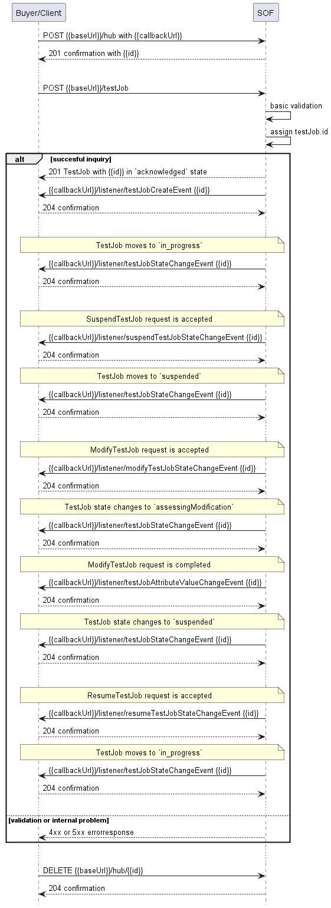

**Figure 52. Test Job lifecycle with all Notifications**

After a successful notification subscription, the Seller/Server sends a
`TestJob` create request. The SOF performs basic validation of the request, and
if it passes, responds with the `TestJob` in the `acknowledged` state. The
creation of the `TestJob` is then notified via a `testJobCreateEvent`.

Subsequently, the Seller/Server carries out additional business and
time-consuming validations. If these validations are successful, the `TestJob`
transitions to the `inProgress` state, and a corresponding
`testJobStateChangeEvent` is triggered.

During the lifecycle of the Test Job, the following actions and corresponding
notifications may occur:

- Suspension: When a suspend request is accepted, a
  `suspendTestJobStateChangeEvent` is sent, followed by a
  `testJobStateChangeEvent` indicating the `suspended` state.

- Modification: When a modify request is accepted, a
  `modifyTestJobStateChangeEvent` is sent, followed by a
  `testJobStateChangeEvent` indicating the `assesing_modification` state. If
  attribute values are updated as a result, a
  `testJobAttributeValueChangeEvent` is issued. Once the modification is
  complete, the `TestJob` typically returns to the `suspended` state with a
  `testJobStateChangeEvent`.

- Resumption: When a resume request is accepted, a
  `resumeTestJobStateChangeEvent` is sent. The `TestJob` then moves back to
  `inProgress`, and a `testJobStateChangeEvent` is sent.

These notifications provide the Buyer/Client with real-time visibility into the
state transitions and modifications of a `TestJob`.

The following snippets present an example of `testJobCreateEvent` and
`testJobStateChangeEvent`.

```json
{
  "eventId": "evt-001",
  "eventTime": "2025-06-13T14:45:00Z",
  "eventType": "testJobCreateEvent",
  "event": {
    "id": "job-12345",
    "href": "serverRoot/serviceFunctionTesting/v2/testJob/job-12345"
  }
}
```

```json
{
  "eventId": "event-002",
  "eventType": "testJobStateChangeEvent",
  "eventTime": "204-01-15T20:45:24.796Z",
  "event": {
    "id": "job-12345",
    "href": "serverRoot/serviceFunctionTesting/v2/testJob/job-12345"
  }
}
```

**_Note_**: the body of the event carries only the source object's `id`. The
Buyer/Client needs to query it later by `id` to get details.

**_Note:_** The state change notification is sent only when the state attribute
changes its value.

**[R110]** The Seller/Server **MUST** include the following attributes in the
Notification: [Mplify 136.1 R93]

- Event indentifier
- Notification type
- Event time

**[R111]** The Seller/Server **MUST** send Notifications to the Buyer/Client
that have registered for them.

**[R112]** The Seller/Server **MUST NOT** send Notifications to Buyer/Client
that have not registered for them.

## 6.26. Use Case 25: Unregister for Notifications

To stop receiving events, the Buyer/Client has to use the `unregisterListener`
operation from the `DELETE /hub/{id}` endpoint. The `id` is the identifier
received from the Seller/Server during the listener registration.

**[R113]** If successful, the Seller/Server response **MUST** indicate success
[Mplify 136.1 R89]

**[R114]** If successful, the Seller/Server **MUST** stop sending the
appropriate notifications to the Buyer/Client. [Mplify 136.1 R90]

**[R115]** If unsuccessful, the Seller/Server **MUST NOT** stop sending the
appropriate notifications to the Buyer/Client. [Mplify 136.1 R91]

**[R116]** If the Seller/Server experiences any errors, they **MUST** return an
error indication to the Buyer/Client. [Mplify 136.1 R92]

<div class="page"/>

# 7. API Details

## 7.1. API patterns

### 7.2. Indicating errors

Erroneous situations are indicated by appropriate HTTP responses. An error
response is indicated by HTTP status 4xx (for client errors) or 5xx (for server
errors) and appropriate response payload. The Address Validation API uses the
error responses depicted and described below.

Implementations can use http error codes not specified in this standard in
compliance with rules defined in RFC 7231 [[RFC7231](#8-references)]. In such
case the error message body structure might be aligned with the `Error`.

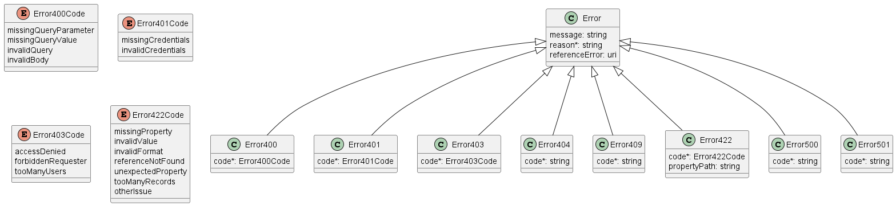

**Figure 53. Data model types to represent an erroneous response**

#### 7.2.1. Type Error

**Description:** Standard Class used to describe API response error Not
intended to be used directly. The `code` in the HTTP header is used as a
discriminator for the type of error returned in runtime.

<table id="T_Error">
    <thead style="font-weight:bold;">
        <tr>
            <td>Name</td>
            <td>Type</td>
            <td>Description</td>
        </tr>
    </thead>
    <tbody>
        <tr>
            <td>message</td>
            <td>string</td>
            <td>Text that provides mode details and corrective actions related to the error. This can be shown to a client user.</td>
        </tr><tr>
            <td>reason*</td>
            <td>string<br/><span style="font-size:10px;font-style:italic">maxLength = 255</span></td>
            <td>Text that explains the reason for the error. This can be shown to a client user.</td>
        </tr><tr>
            <td>referenceError</td>
            <td>uri<br/><span style="font-size:10px;font-style:italic">format = uri</span></td>
            <td>URL pointing to documentation describing the error</td>
        </tr>
    </tbody>
</table>

#### 7.2.2. Type Error400

**Description:** Bad Request.
(https://tools.ietf.org/html/rfc7231#section-6.5.1)

Inherits from:

- <a href="#T_Error">Error</a>

<table id="T_Error400">
    <thead style="font-weight:bold;">
        <tr>
            <td>Name</td>
            <td>Type</td>
            <td>Description</td>
        </tr>
    </thead>
    <tbody>
        <tr>
            <td>code*</td>
            <td><a href="#T_Error400Code">Error400Code</a></td>
            <td>One of the following error codes:
- missingQueryParameter: The URI is missing a required
query-string parameter
- missingQueryValue: The URI is missing a required query-string
parameter value
- invalidQuery: The query section of the URI is invalid.
- invalidBody: The request has an invalid body
</td>
        </tr>
    </tbody>
</table>

#### 7.2.3. `enum` Error400Code

**Description:** One of the following error codes:

- missingQueryParameter: The URI is missing a required query-string parameter
- missingQueryValue: The URI is missing a required query-string parameter value
- invalidQuery: The query section of the URI is invalid.
- invalidBody: The request has an invalid body

<table id="T_Error400Code">
    <thead style="font-weight:bold;">
        <tr>
            <td>Value</td>
            <td>Mplify 136.1</td>
        </tr>
    </thead>
    <tbody>
        <tr>
            <td>missingQueryParameter</td>
            <td>MISSING_QUERY_PARAMETER</td>
        </tr><tr>
            <td>missingQueryValue</td>
            <td>MISSING_QUERY_VALUE</td>
        </tr><tr>
            <td>invalidQuery</td>
            <td>INVALID_QUERY</td>
        </tr><tr>
            <td>invalidBody</td>
            <td>INVALID_BODY</td>
        </tr>
    </tbody>
</table>

#### 7.2.4. Type Error401

**Description:** Unauthorized.
(https://tools.ietf.org/html/rfc7235#section-3.1)

Inherits from:

- <a href="#T_Error">Error</a>

<table id="T_Error401">
    <thead style="font-weight:bold;">
        <tr>
            <td>Name</td>
            <td>Type</td>
            <td>Description</td>
        </tr>
    </thead>
    <tbody>
        <tr>
            <td>code*</td>
            <td><a href="#T_Error401Code">Error401Code</a></td>
            <td>One of the following error codes:
- missingCredentials: No credentials provided.
- invalidCredentials: Provided credentials are invalid or
expired
</td>
        </tr>
    </tbody>
</table>

#### 7.2.5. `enum` Error401Code

**Description:** One of the following error codes:

- missingCredentials: No credentials provided.
- invalidCredentials: Provided credentials are invalid or expired

<table id="T_Error401Code">
    <thead style="font-weight:bold;">
        <tr>
            <td>Value</td>
            <td>Mplify 136.1</td>
        </tr>
    </thead>
    <tbody>
        <tr>
            <td>missingCredentials</td>
            <td>MISSING_CREDENTIALS</td>
        </tr><tr>
            <td>invalidCredentials</td>
            <td>INVALID_CREDENTIALS</td>
        </tr>
    </tbody>
</table>

#### 7.2.6. Type Error403

**Description:** Forbidden. This code indicates that the server understood the
request but refuses to authorize it.
(https://tools.ietf.org/html/rfc7231#section-6.5.3)

Inherits from:

- <a href="#T_Error">Error</a>

<table id="T_Error403">
    <thead style="font-weight:bold;">
        <tr>
            <td>Name</td>
            <td>Type</td>
            <td>Description</td>
        </tr>
    </thead>
    <tbody>
        <tr>
            <td>code*</td>
            <td><a href="#T_Error403Code">Error403Code</a></td>
            <td>This code indicates that the server understood
the request but refuses to authorize it because
of one of the following error codes:
- accessDenied: Access denied
- forbiddenRequester: Forbidden requester
- tooManyUsers: Too many users</td>
        </tr>
    </tbody>
</table>

#### 7.2.7. `enum` Error403Code

**Description:** This code indicates that the server understood the request but
refuses to authorize it because of one of the following error codes:

- accessDenied: Access denied
- forbiddenRequester: Forbidden requester
- tooManyUsers: Too many users

<table id="T_Error403Code">
    <thead style="font-weight:bold;">
        <tr>
            <td>Value</td>
            <td>Mplify 136.1</td>
        </tr>
    </thead>
    <tbody>
        <tr>
            <td>accessDenied</td>
            <td>ACCESS_DENIED</td>
        </tr><tr>
            <td>forbiddenRequester</td>
            <td>FORBIDDEN_REQUESTER</td>
        </tr><tr>
            <td>tooManyUsers</td>
            <td>TOO_MANY_USERS</td>
        </tr>
    </tbody>
</table>

#### 7.2.8. Type Error404

**Description:** Resource for the requested path not found.
(https://tools.ietf.org/html/rfc7231#section-6.5.4)

Inherits from:

- <a href="#T_Error">Error</a>

<table id="T_Error404">
    <thead style="font-weight:bold;">
        <tr>
            <td>Name</td>
            <td>Type</td>
            <td>Description</td>
        </tr>
    </thead>
    <tbody>
        <tr>
            <td>code*</td>
            <td>string</td>
            <td>The following error code:
- notFound: A current representation for the target resource
not found
</td>
        </tr>
    </tbody>
</table>

#### 7.2.9. Type Error409

**Description:** Conflict
(https://datatracker.ietf.org/doc/html/rfc7231#section-6.5.8)

Inherits from:

- <a href="#T_Error">Error</a>

<table id="T_Error409">
    <thead style="font-weight:bold;">
        <tr>
            <td>Name</td>
            <td>Type</td>
            <td>Description</td>
        </tr>
    </thead>
    <tbody>
        <tr>
            <td>code*</td>
            <td>string</td>
            <td>The following error code:
- conflict: The client has provided a value whose semantics are
not appropriate for the property.
</td>
        </tr>
    </tbody>
</table>

#### 7.2.10. Type Error422

The response for HTTP status `422` is a list of elements that are structured
using the `Error422` data type. Each list item describes a business validation
problem. This type introduces the `propertyPath` attribute which points to the
erroneous property of the request, so that the Buyer may fix it easier. It is
highly recommended that this property should be used, yet remains optional
because it might be hard to implement.

**Description:** Unprocessable entity due to a business validation problem.
(https://tools.ietf.org/html/rfc4918#section-11.2)

Inherits from:

- <a href="#T_Error">Error</a>

<table id="T_Error422">
    <thead style="font-weight:bold;">
        <tr>
            <td>Name</td>
            <td>Type</td>
            <td>Description</td>
        </tr>
    </thead>
    <tbody>
        <tr>
            <td>code*</td>
            <td><a href="#T_Error422Code">Error422Code</a></td>
            <td>One of the following error codes:
  - missingProperty: The property the Seller has expected is not present in the payload
  - invalidValue: The property has an incorrect value
  - invalidFormat: The property value does not comply with the expected value format
  - referenceNotFound: The object referenced by the property cannot be identified in the Seller system
  - unexpectedProperty: Additional property, not expected by the Seller has been provided
  - tooManyRecords: the number of records to be provided in the response exceeds the Seller&#x27;s threshold.
  - otherIssue: Other problem was identified (detailed information provided in a reason)
</td>
        </tr><tr>
            <td>propertyPath</td>
            <td>string</td>
            <td>A pointer to a particular property of the payload that caused the validation issue. It is highly recommended that this property should be used.
Defined using JavaScript Object Notation (JSON) Pointer (https://tools.ietf.org/html/rfc6901).
</td>
        </tr>
    </tbody>
</table>

#### 7.2.11. `enum` Error422Code

**Description:** One of the following error codes:

- missingProperty: The property the Seller has expected is not present in the
  payload
- invalidValue: The property has an incorrect value
- invalidFormat: The property value does not comply with the expected value
  format
- referenceNotFound: The object referenced by the property cannot be identified
  in the Seller system
- unexpectedProperty: Additional property, not expected by the Seller has been
  provided
- tooManyRecords: the number of records to be provided in the response exceeds
  the Seller's threshold.
- otherIssue: Other problem was identified (detailed information provided in a
  reason)

<table id="T_Error422Code">
    <thead style="font-weight:bold;">
        <tr>
            <td>Value</td>
            <td>Mplify 136.1</td>
        </tr>
    </thead>
    <tbody>
        <tr>
            <td>missingProperty</td>
            <td>MISSING_PROPERTY</td>
        </tr><tr>
            <td>invalidValue</td>
            <td>INVALID_VALUE</td>
        </tr><tr>
            <td>invalidFormat</td>
            <td>INVALID_FORMAT</td>
        </tr><tr>
            <td>referenceNotFound</td>
            <td>REFERENCE_NOT_FOUND</td>
        </tr><tr>
            <td>unexpectedProperty</td>
            <td>UNEXPECTED_PROPERTY</td>
        </tr><tr>
            <td>tooManyRecords</td>
            <td>TOO_MANY_RECORDS</td>
        </tr><tr>
            <td>otherIssue</td>
            <td>OTHER_ISSUE</td>
        </tr>
    </tbody>
</table>

#### 7.2.12. Type Error500

**Description:** Internal Server Error.
(https://tools.ietf.org/html/rfc7231#section-6.6.1)

Inherits from:

- <a href="#T_Error">Error</a>

<table id="T_Error500">
    <thead style="font-weight:bold;">
        <tr>
            <td>Name</td>
            <td>Type</td>
            <td>Description</td>
        </tr>
    </thead>
    <tbody>
        <tr>
            <td>code*</td>
            <td>string</td>
            <td>The following error code:
- internalError: Internal server error - the server encountered
an unexpected condition that prevented it from fulfilling the
request.
</td>
        </tr>
    </tbody>
</table>

#### 7.2.13. Type Error501

**Description:** Not Implemented. Used in case Seller is not supporting an
optional operation (https://tools.ietf.org/html/rfc7231#section-6.6.2)

Inherits from:

- <a href="#T_Error">Error</a>

<table id="T_Error501">
    <thead style="font-weight:bold;">
        <tr>
            <td>Name</td>
            <td>Type</td>
            <td>Description</td>
        </tr>
    </thead>
    <tbody>
        <tr>
            <td>code*</td>
            <td>string</td>
            <td>The following error code:
- notImplemented: Method not supported by the server</td>
        </tr>
    </tbody>
</table>

#### 7.2.14. Type TerminationError

**Description:** This indicates an error that caused an Item to be terminated.
The code and propertyPath should be used like in Error422.

<table id="T_TerminationError">
    <thead style="font-weight:bold;">
        <tr>
            <td>Name</td>
            <td>Type</td>
            <td>Description</td>
        </tr>
    </thead>
    <tbody>
        <tr>
            <td>code</td>
            <td><a href="#T_Error422Code">Error422Code</a></td>
            <td>One of the following error codes:
  - missingProperty: The property the SOF has expected is not present in the payload
  - invalidValue: The property has an incorrect value
  - invalidFormat: The property value does not comply with the expected value format
  - referenceNotFound: The object referenced by the property cannot be identified in the SOF system
  - unexpectedProperty: Additional property, not expected by the SOF has been provided
  - tooManyRecords: the number of records to be provided in the response exceeds the SOF&#x27;s threshold.
  - otherIssue: Other problem was identified (detailed information provided in a reason)
</td>
        </tr><tr>
            <td>propertyPath</td>
            <td>string</td>
            <td>A pointer to a particular property of the payload that caused the validation issue. It is highly recommended that this property should be used.
Defined using JavaScript Object Notation (JSON) Pointer (https://tools.ietf.org/html/rfc6901).
</td>
        </tr><tr>
            <td>value</td>
            <td>string</td>
            <td>Text to describe the reason of the termination.</td>
        </tr>
    </tbody>
</table>

## 7.3. API Data model

### 7.3.1 Test Job

Figure 54 presents the Test Job data model. The data types, requirements
related to them, and mapping to Mplify 136.1 specification are discussed later in
this section.

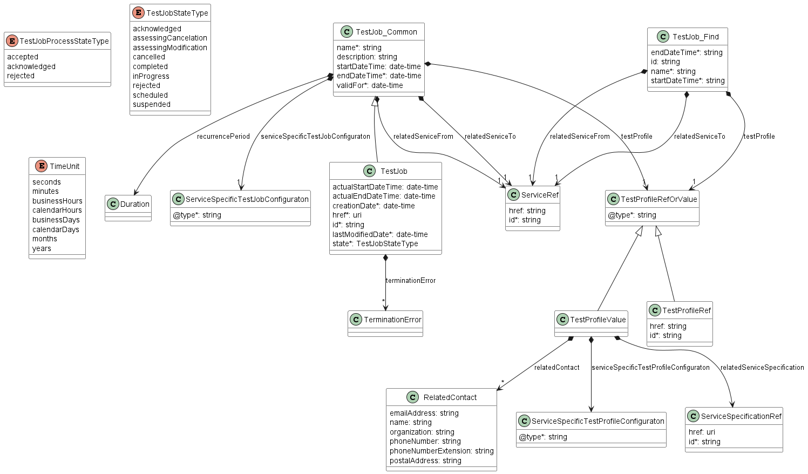

**Figure 54. Test Job Data Model**

#### 7.3.1.1 Type TestJob

**Description:** A definition of Test Job for a specific Service Identifier.

Inherits from:

- <a href="#T_TestJob_Common">TestJob_Common</a>

<table id="T_TestJob" style="width:100%">
    <thead style="font-weight:bold">
        <tr>
            <td>Name</td>
            <td style="width:15%">Type</td>
            <td>M/O</td>
            <td>Description</td>
            <td>Mplify 136.1</td>
        </tr>
    </thead>
    <tbody>
        <tr>
        <td>actualStartDateTime</td>
            <td>date-time<br/><span style="font-size:10px;font-style:italic">format = date-time</span></td>
            <td>O</td>
            <td>The actual start date and time that a Test Job started.</td>
            <td>Actual Start Date Time</td>
        </tr><tr>
        <td>actualEndDateTime</td>
            <td>date-time<br/><span style="font-size:10px;font-style:italic">format = date-time</span></td>
            <td>O</td>
            <td>The actual end date and time of the Test Job.</td>
            <td>Actual End Date Time</td>
        </tr><tr>
        <td>creationDate</td>
            <td>date-time<br/><span style="font-size:10px;font-style:italic">format = date-time</span></td>
            <td>M</td>
            <td>Date when the Test Job was created.</td>
            <td>Creation Date Time</td>
        </tr><tr>
        <td>href</td>
            <td>uri<br/><span style="font-size:10px;font-style:italic">format = uri</span></td>
            <td>M</td>
            <td>Hyperlink reference</td>
            <td></td>
        </tr><tr>
        <td>id</td>
            <td>string</td>
            <td>M</td>
            <td>The identifier of the Test Job.</td>
            <td>Test Job Identifier</td>
        </tr><tr>
        <td>lastModifiedDate</td>
            <td>date-time<br/><span style="font-size:10px;font-style:italic">format = date-time</span></td>
            <td>M</td>
            <td>Date when the job was last modified.</td>
            <td></td>
        </tr><tr>
        <td>state</td>
            <td><a href="#T_TestJobStateType">TestJobStateType</a></td>
            <td>M</td>
            <td></td>
            <td>Test Job State</td>
        </tr><tr>
        <td>terminationError</td>
            <td><a href="#T_TerminationError">TerminationError</a>[]</td>
            <td>O</td>
            <td>When the Seller/Server cannot process the request, the Seller/Server returns a text-based list of reasons here.</td>
            <td></td>
        </tr>
    </tbody>
</table>

#### 7.3.1.2 Type TestJob_Common

**Description:** A definition of Test Job for a specific Service Identifier.

<table id="T_TestJob_Common" style="width:100%">
    <thead style="font-weight:bold">
        <tr>
            <td>Name</td>
            <td style="width:15%">Type</td>
            <td>M/O</td>
            <td>Description</td>
            <td>Mplify 136.1</td>
        </tr>
    </thead>
    <tbody>
        <tr>
        <td>name</td>
            <td>string</td>
            <td>M</td>
            <td>The name of the Test Job.</td>
            <td>Test Job Name</td>
        </tr><tr>
        <td>description</td>
            <td>string</td>
            <td>O</td>
            <td>A description of the Test Job.</td>
            <td>Test Job Description</td>
        </tr><tr>
        <td>startDateTime</td>
            <td>date-time<br/><span style="font-size:10px;font-style:italic">format = date-time</span></td>
            <td>O</td>
            <td>The start date and time of the Test Job. If the Buyer desiresto schedule a test, this is a future date/time. If the Buyer desires an immediate test, this is empty.</td>
            <td>Start Date Time</td>
        </tr><tr>
        <td>endDateTime</td>
            <td>date-time<br/><span style="font-size:10px;font-style:italic">format = date-time</span></td>
            <td>M</td>
            <td>The end date and time of the Test Job.</td>
            <td>End Date Time</td>
        </tr><tr>
        <td>recurrencePeriod</td>
            <td><a href="#T_Duration">Duration</a></td>
            <td>O</td>
            <td></td>
            <td>>Recurrence Period</td>
        </tr><tr>
        <td>testProfile</td>
            <td><a href="#T_TestProfileRefOrValue">TestProfileRefOrValue</a></td>
            <td>M</td>
            <td></td>
            <td></td>
        </tr><tr>
        <td>validFor</td>
            <td>date-time<br/><span style="font-size:10px;font-style:italic">format = date-time</span></td>
            <td>M</td>
            <td>The last date that the Test Job is valid.</td>
            <td>Valid For</td>
        </tr><tr>
        <td>relatedServiceFrom</td>
            <td><a href="#T_ServiceRef">ServiceRef</a></td>
            <td>M</td>
            <td></td>
            <td>Service ID From</td>
        </tr><tr>
        <td>relatedServiceTo</td>
            <td><a href="#T_ServiceRef">ServiceRef</a></td>
            <td>M</td>
            <td></td>
            <td>Service ID To</td>
        </tr><tr>
        <td>serviceSpecificTestJobConfiguration</td>
            <td><a href="#T_ServiceSpecificTestJobConfiguration">ServiceSpecificTestJobConfiguration</a></td>
            <td>M</td>
            <td></td>
            <td>Service Specific Test Job Configuration</td>
        </tr>
    </tbody>
</table>

#### 7.3.1.3 Type TestJob_Find

**Description:** This class represents a single list item for the response of
`listTestJob`

<table id="T_TestJob_Find" style="width:100%">
    <thead style="font-weight:bold">
        <tr>
            <td>Name</td>
            <td style="width:15%">Type</td>
            <td>M/O</td>
            <td>Description</td>
            <td>Mplify 136.1</td>
        </tr>
    </thead>
    <tbody>
        <tr>
        <td>endDateTime</td>
            <td>string</td>
            <td>M</td>
            <td>The end date and time of the Test Job.</td>
            <td>End Date Time</td>
        </tr><tr>
        <td>id</td>
            <td>string</td>
            <td>O</td>
            <td>A unique identifier for the Test Job assigned by the Seller/Server.</td>
            <td>Test Job Identifier</td>
        </tr><tr>
        <td>name</td>
            <td>string</td>
            <td>M</td>
            <td>The name of the Test Job..</td>
            <td>Test Job Name</td>
        </tr><tr>
        <td>relatedServiceFrom</td>
            <td><a href="#T_ServiceRef">ServiceRef</a></td>
            <td>M</td>
            <td></td>
            <td>Service ID From</td>
        </tr><tr>
        <td>relatedServiceTo</td>
            <td><a href="#T_ServiceRef">ServiceRef</a></td>
            <td>M</td>
            <td></td>
            <td>Service ID To</td>
        </tr><tr>
        <td>startDateTime</td>
            <td>string</td>
            <td>M</td>
            <td>The start date and time of the Test Job.</td>
            <td>Start Date Time</td>
        </tr><tr>
        <td>testProfile</td>
            <td><a href="#T_TestProfileRefOrValue">TestProfileRefOrValue</a></td>
            <td>M</td>
            <td></td>
            <td>r</td>
        </tr>
    </tbody>
</table>

#### 7.3.1.4 Type TestJobRef

**Description:** A reference to a Test Job resource

<table id="T_TestJobRef" style="width:100%">
    <thead style="font-weight:bold">
        <tr>
            <td>Name</td>
            <td style="width:15%">Type</td>
            <td>M/O</td>
            <td>Description</td>
            <td>Mplify 136.1</td>
        </tr>
    </thead>
    <tbody>
        <tr>
        <td>href</td>
            <td>string</td>
            <td>O</td>
            <td>Hyperlink to the referenced Test Job</td>
            <td></td>
        </tr><tr>
        <td>id</td>
            <td>string</td>
            <td>M</td>
            <td>Identifier of the referenced Test Job</td>
            <td>Test Job Identifier</td>
        </tr>
    </tbody>
</table>

#### 7.3.1.5 `enum` TestJobStateType

**Description:** The state of the Test Job.

| State                   | Mplify 136.1 name        | Description                                                                                                                                                                                                                                                                                                                                                                                                                                                                                                                                                                                                                                                                                            |
| ----------------------- | ---------------------- | ------------------------------------------------------------------------------------------------------------------------------------------------------------------------------------------------------------------------------------------------------------------------------------------------------------------------------------------------------------------------------------------------------------------------------------------------------------------------------------------------------------------------------------------------------------------------------------------------------------------------------------------------------------------------------------------------------ |
| `acknowledged`          | ACKNOWLEDGED           | The Create Test Job request has been received from the Buyer/Client and the Sell-er/Server has assigned a Test Job Identifier to it. If the request attributes fail validation, the Create Test Job moves to the REJECTED state. If the attributes pass validation, it is then determined if the Create Test Job Start Date Time is immediate or if the Create Test Job Start Date Time indicates that the Test Job is to be scheduled for a later date time. If the Test Job is to be scheduled the Test Job moves to the SCHEDULED state and awaits the scheduled date and time. If the Test Job is to be performed immediately, the Test Job moves to the IN_PROGRESS state and Test Results begin. |
| `assessingCancelation`  | ASSESSING_CANCELLATION | A Cancel Test Job request is received while the Test Job is in the IN_PROGRESS, SUSPENDED or SCHEDULED state. If the Cancel Test Job request is approved, the Test Job moves to the CANCELLED state. If not, the Test Job returns to the IN_PROGRESS, SUSPENDED or SCHEDULED state.                                                                                                                                                                                                                                                                                                                                                                                                                    |
| `assessingModification` | ASSESSING_MODIFICATION | A Modify Test Job request was received while the Test Job is in the SUSPENDED or SCHEDULED state. If the Modify Test Job is accepted, the Test Job is updated. If the Modify Test Job is declined, the Test Job is not updated and returns to the SUSPENDED or SCHEDULED state.                                                                                                                                                                                                                                                                                                                                                                                                                        |
| `cancelled`             | CANCELLED              | A Cancel Test Job request is received from the Buyer/Client. If the request is accepted, the Test Job moves to the CANCELLED state. The Test Job must be in the IN_PROGRESS, SCHEDULED, or SUSPENDED, state.                                                                                                                                                                                                                                                                                                                                                                                                                                                                                           |
| `completed`             | COMPLETED              | The Test Job has reached the End Date Time or has completed all Test Measurements and provided Test Results.                                                                                                                                                                                                                                                                                                                                                                                                                                                                                                                                                                                           |
| `inProgress`            | IN_PROGRESS            | Whether an immediate request or a scheduled request, the Test Job moves to the IN_PROGRESS state when it begins performing Test Results. If a Cancel Test Job request is received and accepted, the Test Job moves to the CANCELLED state. If the Cancel Test Job request is declined, the Test Job returns to the IN_PROGRESS state and continues Test Results until they are completed. If a Suspend Test Job request is received, the Test Job moves to the SUSPENDED state.                                                                                                                                                                                                                        |
| `rejected`              | REJECTED               | The Create Test Job request fails validation and is rejected.                                                                                                                                                                                                                                                                                                                                                                                                                                                                                                                                                                                                                                          |
| `scheduled`             | SCHEDULED              | The Test Job is scheduled to start at a later time. The Test Job stays in the SCHEDULED state until the Start Date and Time is reached. The Test Job moves to IN_PROGRESS when the Start Date and Time is reached. A Test Job with the state SCHEDULED can be moved to the SUSPENDED or CANCELLED state.                                                                                                                                                                                                                                                                                                                                                                                               |
| `suspended`             | SUSPENDED              | A Test Job in the IN_PROGRESS or SCHEDULED state receives a Suspend Test Job request. The Test Job moves to the SUSPENDED state.                                                                                                                                                                                                                                                                                                                                                                                                                                                                                                                                                                       |

<table id="T_TestJobStateType">
    <thead style="font-weight:bold;">
        <tr>
            <td>Value</td>
            <td>Mplify 136.1</td>
        </tr>
    </thead>
    <tbody>
        <tr>
            <td>acknowledged</td>
            <td>ACKNOWLEDGED</td>
        </tr><tr>
            <td>assessingCancelation</td>
            <td>ASSESSING_CANCELATION</td>
        </tr><tr>
            <td>assessingModification</td>
            <td>ASSESSING_MODIFICATION</td>
        </tr><tr>
            <td>cancelled</td>
            <td>CANCELLED</td>
        </tr><tr>
            <td>completed</td>
            <td>COMPLETED</td>
        </tr><tr>
            <td>inProgress</td>
            <td>IN_PROGRESS</td>
        </tr><tr>
            <td>rejected</td>
            <td>REJECTED</td>
        </tr><tr>
            <td>scheduled</td>
            <td>SCHEDULED</td>
        </tr><tr>
            <td>suspended</td>
            <td>SUSPENDED</td>
        </tr>
    </tbody>
</table>

#### 7.3.1.6 Type ServiceSpecificTestJobConfiguration

**Description:** ServiceSpecificTestJobConfiguration is used as an extension
point for schema to be used that defines the Test Measure attributes. The
`@type` attribute is used as a discriminator.

<table id="T_ServiceSpecificTestJobConfiguration" style="width:100%">
    <thead style="font-weight:bold">
        <tr>
            <td>Name</td>
            <td style="width:15%">Type</td>
            <td>M/O</td>
            <td>Description</td>
            <td>Mplify 136.1</td>
        </tr>
    </thead>
    <tbody>
        <tr>
        <td>@type</td>
            <td>string</td>
            <td>M</td>
            <td>The named type must be a subclass of ServiceSpecificTestJobConfiguration.</td>
            <td></td>
        </tr>
    </tbody>
</table>

#### 7.3.1.7 Type RelatedContact

**Description:**

<table id="T_RelatedContact" style="width:100%">
    <thead style="font-weight:bold">
        <tr>
            <td>Name</td>
            <td style="width:15%">Type</td>
            <td>M/O</td>
            <td>Description</td>
            <td>Mplify 136.1</td>
        </tr>
    </thead>
    <tbody>
        <tr>
        <td>emailAddress</td>
            <td>string</td>
            <td>O</td>
            <td>The email address for this contact.</td>
            <td>Contact Email Address</td>
        </tr><tr>
        <td>name</td>
            <td>string</td>
            <td>O</td>
            <td>The name of person or organization to be contacted.</td>
            <td>Contact Name</td>
        </tr><tr>
        <td>organization</td>
            <td>string</td>
            <td>O</td>
            <td>The organization of this contact.</td>
            <td>Contact Organization</td>
        </tr><tr>
        <td>phoneNumber</td>
            <td>string</td>
            <td>O</td>
            <td>The telephone number for this contact.</td>
            <td>Contact Phone Number</td>
        </tr><tr>
        <td>phoneNumberExtension</td>
            <td>string</td>
            <td>O</td>
            <td>The telephone number extension for this contact.</td>
            <td>Contact Phone Number Extension</td>
        </tr><tr>
        <td>postalAddress</td>
            <td>string</td>
            <td>O</td>
            <td>The postal address for this contact.</td>
            <td>Contact Postal Address</td>
        </tr>
    </tbody>
</table>

#### 7.3.1.8 Type ServiceRef

**Description:** Reference to a Service instance.

<table id="T_ServiceRef" style="width:100%">
    <thead style="font-weight:bold">
        <tr>
            <td>Name</td>
            <td style="width:15%">Type</td>
            <td>M/O</td>
            <td>Description</td>
            <td>Mplify 136.1</td>
        </tr>
    </thead>
    <tbody>
        <tr>
        <td>href</td>
            <td>string</td>
            <td>O</td>
            <td>Hyperlink reference to Service</td>
            <td></td>
        </tr><tr>
        <td>id</td>
            <td>string</td>
            <td>M</td>
            <td>unique identifier of Service</td>
            <td></td>
        </tr>
    </tbody>
</table>

#### 7.3.1.9 Type ServiceSpecificationRef

**Description:**

<table id="T_ServiceSpecificationRef" style="width:100%">
    <thead style="font-weight:bold">
        <tr>
            <td>Name</td>
            <td style="width:15%">Type</td>
            <td>M/O</td>
            <td>Description</td>
            <td>Mplify 136.1</td>
        </tr>
    </thead>
    <tbody>
        <tr>
        <td>href</td>
            <td>uri<br/><span style="font-size:10px;font-style:italic">format = uri</span></td>
            <td>O</td>
            <td>Hyperlink reference to the Service Specification</td>
            <td></td>
        </tr><tr>
        <td>id</td>
            <td>string</td>
            <td>M</td>
            <td>The unique identifier of the related Service Specification that this Test Profile can be used to test</td>
            <td>Related Service Specification Identifier</td>
        </tr>
    </tbody>
</table>

#### 7.3.1.10 Type Duration

**Description:** A Duration in a given unit of time e.g. 3 hours, or 5 days.

<table id="T_Duration" style="width:100%">
    <thead style="font-weight:bold">
        <tr>
            <td>Name</td>
            <td style="width:15%">Type</td>
            <td>M/O</td>
            <td>Description</td>
            <td>Mplify 136.1</td>
        </tr>
    </thead>
    <tbody>
        <tr>
        <td>amount</td>
            <td>integer<br/><span style="font-size:10px;font-style:italic">minimum = 0</span></td>
            <td>M</td>
            <td>Duration (number of seconds, minutes, hours, etc.)</td>
            <td></td>
        </tr><tr>
        <td>units</td>
            <td><a href="#T_TimeUnit">TimeUnit</a></td>
            <td>M</td>
            <td>Time unit enumerated</td>
            <td></td>
        </tr>
    </tbody>
</table>

#### 7.3.1.11 `enum` TimeUnit

**Description:** Represents a unit of time.

<table id="T_TimeUnit">
    <thead style="font-weight:bold;">
        <tr>
            <td>Value</td>
            <td>Mplify 136.1</td>
        </tr>
    </thead>
    <tbody>
        <tr>
            <td>seconds</td>
            <td>SECONDS</td>
        </tr><tr>
            <td>minutes</td>
            <td>MINUTES</td>
        </tr><tr>
            <td>businessHours</td>
            <td>BUSINESS_HOURS</td>
        </tr><tr>
            <td>calendarHours</td>
            <td>CALENDAR_HOURS</td>
        </tr><tr>
            <td>businessDays</td>
            <td>BUSINESS_DAYS</td>
        </tr><tr>
            <td>calendarDays</td>
            <td>CALENDAR_DAYS</td>
        </tr><tr>
            <td>months</td>
            <td>MONTHS</td>
        </tr><tr>
            <td>years</td>
            <td>YEARS</td>
        </tr>
    </tbody>
</table>

### 7.3.2 Test Job Process

Figure 54 presents the Test Job Process data model. The data types,
requirements related to them, and mapping to Mplify 136.1 specification are
discussed later in this section.


**Figure 55. Test Job Process Data Model**

#### 7.3.2.1 `enum` TestJobProcessStateType

**Description:** The state of process related to Test Job

| state          | Mplify 136.1 name | Description                                                                                                                                                                                                                                                                                                                                                                                                                                           |
| -------------- | --------------- | ----------------------------------------------------------------------------------------------------------------------------------------------------------------------------------------------------------------------------------------------------------------------------------------------------------------------------------------------------------------------------------------------------------------------------------------------------- | -------- |
| `accepted`     | ACCEPTED        | The Modify/Cancel/Resume/Suspend Test Job request has been accepted and processed by the Seller/Server.                                                                                                                                                                                                                                                                                                                                               |
| `acknowledged` | ACKNOWLEDGED    | The Modify/Cancel/Resume/Suspend Test Job request has been received by the Seller/Server and has passed basic validation. Test Job Process Identifier is assigned in the Acknowledged state. The request remains in the Acknowledged state until all validations as applicable are completed. If the attributes are validated, the request moves to the Accepted state. If not all attributes are validated, the request moves to the Rejected state. | required |
| `rejected`     | REJECTED        | The Modify/Cancel/Resume/Suspend Test Job request has been rejected by the Seller/Server.                                                                                                                                                                                                                                                                                                                                                             |

<table id="T_TestJobProcessStateType">
    <thead style="font-weight:bold;">
        <tr>
            <td>Value</td>
            <td>Mplify 136.1</td>
        </tr>
    </thead>
    <tbody>
        <tr>
            <td>accepted</td>
            <td>ACCEPTED</td>
        </tr><tr>
            <td>acknowledged</td>
            <td>ACKNOWLEDGED</td>
        </tr><tr>
            <td>rejected</td>
            <td>REJECTED</td>
        </tr>
    </tbody>
</table>

#### 7.3.2.2 Type CancelTestJob

**Description:** Request for cancellation of an existing Test job

Inherits from:

- <a href="#T_CancelTestJob_Common">CancelTestJob_Common</a>

<table id="T_CancelTestJob" style="width:100%">
    <thead style="font-weight:bold">
        <tr>
            <td>Name</td>
            <td style="width:15%">Type</td>
            <td>M/O</td>
            <td>Description</td>
            <td>Mplify 136.1</td>
        </tr>
    </thead>
    <tbody>
        <tr>
        <td>cancellationDeniedReason</td>
            <td>string</td>
            <td>O</td>
            <td>If the Cancel Test Job request is denied by the Seller/Server, the Seller/Server provides a reason to the Buyer/Client using this attribute.</td>
            <td></td>
        </tr><tr>
        <td>creationDate</td>
            <td>date-time<br/><span style="font-size:10px;font-style:italic">format = date-time</span></td>
            <td>M</td>
            <td>Date when Cancel Test Job was created.</td>
            <td></td>
        </tr><tr>
        <td>href</td>
            <td>string</td>
            <td>M</td>
            <td>Hyperlink to the Cancel Test Job entity</td>
            <td></td>
        </tr><tr>
        <td>id</td>
            <td>string</td>
            <td>M</td>
            <td>Unique identifier for the Cancel Test Job that is generated by the Seller/Server when the Cancel Test Job request &#x60;state&#x60; is set to &#x60;acknowledged&#x60;.</td>
            <td>Cancel Test Job Identifier</td>
        </tr><tr>
        <td>state</td>
            <td><a href="#T_TestJobProcessStateType">TestJobProcessStateType</a></td>
            <td>M</td>
            <td></td>
            <td>Cancel Test Job State</td>
        </tr>
    </tbody>
</table>

#### 7.3.2.3 Type CancelTestJob_Common

**Description:** Request for cancellation of an existing Test Job

<table id="T_CancelTestJob_Common" style="width:100%">
    <thead style="font-weight:bold">
        <tr>
            <td>Name</td>
            <td style="width:15%">Type</td>
            <td>M/O</td>
            <td>Description</td>
            <td>Mplify 136.1</td>
        </tr>
    </thead>
    <tbody>
        <tr>
        <td>cancellationReason</td>
            <td>string</td>
            <td>O</td>
            <td>An optional attribute that allows the Buyer/Client to provide additional detail to the Seller/Server on the reason for cancelling Test Job.</td>
            <td></td>
        </tr><tr>
        <td>testJob</td>
            <td><a href="#T_TestJobRef">TestJobRef</a></td>
            <td>M</td>
            <td></td>
            <td></td>
        </tr>
    </tbody>
</table>

#### 7.3.2.4 Type ModifyTestJob

**Description:** Request for modification of an existing Test job

Inherits from:

- <a href="#T_ModifyTestJob_Common">ModifyTestJob_Common</a>

<table id="T_ModifyTestJob" style="width:100%">
    <thead style="font-weight:bold">
        <tr>
            <td>Name</td>
            <td style="width:15%">Type</td>
            <td>M/O</td>
            <td>Description</td>
            <td>Mplify 136.1</td>
        </tr>
    </thead>
    <tbody>
        <tr>
        <td>modificationDeniedReason</td>
            <td>string</td>
            <td>O</td>
            <td>If the Modify Test Job request is denied by the Seller/Server, the Seller/Server provides a reason to the Buyer/Client using this attribute.</td>
            <td></td>
        </tr><tr>
        <td>creationDate</td>
            <td>date-time<br/><span style="font-size:10px;font-style:italic">format = date-time</span></td>
            <td>M</td>
            <td>Date when Modify Test Job was created.</td>
            <td></td>
        </tr><tr>
        <td>href</td>
            <td>string</td>
            <td>M</td>
            <td>Hyperlink to the Modify Test Job entity</td>
            <td></td>
        </tr><tr>
        <td>id</td>
            <td>string</td>
            <td>M</td>
            <td>Unique identifier for the Modify Test Job that is generated by the Seller/Server when the Modify Test Job request &#x60;state&#x60; is set to &#x60;acknowledged&#x60;.</td>
            <td>Modify Test Job Identifier</td>
        </tr><tr>
        <td>state</td>
            <td><a href="#T_TestJobProcessStateType">TestJobProcessStateType</a></td>
            <td>M</td>
            <td></td>
            <td>Modify Test Job State</td>
        </tr>
    </tbody>
</table>

#### 7.3.2.5 Type ModifyTestJob_Common

**Description:** Request for modification of an existing Test Job

<table id="T_ModifyTestJob_Common" style="width:100%">
    <thead style="font-weight:bold">
        <tr>
            <td>Name</td>
            <td style="width:15%">Type</td>
            <td>M/O</td>
            <td>Description</td>
            <td>Mplify 136.1</td>
        </tr>
    </thead>
    <tbody>
        <tr>
        <td>modificationReason</td>
            <td>string</td>
            <td>O</td>
            <td>An optional attribute that allows the Buyer/Client to provide additional detail to the Seller/Server on the reason for cancelling Test Job.</td>
            <td></td>
        </tr><tr>
        <td>testJob</td>
            <td><a href="#T_TestJobRef">TestJobRef</a></td>
            <td>M</td>
            <td></td>
            <td></td>
        </tr><tr>
        <td>name</td>
            <td>string</td>
            <td>O</td>
            <td>The name of the Test Job.</td>
            <td>Test Job Name</td>
        </tr><tr>
        <td>description</td>
            <td>string</td>
            <td>O</td>
            <td>A description of the Test Job.</td>
            <td>Test Job Description</td>
        </tr><tr>
        <td>startDateTime</td>
            <td>date-time<br/><span style="font-size:10px;font-style:italic">format = date-time</span></td>
            <td>O</td>
            <td>The start date and time of the Test Job. If the attribute is empty the Test Jobs starts immediately.</td>
            <td>Start Date Time</td>
        </tr><tr>
        <td>endDateTime</td>
            <td>date-time<br/><span style="font-size:10px;font-style:italic">format = date-time</span></td>
            <td>O</td>
            <td>The end date and time of the Test Job. If the attribute is empty the Test Job runs forever.</td>
            <td>End Date Time</td>
        </tr><tr>
        <td>testProfile</td>
            <td><a href="#T_TestProfileRefOrValue">TestProfileRefOrValue</a></td>
            <td>O</td>
            <td></td>
            <td></td>
        </tr><tr>
        <td>relatedServiceFrom</td>
            <td><a href="#T_ServiceRef">ServiceRef</a></td>
            <td>O</td>
            <td></td>
            <td>Service ID From</td>
        </tr><tr>
        <td>relatedServiceTo</td>
            <td><a href="#T_ServiceRef">ServiceRef</a></td>
            <td>O</td>
            <td></td>
            <td>Service ID To</td>
        </tr><tr>
        <td>serviceSpecificTestJobConfiguration</td>
            <td><a href="#T_ServiceSpecificTestJobConfiguration">ServiceSpecificTestJobConfiguration</a></td>
            <td>O</td>
            <td></td>
            <td>Test Specific Configuration</td>
        </tr>
    </tbody>
</table>

#### 7.3.2.6 Type ResumeTestJob

**Description:** Request for resumption of an existing Test job

Inherits from:

- <a href="#T_ResumeTestJob_Common">ResumeTestJob_Common</a>

<table id="T_ResumeTestJob" style="width:100%">
    <thead style="font-weight:bold">
        <tr>
            <td>Name</td>
            <td style="width:15%">Type</td>
            <td>M/O</td>
            <td>Description</td>
            <td>Mplify 136.1</td>
        </tr>
    </thead>
    <tbody>
        <tr>
        <td>resumptionDeniedReason</td>
            <td>string</td>
            <td>O</td>
            <td>If the Resume Test Job request is denied by the Seller/Server, the Seller/Server provides a reason to the Buyer/Client using this attribute.</td>
            <td></td>
        </tr><tr>
        <td>creationDate</td>
            <td>date-time<br/><span style="font-size:10px;font-style:italic">format = date-time</span></td>
            <td>M</td>
            <td>Date when Resume Test Job was created.</td>
            <td></td>
        </tr><tr>
        <td>href</td>
            <td>string</td>
            <td>M</td>
            <td>Hyperlink to the Resume Test Job entity</td>
            <td></td>
        </tr><tr>
        <td>id</td>
            <td>string</td>
            <td>M</td>
            <td>Unique identifier for the Resume Test Job that is generated by the Seller/Server when the Resume Test Job request &#x60;state&#x60; is set to &#x60;acknowledged&#x60;.</td>
            <td>Resume Test Job Identifier</td>
        </tr><tr>
        <td>state</td>
            <td><a href="#T_TestJobProcessStateType">TestJobProcessStateType</a></td>
            <td>M</td>
            <td></td>
            <td>Resume Test Job State</td>
        </tr>
    </tbody>
</table>

#### 7.3.2.7 Type ResumeTestJob_Common

**Description:** Request for resumption of an existing Test Job

<table id="T_ResumeTestJob_Common" style="width:100%">
    <thead style="font-weight:bold">
        <tr>
            <td>Name</td>
            <td style="width:15%">Type</td>
            <td>M/O</td>
            <td>Description</td>
            <td>Mplify 136.1</td>
        </tr>
    </thead>
    <tbody>
        <tr>
        <td>resumptionReason</td>
            <td>string</td>
            <td>O</td>
            <td>An optional attribute that allows the Buyer/Client to provide additional detail to the Seller/Server on the reason for cancelling Test Job.</td>
            <td></td>
        </tr><tr>
        <td>testJob</td>
            <td><a href="#T_TestJobRef">TestJobRef</a></td>
            <td>M</td>
            <td></td>
            <td></td>
        </tr>
    </tbody>
</table>

#### 7.3.2.8 Type SuspendTestJob

**Description:** Request for suspension of an existing Test job

Inherits from:

- <a href="#T_SuspendTestJob_Common">SuspendTestJob_Common</a>

<table id="T_SuspendTestJob" style="width:100%">
    <thead style="font-weight:bold">
        <tr>
            <td>Name</td>
            <td style="width:15%">Type</td>
            <td>M/O</td>
            <td>Description</td>
            <td>Mplify 136.1</td>
        </tr>
    </thead>
    <tbody>
        <tr>
        <td>suspensionDeniedReason</td>
            <td>string</td>
            <td>O</td>
            <td>If the Suspend Test Job request is denied by the Seller/Server, the Seller/Server provides a reason to the Buyer/Client using this attribute.</td>
            <td></td>
        </tr><tr>
        <td>creationDate</td>
            <td>date-time<br/><span style="font-size:10px;font-style:italic">format = date-time</span></td>
            <td>M</td>
            <td>Date when Suspend Test Job was created.</td>
            <td></td>
        </tr><tr>
        <td>href</td>
            <td>string</td>
            <td>M</td>
            <td>Hyperlink to the Suspend Test Job entity</td>
            <td></td>
        </tr><tr>
        <td>id</td>
            <td>string</td>
            <td>M</td>
            <td>Unique identifier for the Suspend Test Job that is generated by the Seller/Server when the Suspend Test Job request &#x60;state&#x60; is set to &#x60;acknowledged&#x60;.</td>
            <td>Suspend Test Job Identifier</td>
        </tr><tr>
        <td>state</td>
            <td><a href="#T_TestJobProcessStateType">TestJobProcessStateType</a></td>
            <td>M</td>
            <td></td>
            <td>Suspend Test Job State</td>
        </tr>
    </tbody>
</table>

#### 7.3.2.9 Type SuspendTestJob_Common

**Description:** Request for suspension of an existing Test Job

<table id="T_SuspendTestJob_Common" style="width:100%">
    <thead style="font-weight:bold">
        <tr>
            <td>Name</td>
            <td style="width:15%">Type</td>
            <td>M/O</td>
            <td>Description</td>
            <td>Mplify 136.1</td>
        </tr>
    </thead>
    <tbody>
        <tr>
        <td>suspensionReason</td>
            <td>string</td>
            <td>O</td>
            <td>An optional attribute that allows the Buyer/Client to provide additional detail to the Seller/Server on the reason for suspending Test Job.</td>
            <td></td>
        </tr><tr>
        <td>testJob</td>
            <td><a href="#T_TestJobRef">TestJobRef</a></td>
            <td>M</td>
            <td></td>
            <td></td>
        </tr>
    </tbody>
</table>

### 7.3.3 Test Profile

Figure 55 presents the whole Test Profile data model. The data types,
requirements related to them, and mapping to Mplify 136.1 specification are
discussed later in this section.


**Figure 56. Test Profile Data Model**

#### 7.3.3.1 Type TestProfile

**Description:** Detailed specification that includes the Test Job attributes
and Service Specifications that are specified to be tested by this Test
Profile.

Inherits from:

- <a href="#T_TestProfile_Common">TestProfile_Common</a>

#### 7.3.3.2 Type TestProfile_Common

**Description:** Detailed specification that includes the Test Job attributes
and Service Specifications that are specified to be tested by this Test
Profile.

<table id="T_TestProfile_Common" style="width:100%">
    <thead style="font-weight:bold">
        <tr>
            <td>Name</td>
            <td style="width:15%">Type</td>
            <td>M/O</td>
            <td>Description</td>
            <td>Mplify 136.1</td>
        </tr>
    </thead>
    <tbody>
        <tr>
        <td>description</td>
            <td>string</td>
            <td>O</td>
            <td>A free-text description of the Test Profile</td>
            <td>Description</td>
        </tr><tr>
        <td>isBundled</td>
            <td>boolean</td>
            <td>O</td>
            <td>Determines whether specification represents a single Test Profile (false),  or a bundle of Test Profiles (true). For atomic Test Profiles this is always set to false.</td>
            <td>Is Bundled</td>
        </tr><tr>
        <td>lifecycleStatus</td>
            <td><a href="#T_TestProfileLifecycleStatusType">TestProfileLifecycleStatusType</a></td>
            <td>O</td>
            <td></td>
            <td>Lifecycle Status</td>
        </tr><tr>
        <td>name</td>
            <td>string</td>
            <td>O</td>
            <td>The name of the Test Profile</td>
            <td>Test Profile Name</td>
        </tr><tr>
        <td>validFor</td>
            <td>date-time<br/><span style="font-size:10px;font-style:italic">format = date-time</span></td>
            <td>O</td>
            <td>Last date that the Test Profile is valid</td>
            <td>Valid For</td>
        </tr><tr>
        <td>testProfileRelationship</td>
            <td><a href="#T_TestProfileRelationship">TestProfileRelationship</a>[]</td>
            <td>O</td>
            <td>Test profile may relate to more than one sub Test Profiles.</td>
            <td>Test Profile Relationship</td>
        </tr><tr>
        <td>serviceSpecificTestProfileConfiguration</td>
            <td><a href="#T_ServiceSpecificTestProfileConfiguration">ServiceSpecificTestProfileConfiguration</a></td>
            <td>O</td>
            <td></td>
            <td>Service Specific Test Profile Configuration</td>
        </tr><tr>
        <td>relatedServiceSpecification</td>
            <td><a href="#T_ServiceSpecificationRef">ServiceSpecificationRef</a></td>
            <td>O</td>
            <td></td>
            <td></td>
        </tr><tr>
        <td>relatedContact</td>
            <td><a href="#T_RelatedContact">RelatedContact</a>[]</td>
            <td>O</td>
            <td>Contacts who manage or otherwise have an interest in this Test Profile</td>
            <td>Related Contact Information</td>
        </tr>
    </tbody>
</table>

#### 7.3.3.3 Type TestProfile_Create

**Description:** Detailed specification that includes the Test Job attributes
and Service Specifications that are specified to be tested by this Test
Profile. This type is used in the request.

Inherits from:

- <a href="#T_TestProfile_Common">TestProfile_Common</a>

#### 7.3.3.4 Type TestProfile_Modify

**Description:** Detailed specification that includes the Test Job attributes
and Service Specifications that are specified to be tested by this Test
Profile. This type is used in the request.

Inherits from:

- <a href="#T_TestProfile_Common">TestProfile_Common</a>

#### 7.3.3.5 `enum` TestProfileLifecycleStatusType

**Description:** Current lifecycle status of the Test Profile.

| Status         | Mplify 136.1 name | Description                                                 |
| -------------- | --------------- | ----------------------------------------------------------- |
| `experimental` | EXPERIMENTAL    | Test Profile use may be limited to a small number of users. |
| `pending`      | PENDING         | Test Profile is waiting to be Approved                      |
| `approved`     | APPROVED        | Test Profile has been Approved for general use.             |
| `deprecated`   | DEPRECATED      | Test Profile has been replaced by another Test Profile.     |

<table id="T_TestProfileLifecycleStatusType">
    <thead style="font-weight:bold;">
        <tr>
            <td>Value</td>
            <td>Mplify 136.1</td>
        </tr>
    </thead>
    <tbody>
        <tr>
            <td>experimental</td>
            <td>EXPERIMENTAL</td>
        </tr><tr>
            <td>pending</td>
            <td>PENDING</td>
        </tr><tr>
            <td>approved</td>
            <td>APPROVED</td>
        </tr><tr>
            <td>deprecated</td>
            <td>DEPRECATED</td>
        </tr>
    </tbody>
</table>

#### 7.3.3.6 Type TestProfileRef

**Description:** A reference to a Test Profile resource

Inherits from:

- <a href="#T_TestProfileRefOrValue">TestProfileRefOrValue</a>

<table id="T_TestProfileRef" style="width:100%">
    <thead style="font-weight:bold">
        <tr>
            <td>Name</td>
            <td style="width:15%">Type</td>
            <td>M/O</td>
            <td>Description</td>
            <td>Mplify 136.1</td>
        </tr>
    </thead>
    <tbody>
        <tr>
        <td>href</td>
            <td>string</td>
            <td>O</td>
            <td>Hyperlink to the referenced Test Profile</td>
            <td></td>
        </tr><tr>
        <td>id</td>
            <td>string</td>
            <td>M</td>
            <td>Identifier of the referenced Test Profile</td>
            <td>Test Profile Identifier</td>
        </tr>
    </tbody>
</table>

#### 7.3.3.7 Type TestProfileRefOrValue

**Description:** Defines the reference to Test Profile or defines values from
TestProfile type.

<table id="T_TestProfileRefOrValue" style="width:100%">
    <thead style="font-weight:bold">
        <tr>
            <td>Name</td>
            <td style="width:15%">Type</td>
            <td>M/O</td>
            <td>Description</td>
            <td>Mplify 136.1</td>
        </tr>
    </thead>
    <tbody>
        <tr>
        <td>@type</td>
            <td>string</td>
            <td>M</td>
            <td>This field is used as a discriminator to differentiate if object relates directly to Test Profile entity or defines values from TestProfile type.</td>
            <td></td>
        </tr>
    </tbody>
</table>

#### 7.3.3.8 `enum` TestProfileRelationshipRole

**Description:** Role of the relationship.

| role        | Mplify 136.1 name | Description                                                         |
| ----------- | --------------- | ------------------------------------------------------------------- |
| `primary`   | PRIMARY         | Test Profile to be started first.                                   |
| `secondary` | SECONDARY       | Test Profile to be started after Primary Test Profile is completed. |

<table id="T_TestProfileRelationshipRole">
    <thead style="font-weight:bold;">
        <tr>
            <td>Value</td>
            <td>Mplify 136.1</td>
        </tr>
    </thead>
    <tbody>
        <tr>
            <td>primary</td>
            <td>PRIMARY</td>
        </tr><tr>
            <td>secondary</td>
            <td>SECONDARY</td>
        </tr>
    </tbody>
</table>

#### 7.3.3.9 Type TestProfileRelationship

**Description:**

<table id="T_TestProfileRelationship" style="width:100%">
    <thead style="font-weight:bold">
        <tr>
            <td>Name</td>
            <td style="width:15%">Type</td>
            <td>M/O</td>
            <td>Description</td>
            <td>Mplify 136.1</td>
        </tr>
    </thead>
    <tbody>
        <tr>
        <td>id</td>
            <td>string</td>
            <td>M</td>
            <td>The unique identifier for a related Test Profile</td>
            <td>Test Profile Relationship Identifier</td>
        </tr><tr>
        <td>name</td>
            <td>string</td>
            <td>M</td>
            <td>The unique name for a related Test Profile</td>
            <td>Test Profile Relationship Name</td>
        </tr><tr>
        <td>order</td>
            <td>integer</td>
            <td>O</td>
            <td>The order which the related Test Jobs are run during a Test Job</td>
            <td>Test Profile Relationship Order</td>
        </tr><tr>
        <td>relatedServiceSpecification</td>
            <td><a href="#T_ServiceSpecificationRef">ServiceSpecificationRef</a></td>
            <td>M</td>
            <td></td>
            <td></td>
        </tr><tr>
        <td>role</td>
            <td><a href="#T_TestProfileRelationshipRole">TestProfileRelationshipRole</a></td>
            <td>M</td>
            <td></td>
            <td>Related Test Profile Role</td>
        </tr><tr>
        <td>validFor</td>
            <td>date-time<br/><span style="font-size:10px;font-style:italic">format = date-time</span></td>
            <td>O</td>
            <td>The last date that the Test Profile is valid.</td>
            <td>Test Profile Relationship Valid For</td>
        </tr>
    </tbody>
</table>

#### 7.3.3.10 `enum` TestProfileLifecycleStateType

**Description:** Current lifecycle status of the Test Profile.

| State       | Mplify 136.1 name | Description                                                                                    |
| ----------- | --------------- | ---------------------------------------------------------------------------------------------- |
| `assigned`  | ASSIGNED        | The Test Profile has been assigned to a Test Job.                                              |
| `available` | AVAILABLE       | The Test Profile has been created or modified and is ready for users to specify in a Test Job. |

<table id="T_TestProfileLifecycleStateType">
    <thead style="font-weight:bold;">
        <tr>
            <td>Value</td>
            <td>Mplify 136.1</td>
        </tr>
    </thead>
    <tbody>
        <tr>
            <td>assigned</td>
            <td>ASSIGNED</td>
        </tr><tr>
            <td>available</td>
            <td>AVAILABLE</td>
        </tr>
    </tbody>
</table>

#### 7.3.3.11 Type TestProfileValue

**Description:** Direct assignment of values defined by TestProfile type to
TestJob object. Necessary when TestJob is created without reference to
TestProfile.

Inherits from:

- <a href="#T_TestProfileRefOrValue">TestProfileRefOrValue</a>

<table id="T_TestProfileValue" style="width:100%">
    <thead style="font-weight:bold">
        <tr>
            <td>Name</td>
            <td style="width:15%">Type</td>
            <td>M/O</td>
            <td>Description</td>
            <td>Mplify 136.1</td>
        </tr>
    </thead>
    <tbody>
        <tr>
        <td>serviceSpecificTestProfileConfiguration</td>
            <td><a href="#T_ServiceSpecificTestProfileConfiguration">ServiceSpecificTestProfileConfiguration</a></td>
            <td>O</td>
            <td></td>
            <td>Service Specific Test Profile Configuration</td>
        </tr><tr>
        <td>relatedServiceSpecification</td>
            <td><a href="#T_ServiceSpecificationRef">ServiceSpecificationRef</a></td>
            <td>O</td>
            <td></td>
            <td>Related Service Specification Identifier</td>
        </tr><tr>
        <td>relatedContact</td>
            <td><a href="#T_RelatedContact">RelatedContact</a>[]</td>
            <td>O</td>
            <td>Contacts who manage or otherwise have an interest in this Test Profile</td>
            <td>Related Contact Information</td>
        </tr>
    </tbody>
</table>

#### 7.3.3.12 Type ServiceSpecificTestProfileConfiguration

**Description:** ServiceSpecificTestProfileConfiguration is used as an
extension point for for schema that define how a test is performed for a given
Test Specification. The `@type` attribute is used as a discriminator.

<table id="T_ServiceSpecificTestProfileConfiguration" style="width:100%">
    <thead style="font-weight:bold">
        <tr>
            <td>Name</td>
            <td style="width:15%">Type</td>
            <td>M/O</td>
            <td>Description</td>
            <td>Mplify 136.1</td>
        </tr>
    </thead>
    <tbody>
        <tr>
        <td>@type</td>
            <td>string</td>
            <td>M</td>
            <td>The named type must be a subclass of ServiceSpecificTestProfileConfiguration.</td>
            <td></td>
        </tr>
    </tbody>
</table>

### 7.3.4 Test Result

Figure 56 presents the whole Test Result data model. The data types,
requirements related to them, and mapping to Mplify 136.1 specification are
discussed later in this section.


**Figure 57. Test Result Data Model**

#### 7.3.4.1 Type TestResult

**Description:** The execution of a Test Job creates Test Result that provide
Buyer/Client with the results of the Job.

Inherits from:

- <a href="#T_TestResult_Common">TestResult_Common</a>

<table id="T_TestResult" style="width:100%">
    <thead style="font-weight:bold">
        <tr>
            <td>Name</td>
            <td style="width:15%">Type</td>
            <td>M/O</td>
            <td>Description</td>
            <td>Mplify 136.1</td>
        </tr>
    </thead>
    <tbody>
        <tr>
        <td>serviceSpecificTestResultConfguration</td>
            <td><a href="#T_ServiceSpecificTestResultConfguration">ServiceSpecificTestResultConfguration</a></td>
            <td>M</td>
            <td></td>
            <td></td>
        </tr>
    </tbody>
</table>

#### 7.3.4.2 Type TestResult_Common

**Description:** The execution of a Test Job creates Test Result that provide
Buyer/Client with the results of the Job.

<table id="T_TestResult_Common" style="width:100%">
    <thead style="font-weight:bold">
        <tr>
            <td>Name</td>
            <td style="width:15%">Type</td>
            <td>M/O</td>
            <td>Description</td>
            <td>Mplify 136.1</td>
        </tr>
    </thead>
    <tbody>
        <tr>
        <td>actualStartDateTime</td>
            <td>date-time<br/><span style="font-size:10px;font-style:italic">format = date-time</span></td>
            <td>M</td>
            <td>The actual start date and time of the Test Result for a given Test Job.</td>
            <td>Actual Start Date Time</td>
        </tr><tr>
        <td>actualEndDateTime</td>
            <td>date-time<br/><span style="font-size:10px;font-style:italic">format = date-time</span></td>
            <td>M</td>
            <td>The actual end date and time of the Test Result for a given Test Job.</td>
            <td>Actual End Date Time</td>
        </tr><tr>
        <td>href</td>
            <td>uri<br/><span style="font-size:10px;font-style:italic">format = uri</span></td>
            <td>M</td>
            <td>Hyperlink reference</td>
            <td></td>
        </tr><tr>
        <td>id</td>
            <td>string</td>
            <td>M</td>
            <td>A unique identifier for the Test Result assigned by the Seller/Server.</td>
            <td>Test Result Identifier</td>
        </tr><tr>
        <td>relatedServiceFrom</td>
            <td><a href="#T_ServiceRef">ServiceRef</a></td>
            <td>M</td>
            <td></td>
            <td>Service ID From</td>
        </tr><tr>
        <td>relatedServiceTo</td>
            <td><a href="#T_ServiceRef">ServiceRef</a></td>
            <td>M</td>
            <td></td>
            <td>Service ID To</td>
        </tr><tr>
        <td>testJob</td>
            <td><a href="#T_TestJobRef">TestJobRef</a></td>
            <td>M</td>
            <td></td>
            <td>Test Job Identifier</td>
        </tr>
    </tbody>
</table>

#### 7.3.4.3 Type ServiceSpecificTestResultConfguration

**Description:** ServiceSpecificTestResultConfguration is used as an extension
point for schema to be used that defines the Test Result attributes. The
`@type` attribute is used as a discriminator.

<table id="T_ServiceSpecificTestResultConfguration" style="width:100%">
    <thead style="font-weight:bold">
        <tr>
            <td>Name</td>
            <td style="width:15%">Type</td>
            <td>M/O</td>
            <td>Description</td>
            <td>Mplify 136.1</td>
        </tr>
    </thead>
    <tbody>
        <tr>
        <td>@type</td>
            <td>string</td>
            <td>M</td>
            <td>The named type must be a subclass of ServiceSpecificTestJobResult.</td>
            <td></td>
        </tr>
    </tbody>
</table>

### 7.3.5. Notification registration

Notification registration and management are done through `/hub` API endpoint.
The below sections describe data models related to this endpoint.

#### 7.3.5.1. Type EventSubscriptionInput

**Description:** This class is used to register for Notifications.

<table id="T_EventSubscriptionInput" style="width:100%">
    <thead style="font-weight:bold">
        <tr>
            <td>Name</td>
            <td style="width:15%">Type</td>
            <td>M/O</td>
            <td>Description</td>
            <td>Mplify 136.1</td>
        </tr>
    </thead>
    <tbody>
        <tr>
        <td>callback</td>
            <td>string</td>
            <td>M</td>
            <td>This callback value must be set to *host* property from SFT Notification API (serviceFunctionTestNotification.api.yaml). This property is appended with the base path and notification resource path specified in that API to construct an URL to which notification is sent. E.g. for &#x27;callback&#x27;: &quot;https://buyer.mef.com/listenerEndpoint&quot;, the SFT event notification will be sent to: &#x60;https://buyer.mef.com/listenerEndpoint/mefApi/legato/serviceFuctionTestNotification/v1/&#x60;</td>
            <td></td>
        </tr><tr>
        <td>query</td>
            <td>string</td>
            <td>O</td>
            <td>This attribute is used to define to which type of events to register to. Example: &#x27;query&#x27;:&#x27;eventType &#x3D; testJobCreateEvent&#x27;. To subscribe for more than one event type, put the values separated by comma: &#x60;eventType&#x3D;testJobCreateEvent,testProfileAttributeValueChangeEvent&#x60;. The possible values are enumerated by &#x27;TestProfileEventType&#x27; and TestJobEventType in serviceFunctionTestNotification.api.yaml. An empty query is treated as specifying no filters - ending in subscription for all event types.</td>
            <td></td>
        </tr>
    </tbody>
</table>

#### 7.3.5.2. Type EventSubscription

**Description:** This resource is used to respond to notification
subscriptions.

Inherits from:

- <a href="#T_EventSubscriptionInput">EventSubscriptionInput</a>

<table id="T_EventSubscription" style="width:100%">
    <thead style="font-weight:bold">
        <tr>
            <td>Name</td>
            <td style="width:15%">Type</td>
            <td>M/O</td>
            <td>Description</td>
            <td>Mplify 136.1</td>
        </tr>
    </thead>
    <tbody>
        <tr>
        <td>id</td>
            <td>string</td>
            <td>O</td>
            <td>An identifier of this Event Subscription assigned when a resource is created.</td>
            <td></td>
        </tr>
    </tbody>
</table>

## 7.4 Notification API Data model

This data model is used to construct requests and responses of the API
endpoints described in
[5.2.2. Buyer/Client (CUS, BUS, SOF) side Service Function Testing API Endpoints](#522-buyerclient-cus-bus-sof-side-service-function-testing-api-endpoints)

## 7.4.1 Test Job Notification API Data model

Figure 58. presents the Test Job Notification data model.


**Figure 58. Test Job Data Model**

### 7.4.1.1 Type Event

**Description:** Event class is used to describe information structure used for
notification.

<table id="T_Event" style="width:100%">
    <thead style="font-weight:bold">
        <tr>
            <td>Name</td>
            <td style="width:15%">Type</td>
            <td>M/O</td>
            <td>Description</td>
            <td>Mplify 136.1</td>
        </tr>
    </thead>
    <tbody>
        <tr>
        <td>eventId</td>
            <td>string</td>
            <td>M</td>
            <td>Id of the event</td>
            <td></td>
        </tr><tr>
        <td>eventTime</td>
            <td>date-time<br/><span style="font-size:10px;font-style:italic">format = date-time</span></td>
            <td>M</td>
            <td>Date-time when the event occurred</td>
            <td></td>
        </tr><tr>
        <td>eventType</td>
            <td>string</td>
            <td>M</td>
            <td>The type of the notification.</td>
            <td></td>
        </tr><tr>
        <td>event</td>
            <td>object</td>
            <td>M</td>
            <td>The event linked to the involved resource object</td>
            <td></td>
        </tr>
    </tbody>
</table>

### 7.4.1.2 Type CancelTestJobProcessStateChangeEvent

**Description:**

Inherits from:

- <a href="#T_Event">Event</a>

<table id="T_CancelTestJobProcessStateChangeEvent" style="width:100%">
    <thead style="font-weight:bold">
        <tr>
            <td>Name</td>
            <td style="width:15%">Type</td>
            <td>M/O</td>
            <td>Description</td>
            <td>Mplify 136.1</td>
        </tr>
    </thead>
    <tbody>
        <tr>
        <td>eventType</td>
            <td>string</td>
            <td>M</td>
            <td>Indicates the type of the event.
</td>
            <td></td>
        </tr><tr>
        <td>event</td>
            <td><a href="#T_TestJobProcessEventPayload">TestJobProcessEventPayload</a></td>
            <td>M</td>
            <td>A reference to the object that is source of the notification.
</td>
            <td></td>
        </tr>
    </tbody>
</table>

### 7.4.1.3 Type ModifyTestJobProcessStateChangeEvent

**Description:**

Inherits from:

- <a href="#T_Event">Event</a>

<table id="T_ModifyTestJobProcessStateChangeEvent" style="width:100%">
    <thead style="font-weight:bold">
        <tr>
            <td>Name</td>
            <td style="width:15%">Type</td>
            <td>M/O</td>
            <td>Description</td>
            <td>Mplify 136.1</td>
        </tr>
    </thead>
    <tbody>
        <tr>
        <td>eventType</td>
            <td>string</td>
            <td>M</td>
            <td>Indicates the type of the event.
</td>
            <td></td>
        </tr><tr>
        <td>event</td>
            <td><a href="#T_TestJobProcessEventPayload">TestJobProcessEventPayload</a></td>
            <td>M</td>
            <td>A reference to the object that is source of the notification.
</td>
            <td></td>
        </tr>
    </tbody>
</table>

### 7.4.1.. Type ResumeTestJobProcessStateChangeEvent

**Description:**

Inherits from:

- <a href="#T_Event">Event</a>

<table id="T_ResumeTestJobProcessStateChangeEvent" style="width:100%">
    <thead style="font-weight:bold">
        <tr>
            <td>Name</td>
            <td style="width:15%">Type</td>
            <td>M/O</td>
            <td>Description</td>
            <td>Mplify 136.1</td>
        </tr>
    </thead>
    <tbody>
        <tr>
        <td>eventType</td>
            <td>string</td>
            <td>M</td>
            <td>Indicates the type of the event.
</td>
            <td></td>
        </tr><tr>
        <td>event</td>
            <td><a href="#T_TestJobProcessEventPayload">TestJobProcessEventPayload</a></td>
            <td>M</td>
            <td>A reference to the object that is source of the notification.
</td>
            <td></td>
        </tr>
    </tbody>
</table>

### 7.4.1.. Type SuspendTestJobProcessStateChangeEvent

**Description:**

Inherits from:

- <a href="#T_Event">Event</a>

<table id="T_SuspendTestJobProcessStateChangeEvent" style="width:100%">
    <thead style="font-weight:bold">
        <tr>
            <td>Name</td>
            <td style="width:15%">Type</td>
            <td>M/O</td>
            <td>Description</td>
            <td>Mplify 136.1</td>
        </tr>
    </thead>
    <tbody>
        <tr>
        <td>eventType</td>
            <td>string</td>
            <td>M</td>
            <td>Indicates the type of the event.
</td>
            <td></td>
        </tr><tr>
        <td>event</td>
            <td><a href="#T_TestJobProcessEventPayload">TestJobProcessEventPayload</a></td>
            <td>M</td>
            <td>A reference to the object that is source of the notification.
</td>
            <td></td>
        </tr>
    </tbody>
</table>

### 7.4.1.6 Type TestJobAttributeValueChangeEvent

**Description:**

Inherits from:

- <a href="#T_Event">Event</a>

<table id="T_TestJobAttributeValueChangeEvent" style="width:100%">
    <thead style="font-weight:bold">
        <tr>
            <td>Name</td>
            <td style="width:15%">Type</td>
            <td>M/O</td>
            <td>Description</td>
            <td>Mplify 136.1</td>
        </tr>
    </thead>
    <tbody>
        <tr>
        <td>eventType</td>
            <td>string</td>
            <td>M</td>
            <td>Indicates the type of the event.
</td>
            <td></td>
        </tr><tr>
        <td>event</td>
            <td><a href="#T_TestJobEventPayload">TestJobEventPayload</a></td>
            <td>M</td>
            <td>A reference to the object that is source of the notification.
</td>
            <td></td>
        </tr>
    </tbody>
</table>

### 7.4.1.7 Type TestJobCreateEvent

**Description:**

Inherits from:

- <a href="#T_Event">Event</a>

<table id="T_TestJobCreateEvent" style="width:100%">
    <thead style="font-weight:bold">
        <tr>
            <td>Name</td>
            <td style="width:15%">Type</td>
            <td>M/O</td>
            <td>Description</td>
            <td>Mplify 136.1</td>
        </tr>
    </thead>
    <tbody>
        <tr>
        <td>eventType</td>
            <td>string</td>
            <td>M</td>
            <td>Indicates the type of the event.
</td>
            <td></td>
        </tr><tr>
        <td>event</td>
            <td><a href="#T_TestJobEventPayload">TestJobEventPayload</a></td>
            <td>M</td>
            <td>A reference to the object that is source of the notification.
</td>
            <td></td>
        </tr>
    </tbody>
</table>

### 7.4.1.8 Type TestJobEventPayload

**Description:** The identifier of the Test Job being subject of this event.

<table id="T_TestJobEventPayload" style="width:100%">
    <thead style="font-weight:bold">
        <tr>
            <td>Name</td>
            <td style="width:15%">Type</td>
            <td>M/O</td>
            <td>Description</td>
            <td>Mplify 136.1</td>
        </tr>
    </thead>
    <tbody>
        <tr>
        <td>id</td>
            <td>string</td>
            <td>M</td>
            <td>ID of the Test Job</td>
            <td></td>
        </tr><tr>
        <td>href</td>
            <td>string</td>
            <td>O</td>
            <td>Hyperlink to access the Test Job</td>
            <td></td>
        </tr>
    </tbody>
</table>

### 7.4.1.9 `enum` TestJobProcessStateType

**Description:** The state of process related to Test Job

| state          | Mplify 136.1 name | Description                                                                                                                                                                                                                                                                                                                                                                                                                                           |
| -------------- | --------------- | ----------------------------------------------------------------------------------------------------------------------------------------------------------------------------------------------------------------------------------------------------------------------------------------------------------------------------------------------------------------------------------------------------------------------------------------------------- | -------- |
| `accepted`     | ACCEPTED        | The Modify/Cancel/Resume/Suspend Test Job request has been accepted and processed by the Seller/Server.                                                                                                                                                                                                                                                                                                                                               |
| `acknowledged` | ACKNOWLEDGED    | The Modify/Cancel/Resume/Suspend Test Job request has been received by the Seller/Server and has passed basic validation. Test Job Process Identifier is assigned in the Acknowledged state. The request remains in the Acknowledged state until all validations as applicable are completed. If the attributes are validated, the request moves to the Accepted state. If not all attributes are validated, the request moves to the Rejected state. | required |
| `rejected`     | REJECTED        | The Modify/Cancel/Resume/Suspend Test Job request has been rejected by the Seller/Server.                                                                                                                                                                                                                                                                                                                                                             |

<table id="T_TestJobProcessStateType">
    <thead style="font-weight:bold;">
        <tr>
            <td>Value</td>
            <td>Mplify 136.1</td>
        </tr>
    </thead>
    <tbody>
        <tr>
            <td>accepted</td>
            <td>ACCEPTED</td>
        </tr><tr>
            <td>acknowledged</td>
            <td>ACKNOWLEDGED</td>
        </tr><tr>
            <td>rejected</td>
            <td>REJECTED</td>
        </tr>
    </tbody>
</table>

### 7.4.1.10 Type TestJobStateChangeEvent

**Description:**

Inherits from:

- <a href="#T_Event">Event</a>

<table id="T_TestJobStateChangeEvent" style="width:100%">
    <thead style="font-weight:bold">
        <tr>
            <td>Name</td>
            <td style="width:15%">Type</td>
            <td>M/O</td>
            <td>Description</td>
            <td>Mplify 136.1</td>
        </tr>
    </thead>
    <tbody>
        <tr>
        <td>eventType</td>
            <td>string</td>
            <td>M</td>
            <td>Indicates the type of the event.
</td>
            <td></td>
        </tr><tr>
        <td>event</td>
            <td><a href="#T_TestJobStateChangeEventPayload">TestJobStateChangeEventPayload</a></td>
            <td>M</td>
            <td>A reference to the object that is source of the notification.
</td>
            <td></td>
        </tr>
    </tbody>
</table>

### 7.4.1.11 Type TestJobStateChangeEventPayload

**Description:**

Inherits from:

- <a href="#T_TestJobEventPayload">TestJobEventPayload</a>

### 7.4.1.12 Type TestJobProcessEventPayload

**Description:** The identifier of the Test Job Process being subject of this
event.

<table id="T_TestJobProcessEventPayload" style="width:100%">
    <thead style="font-weight:bold">
        <tr>
            <td>Name</td>
            <td style="width:15%">Type</td>
            <td>M/O</td>
            <td>Description</td>
            <td>Mplify 136.1</td>
        </tr>
    </thead>
    <tbody>
        <tr>
        <td>id</td>
            <td>string</td>
            <td>M</td>
            <td>ID of the Test Job Process</td>
            <td></td>
        </tr><tr>
        <td>href</td>
            <td>string</td>
            <td>O</td>
            <td>Hyperlink to access the Test Job Process</td>
            <td></td>
        </tr><tr>
        <td>state</td>
            <td><a href="#T_TestJobProcessStateType">TestJobProcessStateType</a></td>
            <td>M</td>
            <td>The current state of the Test Job Process</td>
            <td></td>
        </tr>
    </tbody>
</table>

## 7.4.2 Test Profile Notification API Data model

Figure 59. presents the Test Profile Notification data model.


**Figure 59. Test Profile Notification Data Model**

### 7.4.2.1 Type TestProfileAttributeValueChangeEvent

**Description:**

Inherits from:

- <a href="#T_Event">Event</a>

<table id="T_TestProfileAttributeValueChangeEvent" style="width:100%">
    <thead style="font-weight:bold">
        <tr>
            <td>Name</td>
            <td style="width:15%">Type</td>
            <td>M/O</td>
            <td>Description</td>
            <td>Mplify 136.1</td>
        </tr>
    </thead>
    <tbody>
        <tr>
        <td>eventType</td>
            <td>string</td>
            <td>M</td>
            <td>Indicates the type of the event.
</td>
            <td></td>
        </tr><tr>
        <td>event</td>
            <td><a href="#T_TestProfileEventPayload">TestProfileEventPayload</a></td>
            <td>M</td>
            <td>A reference to the object that is source of the notification.
</td>
            <td></td>
        </tr>
    </tbody>
</table>

### 7.4.2.2 Type TestProfileCreateEvent

**Description:**

Inherits from:

- <a href="#T_Event">Event</a>

<table id="T_TestProfileCreateEvent" style="width:100%">
    <thead style="font-weight:bold">
        <tr>
            <td>Name</td>
            <td style="width:15%">Type</td>
            <td>M/O</td>
            <td>Description</td>
            <td>Mplify 136.1</td>
        </tr>
    </thead>
    <tbody>
        <tr>
        <td>eventType</td>
            <td>string</td>
            <td>M</td>
            <td>Indicates the type of the event.
</td>
            <td></td>
        </tr><tr>
        <td>event</td>
            <td><a href="#T_TestProfileEventPayload">TestProfileEventPayload</a></td>
            <td>M</td>
            <td>A reference to the object that is source of the notification.
</td>
            <td></td>
        </tr>
    </tbody>
</table>

### 7.4.2.3 Type TestProfileDeleteEvent

**Description:**

Inherits from:

- <a href="#T_Event">Event</a>

<table id="T_TestProfileDeleteEvent" style="width:100%">
    <thead style="font-weight:bold">
        <tr>
            <td>Name</td>
            <td style="width:15%">Type</td>
            <td>M/O</td>
            <td>Description</td>
            <td>Mplify 136.1</td>
        </tr>
    </thead>
    <tbody>
        <tr>
        <td>eventType</td>
            <td>string</td>
            <td>M</td>
            <td>Indicates the type of the event.
</td>
            <td></td>
        </tr><tr>
        <td>event</td>
            <td><a href="#T_TestProfileEventPayload">TestProfileEventPayload</a></td>
            <td>M</td>
            <td>A reference to the object that is source of the notification.
</td>
            <td></td>
        </tr>
    </tbody>
</table>

### 7.4.2.4 Type TestProfileEventPayload

**Description:** The identifier of the Test Profile being subject of this
event.

<table id="T_TestProfileEventPayload" style="width:100%">
    <thead style="font-weight:bold">
        <tr>
            <td>Name</td>
            <td style="width:15%">Type</td>
            <td>M/O</td>
            <td>Description</td>
            <td>Mplify 136.1</td>
        </tr>
    </thead>
    <tbody>
        <tr>
        <td>id</td>
            <td>string</td>
            <td>M</td>
            <td>ID of the Test Profile</td>
            <td></td>
        </tr><tr>
        <td>href</td>
            <td>string</td>
            <td>O</td>
            <td>Hyperlink to access the Test Profile</td>
            <td></td>
        </tr>
    </tbody>
</table>

### 7.4.2.5 Type TestProfileLifecycleStateChangeEvent

**Description:**

Inherits from:

- <a href="#T_Event">Event</a>

<table id="T_TestProfileLifecycleStateChangeEvent" style="width:100%">
    <thead style="font-weight:bold">
        <tr>
            <td>Name</td>
            <td style="width:15%">Type</td>
            <td>M/O</td>
            <td>Description</td>
            <td>Mplify 136.1</td>
        </tr>
    </thead>
    <tbody>
        <tr>
        <td>eventType</td>
            <td>string</td>
            <td>M</td>
            <td>Indicates the type of the event.
</td>
            <td></td>
        </tr><tr>
        <td>event</td>
            <td><a href="#T_TestProfileLifecycleStateChangeEventPayload">TestProfileLifecycleStateChangeEventPayload</a></td>
            <td>M</td>
            <td>A reference to the object that is source of the notification.
</td>
            <td></td>
        </tr>
    </tbody>
</table>

### 7.4.2.6 Type TestProfileLifecycleStateChangeEventPayload

**Description:**

Inherits from:

- <a href="#T_TestProfileEventPayload">TestProfileEventPayload</a>

## 7.4.3 Test Result Notification API Data model

Figure 60. presents the Test Result Notification data model.


**Figure 60. Test Result Notification Data Model**

### 7.4.3.1 Type TestResultCreateEvent

**Description:**

Inherits from:

- <a href="#T_Event">Event</a>

<table id="T_TestResultCreateEvent" style="width:100%">
    <thead style="font-weight:bold">
        <tr>
            <td>Name</td>
            <td style="width:15%">Type</td>
            <td>M/O</td>
            <td>Description</td>
            <td>Mplify 136.1</td>
        </tr>
    </thead>
    <tbody>
        <tr>
        <td>eventType</td>
            <td>string</td>
            <td>M</td>
            <td>Indicates the type of the event.
</td>
            <td></td>
        </tr><tr>
        <td>event</td>
            <td><a href="#T_TestResultEventPayload">TestResultEventPayload</a></td>
            <td>M</td>
            <td>A reference to the object that is source of the notification.
</td>
            <td></td>
        </tr>
    </tbody>
</table>

### 7.4.3.2 Type TestResultEventPayload

**Description:** The identifier of the Test Result being subject of this event.

<table id="T_TestResultEventPayload" style="width:100%">
    <thead style="font-weight:bold">
        <tr>
            <td>Name</td>
            <td style="width:15%">Type</td>
            <td>M/O</td>
            <td>Description</td>
            <td>Mplify 136.1</td>
        </tr>
    </thead>
    <tbody>
        <tr>
        <td>id</td>
            <td>string</td>
            <td>M</td>
            <td>ID of the Test Result</td>
            <td></td>
        </tr><tr>
        <td>href</td>
            <td>string</td>
            <td>O</td>
            <td>Hyperlink to access the Test Result</td>
            <td></td>
        </tr>
    </tbody>
</table>

<div class="page"/>

# 8. References

- [JSON Schema draft 7](https://json-schema.org/specification-links.html#draft-7),
  JSON Schema: A Media Type for Describing JSON Documents and associated
  documents, by Austin Wright and Henry Andrews, March 2018. Copyright © 2018
  IETF Trust and the persons identified as the document authors. All rights
  reserved.
- [MEF 55.1](https://www.mef.net/wp-content/uploads/2021/02/MEF-55.1.pdf),
  Lifecycle Service Orchestration (LSO): Reference Architecture and Framework,
  February 2021
- [MEF 128.1](https://www.mef.net/wp-content/uploads/MEF-128.1.pdf), LSO API
  Security Profile, April 2024
- [Mplify W136.1](https://www.mplify.net/wp-content/uploads/Mplify-136.1-Draft-R2.pdf)
  Allegro, Interlude and Legato Fault Management and Service Function Testing
  BR&UC, July 2025, Draft Release 2
- [Open API 3.0](http://spec.openapis.org/oas/v3.0.3.html), February 2020
- [Chapter 5: Representational State Transfer (REST)](http://www.ics.uci.edu/~fielding/pubs/dissertation/rest_arch_style.htm)
  Fielding, Roy Thomas, Architectural Styles and the Design of Network-based
  Software Architectures (Ph.D.).
- [RFC 2119](https://tools.ietf.org/html/rfc2119), Key words for use in RFCs to
  Indicate Requirement Levels, by S. Bradner, March 1997
- [RFC 3986](https://tools.ietf.org/html/rfc3986#section-3) Uniform Resource
  Identifier (URI): Generic Syntax, January 2005
- [RFC 8174](https://tools.ietf.org/html/rfc8174), Ambiguity of Uppercase vs
  Lowercase in RFC 2119 Key Words, by B. Leiba, May 2017, Copyright © 2017 IETF
  Trust and the persons identified as the document authors. All rights
  reserved.
- [TMF 630](https://www.tmforum.org/resources/specification/tmf630-rest-api-design-guidelines-4-2-0/)
  TMF630 API Design Guidelines 4.2.0
- [TMF 653](https://www.tmforum.org/resources/specification/tmf653-service-test-management-api-user-guide-v4-1-0/),
  TMF653 Service Test Management API User Guide v4.1.0, July 2021
