<style>
img
{
  display:block;
  float:none;
  margin-left:auto;
  margin-right:auto;
}
</style>


<div style="font-weight:bold; font-size:33pt; font-family: Sansation;  text-align:center">
Working Draft
</br>
MEF W149 v0.1
</br>
</br>
LSO Allegro, LSO Interlude and LSO Legato Service Function Testing API - Developer Guide
</br>
<p style="color:red;font-weight:bold; font-size:18pt">This draft represents MEF work in progress and is subject to change.</p>
</br>
December 2024
<p style="color:red;font-weight:bold; font-size:18pt">EXPORT CONTROL: This document contains technical data. The download, export, re-export or disclosure of the technical data contained in this document may be restricted by applicable U.S. or foreign export laws, regulations and rules and/or applicable U.S. or foreign sanctions ("Export Control Laws or Sanctions"). You agree that you are solely responsible for determining whether any Export Control Laws or Sanctions may apply to your download, export, reexport or disclosure of this document, and for obtaining (if available) any required U.S. or foreign export or reexport licenses and/or other required authorizations.</p>
</div>

<div class="page"/>

**Disclaimer**

© MEF Forum 2024. All Rights Reserved.

The information in this publication is freely available for reproduction and
use by any recipient and is believed to be accurate as of its publication date.
Such information is subject to change without notice and MEF Forum (MEF) is not
responsible for any errors. MEF does not assume responsibility to update or
correct any information in this publication. No representation or warranty,
expressed or implied, is made by MEF concerning the completeness, accuracy, or
applicability of any information contained herein and no liability of any kind
shall be assumed by MEF as a result of reliance upon such information.

The information contained herein is intended to be used without modification by
the recipient or user of this document. MEF is not responsible or liable for
any modifications to this document made by any other party.

The receipt or any use of this document or its contents does not in any way
create, by implication or otherwise:

- (a) any express or implied license or right to or under any patent,
  copyright, trademark or trade secret rights held or claimed by any MEF member
  which are or may be associated with the ideas, techniques, concepts or
  expressions contained herein; nor

- (b) any warranty or representation that any MEF member will announce any
  product(s) and/or service(s) related thereto, or if such announcements are
  made, that such announced product(s) and/or service(s) embody any or all of
  the ideas, technologies, or concepts contained herein; nor

- (c) any form of relationship between any MEF member and the recipient or user
  of this document.

Implementation or use of specific MEF standards, specifications or
recommendations will be voluntary, and no Member shall be obliged to implement
them by virtue of participation in MEF Forum. MEF is a non-profit international
organization to enable the development and worldwide adoption of agile, assured
and orchestrated network services. MEF does not, expressly or otherwise,
endorse or promote any specific products or services.

**Copyright**

© MEF Forum 204. Any reproduction of this document, or any portion thereof,
shall contain the following statement: "Reproduced with permission of MEF
Forum." No user of this document is authorized to modify any of the information
contained herein.

<div class="page"/>

**Table of Contents**

<!-- code_chunk_output -->
- [List of Contributing Members](#list-of-contributing-members)
- [1. Abstract](#1-abstract)
- [2. Terminology and Abbreviations](#2-terminology-and-abbreviations)
- [3. Compliance Levels](#3-compliance-levels)
- [4. Introduction](#4-introduction)
   * [4.1. Description](#41-description)
   * [4.2. Conventions in the Document](#42-conventions-in-the-document)
   * [4.3. Relation to Other Documents](#43-relation-to-other-documents)
   * [4.4. Approach](#44-approach)
   * [4.5. High-Level Flow](#45-high-level-flow)
- [5. API Description](#5-api-description)
   * [5.1. High-level use cases](#51-high-level-use-cases)
   * [5.2. API Endpoint and Operation Description](#52-api-endpoint-and-operation-description)
      + [5.2.1. Seller/Server (SOF) side Service Function Testing API Endpoints](#521-sellerserver-sof-side-service-function-testing-api-endpoints)
      + [5.2.2. Buyer/Client (CUS, BUS, SOF) side Service Function Testing API Endpoints](#522-buyerclient-cus-bus-sof-side-service-function-testing-api-endpoints)
   * [5.3. Integration of Service Testing Specification into Service Function Testing API](#53-integration-of-service-testing-specification-into-service-function-testing-api)
   * [5.4. Model structure and validation](#54-model-structure-and-validation)
   * [5.5. Security Considerations](#55-security-considerations)
- [6. API Interactions and Flows](#6-api-interactions-and-flows)
   * [6.1. Use case 1: Create a Test Profile](#61-use-case-1-create-a-test-profile)
      + [6.1.1. Interaction flow](#611-interaction-flow)
      + [6.1.2. Create Test Profile Request](#612-create-test-profile-request)
      + [6.1.3. Create Test Profile Response](#613-create-test-profile-response)
      + [6.1.4. Test Profile State Machine](#614-test-profile-state-machine)
      + [6.1.5. Test Profile Lifecycle Flow](#615-test-profile-lifecycle-flow)
   * [6.2. Use Case 2: Retrieve List of Test Profiles](#62-use-case-2-retrieve-list-of-test-profiles)
   * [6.3. Use Case 3: Retrieve Test Profile by Profile Identifier](#63-use-case-3-retrieve-test-profile-by-profile-identifier)
   * [6.4. Use Case 4: Modify Test Profile](#64-use-case-4-modify-test-profile)
   * [6.5. Use Case 5: Delete Test Profile](#65-use-case-5-delete-test-profile)
   * [6.6. Use Case 7: Create a Test Job](#66-use-case-7-create-a-test-job)
      + [6.6.1. Interaction flow](#661-interaction-flow)
      + [6.6.2. Create Test Job Request with Test Profile](#662-create-test-job-request-with-test-profile)
      + [6.6.3. Create Test Job with Test Profile Response](#663-create-test-job-with-test-profile-response)
      + [6.6.4. Create Test Job without Test Profile Request](#664-create-test-job-without-test-profile-request)
      + [6.6.. Create Test Job without Test Profile Response](#66-create-test-job-without-test-profile-response)
      + [6.6.6. Test Job State Machine](#666-test-job-state-machine)
   * [6.8. Use Case 8: Retrieve List of Test Jobs](#68-use-case-8-retrieve-list-of-test-jobs)
   * [6.9. Use Case 9: Retrieve Test Job by Job Identifier](#69-use-case-9-retrieve-test-job-by-job-identifier)
   * [6.10. Use Case 10: Modify Test Job](#610-use-case-10-modify-test-job)
      + [6.9.1. Interaction flow](#691-interaction-flow)
      + [6.9.2. Modify Test Job Request](#692-modify-test-job-request)
      + [6.9.3. Modify Test Job Response](#693-modify-test-job-response)
      + [6.9.4. Modify Test Job State Machine](#694-modify-test-job-state-machine)
   * [6.11. Use Case 11: Retrieve Modify Test Job List](#611-use-case-11-retrieve-modify-test-job-list)
   * [6.12. Use Case 12: Retrieve Modify Test Job by Identifier](#612-use-case-12-retrieve-modify-test-job-by-identifier)
   * [6.13. Use Case 13: Cancel Test Job](#613-use-case-13-cancel-test-job)
      + [6.13.1. Interaction flow](#6131-interaction-flow)
      + [6.13.2. Cancel Test Job Request](#6132-cancel-test-job-request)
      + [6.13.3. Cancel Test Job Response](#6133-cancel-test-job-response)
      + [6.13.4. Cancel Test Job State Machine](#6134-cancel-test-job-state-machine)
   * [6.14. Use Case 14: Retrieve Cancel Test Job List](#614-use-case-14-retrieve-cancel-test-job-list)
   * [6.15. Use Case 15: Retrieve Cancel Test Job by Identifier](#615-use-case-15-retrieve-cancel-test-job-by-identifier)
   * [6.16. Use Case 16: Suspend Test Job](#616-use-case-16-suspend-test-job)
      + [6.16.1. Interaction flow](#6161-interaction-flow)
      + [6.16.2. Suspend Test Job Request](#6162-suspend-test-job-request)
      + [6.16.3. Suspend Test Job Response](#6163-suspend-test-job-response)
      + [6.16.4. Suspend Test Job State Machine](#6164-suspend-test-job-state-machine)
   * [6.17. Use Case 17: Retrieve Suspend Test Job List](#617-use-case-17-retrieve-suspend-test-job-list)
   * [6.18. Use Case 18: Retrieve Suspend Test Job by Identifier](#618-use-case-18-retrieve-suspend-test-job-by-identifier)
   * [6.19. Use Case 19: Resume Test Job](#619-use-case-19-resume-test-job)
      + [6.19.1. Interaction flow](#6191-interaction-flow)
      + [6.19.2. Resume Test Job Request](#6192-resume-test-job-request)
      + [6.19.3. Resume Test Job Response](#6193-resume-test-job-response)
      + [6.19.4. Resume Test Job State Machine](#6194-resume-test-job-state-machine)
   * [6.20. Use Case 20: Retrieve Resume Test Job List](#620-use-case-20-retrieve-resume-test-job-list)
   * [6.21. Use Case 21: Retrieve Resume Test Job by Identifier](#621-use-case-21-retrieve-resume-test-job-by-identifier)
   * [6.22. Use Case 22: Register for Notifications](#622-use-case-22-register-for-notifications)
   * [6.23. Use Case 23: Send Notification](#623-use-case-23-send-notification)
   * [6.24. Use Case 24: Unregister for Notifications](#624-use-case-24-unregister-for-notifications)
- [7. API Details](#7-api-details)
   * [7.1. API patterns](#71-api-patterns)
      + [7.1.1. Indicating errors](#711-indicating-errors)
         - [7.1.1.1. Type Error](#7111-type-error)
         - [7.1.1.2. Type Error400](#7112-type-error400)
         - [7.1.1.3. `enum` Error400Code](#7113-enum-error400code)
         - [7.1.1.4. Type Error401](#7114-type-error401)
         - [7.1.1.5. `enum` Error401Code](#7115-enum-error401code)
         - [7.1.1.6. Type Error403](#7116-type-error403)
         - [7.1.1.7. `enum` Error403Code](#7117-enum-error403code)
         - [7.1.1.8. Type Error404](#7118-type-error404)
         - [7.1.1.9. Type Error408](#7119-type-error408)
         - [7.1.1.10. Type Error409](#71110-type-error409)
         - [7.1.1.11. Type Error422](#71111-type-error422)
         - [7.1.1.12. `enum` Error422Code](#71112-enum-error422code)
         - [7.1.1.13. Type Error500](#71113-type-error500)
         - [7.1.1.14. Type Error501](#71114-type-error501)
      + [7.1.2. Response pagination](#712-response-pagination)
   * [7.2. API Data model](#72-api-data-model)
      + [7.2.1 Test Job](#721-test-job)
         - [7.2.1.1 Type TestJob](#7211-type-testjob)
         - [7.2.1.2 Type TestJob_Common](#7212-type-testjob_common)
         - [7.2.1.3 Type TestJob_Create](#7213-type-testjob_create)
         - [7.2.1.4 Type TestJob_Find](#7214-type-testjob_find)
         - [7.2.1.5 Type TestJobProcessResponse](#7215-type-testjobprocessresponse)
         - [7.2.1.6 Type TestJobRef](#7216-type-testjobref)
         - [7.2.1.7 `enum` TestJobStateType](#7217-enum-testjobstatetype)
         - [7.2.1.8 `enum` TestJobProcessStateType](#7218-enum-testjobprocessstatetype)
         - [7.2.1.9 Type TestMeasureAttributes](#7219-type-testmeasureattributes)
         - [7.2.1.10 Type CancelTestJob](#72110-type-canceltestjob)
         - [7.2.1.11 Type CancelTestJob_Common](#72111-type-canceltestjob_common)
         - [7.2.1.12 Type CancelTestJob_Create](#72112-type-canceltestjob_create)
         - [7.2.1.13 Type CancelTestJob_Find](#72113-type-canceltestjob_find)
         - [7.2.1.14 Type ModifyTestJob](#72114-type-modifytestjob)
         - [7.2.1.15 Type ModifyTestJob_Common](#72115-type-modifytestjob_common)
         - [7.2.1.16 Type ModifyTestJob_Create](#72116-type-modifytestjob_create)
         - [7.2.1.17 Type ModifyTestJob_Find](#72117-type-modifytestjob_find)
         - [7.2.1.18 Type ResumeTestJob](#72118-type-resumetestjob)
         - [7.2.1.19 Type ResumeTestJob_Common](#72119-type-resumetestjob_common)
         - [7.2.1.20 Type ResumeTestJob_Create](#72120-type-resumetestjob_create)
         - [7.2.1.21 Type ResumeTestJob_Find](#72121-type-resumetestjob_find)
         - [7.2.1.22 Type SuspendTestJob](#72122-type-suspendtestjob)
         - [7.2.1.23 Type SuspendTestJob_Common](#72123-type-suspendtestjob_common)
         - [7.2.1.24 Type SuspendTestJob_Create](#72124-type-suspendtestjob_create)
         - [7.2.1.25 Type SuspendTestJob_Find](#72125-type-suspendtestjob_find)
         - [7.2.1.26 `enum` RecurrencePeriodType](#72126-enum-recurrenceperiodtype)
         - [7.2.1.27 Type RelatedContact](#72127-type-relatedcontact)
         - [7.2.1.28 Type RelatedTestProfileRef](#72128-type-relatedtestprofileref)
         - [7.2.1.29 Type ServiceRef](#72129-type-serviceref)
         - [7.2.1.30 Type ServiceSpecificationRef](#72130-type-servicespecificationref)
         - [7.2.1.31 Type ServiceSpecificTestProfileAttributes](#72131-type-servicespecifictestprofileattributes)
      + [7.2.2 Test Profile](#722-test-profile)
         - [7.2.2.1 Type TestProfile](#7221-type-testprofile)
         - [7.2.2.2 Type TestProfile_Common](#7222-type-testprofile_common)
         - [7.2.2.3 Type TestProfile_Create](#7223-type-testprofile_create)
         - [7.2.2.4 Type TestProfile_Find](#7224-type-testprofile_find)
         - [7.2.2.5 Type TestProfile_Modify](#7225-type-testprofile_modify)
         - [7.2.2.6 `enum` TestProfileLifecycleStatusType](#7226-enum-testprofilelifecyclestatustype)
         - [7.2.2.7 `enum` TestProfileStateType](#7227-enum-testprofilestatetype)
         - [7.2.2.8 Type TestProfileRef](#7228-type-testprofileref)
         - [7.2.2.9 Type TestProfileRefOrValue](#7229-type-testprofilereforvalue)
         - [7.2.2.10 `enum` TestProfileRelationshipRole](#72210-enum-testprofilerelationshiprole)
         - [7.2.2.11 `enum` TestProfileRelationshipType](#72211-enum-testprofilerelationshiptype)
         - [7.2.2.12 `enum` TestProfileRelationshipType](#72212-enum-testprofilerelationshiptype)
         - [7.2.2.13 Type TestProfileValue](#72213-type-testprofilevalue)
      + [7.2.3. Notification registration](#723-notification-registration)
         - [7.2.3.1. Type EventSubscriptionInput](#7231-type-eventsubscriptioninput)
         - [7.2.3.2. Type EventSubscription](#7232-type-eventsubscription)
   * [7.3. Notification API Data model](#73-notification-api-data-model)
      + [7.3.1. Type Event](#731-type-event)
      + [7.3.2. Type TestJobEvent](#732-type-testjobevent)
      + [7.3.3. Type TestJobEventPayload](#733-type-testjobeventpayload)
      + [7.3.4. `enum` TestJobEventType](#734-enum-testjobeventtype)
      + [7.3.5. Type TestJobProcessEvent](#735-type-testjobprocessevent)
      + [7.3.6. Type TestJobProcessEventPayload](#736-type-testjobprocesseventpayload)
      + [7.3.7. `enum` TestJobProcessEventType](#737-enum-testjobprocesseventtype)
      + [7.3.8. Type TestProfileEvent](#738-type-testprofileevent)
      + [7.3.9. Type TestProfileEventPayload](#739-type-testprofileeventpayload)
      + [7.3.10. `enum` TestProfileEventType](#7310-enum-testprofileeventtype)
- [8. References](#8-references)
<!-- /code_chunk_output -->

<div style="page-break-after: always;"></div>

# List of Contributing Members

The following members of the MEF participated in the development of this
document and have requested to be included in this list.

| Member |
| ------ |
|        |
|        |
|        |

**Table 1. Contributing Members**

# 1. Abstract

This standard is intended to assist the implementation of the Application
Programming Interfaces (APIs) for the Service Function Testing functionality of 
the Service Orchestration Function at the LSO Allegro, LSO Interlude and LSO 
Legato Interface Reference Points (IRPs), for which requirements and use cases
are defined in MEF W136.1 [[MEF W136.1](#8-references)]. The requirements and use 
cases are the same for all IRPs. This standard consists of this document and 
complementary API definitions for Service Funtion Testing Management and Service
Function Testing Notifications.

This standard normatively incorporates the following files by reference as if
they were part of this document from the GitHub repository:

[MEF-LSO-Allegro-SDK](https://github.com/MEF-GIT/MEF-LSO-Allegro-SDK)

- `serviceApi/sft/serviceFunctionTesting.api.yaml`
- `serviceApi/sft/serviceFunctionTestingNotification.api.yaml`

[MEF-LSO-Interlude-SDK](https://github.com/MEF-GIT/MEF-LSO-Interlude-SDK)

- `serviceApi/sft/serviceFunctionTesting.api.yaml`
- `serviceApi/sft/serviceFunctionTestingNotification.api.yaml`

[MEF-LSO-Legato-SDK](https://github.com/MEF-GIT/MEF-LSO-Legato-SDK)

- `serviceApi/sft/serviceFunctionTesting.api.yaml`
- `serviceApi/sft/serviceFunctionTestingNotification.api.yaml`

The Service Function Testing API is defined using OpenAPI 3.0 
[[OAS-V3](#8-references)]

<div class="page"/>

# 2. Terminology and Abbreviations

This section aims to clarify the terminology used throughout this document. 
In many cases, the authoritative definitions of terms can be found in separate 
documents. To ensure accuracy and consistency, the third column of this document
serves to provide the appropriate references from MEF or external sources that 
govern these definitions.

In addition, terms defined in the standards referenced below are included in
this document by reference and are not repeated in the table below:

- MEF W136.1 _Allegro, Interlude and Legato Service Function Testing  BR&UC_ [[MEF W136.1](#8-references)]
- MEF 55.1 _Lifecycle Service Orchestration (LSO): Reference Architecture and
  Framework_ [[MEF 55.1](#8-references)]

| **Term**                    | **Definition**                                                                                                                                                                   																																								| **Source**                                                                         |
|-----------------------------| ----------------------------------------------------------------------------------------------------------------------------------------------------------------------------------------------------------------------------------------------------------------------------------------------------------------------------------------------- | ---------------------------------------------------------------------------------- |
| API Endpoint                | The endpoint of a communication channel (the complete URL of an API Resource) to which the HTTP-REST requests are addressed to operate on the _API Resource_.           																																								        | [rapidapi.com](https://rapidapi.com/blog/api-glossary/endpoint/)<br>This document  |
| API Resource                | A REST Resource. In REST, the primary data representation is called Resource. In this document, _API Resource_ is defined as an OAS _SchemaObject_ with specified _API Endpoints_.																																								| [restfulapi.net](https://restfulapi.net/resource-naming/)<br>This document         |
| Bundled             				    | Two or more Test Profiles are related together in a bun-dle and are given an order in which they are run.	                                                                                                                                                                                                                                    | MEF W136.1                                                                         |
| Dependency          				    | The related Test Profile is dependent on the success or failure of another Test Profile.  As an example if test 1 passes, then test 2 is performed.  If test 1 fails, then test 2 is not performed.	                                                                                                                                            | MEF W136.1                                                                         |
| Notification                | A notification is a representation of an event that is exchanged between interested parties. An event is a significant occurrence or change in system state that is important from the perspective of system administration.  																													| MEF W136.1 																		 |
| OpenAPI                     | The OpenAPI 3.0 Specification, formerly known as the Swagger specification is an API description format for REST APIs.                                                           																																								| [spec.openapis.org](http://spec.openapis.org/oas/v3.0.3)                           |
| Operation                   | An interaction between the Server and Client, potentially involving multiple back-and-forth transactions.                                                                              																																							| This document                                                                      |
| REST API							             | Representational State Transfer. REST provides a set of architectural constraints that, when applied as a whole, emphasizes scalability of component interactions, generality of interfaces, independent deployment of components, and intermediary components to reduce interaction latency, enforce security, and encapsulate legacy systems.	| [REST API](http://www.ics.uci.edu/~fielding/pubs/dissertation/rest_arch_style.htm) |
| SchemaObject                | The construct that allows the definition of input and output data types. These types can represent object classes, as well as primitives and array specifications.              																																								| [spec.openapis.org](http://spec.openapis.org/oas/v3.0.3#schema-object)             |
| Service Function Testing		  | The verification of the operation or definition of the Service Under Test.  Includes Service Activation and testing performed on in-service Services for mainte-nance purposes.	                                                                                                                                                                | MEF W136.1                                                                         |
| Service Identifier				      | The unique identifier for a specific Service.	                                                                                                                                                                                                                                                                                                | MEF W136.1                                                                         |
| Service Specification				   | The specification of a set of attributes that define a Ser-vice type.  These are defined in MEF 100, MEF 101, and MEF 102.	                                                                                                                                                                                                                    | MEF W136.1                                                                         |
| Test Job          				      | A definition of SFT for a specific Service Identifier.	                                                                                                                                                                                                                                                                                        | MEF W136.1                                                                         |
| Test Profile         				   | Detailed specification that includes the Test Job attributes and Service Specifications that are specified to be tested by this Test Profile.	                                                                                                                                                                                                | MEF W136.1                                                                         |


**Table 2. Terminology**

| **Term** | **Definition**                                                                               | **Source**                                               |
|----------|----------------------------------------------------------------------------------------------|----------------------------------------------------------|
| API      | Application Programming Interface. In this document, API is used synonymously with REST API. | This document                                            |
| BUS      | Business Applications                                                                        | MEF 55.1                                                 |
| CUS      | Customer Application Coordinator															                                              | MEF 55.1                                                 |
| IRP      | Interface Reference Point                                                                    | This document                                            |
| OAS      | OpenAPI Specification                                                                        | [openapis.org](https://www.openapis.org/faq/style-guide) |
| SFT	     | Service Function Testing																		                                                   | MEF W136.1												                                   |
| SOF      | Service Orchestration Functionality                                                          | MEF 55.1                                                 |

**Table 3. Abbreviations**

# 3. Compliance Levels

The key words **"MUST"**, **"MUST NOT"**, **"REQUIRED"**, **"SHALL"**, **"SHALL
NOT"**, **"SHOULD"**, **"SHOULD NOT"**, **"RECOMMENDED"**, **"NOT
RECOMMENDED"**, **"MAY"**, and **"OPTIONAL"** in this document are to be
interpreted as described in BCP 14 (RFC 2119 [[RFC2119](#8-references)], RFC
8174 [[RFC8174](#8-references)]) when, and only when, they appear in all
capitals, as shown here. All key words must be in bold text.

Items that are **REQUIRED** (contain the words **MUST** or **MUST NOT**) are
labeled as **[Rx]** for required. Items that are **RECOMMENDED** (contain the
words **SHOULD** or **SHOULD NOT**) are labeled as **[Dx]** for desirable.
Items that are **OPTIONAL** (contain the words MAY or OPTIONAL) are labeled as
**[Ox]** for optional.

A paragraph preceded by **[CRa]<** specifies a conditional mandatory
requirement that **MUST** be followed if the condition(s) following the "<"
have been met. For example, **"[CR1]<[D38]"** indicates that Conditional
Mandatory Requirement 1 must be followed if Desirable Requirement 38 has been
met. A paragraph preceded by **[CDb]<** specifies a Conditional Desirable
Requirement that **SHOULD** be followed if the condition(s) following the "<"
have been met. A paragraph preceded by **[COc]<**specifies a Conditional
Optional Requirement that **MAY** be followed if the condition(s) following the
"<" have been met.

<div class="page"/>

# 4. Introduction

The Service Function Testing (SFT) API allows Buyers to create, retrieve, 
and update Test Profiles and Test Jobs, as well as receive notifications 
containing updates or changes to the state of Test Profiles and Test Jobs. 
This functionality enables the execution of tests during service verification, 
activation, or maintenance.

This standard specification document describes the Application Programming
Interface (API) for Service Function Testing functionality of the LSO Allegro
Interface Reference Point (IRP), LSO Interlude Interface Reference Point (IRP)
and LSO Sonata IRP as defined in the _MEF 55.1 Lifecycle Service Orchestration
(LSO): Reference Architecture and Framework_ [[MEF55.1](#8-references)]. The 
LSO Reference Architecture is shown in Figure 1 with the three IRPs 
highlighted.


**Figure 1. The LSO Reference Architecture**

**_Note_**: The use cases and business requirements in this document assume a
two-actor relationship based on the set of actors in the LSO architecture. The
names of the relationships are specific to the Interface Reference Point. For 
both Allegro and Interlude there is a Buyer and Seller. For Allegro the Buyer 
is the Customer and the Seller is the Service Provider. In Interlude the Buyer
is the Service Provider and the Seller is the Partner. In the case of the 
Legato IRP, given this is within a single Service Provider or Partner, the
relationship is between Client and Server, where the Business Application (BA) 
is the Client, and the Service Orchestration Functionality (SOF) is the Server.
Considering this duality, actors in the document are referred to as Buyer/Client 
and Seller/Server. 

## 4.1. Description
The scope of this API and Developer Guide covers
- Service Function Testing
  - Includes management of Test Profiles and Test Jobs
- Service Function Testing Notification
  - Includes Event Subscription/Hub and Listener notification functions

The business requirements and use cases for Service Function Testing are defined 
in MEF W136.1 Service Function Testing Business Requirements and Use Cases 
[MEF136.1](#8-references).

This document supports interactions over the Legato interface within a single
operator as well as interaction with Partner Domain and Customer Domain
through Interlude and Allegro interfaces respectively.

Business Applications (BUS), Customer Application Coordinator (CUS) and
Service Orchestration Functionality (SOF) systems use the information contained
within this document.

This standard is intended to support the design of API implementations that
enable interoperable SOF operations (in the scope of this standard) across the
Allegro IRP, Interlude IRP, and Legato IRP.

This standard is based on TMF Open API (v4.1.0) for Service Test Management
[TMF 653](#8-references).

## 4.2. Conventions in the Document

- Code samples are formatted using code blocks. When notation `<< some text >>`
  is used in the payload sample it indicates that a comment is provided instead
  of an example value, and it might not comply with the OpenAPI definition.
- Model definitions are formatted as in-line code (e.g. `PerformanceJob`).
- In UML diagrams the default cardinality of associations is `0..1`. Other
  cardinality markers are compliant with the UML standard.
- In the API details tables and UML diagrams required attributes are marked
  with a `*` next to their names.
- In UML sequence diagrams `{{variable}}` notation is used to indicate a
  variable to be substituted with a correct value.

## 4.3. Relation to Other Documents

This API implements the Service Function Testing related requirements and use
cases that are defined in MEF W136.1 [[MEF136.1](#8-references)]. The API 
definition builds on TMF Open API (v4.1.0) for Service Test Management
[TMF 653](#8-references). Service Function Testing Use Cases must support
the use of MEF Service Specifications as payload.

## 4.4. Approach

As presented in Figure 2. the Allegro, Interlude, and Legato API frameworks
consist of three structural components:

- Generic API framework
- Service-independent information (Function-specific information and
  Function-specific operations)
- Service-specific information (MEF service specification data model)


**Figure 2. Allegro, Interlude and Legato API Structure**

The essential concept behind the framework is to decouple the common structure,
information, and operations from the specific service information content.
Firstly, the Generic API Framework defines a set of design rules and patterns
that are applied across all Allegro, Interlude, and Legato APIs.
Secondly, the service-independent information of the framework focuses on a
model of a particular Allegro, Interlude, or Legato functionality and is
agnostic to any of the service specifications. For example, this standard is 
describing the Service Function Testing model and operations that allow 
creation of the service test for any service.

This Developer Guide does not define MEF SFT Specifications
but can be used in combination with any SFT Specifications defined by
or compliant with MEF. 

Figure 3 presents the relationship between the Service Function Testing API 
entities and the SFT Specification model. 
The `serviceSpecificTestProfileAttributes` serves as an extension point for 
configuring service-specific parameters. On the other hand, the 
`testMeasureAttributes` acts as an extension point for capturing and representing
 the outcome of Service Function Testing.


**Figure 3. Service specification for Allegro, Interlude, Legato**

## 4.5. High-Level Flow

The Service Function Testing API in essence allows the BUS to request SOF to manage 
Test Profiles and Test Jobs. Typically, Test Profiles are associated with one or more
Test Jobs, but a Test Job can be created without an associated Test Profile. In such
cases, parameters normally provided by the Test Profile are included directly in the
Test Job itself.
The SFT Notification API facilitates the exchange of information about significant changes
in the system state between interested parties Figure 4. presents an example of a high-level
flow of Service Function Testing provisioning.


**Figure 4. High-Level Flow**

The following steps describe the high-level flow:

- The BUS system registers listeners for notifications related to `TestJob`
and `TestProfile` events via the Hub. <br>**_Note1_**: SFT Notifications are optional 
and do not impact end-to-end flow
- The BUS system retrieves a list of `TestProfiles` by sending a request to the SOF system.
- When querying `TestProfile` instances the BUS system uses the _Service Function Testing API_.
- The BUS system initiates new Test Job by sending a request containing `TestJob` entity to the SOF system.
- The BUS system can start Test Job with or without `TestProfile` which is a template containing 
common configuration shared by multiple `TestJob` entities.
- During creation of new Test Job, the SOF internally uses the
  _Service Function Testing API_ to instantiate the `TestJob`
  - The SOF starts Test Job by creating a `TestJob` entity
    which may or may not contain a reference to the `TestProfile`.
  - The `TestJob` is processed by the SOF as per the state transition
    rules described in [6.6.4.](#664-test-job-state-machine)
  - (optional) The SOF reports the `TestJob` state changes.
  - On a scheduled date according to schedule definition, Test Job is started.
  - (optional) The SOF reports the `TestJob` state change.
  - The BUS system retrieves `TestJob` containing `TestMeasureAttributes` through _Service 
  Function Testing API_

The same _Service Function Testing API_ is used by the BUS to create **new**
`TestJob` instances, as well as update **existing** ones or trigger 
state transitions.

Figure 5 presents relations between entities that are managed through 
_Service Function Testing API_. The diagram is simplified and does not contain 
all types of objects.

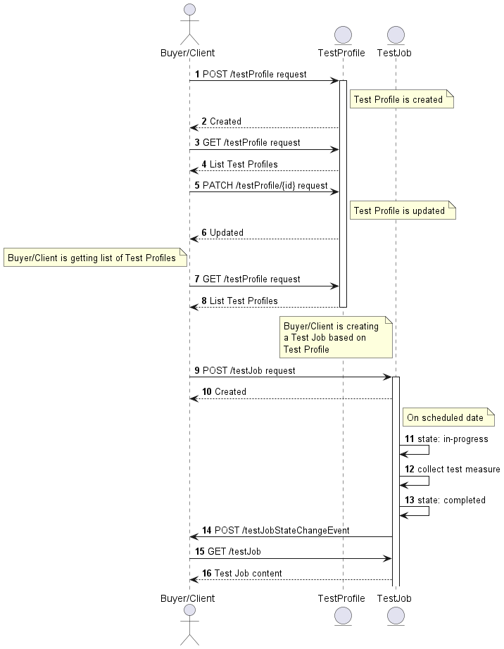

**Figure 5. The flow between API endpoints**

<div class="page"/>

# 5. API Description

This section presents the API structure and design patterns. It starts with the
high-level use cases diagram. Then it describes the REST endpoints with use
case mapping. Next, it explains the design pattern that is used
to combine service-agnostic and service-specific parts of API payloads.
Finally, payload validation and API security aspects are discussed.

## 5.1. High-level use cases

Figure 6 presents a high-level use case diagram. It aims to help understand
the endpoint mapping. Use cases are described extensively in
[chapter 6](#6-api-interactions-and-flows).

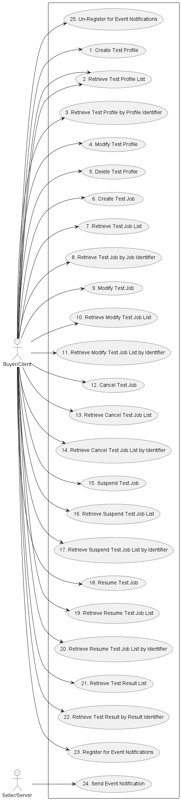

**Figure 6. Use cases**

## 5.2. API Endpoint and Operation Description

### 5.2.1. Seller/Server (SOF) side Service Function Testing API Endpoints

**Base URL for Allegro**:
`https://{{serverBase}}:{{port}}{{?/sof_prefix}}/mefApi/allegro/serviceFunctionTesting/v1/`

**Base URL for Interlude**:
`https://{{serverBase}}:{{port}}{{?/sof_prefix}}/mefApi/interlude/serviceFunctionTesting/v1/`

**Base URL for Legato**:
`https://{{serverBase}}:{{port}}{{?/sof_prefix}}/mefApi/legato/serviceFunctionTesting/v1/`

The following API endpoints are implemented by the Seller/Server (SOF) and
allow the Buyer/Client (SOF/CUS/BUS) to create, retrieve and modify
`TestJob`and `TestProfile` instances. The endpoints and corresponding data model are defined in
`serviceApi/sft/serviceFunctionTesting.api.yaml`.

| API Endpoint                        | Description                                                                                              | MEF W136.1 Use Case Mapping |
|-------------------------------------|----------------------------------------------------------------------------------------------------------|-----------------------------|
| POST /testJob                       | A request initiated by the Buyer/Client to create a Test Job in the Seller/Server system.                | 6,7                         |
| GET /testJob                        | The Buyer/Client requests a list of Test Jobs based on a set of filter criteria.                         | 13                          |
| GET /testJob/{{id}}                 | The Buyer/Client requests detailed information about a single Test Job.                                  | 14                          |
| POST /modifyTestJob                 | A request initiated by the Buyer/Client to Modify a Test Job in the Seller/Server system.                | 11,12                       |
| GET /modifyTestJob                  | The Buyer/Client requests a list of Modify Test Jobs based on a set of filter criteria.                  | 11,12                       |
| GET /modifyTestJob/{{id}}           | The Buyer/Client requests detailed information about a single Modify Test Job.                           | 11,12                       |
| POST /cancelTestJob                 | A request initiated by the Buyer/Client to create a Cancel Test Job in the Seller/Server system.         | 10                          |
| GET /cancelTestJob                  | The Buyer/Client requests a list of Cancel Test Jobs based on a set of filter criteria.                  | 10                          |
| GET /cancelTestJob/{{id}}           | The Buyer/Client requests detailed information about a single Cancel Test Job.                           | 10                          |
| POST /suspendTestJob                | A request initiated by the Buyer/Client to create a Suspend Test Job in the Seller/Server system.        | 8                           |
| GET /suspendTestJob                 | The Buyer/Client requests a list of Suspend Test Jobs based on a set of filter criteria.                 | 8                           |
| GET /suspendTestJob/{{id}}          | The Buyer/Client requests detailed information about a single Suspend Test Job.                          | 8                           |
| POST /resumeTestJob                 | A request initiated by the Buyer/Client to create a Resume Test Job in the Seller/Server system.         | 9                           |
| GET /resumeTestJob                  | The Buyer/Client requests a list of Resume Test Jobs based on a set of filter criteria.                  | 9                           |
| GET /resumeTestJob/{{id}}           | The Buyer/Client requests detailed information about a single Resume Test Job.                           | 9                           |
| POST /testProfile                   | A request initiated by the Administrator to create a Test Profile in the Seller/Server system.           | 1                           |
| GET /testProfile                    | The Administrator or Buyer/Client requests a list of Test Profiles based on a set of filter criteria.    | 4                           |
| GET /testProfile/{{id}}             | The Administrator or Buyer/Client requests detailed information about a single Test Profile.             | 5                           |
| PATCH /testProfile/{{id}}           | A request initiated by the Administrator to partially modify a Test Profile in the Seller/Server system. | 2                           |
| DELETE /testProfile/{{id}}          | A request initiated by the Administrator to delte a Test Profile in the Seller/Server system.            | 3                           |

**Table 4. Seller/Server (SOF) Service Function Testing mandatory API endpoints**

**[R1]** Seller/Server (SOF) **MUST** support all API endpoints listed in 
Table 4.

API endpoints listed in Table 5 are optional and may be exposed by the SOF.

| API Endpoint                      | Description                                                                                                                                                 | MEF W136.1 Use Case Mapping |
| --------------------------------- | ----------------------------------------------------------------------------------------------------------------------------------------------------------- | --------------------------- |
| POST /hub                         | The Buyer/Client or Administrator requests to subscribe to the Test Job and/or Test Profile Notifications.                                                  | 15                          |
| GET /hub/{{id}}                   | The Buyer/Client or Administrator retrieves a specific `EventSubscription` from the SOF, that matches the _`id`_ value provided as _`path`_ parameter.      |                             |
| DELETE /hub/{{id}}                | The Buyer/Client or Administrator requests to unsubscribe from the Test Job and/or Test Profile Notifications.                                              | 16                          |

**Table 5. Seller/Server (SOF) Service Function Testing optional API endpoints**

**[O1]** The implementation **MAY** support API endpoints listed in Table 5. 

### 5.2.2. Buyer/Client (CUS, BUS, SOF) side Service Function Testing API Endpoints

**Base URL for Allegro**:
`https://{{serverBase}}:{{port}}{{?/sof_prefix}}/mefApi/allegro/serviceFunctionTestingNotification/v2/`

**Base URL for Interlude**:
`https://{{serverBase}}:{{port}}{{?/sof_prefix}}/mefApi/interlude/serviceFunctionTestingNotification/v2/`

**Base URL for Legato**:
`https://{{serverBase}}:{{port}}{{?/sof_prefix}}/mefApi/legato/serviceFunctionTestingNotification/v2/`

The following API Endpoints are used by SOF to post notifications to registered
CUS, BUS, or SOF listeners. The endpoints and corresponding data model are 
defined in `serviceApi/sft/serviceFunctionTestingNotification.api.yaml`

| API Endpoint                                               | Description                                                                                                       | MEF W136.1 Use Case Mapping |
| ---------------------------------------------------------- | ------------------------------------------------------------------------------------------------------------------| --------------------------- |
| POST /listener/testJobCreateEvent                   | A request initiated by the Seller/Server to notify Buyer/Client on `TestJob` instance creation.                          | 17                          |
| POST /listener/testJobAttributeValueChangeEvent     | A request initiated by the Seller/Server to notify Buyer/Client on the `TestJob` instance attribute value change.        | 17                          |
| POST /listener/testJobStateChangeEvent              | A request initiated by the Seller/Server to notify Buyer/Client on the `TestJob` instance state change.                  | 17                          |
| POST /listener/testProfileCreateEvent               | A request initiated by the Seller/Server to notify Buyer/Client on `TestProfile` instance creation.                      | 17                          |
| POST /listener/testProfileStateChangeEvent          | A request initiated by the Seller/Server to notify Buyer/Client on the `TestProfile` instance state change.              | 17                          |
| POST /listener/testProfileAttributeValueChangeEvent | A request initiated by the Seller/Server to notify Buyer/Client on the `TestProfile` instance attribute value change.    | 17                          |
| POST /listener/testProfileDeleteEvent               | A request initiated by the Seller/Server to notify Buyer/Client on `TestProfile` instance deletion.                      | 17                          |

**Table 6. Buyer/Client (CUS, BUS, SOF) Service Function Testing API endpoints**

**[O2]** The Buyer/Client (CUS, BUS, SOF) **MAY** support API endpoints listed
in Table 6.

**[O3]** The Buyer/Client (CUS, BUS, SOF) **MAY** register to receive 
Service Function Testing notifications.

**[R2]** The Seller/Server **MUST** support sending notifications to API 
endpoints listed in Table 6 to the registered Buyer/Client.

## 5.3. Integration of Service Testing Specification into Service Function Testing API

Service Function Testing API discussed in this document is a generic envelope that 
allows for the lifecycle management of relevant Service Function Testing objects.
The API itself does not provide explicit definitions for configuring service 
testing or prescribing the structure of output data. However, it offers 
flexible extensibility to accommodate the configuration of service-specific 
testing objectives and results. This allows for customization and adaptation
to various testing requirements and desired data formats. This testing 
configuration and result schemas are defined using JsonSchema (draft 7) format 
[JSON Schema draft 7](#8-references) and can be integrated into the 
`TestJob` using the TMF extension pattern.

The extension hosting types in the API data model are:

- `ServiceSpecificTestProfileAttributes` - this type is extended with Service
   Specific attributes that define how a Test is performed for a given Test Specification.  
- `TestMeasureAttribute` - this type is extended with specific Test Measure attributes schema
  
The `@type` attribute of those extension hosting types must be set to a value 
that uniquely identifies the service testing configuration. A unique 
identifier for MEF standard service schemas is in URN format and is assigned 
by MEF. This identifier is provided as root schema `$id`.
Use of non-MEF standard service testing configuration is allowed. In such 
a case the schema identifier must be agreed upon between the Buyer/Client and
the Seller/Server.

The example below shows a header of a schema, which describes the IP Ping
Service Function Testing configuration, where `"$id": 
urn:mef:lso:spec:legato:ip-ping-configuration:v0.0.1:all` is 
the above-mentioned URN:

```yaml
'$schema': http://json-schema.org/draft-07/schema#
'$id': urn:mef:lso:spec:legato:ip-ping-configuration:v0.0.1:all
title: MEF LSO Legato - IP Ping Service Function Testing Configuration
```

Service Testing configuration payload is introduced in multiple SFT API entities through
a `serviceSpecificTestProfileAttributes` attribute of type 
`ServiceSpecificTestProfileAttributes` which is used as an extension point for 
configuration attributes.

In terms of test job results, the appropriate payload is introduced via 
`TestMeasureAttribute`. This entity is used as an extension point for Test Job specific
output content.

Implementations might choose to integrate selected Service Function Testing
specifications to data model during development. In such a case an integrated 
data model is built, and monitoring specifications are in an inheritance 
relationship accordingly with either `ServicePayloadSpecificAttributes` or 
`ResultPayload` as described in the OAS specification.
This pattern is called **Static Binding**. The snippets below present an 
example of a static binding of the envelope API with exemplary MEF monitoring 
specifications, for both extension points.

```yaml
ServiceSpecificTestProfileAttributes:
    type: object
    description: >-
        ServiceSpecificTestProfileAttributes is used as an extension point for MEF
        service specific test profile configuration. It includes
        definition of service/entity and applicable test job
        objectives. The `@type` attribute is used as a discriminator.
    discriminator:
        mapping:
        urn:mef:lso:spec:legato:ip-ping-configuration:v0.0.1:all: '#/components/schemas/IpPingConfiguration'
    propertyName: '@type'
    properties:
    '@type':
        description: >-
        The named type must be a subclass of ServiceSpecificTestProfileAttributes.
        type: string
    required:
    - '@type'
```

```yaml
IpPingConfiguration:
  allOf:
    - $ref: '#/components/schemas/ServiceSpecificTestProfileAttributes'
    - type: object
      description: IP Ping Service Function Testing Configuration Schema.
```

```yaml
TestMeasureAttributes:
    type: object
    description: >-
        TestMeasureAttributes is used as an extension point for schema to be used that de-fines the 
        Test Result attributes. The `@type` attribute is used as a discriminator.
    discriminator:
        mapping:
        urn:mef:lso:spec:legato:ip-ping-monitoring-results:v0.0.1:all: '#/components/schemas/IpPingResults'
    propertyName: '@type'
    properties:
    '@type':
        description: >-
        The named type must be a subclass of TestMeasureAttributes.
        type: string
    required:
    - '@type'
```

```yaml
IpPingResults:
  allOf:
    - $ref: '#/components/schemas/TestMeasureAttributes'
    - type: object
      description: IP Ping Service Function Testing Results Schema.
```

Alternatively, implementations might choose not to build an integrated model
and choose a different mechanism allowing runtime validation of
service-specific fragments of the payload. The system can validate a given
monitoring configuration against a new schema without redeployment. This 
pattern is called **Dynamic Binding.**

Regardless of the chosen implementation pattern, the HTTP payload is  
the same. Both implementation approaches must conform to the requirements 
specified below.

**[R3]** `ServiceSpecificTestProfileAttributes` and `ServiceSpecificTestProfileAttributes` types are
extension points that **MUST** be used to integrate service test 
properties into a request/response payload.

**[R4]** The `@type` property of `ServiceSpecificTestProfileAttributes` and 
`ServiceSpecificTestProfileAttributes` **MUST** be used to specify the type 
of the extending entity.

**[R5]** Attributes specified in the payload must conform to the test
definition specified in the `@type` property.


**Figure 7. The Extension Pattern with Sample Service-Specific Extension**

Figure 7 presents two MEF Service Function Testing schemas that represent 
configuration and result classes for IP services. When these schemas are used, 
the `@type` of `ServicePayloadSpecificAttributes` takes
`"urn:mef:lso:spec:legato:ip-ping-monitoring-configuration:v0.0.1:all"` 
value to indicate which test specification should be used to interpret a
 set of service-specific attributes included in the payload.
Similarly, for `ResultPayload`, the `@type` attribute takes
`"urn:mef:lso:spec:legato:ip-ping-monitoring-results:v0.0.1:all"` value 
which indicates how the resulting test job collection should be interpreted.

## 5.4. Model structure and validation

The structure of the payloads exchanged via Allegro, Interlude, and Legato 
Service Function Testing API endpoints is defined using:

- OpenAPI version 3.0 for the service-agnostic part of the payload
- JsonSchema (draft 7) for the service-specific part of the payload

**[R6]** Implementations **MUST** use payloads that conform to these
definitions.

## 5.5. Security Considerations

Although the Legato IRP is internal to a Service Provider/Operator business
boundary, it is expected that some minimal security mechanisms are in place for
any communication over this IRP. There must also be authorization mechanisms in
place to control what a particular Buyer/Client or SOF is allowed to do and 
what information may be obtained. For Allegro and Interlude IRPs, security 
should follow rules for external communication.
The definition of the exact security mechanism and configuration is outside
the scope of this document. The LSO Security mechanisms are defined by MEF 128.1
_LSO API Security Profiles_ [[MEF128.1](#8-references)].

<div class="page"/>

# 6. API Interactions and Flows

This section provides a detailed insight into the API functionality, use cases,
and flows. It starts with Table 7 presenting a list and short description of
all business use cases then present the variants of end-to-end interaction
flows, and in the following subchapters describe the API usage flow and
examples for each of the use cases.

| Use Case # | Use Case Name                                                  | Use Case Description                                                                                                                                     |
| ---------- | -------------------------------------------------------------- | -------------------------------------------------------------------------------------------------------------------------------------------------------- |
| 1          | Create Test Profile                                            | A request initiated by the Buyer/Client to create a Test Profile in the Seller/Server system.                                                            |
| 2          | Retrieve List of Test Profiles                                 | The Buyer/Client requests a list of Test Profiles based on a set of filter criteria. The Seller/Server returns a summarized list of Test Profiles.       |
| 3          | Retrieve Test Profile by Profile Identifier                    | The Buyer/Client requests detailed information about a single Test Profile based on the Test Profile Identifier.                                         |
| 4          | Modify Test Profile                                            | A request initiated by the Buyer/Client to modify a Test Profile in the Seller/Server system based on a Test Profile Identifier.                         |
| 5          | Delete Test Profile                                            | The Buyer/Client requests deletion of the Test Profile by specifying the Test Profile Identifier.                                                        |
| 6          | Test Profile Dependency                                        | A request initiated by the Buyer/Client to make a Test Profile in the Seller/Server system dependent on another Test Profile.                            |
| 7          | Create Test Job                                                | A request initiated by the Buyer/Client to create a Test Job in the Seller/Server system                        |
| 8          | Retrieve List of Test Jobs                                     | The Buyer/Client requests a list of Test Jobs based on a set of filter criteria. The Seller/Server returns a summarized list of Test Jobs.               |
| 9          | Retrieve Test Job by Job Identifier                            | The Buyer/Client requests detailed information about a single Test Job based on the Test Job Identifier.                                                 |
| 10         | Modify Test Job                                                | A request initiated by the Buyer/Client to Modify a Test Job in the Seller/Server system.                                                                |
| 11         | Retrieve List of Modify Test Jobs                              | The Buyer/Client requests a list of Modify Test Job based on a set of filter criteria. The Seller/Server returns a summarized list of Modify Test Jobs.  |
| 12         | Retrieve Modify Test Job by Job Identifier                     | The Buyer/Client requests detailed information about a single Modify Test Job based on the Modify Test Job Identifier.                                   |
| 13         | Cancel Test Job                                                | A request initiated by the Buyer/Client to Cancel a Test Job in the Seller/Server system.                                                                |
| 14         | Retrieve List of Cancel Test Jobs                              | The Buyer/Client requests a list of Cancel Test Job based on a set of filter criteria. The Seller/Server returns a summarized list of Cancel Test Jobs.  |
| 15         | Retrieve Cancel Test Job by Job Identifier                     | The Buyer/Client requests detailed information about a single Cancel Test Job based on the Cancel Test Job Identifier.                                   |
| 16         | Suspend Test Job                                               | A request initiated by the Buyer/Client to Suspend a Test Job in the Seller/Server system.                                                               |
| 17         | Retrieve List of Suspend Test Jobs                             | The Buyer/Client requests a list of Suspend Test Job based on a set of filter criteria. The Seller/Server returns a summarized list of Suspend Test Jobs.|
| 18         | Retrieve Suspend Test Job by Job Identifier                    | The Buyer/Client requests detailed information about a single Suspend Test Job based on the Suspend Test Job Identifier.                                 |
| 19         | Resume Test Job                                                | A request initiated by the Buyer/Client to Resume a Test Job in the Seller/Server system.                                                                |
| 20         | Retrieve List of Resume Test Jobs                              | The Buyer/Client requests a list of Resume Test Job based on a set of filter criteria. The Seller/Server returns a summarized list of Resume Test Jobs.  |
| 21         | Retrieve Resume Test Job by Job Identifier                     | The Buyer/Client requests detailed information about a single Resume Test Job based on the Resume Test Job Identifier.                                   |
| 22         | Register for Event Notifications                               | The Buyer/Client requests to subscribe to Test Profile and/or Test Job Notifictions.                                                                     |
| 23         | Send Event Notification                                        | A request initiated by the Seller/Server to notify the Buyer/Client.                                                                                     |
| 24         | Unregister for Event Notifications                             | The Buyer/Client requests to unsubscribe to Test Profile and/or Test Job Notifications.                                                                  |


**Table 7. Use cases description**

## 6.1. Use case 1: Create a Test Profile

Test Profile is a template that is used to simplify the 
Test Job provisioning. Common attributes can be defined in 
the Test Profile which can be centralized and leveraged 
across multiple Test Jobs.

### 6.1.1. Interaction flow

The flow of this use case is described in Figure 8.


**Figure 8. Use Case 1 - Test Profile create request flow**

Buyer/Client is the actor allowed to execute the Test Profile create 
request.

**[R7]** - Buyer/Client **MUST** have access rights to create Test Profile.

The Buyer/Client sends a request with a `TestProfile_Create` type in
the body. The SOF performs request validation, assigns an `id`, and returns
`TestProfile` type in the response body, with a `state` set to
`acknowledged`. From this point, the Test Profile will undergo further
validations before it is ready to be used, and its state is set to `completed`.
The Buyer/Client can track the progress of the process either by subscribing
for notifications or by periodically polling the `TestProfile`. The two
patterns are presented in the following diagrams.


**Figure 9. Test Profile progress tracking - Notifications**


**Figure 10. Test Profile progress tracking - Polling**

**_Note_**: The context of notifications is not a part of the considered use
case itself. It is presented to show the big picture of end-to-end flow. This
applies also to all further use case flow diagrams with notifications.

### 6.1.2. Create Test Profile Request

Figure 11 presents the most important part of the data model used during the
Create Test Profile request (`POST /testProfile`) and response.
The model of the request message - `TestProfile_Create` is a subset of
the `TestProfile_Common` model and contains only attributes that can (or must)
be set by the requestor. The Seller/Server then enriches the entity in the
response with additional information.

**_Note:_** `TestProfile_Create` is an entity used by the Buyer/Client
to make a request. `TestProfile` is an entity used by the Seller/Server
to provide a response. The request entity has a subset of attributes of the
response entity. Thus for the visibility of these shared attributes
`TestProfile_Common` has been introduced. However, this class is not to
be used directly in the exchange.

A `TestProfile_Create` defines details of the execution of the 
`TestJob` that will use the profile as a template. This includes 
parameters that can be shared by multiple Test Jobs.

The full list of attributes is available in [Section 7](#7-api-details) and in
the API specification which is an integral part of this standard.


**Figure 11. Test Profile Key Entities**

To send a request the Buyer/Client uses the `createPerformanceProfile` 
operation from the API. The snippet below presents an example of a Create 
Test Profile request:

**`Test Profile` Create Request**

```json
{
    "description": "Exemplary Create Test Profile request",
    "isBundled": false,
    "lifecycleStatus": "approved",
    "name": "test profile",
    "validFor": "2024-08-12T23:20:50.52Z",
    "relatedServiceSpecificationId": "6e4e338a-8105-481e-8bf6-b3ca124a4b89",
    "serviceSpecificTestProfileAttributes": {
        "@type": "IP-PING",
        "targetAddress": "192.168.5.10",
        "packetCount" : "4",
        ...
    },
    "relatedContact": {
        "name": "Contact 1",
        "phoneNumber": "003531541274"
    }
}
```

**[R8]** The Buyer/Seller Create Test Profile **MUST** support the  
following attributes: [MEF136.1 R1]
- `name`
- `lifecycleStatus`
- `validFor`

**[O4]** The Administrator's Create Test Profile **MAY** contain 
any other attributes.

### 6.1.3. Create Test Profile Response

Entities used for providing a response to the Create Test Profile request 
are presented in Figure 11. The Seller/Server responds with a 
`TestProfile` type, which adds some attributes to the 
`TestProfile_Create` that was used in the Buyer/Client request.

**_Note_**: The term "Response Code" used in the Business Requirements
maps to HTTP response code, where `2xx` indicates _Success_ and `4xx` or `5xx`
indicate _Failure_.

The following snippet presents the Seller/Server response. It has the same 
structure as in the retrieve by identifier operation.

**`Test Profile` Create Response**

```json
{
    "description": "Exemplary Create Test Profile request",
    "isBundled": false,
    "lifecycleStatus": "experimental",
    "name": "test profile",
    "validFor": "2024-08-12T23:20:50.52Z",
    "relatedServiceSpecificationId": "6e4e338a-8105-481e-8bf6-b3ca124a4b89",
    "serviceSpecificTestProfileAttributes": {
        "@type": "IP-PING",
        "targetAddress": "192.168.5.10",
        "packetCount" : "4",
        ...
    },
    "relatedContact": {
        "name": "Contact 1",
        "phoneNumber": "003531541274"
    },    
    "creationDate": "204-06-12T17:47:50.399Z", << added by SOF >>
    "id": "8df0981a-0949-11ee-be56-0242ac120002", << added by SOF >>
    "lastModifiedDate": "204-06-12T17:47:50.399Z", << added by SOF >>
    "state": "acknowledged", << added by SOF >>
    "isAssigned": false << added by SOF >>
}
```

Attributes that are set by the Seller/Server in the response are marked with 
the `<< added by SOF >>` tag.

**[R9]** The Seller/Server's response **MUST** include all and unchanged 
attributes' values as provided by the Buyer/Client in the request.

**[R10]** The Seller/Server **MUST** specify the following attributes in a 
response: 

- `creationDate`
- `id`

**[R11]** The `id` **MUST** remain the same value for the life of the 
Test Profile.

### 6.1.4. Test Profile State Machine

Figure 12 presents the Test Profile state machine:


**Figure 12. Test Profile State Machine**

After receiving the request, the Seller/Server (SOF) performs basic checks of 
the message. If any problem is found an Error response is provided. If the
validation passes a response is provided with `TestProfile` in
`acknowledged` status. Before moving to the `completed` state, the Seller/Server
performs all the remaining business and time-consuming validations. At this
point, an Error response cannot be provided anymore, so the profile moves to a
`rejected` state if some issues are found. 

Table 8 presents the mapping between the API `state` names and the MEF W136.1
naming, together with the states description.

| state          | MEF W136.1 name | Description                                                                                                                                                                                                                                                                                                                                                                                                                                                                    |
| -------------- | -------------- | ------------------------------------------------------------------------------------------------------------------------------------------------------------------------------------------------------------------------------------------------------------------------------------------------------------------------------------------------------------------------------------------------------------------------------------------------------------------------------ |
| `acknowledged` | ACKNOWLEDGED   | A Create Testing Profile request has been received by the Server and has passed basic validation. Test Profile Identifier is assigned in the `Acknowledged` state. The profile remains in the `Acknowledged` state until all validations as applicable are completed. If the attributes are validated the Test Profile moves to the `COMPLETED` state. If not all attributes are validated, the request moves to the `REJECTED` state. |
| `completed`       | COMPLETED       | A Create Test Profile request passes validation and can be used as a template for Test Jobs. creation.                                                                                                                                                                                                                                                                                                                                                              |
| `rejected`     | REJECTED       | A Create Test Profile request fails validation and is rejected                                                                                                                                                                                                                                                                      |

**Table 8. Test Profile states**

**[R12]** The Seller/Server **MUST** support all Test Profile states 
and their associated transitions as described in Figure 12 and Table 8. 

### 6.1.5. Test Profile Lifecycle Flow

Figure 13 presents the Test Profile Lifecycle Flow


**Figure 13. Test Profile Lifecycle Status Flow**


Test Profiles contain the Lifecycle Status attribute that specifies where in the development process the Test Profile is located.  This can range from Experimental whose use may be limited to a small number of users, to Deprecated where the Test Profile has been replaced by another Test Profile and is not intended for use.  Lifecycle Status also includes Pending where the Test Profile is waiting to be approved and Approved, where the Test Profile has been approved for general use.  The Lifecycle Status is often used to indicate what type of user can use the Test Profile.  

Table 9 presents the mapping between the API `lifecycleStatus` names and the MEF W136.1
naming, together with the states description.

| state          | MEF W136.1 name | Description                                                                                                                                                                                                                                                                                                                                                                                                                                                                    |
| -------------- | -------------- | ------------------------------------------------------------------------------------------------------------------------------------------------------------------------------------------------------------------------------------------------------------------------------------------------------------------------------------------------------------------------------------------------------------------------------------------------------------------------------ |
| `experimental` | EXPERIMENTAL   | A Create Testing Profile request has been received by the Server and has passed basic validation. Test Profile Identifier is assigned in the `Acknowledged` state. The profile remains in the `Acknowledged` state until all validations as applicable are completed. If the attributes are validated the Test Profile moves to the `COMPLETED` state. If not all attributes are validated, the request moves to the `REJECTED` state. |
| `pending`       | PENDING       | A Create Test Profile request passes validation and can be used as a template for Test Jobs. creation.                                                                                                                                                                                                                                                                                                                                                              |
| `approved`     | APPROVED       | A Create Test Profile request fails validation and is rejected                                                                                                                                                                                                                                                                      |
| `deprecated`   | DEPRECATED     | A Create Test Profile request fails validation and is rejected                                                                                                                                                                                                                                                                      |

**Table 9. Test Profile Lifecycle statuses**

**[R13]** The Seller/Server **MUST** support all Test Profile Lifecycle Statuses 
and their associated transitions as described in Figure 13 and Table 9. 


## 6.2. Use Case 2: Retrieve List of Test Profiles

The Buyer/Client can retrieve a list of `TestProfile_Find` by using a 
`GET /testProfile`
operation with desired filtering criteria.

**[O5]** The Buyer/Client Retrieve List of Test Profiles request **MAY**
 contain none or more of the following attributes as filter criteria: 

- `description`
- `creationDate.gt`
- `creationDate.lt`
- `lastUpdate.gt`
- `lastUpdate.lt`
- `relatedServiceSpecificationId`


```
https://serverRoot/mefApi/legato/serviceFunctionTesting/v1/testProfile?creationDate.gt="2024-08-12T23:20:50.52Z"&limit=10&offset=0
```

The example above shows a Buyer/Client's request to get all Test Profile
objects created after `2024-08-12T23:20:50.52Z`. Additionally, the Buyer/Client asks 
only for a first (`offset=0`) pack of 10 results (`limit=10`) to be returned. 
The correct response (HTTP code `200`) in the response body contains a list of 
`TestProfile_Find` objects matching the criteria. To get all the details, 
the Buyer/Client has to query a specific `TestProfile` by its `id`. 
Details related to pagination are described in [section 7.1.2](#712-response-pagination)

If the quantity of the records requested to be returned exceeds a Seller/Server 
policy, the Seller/Server must choose to respond with either:
- An empty list and message that indicates the result set is too large or
- A response that indicates the result is too large and includes a subset of the
matching Test Profiles.

**[R14]** The Seller **MUST** include following attributes (if set) in the
`TestProfile_Find` object in the response: [MEF136.1 R17]
- `id`
- `name`
- `description`
- `lifecycleStatus`
- `creationDate`
- `lastUpdate`
- `state`

**[R15]** If the request is successful, the Seller/Server MUST reply with all attributes 
to the Buyer/Client. [MEF136.1 R18]

**[R16]** In case no items matching the criteria are found, the Seller/Server 
**MUST** return a valid response with an empty list. [MEF136.1 R19]

**[R17]** If the request is unsuccessful, the Seller/Server MUST NOT echo back the criteria 
provided by the Buyer/Client. [MEF136.1 R20]

**[R18]** If the request is unsuccessful, the Seller/Server MUST return an error with explanation 
to the Buyer/Client. [MEF136.1 R21]

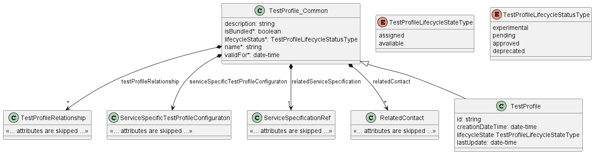

**Figure 14. Use Case 2: Retrieve Test Profile List - Model**

## 6.3. Use Case 3: Retrieve Test Profile by Profile Identifier

The Buyer/Client can get detailed information about the Test Profile 
from the Seller/Server by using a `GET /testProfile/{{id}}` operation. 
The payload returned in the response is a full representation of the Test 
Profile and includes all attributes the Buyer/Client has provided while sending
a Test Profile create request, together with additional attributes set 
by Seller/Server. 

Get List and Get by Identifier operations return different representations of 
Test Profile. Get List returns `TestProfile_Find` object which is
a subset of `TestProfile` returned by the Get by Identifier operation. A 
response to a Get by Identifier for a `TesteProfile` with
`id=8df0981a-0949-11ee-be56-0242ac120002` would return the same response as
presented in [section 6.1.3](#613-create-test-profile-response).

**[R19]** The Buyer’s Retrieve Test Profile by Test Profile Identifier **MUST** 
include the Test Profile Identifier. [MEF136.1 R22]

**[R20]** The Buyer’s Retrieve Test Profile by Test Profile Identifier **MUST NOT** 
include other attributes. [MEF136.1 R23]

**[R21]** If the request is successful, the Seller’s response to a Retrieve Test Profile
by Test Profile Identifier request MUST  include all attributes [MEF136.1 R24]

**[R22]** If the request is unsuccessful, the Seller/Server MUST return an error with
explanation to the Buyer/Client. [MEF136.1 R25]

**[R23]** In case `id` does not allow finding a `PerformanceProfile` in 
Seller/Server's system, an error response `Error404` **MUST** be returned. 

## 6.4. Use Case 4: Modify Test Profile

The update operation is realized with the use of the REST PATCH operation 
(`PATCH /testProfile`). For that purpose, a specialized type 
`TestProfile_Update` is provided. It consists of attributes limited to a
subset that includes only the updateable attributes. The Test Profile cannot 
be used by a Test Job (isAssigned=false), otherwise Test Profile cannot be modified. 

The PATCH usage recommendation follows RFC 7386 json/merge
(https://tools.ietf.org/html/rfc7386).

Figure 15 presents the model used in the PATCH request. The Seller/Server
responds with a `TestProfile` type which is a full representation of 
Test Profile instance.

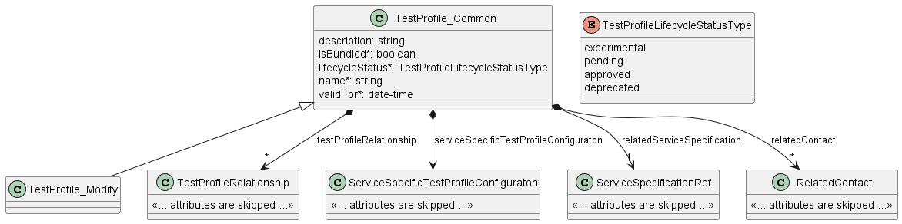

**Figure 15. Patch request Model**

**[R24]** The Buyer’s Modify Test Profile request **MUST** include Test Profile Identifier
and at least one other attribute from `TestProfile_Modify` object. [MEF136.1 R8]
- `description`
- `isBundled`
- `lifecycleStatus`
- `name`
- `relatedTestProfile`
- `serviceSpecificTestProfileAttributes`
- `relatedServiceSpecification`
- `relatedContact`

**[O6]** The Buyer’s Modify Test Profile request MAY include any other attributes 
from `TestProfile_Modify` object. [MEF136.1 O2]

**[R25]** The Seller/Server response to a Modify Test Profile request **MUST** 
echo back all attributes. [MEF136.1 R9]

**[R26]** The Seller/Server response to a Modify Test Profile request **MUST** 
include the following attributes: [MEF136.1 R10]
- `id`
- `creationDate`
- `lastUpdate`
- `isAssigned`

**[R27]** The Seller/Server **MUST** set `lastUpdate` to current date and time. [MEF136.1 R11]

**[R28]** If the Seller/Server encounters errors, they **MUST** return an error 
with explanation to the Buyer/Client. [MEF136.1 R12]

**[R29]** In case `id` does not allow to find a `TesteProfile` that is to
be updated in Seller/Server's system, an error response `Error404` **MUST** be 
returned. 

**[R30]** The Seller/Server **MUST** return an error (`Error422`) if the 
`TesteProfile`, `isAssigned` attribute is set to `true`.

The example below shows a request to patch a `TestProfile` that was 
created in section [6.1.2](#612-create-test-profile-request). 

The request below aims to:

- update Test Profile `description`
- set last date that the Test Profile is valid by modifying the `validFor`
- change Test Profile `lifecycleStatus` to `approved`

```json
{
  "description": "Approved IP Ping Test Profile",
  "validFor": "2025-01-12T00:00:00.000Z",
  "lifecycleStatus": "approved"
}
```

## 6.5. Use Case 5: Delete Test Profile

The Buyer/Client may request to delete a Test Profile by using
`DELETE /testProfile/{{id}}` endpoint. This operation only requires
providing the `id` in the path and has an empty `204` confirmation response.

**[R31]**	The Buyer’s Delete Test Profile request **MUST** contain the Test Profile 
Identifier. [MEF136.1 R13]

**[R32]**	The Buyer’s Delete Test Profile request **MUST NOT** contain any 
other attributes. [MEF136.1 R14]

**[R33]** If the Seller/Server encounters errors, they **MUST** return an error 
with explanation to the Buyer/Client. [MEF136.1 R15]

**[R34]** In case `id` does not allow to find a `TesteProfile` that is to
be deleted in Seller/Server's system, an error response `Error404` **MUST** be 
returned. 

**[R35]** The Seller/Server **MUST** return an error (`Error422`) if the 
`TesteProfile`, `isAssigned` attribute is set to `true`.

The sequence diagram below presents this use case in detail.


**Figure 16. Delete Test Profile Flow**

The Seller/Server verifies the request, then searches for a Test Profile
to be deleted by the given `id`. If found, the  
Seller/Server checks also if there are any Test Job objects that 
refer to the Test Profile (meaning `isAssigned` attribute is set to 
`true`). If everything is verified correctly, the Seller deletes 
the Test Profile , sends a successful response to a request followed by 
`testProfileDeleteEvent` in case the Buyer/Client subscribed for relevant 
notifications.

## 6.6. Use Case 7: Create a Test Job

A Test Job is a service-specific entity that defines the service under test, the test profile to be used, and the service-specific test attributes. The Test Job performs the actual test and makes the results available. As the Test Job runs, it follows the instructions in the test profile to execute the specified test. Once the Test Job is completed, it stores the test results in the `testMeasureAttributes` of the `TestJob` object.

For example, a Test Job can be created to execute a test on an IP service. The Test Profile, which defines how to run an ICMP ping test, is referenced in the Test Job. When the Test Job runs, it follows the steps outlined in the Test Profile to test the service. Once the test is complete, the results are made available and can be retrieved by the user.

Test Jobs can also be created without referencing a Test Profile, known as "Test Jobs without a Test Profile." These are typically used for one-off testing rather than repeatable, standardized tests. In such cases, the Test Job itself defines the attributes that would normally be outlined in the Test Profile, including the steps required to execute the test.


**[O7]** Test Job **MAY** use Test Profile as a template.


### 6.6.1. Interaction flow

The flow of this use case is shown in Figure 17.


**Figure 17. Use Case 7 - Test Job create request flow**

The Buyer/Client sends a request with a `TestJob_Create` type in the 
body. The Seller/Server performs request validation, assigns an `id`, and 
returns the `TestJob` type in the response body, with a `state` set to 
`acknowledged`. From this point, the Test Job is ready for further 
processing. The Buyer/Client can track the progress of the process either by 
subscribing for notifications or by periodically polling the `TestJob`.
The two patterns are presented in the following diagrams.


**Figure 18. Test Job progress tracking - Notifications**


**Figure 19. Test Job progress tracking - Polling**

**_Note_**: The context of notifications is not a part of the considered use
case itself. It is presented to show the big picture of end-to-end flow. This
applies also to all further use case flow diagrams with notifications.

### 6.6.2. Create Test Job Request with Test Profile

Figure 20 presents the most important part of the data model used during
the Create Test Job request (`POST /testJob`) and response. The 
model of the request message - `TestJob_Create` is a subset of the 
`TestJob_Common` model and contains only attributes that can (or must) be set 
by the Buyer/Client. The Seller/Server (SOF) then enriches the entity in the
response with additional information.

**_Note:_** `TestJob_Create` is an entity
used by the Buyer/Client to make a request. `TestJob` is an entity
used by the Seller/Server to provide a response. The request entity has a
subset of attributes of the response entity. Thus for visibility of these
shared attributes `TestJob_Common` has been
introduced (this class is not supposed to be used directly in the exchange).

A `TestJob_Create` defines service test configuration parameters that are
to be applied at execution time. It also refers to the existing `TestProfile` by its `id` or 
directly provides values of attributes defined by the `TestProfile` 
type. See chapter [section 6.6.5](#665-relationship-to-test-profile) 
for more details.

The full list of attributes is available in [Section 7](#7-api-details) and in
the API specification which is an integral part of this standard.


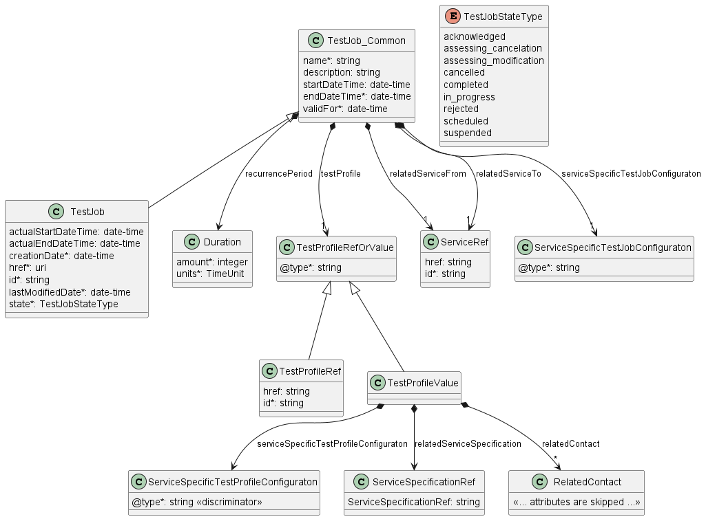

**Figure 20. Test Job with Test Profile Key Entities**

To send a create Test Job request the Buyer/Client uses the 
`createtestJob` operation from the API: `POST /testJob`. For
clarity, some of the create Test Job payload's attributes might be 
omitted to improve examples' readability.

**`Test Job` Create Request**

```json
{
    "name": "TestJob12345",
    "description": "Exemplary Create Test Job request",
    "startDateTime": "2024-09-08T06:36:58.354Z",
    "endDateTime": "2024-09-08T16:36:58.354Z",
    "recurrencePeriod": "hourly",
    "testProfile": {
        "@type": "testProfileRef",
        "id": "8df0981a-0949-11ee-be56-0242ac120002"
    },
    "validFor": "2024-09-08T16:36:58.354Z",
    "relatedService": {
      "id": "6e4e338a-8105-481e-8bf6-b3ca768a4b89",
      "name": "TestService12345"
    },
    "testMeasureAttributes": {
      "@type": "urn:mef:lso:spec:legato:icmp-ping:v0.0.1:all"
    }
  }

```

**[R36]** The Buyer’s/Client’s Create Test Job **MUST** support the 
following attributes: [MEF136.1 R26]

- Test Job Name
- Start Date Time
- End Date Time
- Valid For
- Test Profile Identifier
- Related Service Identifier
- Test Specific At-tributes 

**[R37]** 	If the Valid For Date/Time is reached while a Test Job that refers to the Test Profile is active, the Seller/Server MUST complete the Test Job [MEF136.1 R27]

**[R38]** 	If the Valid For Date/Time is reached while a Test Job that refers to the Test Profile is scheduled, the Seller/Server MUST cancel the Test Job.  [MEF136.1 R28]

**[O8]** The Buyer’s/Client’s Create Test Job **MAY** contain the 
following attributes
- Test Job Description
- Recurrence Period

### 6.6.3. Create Test Job with Test Profile Response

Entities used for providing a response to Create Test Job requests are
presented in Figure 20. The Seller/Server responds with a `TestJob` 
type, which adds some attributes (like `id` or `state`) to the 
`TestJob_Create` that was used in the Buyer/Client request.

**_Note_**: The term "Response Code" used in the Business Requirements
maps to HTTP response code, where `2xx` indicates _Success_ and `4xx` or `5xx`
indicate _Failure_.

The following snippet presents the Seller/Server response. It has the same 
structure as in the retrieve by identifier operation.

**`Test Job` Create Response**

```json
  {
    "name": "TestJob12345",
    "description": "Exemplary Create Test Job request",
    "startDateTime": "2024-09-08T06:36:58.354Z",
    "endDateTime": "2024-09-08T16:36:58.354Z",
    "recurrencePeriod": "hourly",
    "testProfile": {
        "@type": "testProfileRef",
        "id": "8df0981a-0949-11ee-be56-0242ac120002"
    },
    "validFor": "2024-09-08T16:36:58.354Z",
    "relatedService": {
      "id": "6e4e338a-8105-481e-8bf6-b3ca768a4b89",
      "name": "TestService12345"
    },
    "testMeasureAttributes": {
      "@type": "urn:mef:lso:spec:legato:icmp-ping:v0.0.1:all"
    },
    "id": "7cf0981a-0949-11ee-be56-0242ac121234", << added by SOF >>
    "state": "acknowledged", << added by SOF >>
    "actualStartDateTime": "2024-09-08T06:37:01.354Z" << added by SOF >>
  }
```

Attributes that are set by the Seller/Server in the response are marked with 
the `<< added by SOF >>` tag.

**[R39]** If the request is successful, the Seller’s response to a Create Test Job request **MUST** echo back all Buyer/Client provided attributes. [MEF136.1 R29]

**[R40]** If the request is successful, the Seller MUST return the following attributes:
- `id`
- `state`
[MEF136.1 R30]

**[R41]** If the request is not successful, the Seller/Server **MUST NOT** echo back all Buyer/Client provided attributes. [MEF136.1 R31]

**[R42]** If the request is not successful, the Seller/Server **MUST NOT** return a Test Job Identifier or Test Job State. [MEF136.1 R32]

**[R43]** If the Seller/Server encounters errors, they **MUST** return an error with explanation to the Buyer/Client. [MEF136.1 R33]

### 6.6.4. Create Test Job without Test Profile Request

A Test Job can be created without referencing an existing Test Profile in the request by directly providing the required attributes typically defined by the `TestProfile`.

The `TestJob_Create` class, used as a payload for the `createTestJob` operation includes the `testProfile` attribute, which is of type `TestProfileRefOrValue`.
By specifying the value of the `@type` attribute (discriminator) to `@type=TestProfileValue` it is possible to directly provide TestProfile attributes within the Test Job request.


**_Note_**: Defining attributes related to `TestProfile` in Test 
Job create request does not create a new `TestProfile` object. 

**_Note:_** The model of the request message - `TestJob_Create` is a subset of the 
`TestJob_Common` model and contains only attributes that can (or must) be set 
by the Buyer/Client. The Seller/Server (SOF) then enriches the entity in the
response with additional information.

Figure 21 illustrates the key part of the data model that can be used during 
the creation of a Test Job to directly provide the required attributes typically
defined by the `TestProfile` type in the request (`POST /testJob`).

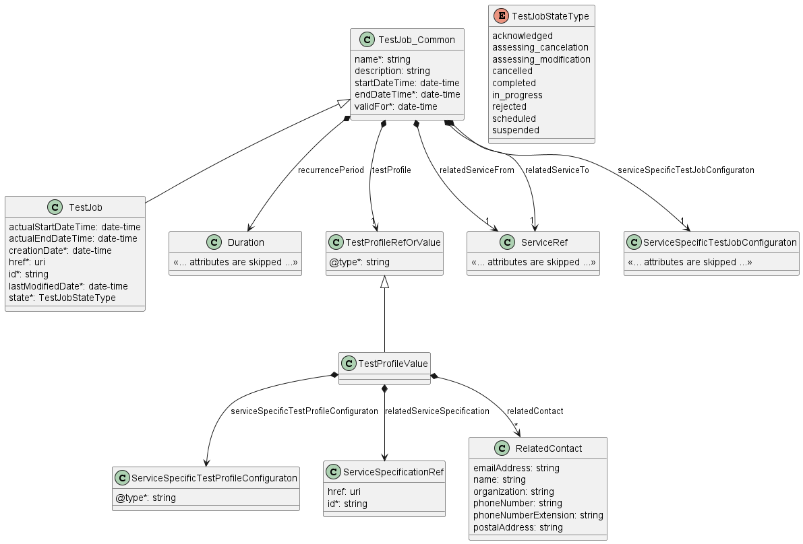

**Figure 21. Test Job without Test Profile Key Entities**

To send a create Test Job without Test Profile request the Buyer/Client uses the 
`createtestJob` operation from the API: `POST /testJob`. For
clarity, some of the create Test Job payload's attributes might be 
omitted to improve examples' readability.

**`Test Job` Create Request**

```json
{
    "name": "TestJob12345",
    "description": "Exemplary Create Test Job request",
    "startDateTime": "2024-09-08T06:36:58.354Z",
    "endDateTime": "2024-09-08T16:36:58.354Z",
    "recurrencePeriod": "hourly",
    "testProfile": {
        "@type": "testProfileValue",
        "description": "directly provided test profile attributes ",
        "relatedServiceSpecificationId": "6e4e338a-8105-481e-8bf6-b3ca124a4b89",
        "serviceSpecificTestProfileAttributes": {
            "@type": "IP-PING",
            "targetAddress": "192.168.5.10",
            "packetCount" : "2",
            ...
        },
        "relatedContact": {
            "name": "Contact 1",
            "phoneNumber": "003531541274"
        }
    },
    "validFor": "2024-09-08T16:36:58.354Z",
    "relatedService": {
      "id": "6e4e338a-8105-481e-8bf6-b3ca768a4b89",
      "name": "TestService12345"
    },
    "testMeasureAttributes": {
      "@type": "urn:mef:lso:spec:legato:icmp-ping:v0.0.1:all"
    }
  }

```

**[R44]** The Buyer’s/Client’s Create Test Job request **MUST** support the 
following attributes: [MEF136.1 R34]

- Test Job Name
- Start Date Time
- End Date Time
- Valid For
- Related Service Identifier
- Test Specific Attributes 
- Service Specific Test Profile Attributes
- Related Service Specification 
- Related Contact Information 


### 6.6.. Create Test Job without Test Profile Response

Entities used for providing a response to Create Test Job requests are
presented in Figure 21. The Seller/Server responds with a `TestJob` 
type, which adds some attributes (like `id` or `state`) to the 
`TestJob_Create` that was used in the Buyer/Client request.

**_Note_**: The term "Response Code" used in the Business Requirements
maps to HTTP response code, where `2xx` indicates _Success_ and `4xx` or `5xx`
indicate _Failure_.

The following snippet presents the Seller/Server response. It has the same 
structure as in the retrieve by identifier operation.

**`Test Job` Create Response**

```json
  {
    "name": "TestJob12345",
    "description": "Exemplary Create Test Job request",
    "startDateTime": "2024-09-08T06:36:58.354Z",
    "endDateTime": "2024-09-08T16:36:58.354Z",
    "recurrencePeriod": "hourly",
    "testProfile": {
        "@type": "testProfileValue",
        "description": "directly provided test profile attributes ",
        "relatedServiceSpecificationId": "6e4e338a-8105-481e-8bf6-b3ca124a4b89",
        "serviceSpecificTestProfileAttributes": {
            "@type": "IP-PING",
            "targetAddress": "192.168.5.10",
            "packetCount" : "2",
            ...
        },
        "relatedContact": {
            "name": "Contact 1",
            "phoneNumber": "003531541274"
        }
    },
    "validFor": "2024-09-08T16:36:58.354Z",
    "relatedService": {
      "id": "6e4e338a-8105-481e-8bf6-b3ca768a4b89",
      "name": "TestService12345"
    },
    "testMeasureAttributes": {
      "@type": "urn:mef:lso:spec:legato:icmp-ping:v0.0.1:all"
    },
    "id": "7cf0981a-0949-11ee-be56-0242ac121234", << added by SOF >>
    "state": "acknowledged", << added by SOF >>
    "actualStartDateTime": "2024-09-08T06:37:01.354Z" << added by SOF >>
  }
```

Attributes that are set by the Seller/Server in the response are marked with 
the `<< added by SOF >>` tag.

**[R45]** If the request is successful, the Seller’s response to a Create Test Job request **MUST** echo back all Buyer/Client provided attributes. [MEF136.1 R35]

**[R46]** If the request is successful, the Seller MUST return the following attributes:
- `id`
- `state`
[MEF136.1 R36]

**[R47]** If the request is not successful, the Seller/Server **MUST NOT** echo back all Buyer/Client provided attributes. [MEF136.1 R37]

**[R48]** If the request is not successful, the Seller/Server **MUST NOT** return a Test Job Identifier or Test Job State. [MEF136.1 R38]

**[R47]** If the Seller/Server encounters errors, they **MUST** return an error with explanation to the Buyer/Client. [MEF136.1 R39]

### 6.6.6. Test Job State Machine

Figure 22 presents the Test Job state machine:

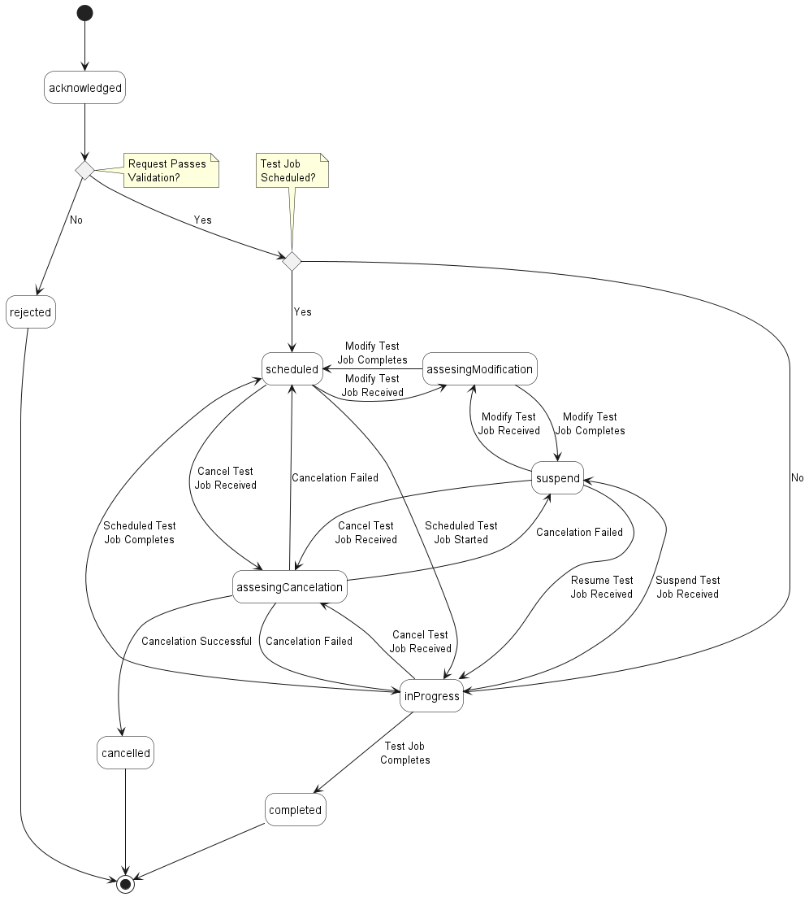

**Figure 22. Test Job State Machine**

After receiving the request, the Seller/Server (SOF) performs basic checks of 
the message. If any problem is found an Error response is provided. If the
validation passes a response is provided with `TestJob` in
`acknowledged` state. Next, the Seller/Server
performs all the remaining business and time-consuming validations. At this
point, an Error response cannot be provided anymore, so the profile moves to a
`rejected` state if some issues are found. `TestJob` moves to 
either the `scheduled` or `inProgress` state depending on the assigned schedule. 
`TestJob` remains `scheduled` state until the scheduled start time is reached.
After completion, the Seller/Server verifies if `TestJob` is recurring. 
If yes, `TestJob` moves to either `scheduled` or `inProgress` state depending on 
the schedule definition. Otherwise, it moves to a `completed` state. 
`TestJob` can be cancelled when in `scheduled` or `inProgress`. When cancellation 
is successful, `TestJob` moves to `cancelled` state. `TestJob` can be modified 
only in the `scheduled` or `suspended` state.

Table 10 presents the mapping between the API `state` names and the MEF W136.1
naming, together with the states' description. 

| state                  | MEF W136.1 name      | Description                                                                                                                                                                                                                                                                                                                                                                                                                                                                                                                                                                                                                                                                      |
| ---------------------- | -------------------- | -------------------------------------------------------------------------------------------------------------------------------------------------------------------------------------------------------------------------------------------------------------------------------------------------------------------------------------------------------------------------------------------------------------------------------------------------------------------------------------------------------------------------------------------------------------------------------------------------------------------------------------------------------------------------------- |
| `acknowledged`         | ACKNOWLEDGED            | The Create Test Job request has been received from the Buyer/Client and the Seller/Server has assigned a Test Job Identifier to it.  If the request attributes fail validation, the Create Test Job moves to the REJECTED state.  If the attributes pass validation, it is then determined if the Create Test Job Start Date Time is immediate or if the Create Test Job Start Date Time indicates that the Test Job is to be scheduled for a later date time.  If the Test Job is to be scheduled the Test Job moves to the SCHEDULED state and awaits the scheduled date and time.  If the Test Job is to be performed immediately, the Test Job moves to the IN_PROGRESS state and Test Results begin.  |
| `assesingModification` | ASSESSING_MODIFICATION | A Modify Test Job request while the Test Job is in the SUSPEND or SCHEDULED state.  If the Modify Test Job is accepted, the Test Job is updated. If the Modify Test Job is declined, the Test Job is not updated and returns to the SUSPEND or SCHEDULED state. |
| `cancelled`            | CANCELLED               | A Cancel Test Job request is received from the Buyer/Client.  If the request is accepted, the Test Job moves to the CANCELLED state.  The Test Job must be in the IN_PROGRESS, SCHEDULED, or SUSPEND, state.|
| `completed`            | COMPLETED               | The Test Job has reached the End Date Time or has completed all Test Measurements and provided Test Results.|
| `inProgress`           | IN_PROGRESS             | Whether an immediate request or a scheduled request, the Test Job moves to the IN_PROGRESS state when it begins performing Test Results.  If a Cancel Test Job request is received and accepted, the Test Job moves to the CANCELLED state.  If the Cancel Test Job request is declined, the Test Job returns to the IN_PROGRESS state and continues Test Results until they are completed.  If a Suspend Test Job request is received, the Test Job moves to the SUSPEND state.|
| `rejected`             | REJECTED                | The Create Test Job request fails validation and is rejected.|
| `scheduled`            | SCHEDULED               | The Test Job is scheduled to start at a later time.  The Test Job stays in the SCHEDULED state until the Start Date and Time is reached.  The Test Job moves to IN_PROGRESS when the Start Date and Time is reached.  A Test Job with the state SCHEDULED can be moved to the SUSPEND or CANCELLED state.|
| `suspend`              | SUSPEND                 | A Test Job in the IN_PROGRESS or SCHEDULED state receives a Suspend Test Job request.  The Test Job moves to the SUSPEND state. A Test Job cannot be modified unless it is in the SUSPEND state.|

**Table 10. Test Job State Machine states**

**[R50]** The Seller/Server **MUST** support all Test Job states and their associated transitions as described in Figure 21 and Table 10.

## 6.8. Use Case 8: Retrieve List of Test Jobs

The Buyer/Client can retrieve a list of `TestJob_Find` by using a 
`GET /testJob` operation with desired filtering criteria.

**[R51]** The Buyer/Client’s Retrieve Test Job List request **MUST** contain none or more of the following filter criteria: 

- `relatedServiceId`
- `testProfileId`
- `name`
- `startDateTime.gt`
- `startDateTime.lt`
- `endDateTime.gt`
- `endDateTime.lt`

[MEF136.1 R73]
```
https://serverRoot/mefApi/legato/serviceFunctionTesting/v1/testJob?relatedServiceId=6e4e338a-8105-481e-8bf6-b3ca768a4b89&limit=10&offset=0
```

The example above shows a Buyer/Client's request to get all Test Job 
objects that have `relatedServiceId` equal 6e4e338a-8105-481e-8bf6-b3ca768a4b89. 
Additionally, the Buyer/Client asks 
only for a first (`offset=0`) pack of 10 results (`limit=10`) to be returned. 
The correct response (HTTP code `200`) in the response body contains a list of 
`TestJob_Find` objects matching the criteria. To get all the details, the 
Buyer/Client has to query a specific `TestJob` by its `id`. Details 
related to pagination are described in [section 7.1.2](#712-response-pagination)

If the quantity of the records requested to be returned exceeds a Seller/Server 
policy, the Seller/Server must choose to respond with either:
- An empty list and message that indicates the result set is too large or
- A response that indicates the result is too large and includes a subset of the
matching Test Jobs.


**[R52]** If successful, the Seller/Server **MUST** return a list of Test Job Identifiers that match the filter criteria along with the filter criteria [MEF136.1 R74]

**[R53]** If successful but no matches to the filter criteria are found, the Seller/Server **MUST** return an empty list [MEF136.1 R75]

**[R54]**	If unsuccessful, the Seller/Server **MUST NOT** return a list of Test Job Identi-fiers or an empty list. [MEF136.1 R76]

**[R55]**	If errors are encountered, the Seller/Server **MUST** return an indication of the errors. [MEF136.1 R77]


Figure 23 presents entities related to the use case. 


**Figure 23. Use Case 8: Retrieve Test Job List - Model**

## 6.9. Use Case 9: Retrieve Test Job by Job Identifier

The Buyer/Client can get detailed information about the Test Job from 
the Seller/Server by using a `GET /testJob/{{id}}` operation. The 
payload returned in the response is a full representation of the Test Job 
and includes all attributes the Buyer/Client has provided while sending a 
Test Job create request, together with additional attributes set by 
Seller/Server. 

Get List and Get by Identifier operations return different representations
of Test Job. Get List returns the `TestJob_Find` object. A response 
to a Get by ID for a `TestJob` with 
`id=7cf0981a-0949-11ee-be56-0242ac121234` would return exactly the same response as
presented in [section 6.6.3](#663-create-test-job-response).

**[R56]** The Buyer/Client’s Retrieve Test Job by Identifier request **MUST** include the Test Job Identifier and only the Test Job Identifier. [MEF136.1 R78]

**[R57]** If successful, the Seller/Server **MUST** include all `TestJob` attributes in their response. [MEF136.1 R79]

**[R58]** If unsuccessful, the Seller/Server **MUST NOT** return any attributes in their response. [MEF136.1 R80]

**[R59]** If errors are encountered, the Seller/Server **MUST** return an indication of the errors encountered. [MEF136.1 R80]

**[R60]** In case `id` does not allow finding a `TestJob` in 
Seller/Server's system, an error response `Error404` **MUST** be returned. 

## 6.10. Use Case 10: Modify Test Job

Due to the need for provisioning and resource reservation on the SOF side, the 
modification operation associated with Test Job may exhibit 
prolonged duration. Consequently, this operation is implemented through a 
separate lifecycle process.

### 6.9.1. Interaction flow

The flow of this use case is shown in Figure 24.

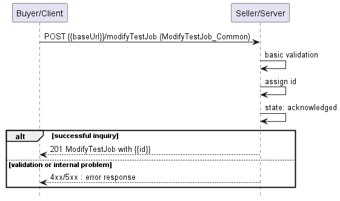

**Figure 24. Use Case 10 - Modify Test Job create request flow**

The Buyer/Client sends a request with a `ModifyTestJob_Create` type in
the body. The Seller/Server performs request validation, assigns an `id`, and 
returns `ModifyTestJob` type in the response body, with a `state` set to
`acknowledged`. Further processing is performed by Seller/Server which will in
case of success update Test Job. The Buyer/Client can track 
the progress of the process either by subscribing for notifications or by
periodically polling the `ModifyTestJob`. The two patterns are presented
in the following diagrams.


**Figure 25. Modify Test Job progress tracking - Notifications**


**Figure 26. Modify Test Job progress tracking - Polling**

**_Note_**: The context of notifications is not a part of the considered use
case itself. It is presented to show the big picture of end-to-end flow. This
applies also to all further use case flow diagrams with notifications.

### 6.9.2. Modify Test Job Request

Figure 27 presents the most important part of the data model used during 
the Modify Test Job request (`POST /modifyTestJob`) and response. 
The model of the request message - `ModifyTestJob_Create` is a subset of
the `ModifyTestJob` model and contains only attributes that can (or must)
be set by the Buyer/Client. The Seller/Server (SOF) then enriches the entity in
the response with additional information.

**_Note:_** `ModifyTestJob_Create` is an entity
used by the Buyer/Client to make a request. `ModifyTestJob` is an entity
used by the Seller/Server to provide a response. The request entity has a
subset of attributes of the response entity. Thus for visibility of these
shared attributes `ModifyTestJob_Common` has been
introduced (this class is not supposed to be used directly in the exchange).

A `ModifyTestJob_Create` is a subset that
includes only the updateable attributes. It is important to notice that 
updating the reference to Test Profile must not be possible. In order 
to change this assignment, existing Test Job must be cancelled and 
replaced by a new Job that relates to the relevant Profile. 
Modification of Test Job allows for changing attributes defined directly
by `TestJob` type or Test Profile attributes that are defined by 
value. These attributes are contained in `testProfile` group.
The `TestJobRef` section of `ModifyTestJob_Create` is used to 
specify which Test Job object is a subject of the modification process 
(relationship by reference using `id` of the Job).

**_Note:_** Modifying attributes defined by the Test Profile type, when
a Job uses a reference to a Test Profile object, cannot modify the 
Test Profile itself.

**_Note:_** Only attributes that should be modified on the Test Job,
should be included in the Modify Test Job Request. 

**_TBD:_** Section `servicePayloadSpecificAttributes` of the Test Profile 
request allows for the introduction of service-specific properties of 
service function test as the API payload. The extension mechanism is described 
in detail in [Section 5.3](#53-integration-of-service-testing-specification-into-service-function-testing-api).

The full list of attributes is available in [Section 7](#7-api-details) and in
the API specification which is an integral part of this standard.

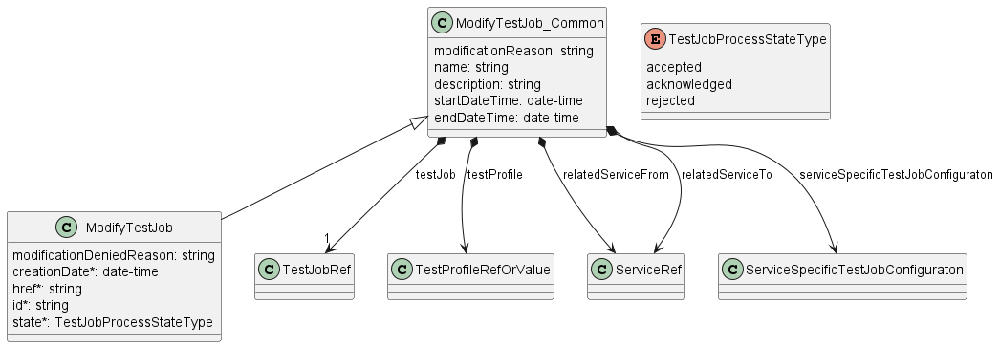

**Figure 27. Modify Test Job Key Entities**

To send a Modify Test Job request the Buyer/Client uses the 
`modifyTestJob` operation from the API: `POST /modifyTestJob`. 
Some of the payload's attributes might be omitted to improve examples' 
readability.

The example below shows a request to create a modification process for 
`TestJob` that was created in section [6.6.2](#662-create-test-job-request). 

The request below aims to:

- change `testProfile`
- change `endDateTime`
- modify `description` of the Test Job

```json
{
  "name": "ModifyTestJob12345",
  "description": "Exemplary Modified Test Job request",
  "endDateTime": "2024-11-08T16:36:58.354Z",
  "testProfile": {
    "@type": "testProfileRef",
    "id": "8df0981a-0949-11ee-be56-0242ac120066"
  },
  "modificationReason": "Modifying Test Job Profile and Test Job end date",
  "testJob": {
    "@type": "TestJobRef",
    "href": "{{baseUrl}}/serviceFunctionTesting/v1/testJob/755e55e2-72b0-4e3b-af00-693e3beac691",
    "id": "755e55e2-72b0-4e3b-af00-693e3beac691"
  }
}
```

**[R61]** The Buyer’s Modify Test Job request **MUST** include the Test Job Identifier. [MEF136.1 R58]

**[R62]** The Buyer's Modify Test Job request **MUST** at least one of the
following attributes: [MEF136.1 R59]
- `description`
- `endDateTime`
- `name`
- `startDateTime`
- `relatedService`
- `testProfile`
- `testMeasureAttributes`

**[R63]** The Test Job **MUST** be in the SUSPENDED or SCHEDULED state for a Buyer/Client to modify it. [MEF136.1 R60]

**_Note_**: In case Test Job is running e.g., once a day for a short period
of time, it may be difficult to change its state. If action arrives when 
Test Job is running, it is recommended to run until the end and only 
afterwards action should be applied.

### 6.9.3. Modify Test Job Response

Entities used for providing a response to Modify Test Job request are
presented in Figure 27. The Seller/Server responds with a 
`ModifyTestJob` type, which adds some attributes (like `id` or `state`) 
to the `ModifyTestJob_Create` that was used in the Buyer/Client request.

**_Note_**: The term "Response Code" used in the Business Requirements
maps to HTTP response code, where `2xx` indicates _Success_ and `4xx` or `5xx`
indicate _Failure_.

The following snippet presents the Seller/Server response. It has the same 
structure as in the retrieve by identifier operation.

```json
{
  "name": "ModifyTestJob12345",
  "description": "Exemplary Modified Test Job request",
  "endDateTime": "2024-11-08T16:36:58.354Z",
  "testProfile": {
    "@type": "testProfileRef",
    "id": "8df0981a-0949-11ee-be56-0242ac120066"
  },
  "modificationReason": "Modifying Test Job Profile and Test Job end date",
  "testJob": {
    "@type": "TestJobRef",
    "href": "{{baseUrl}}/serviceFunctionTesting/v1/testJob/755e55e2-72b0-4e3b-af00-693e3beac691",
    "id": "755e55e2-72b0-4e3b-af00-693e3beac691"
  },
  "creationDate": "204-06-19T12:58:17.088Z", << added by SOF >>
  "href": "{{baseUrl}}/serviceFunctionTesting/v1/modifyTestJob/9c51d971-185d-403e-952f-2110f33a9628", << added by SOF >>
  "id": "9c51d971-185d-403e-952f-2110f33a9628", << added by SOF >>
  "state": "acknowledged" << added by SOF >>
}
```

Attributes that are set by the Seller/Server in the response are marked with 
the `<< added by SOF >>` tag. 

**[R64]** The Seller/Server's response **MUST** include all and unchanged 
attributes' values as provided by Buyer/Client in the request. [MEF136.1 R61]

**[R65]** If the request is not successful, the Seller/Server **MUST NOT** echo 
back all Buyer/Client provided attributes. [MEF136.1 R62]

**[R66]** The Seller/Server **MUST** specify the following attributes in a 
response: 
- `id`
- `state`
- `creationDate`

**[R67]** The `id` **MUST** remain the same value for the life of the Modify 
Test Job.

**[R68]** If the request is not successful, the Seller/Server **MUST NOT** return
a Test Job Identifier or Test Job State. [MEF136.1 R63]

**[R69]** If the Seller/Server encounters errors, they **MUST** return an error 
with explanation to the Buyer/Client. [MEF136.1 R64]

In case Seller/Server cannot successfully validate the request, Modify 
Test Job process fails, which results in setting state to `declined` 
with a proper explanation in `modificationDeniedReason`. This includes 
situation when:
- `id` does not allow to find a `TestJob` that is to be updated in 
Seller/Server's system
- requested attributes cannot be modified
- Test Job is in the state that does not allow for modification.

### 6.9.4. Modify Test Job State Machine

Figure 28 presents the Modify Test Job state machine:

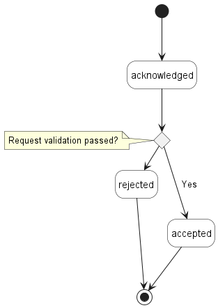

**Figure 28. Modify Test Job State Machine**

After receiving the request, the Seller/Server (SOF) performs basic checks of 
the message. If any problem is found an Error response is provided. If the
validation passes a response is provided with `ModifyTestJob` in
`acknowledged` state. Next, the Seller/Server
performs all the remaining business and time-consuming validations. At this
point, an Error response cannot be provided anymore, so the profile moves to a
`declined` state if some issues are found. The
`modifyTestJob.modificationDeniedReason` acts as a placeholder to 
provide a detailed description of what caused the problem. If validation is 
successful, `ModifyTestJob` moves to `accepted` state. At this point, 
related `TestJob` moves to pending state and Seller/Server starts all 
necessary arrangements to provision modification request. `TestJob` 
remains in `pending` state until Modify Test Job process is finished and 
moved to `completed` state. This causes `TestJob` state to change to 
`scheduled` or `in-progress` depending on the `ScheduleDefinition`.

Table 11 presents the mapping between the API `state` names and the MEF W136.1
naming, together with states description. The list of states is the same 
for all processes related to Test Job (cancel/modify/resume/suspend). 

| state          | MEF W136.1 name | Description                                                                                                                                                                                                                                                                                                                                                                                                                                               |
| -------------- |-----------------|-----------------------------------------------------------------------------------------------------------------------------------------------------------------------------------------------------------------------------------------------------------------------------------------------------------------------------------------------------------------------------------------------------------------------------------------------------------|
| `accepted`     | ACCEPTED        | The Cancel/Modify/Resume/Suspend Test Job request has been validated and accepted by the Seller/Server.                                                                                                                                                                                                                                                                                                                                                   |
| `acknowledged` | ACKNOWLEDGED    | The Cancel/Modify/Resume/Suspend Test Job request has been received by the Seller/Server and has passed basic validation. Test Job Process Identifier is assigned in the Acknowledged state. The request remains in the Acknowledged state until all validations as applicable are completed. If the attributes are validated, the request moves to the Accepted state. If not all attributes are validated, the request moves to the Declined state.     |
| `completed`    | COMPLETED       | The Cancel/Modify/Resume/Suspend Test Job request has been completed by the Seller/Server.                                                                                                                                                                                                                                                                                                                                                                |
| `declined`     | DECLINED        | The Cancel/Modify/Resume/Suspend Test Job request has failed validation and been declined by the Seller/Server.                                                                                                                                                                                                                                                                                                                                           |
| `rejected`     | REJECTED        | The Cancel/Modify/Resume/Suspend Test Job request has been rejected by the Seller/Server.                                                                                                                                                                                                                                                                                                                                                                 |

**Table 11. Test Job Process State Machine states**

**[R70]** The Seller/Server **MUST** support all Modify Test Job states 
and their associated transitions as described in Figure 28 and Table 11. 

## 6.11. Use Case 11: Retrieve Modify Test Job List

The Buyer/Client can retrieve a list of Modify Test Job objects by using 
a `GET /modifyTestJob` operation with desired filtering criteria.

**[O9]** The Buyer/Client Retrieve List of Modify Test Jobs request 
**MAY** contain none or more of the following attributes: 

- `testJobId`
- `state`
- `creationDate.gt`
- `creationDate.lt`

```
https://serverRoot/mefApi/legato/serviceFunctionTesting/v1/modifyTestJob?state=acknowledged&limit=10&offset=0
```

The example above shows a Buyer/Client's request to get all Modify Test 
Job objects that are in the `acknowledged` state. Additionally, the Buyer/Client
asks only for a first (`offset=0`) pack of 10 results (`limit=10`) to be 
returned. The correct response (HTTP code `200`) in the response body contains a
list of `ModifyTestJob_Find` objects matching the criteria. Details 
related to pagination are described in [section 7.1.2](#712-response-pagination).

**[R71]** The Seller **MUST** include following attributes in the
`ModifyTestJob_Find` object in the response: 

- `id`
- `testJobId`
- `state`

**[R72]** In case no items matching the criteria are found, the Seller/Server 
**MUST** return a valid response with an empty list. 

Figure 29 presents entities related to the use case. 


**Figure 29. Use Case 11: Retrieve Modify Test Job List - Model**

## 6.12. Use Case 12: Retrieve Modify Test Job by Identifier

The Buyer/Client can get detailed information about the Modify Test Job 
from the Seller/Server by using a `GET /modifyTestJob/{{id}}` operation. 
The payload returned in the response is a full representation of the Modify 
Test Job and includes all attributes the Buyer/Client has provided while 
sending a Modify Test Job create request, together with additional 
attributes set by Seller/Server. 

Get List and Get by Identifier operations return different representations of 
Modify Test Job. Get List returns the `ModifyTestJob_Find` object 
which is a subset of the `ModifyTestJob` returned by the Get by Identifier 
operation. A response to a Get by Id for a `ModifyTestJob` with
`id=755e55e2-72b0-4e3b-af00-693e3beac691` would return exactly the same response as
presented in [section 6.12.3](#6123-modify-test-monitoring-job-response).

**[R73]** In case `id` does not allow finding a `ModifyTestJob` in 
Seller/Server's system, an error response `Error404` **MUST** be returned. 

**[R74]** The Seller/Server **MUST** include following attributes in the
`ModifyTestJob` object in the response: 

- `id`
- `testJob`
- `state`

**[R75]** The Seller **MUST** provide all remaining optional attributes if they
were previously set by the Buyer or the Seller. 


## 6.13. Use Case 13: Cancel Test Job

Due to the need for deprovisioning of the Test Job on the SOF 
side, the cancel operation associated with the Test Job may 
exhibit a prolonged duration. Consequently, this operation is implemented through 
a separate lifecycle process.

### 6.13.1. Interaction flow

The flow of this use case is shown in Figure 30.


**Figure 30. Use Case 13 - Cancel Test Job create request flow**

The Buyer/Client sends a request with a `CancelTestJob_Create` type in 
the body. The Seller/Server performs request validation, assigns an `id`, and 
returns the `CancelTestJob` type in the response body, with a `state` set to 
`acknowledged`. Further processing is performed by Seller/Server which will in 
case of success update the Test Job. The Buyer/Client can track 
the progress of the process either by subscribing for notifications or by
periodically polling the `CancelTestJob`. The two patterns are presented 
in the following diagrams.


**Figure 31. Cancel Test Job progress tracking - Notifications**

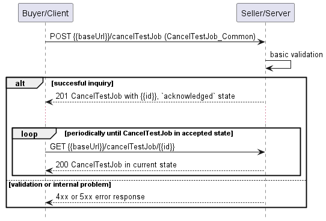

**Figure 32. Cancel Test Job progress tracking - Polling**

**_Note_**: The Cancel Test Job process is altering the state of the job 
itself. It is important to note that notifications resulting from changes in the 
state of the Test Job are not represented in Figures 31 and 32. 

**_Note_**: The context of notifications is not a part of the considered use
case itself. It is presented to show the big picture of end-to-end flow. This
applies also to all further use case flow diagrams with notifications.


### 6.13.2. Cancel Test Job Request

Figure 33 presents the most important part of the data model used during 
the Cancel Test Job request (`POST /cancelTestJob`) and response. 
The model of the request message - `CancelTestJob_Create` is a subset of 
the `CancelTestJob` model and contains only attributes that can (or must) 
be set by the Buyer/Client. The Seller/Server (SOF) then enriches the entity in 
the response with additional information.

**_Note:_** `CancelTestJob_Create` is an entity
used by the Buyer/Client to make a request. `CancelTestJob` is an entity
used by the Seller/Server to provide a response. The request entity has a
subset of attributes of the response entity. Thus for visibility of these
shared attributes `CancelTestJob_Common` has been
introduced (this class is not supposed to be used directly in the exchange).

The `testJob` section of `CancelTestJob_Create` is used to 
specify which Test Job object is a subject of the cancellation process 
(relationship by reference using `id` of the Job).

The full list of attributes is available in [Section 7](#7-api-details) and in
the API specification which is an integral part of this standard.


**Figure 33. Cancel Test Job Key Entities** 

To send a Cancel Test Job request the Buyer/Client uses the 
`cancelTestJob` operation from the API: `POST /cancelTestJob`. 

The example below shows a request to create a cancellation process for
`TestJob` that was created in section [6.6.2](#662-create-test-monitoring-job-request). 

```json
{
  "cancellationReason": "Cancel Test Job sample",
  "testJob": {
    "href": "{{baseUrl}}/serviceFunctionTesting/v1/testJob/755e55e2-72b0-4e3b-af00-693e3beac691",
    "id": "755e55e2-72b0-4e3b-af00-693e3beac691"
  }
}
```

**[R76]** The Buyer’s/Client’s Cancel Test Job request **MUST** include 
the following attributes: [MEF133.1 R57]
- `testJob`

**_Note_**: If action arrives when Test Job is running, it is 
recommended to run until the end and only afterward action should be applied.
[MEF133.1 O16, O26]

### 6.13.3. Cancel Test Job Response

Entities used for providing a response to Cancel Test Job requests are
presented in Figure 33. The Seller/Server responds with a `CancelTestJob` 
type, which adds some attributes (like `id` or `state`) to the 
`CancelTestJob_Create` that was used in the Buyer/Client request.

**_Note_**: The term "Response Code" used in the Business Requirements
maps to HTTP response code, where `2xx` indicates _Success_ and `4xx` or `5xx`
indicate _Failure_.

The following snippet presents the Seller/Server response. It has the same 
structure as in the retrieve by identifier operation.

```json
{
  "cancellationReason": "Cancel Test Job sample",
  "testJob": {
    "href": "{{baseUrl}}/serviceFunctionTesting/v1/testJob/755e55e2-72b0-4e3b-af00-693e3beac691",
    "id": "755e55e2-72b0-4e3b-af00-693e3beac691"
  },
  "creationDate": "204-06-19T12:58:17.088Z", << added by SOF >>
  "href": "{{baseUrl}}/serviceFunctionTesting/v1/CancelTestJob/aea2769a-23f3-4ddc-b095-542a63b12481", << added by SOF >>
  "id": "aea2769a-23f3-4ddc-b095-542a63b12481", << added by SOF >>
  "state": "acknowledged" << added by SOF >>
}
```

Attributes that are set by the Seller/Server in the response are marked with the
`<< added by SOF >>` tag. 

**[R77]** The Seller/Server's response **MUST** include all and unchanged 
attributes' values as provided by the Buyer/Client in the request.

**[R78]** The Seller/Server **MUST** specify the following attributes in a 
response: 
- `id`
- `state`
- `creationDate`

**[R79]** The `id` **MUST** remain the same value for the life of the Cancel 
Test Job.

In case Seller/Server cannot successfully validate the request, Cancel 
Test Job process fails, which results in setting the state to `rejected` with
a proper explanation in `cancellationDeniedReason`. This includes situation 
when:
- `id` does not allow to find a `TestJob` that is to be cancelled in 
Seller/Server's system
- Test Job is in a state that does not allow for cancellation.

### 6.13.4. Cancel Test Job State Machine

Figure 34 presents the Cancel Test Job state machine:


**Figure 34. Cancel Test Job State Machine**

After receiving the request, the Seller/Server (SOF) has assigned a `CancelTestJob` 
Identifier to it.  If the request attributes fail validation, the `CancelTestJob` 
request moves to the `rejected` state. Next, the Seller/Server performs all the remaining 
business and time-consuming validations. At this point, an Error response cannot
be provided anymore, so the job moves to a `declined` state if some issues 
are found. The `cancelTestJob.cancellationDeniedReason` acts as a 
placeholder to provide a detailed description of what caused the problem. If 
validation is successful, `CancelTestJob` moves to the `accepted` state.
When the Cancel Test Job process is finished, it moves to the `completed` state. 
This causes the `TestJob` state to change to `cancelled`.

Description and mapping of the Cancel Test Job States are the same as in 
table 10.

## 6.14. Use Case 14: Retrieve Cancel Test Job List

The Buyer/Client can retrieve a list of Cancel Test Job objects by using 
a `GET /cancelTestJob` operation with desired filtering criteria.

**[O10]** The Buyer/Client Retrieve List of Cancel Test Jobs request 
**MAY** contain none or more of the following attributes: 

- `testJobId`
- `state`
- `creationDate.gt`
- `creationDate.lt`

```
https://serverRoot/mefApi/legato/serviceFunctionTesting/v1/cancelTestJob?state=acknowledged&limit=10&offset=0
```

The example above shows a Buyer/Client's request to get all Cancel Test 
Job objects that are in the `acknowledged` state. Additionally, the Buyer/Client
asks only for a first (`offset=0`) pack of 10 results (`limit=10`) to be 
returned. The correct response (HTTP code `200`) in the response body contains a
list of `CancelTestJob_Find` objects matching the criteria. Details 
related to pagination are described in [section 7.1.2](#712-response-pagination).

**[R80]** The Seller **MUST** include following attributes in the
`CancelTestJob_Find` object in the response: 

- `id`
- `testJobId`
- `state`

**[R81]** In case no items matching the criteria are found, the Seller/Server 
**MUST** return a valid response with an empty list. 

Figure 35 presents entities related to the use case. 


**Figure 35. Use Case 14: Retrieve Cancel Test Job List - Model**

## 6.15. Use Case 15: Retrieve Cancel Test Job by Identifier

The Buyer/Client can get detailed information about the Cancel Test Job 
from the Seller/Server by using a `GET /cancelTestJob/{{id}}` operation. 
The payload returned in the response is a full representation of the Cancel 
Test Job and includes all attributes the Buyer/Client has provided while 
sending a Cancel Test Job create request, together with additional 
attributes set by Seller/Server. 

Get List and Get by Identifier operations return different representations of 
Cancel Test Job. Get List returns the `CancelTestJob_Find` object 
which is a subset of the `CancelTestJob` returned by the Get by Identifier 
operation. A response to a Get by Id for a `CancelTestJob` with
`id=755e55e2-72b0-4e3b-af00-693e3beac691` would return exactly the same response as
presented in [section 6.12.3](#6123-cancel-test-monitoring-job-response).

**[R82]** In case `id` does not allow finding a `CancelTestJob` in 
Seller/Server's system, an error response `Error404` **MUST** be returned. 

**[R83]** The Seller/Server **MUST** include following attributes in the
`CancelTestJob` object in the response: 

- `id`
- `testJob`
- `state`

**[R84]** The Seller **MUST** provide all remaining optional attributes if they
were previously set by the Buyer or the Seller. 

## 6.16. Use Case 16: Suspend Test Job

Due to the need to release resources on the SOF side, the suspend operation 
associated with the Test Job may exhibit a prolonged duration. 
Consequently, this operation is implemented through a separate lifecycle 
process.

When the Test Job is suspended, it does not perform any tests nor collects test measures.

### 6.16.1. Interaction flow

The flow of this use case is shown in Figure 36.

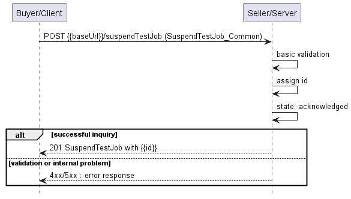

**Figure 36. Use Case 16 - Suspend Test Job create request flow**

The Buyer/Client sends a request with a `SuspendTestJob_Create` type in 
the body. The Seller/Server performs request validation, assigns an `id`, and 
returns the `SuspendTestJob` type in the response body, with a `state` set 
to `acknowledged`. Further processing is performed by Seller/Server which will 
in case of success update the Test Job. The Buyer/Client can 
track the progress of the process either by subscribing for notifications or by 
periodically polling the `SuspendTestJob`. The two patterns are presented 
in the following diagrams.


**Figure 37. Suspend Test Job progress tracking - Notifications**

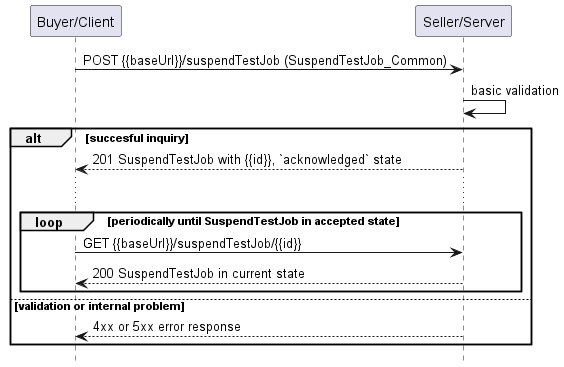

**Figure 38. Suspend Test Job progress tracking - Polling**

**_Note_**: The Suspend Test Job process is altering the state of the job 
itself. It is important to note that notifications resulting from changes in the 
state of the Test Job are not represented in Figures 37 and 38.

**_Note_**: The context of notifications is not a part of the considered use
case itself. It is presented to show the big picture of end-to-end flow. This
applies also to all further use case flow diagrams with notifications.

### 6.16.2. Suspend Test Job Request

Figure 39 presents the most important part of the data model used during 
the Suspend Test Job request (`POST /suspendTestJob`) and 
response. The model of the request message - `SuspendTestJob_Create` is a
subset of the `SuspendTestJob` model and contains only attributes that 
can (or must) be set by the Buyer/Client. The Seller/Server (SOF) then enriches 
the entity in the response with additional information.

**_Note:_** `SuspendTestJob_Create` is an entity
used by the Buyer/Client to make a request. `SuspendTestJob` is an entity
used by the Seller/Server to provide a response. The request entity has a
subset of attributes of the response entity. Thus for visibility of these
shared attributes `SuspendTestJob_Common` has been
introduced (this class is not supposed to be used directly in the exchange).

The `testJob` section of `SuspendTestJob_Create` is used to 
specify which Test Job object is a subject of the suspension process 
(relationship by reference using `id` of the Job).

The full list of attributes is available in [Section 7](#7-api-details) and in
the API specification which is an integral part of this standard.


**Figure 39. Suspend Test Job Key Entities** 

To send a Suspend Test Job request the Buyer/Client uses the 
`suspendTestJob` operation from the API: `POST /suspendTestJob`. 

The example below shows a request to create a suspension process for
`TestJob` that was created in section [6.6.2](#662-create-test-job-request). 

```json
{
  "testJob": {
    "href": "{{baseUrl}}/serviceFunctionTesting/v1/testJob/755e55e2-72b0-4e3b-af00-693e3beac691",
    "id": "755e55e2-72b0-4e3b-af00-693e3beac691"
  },
  "suspensionReason": "Suspend Test Job sample"
}
```

**[R85]** The Buyer/Client Suspend Test Job request **MUST** include the 
following attributes: [MEF136.1 R40]
- `testJob.id`

**[R86]** The Test Job **MUST** be in the In-Progress state to be 
suspended. [MEF136.1 R41]

**[O11]** In case the Test Job is running e.g., once a day for a short period
of time, it may be difficult to change its state. If action arrives when 
Test Job is running, it is recommended to run until the end and only 
afterwards action should be applied.

### 6.16.3. Suspend Test Job Response

Entities used for providing a response to Suspend Test Job requests are
presented in Figure 39. The Seller/Server responds with a 
`SuspendTestJob` type, which adds some attributes (like `id` or `state`) 
to the `SuspendTestJob_Create` that was used in the Buyer/Client request.

**_Note_**: The term "Response Code" used in the Business Requirements
maps to HTTP response code, where `2xx` indicates _Success_ and `4xx` or `5xx`
indicate _Failure_.

The following snippet presents the Seller/Server response. It has the same 
structure as in the retrieve by identifier operation.

```json
{
  "testJob": {
    "href": "{{baseUrl}}/serviceFunctionTesting/v1/testJob/755e55e2-72b0-4e3b-af00-693e3beac691",
    "id": "755e55e2-72b0-4e3b-af00-693e3beac691"
  },
  "suspensionReason": "Suspend Test Job sample",
  "creationDate": "204-06-19T12:58:17.088Z", << added by SOF >>
  "href": "{{baseUrl}}/serviceFunctionTesting/v1/suspendTestJob/aea2769a-23f3-4ddc-b095-542a63b12481", << added by SOF >>
  "id": "aea2769a-23f3-4ddc-b095-542a63b12481", << added by SOF >>
  "state": "acknowledged" << added by SOF >>
}
```

Attributes that are set by the Seller/Server in the response are marked with the
`<< added by SOF >>` tag. 


**[R87]** If the request is successful, the Seller/Server **MUST** suspend 
all testing and measurements being performed on the Test Job and place the 
Test Job in the SUSPENDED state when they receive a Suspend Test Job request
 from the Buyer/Client [MEF136.1 R42]

**[R88]** While in the SUSPENDED state, the Test Job **MUST NOT** perform any 
testing or measurements. [MEF136.1 R43]

**[R89]** If the request is not successful, the Seller/Server **MUST NOT** suspend 
the Test Job [MEF136.1 R44]

**[R90]** If the Seller/Server encounters errors, they **MUST** return an error 
with explanation to the Buyer/Client [MEF136.1 R45]

**[R91]** The Seller/Server's response **MUST** include all and unchanged 
attributes' values as provided by the Buyer/Client in the request.

**[R92]** The Seller/Server **MUST** specify the following attributes in a 
response: 
- `id`
- `state`
- `creationDate`

**[R93]** The `id` **MUST** remain the same value for the life of the 
Suspend Test Job.

In case Seller/Server cannot successfully validate the request, Suspend 
Test Job process fails, which results in setting the state to `rejected` 
or `declined` with a proper explanation in `suspensionDeniedReason`. This 
includes situations when:
- `id` does not allow to find a `TestJob` that is to be suspended in 
Seller/Server's system
- Test Job is in a state that does not allow for suspension.

### 6.16.4. Suspend Test Job State Machine

Figure 40 presents the Suspend Test Job state machine:


**Figure 40. Suspend Test Job State Machine**

After receiving the request, the Seller/Server (SOF) has assigned a `SuspendTestJob` 
Identifier to it.  If the request attributes fail validation, the `SuspendTestJob` 
request moves to the `rejected` state. Next, the Seller/Server performs all the remaining 
business and time-consuming validations. At this point, an Error response cannot
be provided anymore, so the job moves to a `declined` state if some issues 
are found. The `suspendTestJob.suspendlationDeniedReason` acts as a 
placeholder to provide a detailed description of what caused the problem. If 
validation is successful, `SuspendTestJob` moves to the `accepted` state.
When the Suspend Test Job process is finished, it moves to the `completed` state. 
This causes the `TestJob` state to change to `suspended`.

Description and mapping of the Suspend Test Job States are the same as in 
table 10.

## 6.17. Use Case 17: Retrieve Suspend Test Job List

The Buyer/Client can retrieve a list of Suspend Test Job objects by using
a `GET /suspendTestJob` operation with desired filtering criteria.

**[O12]** The Buyer/Client Retrieve List of Suspend Test Jobs request 
**MAY** contain none or more of the following attributes: 

- `testJobId`
- `state`
- `creationDate.gt`
- `creationDate.lt`

```
https://serverRoot/mefApi/legato/serviceFunctionTesting/v1/suspendTestJob?state=acknowledged&limit=10&offset=0
```

The example above shows a Buyer/Client's request to get all Suspend Test 
Job objects that are in the `acknowledged` state. Additionally, the Buyer/Client
asks only for a first (`offset=0`) pack of 10 results (`limit=10`) to be 
returned. The correct response (HTTP code `200`) in the response body contains a
list of `SuspendTestJob_Find` objects matching the criteria. Details 
related to pagination are described in [section 7.1.2](#712-response-pagination).

**[R94]** The Seller **MUST** include following attributes in the
`SuspendTestJob_Find` object in the response: 

- `id`
- `testJobId`
- `state`

**[R95]** In case no items matching the criteria are found, the Seller/Server 
**MUST** return a valid response with an empty list. 

Figure 41 presents entities related to the use case. 

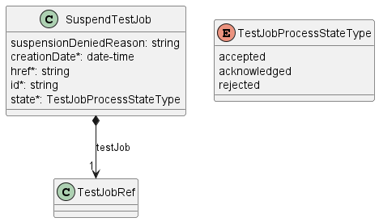

**Figure 41. Use Case 17: Retrieve Suspend Test Job List - Model**

## 6.18. Use Case 18: Retrieve Suspend Test Job by Identifier

The Buyer/Client can get detailed information about the Suspend Test Job 
from the Seller/Server by using a `GET /suspendTestJob/{{id}}` operation. 
The payload returned in the response is a full representation of Suspend 
Test Job and includes all attributes the Buyer/Client has provided while 
sending a Suspend Test Job create request, together with additional 
attributes set by Seller/Server. 

Get List and Get by Identifier operations return different representations
of Suspend Test Job. Get List returns the `SuspendTestJob_Find` object
which is a subset of the `SuspendTestJob` returned by the Get by Identifier 
operation. A response to a Get by Identifier for a `SuspendTestJob` with
`id=aea2769a-23f3-4ddc-b095-542a63b12481` would return exactly the same response as
presented in [section 6.15.3](#6153-suspend-test-monitoring-job-response).

**[R96]** In case `id` does not allow finding a `SuspendTestJob` in 
Seller/Server's system, an error response `Error404` **MUST** be returned. 

**[R97]** The Seller/Server **MUST** include following attributes in the
`SuspendTestJob` object in the response:

- `id`
- `testJob`
- `state`

**[R98]** The Seller **MUST** provide all remaining optional attributes if they
were previously set by the Buyer or the Seller. 

## 6.19. Use Case 19: Resume Test Job

Due to the need for reserving resources on the SOF side, the resume operation 
associated with Test Job may exhibit prolonged duration. 
Consequently, this operation is implemented through a separate lifecycle 
process.

### 6.19.1. Interaction flow

The flow of this use case is shown in Figure 42.

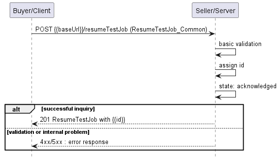

**Figure 42. Use Case 19 - Resume Test Job create request flow**

The Buyer/Client sends a request with a `ResumeTestJob_Create` type in 
the body. The Seller/Server performs request validation, assigns an `id`, and 
returns the `ResumeTestJob` type in the response body, with a `state` set to 
`acknowledged`. Further processing is performed by Seller/Server which will in 
case of success resume the Test Job. The Buyer/Client can track 
the progress of the process either by subscribing for notifications or by
periodically polling the `ResumeTestJob`. The two patterns are presented 
in the following diagrams.


**Figure 43. Resume Test Job progress tracking - Notifications**


**Figure 44. Resume Test Job progress tracking - Polling**

**_Note_**: The Resume Test Job process is altering the state of the job 
itself. It is important to note that notifications resulting from changes in the 
state of the Test Job are not represented in Figures 43 and 44.

**_Note_**: The context of notifications is not a part of the considered use
case itself. It is presented to show the big picture of end-to-end flow. This
applies also to all further use case flow diagrams with notifications.

### 6.19.2. Resume Test Job Request

Figure 45 presents the most important part of the data model used during 
the Resume Test Job request (`POST /resumeTestJob`) and response. 
The model of the request message - `ResumeTestJob_Create` is a subset of 
the `ResumeTestJob` model and contains only attributes that can (or must) 
be set by the Buyer/Client. The Seller/Server (SOF) then enriches the entity in 
the response with additional information.

**_Note:_** `ResumeTestJob_Create` is an entity
used by the Buyer/Client to make a request. `ResumeTestJob` is an entity
used by the Seller/Server to provide a response. The request entity has a
subset of attributes of the response entity. Thus for visibility of these
shared attributes `ResumeTestJob_Common` has been
introduced (this class is not supposed to be used directly in the exchange).

The `testJob` section of `ResumeTestJob_Common` is used to specify
which Test Job object is a subject of the resume process (relationship by
reference using the `id` of the Job).

The full list of attributes is available in [Section 7](#7-api-details) and in
the API specification which is an integral part of this standard.

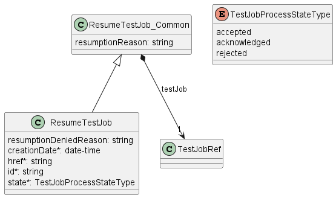

**Figure 45. Resume Test Job Key Entities** 

To send a Resume Test Job request the Buyer/Client uses the 
`resumeTestJob` operation from the API: `POST /resumeTestJob`. 

The example below shows a request to create a resumption process for
`TestJob` that was created in section [6.6.2](#662-create-test-monitoring-job-request). 

```json
{
  "testJob": {
    "href": "{{baseUrl}}/serviceFunctionTesting/v1/testJob/755e55e2-72b0-4e3b-af00-693e3beac691",
    "id": "755e55e2-72b0-4e3b-af00-693e3beac691"
  },
  "resumptionReason": "Resume Test Job sample"
}
```

**[R99]** The Buyer/Client Resume Test Job request **MUST** include the 
following attributes: [MEF136.1 R46]
- `testJob.id`

**[R100]** The Test Job **MUST** be in the Suspended state in order to be 
resumed. [MEF136.1 R47]

### 6.19.3. Resume Test Job Response

Entities used for providing a response to Resume Test Job requests are
presented in Figure 45. The Seller/Server responds with a `ResumeTestJob` 
type, which adds some attributes (like `id` or `state`) to the 
`ResumeTestJob_Create` that was used in the Buyer/Client request.

**_Note_**: The term "Response Code" used in the Business Requirements
maps to HTTP response code, where `2xx` indicates _Success_ and `4xx` or `5xx`
indicate _Failure_.

The following snippet presents the Seller/Server response. It has the same 
structure as in the retrieve by identifier operation.

```json
{
  "testJob": {
    "href": "{{baseUrl}}/serviceFunctionTesting/v1/testJob/755e55e2-72b0-4e3b-af00-693e3beac691",
    "id": "755e55e2-72b0-4e3b-af00-693e3beac691"
  },
  "resumptionReason": "Resume Test Job sample",
  "creationDate": "204-06-19T12:58:17.088Z", << added by SOF >>
  "href": "{{baseUrl}}/serviceFunctionTesting/v1/resumeTestJob/aea2769a-23f3-4ddc-b095-542a63b12481", << added by SOF >>
  "id": "aea2769a-23f3-4ddc-b095-542a63b12481", << added by SOF >>
  "state": "acknowledged" << added by SOF >>
}
```

Attributes that are set by the Seller/Server in the response are marked with the
`<< added by SOF >>` tag. 

**[R101]** If the request is successful, the Seller/Server **MUST** resume all testing 
and measurement being performed on the Test Job and place the Test Job in the `inProgress`
state when they receive a Resume Test Job request from the Buyer/Client [MEF136.1 R48]

**[R102]** If the request is not successful, the Seller/Server **MUST NOT** resume the
Test Job, and the Test Job remains in the `suspended` state. [MEF136.1 R49]

**[R103]** If the Seller/Server encounters errors, they **MUST** return an error with
 explanation to the Buyer/Client. [MEF136.1 R50]

**[R104]** The Seller/Server's response **MUST** include all and unchanged 
attributes' values as provided by the Buyer/Client in the request.

**[R105]** The Seller/Server **MUST** specify the following attributes in a 
response: 
- `id`
- `state`
- `creationDate`

**[100]** The `id` **MUST** remain the same value for the life of the 
Test Job.

In case the Seller/Server cannot successfully validate the request, the Resume 
Test Job process fails, which results in setting the state to `declined` with 
a proper explanation in `resumptionDeniedReason`. This includes situations when:
- `id` does not allow to find a `TestJob` that is to be resumed in 
Seller/Server's system
- Test Job is in a state that does not allow for resumption.


### 6.19.4. Resume Test Job State Machine

Figure 46 presents the Resume Test Job state machine:


**Figure 46. Resume Test Job State Machine**


After receiving the request, the Seller/Server (SOF) has assigned a `ResumeTestJob` 
Identifier to it.  If the request attributes fail validation, the `ResumeTestJob` 
request moves to the `rejected` state. Next, the Seller/Server performs all the remaining 
business and time-consuming validations. At this point, an Error response cannot
be provided anymore, so the job moves to a `declined` state if some issues 
are found. The `resumeTestJob.resumptionDeniedReason` acts as a 
placeholder to provide a detailed description of what caused the problem. If 
validation is successful, `ResumeTestJob` moves to the `accepted` state.
When the Resume Test Job process is finished, it moves to the `completed` state. 
This causes the `TestJob` state to change to `inProgress`.

Description and mapping of the Resume Test Job States are the same as in 
table 10.

## 6.20. Use Case 20: Retrieve Resume Test Job List

The Buyer/Client can retrieve a list of Resume Test Job objects by using 
a `GET /resumeTestJob` operation with desired filtering criteria.

**[O13]** The Buyer/Client Retrieve List of Resume Test Jobs request 
**MAY** contain none or more of the following attributes: 

- `testJobId`
- `state`
- `creationDate.gt`
- `creationDate.lt`

```
https://serverRoot/mefApi/legato/serviceFunctionTesting/v1/resumeTestJob?state=acknowledged&limit=10&offset=0
```

The example above shows a Buyer/Client's request to get all Resume Test 
Job objects that are in the `acknowledged` state. Additionally, the Buyer/Client
asks only for a first (`offset=0`) pack of 10 results (`limit=10`) to be 
returned. The correct response (HTTP code `200`) in the response body contains a
list of `ResumeTestJob_Find` objects matching the criteria. Details 
related to pagination are described in [section 7.1.2](#712-response-pagination).

**[R106]** The Seller **MUST** include following attributes in the
`ResumeTestJob_Find` object in the response: 

- `id`
- `testJobId`
- `state`

**[R107]** In case no items matching the criteria are found, the Seller/Server 
**MUST** return a valid response with an empty list. 

Figure 47 presents entities related to the use case. 


**Figure 47. Use Case 20: Retrieve Resume Test Job List - Model**

## 6.21. Use Case 21: Retrieve Resume Test Job by Identifier

The Buyer/Client can get detailed information about the Resume Test Job 
from the Seller/Server by using a `GET /resumeTestJob/{{id}}` operation. 
The payload returned in the response is a full representation of the Resume 
Test Job and includes all attributes the Buyer/Client has provided while 
sending a Resume Test Job create request, together with additional 
attributes set by Seller/Server. 

Get List and Get by Identifier operations return different representations
of Resume Test Job. Get List returns the `ResumeTestJob_Find` object 
which is a subset of the `ResumeTestJob` returned by the Get by Identifier 
operation. A response to a Get by Identifier for a `ResumeTestJob` with
`id=aea2769a-23f3-4ddc-b095-542a63b12481` would return exactly the same response as
presented in [section 6.18.3](#6183-resume-test-monitoring-job-response).

**[R108]** In case `id` does not allow finding a `ResumeTestJob` 
in Seller/Server's system, an error response `Error404` **MUST** be returned.

**[R109]** The Seller/Server **MUST** include following attributes in the
`ResumeTestJob` object in the response: 

- `id`
- `testJob`
- `state`

**[R110]** The Seller **MUST** provide all remaining optional attributes if they
were previously set by the Buyer or the Seller. 

## 6.22. Use Case 22: Register for Notifications

The Buyer/Client can track the lifecycle of the Test
objects by subscribing to notifications. An exemplary use case for exchanging
notifications is presented in Figure 48. 


**Figure 48. Testing Notification Example**

The Seller/Server communicates with the Buyer/Client with Notifications provided 
that:

- Buyer/Client supports a notification mechanism
- Buyer/Client has registered to receive notifications from the Seller/Server

To register for notifications the Buyer/Client uses the `registerListener` 
operation from the API: `POST /hub`. The request contains only 2 attributes:

- `callback` - mandatory, to provide the callback address the events will be
  notified to,
- `query` - optional, to provide the required types of event.

Figure 49 shows all entities involved in the Notification use cases.


**Figure 49. Service Function Testing Notification Data Model**

By using a request in the following snippet, the Buyer/Client subscribes for 
notification of all types of events. Those are:

- `testJobCreateEvent`
- `testJobStateChangeEvent`
- `testJobAttributeValueChangeEvent`
- `testProfileCreateEvent`
- `testProfileStateChangeEvent`
- `testProfileAttributeValueChangeEvent`
- `testProfileDeleteEvent`

```json
{
  "callback": "https://bus.com/listenerEndpoint"
}
```

**[O14]** The Seller/Server **MAY** support subscription to Test Job 
Notifications Use Case.

**[O15]** The Buyer/Client **MAY** support subscription to Test Profile 
Notifications Use Case.

**[O16]** The Seller/Server **MAY** support unsubscribing from Test 
Job Notifications Use Case.

**[O17]** The Buyer/Client **MAY** support unsubscribing from Test Profile
Notifications Use Case.

If the Buyer/Client wishes to receive only notifications of a certain type, a 
`query` must be added:

```json
{
  "callback": "https://bus.com/listenerEndpoint",
  "query": "eventType=testJobStateChangeEvent"
}
```

**[R111]** The Buyer/Client’s Subscribe to Test Job Notifications request 
**MUST** include: [MEF136.1 R82]
- Callback address
- Zero or more notification types

If the Buyer/Client wishes to subscribe to 2 different types of events, there 
are 2 possible syntax variants [[TMF630](#8-references)]:

```
eventType=testJobStateChangeEvent,testJobAttributeValueChangeEvent
```

or

```
eventType=testJobStateChangeEvent&eventType=testJobAttributeValueChangeEvent
```

The `query` formatting complies with RFC3986 [RFC3986](#8-references).
According to it, every attribute defined in the Event model (from notification
API) can be used in the `query`. However, this standard requires only
`eventType` attribute to be supported.

The Seller/Server responds to the subscription request by adding the `id` of the
subscription to the message that must be further used for unsubscribing.

```json
{
  "id": "00000000-0000-0000-0000-000000000678",
  "callback": "https://bus.com/listenerEndpoint",
  "query": "eventType=testJobStateChangeEvent"
}
```

Example of a final address that the Notifications will be sent to (for
`testJobStateChangeEvent`):

- `https://bus.com/listenerEndpoint/mefApi/legato/serviceFunctionTestingNotification/v1/listener/testJobStateChangeEvent`

**[R112]** If successful, the Seller/Server response **MUST** indicate success and include the 
Register Notification Identifier and echo back all Buyer/Client provided attributes [MEF136.1 R83]

**[R113]** If successful, the Seller/Server **MUST** begin sending the appropriate notifications 
to the Buyer/Client. [MEF136.1 R84]

**[R114]** The Seller/Server **MUST NOT** send notifications if the Buyer/Client has not registered for them. [MEF136.1 R85]

**[R115]**	If unsuccessful, the Seller/Server **MUST NOT** return a Register Notification Identifier. [MEF136.1 R86]

**[R116]**	If the Seller/Server experiences any errors, they **MUST** return an error indication to the Buyer/Client. [MEF136.1 R87]

## 6.23. Use Case 23: Send Notification

Notifications are used to asynchronously inform the Buyer/Client about the 
respective objects and attributes changes.

Figure 50 presents notifications produced by Seller/Server for the whole lifecycle
of `TestJob` assuming that Buyer/Client subscribed to all event types.


**Figure 50. Test Job lifecycle with all Notifications**

After a successful Notification subscription, the Seller/Server sends a 
`TestJob` create request. The SOF responds with `TestJob` in 
an `acknowledged` state. Creation of `TestJob` is notified with a
`testJobCreateEvent`. When the validation is successful and the Test 
Job is not immediate, it moves to `scheduled` and a 
`testJobStateChangeEvent` is sent. 
When the scheduled start time is reached, `TestJob` moves to `inProgress`
state and the `testJobStateChangeEvent` is sent. 
Additional actions, like suspension or modification trigger `testJobStateChangeEvent`. 
In addition, in the case of `TestJob` modification, Seller/Server produces 
`testJobAttributeValueChangeEvent` notification. 

The following snippets present an example of `testJobCreateEvent` and 
`testJobStateChangeEvent`.

```json
{
  "eventId": "event-001",
  "eventTime": "2021-06-03T15:56:08.559Z",
  "eventType": "testJobCreateEvent",
  "event": {
    "id": "00000000-4444-5555-6666-000000000987"
  }
}
```

```json
{
  "eventId": "event-002",
  "eventType": "testJobStateChangeEvent",
  "eventTime": "204-01-15T20:45:24.796Z",
  "event": {
    "id": "00000000-3333-4444-5555-000000004567",
    "href": "{{baseUrl}}/serviceFunctionTesting/v1/00000000-3333-4444-5555-000000004567"
  }
}
```

**_Note_**: the body of the event carries only the source object's `id`. The
Buyer/Client needs to query it later by `id` to get details. 

**_Note:_** The state change notification is sent only when the state
attribute changes its value. There are no state change notifications
sent upon Test Job creation.

**[R117]** The Seller/Server **MUST** include the following attributes in the 
Notification: [MEF136.1 R93]
- Event indentifier
- Notification type
- Event time

**[R118]** The Seller/Server **MUST** send Notifications to the Buyer/Client that 
have registered for them.

**[R119]** The Seller/Server **MUST NOT** send Notifications to Buyer/Client 
that have not registered for them.

## 6.24. Use Case 24: Unregister for Notifications

To stop receiving events, the Buyer/Client has to use the `unregisterListener`
operation from the `DELETE /hub/{id}` endpoint. The `id` is the identifier
received from the Seller/Server during the listener registration.

**[R120]** If successful, the Seller/Server response **MUST** indicate success [MEF136.1 R89]

**[R121]** If successful, the Seller/Server **MUST** stop sending the appropriate notifications 
to the Buyer/Client. [MEF136.1 R90]

**[R122]**	If unsuccessful, the Seller/Server **MUST NOT** stop sending the appropriate
notifications to the Buyer/Client. [MEF136.1 R91]

**[R123]**	If the Seller/Server experiences any errors, they **MUST** return an error indication
to the Buyer/Client. [MEF136.1 R92]

<div class="page"/>

# 7. API Details

## 7.1. API patterns

### 7.1.1. Indicating errors

Erroneous situations are indicated by appropriate HTTP responses. An error
response is indicated by HTTP status 4xx (for client errors) or 5xx (for server
errors) and the appropriate response payload. The Service Function Testing API 
uses the error responses as depicted and described below.

Implementations can use HTTP error codes not specified in this standard in
compliance with rules defined in RFC 7231 [[RFC7231](#8-references)]. In such a
case, the error message body structure might be aligned with the `Error`.


**Figure 51. Data model types to represent an erroneous response**

#### 7.1.1.1. Type Error

**Description:** Standard Class used to describe API response error Not intended to be used directly. The `code` in the HTTP header is used as a discriminator for the type of error returned in runtime.
<table id="T_Error">
    <thead style="font-weight:bold;">
        <tr>
            <td>Name</td>
            <td>Type</td>
            <td>Description</td>
        </tr>
    </thead>
    <tbody>
        <tr>
            <td>message</td>
            <td>string</td>
            <td>Text that provides mode details and corrective actions related to the error. This can be shown to a client user.</td>
        </tr><tr>
            <td>reason*</td>
            <td>string</td>
            <td>Text that explains the reason for the error. This can be shown to a client user.</td>
        </tr><tr>
            <td>referenceError</td>
            <td>uri</td>
            <td>URL pointing to documentation describing the error.</td>
        </tr>
    </tbody>
</table>

#### 7.1.1.2. Type Error400

**Description:** 'Bad Request. (https://tools.ietf.org/html/rfc7231#section-6.5.1)'

Inherits from:
- <a href="#T_Error">Error</a>

<table id="T_Error400">
    <thead style="font-weight:bold;">
        <tr>
            <td>Name</td>
            <td>Type</td>
            <td>Description</td>
        </tr>
    </thead>
    <tbody>
        <tr>
            <td>code*</td>
            <td><a href="#T_Error400Code">Error400Code</a></td>
            <td></td>
        </tr>
    </tbody>
</table>

#### 7.1.1.3. `enum` Error400Code

**Description:** One of the following error codes:
- missingQueryParameter: The URI is missing a required query-string 
  parameter
- missingQueryValue: The URI is missing a required query-string 
  parameter value
- invalidQuery: The query section of the URI is invalid
- invalidBody: The request has an invalid body.

#### 7.1.1.4. Type Error401

**Description:** 'Unauthorized.  (https://tools.ietf.org/html/rfc7235#section-3.1)'

Inherits from:
- <a href="#T_Error">Error</a>

<table id="T_Error401">
    <thead style="font-weight:bold;">
        <tr>
            <td>Name</td>
            <td>Type</td>
            <td>Description</td>
        </tr>
    </thead>
    <tbody>
        <tr>
            <td>code*</td>
            <td><a href="#T_Error401Code">Error401Code</a></td>
            <td></td>
        </tr>
    </tbody>
</table>

#### 7.1.1.5. `enum` Error401Code

**Description:** One of the following error codes:
- missingCredentials: No credentials provided
- invalidCredentials: Provided credentials are invalid or expired.


#### 7.1.1.6. Type Error403

**Description:** Forbidden. This code indicates that the server understood the request but refused to authorize it. (https://tools.ietf.org/html/rfc7231#section-6.5.3)

Inherits from:
- <a href="#T_Error">Error</a>

<table id="T_Error403">
    <thead style="font-weight:bold;">
        <tr>
            <td>Name</td>
            <td>Type</td>
            <td>Description</td>
        </tr>
    </thead>
    <tbody>
        <tr>
            <td>code*</td>
            <td><a href="#T_Error403Code">Error403Code</a></td>
            <td></td>
        </tr>
    </tbody>
</table>

#### 7.1.1.7. `enum` Error403Code

**Description:** This code indicates that the server understood the request but refuses to authorize it because of one of the following error codes:
- accessDenied: Access denied
- forbiddenRequester: Forbidden requester
- tooManyUsers: Too many users.


#### 7.1.1.8. Type Error404

**Description:** Resource for the requested path not found. (https://tools.ietf.org/html/rfc7231#section-6.5.4)

Inherits from:
- <a href="#T_Error">Error</a>

<table id="T_Error404">
    <thead style="font-weight:bold;">
        <tr>
            <td>Name</td>
            <td>Type</td>
            <td>Description</td>
        </tr>
    </thead>
    <tbody>
        <tr>
            <td>code*</td>
            <td>string</td>
            <td>The following error code:
- notFound: A current representation of the target resource 
  not found.</td>
        </tr>
    </tbody>
</table>

#### 7.1.1.9. Type Error408

**Description:** Request Time-out (https://tools.ietf.org/html/rfc7231#section-6.5.7)

Inherits from:
- <a href="#T_Error">Error</a>

<table id="T_Error408">
    <thead style="font-weight:bold;">
        <tr>
            <td>Name</td>
            <td>Type</td>
            <td>Description</td>
        </tr>
    </thead>
    <tbody>
        <tr>
            <td>code*</td>
            <td>string</td>
            <td>List of supported error codes:
- timeOut: Request Time-out - indicates that the server did not receive a complete request message within the time that it was prepared to wait.</td>
        </tr>
    </tbody>
</table>

#### 7.1.1.10. Type Error409

**Description:** Conflict (https://datatracker.ietf.org/doc/html/rfc7231#section-6.5.8)

Inherits from:
- <a href="#T_Error">Error</a>

<table id="T_Error409">
    <thead style="font-weight:bold;">
        <tr>
            <td>Name</td>
            <td>Type</td>
            <td>Description</td>
        </tr>
    </thead>
    <tbody>
        <tr>
            <td>code*</td>
            <td>string</td>
            <td>The following error code:
- conflict: The client has provided a value whose semantics are not appropriate for the property.</td>
        </tr>
    </tbody>
</table>

#### 7.1.1.11. Type Error422

**Description:** Unprocessable entity due to a business validation problem. (https://datatracker.ietf.org/doc/html/rfc4918#section-11.2)

Inherits from:
- <a href="#T_Error">Error</a>

<table id="T_Error422">
    <thead style="font-weight:bold;">
        <tr>
            <td>Name</td>
            <td>Type</td>
            <td>Description</td>
        </tr>
    </thead>
    <tbody>
        <tr>
            <td>code*</td>
            <td><a href="#T_Error422Code">Error422Code</a></td>
            <td></td>
        </tr><tr>
            <td>propertyPath</td>
            <td>string</td>
            <td>A pointer to a particular property of the payload that caused the validation issue. It is highly recommended that this property should be used.
Defined using JavaScript Object Notation (JSON) Pointer (https://tools.ietf.org/html/rfc6901).</td>
        </tr>
    </tbody>
</table>

#### 7.1.1.12. `enum` Error422Code

**Description:** One of the following error codes:
- missingProperty: The property that was expected is not present in the
  payload
- invalidValue: The property has an incorrect value
- invalidFormat: The property value does not comply with the expected 
  value format
- referenceNotFound: The object referenced by the property cannot be 
  identified in the target system
- unexpectedProperty: Additional, not expected property has been 
  provided
- tooManyRecords: The number of records to be provided in the response
  exceeds the threshold
- otherIssue: Other problem was identified (detailed information
  provided in a reason).


#### 7.1.1.13. Type Error500

**Description:** Internal Server Error. (https://tools.ietf.org/html/rfc7231#section-6.6.1)

Inherits from:
- <a href="#T_Error">Error</a>

<table id="T_Error500">
    <thead style="font-weight:bold;">
        <tr>
            <td>Name</td>
            <td>Type</td>
            <td>Description</td>
        </tr>
    </thead>
    <tbody>
        <tr>
            <td>code*</td>
            <td>string</td>
            <td>The following error code:
- internalError: Internal server error - the server encountered an unexpected condition that prevented it from fulfilling the request.</td>
        </tr>
    </tbody>
</table>

#### 7.1.1.14. Type Error501

**Description:** Not Implemented. Used in case Seller is not supporting an optional operation (https://tools.ietf.org/html/rfc7231#section-6.6.2)

Inherits from:
- <a href="#T_Error">Error</a>

<table id="T_Error501">
    <thead style="font-weight:bold;">
        <tr>
            <td>Name</td>
            <td>Type</td>
            <td>Description</td>
        </tr>
    </thead>
    <tbody>
        <tr>
            <td>code*</td>
            <td>string</td>
            <td>The following error code:
- notImplemented: Method not supported by the server.</td>
        </tr>
    </tbody>
</table>

### 7.1.2. Response pagination

A response to retrieve a list of results (e.g. `GET /testJob`) can
be paginated. The Buyer/Client can specify the following query attributes
related to pagination:

- `limit` - number of expected list items
- `offset` - offset of the first element in the result list

The filtering and pagination attributes must be specified in URI query format
[RFC3986](#8-references).The Seller/Server returns a list of elements that 
comply with the requested `limit`. If the requested `limit` is higher than the 
supported list size the smaller list result is returned. In that case, the size 
of the result is returned in the header attribute `X-Result-Count`. The Seller 
can indicate that there are additional results available using:

- `X-Total-Count` header attribute with the total number of available results
- `X-Pagination-Throttled` header set to `true`

**[R124]** Seller **MUST** use either `X-Total-Count` or
`X-Pagination-Throttled` to indicate that the page was truncated and additional
results are available.

## 7.2. API Data model

Figure 52 presents the whole Service Function Testing data model. The data
types, requirements related to them, and mapping to MEF W136.1 specification are
discussed later in this section.


**Figure 52. Service Function Testing Data Model**


### 7.2.1 Test Job

#### 7.2.1.1 Type TestJob

**Description:** A definition of Test Job for a specific Service Identifier.

Inherits from:
- <a href="#T_TestJob_Common">TestJob_Common</a>


<table id="T_TestJob" style="width:100%">
    <thead style="font-weight:bold">
        <tr>
            <td>Name</td>
            <td style="width:15%">Type</td>
            <td>M/O</td>
            <td>Description</td>
            <td>MEF W136.1</td>
        </tr>
    </thead>
    <tbody>
        <tr>
        <td>id</td>
            <td>string</td>
            <td>M</td>
            <td>The identifier of the Test Job.</td>
            <td>Test Job Identifier</td>
        </tr><tr>
        <td>state</td>
            <td><a href="#T_TestJobStateType">TestJobStateType</a></td>
            <td>M</td>
            <td></td>
            <td>Test Job State</td>
        </tr><tr>
        <td>actualStartDateTime</td>
            <td>date-time<br/><span style="font-size:10px;font-style:italic">format = date-time</span></td>
            <td>O</td>
            <td>The actual start date and time that a test job started.</td>
            <td>Actual Start Date Time</td>
        </tr><tr>
        <td>actualEndDateTime</td>
            <td>date-time<br/><span style="font-size:10px;font-style:italic">format = date-time</span></td>
            <td>O</td>
            <td>The actual end date and time of the test job.</td>
            <td>Actual End Date Time</td>
        </tr>
    </tbody>
</table>

#### 7.2.1.2 Type TestJob_Common

**Description:** A definition of Test Job for a specific Service Identifier.

<table id="T_TestJob_Common" style="width:100%">
    <thead style="font-weight:bold">
        <tr>
            <td>Name</td>
            <td style="width:15%">Type</td>
            <td>M/O</td>
            <td>Description</td>
            <td>MEF W136.1</td>
        </tr>
    </thead>
    <tbody>
        <tr>
        <td>name</td>
            <td>string</td>
            <td>O</td>
            <td>The name of the Test Job.</td>
            <td>Test Job Name</td>
        </tr><tr>
        <td>description</td>
            <td>string</td>
            <td>O</td>
            <td>A description of the Test Job.</td>
            <td>Test Job Descrip-tion</td>
        </tr><tr>
        <td>startDateTime</td>
            <td>date-time<br/><span style="font-size:10px;font-style:italic">format = date-time</span></td>
            <td>O</td>
            <td>The start date and time of the test job. If the attribute is empty the test jobs starts immediately.</td>
            <td>Start Date Time</td>
        </tr><tr>
        <td>endDateTime</td>
            <td>date-time<br/><span style="font-size:10px;font-style:italic">format = date-time</span></td>
            <td>O</td>
            <td>The end date and time of the Test Job. If the attribute is empty the test job runs forever.</td>
            <td>End Date Time</td>
        </tr><tr>
        <td>recurrencePeriod</td>
            <td><a href="#T_RecurrencePeriodType">RecurrencePeriodType</a></td>
            <td>O</td>
            <td></td>
            <td>Recurrence Period</td>
        </tr><tr>
        <td>testProfile</td>
            <td><a href="#T_TestProfileRefOrValue">TestProfileRefOrValue</a></td>
            <td>O</td>
            <td></td>
            <td>Test Profile Identifier</td>
        </tr><tr>
        <td>validFor</td>
            <td>date-time<br/><span style="font-size:10px;font-style:italic">format = date-time</span></td>
            <td>O</td>
            <td>The last date that the Test Job is valid.</td>
            <td>Valid For</td>
        </tr><tr>
        <td>relatedService</td>
            <td><a href="#T_ServiceRef">ServiceRef</a></td>
            <td>O</td>
            <td></td>
            <td>Related Service</td>
        </tr><tr>
        <td>testMeasureAttributes</td>
            <td><a href="#T_TestMeasureAttributes">TestMeasureAttributes</a></td>
            <td>O</td>
            <td></td>
            <td>Test Specific Attributes </td>
        </tr>
    </tbody>
</table>

#### 7.2.1.3 Type TestJob_Create

**Description:** A definition of Test Job for a specific Service Identifier.

Inherits from:
- <a href="#T_TestJob_Common">TestJob_Common</a>


#### 7.2.1.4 Type TestJob_Find

**Description:** This class represents a single list item for the response of  `listTestJob`

<table id="T_TestJob_Find" style="width:100%">
    <thead style="font-weight:bold">
        <tr>
            <td>Name</td>
            <td style="width:15%">Type</td>
            <td>M/O</td>
            <td>Description</td>
            <td>MEF W136.1</td>
        </tr>
    </thead>
    <tbody>
        <tr>
        <td>id</td>
            <td>string</td>
            <td>O</td>
            <td>A unique identifier for the Test Job assigned by the Seller/Server.</td>
            <td>Test Job Identifier</td>
        </tr><tr>
        <td>name</td>
            <td>string</td>
            <td>O</td>
            <td>The name of the Test Job..</td>
            <td>Test Job Name</td>
        </tr><tr>
        <td>testProfileId</td>
            <td>string</td>
            <td>O</td>
            <td>A unique identifier of the referenced Test Profile.</td>
            <td>Test Profile Identifier</td>
        </tr><tr>
        <td>relatedServiceId</td>
            <td>string</td>
            <td>O</td>
            <td>A unique identifier of the service to be tested</td>
            <td>Related Service</td>
        </tr><tr>
        <td>startDateTime</td>
            <td>string</td>
            <td>O</td>
            <td>The start date and time of the test job.</td>
            <td>Start Date Time</td>
        </tr><tr>
        <td>endDateTime</td>
            <td>string</td>
            <td>O</td>
            <td>The end date and time of the test job.</td>
            <td>End Date Time</td>
        </tr>
    </tbody>
</table>

#### 7.2.1.5 Type TestJobProcessResponse

**Description:** 

<table id="T_TestJobProcessResponse" style="width:100%">
    <thead style="font-weight:bold">
        <tr>
            <td>Name</td>
            <td style="width:15%">Type</td>
            <td>M/O</td>
            <td>Description</td>
            <td>MEF W136.1</td>
        </tr>
    </thead>
    <tbody>
        <tr>
        <td>testJobId</td>
            <td>string</td>
            <td>O</td>
            <td>The identifier of the Test Job.</td>
            <td>Test Job Identifier</td>
        </tr><tr>
        <td>state</td>
            <td><a href="#T_TestJobProcessStateType">TestJobProcessStateType</a></td>
            <td>O</td>
            <td></td>
            <td>Test Job State</td>
        </tr><tr>
        <td>deniedReason</td>
            <td>string</td>
            <td>O</td>
            <td>If the request is denied by the Seller/Server, the Seller/Server provides  a reason to the Buyer/Client using this attribute.</td>
            <td></td>
        </tr>
    </tbody>
</table>

#### 7.2.1.6 Type TestJobRef

**Description:** A reference to a Test Job resource

<table id="T_TestJobRef" style="width:100%">
    <thead style="font-weight:bold">
        <tr>
            <td>Name</td>
            <td style="width:15%">Type</td>
            <td>M/O</td>
            <td>Description</td>
            <td>MEF W136.1</td>
        </tr>
    </thead>
    <tbody>
        <tr>
        <td>href</td>
            <td>string</td>
            <td>O</td>
            <td>Hyperlink to the referenced Test Job</td>
            <td></td>
        </tr><tr>
        <td>id</td>
            <td>string</td>
            <td>M</td>
            <td>Identifier of the referenced Test Job</td>
            <td>Test Job Identifier</td>
        </tr>
    </tbody>
</table>

#### 7.2.1.7 `enum` TestJobStateType

**Description:** The state of the Test Job.

| State                    | MEF W136.1 name           | Description                                                                                                                                                                                                                                                                                                                                                                                                                                                                                                                                                                         |
| -------------------------| -----------------------| ------------------------------------------------------------------------------------------------------------------------------------------------------------------------------------------------------------------------------------------------------------------------------------------------------------------------------------------------------------------------------------------------------------------------------------------------------------------------------------------------------------------------------------------------------------------------------------|
| `acknowledged`           | ACKNOWLEDGED           | The Create Test Job request has been received from the Buyer/Client and the Sell-er/Server has assigned a Test Job Identifier to it.  If the request attributes fail validation, the Create Test Job moves to the REJECTED state.  If the attributes pass validation, it is then determined if the Create Test Job Start Date Time is immediate or if the Create Test Job Start Date Time indicates that the Test Job is to be scheduled for a later date time.  If the Test Job is to be scheduled the Test Job moves to the SCHEDULED state and awaits the scheduled date and time.  If the Test Job is to be performed immediately, the Test Job moves to the IN_PROGRESS state and Test Results begin. |
| `assessing_modification` | ASSESSING_MODIFICATION | A Modify Test Job request while the Test Job is in the SUSPEND or SCHEDULED state.  If the Modify Test Job is accepted, the Test Job is updated. If the Modify Test Job is declined, the Test Job is not updated and returns to the SUSPEND or SCHEDULED state. |
| `cancelled`              | CANCELLED              | A Cancel Test Job request is received from the Buyer/Client.  If the request is accepted, the Test Job moves to the CANCELLED state.  The Test Job must be in the IN_PROGRESS, SCHEDULED, or SUSPEND, state.|
| `completed`              | COMPLETED              | The Test Job has reached the End Date Time or has completed all Test Measurements and provided Test Results.|
| `inProgress`             | IN-PROGRESS            | Whether an immediate request or a scheduled request, the Test Job moves to the IN_PROGRESS state when it begins performing Test Results.  If a Cancel Test Job request is received and accepted, the Test Job moves to the CANCELLED state.  If the Cancel Test Job request is declined, the Test Job returns to the IN_PROGRESS state and continues Test Results until they are completed.  If a Suspend Test Job request is received, the Test Job moves to the SUSPEND state.|
| `rejected`               | REJECTED               | The Create Test Job request fails validation and is rejected.|
| `scheduled`              | SCHEDULED              | The Test Job is scheduled to start at a later time.  The Test Job stays in the SCHEDULED state until the Start Date and Time is reached.  The Test Job moves to IN_PROGRESS when the Start Date and Time is reached.  A Test Job with the state SCHEDULED can be moved to the SUSPEND or CANCELLED state.|
| `suspended`              | SUSPENDED              | A Test Job in the IN_PROGRESS or SCHEDULED state receives a Suspend Test Job request.  The Test Job moves to the SUSPEND state. A Test Job cannot be modified unless it is in the SUSPEND state.|


<table id="T_TestJobStateType">
    <thead style="font-weight:bold;">
        <tr>
            <td>Value</td>
            <td>MEF W136.1</td>
        </tr>
    </thead>
    <tbody>
        <tr>
            <td>acknowledged</td>
            <td>ACKNOWLEDGED</td>
        </tr><tr>
            <td>assessing_modification</td>
            <td>ASSESSING_MODIFICATION</td>
        </tr><tr>
            <td>cancelled</td>
            <td>CANCELLED</td>
        </tr><tr>
            <td>completed</td>
            <td>COMPLETED</td>
        </tr><tr>
            <td>inProgress</td>
            <td>IN_PROGRESS</td>
        </tr><tr>
            <td>rejected</td>
            <td>REJECTED</td>
        </tr><tr>
            <td>scheduled</td>
            <td>SCHEDULED</td>
        </tr><tr>
            <td>suspended</td>
            <td>SUSPENDED</td>
        </tr>
    </tbody>
</table>

#### 7.2.1.8 `enum` TestJobProcessStateType

**Description:** The state of process related to Test Job

| state          | MEF W136.1 name | Description                                                                                                                                                                                                                                                                                                                                                                                                                                           |
| -------------- | ------------ | ------------------------------------------------------------------------------------------------------------------------------------------------------------------------------------------------------------------------------------------------------------------------------------------------------------------------------------------------------------------------------------------------------------------------------------------------------|
| `accepted`     | ACCEPTED     | The Modify/Cancel/Resume/Suspend Test Job request has been accepted and processed by the Seller/Server.                                                                                                                                                                                                                                                                                                                                               |
| `acknowledged` | ACKNOWLEDGED | The Modify/Cancel/Resume/Suspend Test Job request has been received by the Seller/Server and has passed basic validation. Test Job Process Identifier is assigned in the Acknowledged state. The request remains in the Acknowledged state until all validations as applicable are completed. If the attributes are validated, the request moves to the Accepted state. If not all attributes are validated, the request moves to the Declined state. |
| `completed`    | COMPLETED    | The Modify/Cancel/Resume/Suspend Test Job request has been completed by the Seller/Server                                                                                                                                                                                                                                                                                                                                            |
| `declined`     | DECLINED     | The Modify/Cancel/Resume/Suspend Test Job request has been declined by the Seller/Server.                                                                                                                                                                                                                                                                                                                                                            |
| `rejected`     | REJECTED     | The Modify/Cancel/Resume/Suspend Test Job request has been rejected by the Seller/Server.                                                                                                                                                                                                                                                                                                                                                            |


<table id="T_TestJobProcessStateType">
    <thead style="font-weight:bold;">
        <tr>
            <td>Value</td>
            <td>MEF W136.1</td>
        </tr>
    </thead>
    <tbody>
        <tr>
            <td>accepted</td>
            <td>ACCEPTED</td>
        </tr><tr>
            <td>acknowledged</td>
            <td>ACKNOWLEDGED</td>
        </tr><tr>
            <td>declined</td>
            <td>DECLINED</td>
        </tr><tr>
            <td>rejected</td>
            <td>REJECTED</td>
        </tr>
    </tbody>
</table>

#### 7.2.1.9 Type TestMeasureAttributes

**Description:** TestMeasureAttributes is used as an extension point for schema to be used that de-fines the  Test Result attributes. The `@type` attribute is used as a discriminator.

<table id="T_TestMeasureAttributes" style="width:100%">
    <thead style="font-weight:bold">
        <tr>
            <td>Name</td>
            <td style="width:15%">Type</td>
            <td>M/O</td>
            <td>Description</td>
            <td>MEF W136.1</td>
        </tr>
    </thead>
    <tbody>
        <tr>
        <td>@type</td>
            <td>string</td>
            <td>M</td>
            <td>The named type must be a subclass of TestMeasureAttributes.</td>
            <td></td>
        </tr>
    </tbody>
</table>

#### 7.2.1.10 Type CancelTestJob

**Description:** Request for cancellation of an existing Test job

Inherits from:
- <a href="#T_CancelTestJob_Common">CancelTestJob_Common</a>


<table id="T_CancelTestJob" style="width:100%">
    <thead style="font-weight:bold">
        <tr>
            <td>Name</td>
            <td style="width:15%">Type</td>
            <td>M/O</td>
            <td>Description</td>
            <td>MEF W136.1</td>
        </tr>
    </thead>
    <tbody>
        <tr>
        <td>cancellationDeniedReason</td>
            <td>string</td>
            <td>O</td>
            <td>If the Cancel Test Job request is denied by the  Seller/Server, the Seller/Server provides a reason to the Buyer/Client using this attribute.</td>
            <td></td>
        </tr><tr>
        <td>creationDate</td>
            <td>date-time<br/><span style="font-size:10px;font-style:italic">format = date-time</span></td>
            <td>O</td>
            <td>Date when Cancel Test Job was created.</td>
            <td></td>
        </tr><tr>
        <td>href</td>
            <td>string</td>
            <td>O</td>
            <td>Hyperlink to the Cancel Test Job entity</td>
            <td></td>
        </tr><tr>
        <td>id</td>
            <td>string</td>
            <td>M</td>
            <td>Unique identifier for the Cancel Test Job that is generated by the Seller/Server when the Cancel Test Job request  &#x60;state&#x60; is set to &#x60;acknowledged&#x60;.</td>
            <td></td>
        </tr>Test Job Identifier<tr>
        <td>state</td>
            <td><a href="#T_TestJobProcessStateType">TestJobProcessStateType</a></td>
            <td>M</td>
            <td></td>
            <td>Test Job State</td>
        </tr>
    </tbody>
</table>

#### 7.2.1.11 Type CancelTestJob_Common

**Description:** Request for cancellation of an existing Test Job

<table id="T_CancelTestJob_Common" style="width:100%">
    <thead style="font-weight:bold">
        <tr>
            <td>Name</td>
            <td style="width:15%">Type</td>
            <td>M/O</td>
            <td>Description</td>
            <td>MEF W136.1</td>
        </tr>
    </thead>
    <tbody>
        <tr>
        <td>cancellationReason</td>
            <td>string</td>
            <td>O</td>
            <td>An optional attribute that allows the Buyer/Client to provide additional detail to the Seller/Server on the reason for cancelling Test Job.</td>
            <td></td>
        </tr><tr>
        <td>testJob</td>
            <td><a href="#T_TestJobRef">TestJobRef</a></td>
            <td>O</td>
            <td></td>
            <td></td>
        </tr>
    </tbody>
</table>

#### 7.2.1.12 Type CancelTestJob_Create

**Description:** Request for cancellation of an existing Test Job

Inherits from:
- <a href="#T_CancelTestJob_Common">CancelTestJob_Common</a>


#### 7.2.1.13 Type CancelTestJob_Find

**Description:** This class represents a single list item for the response of  `listCancelTestJob`

<table id="T_CancelTestJob_Find" style="width:100%">
    <thead style="font-weight:bold">
        <tr>
            <td>Name</td>
            <td style="width:15%">Type</td>
            <td>M/O</td>
            <td>Description</td>
            <td>MEF W136.1</td>
        </tr>
    </thead>
    <tbody>
        <tr>
        <td>creationDate</td>
            <td>date-time<br/><span style="font-size:10px;font-style:italic">format = date-time</span></td>
            <td>O</td>
            <td>Date when Cancel Test Job was created.</td>
            <td></td>
        </tr><tr>
        <td>id</td>
            <td>string</td>
            <td>M</td>
            <td>Unique identifier for the Cancel Test Job that is generated by the Seller/Server when the Cancel Test Job request  &#x60;state&#x60; is set to &#x60;acknowledged&#x60;.</td>
            <td></td>
        </tr><tr>
        <td>testJob</td>
            <td><a href="#T_TestJobRef">TestJobRef</a></td>
            <td>O</td>
            <td></td>
            <td></td>
        </tr><tr>
        <td>state</td>
            <td><a href="#T_TestJobProcessStateType">TestJobProcessStateType</a></td>
            <td>M</td>
            <td></td>
            <td>Test Job State</td>
        </tr>
    </tbody>
</table>

#### 7.2.1.14 Type ModifyTestJob

**Description:** Request for modification of an existing Test job

Inherits from:
- <a href="#T_ModifyTestJob_Common">ModifyTestJob_Common</a>


<table id="T_ModifyTestJob" style="width:100%">
    <thead style="font-weight:bold">
        <tr>
            <td>Name</td>
            <td style="width:15%">Type</td>
            <td>M/O</td>
            <td>Description</td>
            <td>MEF W136.1</td>
        </tr>
    </thead>
    <tbody>
        <tr>
        <td>modificationDeniedReason</td>
            <td>string</td>
            <td>O</td>
            <td>If the Modify Test Job request is denied by the  Seller/Server, the Seller/Server provides a reason to the Buyer/Client using this attribute.</td>
            <td></td>
        </tr><tr>
        <td>creationDate</td>
            <td>date-time<br/><span style="font-size:10px;font-style:italic">format = date-time</span></td>
            <td>O</td>
            <td>Date when Modify Test Job was created.</td>
            <td></td>
        </tr><tr>
        <td>href</td>
            <td>string</td>
            <td>O</td>
            <td>Hyperlink to the Modify Test Job entity</td>
            <td></td>
        </tr><tr>
        <td>id</td>
            <td>string</td>
            <td>M</td>
            <td>Unique identifier for the Modify Test Job that is generated by the Seller/Server when the Modify Test Job request  &#x60;state&#x60; is set to &#x60;acknowledged&#x60;.</td>
            <td></td>
        </tr><tr>
        <td>state</td>
            <td><a href="#T_TestJobProcessStateType">TestJobProcessStateType</a></td>
            <td>M</td>
            <td></td>
            <td>Test Job State</td>
        </tr>
    </tbody>
</table>

#### 7.2.1.15 Type ModifyTestJob_Common

**Description:** Request for modification of an existing Test Job

<table id="T_ModifyTestJob_Common" style="width:100%">
    <thead style="font-weight:bold">
        <tr>
            <td>Name</td>
            <td style="width:15%">Type</td>
            <td>M/O</td>
            <td>Description</td>
            <td>MEF W136.1</td>
        </tr>
    </thead>
    <tbody>
        <tr>
        <td>modificationReason</td>
            <td>string</td>
            <td>O</td>
            <td>An optional attribute that allows the Buyer/Client to provide additional detail to the Seller/Server on the reason for cancelling Test Job.</td>
            <td></td>
        </tr><tr>
        <td>testJob</td>
            <td><a href="#T_TestJobRef">TestJobRef</a></td>
            <td>O</td>
            <td></td>
            <td></td>
        </tr><tr>
        <td>name</td>
            <td>string</td>
            <td>O</td>
            <td>The name of the Test Job.</td>
            <td></td>
        </tr><tr>
        <td>description</td>
            <td>string</td>
            <td>O</td>
            <td>A description of the Test Job.</td>
            <td></td>
        </tr><tr>
        <td>startDateTime</td>
            <td>date-time<br/><span style="font-size:10px;font-style:italic">format = date-time</span></td>
            <td>O</td>
            <td>The start date and time of the test job. If the attribute is empty the test jobs starts immediately.</td>
            <td></td>
        </tr><tr>
        <td>endDateTime</td>
            <td>date-time<br/><span style="font-size:10px;font-style:italic">format = date-time</span></td>
            <td>O</td>
            <td>The end date and time of the Test Job. If the attribute is empty the test job runs forever.</td>
            <td></td>
        </tr><tr>
        <td>testProfile</td>
            <td><a href="#T_TestProfileRefOrValue">TestProfileRefOrValue</a></td>
            <td>O</td>
            <td></td>
            <td></td>
        </tr><tr>
        <td>relatedService</td>
            <td><a href="#T_ServiceRef">ServiceRef</a></td>
            <td>O</td>
            <td></td>
            <td></td>
        </tr><tr>
        <td>testMeasureAttributes</td>
            <td><a href="#T_TestMeasureAttributes">TestMeasureAttributes</a></td>
            <td>O</td>
            <td></td>
            <td></td>
        </tr>
    </tbody>
</table>

#### 7.2.1.16 Type ModifyTestJob_Create

**Description:** Request for modification of an existing Test Job

Inherits from:
- <a href="#T_ModifyTestJob_Common">ModifyTestJob_Common</a>


#### 7.2.1.17 Type ModifyTestJob_Find

**Description:** This class represents a single list item for the response of  `listModifyTestJob`

<table id="T_ModifyTestJob_Find" style="width:100%">
    <thead style="font-weight:bold">
        <tr>
            <td>Name</td>
            <td style="width:15%">Type</td>
            <td>M/O</td>
            <td>Description</td>
            <td>MEF W136.1</td>
        </tr>
    </thead>
    <tbody>
        <tr>
        <td>creationDate</td>
            <td>date-time<br/><span style="font-size:10px;font-style:italic">format = date-time</span></td>
            <td>O</td>
            <td>Date when Modify Test Job was created.</td>
            <td></td>
        </tr><tr>
        <td>id</td>
            <td>string</td>
            <td>M</td>
            <td>Unique identifier for the Modify Test Job that is generated by the Seller/Server when the Modify Test Job request  &#x60;state&#x60; is set to &#x60;acknowledged&#x60;.</td>
            <td></td>
        </tr><tr>
        <td>testJob</td>
            <td><a href="#T_TestJobRef">TestJobRef</a></td>
            <td>O</td>
            <td></td>
            <td></td>
        </tr><tr>
        <td>state</td>
            <td><a href="#T_TestJobProcessStateType">TestJobProcessStateType</a></td>
            <td>M</td>
            <td></td>
            <td>Test Job State</td>
        </tr>
    </tbody>
</table>

#### 7.2.1.18 Type ResumeTestJob

**Description:** Request for resumption of an existing Test job

Inherits from:
- <a href="#T_ResumeTestJob_Common">ResumeTestJob_Common</a>


<table id="T_ResumeTestJob" style="width:100%">
    <thead style="font-weight:bold">
        <tr>
            <td>Name</td>
            <td style="width:15%">Type</td>
            <td>M/O</td>
            <td>Description</td>
            <td>MEF W136.1</td>
        </tr>
    </thead>
    <tbody>
        <tr>
        <td>resumptionDeniedReason</td>
            <td>string</td>
            <td>O</td>
            <td>If the Resume Test Job request is denied by the  Seller/Server, the Seller/Server provides a reason to the Buyer/Client using this attribute.</td>
            <td></td>
        </tr><tr>
        <td>creationDate</td>
            <td>date-time<br/><span style="font-size:10px;font-style:italic">format = date-time</span></td>
            <td>O</td>
            <td>Date when Resume Test Job was created.</td>
            <td></td>
        </tr><tr>
        <td>href</td>
            <td>string</td>
            <td>O</td>
            <td>Hyperlink to the Resume Test Job entity</td>
            <td></td>
        </tr><tr>
        <td>id</td>
            <td>string</td>
            <td>M</td>
            <td>Unique identifier for the Resume Test Job that is generated by the Seller/Server when the Resume Test Job request  &#x60;state&#x60; is set to &#x60;acknowledged&#x60;.</td>
            <td></td>
        </tr><tr>
        <td>state</td>
            <td><a href="#T_TestJobProcessStateType">TestJobProcessStateType</a></td>
            <td>M</td>
            <td></td>
            <td>Test Job State</td>
        </tr>
    </tbody>
</table>

#### 7.2.1.19 Type ResumeTestJob_Common

**Description:** Request for resumption of an existing Test Job

<table id="T_ResumeTestJob_Common" style="width:100%">
    <thead style="font-weight:bold">
        <tr>
            <td>Name</td>
            <td style="width:15%">Type</td>
            <td>M/O</td>
            <td>Description</td>
            <td>MEF W136.1</td>
        </tr>
    </thead>
    <tbody>
        <tr>
        <td>resumptionReason</td>
            <td>string</td>
            <td>O</td>
            <td>An optional attribute that allows the Buyer/Client to provide additional detail to the Seller/Server on the reason for cancelling Test Job.</td>
            <td></td>
        </tr><tr>
        <td>testJob</td>
            <td><a href="#T_TestJobRef">TestJobRef</a></td>
            <td>O</td>
            <td></td>
            <td></td>
        </tr>
    </tbody>
</table>

#### 7.2.1.20 Type ResumeTestJob_Create

**Description:** Request for resumption of an existing Test Job

Inherits from:
- <a href="#T_ResumeTestJob_Common">ResumeTestJob_Common</a>


#### 7.2.1.21 Type ResumeTestJob_Find

**Description:** This class represents a single list item for the response of  `listResumeTestJob`

<table id="T_ResumeTestJob_Find" style="width:100%">
    <thead style="font-weight:bold">
        <tr>
            <td>Name</td>
            <td style="width:15%">Type</td>
            <td>M/O</td>
            <td>Description</td>
            <td>MEF W136.1</td>
        </tr>
    </thead>
    <tbody>
        <tr>
        <td>creationDate</td>
            <td>date-time<br/><span style="font-size:10px;font-style:italic">format = date-time</span></td>
            <td>O</td>
            <td>Date when Resume Test Job was created.</td>
            <td></td>
        </tr><tr>
        <td>id</td>
            <td>string</td>
            <td>M</td>
            <td>Unique identifier for the Resume Test Job that is generated by the Seller/Server when the Resume Test Job request  &#x60;state&#x60; is set to &#x60;acknowledged&#x60;.</td>
            <td></td>
        </tr><tr>
        <td>testJob</td>
            <td><a href="#T_TestJobRef">TestJobRef</a></td>
            <td>O</td>
            <td></td>
            <td></td>
        </tr><tr>
        <td>state</td>
            <td><a href="#T_TestJobProcessStateType">TestJobProcessStateType</a></td>
            <td>M</td>
            <td></td>
            <td>Test Job State</td>
        </tr>
    </tbody>
</table>

#### 7.2.1.22 Type SuspendTestJob

**Description:** Request for suspension of an existing Test job

Inherits from:
- <a href="#T_SuspendTestJob_Common">SuspendTestJob_Common</a>


<table id="T_SuspendTestJob" style="width:100%">
    <thead style="font-weight:bold">
        <tr>
            <td>Name</td>
            <td style="width:15%">Type</td>
            <td>M/O</td>
            <td>Description</td>
            <td>MEF W136.1</td>
        </tr>
    </thead>
    <tbody>
        <tr>
        <td>suspensionDeniedReason</td>
            <td>string</td>
            <td>O</td>
            <td>If the Suspend Test Job request is denied by the  Seller/Server, the Seller/Server provides a reason to the Buyer/Client using this attribute.</td>
            <td></td>
        </tr><tr>
        <td>creationDate</td>
            <td>date-time<br/><span style="font-size:10px;font-style:italic">format = date-time</span></td>
            <td>O</td>
            <td>Date when Suspend Test Job was created.</td>
            <td></td>
        </tr><tr>
        <td>href</td>
            <td>string</td>
            <td>O</td>
            <td>Hyperlink to the Suspend Test Job entity</td>
            <td></td>
        </tr><tr>
        <td>id</td>
            <td>string</td>
            <td>M</td>
            <td>Unique identifier for the Suspend Test Job that is generated by the Seller/Server when the Suspend Test Job request  &#x60;state&#x60; is set to &#x60;acknowledged&#x60;.</td>
            <td></td>
        </tr><tr>
        <td>state</td>
            <td><a href="#T_TestJobProcessStateType">TestJobProcessStateType</a></td>
            <td>M</td>
            <td></td>
            <td>Test Job State</td>
        </tr>
    </tbody>
</table>

#### 7.2.1.23 Type SuspendTestJob_Common

**Description:** Request for suspension of an existing Test Job

<table id="T_SuspendTestJob_Common" style="width:100%">
    <thead style="font-weight:bold">
        <tr>
            <td>Name</td>
            <td style="width:15%">Type</td>
            <td>M/O</td>
            <td>Description</td>
            <td>MEF W136.1</td>
        </tr>
    </thead>
    <tbody>
        <tr>
        <td>suspensionReason</td>
            <td>string</td>
            <td>O</td>
            <td>An optional attribute that allows the Buyer/Client to provide additional detail to the Seller/Server on the reason for suspending Test Job.</td>
            <td></td>
        </tr><tr>
        <td>testJob</td>
            <td><a href="#T_TestJobRef">TestJobRef</a></td>
            <td>O</td>
            <td></td>
            <td></td>
        </tr>
    </tbody>
</table>

#### 7.2.1.24 Type SuspendTestJob_Create

**Description:** Request for suspension of an existing Test Job

Inherits from:
- <a href="#T_SuspendTestJob_Common">SuspendTestJob_Common</a>


#### 7.2.1.25 Type SuspendTestJob_Find

**Description:** This class represents a single list item for the response of  `listSuspendTestJob`

<table id="T_SuspendTestJob_Find" style="width:100%">
    <thead style="font-weight:bold">
        <tr>
            <td>Name</td>
            <td style="width:15%">Type</td>
            <td>M/O</td>
            <td>Description</td>
            <td>MEF W136.1</td>
        </tr>
    </thead>
    <tbody>
        <tr>
        <td>creationDate</td>
            <td>date-time<br/><span style="font-size:10px;font-style:italic">format = date-time</span></td>
            <td>O</td>
            <td>Date when Suspend Test Job was created.</td>
            <td></td>
        </tr><tr>
        <td>id</td>
            <td>string</td>
            <td>M</td>
            <td>Unique identifier for the Suspend Test Job that is generated by the Seller/Server when the Suspend Test Job request  &#x60;state&#x60; is set to &#x60;acknowledged&#x60;.</td>
            <td></td>
        </tr><tr>
        <td>testJob</td>
            <td><a href="#T_TestJobRef">TestJobRef</a></td>
            <td>O</td>
            <td></td>
            <td></td>
        </tr><tr>
        <td>state</td>
            <td><a href="#T_TestJobProcessStateType">TestJobProcessStateType</a></td>
            <td>M</td>
            <td></td>
            <td>Test Job State</td>
        </tr>
    </tbody>
</table>

#### 7.2.1.26 `enum` RecurrencePeriodType

**Description:** The date/time that the Test Job is repeated

| state          | MEF W136.1 name | Description                                                                                                                                                                                                                                                                                                                                                                                                                                            |
| -------------- | ------------ | --------------------------------------------------------|
| `none`         | NONE         | Test Job is not repeted after it's been executed.       |
| `hourly`       | HOURLY       | Test Job is repted once every hour.                     |
| `daily`        | DAILY        | Test Job is repted once every 24 hours.                 |
| `weekly`       | WEEKLY       | Test Job is repted once every 7 days.                   |
| `monthly`      | MONTHLY      | Test Job is repted once every 30 days.                  |


<table id="T_RecurrencePeriodType">
    <thead style="font-weight:bold;">
        <tr>
            <td>Value</td>
            <td>MEF W136.1</td>
        </tr>
    </thead>
    <tbody>
        <tr>
            <td>none</td>
            <td>NONE</td>
        </tr><tr>
            <td>hourly</td>
            <td>HOURLY</td>
        </tr><tr>
            <td>daily</td>
            <td>DAILY</td>
        </tr><tr>
            <td>weekly</td>
            <td>WEEKLY</td>
        </tr><tr>
            <td>monthly</td>
            <td>MONTHLY</td>
        </tr>
    </tbody>
</table>

#### 7.2.1.27 Type RelatedContact

**Description:** 

<table id="T_RelatedContact" style="width:100%">
    <thead style="font-weight:bold">
        <tr>
            <td>Name</td>
            <td style="width:15%">Type</td>
            <td>M/O</td>
            <td>Description</td>
            <td>MEF W136.1</td>
        </tr>
    </thead>
    <tbody>
        <tr>
        <td>name</td>
            <td>string</td>
            <td>O</td>
            <td>The name of person or organization to be contacted.</td>
            <td>Contact Name</td>
        </tr><tr>
        <td>phoneNumber</td>
            <td>string</td>
            <td>O</td>
            <td>The telephone number for this contact.</td>
            <td>Contact Phone Number</td>
        </tr><tr>
        <td>phoneNumberExtension</td>
            <td>string</td>
            <td>O</td>
            <td>The telephone number extension for this contact.</td>
            <td>Contact Phone Number Extension</td>
        </tr><tr>
        <td>emailAddress</td>
            <td>string</td>
            <td>O</td>
            <td>The email address for this contact.</td>
            <td>Contact Email Address</td>
        </tr><tr>
        <td>postalAddress</td>
            <td>string</td>
            <td>O</td>
            <td>The postal address for this contact.</td>
            <td>Contact Postal Address</td>
        </tr><tr>
        <td>organization</td>
            <td>string</td>
            <td>O</td>
            <td>The organization of this contact.</td>
            <td>Contact Organization</td>
        </tr>
    </tbody>
</table>

#### 7.2.1.28 Type RelatedTestProfileRef

**Description:** 

<table id="T_RelatedTestProfileRef" style="width:100%">
    <thead style="font-weight:bold">
        <tr>
            <td>Name</td>
            <td style="width:15%">Type</td>
            <td>M/O</td>
            <td>Description</td>
            <td>MEF W136.1</td>
        </tr>
    </thead>
    <tbody>
        <tr>
        <td>serviceSpecificationId</td>
            <td>string</td>
            <td>O</td>
            <td>The unique identifier of the related Service Specification that this Test Profile can be used to test</td>
            <td></td>
        </tr>Related Service Specification Identifier<tr>
        <td>id</td>
            <td>string</td>
            <td>O</td>
            <td>The unique identifier for a related Test Profile</td>
            <td>Test Profile Relationship Identifier</td>
        </tr><tr>
        <td>name</td>
            <td>string</td>
            <td>O</td>
            <td>The unique name for a related Test Profile</td>
            <td></td>
        </tr>Test Profile Relationship Name<tr>
        <td>type</td>
            <td><a href="#T_TestProfileRelationshipType">TestProfileRelationshipType</a></td>
            <td>O</td>
            <td></td>
            <td>Test Profile Relationship Type</td>
        </tr><tr>
        <td>role</td>
            <td><a href="#T_TestProfileRelationshipRole">TestProfileRelationshipRole</a></td>
            <td>O</td>
            <td></td>
            <td>Related Test Profile Role</td>
        </tr><tr>
        <td>order</td>
            <td>integer</td>
            <td>O</td>
            <td>The order which the related Test Jobs are run during a Test Job</td>
            <td>Test Profile Relationship Order</td>
        </tr><tr>
        <td>validFor</td>
            <td>date-time<br/><span style="font-size:10px;font-style:italic">format = date-time</span></td>
            <td>O</td>
            <td>The last date that the Test Profile is valid.</td>
            <td>Test Profile Relationship Valid For</td>
        </tr>
    </tbody>
</table>

#### 7.2.1.29 Type ServiceRef

**Description:** 

<table id="T_ServiceRef" style="width:100%">
    <thead style="font-weight:bold">
        <tr>
            <td>Name</td>
            <td style="width:15%">Type</td>
            <td>M/O</td>
            <td>Description</td>
            <td>MEF W136.1</td>
        </tr>
    </thead>
    <tbody>
        <tr>
        <td>id</td>
            <td>string</td>
            <td>M</td>
            <td>unique identifier of the service to be tested</td>
            <td></td>
        </tr><tr>
        <td>name</td>
            <td>string</td>
            <td>O</td>
            <td>The name of the test job to be tested</td>
            <td></td>
        </tr>
    </tbody>
</table>

#### 7.2.1.30 Type ServiceSpecificationRef

**Description:** 

<table id="T_ServiceSpecificationRef" style="width:100%">
    <thead style="font-weight:bold">
        <tr>
            <td>Name</td>
            <td style="width:15%">Type</td>
            <td>M/O</td>
            <td>Description</td>
            <td>MEF W136.1</td>
        </tr>
    </thead>
    <tbody>
        <tr>
        <td>relatedServiceSpecificationId</td>
            <td>string</td>
            <td>O</td>
            <td>The unique identifier of the related Service Specification that this Test Profile can be used to test</td>
            <td></td>
        </tr>
    </tbody>
</table>

#### 7.2.1.31 Type ServiceSpecificTestProfileAttributes

**Description:** ServiceSpecificTestProfileAttributes is used as an extension point for MEF service specific test profile configuration. It includes definition of service/entity and applicable test job objectives. The `@type` attribute is used as a discriminator.

<table id="T_ServiceSpecificTestProfileAttributes" style="width:100%">
    <thead style="font-weight:bold">
        <tr>
            <td>Name</td>
            <td style="width:15%">Type</td>
            <td>M/O</td>
            <td>Description</td>
            <td>MEF W136.1</td>
        </tr>
    </thead>
    <tbody>
        <tr>
        <td>@type</td>
            <td>string</td>
            <td>M</td>
            <td>The named type must be a subclass of ServiceSpecificTestProfileAttributes.</td>
            <td></td>
        </tr>
    </tbody>
</table>


### 7.2.2 Test Profile

#### 7.2.2.1 Type TestProfile

**Description:** The test profile describes the test job in terms of parameters to be configured and measures to be taken.

Inherits from:
- <a href="#T_TestProfile_Common">TestProfile_Common</a>


<table id="T_TestProfile" style="width:100%">
    <thead style="font-weight:bold">
        <tr>
            <td>Name</td>
            <td style="width:15%">Type</td>
            <td>M/O</td>
            <td>Description</td>
            <td>MEF W136.1</td>
        </tr>
    </thead>
    <tbody>
        <tr>
        <td>id</td>
            <td>string</td>
            <td>O</td>
            <td>A unique identifier for the Test Profile assigned by the Seller/Server.</td>
            <td>Test Profile Identifier</td>
        </tr><tr>
        <td>creationDate</td>
            <td>date-time<br/><span style="font-size:10px;font-style:italic">format = date-time</span></td>
            <td>O</td>
            <td>Date when test profile was created.</td>
            <td>Creation Date</td>
        </tr><tr>
        <td>state</td>
            <td><a href="#T_TestProfileStateType">TestProfileStateType</a></td>
            <td>O</td>
            <td></td>
            <td>Test Profile State</td>
        </tr><tr>
        <td>isAssigned</td>
            <td>boolean</td>
            <td>O</td>
            <td>Indicates if Test Profile is assigned to a Test Job.</td>
            <td>Test Profile Assigned</td>
        </tr><tr>
        <td>lastUpdate</td>
            <td>date-time<br/><span style="font-size:10px;font-style:italic">format = date-time</span></td>
            <td>O</td>
            <td>Date and time of the last update of the test profile</td>
            <td>Last Update</td>
        </tr>
    </tbody>
</table>

#### 7.2.2.2 Type TestProfile_Common

**Description:** The common test profile specifies the common parameters  that can be re-used by multiple test profiles.

<table id="T_TestProfile_Common" style="width:100%">
    <thead style="font-weight:bold">
        <tr>
            <td>Name</td>
            <td style="width:15%">Type</td>
            <td>M/O</td>
            <td>Description</td>
            <td>MEF W136.1</td>
        </tr>
    </thead>
    <tbody>
        <tr>
        <td>description</td>
            <td>string</td>
            <td>O</td>
            <td>A free-text description of the Test Profile</td>
            <td>Description</td>
        </tr><tr>
        <td>isBundled</td>
            <td>boolean</td>
            <td>O</td>
            <td>Determines whether test profile represents a single test profile (false), or a bundle of test profiles (true).</td>
            <td>Is Bundled</td>
        </tr><tr>
        <td>lifecycleStatus</td>
            <td><a href="#T_TestProfileLifecycleStatusType">TestProfileLifecycleStatusType</a></td>
            <td>O</td>
            <td></td>
            <td>Lifecycle Status</td>
        </tr><tr>
        <td>name</td>
            <td>string</td>
            <td>O</td>
            <td>The name of the test profile</td>
            <td>Test Profile Name</td>
        </tr><tr>
        <td>validFor</td>
            <td>date-time<br/><span style="font-size:10px;font-style:italic">format = date-time</span></td>
            <td>O</td>
            <td>Last date that the test profile is valid</td>
            <td>Valid For</td>
        </tr><tr>
        <td>relatedTestProfile</td>
            <td><a href="#T_RelatedTestProfileRef">RelatedTestProfileRef</a>[]</td>
            <td>O</td>
            <td>Test profile may relate to more than one sub test profiles.</td>
            <td>Test Profile Relationship</td>
        </tr><tr>
        <td>serviceSpecificTestProfileAttributes</td>
            <td><a href="#T_ServiceSpecificTestProfileAttributes">ServiceSpecificTestProfileAttributes</a></td>
            <td>O</td>
            <td></td>
            <td>Service Specific Test Profile Attributes</td>
        </tr><tr>
        <td>relatedServiceSpecificationId</td>
            <td>string</td>
            <td>O</td>
            <td>The unique identifier of the related Service Specification that this Test Profile can be used to test</td>
            <td>Related Service Offering</td>
        </tr><tr>
        <td>relatedContact</td>
            <td><a href="#T_RelatedContact">RelatedContact</a>[]</td>
            <td>O</td>
            <td>Contacts who manage or otherwise have an interest in this test profile</td>
            <td>Related Contact Information</td>
        </tr>
    </tbody>
</table>

#### 7.2.2.3 Type TestProfile_Create

**Description:** The test profile describes the test job in terms of parameters to be configured and measures to be taken.

Inherits from:
- <a href="#T_TestProfile_Common">TestProfile_Common</a>


#### 7.2.2.4 Type TestProfile_Find

**Description:** This class represents a single list item for the response of  `listTestProfile`

<table id="T_TestProfile_Find" style="width:100%">
    <thead style="font-weight:bold">
        <tr>
            <td>Name</td>
            <td style="width:15%">Type</td>
            <td>M/O</td>
            <td>Description</td>
            <td>MEF W136.1</td>
        </tr>
    </thead>
    <tbody>
        <tr>
        <td>id</td>
            <td>string</td>
            <td>M</td>
            <td>A unique identifier for the Test Profile assigned by the Seller/Server.</td>
            <td>Test Profile Identifier</td>
        </tr><tr>
        <td>name</td>
            <td>string</td>
            <td>M</td>
            <td>The name of the test profile</td>
            <td>Test Profile Name</td>
        </tr><tr>
        <td>description</td>
            <td>string</td>
            <td>M</td>
            <td>A free-text description of the Test Profile</td>
            <td>Description</td>
        </tr><tr>
        <td>lifecycleStatus</td>
            <td><a href="#T_TestProfileLifecycleStatusType">TestProfileLifecycleStatusType</a></td>
            <td>M</td>
            <td></td>
            <td>Lifecycle Status</td>
        </tr><tr>
        <td>creationDate</td>
            <td>date-time<br/><span style="font-size:10px;font-style:italic">format = date-time</span></td>
            <td>M</td>
            <td>Date when test profile was created.</td>
            <td>Creation Date</td>
        </tr><tr>
        <td>lastUpdate</td>
            <td>date-time<br/><span style="font-size:10px;font-style:italic">format = date-time</span></td>
            <td>M</td>
            <td>Date and time of the last update of the test profile</td>
            <td>Last Update</td>
        </tr><tr>
        <td>state</td>
            <td><a href="#T_TestProfileStateType">TestProfileStateType</a></td>
            <td>M</td>
            <td></td>
            <td>Test Profile State</td>
        </tr>
    </tbody>
</table>

#### 7.2.2.5 Type TestProfile_Modify

**Description:** The test profile describes the test job in terms of parameters to be configured and measures to be taken.

Inherits from:
- <a href="#T_TestProfile_Common">TestProfile_Common</a>


#### 7.2.2.6 `enum` TestProfileLifecycleStatusType

**Description:** Current lifecycle status of the test profile.

| State          | MEF W136.1 name     | Description                                                                                                                                                                                                                                                                                                                                                                                                                                                                    |
| -------------- | --------------   | ------------------------------------------------------------------------------------------------------------------------------------------------------------------------------------------------------------------------------------------------------------------------------------------------------------------------------------------------------------------------------------------------------------------------------------------------------------------------------ |
| `experimental` | EXPERIMENTAL     | Test Profile use may be limited to a small number of users. |
| `pending`      | PENDING          | Test Profile is waiting to be Approved |
| `approved`     | APPROVED         | Test Profile has been Approved for general use. |
| `deprecated`   | DEPRECATED       | Test Profile has been replaced by another Test Profile. |


<table id="T_TestProfileLifecycleStatusType">
    <thead style="font-weight:bold;">
        <tr>
            <td>Value</td>
            <td>MEF W136.1</td>
        </tr>
    </thead>
    <tbody>
        <tr>
            <td>experimental</td>
            <td>EXPERIMENTAL</td>
        </tr><tr>
            <td>pending</td>
            <td>PENDING</td>
        </tr><tr>
            <td>approved</td>
            <td>APPROVED</td>
        </tr><tr>
            <td>deprecated</td>
            <td>DEPRECATED</td>
        </tr>
    </tbody>
</table>

#### 7.2.2.7 `enum` TestProfileStateType

**Description:** Current lifecycle status of the test profile.

| State          | MEF W136.1 name   | Description                                                                                                                                                                                                                                                                                                                                                                                                                                                                    |
| -------------- | -------------- | ------------------------------------------------------------------------------------------------------------------------------------------------------------------------------------------------------------------------------------------------------------------------------------------------------------------------------------------------------------------------------------------------------------------------------------------------------------------------------ |
| `acknowledged` | ACKNOWLEDGED   | The Create Test Profile request has been received from the Buyer/Client and the Sell-er/Server has assigned a Test Profile Identifier to it. |
| `completed`    | COMPLETED      | The Test Profile has been created and is ready for use by the Buyer/Client. |
| `rejected`     | REJECTED       | The Create Test Profile does not pass attribute validation and the Create Test Profile is rejected. |


<table id="T_TestProfileStateType">
    <thead style="font-weight:bold;">
        <tr>
            <td>Value</td>
            <td>MEF W136.1</td>
        </tr>
    </thead>
    <tbody>
        <tr>
            <td>acknowledged</td>
            <td>ACKNOWLEDGED</td>
        </tr><tr>
            <td>completed</td>
            <td>COMPLETED</td>
        </tr><tr>
            <td>rejected</td>
            <td>REJECTED</td>
        </tr>
    </tbody>
</table>

#### 7.2.2.8 Type TestProfileRef

**Description:** A reference to a Test Profile resource

Inherits from:
- <a href="#T_TestProfileRefOrValue">TestProfileRefOrValue</a>


<table id="T_TestProfileRef" style="width:100%">
    <thead style="font-weight:bold">
        <tr>
            <td>Name</td>
            <td style="width:15%">Type</td>
            <td>M/O</td>
            <td>Description</td>
            <td>MEF W136.1</td>
        </tr>
    </thead>
    <tbody>
        <tr>
        <td>href</td>
            <td>string</td>
            <td>O</td>
            <td>Hyperlink to the referenced Test Profile</td>
            <td></td>
        </tr><tr>
        <td>id</td>
            <td>string</td>
            <td>M</td>
            <td>Identifier of the referenced Test Profile</td>
            <td>Test Profile Relationship Identifier</td>
        </tr>
    </tbody>
</table>

#### 7.2.2.9 Type TestProfileRefOrValue

**Description:** Defines the reference to Test Profile or defines values from TestProfile type.

<table id="T_TestProfileRefOrValue" style="width:100%">
    <thead style="font-weight:bold">
        <tr>
            <td>Name</td>
            <td style="width:15%">Type</td>
            <td>M/O</td>
            <td>Description</td>
            <td>MEF W136.1</td>
        </tr>
    </thead>
    <tbody>
        <tr>
        <td>@type</td>
            <td>string</td>
            <td>M</td>
            <td>This field is used as a discriminator to differentiate if object relates directly to Test Profile entity or defines values from TestProfile type.</td>
            <td></td>
        </tr>
    </tbody>
</table>

#### 7.2.2.10 `enum` TestProfileRelationshipRole

**Description:** Role of the relationship.

| role          | MEF W136.1 name    | Description                                                                                                                                                                                                                                                                                                                                                                                                                                                                    |
| -------------- | -------------- | ------------------------------------------------------------------------------------------------------------------------------------------------------------------------------------------------------------------------------------------------------------------------------------------------------------------------------------------------------------------------------------------------------------------------------------------------------------------------------ |
| `primary`      | PRIMARY        | Test Profile to be started first. |
| `secondary`    | SECONDARY      | Test Profile to be started after Primary Test Profile is completed. |


<table id="T_TestProfileRelationshipRole">
    <thead style="font-weight:bold;">
        <tr>
            <td>Value</td>
            <td>MEF W136.1</td>
        </tr>
    </thead>
    <tbody>
        <tr>
            <td>primary</td>
            <td>PRIMARY</td>
        </tr><tr>
            <td>secondary</td>
            <td>SECONDARY</td>
        </tr>
    </tbody>
</table>

#### 7.2.2.11 `enum` TestProfileRelationshipType

**Description:** Type of relationship.

| state          | MEF W136.1 name   | Description                                                                                                                                                                                                                                                                                                                                                                                                                                                                    |
| -------------- | -------------- | ------------------------------------------------------------------------------------------------------------------------------------------------------------------------------------------------------------------------------------------------------------------------------------------------------------------------------------------------------------------------------------------------------------------------------------------------------------------------------ |
| `bundled`      | BUNDLED        | Two or more Test Profiles are related together in a bundle. |


<table id="T_TestProfileRelationshipType">
    <thead style="font-weight:bold;">
        <tr>
            <td>Value</td>
            <td>MEF W136.1</td>
        </tr>
    </thead>
    <tbody>
        <tr>
            <td>bundled</td>
            <td>BUNDLED</td>
        </tr>
    </tbody>
</table>

#### 7.2.2.12 `enum` TestProfileRelationshipType

**Description:** Type of relationship.

| state          | MEF W136.1 name   | Description                                                                                                                                                                                                                                                                                                                                                                                                                                                                    |
| -------------- | -------------- | ------------------------------------------------------------------------------------------------------------------------------------------------------------------------------------------------------------------------------------------------------------------------------------------------------------------------------------------------------------------------------------------------------------------------------------------------------------------------------ |
| `bundled`      | BUNDLED        | Two or more Test Profiles are related together in a bundle. |


<table id="T_TestProfileRelationshipType">
    <thead style="font-weight:bold;">
        <tr>
            <td>Value</td>
            <td>MEF W136.1</td>
        </tr>
    </thead>
    <tbody>
        <tr>
            <td>bundled</td>
            <td>BUNDLED</td>
        </tr>
    </tbody>
</table>

#### 7.2.2.13 Type TestProfileValue

**Description:** 

Inherits from:
- <a href="#T_TestProfileRefOrValue">TestProfileRefOrValue</a>


### 7.2.3. Notification registration

Notification registration and management are done through `/hub` API endpoint.
The below sections describe data models related to this endpoint.

#### 7.2.3.1. Type EventSubscriptionInput

**Description:** This class is used to register for Notifications.

<table id="T_EventSubscriptionInput" style="width:100%">
    <thead style="font-weight:bold">
        <tr>
            <td>Name</td>
            <td style="width:15%">Type</td>
            <td>M/O</td>
            <td>Description</td>
            <td>MEF W136.1</td>
        </tr>
    </thead>
    <tbody>
        <tr>
        <td>callback</td>
            <td>string</td>
            <td>M</td>
            <td>This callback value must be set to *host* property from SFT Notification API (serviceFunctionTestNotification.api.yaml). This property is appended with the base path and notification resource path specified in that API to construct an URL to which  notification is sent. E.g. for &#x27;callback&#x27;:  &quot;https://buyer.co/listenerEndpoint&quot;, the SFT event notification will be  sent to: &#x60;https://buyer.co/listenerEndpoint/mefApi/legato/serviceFuctionTestNotification/v1/listener/&#x60;</td>
            <td></td>
        </tr><tr>
        <td>query</td>
            <td>string</td>
            <td>O</td>
            <td>This attribute is used to define to which type of events to  register to. Example: &#x27;query&#x27;:&#x27;eventType &#x3D;  testJobCreateEvent&#x27;. To subscribe for more than one event type, put the values separated by comma: &#x60;eventType&#x3D;testJobCreateEvent,testProfileAttributeValueChangeEvent&#x60;. The possible values are enumerated by &#x27;TestProfileEventType&#x27; and TestJobEventType in serviceFunctionTestNotification.api.yaml. An empty query is treated as specifying no filters - ending in subscription for all event types.</td>
            <td></td>
        </tr>
    </tbody>
</table>

#### 7.2.3.2. Type EventSubscription

**Description:** This resource is used to respond to notification subscriptions.

Inherits from:
- <a href="#T_EventSubscriptionInput">EventSubscriptionInput</a>


<table id="T_EventSubscription" style="width:100%">
    <thead style="font-weight:bold">
        <tr>
            <td>Name</td>
            <td style="width:15%">Type</td>
            <td>M/O</td>
            <td>Description</td>
            <td>MEF W136.1</td>
        </tr>
    </thead>
    <tbody>
        <tr>
        <td>id</td>
            <td>string</td>
            <td>O</td>
            <td>An identifier of this Event Subscription assigned when a resource is created.</td>
            <td></td>
        </tr>
    </tbody>
</table>

## 7.3. Notification API Data model
Figure 53 presents the Service Function Testing Notification data model.

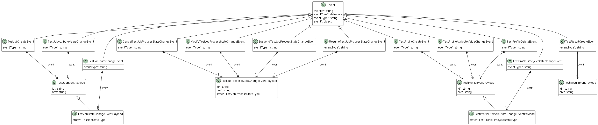

**Figure 53. Service Function Testing Notification Data Model**

This data model is used to construct requests and responses of the API
endpoints described in [5.2.2. Buyer/Client (CUS, BUS, SOF) side Service Function Testing API Endpoints](#522-buyerclient-cus-bus-sof-side-service-function-testing-api-endpoints)
### 7.3.1. Type Event

**Description:** Event class is used to describe information structure used for notification.

<table id="T_Event" style="width:100%">
    <thead style="font-weight:bold">
        <tr>
            <td>Name</td>
            <td style="width:15%">Type</td>
            <td>M/O</td>
            <td>Description</td>
            <td>MEF W136.1</td>
        </tr>
    </thead>
    <tbody>
        <tr>
        <td>eventId</td>
            <td>string</td>
            <td>M</td>
            <td>Id of the event</td>
            <td></td>
        </tr><tr>
        <td>eventTime</td>
            <td>date-time<br/><span style="font-size:10px;font-style:italic">format = date-time</span></td>
            <td>M</td>
            <td>Date-time when the event occurred</td>
            <td></td>
        </tr>
    </tbody>
</table>

### 7.3.2. Type TestJobEvent

**Description:** 

Inherits from:
- <a href="#T_Event">Event</a>


<table id="T_TestJobEvent" style="width:100%">
    <thead style="font-weight:bold">
        <tr>
            <td>Name</td>
            <td style="width:15%">Type</td>
            <td>M/O</td>
            <td>Description</td>
            <td>MEF W136.1</td>
        </tr>
    </thead>
    <tbody>
        <tr>
        <td>eventType</td>
            <td><a href="#T_TestJobEventType">TestJobEventType</a></td>
            <td>M</td>
            <td>Indicates the type of the event.
</td>
            <td></td>
        </tr><tr>
        <td>event</td>
            <td><a href="#T_TestJobEventPayload">TestJobEventPayload</a></td>
            <td>M</td>
            <td>A reference to the object that is source of the notification.
</td>
            <td></td>
        </tr>
    </tbody>
</table>

### 7.3.3. Type TestJobEventPayload

**Description:** The identifier of the Test Job being subject of this event.

<table id="T_TestJobEventPayload" style="width:100%">
    <thead style="font-weight:bold">
        <tr>
            <td>Name</td>
            <td style="width:15%">Type</td>
            <td>M/O</td>
            <td>Description</td>
            <td>MEF W136.1</td>
        </tr>
    </thead>
    <tbody>
        <tr>
        <td>id</td>
            <td>string</td>
            <td>M</td>
            <td>ID of the Test Job</td>
            <td></td>
        </tr><tr>
        <td>href</td>
            <td>string</td>
            <td>O</td>
            <td>Hyperlink to access the Test Job</td>
            <td></td>
        </tr>
    </tbody>
</table>

### 7.3.4. `enum` TestJobEventType

**Description:** Indicates the type of Test Job event.


<table id="T_TestJobEventType">
    <thead style="font-weight:bold;">
        <tr>
            <td>Value</td>
            <td>MEF W136.1</td>
        </tr>
    </thead>
    <tbody>
        <tr>
            <td>testJobCreateEvent</td>
            <td>TEST_JOB_CREATE_EVENT</td>
        </tr><tr>
            <td>testJobAttributeValueChangeEvent</td>
            <td>TEST_JOB_ATTRIBUTE_VALUE_CHANGE_EVENT</td>
        </tr><tr>
            <td>testJobStateChangeEvent</td>
            <td>TEST_JOB_STATE_CHANGE_EVENT</td>
        </tr>
    </tbody>
</table>

### 7.3.5. Type TestJobProcessEvent

**Description:** 

Inherits from:
- <a href="#T_Event">Event</a>


<table id="T_TestJobProcessEvent" style="width:100%">
    <thead style="font-weight:bold">
        <tr>
            <td>Name</td>
            <td style="width:15%">Type</td>
            <td>M/O</td>
            <td>Description</td>
            <td>MEF 136.1</td>
        </tr>
    </thead>
    <tbody>
        <tr>
        <td>eventType</td>
            <td><a href="#T_TestJobProcessEventType">TestJobProcessEventType</a></td>
            <td>M</td>
            <td>Indicates the type of the event.
</td>
            <td></td>
        </tr><tr>
        <td>event</td>
            <td><a href="#T_TestJobProcessEventPayload">TestJobProcessEventPayload</a></td>
            <td>M</td>
            <td>A reference to the object that is source of the notification.
</td>
            <td></td>
        </tr>
    </tbody>
</table>

### 7.3.6. Type TestJobProcessEventPayload

**Description:** The identifier of the Test Job Process being subject of this event.

<table id="T_TestJobProcessEventPayload" style="width:100%">
    <thead style="font-weight:bold">
        <tr>
            <td>Name</td>
            <td style="width:15%">Type</td>
            <td>M/O</td>
            <td>Description</td>
            <td>MEF 136.1</td>
        </tr>
    </thead>
    <tbody>
        <tr>
        <td>id</td>
            <td>string</td>
            <td>M</td>
            <td>ID of the Test Job Process</td>
            <td></td>
        </tr><tr>
        <td>href</td>
            <td>string</td>
            <td>O</td>
            <td>Hyperlink to access the Test Job Process</td>
            <td></td>
        </tr>
    </tbody>
</table>

### 7.3.7. `enum` TestJobProcessEventType

**Description:** Indicates the type of Test Job Process Event.


<table id="T_TestJobProcessEventType">
    <thead style="font-weight:bold;">
        <tr>
            <td>Value</td>
            <td>MEF 136.1</td>
        </tr>
    </thead>
    <tbody>
        <tr>
            <td>cancelTestJobStateChangeEvent</td>
            <td>CANCEL_TEST_JOB_STATE_CHANGE_EVENT</td>
        </tr><tr>
            <td>modifyTestJobStateChangeEvent</td>
            <td>MODIFY_TEST_JOB_STATE_CHANGE_EVENT</td>
        </tr><tr>
            <td>suspendTestJobStateChangeEvent</td>
            <td>SUSPEND_TEST_JOB_STATE_CHANGE_EVENT</td>
        </tr><tr>
            <td>resumeTestJobStateChangeEvent</td>
            <td>RESUME_TEST_JOB_STATE_CHANGE_EVENT</td>
        </tr>
    </tbody>
</table>


### 7.3.8. Type TestProfileEvent

**Description:** 

Inherits from:
- <a href="#T_Event">Event</a>


<table id="T_TestProfileEvent" style="width:100%">
    <thead style="font-weight:bold">
        <tr>
            <td>Name</td>
            <td style="width:15%">Type</td>
            <td>M/O</td>
            <td>Description</td>
            <td>MEF W136.1</td>
        </tr>
    </thead>
    <tbody>
        <tr>
        <td>eventType</td>
            <td><a href="#T_TestProfileEventType">TestProfileEventType</a></td>
            <td>M</td>
            <td>Indicates the type of the event.
</td>
            <td></td>
        </tr><tr>
        <td>event</td>
            <td><a href="#T_TestProfileEventPayload">TestProfileEventPayload</a></td>
            <td>M</td>
            <td>A reference to the object that is source of the notification.
</td>
            <td></td>
        </tr>
    </tbody>
</table>


### 7.3.9. Type TestProfileEventPayload

**Description:** The identifier of the Test Profile being subject of this event.

<table id="T_TestProfileEventPayload" style="width:100%">
    <thead style="font-weight:bold">
        <tr>
            <td>Name</td>
            <td style="width:15%">Type</td>
            <td>M/O</td>
            <td>Description</td>
            <td>MEF W136.1</td>
        </tr>
    </thead>
    <tbody>
        <tr>
        <td>id</td>
            <td>string</td>
            <td>M</td>
            <td>ID of the Test Profile</td>
            <td></td>
        </tr><tr>
        <td>href</td>
            <td>string</td>
            <td>O</td>
            <td>Hyperlink to access the Test Profile</td>
            <td></td>
        </tr>
    </tbody>
</table>

### 7.3.10. `enum` TestProfileEventType

**Description:** Indicates the type of Test Profile event.


<table id="T_TestProfileEventType">
    <thead style="font-weight:bold;">
        <tr>
            <td>Value</td>
            <td>MEF W136.1</td>
        </tr>
    </thead>
    <tbody>
        <tr>
            <td>testProfileCreateEvent</td>
            <td>TEST_PROFILE_CREATE_EVENT</td>
        </tr><tr>
            <td>testProfileAttributeValueChangeEvent</td>
            <td>TEST_PROFILE_ATTRIBUTE_VALUE_CHANGE_EVENT</td>
        </tr><tr>
            <td>testProfileDeleteEvent</td>
            <td>TEST_PROFILE_DELETE_EVENT</td>
        </tr><tr>
            <td>testProfileStateChangeEvent</td>
            <td>TEST_PROFILE_STATE_CHANGE_EVENT</td>
        </tr>
    </tbody>
</table>

<div class="page"/>

# 8. References
- [JSON Schema draft 7](https://json-schema.org/specification-links.html#draft-7),
  JSON Schema: A Media Type for Describing JSON Documents and associated
  documents, by Austin Wright and Henry Andrews, March 2018. Copyright © 2018
  IETF Trust and the persons identified as the document authors. All rights
  reserved.
- [MEF55.1]
  [MEF 55.1](https://www.mef.net/wp-content/uploads/2021/02/MEF-55.1.pdf),
  Lifecycle Service Orchestration (LSO): Reference Architecture and Framework,
  February 2021
- [MEF128.1] [MEF 128.1](https://www.mef.net/wp-content/uploads/MEF-128.1.pdf), LSO
  API Security Profile, April 2024
- [MEFW136.1] [MEF W136.1]
  Allegro, Interlude and Legato Fault Management and Service Function Testing BR&UC, June 2023
- [MEF152] [MEF 152]
  Carrier Ethernet Payload Schema/Guide for SOAM
- [MEF153] [MEF 153]
  IP/IPVPN Schema/Guide for SOAM
- [MEF154] [MEF 154]
  SD-WAN Schema/Guide for SOAM
- [OAS-v3] [Open API 3.0](http://spec.openapis.org/oas/v3.0.3.html), February
  2020
- [REST]
  [Chapter 5: Representational State Transfer (REST)](http://www.ics.uci.edu/~fielding/pubs/dissertation/rest_arch_style.htm)
  Fielding, Roy Thomas, Architectural Styles and the Design of Network-based
  Software Architectures (Ph.D.).
- [RFC2119] [RFC 2119](https://tools.ietf.org/html/rfc2119), Key words for use
  in RFCs to Indicate Requirement Levels, by S. Bradner, March 1997
- [RFC3986] [RFC 3986](https://tools.ietf.org/html/rfc3986#section-3) Uniform
  Resource Identifier (URI): Generic Syntax, January 2005
- [RFC8174] [RFC 8174](https://tools.ietf.org/html/rfc8174), Ambiguity of
  Uppercase vs Lowercase in RFC 2119 Key Words, by B. Leiba, May 2017,
  Copyright © 2017 IETF Trust and the persons identified as the document
  authors. All rights reserved.
- [TMF630]
  [TMF 630](https://www.tmforum.org/resources/specification/tmf630-rest-api-design-guidelines-4-2-0/)
  TMF630 API Design Guidelines 4.2.0
- [TMF653]
  [TMF 653](https://www.tmforum.org/resources/specification/tmf653-service-test-management-api-user-guide-v4-1-0/),
 TMF653 Service Test Management API User Guide v4.1.0, July 2021

